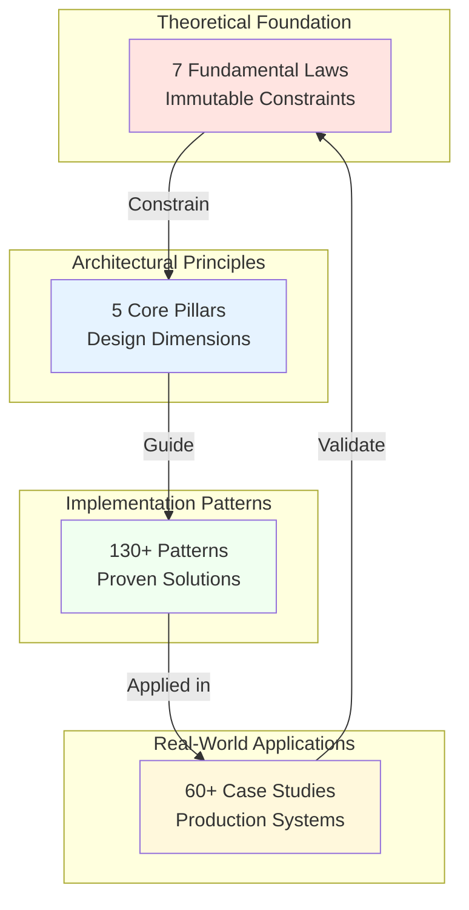
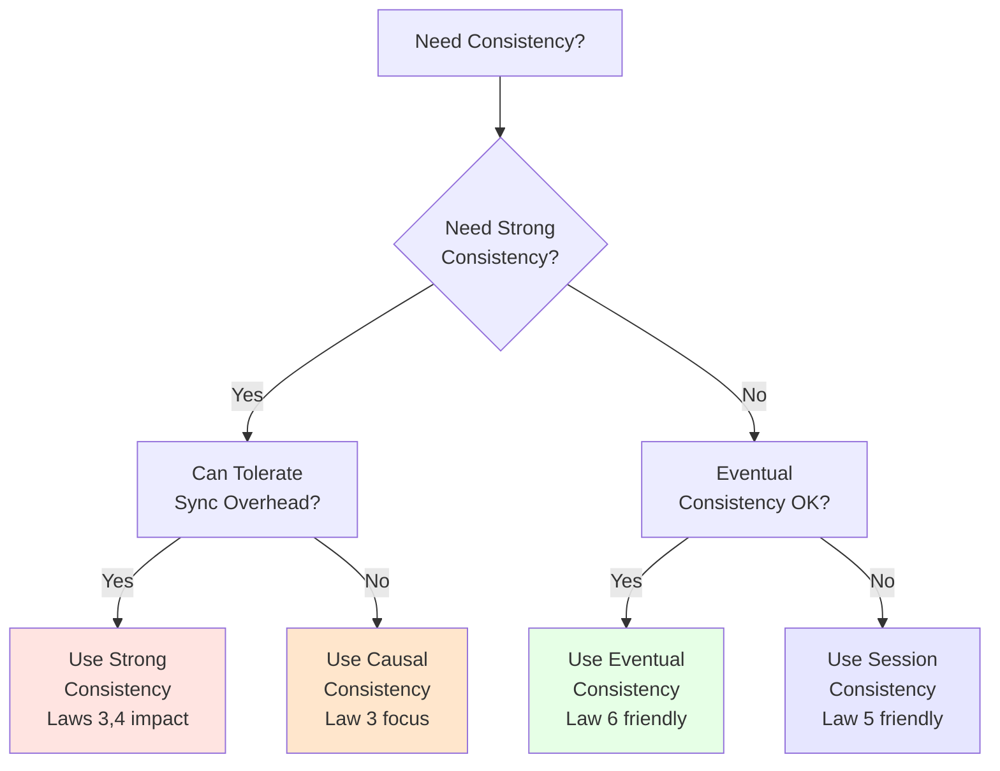
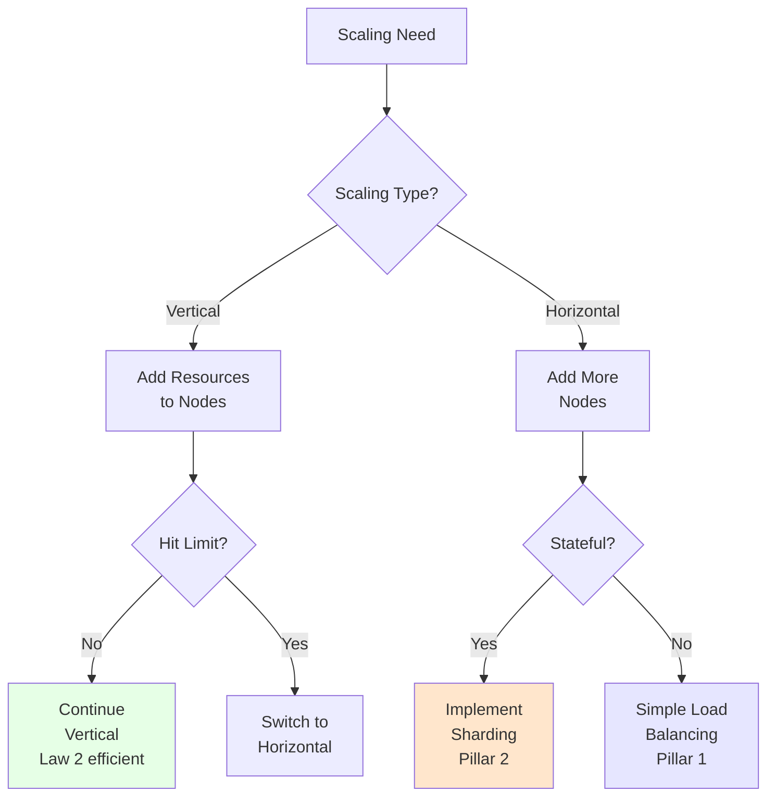

# Cross-Reference Guide

This guide provides a comprehensive mapping between DStudio's four main conceptual layers, helping architects understand how theoretical principles translate into practical patterns and real-world implementations.

## Quick Navigation Matrix

| Start From | Want To Find | Go To |
|------------|--------------|-------|
| **A Law** | Patterns that address it | [Law → Pattern Mapping](#law-to-pattern-mapping) |
| **A Law** | Pillars it affects | [Law → Pillar Relationships](#law-to-pillar-relationships) |
| **A Law** | Case studies demonstrating it | [Law → Case Study Examples](#law-to-case-study-examples) |
| **A Pillar** | Patterns that implement it | [Pillar → Pattern Mapping](#pillar-to-pattern-mapping) |
| **A Pillar** | Laws that constrain it | [Pillar → Law Dependencies](#pillar-to-law-dependencies) |
| **A Pattern** | Laws it addresses | [Pattern → Law Solutions](#pattern-to-law-solutions) |
| **A Pattern** | Pillars it supports | [Pattern → Pillar Support](#pattern-to-pillar-support) |
| **A Case Study** | Patterns used | [Case Study Pattern Analysis](#case-study-pattern-analysis) |

## Conceptual Hierarchy



## Law → Pattern Mapping

### Law 1: Correlated Failure
**Core Insight**: Failures cluster and cascade through hidden dependencies

| Pattern Category | Key Patterns | Why It Helps |
|-----------------|--------------|--------------|
| **Resilience** | [Circuit Breaker](../pattern-library/resilience/circuit-breaker.md) | Prevents cascade failures |
| | [Bulkhead](../pattern-library/resilience/bulkhead.md) | Isolates failure domains |
| | [Cell-Based Architecture](../pattern-library/architecture/cell-based.md) | Contains blast radius |
| **Coordination** | [Chaos Engineering](../pattern-library/resilience/chaos-engineering.md) | Tests correlation assumptions |
| **Scaling** | [Shuffle Sharding](../pattern-library/scaling/shuffle-sharding.md) | Reduces correlation probability |

### Law 2: Economic Reality
**Core Insight**: Every architectural decision has direct and hidden costs

| Pattern Category | Key Patterns | Why It Helps |
|-----------------|--------------|--------------|
| **Optimization** | [Caching](../pattern-library/data-management/caching.md) | Reduces compute costs |
| | [CDN](../pattern-library/scaling/content-delivery-network.md) | Minimizes bandwidth costs |
| | [Auto-scaling](../pattern-library/scaling/auto-scaling.md) | Optimizes resource usage |
| **Architecture** | [Serverless](../pattern-library/architecture/serverless.md) | Pay-per-use model |
| | [Edge Computing](../pattern-library/scaling/edge-computing.md) | Reduces data transfer costs |

### Law 3: Temporal Constraints
**Core Insight**: Perfect synchronization is impossible; time is relative

| Pattern Category | Key Patterns | Why It Helps |
|-----------------|--------------|--------------|
| **Coordination** | [Vector Clocks](../pattern-library/coordination/vector-clocks.md) | Tracks causal ordering |
| | [Hybrid Logical Clocks](../pattern-library/coordination/hybrid-logical-clocks.md) | Combines physical and logical time |
| | [Lamport Timestamps](../pattern-library/coordination/lamport-timestamps.md) | Establishes event ordering |
| **Data** | [Event Sourcing](../pattern-library/data-management/event-sourcing.md) | Time-based state reconstruction |

### Law 4: Asynchronous Reality
**Core Insight**: Networks partition; latency is non-zero

| Pattern Category | Key Patterns | Why It Helps |
|-----------------|--------------|--------------|
| **Communication** | [Async Messaging](../pattern-library/communication/async-messaging.md) | Embraces network delays |
| | [Message Queue](../pattern-library/communication/message-queue.md) | Decouples time dependencies |
| **Resilience** | [Retry with Backoff](../pattern-library/resilience/retry-backoff.md) | Handles transient failures |
| | [Timeout](../pattern-library/resilience/timeout.md) | Prevents infinite waits |

### Law 5: Cognitive Load
**Core Insight**: Human understanding limits system complexity

| Pattern Category | Key Patterns | Why It Helps |
|-----------------|--------------|--------------|
| **Architecture** | [Microservices](../pattern-library/architecture/microservices.md) | Bounded contexts |
| | [API Gateway](../pattern-library/architecture/api-gateway.md) | Single entry point |
| **Operational** | [Service Mesh](../pattern-library/architecture/service-mesh.md) | Centralized control plane |
| | [GitOps](../pattern-library/operational/gitops.md) | Declarative operations |

### Law 6: Distributed Knowledge
**Core Insight**: No single node knows everything

| Pattern Category | Key Patterns | Why It Helps |
|-----------------|--------------|--------------|
| **Consensus** | [Raft](../pattern-library/coordination/raft.md) | Shared agreement protocol |
| | [Paxos](../pattern-library/coordination/paxos.md) | Distributed consensus |
| **Data** | [CRDT](../pattern-library/data-management/crdt.md) | Conflict-free replication |
| | [Gossip Protocol](../pattern-library/communication/gossip.md) | Eventually consistent knowledge |

### Law 7: Emergent Chaos
**Core Insight**: Complex systems exhibit unpredictable behavior

| Pattern Category | Key Patterns | Why It Helps |
|-----------------|--------------|--------------|
| **Resilience** | [Chaos Engineering](../pattern-library/resilience/chaos-engineering.md) | Controlled chaos injection |
| | [Canary Deployment](../pattern-library/deployment/canary.md) | Gradual change rollout |
| **Monitoring** | [Distributed Tracing](../pattern-library/observability/distributed-tracing.md) | Emergence visibility |

## Pillar → Pattern Mapping

### Pillar 1: Work Distribution
**Focus**: Spreading computational tasks across nodes

| Pattern Type | Essential Patterns | Advanced Patterns |
|-------------|-------------------|-------------------|
| **Load Distribution** | [Load Balancing](../pattern-library/scaling/load-balancing.md) | [Consistent Hashing](../pattern-library/scaling/consistent-hashing.md) |
| **Task Management** | [Work Queue](../pattern-library/communication/work-queue.md) | [Work Stealing](../pattern-library/scaling/work-stealing.md) |
| **Parallel Processing** | [MapReduce](../pattern-library/data-management/mapreduce.md) | [Fork-Join](../pattern-library/scaling/fork-join.md) |
| **Resource Management** | [Auto-scaling](../pattern-library/scaling/auto-scaling.md) | [Elastic Computing](../pattern-library/scaling/elastic.md) |

### Pillar 2: State Distribution
**Focus**: Managing data placement and consistency

| Pattern Type | Essential Patterns | Advanced Patterns |
|-------------|-------------------|-------------------|
| **Data Partitioning** | [Sharding](../pattern-library/scaling/sharding.md) | [Shuffle Sharding](../pattern-library/scaling/shuffle-sharding.md) |
| **Replication** | [Primary-Replica](../pattern-library/data-management/primary-replica.md) | [Multi-Primary](../pattern-library/data-management/multi-primary.md) |
| **Consistency** | [Eventual Consistency](../pattern-library/data-management/eventual-consistency.md) | [Causal Consistency](../pattern-library/data-management/causal-consistency.md) |
| **Conflict Resolution** | [Last Writer Wins](../pattern-library/data-management/lww.md) | [CRDT](../pattern-library/data-management/crdt.md) |

### Pillar 3: Truth Distribution
**Focus**: Establishing consensus and agreement

| Pattern Type | Essential Patterns | Advanced Patterns |
|-------------|-------------------|-------------------|
| **Consensus** | [Raft](../pattern-library/coordination/raft.md) | [Byzantine Fault Tolerance](../pattern-library/coordination/bft.md) |
| **Ordering** | [Vector Clocks](../pattern-library/coordination/vector-clocks.md) | [Hybrid Logical Clocks](../pattern-library/coordination/hlc.md) |
| **Quorum** | [Majority Quorum](../pattern-library/coordination/quorum.md) | [Flexible Quorum](../pattern-library/coordination/flexible-quorum.md) |
| **Coordination** | [Two-Phase Commit](../pattern-library/coordination/2pc.md) | [Three-Phase Commit](../pattern-library/coordination/3pc.md) |

### Pillar 4: Control Distribution
**Focus**: Coordinating behavior and handling failures

| Pattern Type | Essential Patterns | Advanced Patterns |
|-------------|-------------------|-------------------|
| **Failure Management** | [Circuit Breaker](../pattern-library/resilience/circuit-breaker.md) | [Adaptive Circuit Breaker](../pattern-library/resilience/adaptive-cb.md) |
| **Orchestration** | [Saga Pattern](../pattern-library/coordination/saga.md) | [Workflow Engine](../pattern-library/coordination/workflow.md) |
| **Monitoring** | [Health Checks](../pattern-library/observability/health-checks.md) | [Distributed Tracing](../pattern-library/observability/distributed-tracing.md) |
| **Adaptation** | [Auto-scaling](../pattern-library/scaling/auto-scaling.md) | [Predictive Scaling](../pattern-library/scaling/predictive.md) |

### Pillar 5: Intelligence Distribution
**Focus**: Placing algorithms and decision logic optimally

| Pattern Type | Essential Patterns | Advanced Patterns |
|-------------|-------------------|-------------------|
| **Edge Intelligence** | [Edge Computing](../pattern-library/scaling/edge-computing.md) | [Fog Computing](../pattern-library/scaling/fog.md) |
| **Learning Systems** | [Federated Learning](../pattern-library/ml/federated-learning.md) | [Transfer Learning](../pattern-library/ml/transfer.md) |
| **Decision Making** | [A/B Testing](../pattern-library/experimentation/ab-testing.md) | [Multi-Armed Bandits](../pattern-library/ml/mab.md) |
| **Adaptation** | [Feature Flags](../pattern-library/deployment/feature-flags.md) | [Progressive Delivery](../pattern-library/deployment/progressive.md) |

## Case Study Pattern Analysis

### Tier 1: Internet Scale Systems

| Case Study | Scale | Key Patterns Applied | Laws Addressed |
|-----------|-------|---------------------|----------------|
| **[Amazon DynamoDB](../architects-handbook/case-studies/databases/amazon-dynamo.md)** | 10T+ requests/day | Consistent Hashing, Vector Clocks, Quorum, Gossip Protocol | Laws 1, 3, 4, 6 |
| **[Google Spanner](../architects-handbook/case-studies/databases/google-spanner.md)** | Exabyte scale | TrueTime, Paxos, 2PC, Sharding | Laws 3, 4, 6 |
| **[Apache Kafka](../architects-handbook/case-studies/messaging-streaming/kafka.md)** | 1T+ events/day | Event Sourcing, Partitioning, Leader-Follower, Log Compaction | Laws 1, 4, 6 |
| **[Netflix Streaming](../architects-handbook/case-studies/messaging-streaming/netflix-streaming.md)** | 200M+ users | CDN, Chaos Engineering, Circuit Breaker, Auto-scaling | Laws 1, 2, 7 |

### Tier 2: Large Scale Systems

| Case Study | Scale | Key Patterns Applied | Laws Addressed |
|-----------|-------|---------------------|----------------|
| **[WhatsApp Architecture](../architects-handbook/case-studies/social-communication/chat-system.md)** | 100B msgs/day | WebSocket, End-to-End Encryption, Message Queue, Sharding | Laws 1, 4, 5 |
| **[Uber Location](../architects-handbook/case-studies/location-services/uber-location.md)** | 5M+ drivers | Geohashing, H3, Pub-Sub, Stream Processing | Laws 2, 4, 6 |
| **[Slack Infrastructure](../architects-handbook/case-studies/social-communication/slack-infrastructure.md)** | 12M+ DAU | WebSocket, Fanout, Cache-Aside, Rate Limiting | Laws 1, 4, 5 |

## Pattern Combination Recipes

### Recipe 1: Building a Resilient Microservice
**Goal**: Service that handles 100K RPS with 99.99% availability

```yaml
foundation:
  - Circuit Breaker      # Prevent cascade failures (Law 1)
  - Retry with Backoff   # Handle transient failures (Law 4)
  - Bulkhead            # Isolate resources (Law 1)
  - Health Checks       # Enable monitoring (Law 5)

scaling:
  - Auto-scaling        # Handle load variations (Law 2)
  - Load Balancing      # Distribute work (Pillar 1)
  - Caching            # Reduce latency (Law 2)

data:
  - Primary-Replica     # High availability (Pillar 2)
  - Event Sourcing      # Audit trail (Law 3)
  - CQRS               # Read/write optimization (Pillar 1)
```

### Recipe 2: Global Database with Strong Consistency
**Goal**: Planet-scale database with ACID guarantees

```yaml
consensus:
  - Raft/Paxos         # Distributed consensus (Pillar 3)
  - Two-Phase Commit   # Transaction coordination (Pillar 3)
  - Vector Clocks      # Conflict detection (Law 3)

distribution:
  - Sharding           # Horizontal scaling (Pillar 2)
  - Geo-replication    # Global availability (Pillar 2)
  - Quorum Reads       # Tunable consistency (Pillar 3)

optimization:
  - Hybrid Logical Clocks  # Global ordering (Law 3)
  - Adaptive Indexes       # Query optimization (Pillar 5)
  - Compression           # Storage efficiency (Law 2)
```

### Recipe 3: Real-time Streaming Platform
**Goal**: Process 1M events/second with <100ms latency

```yaml
ingestion:
  - Pub-Sub            # Decoupled producers (Pillar 1)
  - Partitioning       # Parallel processing (Pillar 1)
  - Backpressure       # Flow control (Pillar 4)

processing:
  - Stream Processing  # Real-time computation (Pillar 1)
  - Windowing         # Time-based aggregation (Law 3)
  - Exactly-Once      # Delivery guarantees (Pillar 3)

storage:
  - Event Sourcing    # Immutable log (Law 3)
  - Log Compaction    # Space efficiency (Law 2)
  - Tiered Storage    # Cost optimization (Law 2)
```

## Decision Trees

### Choosing a Consistency Model



### Selecting a Scaling Strategy



## Anti-Pattern Recognition

### Common Violations and Corrections

| Anti-Pattern | Violates | Symptoms | Correction |
|-------------|----------|----------|------------|
| **Single Point of Failure** | Law 1 (Correlated Failure) | Total system outage from one component | Add redundancy, implement bulkheads |
| **Synchronous Everything** | Law 4 (Async Reality) | Cascading timeouts, poor scalability | Introduce async messaging, queues |
| **Global Locks** | Laws 3, 4, 6 | Performance bottlenecks, deadlocks | Use optimistic concurrency, CRDTs |
| **Ignored Backpressure** | Law 7 (Emergent Chaos) | OOM errors, cascading failures | Implement flow control, circuit breakers |
| **Over-engineering** | Law 5 (Cognitive Load) | Team can't understand system | Simplify, document, modularize |

## Learning Paths

### Path 1: Building Your First Distributed System
1. **Start**: Laws 1, 4 (Failure and Networks)
2. **Then**: Pillar 1 (Work Distribution)
3. **Apply**: Load Balancing, Retry patterns
4. **Study**: Kafka case study

### Path 2: Data Consistency Mastery
1. **Start**: Laws 3, 6 (Time and Knowledge)
2. **Then**: Pillars 2, 3 (State and Truth)
3. **Apply**: Replication, Consensus patterns
4. **Study**: Spanner case study

### Path 3: Operating at Scale
1. **Start**: Laws 2, 7 (Economics and Chaos)
2. **Then**: Pillars 4, 5 (Control and Intelligence)
3. **Apply**: Monitoring, Auto-scaling patterns
4. **Study**: Netflix case study

## Quick Reference Tables

### Pattern Complexity vs Impact

| Pattern | Implementation Complexity | Performance Impact | When Essential |
|---------|--------------------------|-------------------|----------------|
| **Circuit Breaker** | Low | High | Always |
| **Caching** | Low | Very High | >1000 RPS |
| **Sharding** | High | Very High | >100GB data |
| **Consensus (Raft)** | Very High | Medium | Strong consistency |
| **CRDT** | High | High | Multi-region active-active |
| **Chaos Engineering** | Medium | Low (preventive) | >99.9% SLA |

### Law Impact on Architecture Decisions

| Decision | Most Impacted By | Key Consideration |
|----------|-----------------|-------------------|
| **Database Choice** | Laws 3, 4, 6 | CAP theorem trade-offs |
| **Caching Strategy** | Laws 2, 6 | Cost vs consistency |
| **Replication Factor** | Laws 1, 2 | Reliability vs cost |
| **Timeout Values** | Laws 4, 7 | Latency vs failure detection |
| **Monitoring Depth** | Laws 5, 7 | Observability vs complexity |

## Conclusion

This cross-reference guide demonstrates how DStudio's conceptual layers work together:

1. **Laws** define immutable constraints that cannot be overcome
2. **Pillars** provide architectural dimensions for system design
3. **Patterns** offer proven solutions to recurring problems
4. **Case Studies** validate patterns in production environments

Use this guide to:
- Navigate from problems (Laws) to solutions (Patterns)
- Understand which patterns support which architectural goals (Pillars)
- Learn from real implementations (Case Studies)
- Build robust systems by combining patterns appropriately

Remember: No pattern exists in isolation. The most successful systems thoughtfully combine multiple patterns while respecting fundamental laws and balancing architectural pillars.