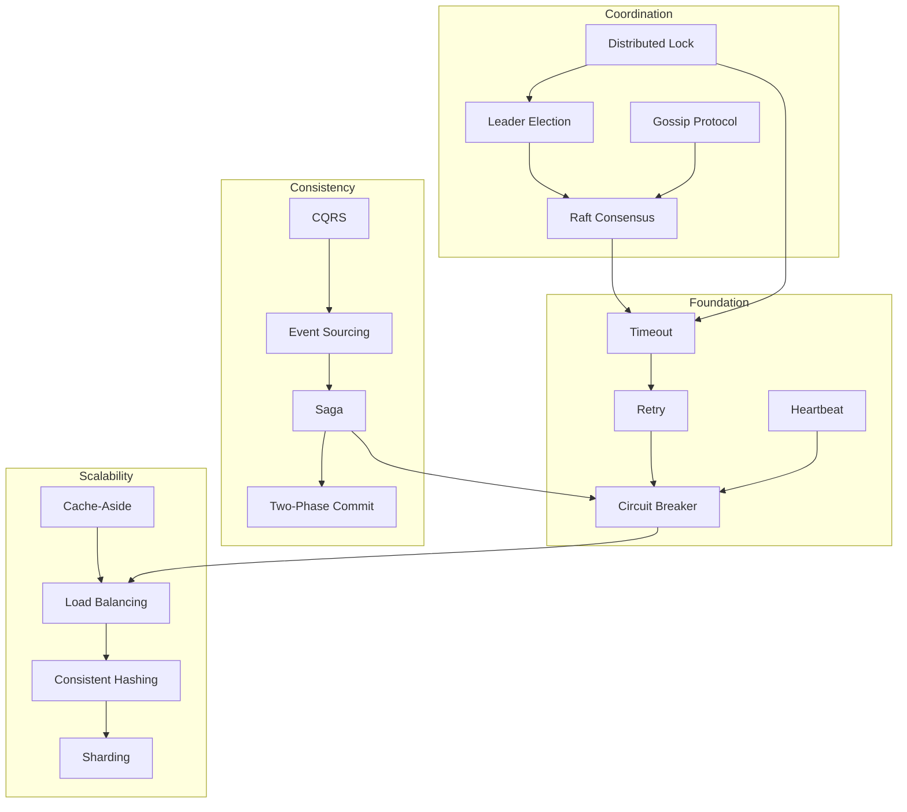

# Cross-Reference Matrix: Laws ↔ Pillars ↔ Patterns

## Overview
This matrix maps the relationships between Fundamental Laws, Core Pillars, and Pattern implementations in distributed systems. Use this as a navigation guide to understand how theoretical principles translate into practical patterns.

## Quick Navigation
- [Laws to Pillars Mapping](#laws-to-pillars-mapping)
- [Pillars to Patterns Mapping](#pillars-to-patterns-mapping)
- [Laws to Patterns Direct Mapping](#laws-to-patterns-direct-mapping)
- [Pattern Dependency Graph](#pattern-dependency-graph)

## Laws to Pillars Mapping

| Fundamental Law | Work Distribution | State Distribution | Truth Distribution | Control Distribution | Intelligence Distribution |
|-----------------|-------------------|--------------------|--------------------|---------------------|--------------------------|
| **[Law of Asynchronous Reality](../core-principles/laws/asynchronous-reality.md)** | ⚡ High Impact • Task coordination • Pipeline delays • Worker synchronization | ⚡ High Impact • Replication lag • Consistency windows • State convergence | ⚡ High Impact • Clock skew • Consensus delays • Truth propagation | 🔄 Medium Impact • Control lag • Feedback delays • Stabilization time | 🔄 Medium Impact • Model sync • Decision latency • Learning delays |
| **[Law of Correlated Failure](../core-principles/laws/correlated-failure.md)** | 🔄 Medium Impact • Worker pool failures • Task redistribution • Cascade prevention | ⚡ High Impact • Replica correlation • Partition failures • Data loss scenarios | 🔄 Medium Impact • Consensus disruption • Split-brain risk • Quorum loss | ⚡ High Impact • Control plane failure • Cascading shutdowns • Stability loss | 🔄 Medium Impact • Model serving failures • Training disruption • Intelligence gaps |
| **[Law of Distributed Knowledge](../core-principles/laws/distributed-knowledge.md)** | 🔄 Medium Impact • Task visibility • Progress tracking • Coordination overhead | ⚡ High Impact • State synchronization • Consistency models • Conflict resolution | ⚡ High Impact • Consensus protocols • Byzantine agreement • Knowledge propagation | ⚡ High Impact • Observability limits • Decision accuracy • Control accuracy | ⚡ High Impact • Distributed learning • Model consistency • Knowledge fusion |
| **[Law of Economic Reality](../core-principles/laws/economic-reality.md)** | ⚡ High Impact • Compute costs • Parallelization ROI • Resource efficiency | ⚡ High Impact • Storage costs • Replication trade-offs • Consistency costs | 🔄 Medium Impact • Consensus overhead • Coordination costs • Network expenses | 🔄 Medium Impact • Control overhead • Monitoring costs • Operational burden | ⚡ High Impact • Model training costs • Inference expenses • Edge deployment |
| **[Law of Cognitive Load](../core-principles/laws/cognitive-load.md)** | 🔄 Medium Impact • Task complexity • Worker interfaces • Debugging difficulty | 🔄 Medium Impact • State management • Consistency reasoning • Data flow understanding | ⚡ High Impact • Consensus complexity • Protocol understanding • Failure reasoning | ⚡ High Impact • Control complexity • System observability • Alert fatigue | 🔄 Medium Impact • Model complexity • Decision transparency • System understanding |
| **[Law of Emergent Behavior](../core-principles/laws/emergent-behavior.md)** | 🔄 Medium Impact • Load patterns • Work clustering • Unexpected hotspots | ⚡ High Impact • State evolution • Consistency drift • Emergent conflicts | 🔄 Medium Impact • Consensus dynamics • Network effects • Protocol interactions | ⚡ High Impact • Control oscillations • Feedback loops • System resonance | ⚡ High Impact • Learning dynamics • Model interactions • Emergent intelligence |
| **[Law of Persistent Uncertainty](../core-principles/laws/persistent-uncertainty.md)** | 🔄 Medium Impact • Task status • Worker health • Progress estimation | ⚡ High Impact • State consistency • Partition detection • Failure detection | ⚡ High Impact • Byzantine failures • Network partitions • Trust boundaries | ⚡ High Impact • System state • Failure detection • Health assessment | 🔄 Medium Impact • Model accuracy • Decision confidence • Prediction uncertainty |

**Legend:**
- ⚡ **High Impact**: This law fundamentally constrains this pillar
- 🔄 **Medium Impact**: This law significantly affects this pillar
- ○ **Low Impact**: This law has minimal effect on this pillar (not shown)

## Pillars to Patterns Mapping

### Work Distribution Patterns

| Pattern Category | Key Patterns | Primary Use Cases | Trade-offs |
|------------------|--------------|-------------------|------------|
| **Task Scheduling** | • [MapReduce](../pattern-library/scaling/mapreduce.md) • [Fork-Join](../pattern-library/coordination/fork-join.md) • [Work Stealing](../pattern-library/coordination/work-stealing.md) | • Batch processing • Parallel computation • Load balancing | Performance vs. Complexity |
| **Queue Management** | • [Message Queue](../pattern-library/coordination/message-queue.md) • [Priority Queue](../pattern-library/coordination/priority-queue.md) • [Backpressure](../pattern-library/resilience/backpressure.md) | • Task buffering • Flow control • Overload protection | Latency vs. Throughput |
| **Load Distribution** | • [Consistent Hashing](../pattern-library/data-management/consistent-hashing.md) • [Load Balancing](../pattern-library/scaling/load-balancing.md) • [Sharding](../pattern-library/scaling/sharding.md) | • Request routing • Data partitioning • Resource allocation | Uniformity vs. Locality |

### State Distribution Patterns

| Pattern Category | Key Patterns | Primary Use Cases | Trade-offs |
|------------------|--------------|-------------------|------------|
| **Consistency Models** | • [Event Sourcing](../pattern-library/data-management/event-sourcing.md) • [CQRS](../pattern-library/data-management/cqrs.md) • [Saga](../pattern-library/coordination/saga.md) | • Event-driven state • Read/write separation • Distributed transactions | Consistency vs. Availability |
| **Replication** | • [Master-Slave](../pattern-library/data-management/master-slave.md) • [Multi-Master](../pattern-library/data-management/multi-master.md) • [Chain Replication](../pattern-library/data-management/chain-replication.md) | • Data durability • Read scaling • Geo-distribution | Consistency vs. Performance |
| **Conflict Resolution** | • [Vector Clocks](../pattern-library/data-management/vector-clocks.md) • [CRDTs](../pattern-library/data-management/crdts.md) • [Last-Write-Wins](../pattern-library/data-management/lww.md) | • Concurrent updates • Eventual consistency • Merge strategies | Accuracy vs. Simplicity |

### Truth Distribution Patterns

| Pattern Category | Key Patterns | Primary Use Cases | Trade-offs |
|------------------|--------------|-------------------|------------|
| **Consensus Protocols** | • [Raft](../pattern-library/coordination/raft.md) • [Paxos](../pattern-library/coordination/paxos.md) • [PBFT](../pattern-library/coordination/pbft.md) | • Leader election • Distributed agreement • Byzantine tolerance | Safety vs. Liveness |
| **Time Synchronization** | • [Lamport Clocks](../pattern-library/coordination/lamport-clocks.md) • [Vector Clocks](../pattern-library/data-management/vector-clocks.md) • [Hybrid Logical Clocks](../pattern-library/coordination/hlc.md) | • Event ordering • Causality tracking • Global time | Accuracy vs. Overhead |
| **Distributed Locking** | • [Redlock](../pattern-library/coordination/redlock.md) • [Chubby/Zookeeper](../pattern-library/coordination/distributed-lock.md) • [Lease-Based](../pattern-library/coordination/lease.md) | • Mutual exclusion • Resource coordination • Critical sections | Safety vs. Availability |

### Control Distribution Patterns

| Pattern Category | Key Patterns | Primary Use Cases | Trade-offs |
|------------------|--------------|-------------------|------------|
| **Failure Management** | • [Circuit Breaker](../pattern-library/resilience/circuit-breaker.md) • [Bulkhead](../pattern-library/resilience/bulkhead.md) • [Timeout](../pattern-library/resilience/timeout.md) | • Fault isolation • Cascade prevention • Resource protection | Safety vs. Availability |
| **Load Management** | • [Load Shedding](../pattern-library/resilience/load-shedding.md) • [Rate Limiting](../pattern-library/resilience/rate-limiting.md) • [Throttling](../pattern-library/resilience/throttling.md) | • Overload protection • QoS enforcement • Resource allocation | Fairness vs. Efficiency |
| **Health & Recovery** | • [Health Checks](../pattern-library/resilience/health-check.md) • [Retry](../pattern-library/resilience/retry-backoff.md) • [Failover](../pattern-library/resilience/failover.md) | • Failure detection • Automatic recovery • Service continuity | Speed vs. Accuracy |

### Intelligence Distribution Patterns

| Pattern Category | Key Patterns | Primary Use Cases | Trade-offs |
|------------------|--------------|-------------------|------------|
| **Model Distribution** | • [Federated Learning](../pattern-library/intelligence/federated-learning.md) • [Model Parallelism](../pattern-library/intelligence/model-parallelism.md) • [Edge Intelligence](../pattern-library/intelligence/edge-intelligence.md) | • Privacy-preserving ML • Large model training • Low-latency inference | Accuracy vs. Latency |
| **Decision Distribution** | • [Hierarchical Control](../pattern-library/intelligence/hierarchical-control.md) • [Swarm Intelligence](../pattern-library/intelligence/swarm.md) • [Multi-Agent Systems](../pattern-library/intelligence/multi-agent.md) | • Distributed decisions • Emergent behavior • Autonomous coordination | Optimality vs. Speed |
| **Learning Distribution** | • [Online Learning](../pattern-library/intelligence/online-learning.md) • [Transfer Learning](../pattern-library/intelligence/transfer-learning.md) • [Ensemble Methods](../pattern-library/intelligence/ensemble.md) | • Continuous adaptation • Knowledge sharing • Robust predictions | Adaptability vs. Stability |

## Laws to Patterns Direct Mapping

### Patterns Addressing Each Law

| Fundamental Law | Essential Patterns | Mitigation Strategies |
|-----------------|-------------------|----------------------|
| **Asynchronous Reality** | • [Timeout](../pattern-library/resilience/timeout.md) - Bounded waiting • [Async Messaging](../pattern-library/coordination/async-messaging.md) - Decoupling • [Event Sourcing](../pattern-library/data-management/event-sourcing.md) - Temporal modeling • [Saga](../pattern-library/coordination/saga.md) - Long-running transactions | • Use timeouts everywhere • Design for eventual consistency • Implement idempotency • Add compensation logic |
| **Correlated Failure** | • [Bulkhead](../pattern-library/resilience/bulkhead.md) - Isolation boundaries • [Cell-Based Architecture](../pattern-library/architecture/cell-based.md) - Blast radius control • [Circuit Breaker](../pattern-library/resilience/circuit-breaker.md) - Cascade prevention • [Chaos Engineering](../pattern-library/testing/chaos-engineering.md) - Correlation discovery | • Isolate failure domains • Reduce shared dependencies • Implement shuffle sharding • Test failure scenarios |
| **Distributed Knowledge** | • [Gossip Protocol](../pattern-library/coordination/gossip.md) - Information dissemination • [CRDTs](../pattern-library/data-management/crdts.md) - Convergent state • [Vector Clocks](../pattern-library/data-management/vector-clocks.md) - Causality tracking • [Quorum](../pattern-library/coordination/quorum.md) - Partial knowledge decisions | • Use eventual consistency • Implement read repair • Add conflict resolution • Design for split-brain |
| **Economic Reality** | • [Caching](../pattern-library/scaling/cache-aside.md) - Cost reduction • [Compression](../pattern-library/optimization/compression.md) - Bandwidth savings • [Tiered Storage](../pattern-library/data-management/tiered-storage.md) - Cost optimization • [Spot Instances](../pattern-library/cost/spot-instances.md) - Compute savings | • Measure TCO continuously • Implement cost alerting • Use reserved capacity • Optimize hot paths |
| **Cognitive Load** | • [Progressive Disclosure](../pattern-library/ux/progressive-disclosure.md) - Complexity hiding • [Dashboard Aggregation](../pattern-library/observability/dashboard.md) - Information reduction • [Runbook Automation](../pattern-library/operations/runbook.md) - Decision support • [Service Mesh](../pattern-library/architecture/service-mesh.md) - Complexity abstraction | • Limit dashboard metrics • Automate routine tasks • Use clear abstractions • Implement smart defaults |
| **Emergent Behavior** | • [Feedback Control](../pattern-library/control/feedback.md) - Behavior regulation • [Backpressure](../pattern-library/resilience/backpressure.md) - Flow control • [Adaptive Scaling](../pattern-library/scaling/adaptive.md) - Dynamic adjustment • [Canary Deployment](../pattern-library/deployment/canary.md) - Gradual rollout | • Monitor system dynamics • Implement dampening • Use gradual changes • Add feedback loops |
| **Persistent Uncertainty** | • [Health Checks](../pattern-library/resilience/health-check.md) - State detection • [Phi Accrual Detector](../pattern-library/detection/phi-accrual.md) - Probabilistic failure detection • [Hedged Requests](../pattern-library/resilience/hedged-requests.md) - Uncertainty mitigation • [Speculative Execution](../pattern-library/optimization/speculative.md) - Latency hiding | • Design for partial failure • Use probabilistic algorithms • Implement redundancy • Add observability |

## Pattern Dependency Graph

### Core Pattern Dependencies

### Pattern Composition Examples

| Composite Pattern | Component Patterns | Use Case |
|-------------------|-------------------|----------|
| **Resilient Service** | Circuit Breaker + Retry + Timeout + Bulkhead | Microservice communication |
| **Distributed Database** | Sharding + Consistent Hashing + Quorum + Vector Clocks | NoSQL systems |
| **Event-Driven System** | Event Sourcing + CQRS + Saga + Message Queue | Complex workflows |
| **Consensus System** | Raft + Leader Election + Heartbeat + Distributed Lock | Coordination services |
| **Caching Layer** | Cache-Aside + Consistent Hashing + TTL + Invalidation | Performance optimization |

## Navigation Guide

### By Problem Domain

| Problem | Relevant Laws | Core Pillars | Go-To Patterns |
|---------|---------------|--------------|----------------|
| **"System keeps failing in production"** | Correlated Failure, Persistent Uncertainty | Control, State | Circuit Breaker, Bulkhead, Health Checks, Chaos Engineering |
| **"Can't scale beyond 1000 nodes"** | Distributed Knowledge, Asynchronous Reality | Work, State | Sharding, Consistent Hashing, Gossip Protocol, Hierarchical Control |
| **"Consistency issues in distributed data"** | Distributed Knowledge, Asynchronous Reality | Truth, State | Raft, Vector Clocks, CRDTs, Quorum |
| **"System too complex to operate"** | Cognitive Load, Emergent Behavior | Control, Intelligence | Service Mesh, Progressive Disclosure, Runbook Automation |
| **"Costs growing faster than usage"** | Economic Reality, all laws | All pillars | Caching, Spot Instances, Tiered Storage, Adaptive Scaling |

### By System Type

| System Type | Primary Laws | Primary Pillars | Essential Patterns |
|-------------|--------------|-----------------|-------------------|
| **Distributed Database** | Distributed Knowledge, Asynchronous Reality | State, Truth | Consensus, Replication, Sharding, Quorum |
| **Message Queue** | Asynchronous Reality, Persistent Uncertainty | Work, State | Backpressure, Acknowledgments, Dead Letter Queue |
| **Microservices** | Correlated Failure, Cognitive Load | Control, Work | Service Mesh, Circuit Breaker, Distributed Tracing |
| **ML Platform** | Economic Reality, Intelligence Distribution | Intelligence, Work | Federated Learning, Model Serving, Feature Store |
| **CDN** | Economic Reality, Distributed Knowledge | State, Intelligence | Edge Caching, Geo-replication, Consistent Hashing |

## Quick Reference Cards

### Latency Impact Matrix

| Pattern | Local Latency | Regional Latency | Global Latency |
|---------|---------------|------------------|----------------|
| Caching | 0.1-1ms | N/A | N/A |
| Load Balancing | 0.5-2ms | 10-50ms | 100-300ms |
| Consensus (Raft) | 5-10ms | 50-100ms | 200-500ms |
| Event Sourcing | 1-5ms | 20-80ms | 150-400ms |
| Circuit Breaker | 0.01-0.1ms | 0.01-0.1ms | 0.01-0.1ms |

### Scalability Limits

| Pattern | Practical Node Limit | Bottleneck |
|---------|---------------------|------------|
| Full Mesh Gossip | ~100 nodes | O(n²) messages |
| Hierarchical Gossip | ~10,000 nodes | Tree depth |
| Raft Consensus | ~7 nodes | Leader bottleneck |
| Consistent Hashing | ~1,000 nodes | Virtual node overhead |
| Sharding | ~10,000 shards | Metadata management |

### Complexity Scores (1-10)

| Pattern | Implementation | Operation | Debugging |
|---------|---------------|-----------|-----------|
| Timeout | 2 | 1 | 3 |
| Circuit Breaker | 4 | 3 | 5 |
| Consistent Hashing | 6 | 4 | 7 |
| Raft Consensus | 8 | 6 | 9 |
| CRDTs | 7 | 5 | 8 |

## References

- [Fundamental Laws Documentation](../core-principles/laws/)
- [Core Pillars Documentation](../core-principles/pillars/)
- [Pattern Library](../pattern-library/)
- [Case Studies](../case-studies/)

---

*This matrix is continuously updated as new patterns and relationships are discovered. Last updated: 2024*