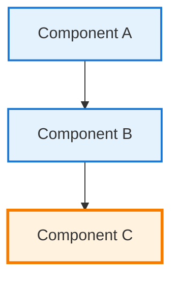

# Documentation Formatting & Style Guide

> Comprehensive guide for maintaining consistent formatting and mobile responsiveness across the documentation

## Heading Hierarchy Standards {#heading-standards}

### Hierarchy Rules
- **H1 (`#`)**: Page title only - one per page
- **H2 (`##`)**: Main sections with anchor IDs: `## Section Name {#anchor-id}`  
- **H3 (`###`)**: Subsections within H2 sections
- **H4 (`####`)**: Sub-subsections, used sparingly
- **H5-H6**: Avoid unless absolutely necessary

### Anchor ID Convention
```markdown
## Section Name {#kebab-case-id}
### Subsection Name {#subsection-kebab-case}
```

**Benefits:**
- Direct linking to sections
- Better navigation experience
- Improved accessibility

## Table Formatting for Mobile {#table-formatting}

### Responsive Table Wrapper
For wide tables, use the table wrapper:

```html
<div class="table-wrapper">
| Column 1 | Column 2 | Column 3 | Column 4 |
|----------|----------|----------|----------|
| Data     | Data     | Data     | Data     |
</div>
```

### Mobile-First Table Design
For tables with 3+ columns, consider:

1. **Horizontal scroll** for data tables
2. **Stack layout** for comparison tables  
3. **Card layout** for complex data

### Table Classes Available
- `.table-responsive` - Horizontal scroll on mobile
- `.table-stack` - Stack rows on mobile with labels
- `.table-wrapper` - General responsive wrapper

## Visual Component Usage {#visual-components}

### Standard Components
```markdown
<div class="axiom-box">
<h4>⚛️ Law Title</h4>
Physics-based fundamental principle content
</div>

<div class="decision-box">  
<h4>🎯 Decision Framework</h4>
Strategic decision-making content
</div>

<div class="failure-vignette">
<h4>💥 Production Failure Story</h4>
Real-world failure case study
</div>

<div class="truth-box">
<h4>💡 Key Insights</h4>
Important insights and wisdom
</div>
```

### Mobile Considerations
- Components automatically resize on mobile
- Decorative elements hidden on small screens
- Padding reduces for better space usage

## Diagram Standards {#diagram-standards}

### Mermaid Diagrams
Use consistent styling and responsive containers:

```markdown

```

### Diagram Wrapper for Complex Diagrams
```html
<div class="diagram-wrapper">
```mermaid
<!-- Complex diagram that needs horizontal scroll -->
```
</div>
```

### ASCII Art Alternative
```html
<div class="text-diagram">
System A  →  Queue  →  System B
    ↓           ↓          ↓
  Logs    Analytics    Database
</div>
```

## Grid Layout Standards {#grid-standards}

### Card Grids
```markdown
<div class="grid cards" markdown>

- **Card Title**
    
    ---
    
    Card content description
    
    **Key Point**: Important detail

- **Another Card**
    
    ---
    
    Another card's content
    
</div>
```

### Statistics Grids  
```html
<div class="stats-grid">
<div class="stat-card gold">
    <div class="stat-number">31</div>
    <div class="stat-label">Gold Patterns</div>
    <div class="stat-detail">Production Ready</div>
</div>
</div>
```

## Typography Improvements {#typography}

### Emphasis Standards
- **Bold** (`**text**`): Key terms, important points
- *Italic* (`*text*`): Definitions, emphasis
- `Code` (`` `code` ``): Technical terms, file names
- [Links](url): All external links, cross-references

### Punctuation Consistency
- Use em dashes (`—`) for breaks in thought: `Design — not development — drives success`
- Use en dashes (`–`) for ranges: `5–10 engineers`
- Consistent list punctuation: No periods in simple phrase lists

### List Formatting
```markdown
**Unordered Lists:**
- Item one
- Item two with longer description
- Item three

**Ordered Lists:**
1. First step
2. Second step with details
3. Third step

**Definition Lists:**
**Term**: Definition of the term
**Another Term**: Another definition
```

## Mobile Responsiveness Features {#mobile-features}

### Automatic Responsive Behavior
The CSS framework provides:

- **Tables**: Horizontal scroll with touch support
- **Diagrams**: Max-width constraints with scroll
- **Components**: Reduced padding and font sizes
- **Grids**: Single column layout on mobile
- **Navigation**: Collapsible sidebar menu

### Mobile-Specific Classes
```css
/* Hide on mobile */
@media screen and (max-width: 48em) {
  .hide-mobile { display: none; }
}

/* Show only on mobile */
.show-mobile { display: none; }
@media screen and (max-width: 48em) {
  .show-mobile { display: block; }
}
```

## Performance Optimizations {#performance}

### Image Optimization
- Use WebP format when possible
- Include alt text for accessibility
- Specify dimensions to prevent layout shift

### Loading Optimization  
- Lazy load images below the fold
- Minimize custom CSS additions
- Use system fonts when possible

## Accessibility Standards {#accessibility}

### Required Elements
- **Alt text** for all images and diagrams
- **Heading hierarchy** properly structured  
- **Link descriptions** that make sense out of context
- **Color contrast** meets WCAG standards
- **Focus indicators** for keyboard navigation

### Semantic HTML
```html
<article>
  <header>
    <h1>Article Title</h1>
  </header>
  <section>
    <h2>Section Title</h2>
    <p>Content...</p>
  </section>
</article>
```

## Quality Checklist {#quality-checklist}

### Before Publishing
- [ ] Heading hierarchy follows H1 → H2 → H3 pattern
- [ ] All H2+ headings have anchor IDs
- [ ] Tables are mobile-responsive or wrapped
- [ ] Diagrams have proper Mermaid styling
- [ ] Visual components used appropriately
- [ ] All links work and open appropriately
- [ ] Content is scannable with clear structure
- [ ] Mobile layout tested and functional
- [ ] Images have alt text
- [ ] Grammar and spelling checked

### Content Quality
- [ ] Follows established voice and tone
- [ ] Uses consistent terminology from glossary
- [ ] Includes relevant cross-references
- [ ] Has proper balance of text, visuals, and white space
- [ ] Matches the site's pedagogical approach

## Common Anti-Patterns to Avoid {#anti-patterns}

### ❌ Don't Do This
```markdown
# Page Title
# Another H1 on Same Page  <!-- Wrong -->
#### Skipping H2 and H3     <!-- Wrong -->
## Section Title            <!-- Missing anchor ID -->

| Too | Many | Columns | For | Mobile | Display |
```

### ✅ Do This Instead  
```markdown
# Page Title
## Main Section {#main-section}
### Subsection {#subsection}

<div class="table-wrapper">
| Right | Number | Columns |
|-------|--------|---------|
| Data  | Data   | Data    |
</div>
```

---

This guide ensures consistent, accessible, and mobile-friendly documentation across the entire site. Apply these standards when creating or updating any content.