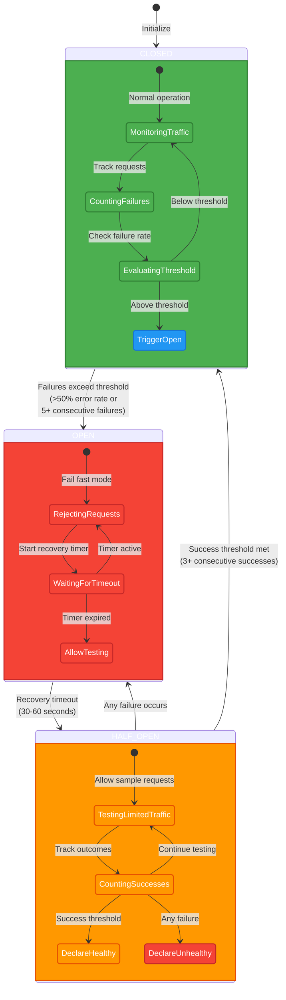
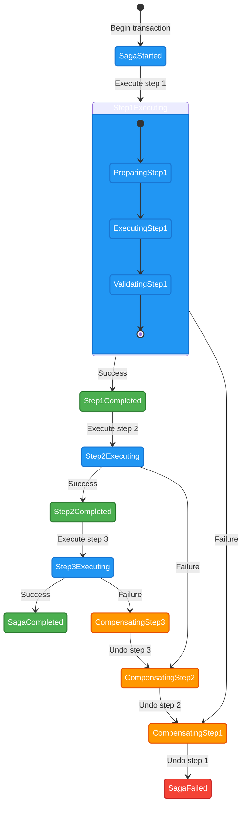
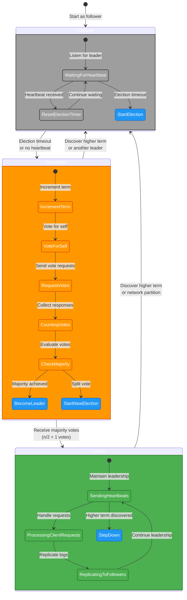
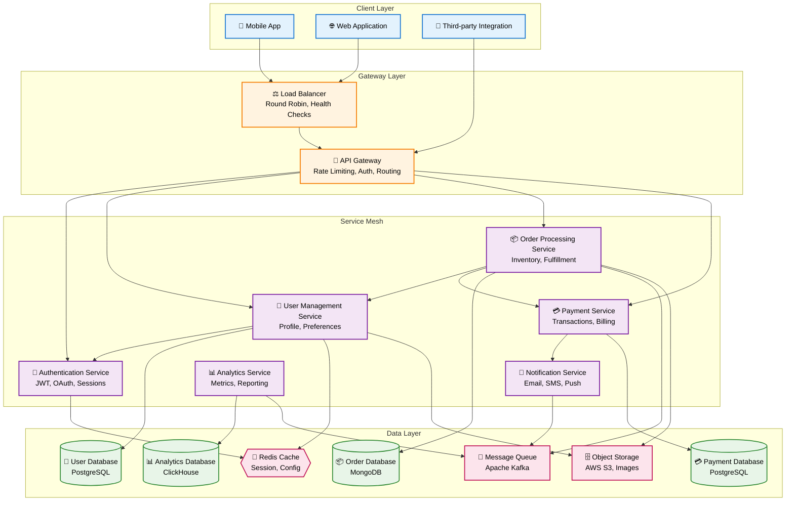
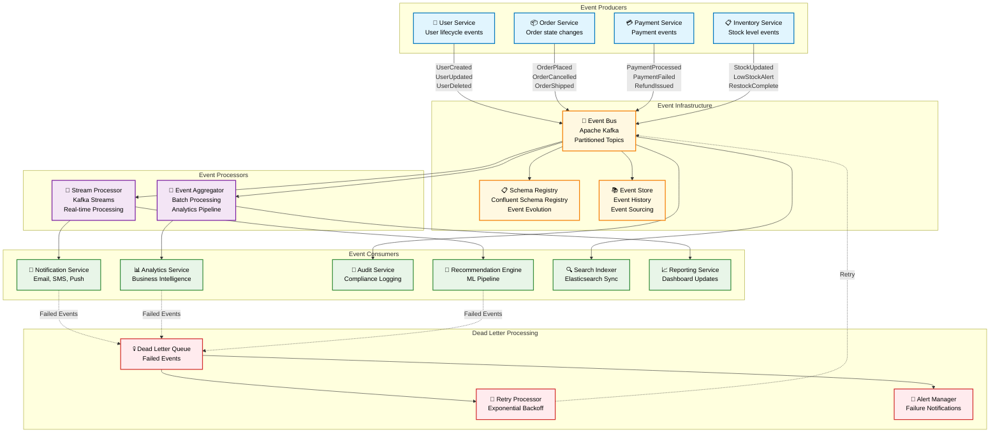
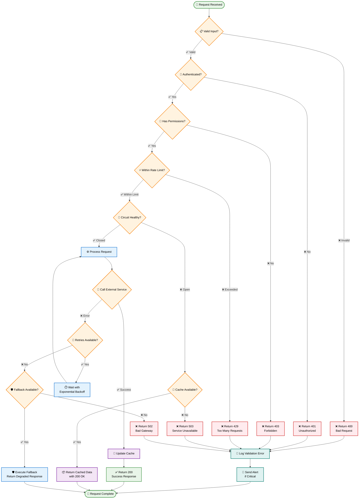
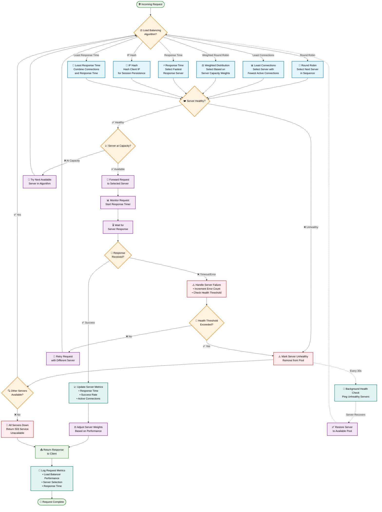
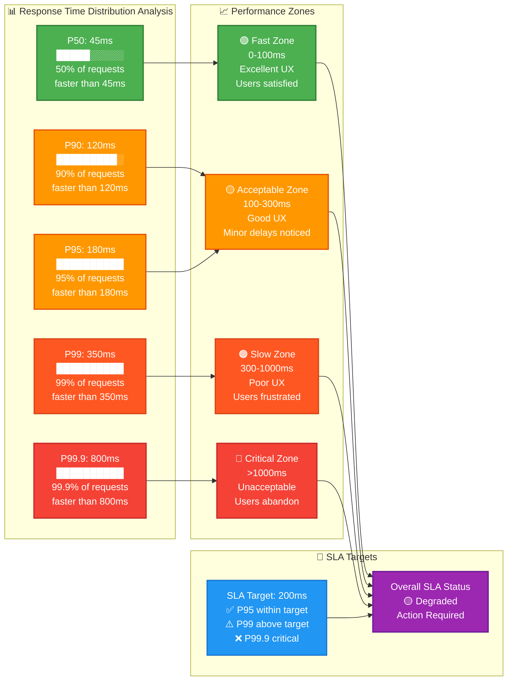
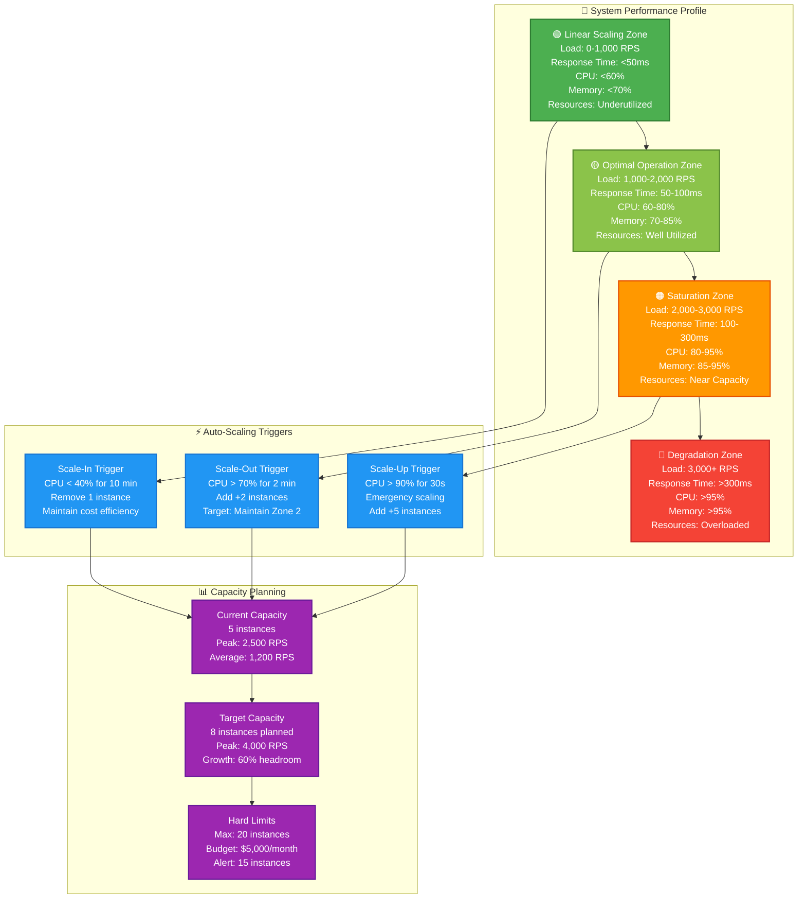

# Mermaid Diagram Templates Library

This document provides comprehensive, reusable Mermaid templates for all distributed systems patterns in the DStudio documentation.

## Template Usage

Each template includes:
- **Base Template**: Copy-paste ready Mermaid code
- **Customization Guide**: How to adapt for specific patterns
- **Style Classes**: Pre-configured color schemes
- **Example Usage**: Real-world implementation examples

---

## 1. State Machine Templates

### Circuit Breaker State Machine



### Saga Transaction State Machine



### Leader Election State Machine



---

## 2. Architecture Diagram Templates

### Microservices Architecture



### Event-Driven Architecture



### Cell-Based Architecture

```mermaid
graph TB
    subgraph "Global Layer"
        GlobalLB[🌍 Global Load Balancer<br/>GeoDNS, Anycast]
        GlobalGateway[🚪 Global API Gateway<br/>Routing, Rate Limiting]
        GlobalAuth[🔐 Global Auth Service<br/>JWT Validation]
    end
    
    subgraph "Cell 1 - US East"
        subgraph "Cell 1 Gateway"
            Cell1LB[⚖️ Regional LB<br/>Health-based Routing]
            Cell1Gateway[🚪 Cell Gateway<br/>Local Rate Limiting]
        end
        
        subgraph "Cell 1 Services"
            Cell1User[👤 User Service]
            Cell1Order[📦 Order Service]
            Cell1Payment[💳 Payment Service]
            Cell1Inventory[📋 Inventory Service]
        end
        
        subgraph "Cell 1 Data"
            Cell1UserDB[(👤 User DB)]
            Cell1OrderDB[(📦 Order DB)]
            Cell1Cache{{🎯 Redis Cache}}
            Cell1Queue[📨 Local Queue]
        end
    end
    
    subgraph "Cell 2 - US West"
        subgraph "Cell 2 Gateway"
            Cell2LB[⚖️ Regional LB<br/>Health-based Routing]
            Cell2Gateway[🚪 Cell Gateway<br/>Local Rate Limiting]
        end
        
        subgraph "Cell 2 Services"
            Cell2User[👤 User Service]
            Cell2Order[📦 Order Service] 
            Cell2Payment[💳 Payment Service]
            Cell2Inventory[📋 Inventory Service]
        end
        
        subgraph "Cell 2 Data"
            Cell2UserDB[(👤 User DB)]
            Cell2OrderDB[(📦 Order DB)]
            Cell2Cache{{🎯 Redis Cache}}
            Cell2Queue[📨 Local Queue]
        end
    end
    
    subgraph "Cell 3 - Europe"
        subgraph "Cell 3 Gateway"
            Cell3LB[⚖️ Regional LB<br/>Health-based Routing]
            Cell3Gateway[🚪 Cell Gateway<br/>Local Rate Limiting]
        end
        
        subgraph "Cell 3 Services"
            Cell3User[👤 User Service]
            Cell3Order[📦 Order Service]
            Cell3Payment[💳 Payment Service]
            Cell3Inventory[📋 Inventory Service]
        end
        
        subgraph "Cell 3 Data"
            Cell3UserDB[(👤 User DB)]
            Cell3OrderDB[(📦 Order DB)]
            Cell3Cache{{🎯 Redis Cache}}
            Cell3Queue[📨 Local Queue]
        end
    end
    
    subgraph "Global Data Layer"
        GlobalEventStream[🌊 Global Event Stream<br/>Cross-cell Replication]
        GlobalAnalytics[(📊 Global Analytics DB<br/>Data Warehouse)]
        GlobalConfig[⚙️ Global Config Service<br/>Feature Flags, Settings]
    end
    
    %% Global routing
    GlobalLB --> GlobalGateway
    GlobalGateway --> GlobalAuth
    GlobalGateway --> Cell1LB
    GlobalGateway --> Cell2LB
    GlobalGateway --> Cell3LB
    
    %% Cell 1 internal
    Cell1LB --> Cell1Gateway
    Cell1Gateway --> Cell1User
    Cell1Gateway --> Cell1Order
    Cell1Gateway --> Cell1Payment
    Cell1User --> Cell1UserDB
    Cell1Order --> Cell1OrderDB
    Cell1User --> Cell1Cache
    Cell1Order --> Cell1Queue
    
    %% Cell 2 internal  
    Cell2LB --> Cell2Gateway
    Cell2Gateway --> Cell2User
    Cell2Gateway --> Cell2Order
    Cell2Gateway --> Cell2Payment
    Cell2User --> Cell2UserDB
    Cell2Order --> Cell2OrderDB
    Cell2User --> Cell2Cache
    Cell2Order --> Cell2Queue
    
    %% Cell 3 internal
    Cell3LB --> Cell3Gateway
    Cell3Gateway --> Cell3User
    Cell3Gateway --> Cell3Order
    Cell3Gateway --> Cell3Payment
    Cell3User --> Cell3UserDB
    Cell3Order --> Cell3OrderDB
    Cell3User --> Cell3Cache
    Cell3Order --> Cell3Queue
    
    %% Global data connections
    Cell1Queue --> GlobalEventStream
    Cell2Queue --> GlobalEventStream
    Cell3Queue --> GlobalEventStream
    GlobalEventStream --> GlobalAnalytics
    
    Cell1User --> GlobalConfig
    Cell2User --> GlobalConfig
    Cell3User --> GlobalConfig
    
    classDef global fill:#e8eaf6,stroke:#3f51b5,color:#000,stroke-width:3px
    classDef cell1 fill:#e1f5fe,stroke:#0277bd,color:#000,stroke-width:2px
    classDef cell2 fill:#e8f5e8,stroke:#388e3c,color:#000,stroke-width:2px
    classDef cell3 fill:#fff3e0,stroke:#f57c00,color:#000,stroke-width:2px
    classDef globaldata fill:#fce4ec,stroke:#c2185b,color:#000,stroke-width:2px
    
    class GlobalLB,GlobalGateway,GlobalAuth global
    class Cell1LB,Cell1Gateway,Cell1User,Cell1Order,Cell1Payment,Cell1Inventory,Cell1UserDB,Cell1OrderDB,Cell1Cache,Cell1Queue cell1
    class Cell2LB,Cell2Gateway,Cell2User,Cell2Order,Cell2Payment,Cell2Inventory,Cell2UserDB,Cell2OrderDB,Cell2Cache,Cell2Queue cell2  
    class Cell3LB,Cell3Gateway,Cell3User,Cell3Order,Cell3Payment,Cell3Inventory,Cell3UserDB,Cell3OrderDB,Cell3Cache,Cell3Queue cell3
    class GlobalEventStream,GlobalAnalytics,GlobalConfig globaldata
```

---

## 3. Sequence Diagram Templates

### Distributed Transaction (Saga Pattern)

```mermaid
sequenceDiagram
    participant Client as 📱 Client Application
    participant OrderService as 📦 Order Service<br/>(Saga Orchestrator)
    participant PaymentService as 💳 Payment Service
    participant InventoryService as 📋 Inventory Service  
    participant ShippingService as 🚚 Shipping Service
    participant NotificationService as 📧 Notification Service
    participant EventStore as 📚 Event Store
    
    Note over Client,EventStore: Saga Pattern - Distributed Transaction
    
    Client->>+OrderService: CreateOrder(items, payment, address)
    OrderService->>EventStore: Store SagaStarted Event
    
    %% Step 1: Reserve Inventory
    OrderService->>+InventoryService: ReserveItems(orderId, items)
    alt Inventory Available
        InventoryService-->>-OrderService: ✅ Items Reserved (reservationId)
        OrderService->>EventStore: Store InventoryReserved Event
    else Insufficient Stock
        InventoryService-->>-OrderService: ❌ Insufficient Stock
        OrderService->>EventStore: Store SagaFailed Event
        OrderService-->>Client: ❌ Order Failed - Out of Stock
        Note over OrderService: Saga terminates early
    end
    
    %% Step 2: Process Payment
    OrderService->>+PaymentService: ProcessPayment(orderId, amount, paymentMethod)
    alt Payment Successful
        PaymentService-->>-OrderService: ✅ Payment Confirmed (transactionId)
        OrderService->>EventStore: Store PaymentProcessed Event
    else Payment Failed
        PaymentService-->>-OrderService: ❌ Payment Declined
        OrderService->>EventStore: Store PaymentFailed Event
        %% Compensating action for Step 1
        OrderService->>+InventoryService: CancelReservation(reservationId)
        InventoryService-->>-OrderService: ✅ Reservation Cancelled
        OrderService->>EventStore: Store InventoryCompensated Event
        OrderService-->>Client: ❌ Order Failed - Payment Declined
        Note over OrderService: Saga compensation complete
    end
    
    %% Step 3: Arrange Shipping
    OrderService->>+ShippingService: CreateShipment(orderId, items, address)
    alt Shipping Arranged
        ShippingService-->>-OrderService: ✅ Shipment Created (trackingId)
        OrderService->>EventStore: Store ShipmentArranged Event
    else Shipping Failed
        ShippingService-->>-OrderService: ❌ Shipping Unavailable
        OrderService->>EventStore: Store ShippingFailed Event
        %% Compensating actions for Steps 1 & 2
        par Compensate Payment
            OrderService->>+PaymentService: RefundPayment(transactionId)
            PaymentService-->>-OrderService: ✅ Refund Processed
        and Compensate Inventory
            OrderService->>+InventoryService: CancelReservation(reservationId) 
            InventoryService-->>-OrderService: ✅ Reservation Cancelled
        end
        OrderService->>EventStore: Store SagaCompensated Event
        OrderService-->>Client: ❌ Order Failed - Shipping Unavailable
        Note over OrderService: Saga compensation complete
    end
    
    %% Success Path - Complete Saga
    OrderService->>EventStore: Store SagaCompleted Event
    OrderService->>+NotificationService: SendOrderConfirmation(orderId, customerEmail)
    NotificationService-->>-OrderService: ✅ Notification Sent
    OrderService-->>-Client: ✅ Order Created Successfully (orderId, trackingId)
    
    %% Async notifications
    NotificationService->>Client: 📧 Order Confirmation Email
    ShippingService->>Client: 📱 Shipping Updates
    
    Note over Client,EventStore: All operations are idempotent and recoverable
```

### Circuit Breaker Request Flow

```mermaid
sequenceDiagram
    participant Client as 📱 Client
    participant APIGateway as 🚪 API Gateway
    participant CircuitBreaker as 🔄 Circuit Breaker
    participant ServiceA as 🔧 Service A<br/>(Primary)
    participant ServiceB as 🔧 Service B<br/>(Dependency)
    participant Cache as 🎯 Cache
    participant Fallback as 🛡️ Fallback Service
    participant Monitor as 📊 Monitoring
    
    Note over Client,Monitor: Circuit Breaker Protection Pattern
    
    %% Healthy state requests
    loop Normal Operation (Circuit CLOSED)
        Client->>+APIGateway: API Request
        APIGateway->>+CircuitBreaker: Forward Request
        CircuitBreaker->>CircuitBreaker: Check State: CLOSED
        CircuitBreaker->>+ServiceA: Forward Request
        ServiceA->>+ServiceB: Call Dependency
        ServiceB-->>-ServiceA: ✅ Success Response
        ServiceA-->>-CircuitBreaker: ✅ Success
        CircuitBreaker->>CircuitBreaker: Record Success
        CircuitBreaker-->>-APIGateway: ✅ Response
        APIGateway-->>-Client: ✅ Response
        CircuitBreaker->>Monitor: Success Metric
    end
    
    %% Failures start occurring
    Note over Client,Monitor: Dependency begins failing
    
    Client->>+APIGateway: API Request
    APIGateway->>+CircuitBreaker: Forward Request
    CircuitBreaker->>CircuitBreaker: Check State: CLOSED
    CircuitBreaker->>+ServiceA: Forward Request
    ServiceA->>+ServiceB: Call Dependency
    ServiceB-->>-ServiceA: ❌ Error Response (500)
    ServiceA-->>-CircuitBreaker: ❌ Error
    CircuitBreaker->>CircuitBreaker: Record Failure (3/5)
    CircuitBreaker->>+Fallback: Execute Fallback
    Fallback->>+Cache: Get Cached Data
    Cache-->>-Fallback: Cached Response
    Fallback-->>-CircuitBreaker: Fallback Response
    CircuitBreaker-->>-APIGateway: ⚠️ Degraded Response
    APIGateway-->>-Client: ⚠️ Degraded Response
    CircuitBreaker->>Monitor: Failure Metric
    
    %% Circuit opens after threshold
    Client->>+APIGateway: API Request
    APIGateway->>+CircuitBreaker: Forward Request
    CircuitBreaker->>CircuitBreaker: Check State: CLOSED<br/>Failures: 5/5 (Threshold exceeded)
    CircuitBreaker->>CircuitBreaker: State Change: CLOSED → OPEN
    CircuitBreaker->>+Fallback: Fast Fail to Fallback
    Fallback->>+Cache: Get Cached Data
    Cache-->>-Fallback: Cached Response
    Fallback-->>-CircuitBreaker: Fallback Response
    CircuitBreaker-->>-APIGateway: ⚠️ Fast Fail Response
    APIGateway-->>-Client: ⚠️ Fast Fail Response
    CircuitBreaker->>Monitor: Circuit OPEN Event
    
    %% Multiple fast-fail requests
    loop Circuit OPEN (Fast Fail)
        Client->>+APIGateway: API Request
        APIGateway->>+CircuitBreaker: Forward Request
        CircuitBreaker->>CircuitBreaker: Check State: OPEN
        CircuitBreaker->>+Fallback: Immediate Fallback
        Fallback->>+Cache: Get Cached Data
        Cache-->>-Fallback: Cached Response
        Fallback-->>-CircuitBreaker: Fallback Response
        CircuitBreaker-->>-APIGateway: ⚠️ Fast Response
        APIGateway-->>-Client: ⚠️ Fast Response
        Note over CircuitBreaker: No calls to Service B
    end
    
    %% Recovery timeout expires
    Note over Client,Monitor: Recovery timeout (30s) expires
    
    Client->>+APIGateway: API Request
    APIGateway->>+CircuitBreaker: Forward Request
    CircuitBreaker->>CircuitBreaker: Check State: OPEN<br/>Timeout expired
    CircuitBreaker->>CircuitBreaker: State Change: OPEN → HALF_OPEN
    CircuitBreaker->>+ServiceA: Test Request (Single)
    ServiceA->>+ServiceB: Call Dependency
    ServiceB-->>-ServiceA: ✅ Success Response
    ServiceA-->>-CircuitBreaker: ✅ Success
    CircuitBreaker->>CircuitBreaker: Record Success (1/3)
    CircuitBreaker-->>-APIGateway: ✅ Response
    APIGateway-->>-Client: ✅ Response
    CircuitBreaker->>Monitor: Recovery Testing Started
    
    %% Additional test requests
    loop HALF_OPEN Testing (Limited Traffic)
        Client->>+APIGateway: API Request
        APIGateway->>+CircuitBreaker: Forward Request
        CircuitBreaker->>CircuitBreaker: Check State: HALF_OPEN
        CircuitBreaker->>+ServiceA: Test Request
        ServiceA->>+ServiceB: Call Dependency
        ServiceB-->>-ServiceA: ✅ Success Response
        ServiceA-->>-CircuitBreaker: ✅ Success  
        CircuitBreaker->>CircuitBreaker: Record Success (3/3)
        CircuitBreaker->>CircuitBreaker: State Change: HALF_OPEN → CLOSED
        CircuitBreaker-->>-APIGateway: ✅ Response
        APIGateway-->>-Client: ✅ Response
        CircuitBreaker->>Monitor: Circuit CLOSED - Fully Recovered
    end
    
    Note over Client,Monitor: Circuit fully recovered - normal operation resumed
```



### API Gateway Request Processing

```mermaid
sequenceDiagram
    participant Client as 📱 Client
    participant CDN as 🌐 CDN
    participant Gateway as 🚪 API Gateway
    participant Auth as 🔐 Auth Service
    participant RateLimit as ⚡ Rate Limiter
    participant Cache as 🎯 Cache Layer
    participant Router as 🧭 Service Router
    participant ServiceA as 🔧 Service A
    participant ServiceB as 🔧 Service B
    participant Database as 🗄️ Database
    participant Monitor as 📊 Monitoring
    participant Logger as 📝 Logger
    
    Note over Client,Logger: API Gateway Request Processing Flow
    
    Client->>+CDN: HTTPS Request
    CDN->>CDN: Check Static Cache
    
    alt Static Content (Images, CSS, JS)
        CDN-->>-Client: ✅ Cached Static Content
        CDN->>Monitor: Cache Hit Metric
    else Dynamic API Request
        CDN->>+Gateway: Forward to API Gateway
        Gateway->>Logger: Log Request Start
        Gateway->>Monitor: Request Received Metric
        
        %% Request validation
        Gateway->>Gateway: Validate Request Format
        alt Invalid Request Format
            Gateway-->>CDN: ❌ 400 Bad Request
            CDN-->>-Client: ❌ 400 Bad Request
            Gateway->>Logger: Log Invalid Request
            Gateway->>Monitor: Invalid Request Metric
        end
        
        %% Authentication
        Gateway->>+Auth: Validate JWT Token
        alt Valid Token
            Auth-->>-Gateway: ✅ User Claims (userId, roles)
            Gateway->>Logger: Log Authenticated User
        else Invalid/Expired Token
            Auth-->>-Gateway: ❌ Unauthorized
            Gateway-->>CDN: ❌ 401 Unauthorized
            CDN-->>-Client: ❌ 401 Unauthorized
            Gateway->>Logger: Log Auth Failure
            Gateway->>Monitor: Auth Failure Metric
        end
        
        %% Rate limiting
        Gateway->>+RateLimit: Check Rate Limit (userId)
        alt Within Rate Limit
            RateLimit-->>-Gateway: ✅ Allowed (remaining: 95/100)
            Gateway->>Logger: Log Rate Check Pass
        else Rate Limit Exceeded
            RateLimit-->>-Gateway: ❌ Rate Limit Exceeded
            Gateway-->>CDN: ❌ 429 Too Many Requests
            CDN-->>-Client: ❌ 429 Too Many Requests
            Gateway->>Logger: Log Rate Limit Hit
            Gateway->>Monitor: Rate Limit Metric
        end
        
        %% Cache check
        Gateway->>+Cache: Check Cache (request signature)
        alt Cache Hit
            Cache-->>-Gateway: ✅ Cached Response
            Gateway-->>CDN: ✅ Cached Response
            CDN-->>-Client: ✅ Fast Response
            Gateway->>Logger: Log Cache Hit
            Gateway->>Monitor: Cache Hit Metric
        else Cache Miss
            Cache-->>-Gateway: ❌ Cache Miss
            Gateway->>Logger: Log Cache Miss
            
            %% Service routing
            Gateway->>+Router: Route Request
            Router->>Router: Determine Target Service
            
            alt Route to Service A
                Router->>+ServiceA: Forward Request
                ServiceA->>+Database: Query Data
                Database-->>-ServiceA: Data Response
                ServiceA->>ServiceA: Process Business Logic
                ServiceA-->>-Router: Service Response
            else Route to Service B  
                Router->>+ServiceB: Forward Request
                ServiceB->>+Database: Query Data
                Database-->>-ServiceB: Data Response
                ServiceB->>ServiceB: Process Business Logic
                ServiceB-->>-Router: Service Response
            end
            
            Router-->>-Gateway: Processed Response
            
            %% Cache the response
            Gateway->>Cache: Store Response (TTL: 5min)
            Gateway-->>CDN: ✅ Response
            CDN->>CDN: Cache Response (TTL: 1min)
            CDN-->>-Client: ✅ Response
            
            Gateway->>Logger: Log Request Complete
            Gateway->>Monitor: Request Success Metric
        end
    end
    
    Note over Client,Logger: Request processing complete with full observability
```

---

## 4. Flowchart Templates

### Error Handling Decision Tree



### Load Balancer Algorithm Selection



### Caching Strategy Selection

```mermaid
graph TD
    DataRequest([📊 Data Request]) --> AnalyzeRequest{🔍 Analyze Request<br/>Characteristics}
    
    AnalyzeRequest --> CheckDataType{📋 Data Type?}
    
    CheckDataType -->|Static| StaticData[📄 Static Data<br/>• Images, CSS, JS<br/>• Documentation<br/>• Media Files]
    CheckDataType -->|User-Specific| UserData[👤 User-Specific Data<br/>• Profile, Preferences<br/>• Personalized Content<br/>• Session Data]
    CheckDataType -->|Frequently Accessed| HotData[🔥 Hot Data<br/>• Popular Products<br/>• Trending Content<br/>• Global Statistics]
    CheckDataType -->|Computed Results| ComputedData[⚙️ Computed Data<br/>• Report Results<br/>• Aggregations<br/>• Complex Calculations]
    CheckDataType -->|Real-time| RealTimeData[⚡ Real-time Data<br/>• Live Updates<br/>• Stock Prices<br/>• Chat Messages]
    
    StaticData --> CDNStrategy[🌍 CDN Strategy<br/>• Edge Locations<br/>• Long TTL (24h-30d)<br/>• Geographic Distribution]
    
    UserData --> CheckUserScope{👥 User Scope?}
    CheckUserScope -->|Single User| LocalCacheStrategy[💾 Local Cache Strategy<br/>• Browser/App Cache<br/>• Medium TTL (1h-24h)<br/>• User-specific Keys]
    CheckUserScope -->|Multi-User Shared| SharedCacheStrategy[🎯 Shared Cache Strategy<br/>• Redis/Memcached<br/>• User-segmented Keys<br/>• Privacy Controls]
    
    HotData --> CheckAccessPattern{📈 Access Pattern?}
    CheckAccessPattern -->|Read-Heavy| ReadThroughCache[📖 Read-Through Cache<br/>• Cache Aside Pattern<br/>• Auto Population<br/>• High Hit Ratio Target]
    CheckAccessPattern -->|Write-Heavy| WriteBehindCache[📝 Write-Behind Cache<br/>• Async Persistence<br/>• Batch Updates<br/>• Eventual Consistency]
    CheckAccessPattern -->|Read-Write Mixed| WriteAroundCache[🔄 Write-Around Cache<br/>• Cache on Read<br/>• Skip Cache on Write<br/>• Good for Mixed Workload]
    
    ComputedData --> CheckComputeCost{💰 Compute Cost?}
    CheckComputeCost -->|High Cost| MemoizationStrategy[🧠 Memoization Strategy<br/>• Function Result Cache<br/>• Parameter-based Keys<br/>• Long TTL for Expensive Ops]
    CheckComputeCost -->|Low Cost| LazyLoadStrategy[⏳ Lazy Load Strategy<br/>• Compute on Demand<br/>• Short TTL<br/>• Background Refresh]
    
    RealTimeData --> CheckLatencyReq{⚡ Latency Requirements?}
    CheckLatencyReq -->|Ultra-Low (<1ms)| InMemoryStrategy[⚡ In-Memory Strategy<br/>• Local Cache Only<br/>• No Network Calls<br/>• Pre-loaded Data]
    CheckLatencyReq -->|Low (<10ms)| DistributedCacheStrategy[🌐 Distributed Cache<br/>• Redis Cluster<br/>• Consistent Hashing<br/>• Replication]
    CheckLatencyReq -->|Moderate (<100ms)| MultiLayerStrategy[🏗️ Multi-Layer Strategy<br/>• L1: In-Memory<br/>• L2: Distributed Cache<br/>• L3: Database]
    
    %% Cache implementation details
    CDNStrategy --> SetCDNPolicies[⚙️ Set CDN Policies<br/>• Cache-Control Headers<br/>• Purge Strategies<br/>• Compression]
    
    LocalCacheStrategy --> SetLocalPolicies[⚙️ Set Local Policies<br/>• Storage Limits<br/>• Eviction Strategy<br/>• Refresh Logic]
    
    SharedCacheStrategy --> SetSharedPolicies[⚙️ Set Shared Policies<br/>• Key Namespacing<br/>• TTL Management<br/>• Security Controls]
    
    ReadThroughCache --> ConfigureReadThrough[⚙️ Configure Read-Through<br/>• Cache Miss Handling<br/>• Auto-Population<br/>• Concurrent Access]
    
    WriteBehindCache --> ConfigureWriteBehind[⚙️ Configure Write-Behind<br/>• Buffer Management<br/>• Batch Size<br/>• Failure Handling]
    
    WriteAroundCache --> ConfigureWriteAround[⚙️ Configure Write-Around<br/>• Write Policies<br/>• Cache Invalidation<br/>• Consistency Level]
    
    MemoizationStrategy --> ConfigureMemoization[⚙️ Configure Memoization<br/>• Function Signatures<br/>• Parameter Serialization<br/>• Memory Management]
    
    LazyLoadStrategy --> ConfigureLazyLoad[⚙️ Configure Lazy Load<br/>• Trigger Conditions<br/>• Background Refresh<br/>• Fallback Strategy]
    
    InMemoryStrategy --> ConfigureInMemory[⚙️ Configure In-Memory<br/>• Data Preloading<br/>• Update Mechanisms<br/>• Memory Optimization]
    
    DistributedCacheStrategy --> ConfigureDistributed[⚙️ Configure Distributed<br/>• Cluster Setup<br/>• Replication Factor<br/>• Failover Logic]
    
    MultiLayerStrategy --> ConfigureMultiLayer[⚙️ Configure Multi-Layer<br/>• Layer Hierarchy<br/>• Promotion Strategy<br/>• Consistency Model]
    
    %% Final monitoring setup
    SetCDNPolicies --> SetupMonitoring[📊 Setup Monitoring<br/>• Hit Ratio Tracking<br/>• Performance Metrics<br/>• Cost Analysis]
    SetLocalPolicies --> SetupMonitoring
    SetSharedPolicies --> SetupMonitoring
    ConfigureReadThrough --> SetupMonitoring
    ConfigureWriteBehind --> SetupMonitoring
    ConfigureWriteAround --> SetupMonitoring
    ConfigureMemoization --> SetupMonitoring
    ConfigureLazyLoad --> SetupMonitoring
    ConfigureInMemory --> SetupMonitoring
    ConfigureDistributed --> SetupMonitoring
    ConfigureMultiLayer --> SetupMonitoring
    
    SetupMonitoring --> CacheImplemented([✅ Cache Strategy<br/>Implemented])
    
    %% Styling
    classDef startEnd fill:#e8f5e8,stroke:#388e3c,color:#000,stroke-width:2px
    classDef dataType fill:#e3f2fd,stroke:#1976d2,color:#000,stroke-width:2px
    classDef strategy fill:#f3e5f5,stroke:#7b1fa2,color:#000,stroke-width:2px
    classDef decision fill:#fff3e0,stroke:#f57c00,color:#000,stroke-width:2px
    classDef configuration fill:#e0f2f1,stroke:#00796b,color:#000,stroke-width:2px
    classDef monitoring fill:#e8eaf6,stroke:#3f51b5,color:#000,stroke-width:2px
    
    class DataRequest,CacheImplemented startEnd
    class StaticData,UserData,HotData,ComputedData,RealTimeData dataType
    class CDNStrategy,LocalCacheStrategy,SharedCacheStrategy,ReadThroughCache,WriteBehindCache,WriteAroundCache,MemoizationStrategy,LazyLoadStrategy,InMemoryStrategy,DistributedCacheStrategy,MultiLayerStrategy strategy
    class AnalyzeRequest,CheckDataType,CheckUserScope,CheckAccessPattern,CheckComputeCost,CheckLatencyReq decision
    class SetCDNPolicies,SetLocalPolicies,SetSharedPolicies,ConfigureReadThrough,ConfigureWriteBehind,ConfigureWriteAround,ConfigureMemoization,ConfigureLazyLoad,ConfigureInMemory,ConfigureDistributed,ConfigureMultiLayer configuration
    class SetupMonitoring monitoring
```

---

## 5. Performance Visualization Templates

### Latency Distribution Visualization



### System Scaling Behavior



### Multi-Dimensional Resource Dashboard

```mermaid
graph TD
    subgraph "🖥️ Resource Utilization Dashboard"
        CPU[🔥 CPU Usage<br/>Current: 75%<br/>█████████░ 75%<br/>Threshold: 80%<br/>Status: ⚠️ Warning<br/>Trend: ↗️ Increasing]
        
        Memory[🧠 Memory Usage<br/>Current: 68%<br/>███████░░░ 68%<br/>Threshold: 85%<br/>Status: ✅ Healthy<br/>Trend: → Stable]
        
        Network[🌐 Network I/O<br/>Current: 45%<br/>█████░░░░░ 45%<br/>Threshold: 70%<br/>Status: ✅ Healthy<br/>Trend: ↘️ Decreasing]
        
        Disk[💾 Disk I/O<br/>Current: 82%<br/>████████░░ 82%<br/>Threshold: 80%<br/>Status: ❌ Critical<br/>Trend: ↗️ Increasing]
        
        Database[🗄️ Database<br/>Connections: 450/500<br/>██████████ 90%<br/>Query Time: 45ms<br/>Status: ⚠️ Warning<br/>Trend: → Stable]
        
        Cache[🎯 Cache Performance<br/>Hit Ratio: 94%<br/>██████████ 94%<br/>Memory Used: 3.2GB/4GB<br/>Status: ✅ Healthy<br/>Trend: → Stable]
    end
    
    subgraph "🚨 Alert Management"
        CPUAlert[🚨 CPU Alert<br/>Threshold exceeded<br/>Action: Scale out<br/>ETA: 2 minutes]
        
        DiskAlert[🚨 Disk I/O Alert<br/>High disk usage<br/>Action: Investigate<br/>Priority: High]
        
        DBAlert[⚠️ DB Connection Alert<br/>Near connection limit<br/>Action: Monitor<br/>Priority: Medium]
    end
    
    subgraph "⚙️ Auto-Remediation"
        ScaleOut[📈 Auto Scale-Out<br/>Adding 2 instances<br/>Status: In Progress<br/>ETA: 90 seconds]
        
        CacheWarmup[🔄 Cache Warmup<br/>Preloading hot data<br/>Status: Completed<br/>Hit rate improved: 94%]
        
        DiskCleanup[🧹 Disk Cleanup<br/>Removing old logs<br/>Status: Scheduled<br/>Freed: 2.1GB]
    end
    
    subgraph "📊 Performance Trends"
        Trend24h[📈 24-Hour Trend<br/>Peak CPU: 85% (2pm)<br/>Peak Memory: 78% (3pm)<br/>Peak Disk: 88% (midnight)<br/>Average Response: 67ms]
        
        TrendWeekly[📈 Weekly Trend<br/>Growth: +12% load<br/>New Peak: 3,200 RPS<br/>Availability: 99.94%<br/>Cost: +8% infrastructure]
    end
    
    %% Connections
    CPU --> CPUAlert
    Disk --> DiskAlert
    Database --> DBAlert
    
    CPUAlert --> ScaleOut
    Cache --> CacheWarmup
    Disk --> DiskCleanup
    
    CPU --> Trend24h
    Memory --> Trend24h
    Network --> Trend24h
    Disk --> Trend24h
    
    Trend24h --> TrendWeekly
    
    %% Alert escalation
    CPUAlert -.->|If not resolved| TrendWeekly
    DiskAlert -.->|If critical| TrendWeekly
    DBAlert -.->|Pattern analysis| TrendWeekly
    
    classDef healthy fill:#4caf50,stroke:#2e7d32,color:#fff,stroke-width:2px
    classDef warning fill:#ff9800,stroke:#e65100,color:#fff,stroke-width:2px
    classDef critical fill:#f44336,stroke:#c62828,color:#fff,stroke-width:2px
    classDef alert fill:#e91e63,stroke:#ad1457,color:#fff,stroke-width:2px
    classDef action fill:#2196f3,stroke:#1976d2,color:#fff,stroke-width:2px
    classDef trend fill:#9c27b0,stroke:#6a1b9a,color:#fff,stroke-width:2px
    
    class Memory,Network,Cache healthy
    class CPU,Database warning
    class Disk critical
    class CPUAlert,DiskAlert,DBAlert alert
    class ScaleOut,CacheWarmup,DiskCleanup action
    class Trend24h,TrendWeekly trend
```

---

## Template Customization Guide

### 1. State Machine Customization

**For Circuit Breaker variations:**
- Change state names: `CLOSED` → `HEALTHY`, `OPEN` → `BLOCKED`
- Modify thresholds: `50% error rate` → `10 failures in 60s`
- Adjust timeouts: `30-60 seconds` → `5-300 seconds`
- Add custom states: `FORCED_OPEN`, `DISABLED`

**For other patterns:**
- Copy circuit breaker structure
- Replace states with pattern-specific states
- Update transition conditions
- Modify sub-states as needed

### 2. Architecture Diagram Adaptation

**Service Substitution:**
```
Replace:
- UserService → YourDomainService
- OrderService → YourProcessingService
- PaymentService → YourExternalService

Update icons:
- 👤 → 🏠 (for property service)
- 📦 → 🚗 (for vehicle service)  
- 💳 → 📊 (for analytics service)
```

**Database Adaptation:**
```
Replace:
- PostgreSQL → MySQL, Oracle, etc.
- MongoDB → DynamoDB, Cassandra, etc.
- Redis → Memcached, Hazelcast, etc.
```

### 3. Sequence Diagram Customization

**Participant Modification:**
- Update service names and icons
- Add/remove participants as needed
- Modify interaction patterns
- Update message types and protocols

**Error Path Addition:**
- Copy successful flow
- Add error conditions  
- Include compensation logic
- Update notes and annotations

### 4. Performance Template Usage

**Metric Substitution:**
- Replace response time with throughput
- Change percentiles (P95 → P99.9)
- Update SLA targets
- Modify performance zones

**Threshold Customization:**
- Adjust warning/critical levels
- Update scaling triggers
- Modify time windows
- Change alert conditions

---

These templates provide a comprehensive foundation for creating consistent, informative, and visually appealing diagrams across all DStudio documentation. Each template is designed to be easily customizable while maintaining the established visual standards and educational clarity.