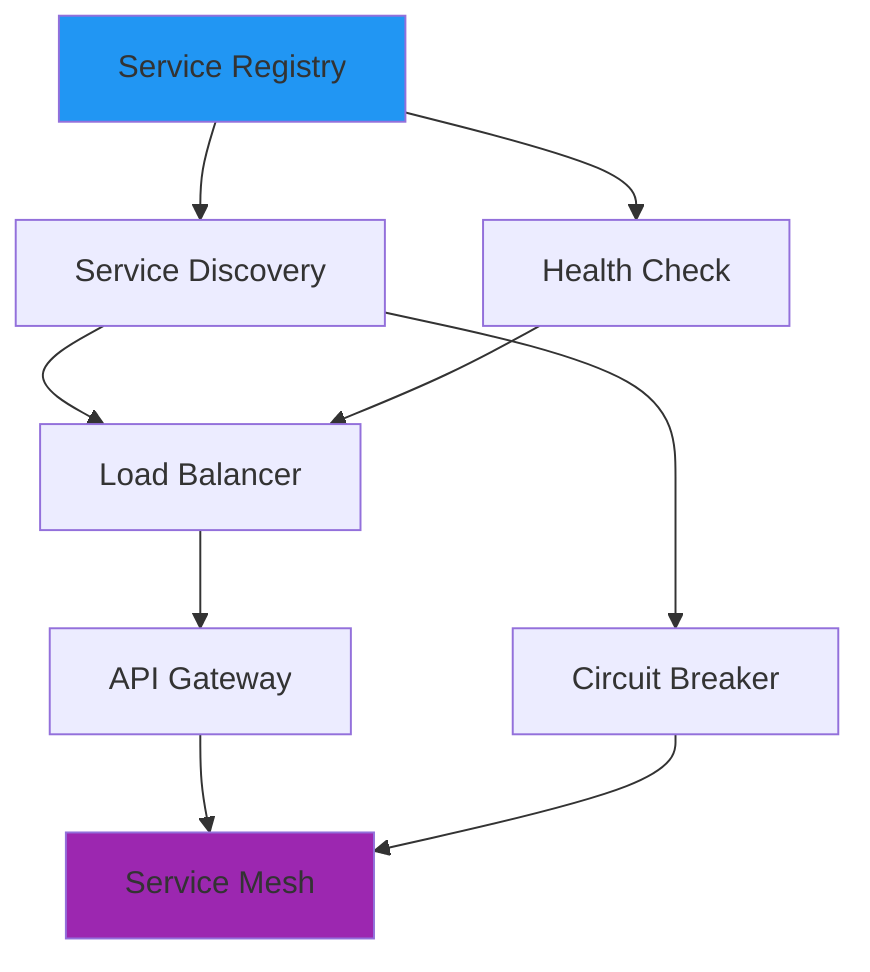
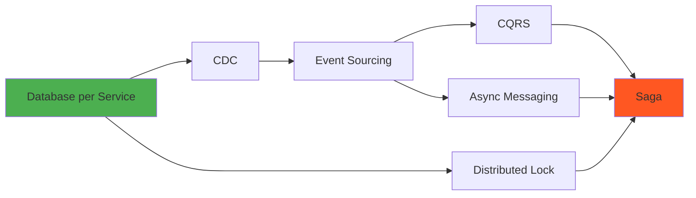
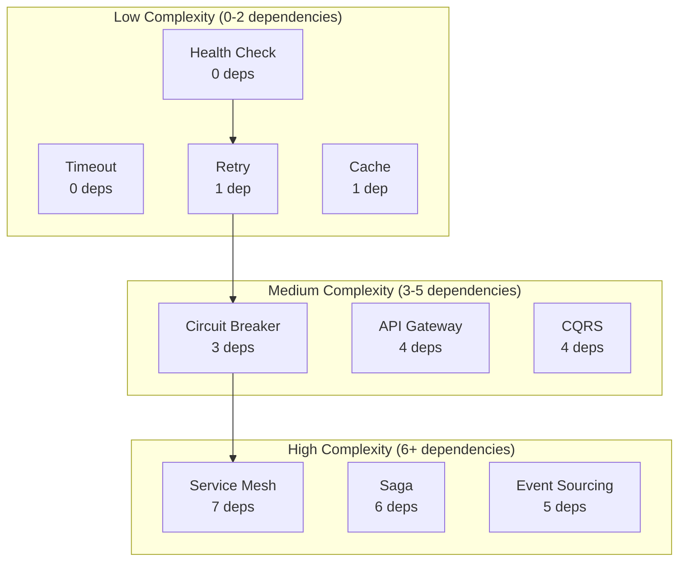
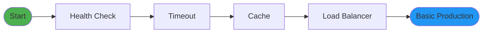
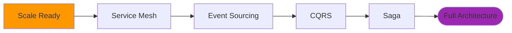

# Pattern Dependency Graph

Understanding pattern dependencies is crucial for implementation order and architectural decisions. This analysis reveals the prerequisite relationships between all 112 patterns.

## 🎯 Core Dependency Insights

### Foundational Patterns (No Dependencies)
These 15 patterns can be implemented without any prerequisites:

1. **Health Check** - Basic monitoring
2. **Timeout** - Bound operations
3. **Load Balancer** - Traffic distribution  
4. **Caching** - Performance boost
5. **Message Queue** - Async communication
6. **Database per Service** - Data isolation
7. **Retry** - Handle transients
8. **Rate Limiting** - Resource protection
9. **Monitoring** - Observability
10. **Logging** - Audit trail
11. **Configuration Management** - Settings
12. **Service Registry** - Service catalog
13. **Idempotency** - Safe retries
14. **Versioning** - API evolution
15. **Authentication** - Identity

### Most Depended Upon Patterns

| Pattern | Required By | Why Critical |
|---------|-------------|---------------|
| **Health Check** | 47 patterns | Everything needs monitoring |
| **Service Discovery** | 31 patterns | Services must find each other |
| **Load Balancer** | 28 patterns | Traffic distribution essential |
| **Message Queue** | 24 patterns | Async foundation |
| **Monitoring** | 23 patterns | Can't manage what you can't measure |

## 🔗 Dependency Chains

### The Resilience Chain


**Implementation Order**:
1. Health Check (Day 1)
2. Timeout (Day 2)
3. Retry (Day 3-4)
4. Circuit Breaker (Week 2)
5. Bulkhead (Week 3)
6. Graceful Degradation (Week 4)

### The Microservices Chain


### The Data Consistency Chain


## 🎯 Pattern Prerequisite Matrix

### Communication Patterns

| Pattern | Prerequisites | Why Needed |
|---------|--------------|------------|
| **API Gateway** | Load Balancer, Service Discovery | Route to services |
| **Service Mesh** | Service Discovery, Circuit Breaker, Load Balancer | Advanced routing |
| **gRPC** | Service Discovery, Load Balancer | Find and balance |
| **GraphQL Federation** | API Gateway, Service Discovery | Unified graph |
| **WebSocket** | Load Balancer (sticky sessions) | Connection affinity |

### Resilience Patterns

| Pattern | Prerequisites | Why Needed |
|---------|--------------|------------|
| **Circuit Breaker** | Health Check, Timeout, Retry | Detect failures |
| **Bulkhead** | Circuit Breaker, Resource Pools | Isolate failures |
| **Graceful Degradation** | Circuit Breaker, Cache, Fallback | Provide alternatives |
| **Chaos Engineering** | All resilience patterns | Test resilience |

### Data Management Patterns

| Pattern | Prerequisites | Why Needed |
|---------|--------------|------------|
| **Event Sourcing** | Message Queue, Database per Service | Event storage |
| **CQRS** | Event Sourcing, Materialized Views | Separate models |
| **Saga** | Distributed Lock, Compensation, Message Queue | Coordinate transactions |
| **CDC** | Database per Service, Message Queue | Capture changes |

## 📈 Dependency Complexity Analysis

### Patterns by Implementation Complexity



### Implementation Effort Estimation

| Complexity | Dependencies | Implementation Time | Example Patterns |
|------------|-------------|--------------------|-----------------|
| **Low** | 0-2 | 1-3 days | Health Check, Timeout, Cache |
| **Medium** | 3-5 | 1-2 weeks | Circuit Breaker, API Gateway |
| **High** | 6+ | 2-4 weeks | Service Mesh, Saga |
| **Very High** | 10+ | 1-2 months | Full Event Sourcing + CQRS |

## 🎯 Critical Dependency Paths

### Path to Service Mesh
```
1. Health Check (Day 1)
   ↓
2. Service Registry (Day 2)
   ↓
3. Service Discovery (Day 3-4)
   ↓
4. Load Balancer (Week 2)
   ↓
5. Circuit Breaker (Week 3)
   ↓
6. Retry + Timeout (Week 4)
   ↓
7. Service Mesh (Month 2)
```

### Path to Event-Driven Architecture
```
1. Message Queue (Day 1)
   ↓
2. Database per Service (Week 1)
   ↓
3. Idempotency (Week 2)
   ↓
4. Event Sourcing (Week 3-4)
   ↓
5. CQRS (Month 2)
   ↓
6. Saga (Month 2-3)
```

## 📦 Pattern Bundles

### Starter Bundle (Week 1)
```yaml
Foundation:
  - Health Check
  - Timeout
  - Basic Retry
  - Simple Cache
  
No dependencies, immediate value
```

### Reliability Bundle (Week 2-3)
```yaml
Resilience:
  - Circuit Breaker
  - Bulkhead
  - Rate Limiting
  
Requires: Starter Bundle
```

### Microservices Bundle (Month 1)
```yaml
Microservices:
  - Service Discovery
  - API Gateway
  - Load Balancer
  - Database per Service
  
Requires: Reliability Bundle
```

### Advanced Bundle (Month 2-3)
```yaml
Advanced:
  - Service Mesh
  - Event Sourcing
  - CQRS
  - Saga
  
Requires: Microservices Bundle
```

## 🔄 Circular Dependencies

### Identified Circular Dependencies

1. **Service Mesh ↔ Circuit Breaker**
   - Service Mesh implements Circuit Breaker
   - Circuit Breaker benefits from Service Mesh
   - **Resolution**: Implement basic Circuit Breaker first

2. **CQRS ↔ Event Sourcing**
   - CQRS often uses Event Sourcing
   - Event Sourcing benefits from CQRS
   - **Resolution**: Start with Event Sourcing

3. **Monitoring ↔ Health Check**
   - Monitoring needs Health Checks
   - Health Checks report to Monitoring
   - **Resolution**: Basic Health Check first

## 🎯 Dependency-Based Learning Paths

### Path 1: The Minimalist

**Time**: 1 week
**Patterns**: 5
**Value**: 60% of benefits

### Path 2: The Pragmatist

**Time**: 1 month
**Patterns**: 10
**Value**: 80% of benefits

### Path 3: The Architect

**Time**: 3 months
**Patterns**: 20+
**Value**: 95% of benefits

## 💡 Key Insights from Dependency Analysis

### 1. Natural Implementation Order
Dependencies reveal the natural order:
1. Monitoring & Health (Foundation)
2. Resilience (Protection)
3. Communication (Connection)
4. Data Management (State)
5. Advanced Patterns (Optimization)

### 2. Effort vs Value
- **First 5 patterns**: 60% value, 1 week effort
- **First 15 patterns**: 80% value, 1 month effort
- **All patterns**: 100% value, 6+ months effort

### 3. Common Mistakes
1. **Starting with Service Mesh** (needs 7 prerequisites)
2. **Event Sourcing too early** (needs solid foundation)
3. **Skipping Health Checks** (breaks everything else)
4. **Implementing Saga without understanding** (most complex)

## 📋 Implementation Checklist

### Week 1: Foundation
- [ ] Health Check endpoints
- [ ] Timeout configuration
- [ ] Basic retry logic
- [ ] Simple caching

### Week 2-3: Resilience
- [ ] Circuit breaker implementation
- [ ] Rate limiting
- [ ] Bulkhead isolation
- [ ] Graceful degradation

### Month 1: Scale
- [ ] Load balancer setup
- [ ] Service discovery
- [ ] API gateway
- [ ] Auto-scaling

### Month 2-3: Advanced
- [ ] Service mesh evaluation
- [ ] Event sourcing design
- [ ] CQRS implementation
- [ ] Saga orchestration

---

*Understanding pattern dependencies is crucial for successful implementation. This analysis shows that mastering just 15 foundational patterns enables implementation of all 112 patterns.*
