# Pattern Evolution Timeline: 60 Years of Innovation

## 📅 Executive Timeline Summary

Distributed systems patterns have evolved over 60 years, from the Actor Model (1960) to modern AI-driven architectures (2023). This timeline reveals how patterns emerge in response to technological constraints and business needs.

## 🎯 Era-Based Pattern Evolution

### Era 1: Foundations (1960-1979)
**The Birth of Distributed Computing**

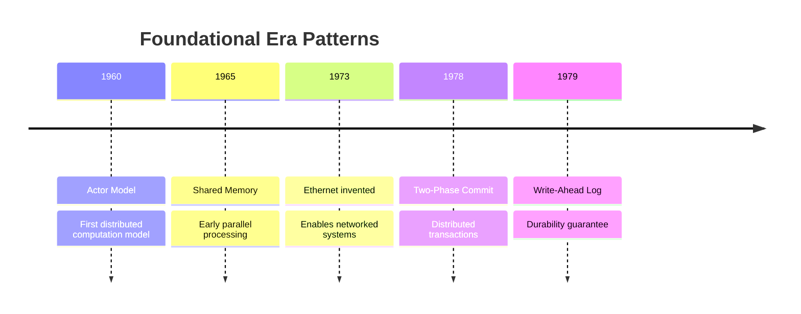

**Key Characteristics**:
- Focus on correctness and consistency
- Academic research-driven
- Limited by network speeds (10 Mbps)
- Mainframe-centric thinking

### Era 2: Client-Server (1980-1994)
**The Rise of Networks**

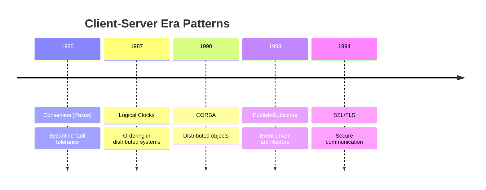

**Key Drivers**:
- Rise of LANs and WANs
- Client-server architecture dominance
- Focus on RPC and distributed objects
- Security becomes important

### Era 3: Internet Scale (1995-2004)
**The Web Changes Everything**

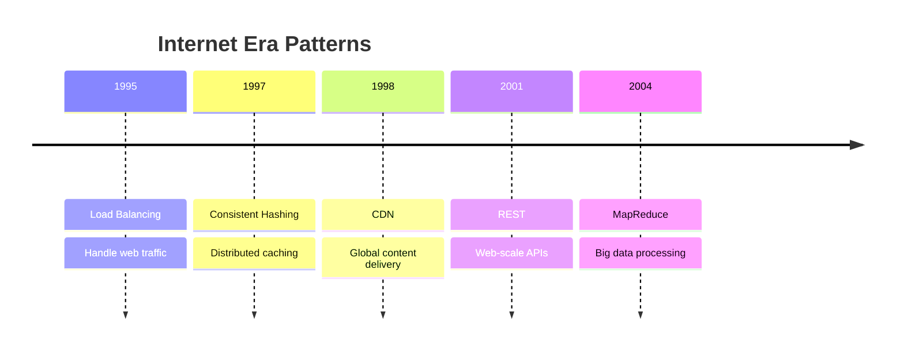

**Paradigm Shifts**:
- HTTP becomes dominant protocol
- Stateless architecture preferred
- Horizontal scaling over vertical
- CAP theorem recognized (2000)

### Era 4: Cloud Native (2005-2014)
**The Cloud Revolution**

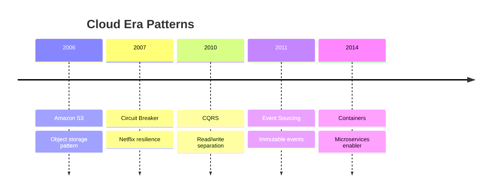

**Innovation Drivers**:
- AWS launches (2006)
- Netflix streaming (2007)
- Mobile explosion (iPhone 2007)
- Big data mainstream

### Era 5: Microservices (2015-2019)
**The Decomposition Era**

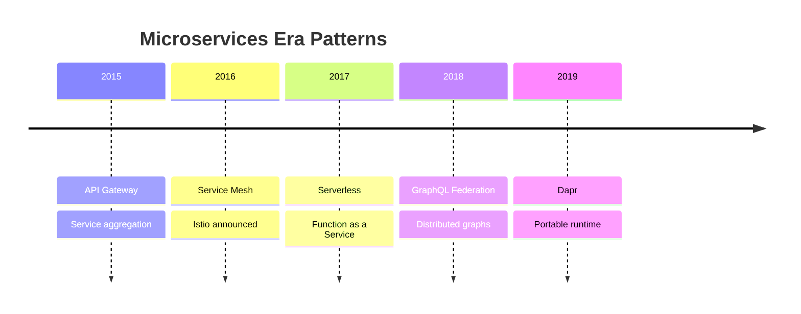

**Key Trends**:
- Docker/Kubernetes mainstream
- Service mesh emergence
- Serverless computing
- Edge computing begins

### Era 6: Intelligence & Edge (2020-Present)
**The AI and Edge Era**

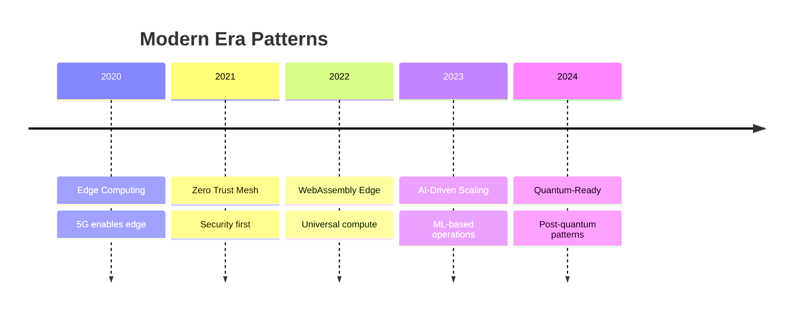

## 📈 Pattern Adoption Curves

### Adoption Lifecycle Analysis

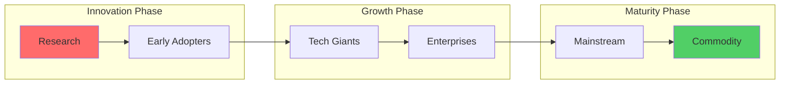

### Pattern Adoption Timeline

| Pattern | Research | Early Adoption | Mainstream | Time to Mainstream |
|---------|----------|----------------|------------|-------------------|
| **Load Balancing** | 1990 | 1995 | 2000 | 10 years |
| **Caching** | 1985 | 1995 | 2000 | 15 years |
| **MapReduce** | 2004 | 2006 | 2010 | 6 years |
| **Circuit Breaker** | 2007 | 2010 | 2015 | 8 years |
| **Service Mesh** | 2017 | 2019 | 2022 | 5 years |

**Trend**: Adoption cycles are accelerating (15 years → 5 years)

## 🔮 Technology Triggers for Pattern Evolution

### Major Technology Inflection Points

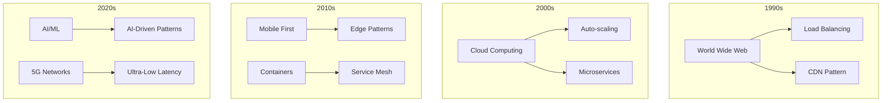

### Pattern Evolution Drivers

| Era | Primary Driver | Secondary Driver | Resulting Patterns |
|-----|---------------|-----------------|-------------------|
| 1960s | Academic Research | Hardware Limits | Actor Model, Shared Memory |
| 1980s | Network Growth | Business Computing | RPC, Distributed Objects |
| 1990s | Internet | E-commerce | Load Balancing, CDN |
| 2000s | Cloud | Big Data | MapReduce, NoSQL patterns |
| 2010s | Mobile | DevOps | Microservices, Serverless |
| 2020s | AI/ML | Edge/5G | Edge AI, Quantum-ready |

## 📉 Pattern Lifecycle Stages

### Current Pattern Lifecycle Status

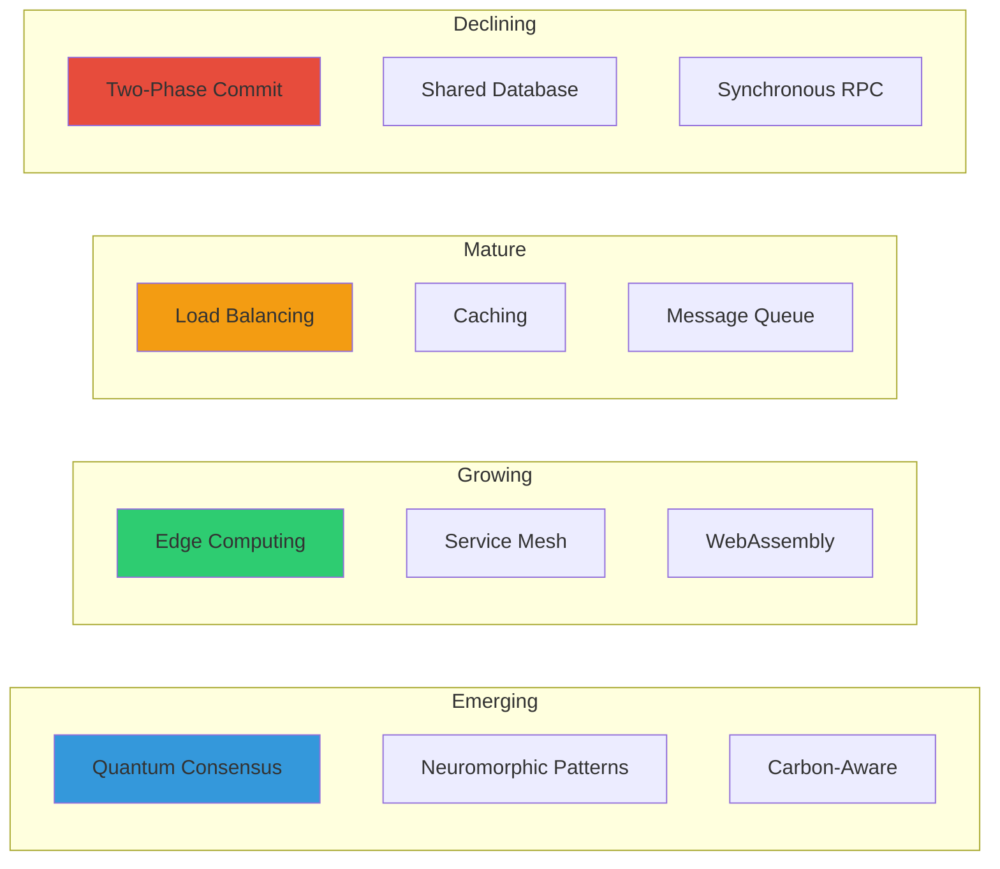

## 🌍 Geographic Pattern Evolution

### Pattern Origin by Region

| Region | Key Contributions | Notable Patterns |
|--------|------------------|------------------|
| **Silicon Valley** | Internet scale | MapReduce, Circuit Breaker |
| **Europe** | Academic foundations | Actor Model, CSP |
| **China** | Massive scale | Super-app patterns |
| **India** | Cost optimization | Offline-first patterns |

## 🔮 Future Pattern Predictions (2024-2030)

### Near-term (2024-2026)

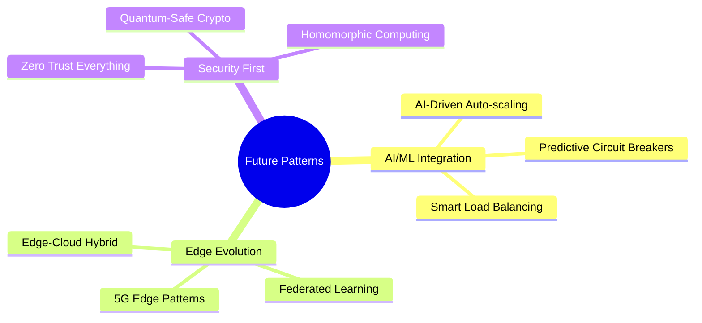

### Medium-term (2027-2030)

| Pattern Category | Predicted Patterns | Driving Force |
|-----------------|-------------------|---------------|
| **Quantum Computing** | Quantum-Classical Hybrid | Quantum advantage |
| **Sustainability** | Carbon-Aware Scheduling | Climate regulations |
| **Biology-Inspired** | Swarm Intelligence | Complexity management |
| **AR/VR Scale** | Spatial Computing Mesh | Metaverse demands |

## 📈 Pattern Obsolescence Analysis

### Patterns Becoming Obsolete

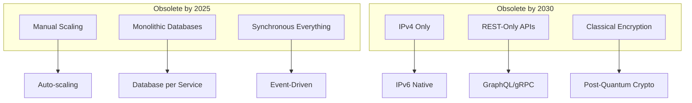

## 🎯 Key Evolution Insights

### 1. Acceleration of Innovation
- 1960-1990: 1 major pattern per 5 years
- 1990-2010: 1 major pattern per 2 years
- 2010-2024: Multiple patterns per year

### 2. Pattern Convergence
- Early patterns were isolated
- Modern patterns are compositional
- Future patterns will be AI-augmented

### 3. Complexity Abstraction
```
1960s: Implement everything
   ↓
1990s: Use libraries
   ↓
2010s: Use platforms
   ↓
2020s: Declare intent
   ↓
2030s: AI implements
```

## 📊 Evolution Metrics

### Time from Innovation to Mainstream

| Decade | Average Time | Example |
|--------|--------------|----------|
| 1980s | 15-20 years | Consensus algorithms |
| 1990s | 10-15 years | Load balancing |
| 2000s | 5-10 years | MapReduce |
| 2010s | 3-5 years | Service Mesh |
| 2020s | 1-3 years | Edge patterns |

### Pattern Half-Life Analysis

**How long patterns remain relevant:**
- Foundation patterns: 40+ years (still relevant)
- Protocol patterns: 20-30 years
- Implementation patterns: 10-15 years
- Framework patterns: 5-10 years

## 🌟 The Next Big Patterns (2024-2030)

### High Confidence Predictions

1. **AI-Native Patterns**
   - Self-healing systems
   - Predictive scaling
   - Intelligent routing

2. **Quantum-Ready Patterns**
   - Hybrid classical-quantum
   - Post-quantum security
   - Quantum networking

3. **Sustainability Patterns**
   - Carbon-aware computing
   - Energy-efficient consensus
   - Green data centers

4. **Biology-Inspired Patterns**
   - Self-organizing systems
   - Evolutionary architectures
   - Immune system patterns

## 📖 Lessons from Evolution

### What History Teaches Us

1. **Patterns emerge from constraints**
   - Network limits → Caching
   - Failures → Circuit Breakers
   - Scale → Sharding

2. **Simplicity wins long-term**
   - REST outlasted SOAP
   - Containers outlasted VMs
   - JSON outlasted XML

3. **Composition is key**
   - Modern patterns combine
   - Platforms abstract complexity
   - Declarative beats imperative

### Success Factors for New Patterns

1. **Solves real pain**: Netflix → Circuit Breaker
2. **Simple to understand**: Google → MapReduce
3. **Open source implementation**: Kubernetes → Container Orchestration
4. **Major company backing**: Facebook → GraphQL
5. **Clear value proposition**: AWS → Auto-scaling

---

*The evolution of distributed systems patterns shows accelerating innovation, with adoption cycles shrinking from 15 years to under 3 years. The future belongs to AI-augmented, quantum-ready, and sustainability-focused patterns.*
