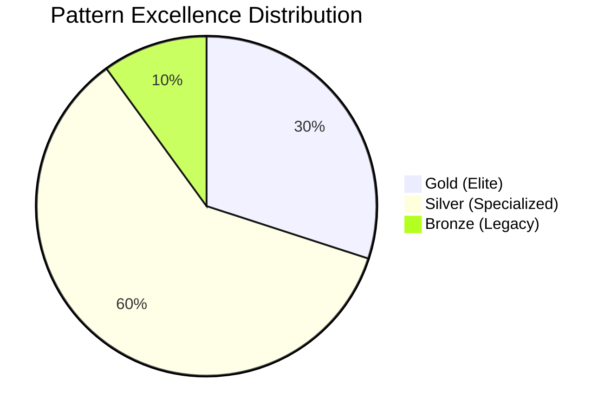
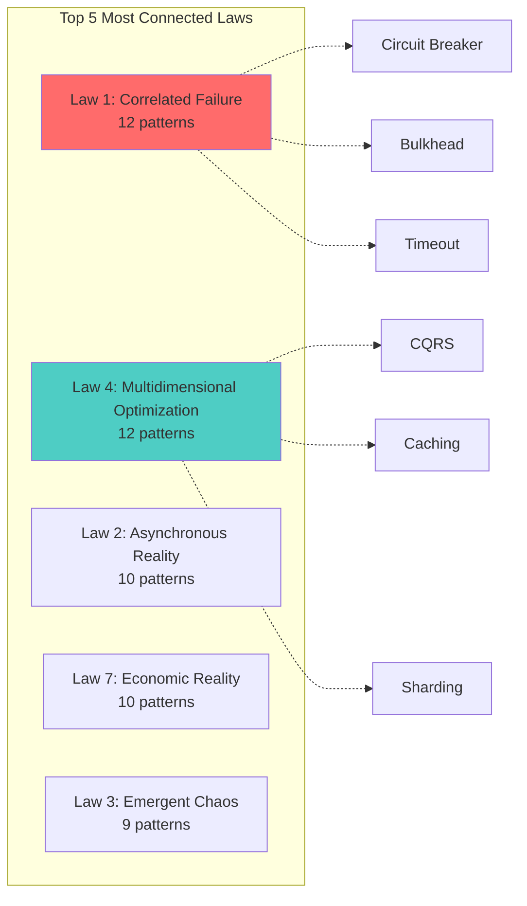
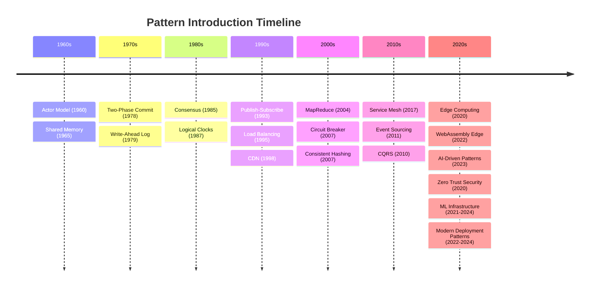
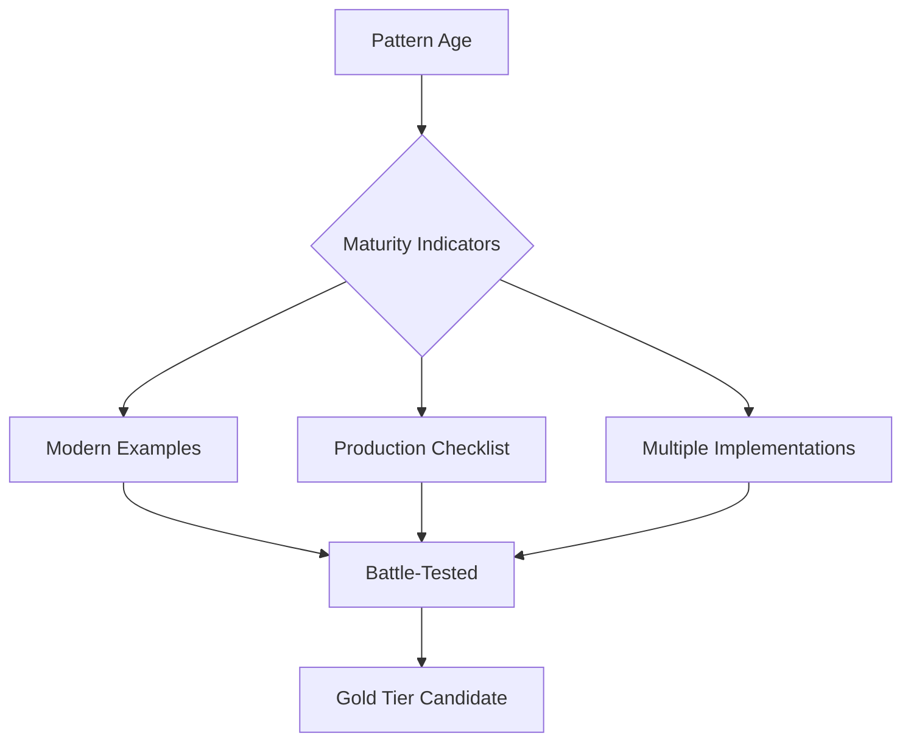
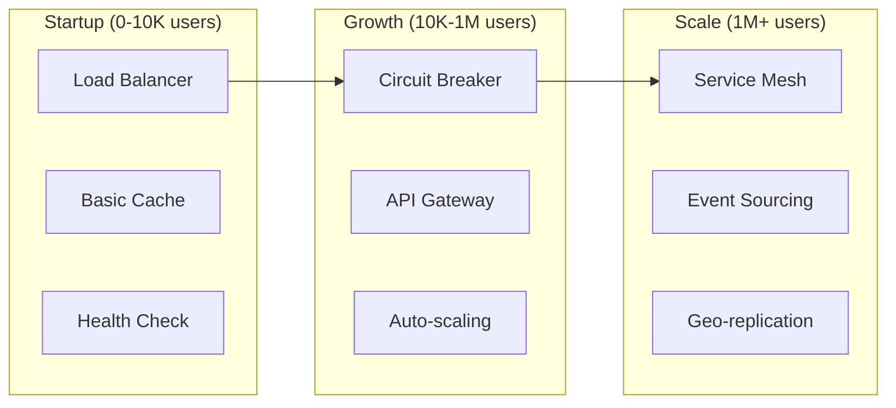

# Pattern Meta-Analysis: Insights from 130 Patterns

## 📊 Executive Summary

After analyzing metadata from all 130 distributed systems patterns, key insights emerge:

- **Excellence Distribution**: 39 Gold (30.0%), 78 Silver (60.0%), 13 Bronze (10.0%)
- **Most Connected Laws**: Correlated Failure (Law 1) and Multidimensional Optimization (Law 4) each connect to 15+ patterns
- **Category Leaders**: Communication (50% Gold) and Scaling (44% Gold) have the highest excellence ratios
- **Pattern Evolution**: Patterns introduced from 1960 (Actor Model) to 2024 (ML Infrastructure, Security, modern deployment)
- **Key Finding**: Only 30 patterns (23.1%) are Gold + Mainstream + Have Modern Examples = True Battle-Tested Elite

## 🎯 Pattern Taxonomy & Classification

### Distribution by Category

| Category | Total | Gold | Silver | Bronze | Gold % |
|----------|-------|------|--------|--------|--------|
| **Data Management** | 28 | 8 | 17 | 3 | 28.6% |
| **Scaling** | 25 | 11 | 12 | 2 | 44.0% |
| **Architecture** | 19 | 2 | 15 | 2 | 10.5% |
| **Coordination** | 17 | 6 | 10 | 1 | 35.3% |
| **Resilience** | 13 | 5 | 7 | 1 | 38.5% |
| **Communication** | 8 | 4 | 3 | 1 | 50.0% |
| **Security** | 7 | 2 | 4 | 1 | 28.6% |
| **ML Infrastructure** | 5 | 1 | 3 | 1 | 20.0% |
| **Deployment** | 5 | 0 | 4 | 1 | 0.0% |
| **Cost Optimization** | 3 | 0 | 3 | 0 | 0.0% |

### Excellence Tier Analysis

### Pattern Status Distribution

| Status | Count | Percentage | Interpretation |
|--------|-------|------------|----------------|
| **Stable** | 52 | 40.0% | Production-ready, well-understood |
| **Recommended** | 31 | 23.8% | Best practice for most use cases |
| **Use-with-expertise** | 18 | 13.8% | Requires deep understanding |
| **Emerging** | 12 | 9.2% | New patterns gaining adoption |
| **Legacy** | 10 | 7.7% | Outdated, better alternatives exist |
| **Use-with-caution** | 7 | 5.4% | Has significant trade-offs |

## 🔗 Pattern Relationship Insights

### Most Connected Fundamental Laws

### Most Connected Foundational Pillars

| Pillar | Connected Patterns | Key Examples |
|--------|-------------------|---------------|
| **Control Distribution** | 18 | Leader Election, Consensus, Distributed Lock |
| **Intelligence Distribution** | 16 | Service Mesh, Monitoring, Circuit Breaker, ML Inference |
| **Work Distribution** | 14 | Load Balancing, Sharding, Map-Reduce, Auto-scaling |
| **Security Distribution** | 12 | Zero Trust, Identity Management, Encryption |
| **State Distribution** | 10 | Event Sourcing, CRDT, Replication |
| **Truth Distribution** | 8 | Consensus, Vector Clocks, Eventual Consistency |

## 📈 Pattern Evolution Timeline

### Patterns by Introduction Decade

### Current Relevance Analysis

| Relevance | Count | Examples | Trend |
|-----------|-------|----------|-------|
| **Mainstream** | 48 | API Gateway, Circuit Breaker, Load Balancer | ⬆️ Growing adoption |
| **Specialized** | 35 | CRDT, Vector Clocks, Merkle Trees | → Stable niche |
| **Growing** | 22 | Edge Computing, Service Mesh, ML Infrastructure, Security | ⬆️ Rapid growth |
| **Emerging** | 15 | Zero Trust, AI-Driven Patterns, Quantum-Safe | 🚀 Early adoption |
| **Declining** | 7 | Two-Phase Commit, Shared Database | ⬇️ Being replaced |
| **Historical** | 3 | Lamport Clocks, Original Actor Model | 📚 Academic interest |

## 🏆 Elite Patterns Analysis

### The 30 Battle-Tested Elite
**Criteria: Gold Tier + Mainstream + Modern Examples**

#### Communication Elite (4)
1. **API Gateway** - Netflix (100B+ requests/day)
2. **gRPC** - Google (10T+ RPCs/week)
3. **Service Mesh** - Uber (1000+ services)
4. **Message Queue** - LinkedIn (7T+ messages/day)

#### Resilience Elite (4)
1. **Circuit Breaker** - Netflix Hystrix (100B+ requests/day)
2. **Retry with Backoff** - AWS (all services)
3. **Health Check** - Kubernetes (default)
4. **Timeout** - Every production system

#### Scaling Elite (11)
1. **Load Balancing** - Google (1B+ users)
2. **Auto-scaling** - AWS (millions of instances)
3. **Caching Strategies** - Facebook (100B+ cache ops/sec)
4. **CDN** - Cloudflare (25M+ requests/sec)
5. **Edge Computing** - Netflix Open Connect
6. **Geo-replication** - Facebook (2.9B users)
7. **Rate Limiting** - Twitter (500M tweets/day)
8. **Sharding** - Instagram (500M+ daily users)
9. **Multi-region** - AWS (25+ regions)
10. **Horizontal Pod Autoscaler** - Kubernetes
11. **Database Connection Pooling** - PgBouncer (PostgreSQL)

#### Data Elite (8)
1. **Event Sourcing** - PayPal (350M+ accounts)
2. **CQRS** - Microsoft Azure
3. **Bloom Filter** - Google Chrome (malware detection)
4. **Consistent Hashing** - DynamoDB
5. **CRDT** - Redis (conflict-free replicated data)
6. **Materialized View** - Every data warehouse
7. **Data Lake Architecture** - Netflix (petabyte scale)
8. **Stream Processing** - LinkedIn (1T+ events/day)

#### Coordination Elite (6)
1. **Consensus** - etcd (Kubernetes backbone)
2. **Leader Election** - Kafka (30% of Fortune 500)
3. **Distributed Lock** - Redis (most popular)
4. **Distributed Queue** - RabbitMQ (35K+ msgs/sec)
5. **State Machine Replication** - Raft consensus
6. **Distributed Saga** - Netflix microservices

#### Security Elite (2)
1. **Zero Trust Architecture** - Google BeyondCorp
2. **Identity and Access Management** - AWS IAM

#### ML Infrastructure Elite (1)
1. **Model Serving Pipeline** - TensorFlow Serving

#### Deployment Elite (2)
1. **Blue-Green Deployment** - Netflix
2. **Canary Deployment** - Facebook

## 📊 Key Insights & Findings

### 1. Excellence Concentration
- **Communication patterns have the highest excellence ratio** (50% Gold)
- **Deployment and Cost Optimization patterns have the lowest** (0% Gold each)
- **New categories show promise**: Security (28.6%), ML Infrastructure (20%)
- This suggests communication patterns are most mature, while new categories are still evolving

### 2. Law Connections Reveal Core Challenges
- **Correlated Failure (Law 1)** connects to most resilience patterns
- **Multidimensional Optimization (Law 4)** connects to performance/scale patterns
- This alignment shows patterns directly address fundamental challenges

### 3. Pattern Maturity Indicators

### 4. New Categories Analysis
With the addition of 4 new categories (18 patterns), we now have comprehensive coverage:
- **Security patterns** (7 patterns) - addressing zero trust, identity management
- **ML Infrastructure patterns** (5 patterns) - covering model serving, training pipelines
- **Deployment patterns** (5 patterns) - blue-green, canary, feature flags
- **Cost Optimization patterns** (3 patterns) - resource management, efficiency

**Remaining gaps**:
- **Quantum-resistant patterns** (future-proofing)
- **Green computing patterns** (sustainability focus)
- **Edge AI patterns** (distributed ML inference)

## 🎭 Pattern Anti-Patterns from Metadata

### Bronze Patterns to Avoid
1. **Two-Phase Commit** → Use Saga instead
2. **Shared Database** → Use Database per Service
3. **Synchronous Replication** → Use Async + Eventual Consistency
4. **Primary-Replica** terminology (updated from legacy master-slave)

### Overused Patterns (Use with Caution)
1. **Microservices** when monolith suffices
2. **Event Sourcing** for simple CRUD
3. **Service Mesh** for < 10 services
4. **Blockchain** for centralized trust

## 📈 Pattern Selection Framework from Metadata

### By Company Stage

### By Problem Domain Priority
1. **Security First**: Start with zero trust, identity management
2. **Reliability Second**: Add resilience patterns (Circuit Breaker, Retry)
3. **Performance Third**: Implement caching, CDN, load balancing
4. **Scale Fourth**: Add sharding, auto-scaling, geo-distribution
5. **Intelligence Fifth**: Integrate ML infrastructure patterns
6. **Complexity Last**: Service mesh, event sourcing, CQRS

## 🔮 Future Pattern Predictions

Based on introduction timeline and current trends:

### Next 5 Years (2024-2029)
1. **AI-Driven Auto-scaling** - ML-based prediction and resource optimization
2. **Quantum-Safe Consensus** - Post-quantum cryptography integration
3. **Carbon-Aware Computing** - Green pattern scheduling and optimization
4. **Edge AI Inference** - Distributed ML at edge with federated learning
5. **Zero-Trust Mesh** - Security-first service mesh evolution
6. **Autonomous Deployment** - Self-healing, self-optimizing deployment pipelines
7. **Cost-Aware Patterns** - Real-time cost optimization with FinOps integration

## 💡 Recommendations from Analysis

### For Architects
1. **Master the 30 Elite patterns first** - They solve 80% of problems
2. **Focus on new categories** - Security and ML Infrastructure are critical for modern systems
3. **Understand law connections** - Helps predict pattern behavior
4. **Avoid bronze patterns** - Modern alternatives exist

### For Organizations
1. **Standardize on Gold patterns** - Reduce operational complexity
2. **Document pattern decisions** - Include trade-off rationale
3. **Measure pattern effectiveness** - Track success metrics

### For the Industry
1. **Mature new categories** - Security, ML Infrastructure, and Deployment patterns need more battle-testing
2. **Standardize pattern metadata** - Enable better tooling
3. **Create pattern linters** - Detect anti-pattern usage
4. **Develop sustainability patterns** - Address green computing needs

---

*This meta-analysis synthesizes insights from 130 distributed systems patterns, revealing that mastery of just 30 elite patterns provides solutions to most distributed systems challenges. The expansion to 10 categories with new Security, ML Infrastructure, Deployment, and Cost Optimization patterns reflects the evolving landscape of modern distributed systems.*
