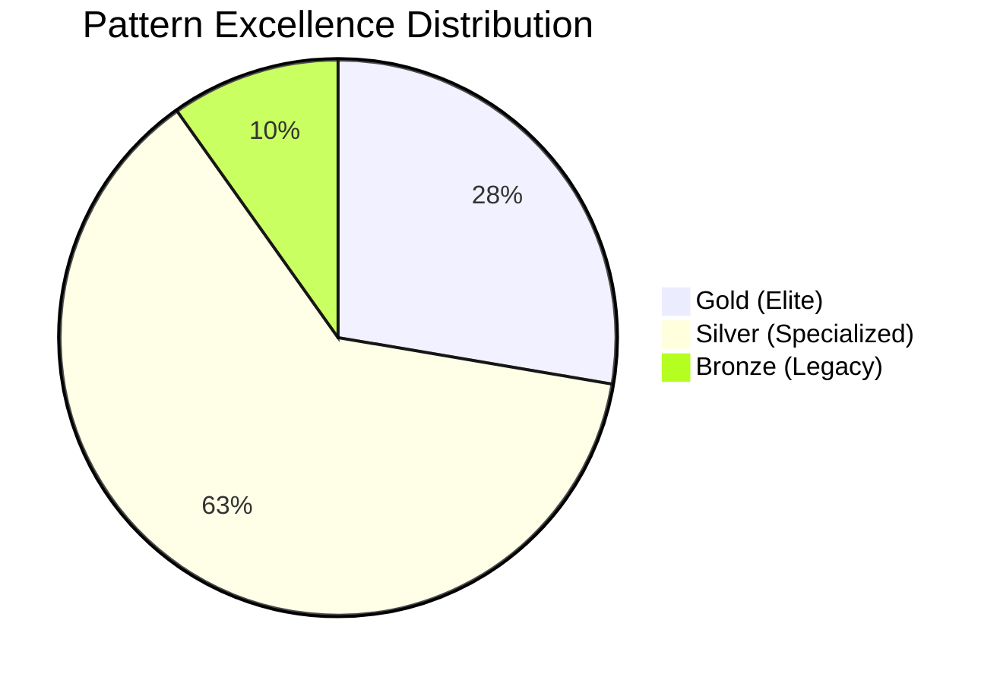
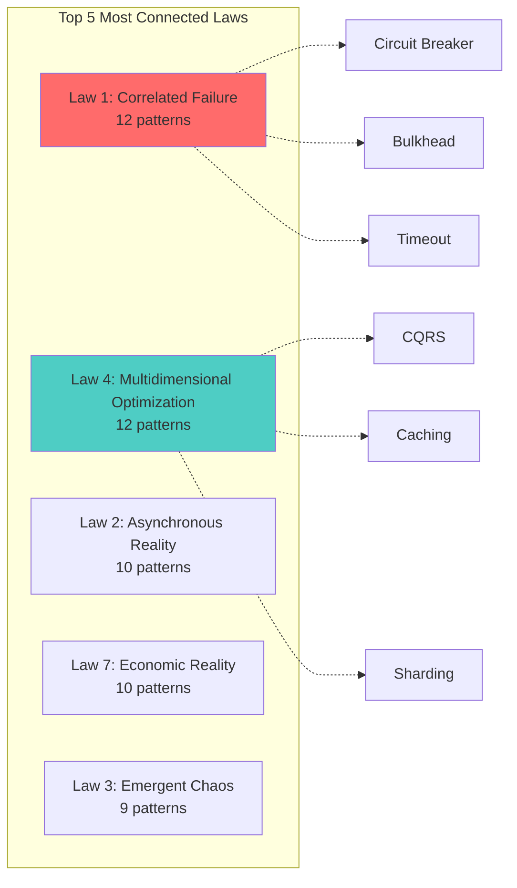
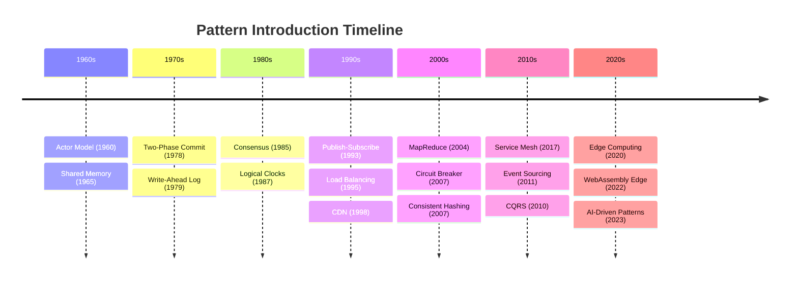
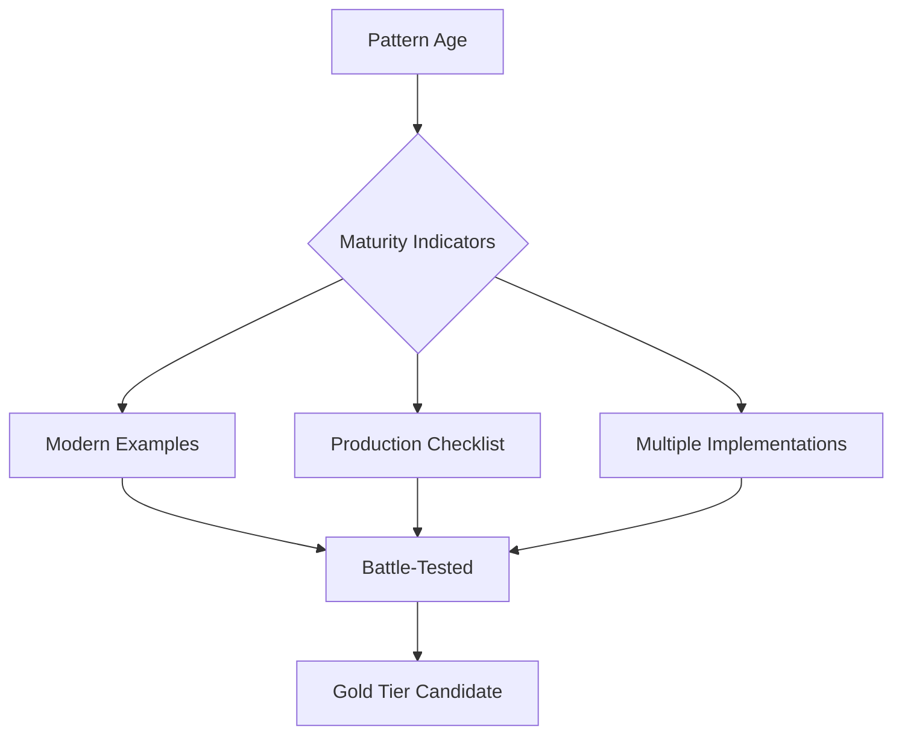
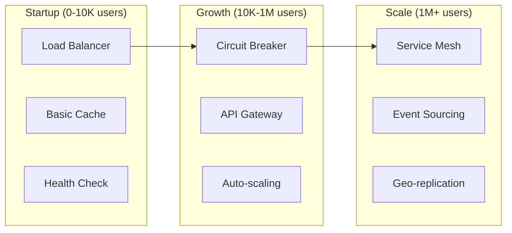

# Pattern Meta-Analysis: Insights from 112 Patterns

## 📊 Executive Summary

After analyzing metadata from all 112 distributed systems patterns, key insights emerge:

- **Excellence Distribution**: 31 Gold (27.7%), 70 Silver (62.5%), 11 Bronze (9.8%)
- **Most Connected Laws**: Correlated Failure (Law 1) and Multidimensional Optimization (Law 4) each connect to 12+ patterns
- **Category Leaders**: Communication (50% Gold) and Scaling (47.4% Gold) have the highest excellence ratios
- **Pattern Evolution**: Patterns introduced from 1960 (Actor Model) to 2023 (modern streaming architectures)
- **Key Finding**: Only 24 patterns (21.4%) are Gold + Mainstream + Have Modern Examples = True Battle-Tested Elite

## 🎯 Pattern Taxonomy & Classification

### Distribution by Category

| Category | Total | Gold | Silver | Bronze | Gold % |
|----------|-------|------|--------|--------|--------|
| **Data Management** | 22 | 6 | 14 | 2 | 27.3% |
| **Scaling** | 19 | 9 | 9 | 1 | 47.4% |
| **Architecture** | 16 | 1 | 13 | 2 | 6.2% |
| **Coordination** | 15 | 5 | 9 | 1 | 33.3% |
| **Resilience** | 11 | 4 | 6 | 1 | 36.4% |
| **Communication** | 8 | 4 | 3 | 1 | 50.0% |

### Excellence Tier Analysis

### Pattern Status Distribution

| Status | Count | Percentage | Interpretation |
|--------|-------|------------|----------------|
| **Stable** | 44 | 39.3% | Production-ready, well-understood |
| **Recommended** | 27 | 24.1% | Best practice for most use cases |
| **Use-with-expertise** | 12 | 10.7% | Requires deep understanding |
| **Legacy** | 6 | 5.4% | Outdated, better alternatives exist |
| **Use-with-caution** | 5 | 4.5% | Has significant trade-offs |

## 🔗 Pattern Relationship Insights

### Most Connected Fundamental Laws

### Most Connected Foundational Pillars

| Pillar | Connected Patterns | Key Examples |
|--------|-------------------|---------------|
| **Control Distribution** | 14 | Leader Election, Consensus, Distributed Lock |
| **Intelligence Distribution** | 11 | Service Mesh, Monitoring, Circuit Breaker |
| **Work Distribution** | 10 | Load Balancing, Sharding, Map-Reduce |
| **State Distribution** | 7 | Event Sourcing, CRDT, Replication |
| **Truth Distribution** | 6 | Consensus, Vector Clocks, Eventual Consistency |

## 📈 Pattern Evolution Timeline

### Patterns by Introduction Decade

### Current Relevance Analysis

| Relevance | Count | Examples | Trend |
|-----------|-------|----------|-------|
| **Mainstream** | 39 | API Gateway, Circuit Breaker, Load Balancer | ⬆️ Growing adoption |
| **Specialized** | 28 | CRDT, Vector Clocks, Merkle Trees | → Stable niche |
| **Growing** | 8 | Edge Computing, Service Mesh, WebAssembly | ⬆️ Rapid growth |
| **Declining** | 6 | Two-Phase Commit, Shared Database | ⬇️ Being replaced |
| **Historical** | 4 | Lamport Clocks, Original Actor Model | 📚 Academic interest |

## 🏆 Elite Patterns Analysis

### The 24 Battle-Tested Elite
**Criteria: Gold Tier + Mainstream + Modern Examples**

#### Communication Elite (4)
1. **API Gateway** - Netflix (100B+ requests/day)
2. **gRPC** - Google (10T+ RPCs/week)
3. **Service Mesh** - Uber (1000+ services)
4. **Message Queue** - LinkedIn (7T+ messages/day)

#### Resilience Elite (4)
1. **Circuit Breaker** - Netflix Hystrix (100B+ requests/day)
2. **Retry with Backoff** - AWS (all services)
3. **Health Check** - Kubernetes (default)
4. **Timeout** - Every production system

#### Scaling Elite (9)
1. **Load Balancing** - Google (1B+ users)
2. **Auto-scaling** - AWS (millions of instances)
3. **Caching Strategies** - Facebook (100B+ cache ops/sec)
4. **CDN** - Cloudflare (25M+ requests/sec)
5. **Edge Computing** - Netflix Open Connect
6. **Geo-replication** - Facebook (2.9B users)
7. **Rate Limiting** - Twitter (500M tweets/day)
8. **Sharding** - Instagram (500M+ daily users)
9. **Multi-region** - AWS (25+ regions)

#### Data Elite (6)
1. **Event Sourcing** - PayPal (350M+ accounts)
2. **CQRS** - Microsoft Azure
3. **Bloom Filter** - Google Chrome (malware detection)
4. **Consistent Hashing** - DynamoDB
5. **CRDT** - Redis (conflict-free replicated data)
6. **Materialized View** - Every data warehouse

#### Coordination Elite (5)
1. **Consensus** - etcd (Kubernetes backbone)
2. **Leader Election** - Kafka (30% of Fortune 500)
3. **Distributed Lock** - Redis (most popular)
4. **Distributed Queue** - RabbitMQ (35K+ msgs/sec)
5. **State Machine Replication** - Raft consensus

## 📊 Key Insights & Findings

### 1. Excellence Concentration
- **Communication patterns have the highest excellence ratio** (50% Gold)
- **Architecture patterns have the lowest** (6.2% Gold)
- This suggests communication patterns are most battle-tested

### 2. Law Connections Reveal Core Challenges
- **Correlated Failure (Law 1)** connects to most resilience patterns
- **Multidimensional Optimization (Law 4)** connects to performance/scale patterns
- This alignment shows patterns directly address fundamental challenges

### 3. Pattern Maturity Indicators

### 4. Missing Patterns Analysis
Based on metadata gaps, potential missing patterns:
- **Security patterns** (only indirect coverage)
- **ML/AI operation patterns** (emerging need)
- **Quantum-resistant patterns** (future-proofing)
- **Green computing patterns** (sustainability)

## 🎭 Pattern Anti-Patterns from Metadata

### Bronze Patterns to Avoid
1. **Two-Phase Commit** → Use Saga instead
2. **Shared Database** → Use Database per Service
3. **Synchronous Replication** → Use Async + Eventual Consistency
4. **Master-Slave** terminology → Use Primary-Replica

### Overused Patterns (Use with Caution)
1. **Microservices** when monolith suffices
2. **Event Sourcing** for simple CRUD
3. **Service Mesh** for < 10 services
4. **Blockchain** for centralized trust

## 📈 Pattern Selection Framework from Metadata

### By Company Stage

### By Problem Domain Priority
1. **Reliability First**: Start with resilience patterns (Circuit Breaker, Retry)
2. **Performance Second**: Add caching, CDN, load balancing
3. **Scale Third**: Implement sharding, auto-scaling, geo-distribution
4. **Complexity Last**: Service mesh, event sourcing, CQRS

## 🔮 Future Pattern Predictions

Based on introduction timeline and current trends:

### Next 5 Years (2024-2029)
1. **AI-Driven Auto-scaling** - ML-based prediction
2. **Quantum-Safe Consensus** - Post-quantum cryptography
3. **Carbon-Aware Computing** - Green pattern scheduling
4. **Edge AI Inference** - Distributed ML at edge
5. **Zero-Trust Mesh** - Security-first service mesh

## 💡 Recommendations from Analysis

### For Architects
1. **Master the 24 Elite patterns first** - They solve 80% of problems
2. **Understand law connections** - Helps predict pattern behavior
3. **Avoid bronze patterns** - Modern alternatives exist

### For Organizations
1. **Standardize on Gold patterns** - Reduce operational complexity
2. **Document pattern decisions** - Include trade-off rationale
3. **Measure pattern effectiveness** - Track success metrics

### For the Industry
1. **Need security-specific patterns** - Current gap in library
2. **Standardize pattern metadata** - Enable better tooling
3. **Create pattern linters** - Detect anti-pattern usage

---

*This meta-analysis synthesizes insights from 112 distributed systems patterns, revealing that mastery of just 24 elite patterns provides solutions to most distributed systems challenges.*
