# Pattern Documentation Template

This template ensures consistency across all 112 distributed systems patterns in the library.

## Required Frontmatter

```yaml
---
title: Pattern Name
description: Brief one-line description of what the pattern solves
type: pattern
category: communication|resilience|data-management|scaling|architecture|coordination
difficulty: beginner|intermediate|advanced
reading_time: X min
prerequisites: [list of required knowledge]
when_to_use: Primary use cases
when_not_to_use: When to avoid this pattern
status: complete|draft|deprecated
last_updated: YYYY-MM-DD
excellence_tier: gold|silver|bronze
pattern_status: recommended|stable|use-with-expertise|use-with-caution|legacy
introduced: YYYY-MM
current_relevance: mainstream|growing|declining|niche
modern_examples:
  - company: CompanyName
    implementation: "Brief description of their usage"
    scale: "Scale metrics"
production_checklist:
  - "Checklist item 1"
  - "Checklist item 2"
related_laws: [correlated-failure, asynchronous-reality, etc.]
related_pillars: [work, state, truth, control, intelligence]
---
```

## Required Sections

### 1. Pattern Header
```markdown
# Pattern Name

!!! success "🏆 Gold Standard Pattern" OR !!! info "🥈 Silver Tier Pattern" OR !!! warning "🥉 Bronze Tier Pattern"
    **Brief tagline** • Companies using it at scale
    
    One-sentence value proposition explaining why this pattern matters.
    
    **Key Success Metrics:**
    - Company 1: Specific metric
    - Company 2: Specific metric
    - Company 3: Specific metric

[Home](/) > [Pattern Library](../index.md) > [Category Patterns](./index.md) > Pattern Name
```

### 2. Pattern Summary Table
```markdown
## Pattern Summary

| Aspect | Detail |
|--------|--------|
| **Problem Solved** | What specific problem does this pattern address? |
| **When to Use** | Primary scenarios and use cases |
| **Key Benefits** | Main advantages (3-4 bullet points) |
| **Trade-offs** | Main disadvantages or costs |
| **Time to Read** | Estimated reading time |
| **Implementation** | Difficulty level (Beginner/Intermediate/Advanced) |
```

### 3. Essential Question
```markdown
## The Essential Question

**How can we [specific problem] without [negative consequence]?**
```

### 4. Fundamental Principle (Axiom Box)
```markdown
<div class="axiom-box">
<h4>🔬 Law X: Law Name</h4>

Explanation of how this pattern relates to the fundamental law.

**Key Insight**: The core principle that makes this pattern work.
</div>
```

### 5. Level-based Content Structure

#### Level 1: Intuition (5 minutes)
- Simple analogy or metaphor  
- Visual diagram showing the concept
- One-sentence summary
- Real-world parallel

#### Level 2: Foundation (10-15 minutes)
- Problem space with failure story
- Core responsibilities and decision framework
- Basic architecture diagram
- When to use vs when not to use

#### Level 3: Deep Dive (20-30 minutes)
- Detailed implementation with code examples
- Advanced configurations
- Production considerations
- Common pitfalls and solutions

#### Level 4: Expert Practitioner (30+ minutes)
- Advanced implementations across languages
- Performance optimization
- Testing strategies
- Production patterns from major tech companies

#### Level 5: Mastery (45+ minutes)
- Case studies from industry leaders
- Economic analysis and ROI calculations
- Future directions and emerging trends
- Integration with other patterns

### 6. Required Visual Elements

#### Decision Framework
```markdown
### Decision Framework

```mermaid
graph TD
    A[Starting question] --> B{Decision point?}
    B -->|Yes| C[✅ Use this pattern]
    B -->|No| D[Consider alternative]
    
    classDef recommended fill:#81c784,stroke:#388e3c,stroke-width:2px,color:#000
    classDef alternative fill:#ffb74d,stroke:#f57c00,stroke-width:2px,color:#000
    
    class C recommended
    class D alternative
```


```

#### Architecture Diagram
```markdown

```

### 7. Related Resources Section
```markdown
## Related Patterns

### [Category] Patterns
- **[Pattern Name](../category/pattern.md)**: Brief description - how it relates to this pattern
- **[Pattern Name](../category/pattern.md)**: Brief description - how it relates to this pattern

### Supporting Patterns  
- **[Pattern Name](../category/pattern.md)**: Brief description - how it supports this pattern

## Related Laws & Pillars

### Fundamental Laws
This pattern directly addresses:
- **[Law X: Name](../core-principles/laws/lawX/index.md)**: How this pattern relates to the law

### Foundational Pillars
This pattern implements:
- **[Pillar X: Name](../core-principles/pillars/pillarX/index.md)**: How this pattern implements the pillar
```

### 8. Excellence Framework Integration
```markdown
## Excellence Framework Integration

### Implementation Guides
- **[Pattern Implementation Guide](../excellence/implementation-guides/pattern-implementation.md)**: Step-by-step setup
- **[Pattern Testing Guide](../excellence/guides/pattern-testing.md)**: Testing strategies

### Case Studies
- **[Company Case Study](../architects-handbook/case-studies/company-pattern.md)**: Real-world implementation

### Pattern Combinations
<div class="grid cards" markdown>

- :material-puzzle:{ .lg .middle } **With Related Pattern**
    
    ---
    
    How they work together:
    - Benefit 1
    - Benefit 2
    - [View Integration Guide](../excellence/combinations/pattern-combination.md)

</div>
```

## Quality Standards

### Content Requirements
- **Scannable format**: Use tables, bullet points, and visual elements
- **Multiple depths**: Layer information from simple to complex
- **Real examples**: Include production examples from major companies
- **Visual first**: Lead with diagrams and structured layouts
- **Cross-references**: Link to related patterns, laws, and pillars

### Visual Standards
- Use consistent Mermaid diagram styling
- Include alt text for accessibility
- Use color coding with sufficient contrast
- Provide clear captions for all visuals

### Code Standards
- Include comments explaining design choices
- Show realistic examples, not toy code
- Provide step-by-step implementation guidance
- Include production considerations and error handling

## Metadata Requirements

### Excellence Tier Classification
- **Gold**: Production-proven at massive scale, complete implementation guides
- **Silver**: Solid patterns with detailed trade-offs and use cases
- **Bronze**: Legacy patterns with migration guidance to modern alternatives

### Required Metrics for Gold Patterns
- Production checklists
- Scale examples (requests/sec, users, data volume)
- Performance benchmarks
- Real company implementations

### Required Information for Silver Patterns
- Detailed trade-off analysis
- Specific use case guidance
- "Best for" scenarios
- Implementation complexity assessment

### Required Information for Bronze Patterns
- Modern alternatives
- Deprecation reasons
- Migration strategies
- Historical context

This template ensures all patterns provide consistent, high-quality documentation that helps users make informed architectural decisions.