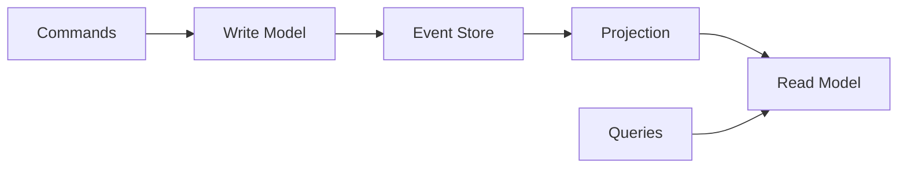
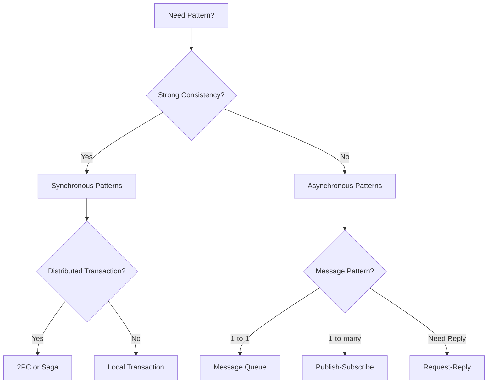

# Distributed Systems Patterns Reference

!!! tip "Quick Navigation"
    [← Reference Home](index.md) | 
    [Formulas](formulas.md) |
    [Cheat Sheets](cheat-sheets.md)

## Pattern Categories

### 1. Availability Patterns

#### Health Checks
**Problem**: Detect unhealthy services before they cause failures.

**Solution**: Regular endpoint polling with automatic removal from load balancer.

```python
# Example health check endpoint
@app.route('/health')
def health_check():
    checks = {
        'database': check_db_connection(),
        'cache': check_redis_connection(),
        'disk_space': check_disk_space() > 10  # GB
    }
    
    if all(checks.values()):
        return {'status': 'healthy', 'checks': checks}, 200
    else:
        return {'status': 'unhealthy', 'checks': checks}, 503
```

#### Circuit Breaker
**Problem**: Prevent cascading failures when a service is struggling.

**Solution**: Stop calling failing services temporarily.

```python
class CircuitBreaker:
    def __init__(self, failure_threshold=5, recovery_timeout=60):
        self.failure_threshold = failure_threshold
        self.recovery_timeout = recovery_timeout
        self.failure_count = 0
        self.last_failure_time = None
        self.state = 'CLOSED'  # CLOSED, OPEN, HALF_OPEN
```

### 2. Data Management Patterns

#### Event Sourcing
**Problem**: Need audit trail and ability to replay system state.

**Solution**: Store all changes as immutable events.

```json
{
  "eventId": "evt_123",
  "timestamp": "2024-01-15T10:30:00Z",
  "aggregateId": "user_456",
  "eventType": "UserProfileUpdated",
  "data": {
    "field": "email",
    "oldValue": "old@example.com",
    "newValue": "new@example.com"
  }
}
```

#### CQRS (Command Query Responsibility Segregation)
**Problem**: Different requirements for reads vs writes.

**Solution**: Separate models for reading and writing.



#### Saga Pattern
**Problem**: Distributed transactions across multiple services.

**Solution**: Break into local transactions with compensating actions.

### 3. Performance Patterns

#### Cache-Aside
**Problem**: Reduce database load for frequently accessed data.

**Solution**: Application manages cache population.

```python
def get_user(user_id):
    # Try cache first
    user = cache.get(f"user:{user_id}")
    if user:
        return user
    
    # Cache miss - load from database
    user = db.query("SELECT * FROM users WHERE id = ?", user_id)
    if user:
        cache.set(f"user:{user_id}", user, ttl=3600)
    
    return user
```

#### Read-Through Cache
**Problem**: Simplify caching logic in application.

**Solution**: Cache automatically loads missing data.

#### Write-Through Cache
**Problem**: Keep cache synchronized with database.

**Solution**: Write to cache and database together.

### 4. Messaging Patterns

#### Message Queue
**Problem**: Decouple producers and consumers.

**Solution**: Asynchronous message passing via queue.

#### Publish-Subscribe
**Problem**: Multiple consumers need same events.

**Solution**: Topics with multiple subscribers.

#### Request-Reply
**Problem**: Need response to asynchronous message.

**Solution**: Correlation IDs and reply queues.

### 5. Deployment Patterns

#### Blue-Green Deployment
**Problem**: Zero-downtime deployments.

**Solution**: Switch between two identical environments.

#### Canary Deployment
**Problem**: Risk mitigation for new releases.

**Solution**: Gradual rollout to subset of users.

#### Feature Toggles
**Problem**: Deploy code without activating features.

**Solution**: Runtime feature switches.

```python
if feature_flag('new_checkout_flow', user_id):
    return new_checkout_process()
else:
    return legacy_checkout_process()
```

### 6. Security Patterns

#### API Gateway
**Problem**: Centralize cross-cutting concerns.

**Solution**: Single entry point for all services.

**Responsibilities**:
- Authentication/Authorization
- Rate limiting
- Request routing
- Protocol translation
- Monitoring

#### Service Mesh
**Problem**: Service-to-service communication complexity.

**Solution**: Dedicated infrastructure layer.

### 7. Anti-Patterns to Avoid

#### ❌ Distributed Monolith
**Symptoms**: 
- Services must be deployed together
- Shared databases
- Synchronous communication everywhere

**Fix**: Proper bounded contexts and async messaging

#### ❌ Chatty Services
**Symptoms**:
- Hundreds of API calls for one user action
- High network latency
- Tight coupling

**Fix**: Batch operations, GraphQL, or BFF pattern

#### ❌ Shared Database
**Symptoms**:
- Multiple services access same tables
- Schema changes affect multiple services
- Hidden dependencies

**Fix**: Database per service, event streaming

#### ❌ Synchronous Chains
**Symptoms**:
- Request travels through many services
- Total latency = sum of all service latencies
- One failure breaks entire chain

**Fix**: Async messaging, event-driven architecture

## Pattern Selection Matrix

| Pattern | Consistency | Latency | Complexity | Use When |
|---------|------------|---------|------------|----------|
| 2PC | Strong | High | High | Financial transactions |
| Saga | Eventual | Medium | Medium | Cross-service workflows |
| Event Sourcing | Eventual | Low | High | Audit requirements |
| CQRS | Eventual | Low | Medium | Read/write asymmetry |
| Circuit Breaker | N/A | Low | Low | External dependencies |
| Cache-Aside | Eventual | Very Low | Low | Read-heavy workloads |

## Implementation Checklist

When implementing a pattern, consider:

- [ ] **Failure modes**: What happens when each component fails?
- [ ] **Performance**: Added latency and throughput impact?
- [ ] **Complexity**: Team understanding and maintenance burden?
- [ ] **Monitoring**: How will you know it's working?
- [ ] **Testing**: How to test failure scenarios?
- [ ] **Evolution**: How to migrate or change later?

## Quick Decision Tree



!!! warning "Remember"
    Patterns are solutions to specific problems. Don't use a pattern just because it's popular - understand the problem it solves and whether you have that problem.