# Performance Visualization Templates

## Table of Contents

- [Benchmark Result Visualizations](#benchmark-result-visualizations)
  - [Throughput vs Latency Trade-offs](#throughput-vs-latency-trade-offs)
  - [Load Testing Results Matrix](#load-testing-results-matrix)
- [Latency Distribution Charts](#latency-distribution-charts)
  - [Multi-Service Latency Breakdown](#multi-service-latency-breakdown)
  - [Geographic Latency Heatmap](#geographic-latency-heatmap)
- [Scaling Behavior Curves](#scaling-behavior-curves)
  - [Horizontal Scaling Performance](#horizontal-scaling-performance)
  - [Vertical vs Horizontal Scaling Comparison](#vertical-vs-horizontal-scaling-comparison)
- [Resource Utilization Dashboards](#resource-utilization-dashboards)
  - [Real-time System Health Dashboard](#real-time-system-health-dashboard)
  - [Multi-Region Performance Comparison](#multi-region-performance-comparison)
- [Template Customization Guidelines](#template-customization-guidelines)
  - [1. Metrics Substitution](#1-metrics-substitution)
  - [2. Threshold Customization](#2-threshold-customization)
  - [3. Geographic Adaptation](#3-geographic-adaptation)
  - [4. Scaling Model Updates](#4-scaling-model-updates)
  - [5. Cost Integration](#5-cost-integration)

Specialized Mermaid templates for visualizing system performance, scaling behavior, and operational metrics in distributed systems.

## Benchmark Result Visualizations

### Throughput vs Latency Trade-offs

```mermaid
graph LR
    subgraph "🎯 Performance Trade-off Analysis"
        LowLoad[🟢 Low Load Zone<br/>Throughput: 100 RPS<br/>Latency P95: 25ms<br/>CPU: 30%<br/>Memory: 40%<br/>Efficiency: Optimal]
        
        MediumLoad[🟡 Medium Load Zone<br/>Throughput: 1,000 RPS<br/>Latency P95: 75ms<br/>CPU: 65%<br/>Memory: 70%<br/>Efficiency: Good]
        
        HighLoad[🟠 High Load Zone<br/>Throughput: 2,500 RPS<br/>Latency P95: 200ms<br/>CPU: 85%<br/>Memory: 90%<br/>Efficiency: Degrading]
        
        MaxLoad[🔴 Maximum Load Zone<br/>Throughput: 3,200 RPS<br/>Latency P95: 800ms<br/>CPU: 98%<br/>Memory: 95%<br/>Efficiency: Poor]
    end
    
    subgraph "📊 Scaling Characteristics"
        LinearScaling[📈 Linear Scaling<br/>0-1K RPS<br/>Predictable performance<br/>Resource utilization linear]
        
        DiminishingReturns[📉 Diminishing Returns<br/>1K-2.5K RPS<br/>Latency increases<br/>Efficiency decreases]
        
        SaturationPoint[⚠️ Saturation Point<br/>2.5K-3.2K RPS<br/>Queue buildup<br/>Thread contention]
        
        BreakingPoint[💥 Breaking Point<br/>>3.2K RPS<br/>System instability<br/>Cascading failures]
    end
    
    subgraph "🎛️ Optimization Targets"
        SweetSpot[🎯 Sweet Spot<br/>Target: 1,500 RPS<br/>P95 Latency: <100ms<br/>CPU: 70%<br/>Headroom: 30%]
        
        ScaleOutTrigger[⚖️ Scale-Out Trigger<br/>Threshold: 1,200 RPS<br/>P95 Latency: >80ms<br/>Action: Add instance<br/>Target: Maintain sweet spot]
        
        AlertThreshold[🚨 Alert Threshold<br/>Critical: 2,000 RPS<br/>P95 Latency: >150ms<br/>Action: Immediate scaling<br/>Prevent saturation]
    end
    
    LowLoad --> LinearScaling
    MediumLoad --> LinearScaling
    HighLoad --> DiminishingReturns
    MaxLoad --> SaturationPoint
    
    LinearScaling --> SweetSpot
    DiminishingReturns --> ScaleOutTrigger
    SaturationPoint --> AlertThreshold
    BreakingPoint --> AlertThreshold
    
    classDef optimal fill:#4caf50,stroke:#2e7d32,color:#fff,stroke-width:2px
    classDef good fill:#8bc34a,stroke:#558b2f,color:#fff,stroke-width:2px
    classDef degraded fill:#ff9800,stroke:#e65100,color:#fff,stroke-width:2px
    classDef critical fill:#f44336,stroke:#c62828,color:#fff,stroke-width:2px
    classDef scaling fill:#2196f3,stroke:#1976d2,color:#fff,stroke-width:2px
    classDef target fill:#9c27b0,stroke:#6a1b9a,color:#fff,stroke-width:2px
    
    class LowLoad,LinearScaling,SweetSpot optimal
    class MediumLoad good
    class HighLoad,DiminishingReturns,ScaleOutTrigger degraded
    class MaxLoad,SaturationPoint,BreakingPoint,AlertThreshold critical
    class LinearScaling,DiminishingReturns,SaturationPoint,BreakingPoint scaling
```



### Load Testing Results Matrix

```mermaid
graph TD
    subgraph "🧪 Load Test Results Matrix"
        subgraph "Test Scenarios"
            Scenario1[📊 Baseline Test<br/>Users: 100<br/>Duration: 10min<br/>Ramp-up: 1min<br/>Pattern: Constant]
            
            Scenario2[📈 Ramp-up Test<br/>Users: 0→1000<br/>Duration: 30min<br/>Ramp-up: 10min<br/>Pattern: Linear increase]
            
            Scenario3[🎯 Spike Test<br/>Users: 100→2000→100<br/>Duration: 20min<br/>Spike: 5min<br/>Pattern: Sudden spike]
            
            Scenario4[⏰ Soak Test<br/>Users: 500<br/>Duration: 4hours<br/>Ramp-up: 5min<br/>Pattern: Sustained load]
        end
        
        subgraph "Performance Results"
            Results1[✅ Baseline Results<br/>Avg Response: 45ms<br/>P95: 85ms<br/>P99: 120ms<br/>Error Rate: 0.02%<br/>Throughput: 850 RPS]
            
            Results2[⚠️ Ramp-up Results<br/>Avg Response: 125ms<br/>P95: 280ms<br/>P99: 450ms<br/>Error Rate: 1.2%<br/>Peak: 1,200 RPS]
            
            Results3[❌ Spike Results<br/>Avg Response: 340ms<br/>P95: 1,200ms<br/>P99: 2,800ms<br/>Error Rate: 8.5%<br/>Peak: 1,800 RPS]
            
            Results4[🟡 Soak Results<br/>Avg Response: 65ms<br/>P95: 140ms<br/>P99: 220ms<br/>Error Rate: 0.15%<br/>Memory Leak: Detected]
        end
        
        subgraph "Capacity Analysis"
            Capacity[📊 System Capacity<br/>Optimal Load: 800 RPS<br/>Maximum Load: 1,500 RPS<br/>Breaking Point: 2,200 RPS<br/>Recommendation: Scale at 1,200 RPS]
            
            Bottlenecks[🔍 Identified Bottlenecks<br/>• Database connection pool (max 100)<br/>• CPU-intensive JSON processing<br/>• Memory allocation in parser<br/>• Network bandwidth at peak]
            
            Recommendations[💡 Optimization Recommendations<br/>• Increase connection pool to 200<br/>• Implement response caching<br/>• Add horizontal scaling at 70% CPU<br/>• Optimize JSON serialization]
        end
    end
    
    Scenario1 --> Results1
    Scenario2 --> Results2
    Scenario3 --> Results3
    Scenario4 --> Results4
    
    Results1 --> Capacity
    Results2 --> Capacity
    Results3 --> Bottlenecks
    Results4 --> Bottlenecks
    
    Capacity --> Recommendations
    Bottlenecks --> Recommendations
    
    classDef scenario fill:#e3f2fd,stroke:#1976d2,color:#000,stroke-width:2px
    classDef success fill:#4caf50,stroke:#2e7d32,color:#fff,stroke-width:2px
    classDef warning fill:#ff9800,stroke:#e65100,color:#fff,stroke-width:2px
    classDef error fill:#f44336,stroke:#c62828,color:#fff,stroke-width:2px
    classDef analysis fill:#9c27b0,stroke:#6a1b9a,color:#fff,stroke-width:2px
    
    class Scenario1,Scenario2,Scenario3,Scenario4 scenario
    class Results1 success
    class Results2,Results4 warning
    class Results3 error
    class Capacity,Bottlenecks,Recommendations analysis
```

## Latency Distribution Charts

### Multi-Service Latency Breakdown

```mermaid
graph TB
    subgraph "🎯 End-to-End Latency Breakdown"
        TotalLatency[📊 Total Request Latency<br/>P95: 145ms<br/>Target: <200ms<br/>Status: ✅ Meeting SLA]
        
        subgraph "Component Latency Contributions"
            Gateway[🚪 API Gateway<br/>P95: 12ms<br/>% of Total: 8.3%<br/>Status: ✅ Healthy]
            
            Auth[🔐 Auth Service<br/>P95: 25ms<br/>% of Total: 17.2%<br/>Status: ✅ Healthy]
            
            Business[⚙️ Business Logic<br/>P95: 35ms<br/>% of Total: 24.1%<br/>Status: ✅ Healthy]
            
            Database[🗄️ Database Query<br/>P95: 45ms<br/>% of Total: 31.0%<br/>Status: ⚠️ Moderate]
            
            External[🌐 External API<br/>P95: 28ms<br/>% of Total: 19.3%<br/>Status: ✅ Healthy]
        end
        
        subgraph "Latency Percentile Analysis"
            P50_Analysis[P50 Analysis<br/>Gateway: 5ms<br/>Auth: 12ms<br/>Business: 18ms<br/>Database: 22ms<br/>External: 15ms<br/>Total: 72ms]
            
            P95_Analysis[P95 Analysis<br/>Gateway: 12ms<br/>Auth: 25ms<br/>Business: 35ms<br/>Database: 45ms<br/>External: 28ms<br/>Total: 145ms]
            
            P99_Analysis[P99 Analysis<br/>Gateway: 28ms<br/>Auth: 65ms<br/>Business: 85ms<br/>Database: 120ms<br/>External: 78ms<br/>Total: 376ms]
        end
        
        subgraph "Performance Optimization Opportunities"
            DBOptimization[🎯 Database Optimization<br/>• Add connection pooling<br/>• Implement query caching<br/>• Add read replicas<br/>Potential improvement: -15ms]
            
            AuthOptimization[🎯 Auth Optimization<br/>• Cache JWT validation<br/>• Implement token refresh<br/>• Reduce token size<br/>Potential improvement: -8ms]
            
            ExternalOptimization[🎯 External API Optimization<br/>• Add response caching<br/>• Implement circuit breaker<br/>• Use connection keep-alive<br/>Potential improvement: -5ms]
        end
    end
    
    TotalLatency --> Gateway
    TotalLatency --> Auth  
    TotalLatency --> Business
    TotalLatency --> Database
    TotalLatency --> External
    
    Gateway --> P50_Analysis
    Auth --> P50_Analysis
    Business --> P95_Analysis
    Database --> P95_Analysis
    External --> P99_Analysis
    
    Database --> DBOptimization
    Auth --> AuthOptimization
    External --> ExternalOptimization
    
    classDef total fill:#2196f3,stroke:#1976d2,color:#fff,stroke-width:3px
    classDef healthy fill:#4caf50,stroke:#2e7d32,color:#fff,stroke-width:2px
    classDef moderate fill:#ff9800,stroke:#e65100,color:#fff,stroke-width:2px
    classDef analysis fill:#9c27b0,stroke:#6a1b9a,color:#fff,stroke-width:2px
    classDef optimization fill:#00bcd4,stroke:#0097a7,color:#fff,stroke-width:2px
    
    class TotalLatency total
    class Gateway,Auth,Business,External healthy
    class Database moderate
    class P50_Analysis,P95_Analysis,P99_Analysis analysis
    class DBOptimization,AuthOptimization,ExternalOptimization optimization
```



### Geographic Latency Heatmap

```mermaid
graph TD
    subgraph "🌍 Global Latency Distribution"
        subgraph "North America"
            USEast[🏢 US East<br/>Virginia DC<br/>Users: 2.5M<br/>P95: 25ms<br/>Status: ✅ Excellent]
            
            USWest[🏢 US West<br/>California DC<br/>Users: 1.8M<br/>P95: 30ms<br/>Status: ✅ Excellent]
            
            Canada[🏢 Canada<br/>Toronto DC<br/>Users: 0.5M<br/>P95: 35ms<br/>Status: ✅ Good]
        end
        
        subgraph "Europe"
            UKLondon[🏢 UK<br/>London DC<br/>Users: 1.2M<br/>P95: 20ms<br/>Status: ✅ Excellent]
            
            Germany[🏢 Germany<br/>Frankfurt DC<br/>Users: 0.8M<br/>P95: 22ms<br/>Status: ✅ Excellent]
            
            France[🏢 France<br/>Paris Edge<br/>Users: 0.6M<br/>P95: 45ms<br/>Status: ⚠️ Acceptable]
        end
        
        subgraph "Asia Pacific"
            Japan[🏢 Japan<br/>Tokyo DC<br/>Users: 1.0M<br/>P95: 18ms<br/>Status: ✅ Excellent]
            
            Singapore[🏢 Singapore<br/>APAC Hub<br/>Users: 1.5M<br/>P95: 28ms<br/>Status: ✅ Excellent]
            
            Australia[🏢 Australia<br/>Sydney Edge<br/>Users: 0.4M<br/>P95: 65ms<br/>Status: 🟡 Needs Improvement]
        end
        
        subgraph "Cross-Region Latency"
            CrossAtlantic[🌊 Cross-Atlantic<br/>US ↔ EU<br/>P95: 85ms<br/>Fiber: Direct<br/>CDN: Active]
            
            CrossPacific[🌊 Cross-Pacific<br/>US ↔ APAC<br/>P95: 120ms<br/>Fiber: Submarine<br/>CDN: Active]
            
            EuroAsia[🌊 Euro-Asia<br/>EU ↔ APAC<br/>P95: 140ms<br/>Fiber: Multiple hops<br/>CDN: Limited]
        end
        
        subgraph "Optimization Strategies"
            CDNOptimization[🚀 CDN Strategy<br/>• Add France DC<br/>• Upgrade Australia<br/>• More edge locations<br/>Target: <50ms global P95]
            
            CachingStrategy[🎯 Caching Strategy<br/>• Regional cache warming<br/>• Smart prefetching<br/>• User-location awareness<br/>Target: 80% cache hit rate]
            
            RoutingStrategy[🧭 Smart Routing<br/>• Latency-based DNS<br/>• Anycast implementation<br/>• Traffic steering<br/>Target: Always nearest DC]
        end
    end
    
    %% Regional connections
    USEast -.-> CrossAtlantic
    UKLondon -.-> CrossAtlantic
    USWest -.-> CrossPacific
    Japan -.-> CrossPacific
    Germany -.-> EuroAsia
    Singapore -.-> EuroAsia
    
    %% Optimization targets
    France --> CDNOptimization
    Australia --> CDNOptimization
    CrossPacific --> CachingStrategy
    EuroAsia --> CachingStrategy
    CrossAtlantic --> RoutingStrategy
    
    classDef excellent fill:#4caf50,stroke:#2e7d32,color:#fff,stroke-width:2px
    classDef good fill:#8bc34a,stroke:#558b2f,color:#fff,stroke-width:2px
    classDef acceptable fill:#ff9800,stroke:#e65100,color:#fff,stroke-width:2px
    classDef needswork fill:#ff5722,stroke:#d84315,color:#fff,stroke-width:2px
    classDef crossregion fill:#607d8b,stroke:#37474f,color:#fff,stroke-width:2px
    classDef optimization fill:#2196f3,stroke:#1976d2,color:#fff,stroke-width:2px
    
    class USEast,USWest,UKLondon,Germany,Japan,Singapore excellent
    class Canada good
    class France acceptable
    class Australia needswork
    class CrossAtlantic,CrossPacific,EuroAsia crossregion
    class CDNOptimization,CachingStrategy,RoutingStrategy optimization
```



## Scaling Behavior Curves

### Horizontal Scaling Performance

```mermaid
graph LR
    subgraph "📈 Horizontal Scaling Analysis"
        subgraph "Instance Scaling"
            Scale1[1 Instance<br/>💻 Single Node<br/>Max RPS: 500<br/>CPU: 80%<br/>Memory: 3GB<br/>Latency P95: 45ms]
            
            Scale2[2 Instances<br/>💻💻 Load Balanced<br/>Max RPS: 950<br/>CPU: 75%<br/>Memory: 6GB<br/>Latency P95: 40ms]
            
            Scale4[4 Instances<br/>💻💻💻💻<br/>Max RPS: 1,800<br/>CPU: 70%<br/>Memory: 12GB<br/>Latency P95: 35ms]
            
            Scale8[8 Instances<br/>💻💻💻💻<br/>💻💻💻💻<br/>Max RPS: 3,400<br/>CPU: 65%<br/>Memory: 24GB<br/>Latency P95: 38ms]
            
            Scale16[16 Instances<br/>💻×16<br/>Max RPS: 6,200<br/>CPU: 70%<br/>Memory: 48GB<br/>Latency P95: 42ms]
        end
        
        subgraph "Scaling Efficiency"
            Linear[📊 Linear Scaling<br/>Efficiency: 95%<br/>Range: 1-4 instances<br/>Bottleneck: None<br/>Cost: Optimal]
            
            SubLinear[📉 Sub-Linear Scaling<br/>Efficiency: 85%<br/>Range: 4-8 instances<br/>Bottleneck: DB connections<br/>Cost: Good]
            
            Diminishing[📉 Diminishing Returns<br/>Efficiency: 65%<br/>Range: 8-16 instances<br/>Bottleneck: Shared cache<br/>Cost: High]
            
            Plateau[📊 Performance Plateau<br/>Efficiency: 45%<br/>Range: 16+ instances<br/>Bottleneck: Database<br/>Cost: Poor]
        end
        
        subgraph "Cost Analysis"
            Cost1[💰 1 Instance Cost<br/>$120/month<br/>Cost per 1K RPS: $240<br/>Efficiency: Baseline]
            
            Cost4[💰 4 Instance Cost<br/>$480/month<br/>Cost per 1K RPS: $133<br/>Efficiency: 80% better<br/>Sweet spot: ✅]
            
            Cost8[💰 8 Instance Cost<br/>$960/month<br/>Cost per 1K RPS: $141<br/>Efficiency: 70% better]
            
            Cost16[💰 16 Instance Cost<br/>$1,920/month<br/>Cost per 1K RPS: $155<br/>Efficiency: 55% better<br/>Diminishing returns]
        end
        
        subgraph "Recommendations"
            OptimalScale[🎯 Optimal Configuration<br/>4-6 instances<br/>Target load: 70% CPU<br/>Auto-scale range<br/>Cost-performance balance]
            
            ScaleOutStrategy[⚡ Scale-Out Strategy<br/>Trigger: CPU >75%<br/>Add: 2 instances<br/>Cooldown: 5 minutes<br/>Max: 12 instances]
            
            BottleneckResolution[🔧 Bottleneck Resolution<br/>• DB connection pooling<br/>• Distributed cache<br/>• Read replicas<br/>• Async processing]
        end
    end
    
    Scale1 --> Linear
    Scale2 --> Linear
    Scale4 --> SubLinear
    Scale8 --> Diminishing
    Scale16 --> Plateau
    
    Scale1 --> Cost1
    Scale4 --> Cost4
    Scale8 --> Cost8
    Scale16 --> Cost16
    
    Linear --> OptimalScale
    SubLinear --> ScaleOutStrategy
    Diminishing --> BottleneckResolution
    
    Cost4 --> OptimalScale
    Cost8 --> ScaleOutStrategy
    Cost16 --> BottleneckResolution
    
    classDef single fill:#ff9800,stroke:#e65100,color:#fff,stroke-width:2px
    classDef optimal fill:#4caf50,stroke:#2e7d32,color:#fff,stroke-width:2px
    classDef good fill:#8bc34a,stroke:#558b2f,color:#fff,stroke-width:2px
    classDef diminished fill:#ff5722,stroke:#d84315,color:#fff,stroke-width:2px
    classDef efficiency fill:#2196f3,stroke:#1976d2,color:#fff,stroke-width:2px
    classDef cost fill:#9c27b0,stroke:#6a1b9a,color:#fff,stroke-width:2px
    classDef recommendation fill:#00bcd4,stroke:#0097a7,color:#fff,stroke-width:2px
    
    class Scale1 single
    class Scale2,Scale4 optimal
    class Scale8 good
    class Scale16 diminished
    class Linear,SubLinear,Diminishing,Plateau efficiency
    class Cost1,Cost4,Cost8,Cost16 cost
    class OptimalScale,ScaleOutStrategy,BottleneckResolution recommendation
```



### Vertical vs Horizontal Scaling Comparison

```mermaid
graph TD
    subgraph "⚖️ Vertical vs Horizontal Scaling Comparison"
        subgraph "🏗️ Vertical Scaling (Scale-Up)"
            VerticalPath[📈 Vertical Scaling Path]
            
            Small[💻 Small Instance<br/>2 CPU, 4GB RAM<br/>Max RPS: 500<br/>Cost: $100/month<br/>Reliability: Single point failure]
            
            Medium[💻 Medium Instance<br/>4 CPU, 8GB RAM<br/>Max RPS: 900<br/>Cost: $200/month<br/>Reliability: Single point failure]
            
            Large[💻 Large Instance<br/>8 CPU, 16GB RAM<br/>Max RPS: 1,500<br/>Cost: $400/month<br/>Reliability: Single point failure]
            
            XLarge[💻 X-Large Instance<br/>16 CPU, 32GB RAM<br/>Max RPS: 2,200<br/>Cost: $800/month<br/>Reliability: Single point failure]
            
            VerticalPath --> Small
            Small --> Medium
            Medium --> Large
            Large --> XLarge
        end
        
        subgraph "🔗 Horizontal Scaling (Scale-Out)"
            HorizontalPath[📊 Horizontal Scaling Path]
            
            H2[💻💻 2×Small Instances<br/>4 CPU, 8GB RAM<br/>Max RPS: 950<br/>Cost: $200/month<br/>Reliability: High availability]
            
            H4[💻💻💻💻 4×Small Instances<br/>8 CPU, 16GB RAM<br/>Max RPS: 1,800<br/>Cost: $400/month<br/>Reliability: Very high availability]
            
            H8[💻×8 8×Small Instances<br/>16 CPU, 32GB RAM<br/>Max RPS: 3,400<br/>Cost: $800/month<br/>Reliability: Extreme availability]
            
            HorizontalPath --> H2
            H2 --> H4
            H4 --> H8
        end
        
        subgraph "📊 Performance Comparison"
            VSComparison[⚖️ Same Budget Analysis<br/>$400/month budget]
            
            VerticalChoice[🏗️ Vertical: 1×Large<br/>Max RPS: 1,500<br/>Availability: 99.9%<br/>Latency: 35ms P95<br/>Failure impact: 100%]
            
            HorizontalChoice[🔗 Horizontal: 4×Small<br/>Max RPS: 1,800<br/>Availability: 99.95%<br/>Latency: 40ms P95<br/>Failure impact: 25%]
            
            VSComparison --> VerticalChoice
            VSComparison --> HorizontalChoice
        end
        
        subgraph "🎯 Decision Matrix"
            Workload{Workload Type?}
            
            CPUIntensive[🔥 CPU-Intensive<br/>Scientific computing<br/>Video encoding<br/>Machine learning<br/>→ Vertical scaling better]
            
            IOIntensive[💾 I/O Intensive<br/>Web applications<br/>API services<br/>Database queries<br/>→ Horizontal scaling better]
            
            MemoryIntensive[🧠 Memory-Intensive<br/>In-memory databases<br/>Large caches<br/>Big data processing<br/>→ Hybrid approach]
            
            Workload --> CPUIntensive
            Workload --> IOIntensive
            Workload --> MemoryIntensive
        end
        
        subgraph "💡 Best Practices"
            BestPractice[🎯 Scaling Strategy<br/>1. Start with vertical scaling<br/>2. Monitor single-node limits<br/>3. Switch to horizontal at bottleneck<br/>4. Use auto-scaling groups<br/>5. Implement health checks]
            
            Considerations[⚠️ Key Considerations<br/>• Stateless application design<br/>• Database scaling strategy<br/>• Load balancer capacity<br/>• Network bandwidth<br/>• Operational complexity]
        end
    end
    
    Large --> VSComparison
    H4 --> VSComparison
    
    VerticalChoice --> Workload
    HorizontalChoice --> Workload
    
    CPUIntensive --> BestPractice
    IOIntensive --> BestPractice
    MemoryIntensive --> BestPractice
    
    BestPractice --> Considerations
    
    classDef vertical fill:#ff9800,stroke:#e65100,color:#fff,stroke-width:2px
    classDef horizontal fill:#4caf50,stroke:#2e7d32,color:#fff,stroke-width:2px
    classDef comparison fill:#2196f3,stroke:#1976d2,color:#fff,stroke-width:2px
    classDef decision fill:#9c27b0,stroke:#6a1b9a,color:#fff,stroke-width:2px
    classDef practice fill:#00bcd4,stroke:#0097a7,color:#fff,stroke-width:2px
    
    class VerticalPath,Small,Medium,Large,XLarge,VerticalChoice vertical
    class HorizontalPath,H2,H4,H8,HorizontalChoice horizontal
    class VSComparison comparison
    class Workload,CPUIntensive,IOIntensive,MemoryIntensive decision
    class BestPractice,Considerations practice
```



## Resource Utilization Dashboards

### Real-time System Health Dashboard

```mermaid
graph TD
    subgraph "📊 Real-Time System Health Dashboard"
        subgraph "🖥️ Compute Resources"
            CPU[🔥 CPU Utilization<br/>Current: 72%<br/>██████████ 72%<br/>1-min avg: 75%<br/>5-min avg: 68%<br/>15-min avg: 71%<br/>Status: ⚠️ High]
            
            Memory[🧠 Memory Utilization<br/>Current: 8.2GB/12GB<br/>███████░░░ 68%<br/>1-min avg: 8.0GB<br/>Buffer/Cache: 2.1GB<br/>Swap usage: 0MB<br/>Status: ✅ Healthy]
            
            Threads[🧵 Thread Pool<br/>Active: 45/100<br/>█████░░░░░ 45%<br/>Queue size: 12<br/>Completed: 142,580<br/>Avg task time: 125ms<br/>Status: ✅ Healthy]
        end
        
        subgraph "💾 Storage Resources"
            DiskIO[💾 Disk I/O<br/>Read: 125 MB/s<br/>Write: 87 MB/s<br/>IOPS: 2,400<br/>Queue depth: 8<br/>Avg latency: 12ms<br/>Status: ⚠️ Moderate]
            
            DiskSpace[📦 Disk Space<br/>Used: 145GB/200GB<br/>████████░░ 73%<br/>Available: 55GB<br/>Logs: 28GB<br/>Data: 117GB<br/>Status: ⚠️ Monitor]
            
            NetworkIO[🌐 Network I/O<br/>Inbound: 890 Mbps<br/>Outbound: 654 Mbps<br/>Connections: 1,247<br/>Errors: 3 (0.02%)<br/>Bandwidth: 85% used<br/>Status: ✅ Healthy]
        end
        
        subgraph "🗄️ Database Health"
            DBConnections[🔗 DB Connections<br/>Active: 78/100<br/>████████░░ 78%<br/>Idle: 22<br/>Avg query time: 45ms<br/>Slow queries: 2<br/>Status: ⚠️ Monitor]
            
            CacheHitRate[🎯 Cache Hit Rate<br/>Hit rate: 94.2%<br/>██████████ 94%<br/>Hits: 58,420<br/>Misses: 3,580<br/>Evictions: 127<br/>Status: ✅ Excellent]
            
            QueueDepth[📨 Queue Depth<br/>Pending: 23<br/>███░░░░░░░ 23%<br/>Processing: 8<br/>Completed/min: 1,450<br/>Avg wait: 85ms<br/>Status: ✅ Healthy]
        end
        
        subgraph "🔥 Hot Spots & Alerts"
            CPUAlert[🚨 CPU Alert<br/>Threshold: 70%<br/>Duration: 5 minutes<br/>Action: Scale-out initiated<br/>ETA: 2 minutes]
            
            DiskAlert[⚠️ Disk Space Alert<br/>Threshold: 70%<br/>Growth rate: 2GB/day<br/>Action: Log rotation<br/>Cleanup scheduled]
            
            SlowQuery[🐌 Slow Query Alert<br/>Query time: >1000ms<br/>Count: 2 queries<br/>Table: user_analytics<br/>Action: Index review]
        end
        
        subgraph "🎯 Performance Targets"
            SLA[📋 SLA Status<br/>Uptime: 99.96%<br/>Response time P95: 85ms<br/>Error rate: 0.03%<br/>Overall: ✅ Meeting SLA]
            
            Capacity[📈 Capacity Planning<br/>Current usage: 72%<br/>Projected growth: +15%<br/>Scale-out trigger: 80%<br/>Max capacity: 150%]
            
            Efficiency[⚡ Resource Efficiency<br/>CPU efficiency: 89%<br/>Memory efficiency: 91%<br/>I/O efficiency: 76%<br/>Overall: 85%]
        end
    end
    
    %% Alert connections
    CPU --> CPUAlert
    DiskSpace --> DiskAlert
    DBConnections --> SlowQuery
    
    %% Status roll-up
    CPU --> SLA
    Memory --> SLA
    NetworkIO --> SLA
    CacheHitRate --> SLA
    
    CPU --> Capacity
    Memory --> Capacity
    DiskSpace --> Capacity
    
    CPU --> Efficiency
    Memory --> Efficiency
    DiskIO --> Efficiency
    
    classDef healthy fill:#4caf50,stroke:#2e7d32,color:#fff,stroke-width:2px
    classDef warning fill:#ff9800,stroke:#e65100,color:#fff,stroke-width:2px
    classDef excellent fill:#8bc34a,stroke:#558b2f,color:#fff,stroke-width:2px
    classDef alert fill:#f44336,stroke:#c62828,color:#fff,stroke-width:2px
    classDef moderate fill:#ff5722,stroke:#d84315,color:#fff,stroke-width:2px
    classDef target fill:#2196f3,stroke:#1976d2,color:#fff,stroke-width:2px
    
    class Memory,Threads,NetworkIO,CacheHitRate,QueueDepth,SLA healthy
    class CPU,DiskIO,DiskSpace,DBConnections warning
    class CacheHitRate excellent
    class CPUAlert,SlowQuery alert
    class DiskAlert moderate
    class Capacity,Efficiency target
```

### Multi-Region Performance Comparison

```mermaid
graph TB
    subgraph "🌍 Multi-Region Performance Dashboard"
        subgraph "🇺🇸 US East (Virginia)"
            USEast_Metrics[📊 US East Metrics<br/>Active Users: 125,000<br/>Request Rate: 2,400 RPS<br/>P95 Latency: 35ms<br/>Error Rate: 0.02%<br/>CPU: 68%<br/>Memory: 74%<br/>Status: ✅ Healthy]
            
            USEast_Infrastructure[🏗️ Infrastructure<br/>Instances: 8×m5.large<br/>Database: RDS Multi-AZ<br/>Cache: Redis Cluster (3 nodes)<br/>Load Balancer: ALB<br/>CDN: CloudFront]
        end
        
        subgraph "🇺🇸 US West (California)"
            USWest_Metrics[📊 US West Metrics<br/>Active Users: 89,000<br/>Request Rate: 1,800 RPS<br/>P95 Latency: 42ms<br/>Error Rate: 0.05%<br/>CPU: 71%<br/>Memory: 69%<br/>Status: ✅ Healthy]
            
            USWest_Infrastructure[🏗️ Infrastructure<br/>Instances: 6×m5.large<br/>Database: RDS Read Replica<br/>Cache: Redis Cluster (2 nodes)<br/>Load Balancer: ALB<br/>CDN: CloudFront]
        end
        
        subgraph "🇪🇺 Europe (Frankfurt)"
            EU_Metrics[📊 Europe Metrics<br/>Active Users: 67,000<br/>Request Rate: 1,200 RPS<br/>P95 Latency: 28ms<br/>Error Rate: 0.01%<br/>CPU: 52%<br/>Memory: 61%<br/>Status: ✅ Healthy]
            
            EU_Infrastructure[🏗️ Infrastructure<br/>Instances: 4×m5.large<br/>Database: RDS Multi-AZ<br/>Cache: Redis Cluster (2 nodes)<br/>Load Balancer: ALB<br/>CDN: CloudFront]
        end
        
        subgraph "🌏 Asia Pacific (Singapore)"
            APAC_Metrics[📊 APAC Metrics<br/>Active Users: 134,000<br/>Request Rate: 2,800 RPS<br/>P95 Latency: 58ms<br/>Error Rate: 0.08%<br/>CPU: 82%<br/>Memory: 88%<br/>Status: ⚠️ High Load]
            
            APAC_Infrastructure[🏗️ Infrastructure<br/>Instances: 6×m5.large<br/>Database: RDS Read Replica<br/>Cache: Redis Cluster (2 nodes)<br/>Load Balancer: ALB<br/>CDN: CloudFront]
        end
        
        subgraph "🔄 Cross-Region Operations"
            DataReplication[📡 Data Replication<br/>Master: US East<br/>Replicas: US West, EU, APAC<br/>Lag: <2 seconds<br/>Consistency: Eventually consistent<br/>Status: ✅ Healthy]
            
            GlobalCache[🌍 Global Cache<br/>Hit Rate: 89% global<br/>US East: 92%<br/>US West: 88%<br/>EU: 91%<br/>APAC: 85%<br/>Status: ✅ Good]
            
            CDNPerformance[🚀 CDN Performance<br/>Cache Hit Rate: 96%<br/>Avg Origin Load: 4%<br/>Edge Locations: 245<br/>Global P95: 15ms<br/>Status: ✅ Excellent]
        end
        
        subgraph "🎯 Global SLA Dashboard"
            GlobalSLA[📈 Global SLA Status<br/>Uptime: 99.97%<br/>Global P95: 42ms<br/>Global Error Rate: 0.04%<br/>User Satisfaction: 4.8/5<br/>Status: ✅ Meeting targets]
            
            RegionalComparison[⚖️ Regional Comparison<br/>Best Performance: EU (28ms)<br/>Highest Load: APAC (82% CPU)<br/>Most Stable: US East<br/>Needs Attention: APAC scaling]
            
            ImprovementActions[🔧 Improvement Actions<br/>• Scale APAC to 8 instances<br/>• Add APAC read replica<br/>• Optimize cache warming<br/>• Review traffic patterns]
        end
    end
    
    %% Regional connections
    USEast_Metrics --> DataReplication
    USWest_Metrics --> DataReplication
    EU_Metrics --> DataReplication
    APAC_Metrics --> DataReplication
    
    USEast_Metrics --> GlobalCache
    USWest_Metrics --> GlobalCache
    EU_Metrics --> GlobalCache
    APAC_Metrics --> GlobalCache
    
    DataReplication --> GlobalSLA
    GlobalCache --> GlobalSLA
    CDNPerformance --> GlobalSLA
    
    GlobalSLA --> RegionalComparison
    RegionalComparison --> ImprovementActions
    
    APAC_Metrics --> ImprovementActions
    
    classDef healthy fill:#4caf50,stroke:#2e7d32,color:#fff,stroke-width:2px
    classDef warning fill:#ff9800,stroke:#e65100,color:#fff,stroke-width:2px
    classDef excellent fill:#8bc34a,stroke:#558b2f,color:#fff,stroke-width:2px
    classDef infrastructure fill:#607d8b,stroke:#37474f,color:#fff,stroke-width:2px
    classDef global fill:#2196f3,stroke:#1976d2,color:#fff,stroke-width:2px
    classDef action fill:#9c27b0,stroke:#6a1b9a,color:#fff,stroke-width:2px
    
    class USEast_Metrics,USWest_Metrics,EU_Metrics,DataReplication,GlobalCache,GlobalSLA healthy
    class APAC_Metrics warning
    class CDNPerformance excellent
    class USEast_Infrastructure,USWest_Infrastructure,EU_Infrastructure,APAC_Infrastructure infrastructure
    class RegionalComparison global
    class ImprovementActions action
```

---

## Template Customization Guidelines

### 1. Metrics Substitution
Replace standard metrics with your specific measurements:
- **Response Time** → Database Query Time, API Call Duration, etc.
- **RPS** → Transactions/second, Messages/second, etc.
- **CPU%** → GPU%, Memory%, Custom resource utilization
- **Error Rate** → Success rate, Availability percentage

### 2. Threshold Customization
Adjust warning and critical thresholds based on your SLA:
- **Performance Thresholds**: P95 <100ms → P95 <50ms for ultra-low latency
- **Resource Thresholds**: CPU 80% → CPU 70% for more conservative scaling
- **Error Thresholds**: 1% → 0.1% for high-reliability systems

### 3. Geographic Adaptation
Modify regions and data centers for your deployment:
- Replace AWS regions with your cloud provider regions
- Update latency expectations based on your geographic distribution  
- Adjust for local compliance and data residency requirements

### 4. Scaling Model Updates
Adapt scaling models to your architecture:
- **Container-based**: Replace instances with pods/containers
- **Serverless**: Update to function invocations and concurrency limits
- **Database-specific**: Include connection pools, read replicas, sharding

### 5. Cost Integration
Add cost dimensions to performance analysis:
- **Cost per transaction**: Infrastructure cost / transaction volume
- **Performance per dollar**: Throughput / monthly cost
- **Efficiency ratios**: Performance improvement / cost increase

These templates provide comprehensive performance visualization capabilities while maintaining consistency with the overall DStudio visual design standards.