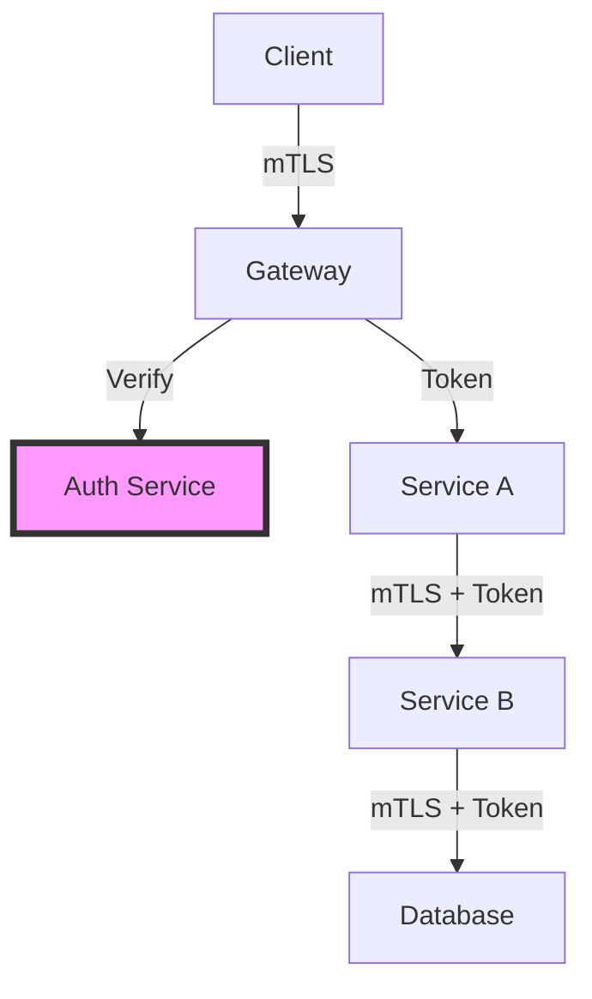

# Security in Distributed Systems

!!! warning "Important Note"
    While this compendium focuses on fundamental distributed systems principles, security is a critical cross-cutting concern that affects every axiom and pillar. This page provides an overview of security considerations mapped to our axioms.

## Security and the 8 Axioms

### Axiom 1: Latency → Security Trade-offs

**The Challenge**: Security mechanisms add latency
- TLS handshake: 1-2 RTTs
- Authentication checks: Database lookups
- Encryption/decryption: CPU time

**Design Considerations**:
```markdown
Security Latency Budget:
- TLS handshake: +20-40ms
- Token validation: +5-10ms  
- Encryption overhead: +1-5ms
- Total security tax: ~30-60ms

Trade-off Decision:
- Session caching to amortize auth cost
- Regional auth servers to reduce RTT
- Hardware acceleration for crypto
```

### Axiom 2: Capacity → DDoS and Resource Exhaustion

**The Challenge**: Finite resources are attack vectors
- Connection pool exhaustion
- Memory exhaustion attacks
- CPU starvation via crypto

**Protection Strategies**:
```python
# Rate limiting per identity
class SecurityRateLimiter:
    def __init__(self):
        self.limits = {
            'unauthenticated': 10,    # req/sec
            'authenticated': 100,      # req/sec
            'premium': 1000           # req/sec
        }
    
    def check_request(self, identity, request):
        # Fail closed on errors
        try:
            rate = self.get_rate(identity)
            return rate < self.limits[identity.tier]
        except Exception:
            return False  # Deny on error
```

### Axiom 3: Partial Failure → Security Degradation

**The Challenge**: Security systems can partially fail
- Auth service down but app running
- One region compromised, others safe
- Partial key rotation failures

**Graceful Degradation**:
```yaml
Security Failure Modes:
  auth_service_down:
    fallback: cache_recent_sessions
    duration: 5_minutes
    risk: replay_attacks
    
  cert_rotation_failed:
    fallback: extend_old_cert
    duration: 1_hour
    risk: continued_exposure
    
  regional_compromise:
    action: isolate_region
    fallback: redirect_traffic
    risk: availability_loss
```

### Axiom 4: Concurrency → Race Condition Exploits

**The Challenge**: Concurrent operations create security holes
- Double-spend attacks
- TOCTOU (Time-of-check to time-of-use)
- Race conditions in permissions

**Secure Patterns**:
```sql
-- Prevent concurrent token use
BEGIN TRANSACTION;
SELECT used FROM tokens WHERE id = ? FOR UPDATE;
-- Check if already used
UPDATE tokens SET used = true WHERE id = ? AND used = false;
-- Verify update happened
COMMIT;
```

### Axiom 5: Coordination → Distributed Trust

**The Challenge**: Trust requires coordination
- Byzantine nodes in consensus
- Distributed key management
- Multi-party computation

**Trust Models**:
```markdown
Trust Boundaries by Coordination Level:
1. No coordination: Zero trust, verify everything
2. Weak coordination: Trust but verify
3. Strong coordination: Byzantine fault tolerance
4. Full coordination: Shared secrets OK
```

### Axiom 6: Observability → Security Monitoring

**The Challenge**: Can't secure what you can't see
- Distributed tracing for security events
- Log correlation across nodes
- Anomaly detection at scale

**Security Observability**:
```yaml
Security Metrics:
  - failed_auth_rate
  - unusual_access_patterns
  - latency_anomalies (could indicate MitM)
  - geographic_anomalies
  - privilege_escalation_attempts

Correlation Required:
  - User ID across all services
  - Request ID for full trace
  - Timestamp synchronization
  - Geographic source tracking
```

### Axiom 7: Human Interface → Social Engineering

**The Challenge**: Humans are part of the attack surface
- Phishing for operator credentials
- Insider threats
- Misconfiguration risks

**Human-Centric Security**:
```markdown
Operator Security Controls:
1. Two-person authorization for critical ops
2. Time-delayed dangerous operations
3. Audit logs for all admin actions
4. Regular security training
5. Principle of least privilege
```

### Axiom 8: Economics → Security ROI

**The Challenge**: Security has costs
- Performance overhead
- Development complexity
- Operational burden

**Economic Security Decisions**:
```
Security Investment Formula:
Cost_of_Security = Implementation + Operations + Performance_Impact
Value_of_Security = Breach_Probability × Breach_Cost
ROI = (Value_of_Security - Cost_of_Security) / Cost_of_Security

Example:
- Breach probability: 10% per year
- Breach cost: $10M
- Security cost: $500K/year
- ROI: (0.1 × $10M - $500K) / $500K = 100%
```

## Security Patterns in Distributed Systems

### 1. Zero Trust Architecture



**Principles**:
- Never trust, always verify
- Authenticate every request
- Encrypt all communication
- Principle of least privilege

### 2. Defense in Depth

```yaml
Layer 1 - Network:
  - Firewalls
  - DDoS protection
  - Network segmentation

Layer 2 - Application:
  - Input validation
  - Output encoding
  - Session management

Layer 3 - Data:
  - Encryption at rest
  - Encryption in transit
  - Key rotation

Layer 4 - Operations:
  - Security monitoring
  - Incident response
  - Regular audits
```

### 3. Distributed Authentication

```python
class DistributedAuth:
    """Secure auth across regions"""
    
    def __init__(self):
        self.regional_validators = {}
        self.key_refresh_interval = 3600  # 1 hour
        
    async def validate_token(self, token, region):
        # Try local validation first
        local_result = await self.validate_local(token, region)
        if local_result.confident:
            return local_result
            
        # Fall back to authoritative region
        auth_region = self.get_auth_region(token)
        return await self.validate_remote(token, auth_region)
        
    def validate_local(self, token, region):
        # Check signature with cached public key
        # Verify expiration
        # Check revocation list
        pass
```

## Common Security Anti-Patterns

### ❌ Security Through Obscurity
**Why it fails**: Decompilers, reverse engineering, insider knowledge

### ❌ Hardcoded Secrets
**Why it fails**: Version control, memory dumps, config leaks

### ❌ Trusting the Client
**Why it fails**: Clients can be modified, spoofed, or compromised

### ❌ Rolling Your Own Crypto
**Why it fails**: Cryptography is hard, use established libraries

### ❌ Ignoring Security for Performance
**Why it fails**: Breaches cost more than milliseconds

## Security Checklist for Distributed Systems

### Design Phase
- [ ] Threat model created
- [ ] Trust boundaries identified
- [ ] Authentication strategy defined
- [ ] Authorization model chosen
- [ ] Encryption requirements specified
- [ ] Compliance requirements checked

### Implementation Phase
- [ ] Secure coding practices followed
- [ ] Dependencies scanned for vulnerabilities
- [ ] Secrets management implemented
- [ ] Input validation comprehensive
- [ ] Error messages don't leak info

### Deployment Phase
- [ ] Network segmentation configured
- [ ] Firewalls and security groups set
- [ ] TLS certificates valid
- [ ] Monitoring and alerting enabled
- [ ] Incident response plan ready

### Operations Phase
- [ ] Regular security updates
- [ ] Penetration testing scheduled
- [ ] Security training completed
- [ ] Audit logs reviewed
- [ ] Compliance maintained

## Key Takeaways

1. **Security is not a bolt-on**: Must be designed in from the start
2. **Defense in depth**: Multiple layers of security
3. **Fail securely**: Denied by default, explicit allows
4. **Monitor everything**: You can't secure what you can't see
5. **Human element**: Technology alone isn't enough

## Further Reading

- [OWASP Top 10](https://owasp.org/www-project-top-ten/)
- [Zero Trust Architecture (NIST)](https://www.nist.gov/publications/zero-trust-architecture)
- [Distributed Systems Security (Tanenbaum)](https://www.distributed-systems.net/index.php/books/ds3/)
- [Cryptography Engineering](https://www.schneier.com/books/cryptography-engineering/)

---

!!! info "Security Resources"
    While this compendium focuses on distributed systems fundamentals, security is a deep topic. For comprehensive security guidance, consult dedicated security resources and engage security professionals.