# Visual Design Standards for DStudio Documentation

This document defines comprehensive visual standards for the distributed systems documentation transformation, focusing on Mermaid diagrams, visual consistency, and performance visualization.

## Overview

### Design Philosophy
- **Visual-First**: Every concept should be visualized before being described
- **Progressive Disclosure**: Start simple, add complexity in layers
- **Cognitive Load Management**: Maximum information density with minimum mental overhead
- **Consistency**: Standardized colors, shapes, and patterns across all diagrams

### Color Palette

#### Primary Colors (Based on Material Theme)
```css
/* Core System Colors */
--primary-indigo: #3f51b5      /* Primary actions, headers */
--accent-cyan: #00bcd4         /* Highlights, success states */
--error-red: #f44336           /* Errors, warnings, failures */
--success-green: #4caf50       /* Success states, health */
--warning-orange: #ff9800      /* Warnings, degraded states */

/* Component Type Colors */
--service-blue: #2196f3        /* Services, APIs, applications */
--database-purple: #9c27b0     /* Databases, storage */
--network-teal: #009688        /* Networks, communication */
--compute-deep-orange: #ff5722 /* Compute, processing */
--security-brown: #795548      /* Security, authentication */

/* State Colors */
--healthy-green: #4caf50       /* Healthy, active, success */
--degraded-yellow: #ffeb3b     /* Degraded, warning */
--failed-red: #f44336          /* Failed, error, critical */
--unknown-gray: #9e9e9e        /* Unknown, pending */

/* Excellence Tier Colors */
--gold-tier: #ffd700           /* Gold patterns */
--silver-tier: #c0c0c0         /* Silver patterns */
--bronze-tier: #cd7f32         /* Bronze patterns */
```

## Mermaid Diagram Templates

### 1. State Machine Templates

#### Circuit Breaker State Machine


#### Saga Transaction State Machine


### 2. Architecture Diagram Templates

#### Microservices Communication Pattern

```mermaid
graph TB
    subgraph "Client Layer"
        Mobile[📱 Mobile App]
        Web[🌐 Web App]
        API_Gateway[🚪 API Gateway]
    end
    
    subgraph "Service Mesh"
        Auth[🔐 Auth Service]
        User[👤 User Service] 
        Order[📦 Order Service]
        Payment[💳 Payment Service]
        Notification[📧 Notification]
    end
    
    subgraph "Data Layer"
        UserDB[(👤 User DB)]
        OrderDB[(📦 Order DB)]
        PaymentDB[(💳 Payment DB)]
        Cache{{🎯 Redis Cache}}
        Queue[📨 Message Queue]
    end
    
    Mobile --> API_Gateway
    Web --> API_Gateway
    API_Gateway --> Auth
    API_Gateway --> User
    API_Gateway --> Order
    API_Gateway --> Payment
    
    User --> UserDB
    User --> Cache
    Order --> OrderDB
    Order --> Queue
    Payment --> PaymentDB
    Queue --> Notification
    
    classDef client fill:#e3f2fd,stroke:#1976d2,color:#000
    classDef service fill:#f3e5f5,stroke:#7b1fa2,color:#000
    classDef database fill:#e8f5e8,stroke:#388e3c,color:#000
    classDef infrastructure fill:#fff3e0,stroke:#f57c00,color:#000
    
    class Mobile,Web,API_Gateway client
    class Auth,User,Order,Payment,Notification service
    class UserDB,OrderDB,PaymentDB database
    class Cache,Queue infrastructure
```


#### Event-Driven Architecture Pattern


### 3. Sequence Diagram Templates

#### Distributed Transaction Flow
```mermaid
sequenceDiagram
    participant Client
    participant OrderService as 📦 Order Service
    participant PaymentService as 💳 Payment Service
    participant InventoryService as 📋 Inventory Service
    participant NotificationService as 📧 Notification
    
    Note over Client,NotificationService: Saga Pattern Implementation
    
    Client->>+OrderService: CreateOrder(items, userId)
    
    OrderService->>+InventoryService: ReserveItems(items)
    InventoryService-->>-OrderService: ✅ Items Reserved
    
    OrderService->>+PaymentService: ProcessPayment(amount, userId)
    
    alt Payment Success
        PaymentService-->>-OrderService: ✅ Payment Confirmed
        OrderService->>+InventoryService: ConfirmReservation()
        InventoryService-->>-OrderService: ✅ Confirmed
        OrderService->>NotificationService: OrderConfirmed Event
        OrderService-->>-Client: ✅ Order Created
    else Payment Failure
        PaymentService-->>-OrderService: ❌ Payment Failed
        OrderService->>+InventoryService: CancelReservation()
        InventoryService-->>-OrderService: ✅ Cancelled
        OrderService-->>-Client: ❌ Order Failed
    end
    
    Note over Client,NotificationService: Compensation handled automatically
```

#### API Gateway Request Flow
```mermaid
sequenceDiagram
    participant Client as 📱 Client
    participant Gateway as 🚪 API Gateway
    participant Auth as 🔐 Auth Service
    participant RateLimit as ⚡ Rate Limiter
    participant Cache as 🎯 Cache
    participant Service as 🔧 Microservice
    participant DB as 🗄️ Database
    
    Client->>+Gateway: API Request
    
    Gateway->>+Auth: Validate JWT Token
    Auth-->>-Gateway: ✅ Valid User
    
    Gateway->>+RateLimit: Check Rate Limit
    RateLimit-->>-Gateway: ✅ Within Limit
    
    Gateway->>+Cache: Check Cache
    
    alt Cache Hit
        Cache-->>Gateway: ✅ Cached Response
        Gateway-->>-Client: Response (Fast Path)
    else Cache Miss
        Cache-->>-Gateway: ❌ Not Found
        Gateway->>+Service: Forward Request
        Service->>+DB: Query Data
        DB-->>-Service: Data Response
        Service-->>-Gateway: Service Response
        Gateway->>Cache: Store in Cache
        Gateway-->>-Client: Response (Slow Path)
    end
```

### 4. Flowchart Templates

#### Error Handling Decision Tree


#### Load Balancer Algorithm Selection


### 5. Gantt Chart Templates

#### Migration Timeline Template


## Visual Consistency Guidelines

### 1. Shape Conventions

#### Service Types
- **Web Services**: Rectangles with rounded corners `[Service Name]`
- **Databases**: Cylinders with database symbol `[(🗄️ DB Name)]`
- **Caches**: Diamonds with cache symbol `{{🎯 Cache}}`
- **Message Queues**: Rectangles with queue symbol `[📨 Queue Name]`
- **External APIs**: Rectangles with API symbol `[🌐 External API]`

#### Process States
- **Start/End**: Rounded rectangles `([Process])`
- **Processes**: Rectangles `[Process Name]`
- **Decisions**: Diamonds `{Decision?}`
- **Databases**: Cylinders `[(Database)]`
- **Manual Steps**: Trapezoids (when supported)

#### Network Elements
- **Load Balancers**: Hexagons with LB symbol `{{⚖️ Load Balancer}}`
- **Gateways**: Rectangles with gateway symbol `[🚪 Gateway]`
- **Proxies**: Rectangles with proxy symbol `[🔄 Proxy]`

### 2. Icon Standards

#### Service Categories
- 👤 User/Identity Services
- 📦 Order/Commerce Services
- 💳 Payment/Financial Services
- 📧 Notification/Communication
- 📊 Analytics/Reporting
- 🔐 Security/Authentication
- 🎯 Cache/Performance
- 📨 Messaging/Queue
- 🗄️ Database/Storage
- 🌐 External/API
- 🚪 Gateway/Proxy
- ⚖️ Load Balancer
- 🔄 Circuit Breaker
- 📋 Configuration
- 📝 Logging/Audit
- 🎛️ Monitoring

#### Status Indicators
- ✅ Success/Healthy
- ❌ Error/Failed
- ⚠️ Warning/Degraded
- ⏳ Pending/Processing
- 🔄 Retry/Recovery
- 🛑 Stopped/Blocked
- 🚧 Maintenance/Upgrading

### 3. Labeling Conventions

#### Service Names
- Format: `[🔧 Service Name]`
- Include icon relevant to service type
- Use title case for readability
- Keep names concise (max 15 characters)

#### Data Flows
- Use descriptive arrow labels
- Include data types: `UserCreated Event`, `HTTP Request`, `SQL Query`
- Add timing when relevant: `Every 30s`, `On demand`
- Show data format: `JSON`, `Protobuf`, `SQL`

#### State Transitions
- Use action verbs: `Start`, `Process`, `Complete`, `Fail`
- Include conditions: `Success`, `Timeout`, `Error > 50%`
- Add timing: `After 30s`, `Within 5ms`

## Complexity Management

### 1. Progressive Disclosure Levels

#### Level 1: High-Level Overview (5-7 components max)
- Show only main services and critical connections
- Use broad categories rather than specific services
- Focus on data flow direction

#### Level 2: Detailed Architecture (10-15 components max)  
- Break down main services into specific microservices
- Show primary databases and caches
- Include load balancers and gateways

#### Level 3: Implementation Details (20+ components allowed)
- Include all services, databases, queues, caches
- Show error handling paths
- Include monitoring and logging components

### 2. Diagram Size Limits

#### Small Diagrams (< 10 nodes)
- Simple flowcharts and decision trees
- Basic state machines
- Single-service architectures

#### Medium Diagrams (10-20 nodes)
- Multi-service architectures
- Complex state machines
- Sequence diagrams with multiple participants

#### Large Diagrams (20+ nodes)
- Enterprise architectures
- Complete system overviews
- Migration roadmaps

## Pattern-Specific Visual Requirements

### 1. Resilience Patterns

#### Required Elements
- **State Visualization**: Always show system states (healthy, degraded, failed)
- **Failure Paths**: Clearly mark error conditions and recovery paths
- **Timing Elements**: Include timeouts, delays, and recovery periods
- **Metrics**: Show thresholds, counters, and health indicators

#### Example Components


```mermaid
graph LR
    subgraph "Resilience Components"
        CB[🔄 Circuit Breaker<br/>State: CLOSED<br/>Errors: 2/5]
        TO[⏱️ Timeout<br/>30s budget<br/>Used: 15s]
        RT[🔁 Retry Logic<br/>Attempt: 2/3<br/>Backoff: 2s]
    end
    
    classDef healthy fill:#4caf50,stroke:#2e7d32,color:#fff
    classDef timing fill:#ff9800,stroke:#e65100,color:#fff
    classDef retry fill:#2196f3,stroke:#1976d2,color:#fff
    
    class CB healthy
    class TO timing
    class RT retry
```

### 2. Scaling Patterns

#### Required Elements
- **Load Distribution**: Show how load is distributed across resources
- **Scaling Metrics**: Include current vs. target capacity
- **Resource Utilization**: CPU, memory, network usage indicators
- **Scaling Triggers**: Thresholds and scaling rules

#### Example Components


```mermaid
graph TD
    subgraph "Auto-Scaling Group"
        LB[⚖️ Load Balancer<br/>RPS: 10K]
        
        subgraph "Current Instances: 5/10"
            S1[🖥️ Server 1<br/>CPU: 75%]
            S2[🖥️ Server 2<br/>CPU: 82%]
            S3[🖥️ Server 3<br/>CPU: 68%]
        end
        
        ASG[📈 Auto Scaler<br/>Target: 70% CPU<br/>Scale Out: +2 instances]
    end
    
    LB --> S1
    LB --> S2  
    LB --> S3
    ASG --> S1
    ASG --> S2
    ASG --> S3
    
    classDef loadbalancer fill:#ff9800,stroke:#e65100,color:#fff
    classDef server fill:#4caf50,stroke:#2e7d32,color:#fff
    classDef autoscaler fill:#2196f3,stroke:#1976d2,color:#fff
    
    class LB loadbalancer
    class S1,S2,S3 server
    class ASG autoscaler
```

### 3. Data Patterns

#### Required Elements
- **Data Flow Direction**: Clear arrows showing data movement
- **Consistency Levels**: Strong, eventual, or weak consistency
- **Transformation Points**: Where data is processed or transformed
- **Storage Types**: Operational vs. analytical storage

#### Example Components


```mermaid
graph LR
    subgraph "Event Sourcing Pattern"
        CMD[📝 Command<br/>Write Model]
        ES[📚 Event Store<br/>Append Only]
        PROJ[📊 Projections<br/>Read Models]
        
        CMD -->|Events| ES
        ES -->|Event Stream| PROJ
        
        ES -.->|Replay| PROJ
    end
    
    classDef command fill:#f44336,stroke:#c62828,color:#fff
    classDef eventstore fill:#4caf50,stroke:#2e7d32,color:#fff
    classDef projection fill:#2196f3,stroke:#1976d2,color:#fff
    
    class CMD command
    class ES eventstore
    class PROJ projection
```

### 4. Communication Patterns

#### Required Elements
- **Protocol Information**: HTTP, gRPC, messaging, etc.
- **Synchronous vs. Asynchronous**: Clear distinction in visual style
- **Message Types**: Request/response, events, commands
- **Error Handling**: Show failure paths and retries

#### Example Components


## Performance Visualization Standards

### 1. Latency Distribution Charts

#### P50, P95, P99 Visualization

```mermaid
graph LR
    subgraph "Response Time Distribution"
        P50[P50: 45ms<br/>📊 ████████░░]
        P95[P95: 120ms<br/>📊 █████████░]
        P99[P99: 280ms<br/>📊 ██████████]
        SLA[SLA: 200ms<br/>✅ Within target]
    end
    
    classDef fast fill:#4caf50,stroke:#2e7d32,color:#fff
    classDef acceptable fill:#ff9800,stroke:#e65100,color:#fff
    classDef slow fill:#f44336,stroke:#c62828,color:#fff
    classDef sla fill:#2196f3,stroke:#1976d2,color:#fff
    
    class P50 fast
    class P95 acceptable
    class P99 slow
    class SLA sla
```


### 2. Scaling Behavior Curves

#### Throughput vs. Load

```mermaid
graph LR
    subgraph "System Performance Profile"
        Zone1[🟢 Linear Zone<br/>0-1K RPS<br/>Response: <50ms]
        Zone2[🟡 Saturation Zone<br/>1K-2K RPS<br/>Response: <200ms]
        Zone3[🔴 Degradation Zone<br/>2K+ RPS<br/>Response: >500ms]
        
        Zone1 --> Zone2
        Zone2 --> Zone3
    end
    
    classDef linear fill:#4caf50,stroke:#2e7d32,color:#fff
    classDef saturation fill:#ff9800,stroke:#e65100,color:#fff
    classDef degradation fill:#f44336,stroke:#c62828,color:#fff
    
    class Zone1 linear
    class Zone2 saturation
    class Zone3 degradation
```


### 3. Resource Utilization Dashboards

#### Multi-dimensional Resource View

```mermaid
graph TD
    subgraph "Resource Utilization Dashboard"
        CPU[🔥 CPU Usage<br/>█████████░ 85%<br/>Threshold: 80%]
        MEM[🧠 Memory<br/>███████░░░ 72%<br/>Threshold: 85%]
        NET[🌐 Network I/O<br/>████░░░░░░ 45%<br/>Threshold: 70%]
        DISK[💾 Disk I/O<br/>██████░░░░ 63%<br/>Threshold: 80%]
        
        ALERT[🚨 CPU Alert<br/>Scale-out triggered]
        CPU --> ALERT
    end
    
    classDef warning fill:#ff9800,stroke:#e65100,color:#fff
    classDef normal fill:#4caf50,stroke:#2e7d32,color:#fff
    classDef alert fill:#f44336,stroke:#c62828,color:#fff
    
    class CPU,ALERT warning
    class MEM,NET,DISK normal
```


### 4. Availability and Error Rate Tracking

#### SLA Dashboard

```mermaid
graph LR
    subgraph "SLA Monitoring Dashboard"
        UP[🟢 Uptime<br/>99.95%<br/>Target: 99.9%]
        ERR[📊 Error Rate<br/>0.05%<br/>Target: <0.1%]
        LAT[⚡ Latency<br/>P95: 85ms<br/>Target: <100ms]
        THR[📈 Throughput<br/>5.2K RPS<br/>Capacity: 8K RPS]
        
        STATUS[✅ All SLAs Met<br/>System Healthy]
        
        UP --> STATUS
        ERR --> STATUS
        LAT --> STATUS
        THR --> STATUS
    end
    
    classDef excellent fill:#4caf50,stroke:#2e7d32,color:#fff
    classDef status fill:#2196f3,stroke:#1976d2,color:#fff
    
    class UP,ERR,LAT,THR,STATUS excellent
```


## Implementation Guidelines

### 1. Mermaid Configuration

#### Recommended Settings
```javascript
/ MkDocs mermaid2 plugin configuration
mermaid: {
  theme: 'base',
  themeVariables: {
    primaryColor: '#3f51b5',
    primaryTextColor: '#ffffff',
    primaryBorderColor: '#303f9f',
    lineColor: '#757575',
    sectionBkgColor: '#f5f5f5',
    altSectionBkgColor: '#e8eaf6',
    gridColor: '#e0e0e0',
    secondaryColor: '#00bcd4',
    tertiaryColor: '#ff9800'
  },
  flowchart: {
    nodeSpacing: 50,
    rankSpacing: 50,
    curve: 'basis'
  },
  sequence: {
    diagramMarginX: 50,
    diagramMarginY: 10,
    actorMargin: 50,
    width: 150,
    height: 65,
    boxMargin: 10,
    boxTextMargin: 5,
    noteMargin: 10,
    messageMargin: 35
  }
}
```

### 2. Responsive Design Considerations

#### Mobile-First Diagram Design
- Maximum 5-7 nodes on mobile viewports
- Use hierarchical disclosure (expand/collapse)
- Ensure text remains readable at small sizes
- Consider horizontal scrolling for complex diagrams

#### Breakpoint-Specific Adaptations
```css
/* Mobile: Simplify diagrams */
@media (max-width: 768px) {
  .mermaid {
    font-size: 12px;
    max-width: 100vw;
    overflow-x: auto;
  }
}

/* Tablet: Medium complexity */
@media (min-width: 769px) and (max-width: 1024px) {
  .mermaid {
    font-size: 14px;
  }
}

/* Desktop: Full complexity */
@media (min-width: 1025px) {
  .mermaid {
    font-size: 16px;
  }
}
```

### 3. Accessibility Standards

#### Color Blindness Considerations
- Never rely solely on color to convey information
- Use patterns, shapes, and icons alongside colors
- Provide text alternatives for color-coded elements
- Test with color blindness simulators

#### Screen Reader Support
- Include descriptive alt text for complex diagrams
- Use semantic HTML structure around diagrams
- Provide text-based alternatives for visual information

## Quality Assurance Checklist

### Diagram Review Criteria
- [ ] **Visual Clarity**: All text is readable at standard zoom levels
- [ ] **Color Consistency**: Uses approved color palette
- [ ] **Icon Usage**: Appropriate icons from standard set
- [ ] **Complexity**: Appropriate level of detail for target audience
- [ ] **Mobile Responsive**: Readable on mobile devices
- [ ] **Accessibility**: Passes color contrast requirements
- [ ] **Performance**: Renders quickly (<2 seconds)
- [ ] **Accuracy**: Technically accurate representation
- [ ] **Completeness**: Includes all essential elements
- [ ] **Style Compliance**: Follows established conventions

### Performance Benchmarks
- **Render Time**: <2 seconds for complex diagrams
- **Mobile Performance**: <3 seconds on 3G networks
- **File Size**: <50KB per diagram for optimal loading
- **Accessibility Score**: WCAG 2.1 AA compliance minimum

---

This visual design standard ensures consistency, clarity, and effectiveness across all DStudio documentation diagrams while maintaining the educational focus and progressive disclosure approach that makes complex distributed systems concepts accessible to learners at all levels.