# Visual Implementation Guide for DStudio Documentation

This guide provides step-by-step instructions for implementing the comprehensive visual standards across all DStudio documentation, ensuring consistency and maximum educational impact.

## Quick Start Checklist

### For New Pattern Documentation
- [ ] **Choose appropriate template** from the template library
- [ ] **Customize colors** using the approved palette
- [ ] **Add proper icons** from the standard icon set  
- [ ] **Set complexity level** appropriate for target audience
- [ ] **Include performance metrics** where applicable
- [ ] **Test mobile responsiveness** on multiple devices
- [ ] **Validate accessibility** with color contrast tools
- [ ] **Review diagram accuracy** with technical experts

---

## Implementation Workflow

### Phase 1: Pattern Analysis (5 minutes)

#### 1.1 Classify Your Pattern
```markdown
**Pattern Type Classification:**
- 🔄 Resilience Pattern → Use state machines + error flows
- 📈 Scaling Pattern → Use performance curves + resource charts
- 💾 Data Pattern → Use data flow + consistency models  
- 🗣️ Communication Pattern → Use sequence diagrams + protocols
- 🏗️ Architecture Pattern → Use service diagrams + layers
```

#### 1.2 Determine Complexity Level
```markdown
**Complexity Assessment:**
- **Level 1 (Beginner)**: 5-7 components max, high-level overview
- **Level 2 (Intermediate)**: 8-15 components, detailed interactions  
- **Level 3 (Advanced)**: 16+ components, full implementation details
```

#### 1.3 Identify Key Visualizations Needed
```markdown
**Essential Diagrams (Choose 2-3):**
- State machine for behavior
- Architecture diagram for structure  
- Sequence diagram for interactions
- Flowchart for decision logic
- Performance chart for metrics
```

### Phase 2: Template Selection (2 minutes)

#### 2.1 Primary Template Selection


#### 2.2 Supporting Template Selection
```markdown
**Secondary Diagrams:**
- Add flowchart for error handling logic
- Include performance visualization for scaling patterns
- Add decision tree for algorithm selection
- Include timeline for migration patterns
```

### Phase 3: Customization (10 minutes)

#### 3.1 Color Scheme Application
```css
/* Apply standard color scheme */
classDef healthy fill:#4caf50,stroke:#2e7d32,color:#fff
classDef warning fill:#ff9800,stroke:#e65100,color:#fff  
classDef critical fill:#f44336,stroke:#c62828,color:#fff
classDef process fill:#2196f3,stroke:#1976d2,color:#fff
classDef data fill:#9c27b0,stroke:#6a1b9a,color:#fff
```

#### 3.2 Icon Integration
```markdown
**Standard Icons by Category:**
- Services: 🔧 ⚙️ 🛠️
- Databases: 🗄️ 💾 📊
- Communication: 📡 📨 🌐
- Security: 🔐 🛡️ 🔒
- Monitoring: 📊 📈 🎯
- Users: 👤 👥 🏢
```

#### 3.3 Label Standardization
```markdown
**Naming Conventions:**
- Services: [🔧 Service Name]
- Databases: [(💾 Database Name)]
- Caches: {{🎯 Cache Name}}
- Queues: [📨 Queue Name]
- External: [🌐 External System]
```

### Phase 4: Content Integration (15 minutes)

#### 4.1 Progressive Disclosure Structure
```markdown
## Level 1: Intuition (5 min read)
### Visual Overview
[High-level architecture diagram]

### Core Concept
[Simple state machine or flow]

## Level 2: Implementation (15 min read)  
### Detailed Architecture
[Comprehensive service diagram]

### Interaction Patterns
[Sequence diagrams]

## Level 3: Production (30 min read)
### Performance Characteristics
[Performance visualization]

### Operational Concerns
[Monitoring and alerting diagrams]
```

#### 4.2 Diagram Integration Points
```markdown
**Standard Integration Pattern:**
1. **Problem Statement** → Decision tree diagram
2. **Solution Overview** → Architecture diagram  
3. **Implementation Details** → Sequence diagram
4. **Performance Analysis** → Performance charts
5. **Operational Guide** → Monitoring dashboard
```

---

## Diagram-Specific Implementation

### State Machine Diagrams

#### Step 1: Base Template


#### Step 2: Customization
```markdown
**Customization Checklist:**
- [ ] Replace StateA/B/C with domain-specific states
- [ ] Update conditions with actual trigger conditions
- [ ] Add sub-states for complex behaviors
- [ ] Include timing information on transitions
- [ ] Add error recovery paths
- [ ] Apply appropriate color coding
```

#### Step 3: Enhancement


### Architecture Diagrams

#### Step 1: Service Identification
```markdown
**Service Inventory:**
- Client-facing services: Web, Mobile, API Gateway
- Core business services: User, Order, Payment, Inventory
- Infrastructure services: Cache, Queue, Database
- External services: Third-party APIs, CDN
```

#### Step 2: Layered Architecture

```mermaid
graph TB
    subgraph "Presentation Layer"
        Web[🌐 Web App]
        Mobile[📱 Mobile App]
    end
    
    subgraph "API Layer"  
        Gateway[🚪 API Gateway]
    end
    
    subgraph "Business Layer"
        UserSvc[👤 User Service]
        OrderSvc[📦 Order Service]
    end
    
    subgraph "Data Layer"
        UserDB[(👤 User DB)]
        OrderDB[(📦 Order DB)]
    end
```


#### Step 3: Connection Mapping
```markdown
**Connection Types:**
- Solid arrows: Synchronous calls
- Dashed arrows: Asynchronous events
- Thick arrows: High-volume data flow
- Dotted arrows: Occasional interactions
```

### Sequence Diagrams

#### Step 1: Participant Setup

```mermaid
sequenceDiagram
    participant C as 📱 Client
    participant G as 🚪 Gateway
    participant S as 🔧 Service
    participant D as 🗄️ Database
```


#### Step 2: Happy Path Flow


#### Step 3: Error Handling Addition
```mermaid
sequenceDiagram
    participant Client
    participant Gateway
    participant Service
    participant Database
    
    Client->>+Gateway: Request
    Gateway->>+Service: Process
    Service->>+Database: Query
    
    alt Success Path
        Database-->>Service: ✅ Data
        Service-->>Gateway: ✅ Response
        Gateway-->>-Client: ✅ Success
    else Database Error
        Database-->>-Service: ❌ Error
        Service->>Service: Log error
        Service-->>Gateway: ❌ 500 Error
        Gateway-->>-Client: ❌ Service Unavailable
    end
```

### Performance Visualizations

#### Step 1: Metric Selection
```markdown
**Performance Metrics:**
- Latency: P50, P95, P99 response times
- Throughput: Requests per second, transactions per second
- Resource: CPU, memory, disk, network utilization
- Availability: Uptime percentage, error rates
```

#### Step 2: Visualization Type Selection
```markdown
**Chart Types by Data:**
- Time series → Line charts with trends
- Distributions → Histogram or percentile charts  
- Comparisons → Bar charts or radar charts
- Relationships → Scatter plots or heat maps
```

#### Step 3: Dashboard Layout

```mermaid
graph TD
    subgraph "📊 Performance Dashboard"
        Latency[⚡ Latency Metrics<br/>P95: 85ms<br/>Target: <100ms<br/>Status: ✅]
        
        Throughput[📈 Throughput<br/>Current: 2.5K RPS<br/>Peak: 3.2K RPS<br/>Capacity: 80%]
        
        Errors[❌ Error Rate<br/>Current: 0.03%<br/>Target: <0.1%<br/>Status: ✅]
        
        Resources[🖥️ Resource Usage<br/>CPU: 72%<br/>Memory: 68%<br/>Status: ⚠️]
    end
```


---

## Quality Assurance Process

### Visual Review Checklist

#### Technical Accuracy
- [ ] **Diagram represents actual system behavior**
- [ ] **All components and connections are accurate**
- [ ] **Timing and sequences are correct**
- [ ] **Error paths are properly shown**
- [ ] **Scale and capacity numbers are realistic**

#### Visual Consistency  
- [ ] **Colors match approved palette**
- [ ] **Icons are from standard set**
- [ ] **Labels follow naming conventions**
- [ ] **Styling classes are applied correctly**
- [ ] **Diagram size is appropriate for complexity**

#### Educational Effectiveness
- [ ] **Information hierarchy is clear**
- [ ] **Progressive disclosure is implemented**
- [ ] **Key insights are highlighted**
- [ ] **Supporting text complements visuals**
- [ ] **Multiple learning styles accommodated**

#### Accessibility Compliance
- [ ] **Color contrast meets WCAG 2.1 AA standards**
- [ ] **Information not conveyed by color alone**
- [ ] **Alternative text provided for complex diagrams**
- [ ] **Scalable for different screen sizes**
- [ ] **Readable at minimum 12px font size**

### Testing Protocol

#### Device Testing
```markdown
**Test Devices:**
- Mobile: iPhone 12, Samsung Galaxy S21
- Tablet: iPad Pro, Surface Pro
- Desktop: 1920×1080, 2560×1440, 4K displays
- Accessibility: Screen reader, high contrast mode
```

#### Performance Testing
```markdown
**Performance Benchmarks:**
- Render time: <2 seconds on 3G
- File size: <50KB per diagram  
- Memory usage: <10MB for complex diagrams
- Network requests: Minimal external dependencies
```

#### Browser Compatibility
```markdown
**Supported Browsers:**
- Chrome 90+, Firefox 88+, Safari 14+
- Edge 90+, Mobile browsers
- Test Mermaid rendering across all browsers
- Verify fallback behavior for unsupported features
```

---

## Advanced Implementation Patterns

### Interactive Diagram Elements

#### Clickable Navigation
```html
<!-- HTML wrapper for interactive diagrams -->
<div class="interactive-diagram">
    <div class="diagram-controls">
        <button onclick="showLevel(1)">Level 1: Overview</button>
        <button onclick="showLevel(2)">Level 2: Details</button>
        <button onclick="showLevel(3)">Level 3: Implementation</button>
    </div>
    <div id="mermaid-container">
        <!-- Mermaid diagram inserted here -->
    </div>
</div>
```

#### Progressive Disclosure
```javascript
// JavaScript for progressive disclosure
function showLevel(level) {
    const diagrams = {
        1: 'graph TD\n    A[Simple Overview] --> B[Key Concept]',
        2: 'graph TD\n    A[Detailed View] --> B[Component 1]\n    A --> C[Component 2]',
        3: 'graph TD\n    A[Full Implementation] --> B[Service 1]\n    B --> C[Database]'
    };
    
    mermaid.render('diagram', diagrams[level], (svgCode) => {
        document.getElementById('mermaid-container').innerHTML = svgCode;
    });
}
```

### Animation and Transitions

#### CSS Transitions
```css
/* Smooth transitions for diagram updates */
.mermaid {
    transition: opacity 0.3s ease-in-out;
}

.mermaid.updating {
    opacity: 0.5;
}

.diagram-node {
    transition: all 0.2s ease;
}

.diagram-node:hover {
    transform: scale(1.05);
    filter: brightness(110%);
}
```

#### State Animation
```css
/* Animate state changes */
@keyframes state-change {
    0% { 
        opacity: 0.5; 
        transform: scale(0.95); 
    }
    50% { 
        opacity: 1; 
        transform: scale(1.05); 
    }
    100% { 
        opacity: 1; 
        transform: scale(1); 
    }
}

.state-active {
    animation: state-change 0.5s ease-in-out;
}
```

### Multi-Modal Content

#### Diagram + Code Integration
```markdown
## Circuit Breaker Implementation

### Visual Overview


### Code Implementation
```java
public class CircuitBreaker {
    private State state = State.CLOSED;
    // Implementation details...
}
```

#### Synchronized Explanations
```markdown
**Visual-Text Synchronization:**
1. Show state diagram
2. Highlight current state being explained
3. Provide corresponding code snippet
4. Include performance metrics
5. Link to related patterns
```

---

## Maintenance and Evolution

### Version Control for Diagrams

#### Diagram Versioning Strategy
```markdown
**Versioning Approach:**
- Track diagram source in git alongside documentation
- Use semantic versioning for major diagram changes
- Include change notes explaining visual updates
- Maintain backward compatibility for embedded diagrams
```

#### Update Process
```markdown
**Diagram Update Workflow:**
1. Identify outdated or inaccurate diagrams
2. Update source Mermaid code
3. Test rendering across devices
4. Review for consistency with standards
5. Update related documentation
6. Deploy and monitor for issues
```

### Scalability Considerations

#### Large-Scale Deployments
```markdown
**Scaling Strategies:**
- Use CDN for diagram assets
- Implement lazy loading for complex pages
- Cache rendered SVG outputs
- Optimize for mobile-first rendering
- Consider server-side rendering for performance
```

#### Template Management
```markdown
**Template Library Management:**
- Centralized template repository
- Version control for template updates  
- Automated testing for template changes
- Documentation for template customization
- Migration guides for template updates
```

---

This implementation guide provides a complete framework for applying the DStudio visual standards consistently across all documentation, ensuring both technical accuracy and educational effectiveness while maintaining scalability and maintainability.