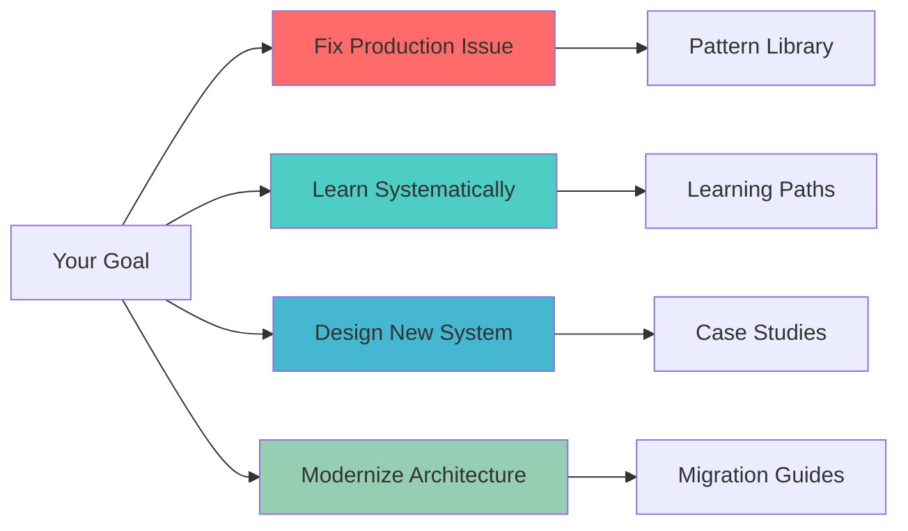

# Start Here: Quick Orientation Guide

**Reading time:** ~5 minutes

> **Already know what you need?** Jump directly to: [Emergency Fixes](#emergency-fixes) | [Learning Paths](#structured-learning-paths) | [Pattern Selection](#pattern-selection-guide) | [Migration Guides](#migration-playbooks)

## Table of Contents

- [What Brings You Here Today?](#what-brings-you-here-today)
  - [🔥 "Our system is on fire!"](#-our-system-is-on-fire)
  - [📚 "I want to learn properly"](#-i-want-to-learn-properly)
    - [Choose Your Path](#choose-your-path)
    - [Quick Learning Wins](#quick-learning-wins)
  - [🏗️ "I'm designing a new system"](#-im-designing-a-new-system)
    - [Pattern Selection by Scale](#pattern-selection-by-scale)
  - [🔄 "I need to migrate/modernize"](#-i-need-to-migratemodernize)
    - [Popular Migrations](#popular-migrations)
- [Quick Navigation](#quick-navigation)
  - [By Problem Domain](#by-problem-domain)
  - [By Company](#by-company)
- [Learning Resources](#learning-resources)
  - [Essential References](#essential-references)
  - [Tools & Calculators](#tools-calculators)
  - [Community & Updates](#community-updates)
- [Not Sure Where to Start?](#not-sure-where-to-start)


## Quick Orientation

DStudio contains **130+ patterns**, **60+ case studies**, and **7 fundamental laws** organized into a comprehensive learning framework. This guide helps you quickly find what you need based on your immediate goals.

### Your 3-Minute Roadmap



## Emergency Fixes

### 🔥 Production Fire? Here's Your Toolkit

| Problem | Immediate Fix | Time to Deploy | Root Cause Analysis |
| **Service failures cascading** | [Circuit Breaker](../pattern-library/resilience/circuit-breaker.md) | 1 hour | [Law of Correlated Failure](../core-principles/laws/correlated-failure.md) |
| **Database overwhelmed** | [Read replicas + Caching](../pattern-library/scaling/caching-strategies.md) | 2 hours | [State Distribution Pillar](../core-principles/pillars/state-distribution.md) |
| **API rate limit breaches** | [Rate Limiting](../pattern-library/scaling/rate-limiting.md) + [Backpressure](../pattern-library/scaling/backpressure.md) | 30 mins | [Work Distribution Pillar](../core-principles/pillars/work-distribution.md) |
| **Data inconsistency** | [Saga pattern](../pattern-library/data-management/saga.md) or [2PC](../pattern-library/coordination/two-phase-commit.md) | 4 hours | [Truth Distribution Pillar](../core-principles/pillars/truth-distribution.md) |
| **Service discovery failing** | [Service Registry](../pattern-library/communication/service-registry.md) + [Health Checks](../pattern-library/observability/health-checks.md) | 1 hour | [Control Distribution Pillar](../core-principles/pillars/control-distribution.md) |
| **Memory/CPU spikes** | [Bulkhead](../pattern-library/resilience/bulkhead.md) + [Load Shedding](../pattern-library/scaling/load-shedding.md) | 45 mins | [Law of Emergent Chaos](../core-principles/laws/emergent-chaos.md) |
| **Network partitions** | [Partition Tolerance Patterns](../pattern-library/resilience/partition-tolerance.md) | 2 hours | [Law of Asynchronous Reality](../core-principles/laws/asynchronous-reality.md) |

**🎯 Quick Win:** Start with [Circuit Breaker](../pattern-library/resilience/circuit-breaker.md) — it prevents 80% of cascade failures and takes <1 hour to implement.

[**→ All Emergency Patterns**](../pattern-library/resilience/index.md) | [**→ Troubleshooting Guide**](../troubleshooting/index.md)

## Structured Learning Paths

### 📚 Choose Your Learning Journey

| Path | For You If... | Duration | What You'll Build | Certification |
| [**Foundations**](../architects-handbook/learning-paths/new-graduate.md) | You're new to distributed systems | 10 weeks | URL shortener handling 10K RPS | Foundation Certificate |
| [**Advanced**](../architects-handbook/learning-paths/senior-engineer.md) | You have 3+ years experience | 8 weeks | Multi-region system with <100ms latency | Advanced Certificate |
| [**Architecture**](../architects-handbook/learning-paths/architect.md) | You're leading system design | 6 weeks | Architecture for 100M+ users | Architect Certificate |
| [**Leadership**](../architects-handbook/learning-paths/manager.md) | You're managing teams | 4 weeks | Lead complex migrations | Leadership Certificate |

**Specialized Tracks:**
- [**DevOps/SRE Path**](../architects-handbook/learning-paths/devops-sre.md) — Monitoring, deployment, incident response
- [**Data Engineering Path**](../architects-handbook/learning-paths/data-engineer.md) — Streaming, batch processing, data lakes
- [**Security Path**](../architects-handbook/learning-paths/security-specialist.md) — Zero-trust, encryption, compliance
- [**Machine Learning Path**](../architects-handbook/learning-paths/ml-engineer.md) — Distributed training, feature stores, serving

### 🎯 Fast Track: Core Concepts

Master these in order for maximum impact:

1. **[The 7 Fundamental Laws](../core-principles/laws/index.md)** (30 min) — Understand the unbreakable rules
2. **[The 5 Core Pillars](../core-principles/pillars/index.md)** (2 hours) — Learn architectural dimensions
3. **[Top 10 Patterns](../pattern-library/index.md#essential-patterns)** (1 day) — Cover 80% of use cases
4. **[Netflix Case Study](../architects-handbook/case-studies/elite-engineering/netflix-chaos-engineering.md)** (1 hour) — See everything in action

## Pattern Selection Guide

### 🏗️ Right Patterns for Your Scale

| Users | Data | Requests/sec | Essential Patterns | Reference Architecture |
| **<10K** | <1GB | <100 | Monolith, CDN, Simple Cache, Load Balancer | [URL Shortener](../architects-handbook/case-studies/infrastructure/url-shortener.md) |
| **10K-100K** | <10GB | 100-1K | + API Gateway, Read Replicas, Redis Cache | [Small E-commerce](../architects-handbook/case-studies/financial-commerce/ecommerce-platform.md) |
| **100K-1M** | <100GB | 1K-10K | + Service Mesh, Horizontal Scaling, Queue | [Medium Social App](../architects-handbook/case-studies/social-communication/chat-system.md) |
| **1M-10M** | <1TB | 10K-100K | + Sharding, Event Streaming, CQRS, CDC | [Large Social Feed](../architects-handbook/case-studies/social-communication/social-media-feed.md) |
| **10M-100M** | <10TB | 100K-1M | + Multi-region, Cell-based, Edge Computing | [Uber Scale](../architects-handbook/case-studies/location-services/uber-location.md) |
| **100M+** | >10TB | >1M | + Global Load Balancing, Chaos Engineering | [Netflix Scale](../architects-handbook/case-studies/elite-engineering/netflix-chaos-engineering.md) |

### Decision Framework

Use this quick decision tree:

```
Is your main challenge:
  │
  ├─ Performance? → Start with: Caching → CDN → Read Replicas → Sharding
  ├─ Reliability? → Start with: Circuit Breaker → Retry → Bulkhead → Chaos Engineering  
  ├─ Scalability? → Start with: Load Balancing → Auto-scaling → Horizontal Partitioning
  └─ Consistency? → Start with: Saga → Event Sourcing → CQRS → Distributed Transactions
```

[**→ Interactive Pattern Calculator**](../tools/pattern-decision-calculator.md) | [**→ Pattern Cross-Reference**](../reference/cross-reference-guide.md)

## Migration Playbooks

### 🔄 Modernization Roadmaps

#### Popular Migrations

| From | To | Complexity | Guide |
|------|----|------------|-------|
| Monolith | Microservices | High | [Step-by-step guide](/excellence/migrations/monolith-to-microservices/) |
| Polling | Event-driven | Medium | [WebSocket migration](/excellence/migrations/polling-to-websocket/) |
| Batch | Streaming | High | [Streaming guide](/excellence/migrations/batch-to-streaming/) |
| Single DB | Distributed DB | Very High | [Database migration](/excellence/migrations/shared-database-to-microservices/) |
| REST | GraphQL | Medium | [GraphQL Federation](../pattern-library/architecture/graphql-federation/) |

[**→ All Migration Guides**](/excellence/migrations/)

---

## Quick Navigation

### By Problem Domain

<div class="grid cards">
<div class="card">
<strong>🔍 Search & Analytics</strong>

- [Elasticsearch Architecture](../architects-handbook/case-studies/search-analytics/elasticsearch/)
- [Google Search Infrastructure](../architects-handbook/case-studies/search-analytics/google-search-infrastructure/)
- [Real-time Analytics](../pattern-library/architecture/lambda-architecture/)
</div>

<div class="card">
<strong>💬 Messaging & Social</strong>

- [Chat Systems](../architects-handbook/case-studies/social-communication/chat-system/)
- [Notification Systems](../architects-handbook/case-studies/social-communication/notification-system/)
- [Social Graphs](../architects-handbook/case-studies/social-communication/social-graph/)
</div>

<div class="card">
<strong>💰 Financial & Commerce</strong>

- [Payment Systems](../architects-handbook/case-studies/financial-commerce/payment-system/)
- [Digital Wallets](../architects-handbook/case-studies/financial-commerce/digital-wallet-enhanced/)
- [Stock Exchanges](../architects-handbook/case-studies/financial-commerce/stock-exchange/)
</div>

<div class="card">
<strong>📍 Location Services</strong>

- [Uber Location Platform](../architects-handbook/case-studies/location-services/uber-location/)
- [Google Maps System](../architects-handbook/case-studies/location-services/google-maps-system/)
- [Proximity Services](../architects-handbook/case-studies/location-services/proximity-service/)
</div>
</div>

### Learn from Industry Leaders

| Company | Challenge | Scale | Key Innovation | Case Study |
| **Netflix** | Stream to 200M users | 100K+ servers | Chaos Engineering | [Full Study](../architects-handbook/case-studies/elite-engineering/netflix-chaos-engineering.md) |
| **Google** | Global ACID transactions | Exabyte scale | TrueTime API | [Spanner Deep Dive](../architects-handbook/case-studies/databases/google-spanner.md) |
| **Amazon** | Shopping cart availability | 10T requests/day | Eventual consistency | [DynamoDB Analysis](../architects-handbook/case-studies/databases/amazon-dynamo.md) |
| **Uber** | Real-time driver location | 5M drivers | H3 Geospatial Index | [Location Platform](../architects-handbook/case-studies/location-services/uber-location.md) |
| **Discord** | Voice chat at scale | 15M concurrent | Selective Forwarding | [Voice Infrastructure](../architects-handbook/case-studies/elite-engineering/discord-voice-infrastructure.md) |
| **Stripe** | Payment processing | 250B+ API calls/year | Idempotency design | [API Excellence](../architects-handbook/case-studies/elite-engineering/stripe-api-excellence.md) |

[**→ All Case Studies**](../architects-handbook/case-studies/index.md)

## Essential Resources

### 📖 Core References

**Must-Read Content:**
- [7 Fundamental Laws](../core-principles/laws/index.md) — 30 min foundation
- [5 Core Pillars](../core-principles/pillars/index.md) — Architectural dimensions
- [Cross-Reference Guide](../reference/cross-reference-guide.md) — Connect all concepts
- [Pattern Decision Matrix](../reference/cross-reference-guide.md#decision-trees) — Choose right patterns

**Interactive Tools:**
- [Pattern Calculator](../tools/pattern-decision-calculator.md) — Get recommendations
- [Capacity Planner](../architects-handbook/quantitative-analysis/index.md) — Size your system
- [Migration Roadmap](../migration/index.md) — Plan transitions
- [Troubleshooting Guide](../troubleshooting/index.md) — Debug issues

### 🎓 Recommended Learning Sequence

**Week 1: Foundations**
1. Read the 7 Laws (2 hours)
2. Study failure patterns (Law 1) deeply
3. Implement Circuit Breaker pattern
4. Review Netflix case study

**Week 2: Scaling**
1. Master Work Distribution pillar
2. Implement Load Balancing + Caching
3. Study Kafka architecture
4. Build a simple distributed system

**Week 3: Consistency**
1. Understand CAP theorem implications
2. Study State & Truth Distribution pillars
3. Implement eventual consistency pattern
4. Review DynamoDB case study

**Week 4: Production Ready**
1. Add monitoring and observability
2. Implement chaos engineering basics
3. Study incident response patterns
4. Complete a migration exercise

### 🎯 Next Steps

Based on your goal:

**If you're debugging:** Start with [Emergency Fixes](#emergency-fixes) above
**If you're learning:** Follow the [4-week sequence](#recommended-learning-sequence)
**If you're designing:** Use the [Pattern Selection Guide](#pattern-selection-guide)
**If you're migrating:** Check [Migration Playbooks](#migration-playbooks)

---

## Get Personalized Guidance

### Quick Self-Assessment

Answer these 3 questions for customized recommendations:

**1. What's your biggest challenge right now?**
- 🔥 System is failing in production
- 📈 Need to scale 10x
- 🤝 Ensuring data consistency
- 🌍 Going multi-region
- 💰 Reducing costs

**2. What's your current scale?**
- 🐣 <10K users (Startup)
- 🐦 10K-100K users (Growing)
- 🦅 100K-1M users (Scaling)
- 🦉 1M+ users (Enterprise)

**3. What's your timeline?**
- ⚡ Today (Emergency)
- 📅 This week
- 🗓️ This month
- 🎯 This quarter

[**Get Your Custom Plan →**](assessment.md) | [**Talk to Community →**](https://github.com/Distracted-E421/Project-Datachunk/discussions)

---

**Remember:** Distributed systems are about trade-offs, not perfect solutions. Start with the simplest pattern that solves your problem, then evolve as needed.

[**← Back to Home**](../index.md) | [**Browse All Patterns →**](../pattern-library/index.md) | [**View Case Studies →**](../architects-handbook/case-studies/index.md)