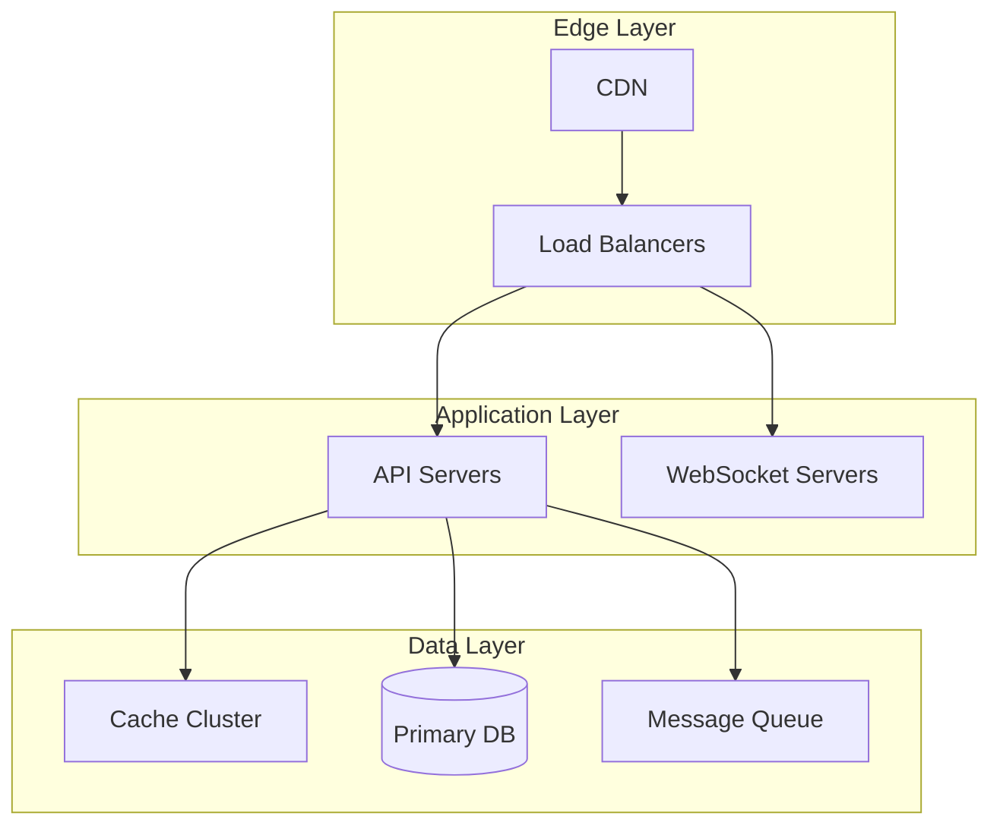

# System Name: Scale and Architecture Deep Dive

!!! abstract "Quick Facts"
 | Metric | Value |
 |--------|-------|
 | **Scale** | X million users |
 | **Throughput** | Y requests/second |
 | **Data Volume** | Z petabytes |
 | **Availability** | 99.XX% |
 | **Team Size** | N engineers |

## Executive Summary

Brief overview of the system, its purpose, and key architectural decisions. Focus on what makes this system unique and what lessons it offers.

## System Overview

### Business Context

 

 <h3 class="card__title">Problem Space</h3>
 
What business problem does this solve?

 

 

 <h3 class="card__title">Constraints</h3>
 
Key limitations and requirements

 

 

 <h3 class="card__title">Success Metrics</h3>
 
How success is measured

 

### High-Level Architecture

## Mapping to Fundamental Laws

### Law Analysis

<table class="responsive-table">
<thead>
 <tr>
 <th>Law</th>
 <th>Challenge</th>
 <th>Solution</th>
 <th>Trade-off</th>
 </tr>
</thead>
<tbody>
 <tr>
 <td data-label="Law">Correlated Failure</td>
 <td data-label="Challenge">Region-wide outages</td>
 <td data-label="Solution">Multi-region active-active</td>
 <td data-label="Trade-off">Higher complexity & cost</td>
 </tr>
 <tr>
 <td data-label="Law">Asynchronous Reality</td>
 <td data-label="Challenge">Network delays</td>
 <td data-label="Solution">Event-driven architecture</td>
 <td data-label="Trade-off">Eventual consistency</td>
 </tr>
</tbody>
</table>

## Design Deep Dive

### Data Architecture

!!! tip "Key Design Decisions"
 1. **Sharding Strategy**: How data is partitioned
 2. **Replication Model**: Master-slave vs multi-master
 3. **Consistency Guarantees**: Strong vs eventual
 4. **Caching Layers**: What's cached and where

### Scaling Strategy

## Failure Scenarios & Lessons

!!! danger "Major Incident: Date"
 **What Happened**: Description of the failure

 **Root Cause**: Technical explanation

 **Impact**: 
 - X hours downtime
 - Y% of users affected
 - $Z in losses

 **Lessons Learned**:
 1. Lesson 1
 2. Lesson 2
 3. Lesson 3

## Performance Characteristics

### Latency Breakdown

 

 <h3 class="card__title">P50 Latency</h3>
 
XXms

 

 

 <h3 class="card__title">P99 Latency</h3>
 
XXXms

 

 

 <h3 class="card__title">P99.9 Latency</h3>
 
XXXXms

 

### Resource Utilization

| Resource | Usage | Efficiency |
|----------|-------|------------|
| CPU | 60-80% | High |
| Memory | 70% | Optimal |
| Network | 40% | Good headroom |
| Storage | Growing 20%/month | Needs optimization |

## Operational Excellence

### Monitoring & Observability

- **Metrics**: What's measured and why
- **Logging**: Centralized logging strategy
- **Tracing**: Distributed tracing implementation
- **Alerting**: SLO-based alerting

### Deployment Strategy

!!! note
 **Deployment Frequency**: X times/day
 **Rollout Strategy**: Canary → 1% → 10% → 50% → 100%
 **Rollback Time**: < Y minutes
 **Feature Flags**: Used for all major changes

## Key Innovations

1. **Innovation 1**: Technical breakthrough and impact
2. **Innovation 2**: Novel approach to common problem
3. **Innovation 3**: Efficiency improvement

## Applicable Patterns

 <a href="../../patterns/circuit-breaker" class="pattern-card">
 <h3 class="pattern-card__title">Circuit Breaker</h3>
 
Prevents cascade failures

 </a>
 <a href="../../patterns/cqrs/" class="pattern-card">
 <h3 class="pattern-card__title">CQRS</h3>
 
Separates reads and writes

 </a>
 <a href="../../patterns/event-sourcing" class="pattern-card">
 <h3 class="pattern-card__title">Event Sourcing</h3>
 
Audit trail and replay

 </a>

## Takeaways for Your System

!!! quote "Key Lessons"
 1. **When to apply**: These patterns work well when...
 2. **When to avoid**: Don't use this approach if...
 3. **Cost considerations**: Expect to invest in...
 4. **Team requirements**: You'll need expertise in...

## Further Reading

- [Original System Paper/Blog]
- [Post-Mortem Analysis]
- [Architecture Evolution Talk]
- [Open Source Components]

## Discussion Questions

1. How would you handle the consistency requirements differently?
2. What are the cost-benefit trade-offs of their multi-region strategy?
3. Could this scale to 10x current load with the same architecture?