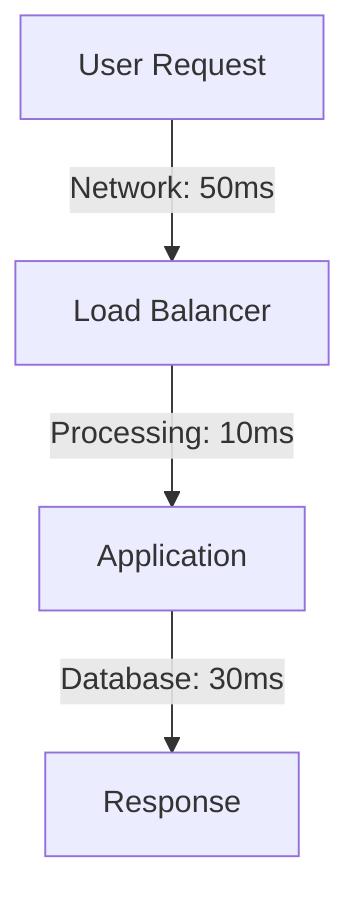

# Law Name: Descriptive Title

!!! info
 <h1 class="hero-title">Law X: Name</h1>
 

 One-sentence summary of the fundamental principle.
 

## Quick Reference

!!! abstract "The Law in Brief"
 **Definition**: Clear, concise statement of the law.

 **Formula**: `Mathematical representation if applicable`

 **Implication**: What this means for system design.

## Physical Foundation

### Derivation from First Principles

Start with fundamental physics constraints:

1. **Speed of Light**: 299,792,458 m/s
2. **Thermodynamics**: Entropy always increases
3. **Information Theory**: Shannon's limit

### Mathematical Proof

!!! note
 Given:
 - Variable X = ...
 - Constraint Y = ...

 Therefore:
 - Result Z = ...

## System Implications

### Impact on Architecture

<table class="responsive-table">
<thead>
 <tr>
 <th>Aspect</th>
 <th>Traditional Approach</th>
 <th>Law-Aware Approach</th>
 </tr>
</thead>
<tbody>
 <tr>
 <td data-label="Aspect">Data Distribution</td>
 <td data-label="Traditional">Centralized</td>
 <td data-label="Law-Aware">Distributed with constraints</td>
 </tr>
 <tr>
 <td data-label="Aspect">Consistency Model</td>
 <td data-label="Traditional">Strong</td>
 <td data-label="Law-Aware">Eventual with bounds</td>
 </tr>
</tbody>
</table>

### Design Patterns That Address This Law

 <a href="../../patterns/pattern-1/" class="pattern-card">
 <h3 class="pattern-card__title">Pattern 1</h3>
 
How it addresses this law

 </a>
 <a href="../../patterns/pattern-2/" class="pattern-card">
 <h3 class="pattern-card__title">Pattern 2</h3>
 
How it addresses this law

 </a>

## Failure Scenarios

!!! danger "When This Law is Violated"
 **Scenario**: Company X ignored this law in 2020...

 **Result**: 
 - 6 hours of downtime
 - $2M in losses
 - Complete system redesign

 **Lesson**: Always account for this fundamental constraint.

## Practical Examples

### Example 1: E-commerce Platform

How this law affects:
- Inventory management
- Order processing
- Payment handling

### Example 2: Social Media Feed

How this law affects:
- Timeline generation
- Content distribution
- Engagement tracking

## Quantitative Analysis

### Latency Impact

### Scaling Limits

 

 
Linear Scaling

 Up to 100 nodes
 

 

 
Sub-linear

 100-1000 nodes
 

 

 
Coordination Overhead

 >1000 nodes
 

## Key Takeaways

!!! quote "Remember"
 1. **Point 1**: Most important implication
 2. **Point 2**: Common misconception to avoid
 3. **Point 3**: Practical rule of thumb

## Related Concepts

- **Law Y**: How they interact
- **Pillar Z**: Which pillar this law supports
- **Pattern A**: Primary pattern for this law

## Further Study

- [Academic Paper 1]
- [Industry Case Study]
- [Interactive Calculator](/tools/law-x-calculator)

## Quick Quiz

Test your understanding:

1. What is the primary constraint this law describes?
2. Which patterns best address this law?
3. What happens when you violate this law?

Answers

1. Answer 1
2. Answer 2
3. Answer 3

