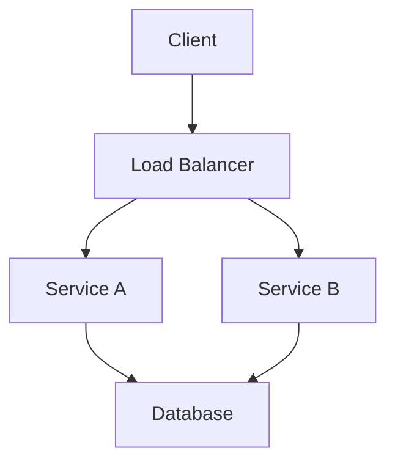

# Pattern Name

!!! card
 Category Name
 

 

 Brief description of what this pattern solves and when to use it.
 

 

 Law 1
 Law 2
 

## Problem Statement

!!! tip "When to Use This Pattern"
 | Scenario | Use This Pattern | Alternative |
 |----------|-----------------|-------------|
 | High throughput needed | ✅ Yes | Consider X instead |
 | Strong consistency required | ❌ No | Use Pattern Y |
 | Distributed teams | ✅ Yes | - |

## Solution Architecture

## Implementation Considerations

### Trade-offs

<table class="responsive-table">
<thead>
 <tr>
 <th>Aspect</th>
 <th>Benefit</th>
 <th>Cost</th>
 </tr>
</thead>
<tbody>
 <tr>
 <td data-label="Aspect">Performance</td>
 <td data-label="Benefit">High throughput</td>
 <td data-label="Cost">Higher latency</td>
 </tr>
 <tr>
 <td data-label="Aspect">Complexity</td>
 <td data-label="Benefit">Simple to understand</td>
 <td data-label="Cost">Harder to debug</td>
 </tr>
</tbody>
</table>

### Key Metrics

 

 
Latency

 P99: < 100ms
 

 

 
Throughput

 10K req/sec
 

 

 
Availability

 99.9%
 

## Real-World Examples

!!! abstract "Production Implementation"
 - **Company A**: Used for their messaging system
 - **Company B**: Core part of their data pipeline
 - **Company C**: Handles 1B requests/day

## Common Pitfalls

!!! danger "What Can Go Wrong"
 1. **Pitfall 1**: Description and mitigation
 2. **Pitfall 2**: Description and mitigation
 3. **Pitfall 3**: Description and mitigation

## Related Patterns

- [Pattern X](../pattern-x/) - Complements this pattern
- [Pattern Y](../pattern-y/) - Alternative approach
- [Pattern Z](../pattern-z/) - Often used together

## Further Reading

- [Link to paper or article]
- [Link to implementation guide]
- [Link to case study]