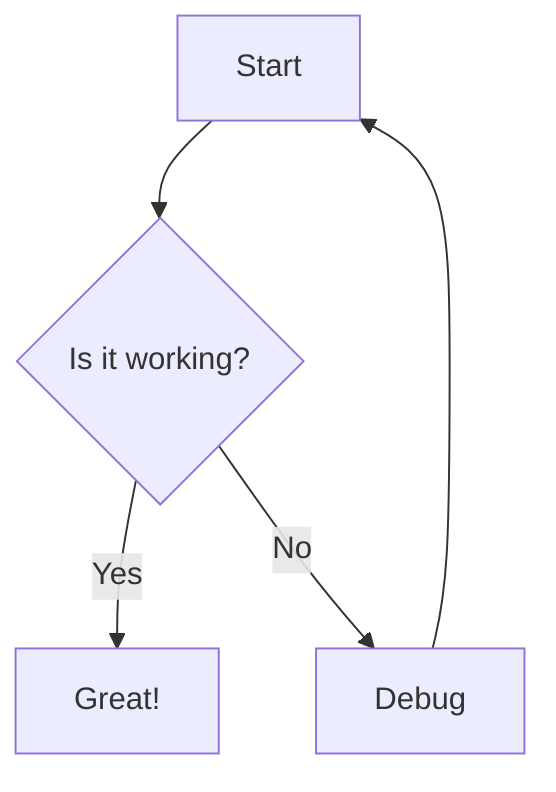
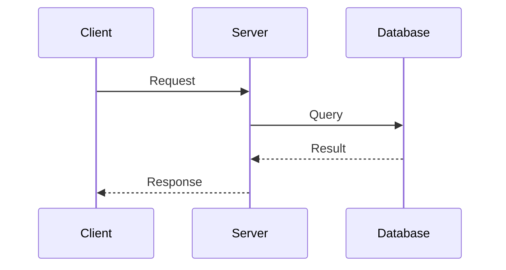
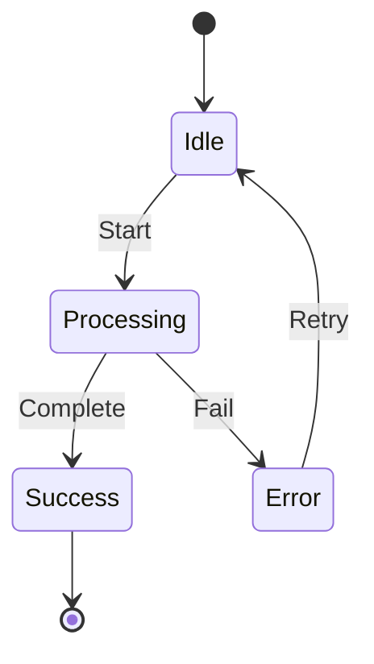
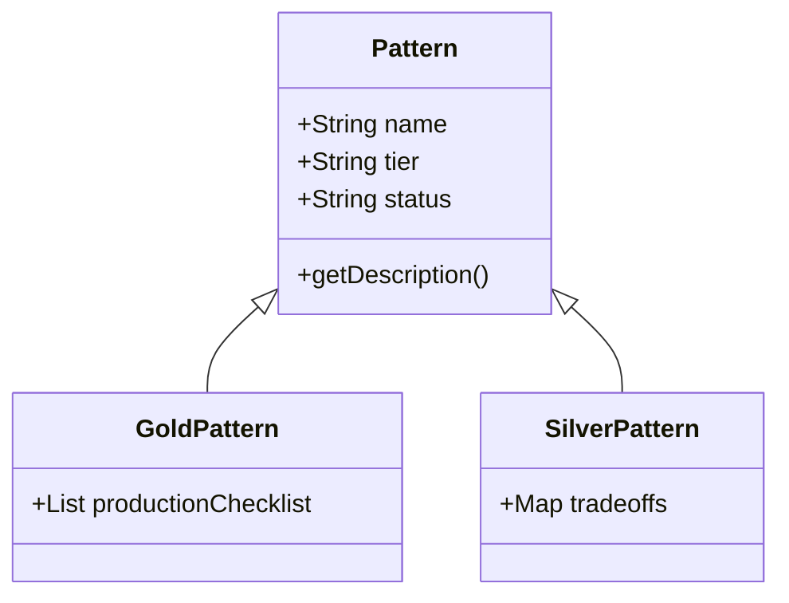

# Test Mermaid Diagrams

## Simple Flowchart

```mermaid
graph TD
    A[Start] --> B{Is it working?}
    B -->|Yes| C[Great!]
    B -->|No| D[Debug]
    D --> A
```

## Sequence Diagram

```mermaid
sequenceDiagram
    participant Client
    participant Server
    participant Database
    
    Client->>Server: Request
    Server->>Database: Query
    Database-->>Server: Result
    Server-->>Client: Response
```

## State Diagram

```mermaid
stateDiagram-v2
    [*] --> Idle
    Idle --> Processing: Start
    Processing --> Success: Complete
    Processing --> Error: Fail
    Success --> [*]
    Error --> Idle: Retry
```

## Class Diagram

```mermaid
classDiagram
    class Pattern {
        +String name
        +String tier
        +String status
        +getDescription()
    }
    class GoldPattern {
        +List productionChecklist
    }
    class SilverPattern {
        +Map tradeoffs
    }
    Pattern <|-- GoldPattern
    Pattern <|-- SilverPattern
```