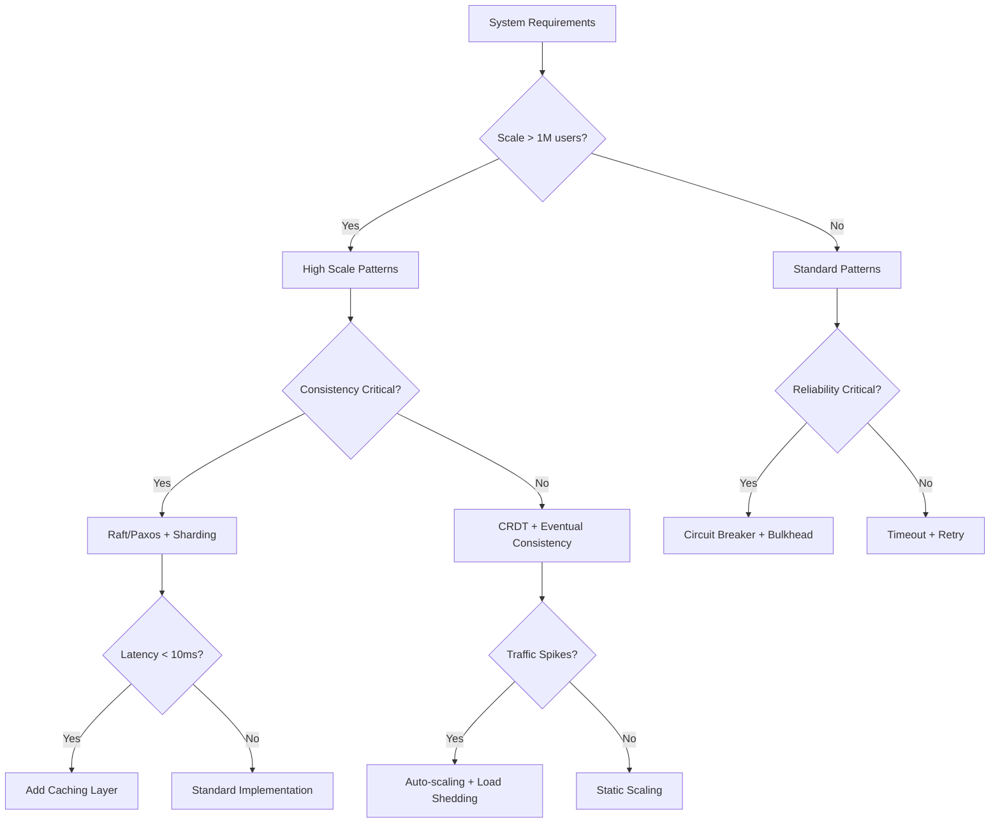

# Pattern Decision Calculator

## Overview
Interactive decision tool for selecting the right distributed systems patterns based on your specific requirements and constraints.

## Quick Decision Wizard

### Step 1: System Requirements

```yaml
# Copy and modify these values for your system
system_requirements:
  scale:
    users: 1000000           # Expected concurrent users
    requests_per_second: 100000
    data_volume_gb: 10000
    growth_rate_yearly: 2.5  # Multiplier
  
  performance:
    latency_p99_ms: 100     # 99th percentile target
    latency_p50_ms: 20      # Median latency target
    availability_nines: 4    # 99.99%
    throughput_mbps: 1000
  
  constraints:
    budget_monthly_usd: 50000
    team_size: 10
    time_to_market_days: 90
    compliance: ["GDPR", "SOC2"]
```

## Pattern Selection Calculator

### Resilience Pattern Selector

| Your Requirement | Score | Recommended Pattern | Implementation Complexity |
|------------------|-------|---------------------|--------------------------|
| **Failure Rate > 1%** | | Circuit Breaker | Medium |
| **Cascading Failures Possible** | | Bulkhead | Medium |
| **External Dependencies > 3** | | Timeout + Retry | Low |
| **Traffic Spikes > 10x** | | Load Shedding | High |
| **Zero Downtime Deploys** | | Blue-Green/Canary | High |

**Calculate Your Resilience Score:**
```python
def calculate_resilience_score(system):
    score = 0
    patterns = []
    
    # Failure rate check
    if system['failure_rate'] > 0.01:
        score += 30
        patterns.append('Circuit Breaker')
    
    # Dependency check
    if system['external_deps'] > 3:
        score += 20
        patterns.append('Timeout + Retry')
    
    # Traffic variability
    if system['traffic_spike_ratio'] > 10:
        score += 25
        patterns.append('Load Shedding')
    
    # Criticality
    if system['availability_nines'] >= 4:
        score += 25
        patterns.append('Bulkhead')
    
    return score, patterns

# Example usage:
# score, recommended = calculate_resilience_score(your_system)
```

### Consistency Pattern Selector

| CAP Trade-off | Your Priority | Recommended Pattern | Use Case |
|---------------|---------------|---------------------|----------|
| **Consistency > Availability** | ⬜ | Raft/Paxos Consensus | Financial transactions |
| **Availability > Consistency** | ⬜ | Eventual Consistency + CRDTs | Social media |
| **Partition Tolerance Required** | ⬜ | Multi-Master + Vector Clocks | Global systems |
| **Read Heavy (>90%)** | ⬜ | Read Replicas + Cache | Content delivery |
| **Write Heavy (>50%)** | ⬜ | Sharding + Consistent Hash | Analytics ingestion |

### Scalability Pattern Calculator

```python
def calculate_scalability_patterns(metrics):
    """
    Calculate required scalability patterns based on system metrics
    """
    patterns = {}
    
    # Calculate required nodes
    qps = metrics['requests_per_second']
    node_capacity = 1000  # QPS per node
    required_nodes = qps / node_capacity
    
    if required_nodes > 100:
        patterns['sharding'] = {
            'recommended': True,
            'shard_count': int(required_nodes / 10),
            'strategy': 'consistent_hashing'
        }
    
    # Cache requirements
    read_ratio = metrics.get('read_ratio', 0.8)
    if read_ratio > 0.7:
        cache_hit_rate = 0.9  # Target
        patterns['caching'] = {
            'recommended': True,
            'type': 'multi_tier',
            'l1_size_gb': qps * 0.001,  # 1KB per QPS
            'l2_size_gb': qps * 0.01    # 10KB per QPS
        }
    
    # Load balancing
    if required_nodes > 3:
        patterns['load_balancing'] = {
            'recommended': True,
            'algorithm': 'least_connections' if qps > 10000 else 'round_robin',
            'health_check_interval_ms': 1000
        }
    
    return patterns

# Example output:
# patterns = calculate_scalability_patterns({'requests_per_second': 100000})
```

## Cost-Benefit Analysis Calculator

### Pattern Implementation ROI

| Pattern | Implementation Cost | Monthly Savings | ROI Period | Risk Reduction |
|---------|-------------------|-----------------|------------|----------------|
| **Caching** | $10K (2 weeks) | $5K (70% compute) | 2 months | Low latency variance |
| **Auto-scaling** | $15K (3 weeks) | $8K (40% overprovisioning) | 2 months | Handle spikes |
| **Circuit Breaker** | $5K (1 week) | $2K (incident reduction) | 3 months | Cascade prevention |
| **CDN** | $20K (4 weeks) | $15K (bandwidth) | 2 months | Global performance |
| **Sharding** | $50K (8 weeks) | $20K (database costs) | 3 months | Linear scaling |

### TCO Comparison Tool

```python
def calculate_pattern_tco(pattern, scale, duration_months=36):
    """
    Calculate Total Cost of Ownership for pattern implementation
    """
    costs = {
        'implementation': 0,
        'operational': 0,
        'maintenance': 0,
        'scaling': 0
    }
    
    if pattern == 'microservices':
        costs['implementation'] = 50000 + (scale['services'] * 5000)
        costs['operational'] = scale['services'] * 500 * duration_months
        costs['maintenance'] = scale['team_size'] * 2000 * duration_months
        costs['scaling'] = scale['growth_rate'] * 10000 * duration_months
    
    elif pattern == 'monolith':
        costs['implementation'] = 20000
        costs['operational'] = 2000 * duration_months
        costs['maintenance'] = scale['team_size'] * 1000 * duration_months
        costs['scaling'] = scale['growth_rate'] * 50000 * (duration_months/12)
    
    return sum(costs.values()), costs

# Compare architectures
microservices_tco, _ = calculate_pattern_tco('microservices', 
    {'services': 20, 'team_size': 10, 'growth_rate': 2})
monolith_tco, _ = calculate_pattern_tco('monolith',
    {'services': 1, 'team_size': 10, 'growth_rate': 2})
```

## Complexity Score Calculator

### Pattern Complexity Matrix

```python
def calculate_complexity_score(patterns):
    """
    Calculate overall system complexity based on pattern selection
    """
    complexity_scores = {
        'timeout': 2,
        'retry': 3,
        'circuit_breaker': 5,
        'bulkhead': 6,
        'consistent_hashing': 7,
        'raft_consensus': 9,
        'event_sourcing': 8,
        'cqrs': 7,
        'saga': 8,
        'distributed_tracing': 6
    }
    
    interactions = {
        ('circuit_breaker', 'retry'): 1,
        ('event_sourcing', 'cqrs'): 2,
        ('saga', 'event_sourcing'): 3,
        ('raft_consensus', 'distributed_lock'): 2
    }
    
    base_complexity = sum(complexity_scores.get(p, 0) for p in patterns)
    
    # Add interaction complexity
    interaction_complexity = 0
    for p1 in patterns:
        for p2 in patterns:
            if p1 != p2:
                key = tuple(sorted([p1, p2]))
                interaction_complexity += interactions.get(key, 0)
    
    total_complexity = base_complexity + interaction_complexity
    
    # Cognitive load check (Miller's Law: 7±2)
    if len(patterns) > 9:
        total_complexity *= 1.5  # Penalty for cognitive overload
    
    return {
        'score': total_complexity,
        'level': 'Low' if total_complexity < 20 else 
                 'Medium' if total_complexity < 40 else 
                 'High' if total_complexity < 60 else 'Expert',
        'team_size_recommended': max(2, total_complexity // 10),
        'implementation_weeks': max(2, total_complexity // 5)
    }
```

## Interactive Decision Tree

### Quick Pattern Selection Flow



## Performance Impact Calculator

### Latency Budget Analyzer

```python
def analyze_latency_budget(target_p99_ms, architecture):
    """
    Break down latency budget across architectural components
    """
    budget = {
        'network_rtt': 0,
        'load_balancer': 0,
        'service_mesh': 0,
        'application': 0,
        'database': 0,
        'serialization': 0
    }
    
    remaining = target_p99_ms
    
    # Network (usually fixed)
    budget['network_rtt'] = min(5, remaining * 0.1)
    remaining -= budget['network_rtt']
    
    # Load balancer
    if 'load_balancer' in architecture:
        budget['load_balancer'] = min(2, remaining * 0.05)
        remaining -= budget['load_balancer']
    
    # Service mesh
    if 'service_mesh' in architecture:
        budget['service_mesh'] = min(5, remaining * 0.1)
        remaining -= budget['service_mesh']
    
    # Database (usually largest)
    budget['database'] = remaining * 0.5
    remaining -= budget['database']
    
    # Application logic
    budget['application'] = remaining * 0.7
    remaining -= budget['application']
    
    # Serialization
    budget['serialization'] = remaining
    
    return budget

# Example usage:
# budget = analyze_latency_budget(100, ['load_balancer', 'service_mesh'])
```

## Pattern Combination Validator

### Compatible Pattern Sets

```python
def validate_pattern_combination(patterns):
    """
    Validate if pattern combination is recommended
    """
    incompatible = [
        ('strong_consistency', 'eventual_consistency'),
        ('synchronous_replication', 'async_replication'),
        ('stateless', 'session_affinity'),
        ('cell_architecture', 'global_state')
    ]
    
    synergistic = [
        ('circuit_breaker', 'retry', 'timeout'),
        ('event_sourcing', 'cqrs', 'saga'),
        ('sharding', 'consistent_hashing', 'rebalancing'),
        ('cache_aside', 'read_through', 'write_behind')
    ]
    
    warnings = []
    recommendations = []
    
    # Check incompatibilities
    for p1, p2 in incompatible:
        if p1 in patterns and p2 in patterns:
            warnings.append(f"⚠️ {p1} and {p2} are incompatible")
    
    # Check synergies
    for combo in synergistic:
        if all(p in patterns for p in combo):
            recommendations.append(f"✅ Great combination: {', '.join(combo)}")
        elif any(p in patterns for p in combo):
            missing = [p for p in combo if p not in patterns]
            recommendations.append(f"💡 Consider adding: {', '.join(missing)}")
    
    return {
        'valid': len(warnings) == 0,
        'warnings': warnings,
        'recommendations': recommendations
    }
```

## Migration Path Calculator

### Incremental Pattern Adoption

| Current State | Target Pattern | Migration Steps | Duration | Risk |
|--------------|----------------|-----------------|----------|------|
| **Monolith** | Microservices | 1. Extract APIs<br/>2. Add service mesh<br/>3. Decompose by domain<br/>4. Add orchestration | 6-12 months | High |
| **Synchronous** | Event-Driven | 1. Add message bus<br/>2. Implement events<br/>3. Decouple services<br/>4. Remove sync calls | 3-6 months | Medium |
| **Single Region** | Multi-Region | 1. Add replication<br/>2. Implement consistency<br/>3. Add geo-routing<br/>4. Test failover | 4-8 months | High |
| **No Caching** | Multi-Tier Cache | 1. Add L1 cache<br/>2. Implement invalidation<br/>3. Add L2 cache<br/>4. Optimize hit rates | 1-2 months | Low |

## Quick Reference: Pattern Selection Rules

### By System Characteristics

```yaml
pattern_rules:
  high_traffic:
    required: [load_balancing, caching, cdn]
    recommended: [auto_scaling, load_shedding]
    
  financial_system:
    required: [strong_consistency, audit_log, encryption]
    recommended: [saga, distributed_lock, two_phase_commit]
    
  iot_platform:
    required: [time_series_db, stream_processing, edge_computing]
    recommended: [mqtt, device_registry, ota_updates]
    
  social_media:
    required: [eventual_consistency, caching, cdn]
    recommended: [crdt, gossip_protocol, fanout]
    
  e_commerce:
    required: [saga, payment_gateway, inventory_management]
    recommended: [recommendation_engine, search, cart_recovery]
```

## Cost Optimization Strategies

### Pattern-Based Savings

| Strategy | Pattern | Potential Savings | Implementation Effort |
|----------|---------|-------------------|----------------------|
| **Reduce Compute** | Auto-scaling + Spot Instances | 40-70% | Medium |
| **Reduce Storage** | Tiered Storage + Compression | 30-60% | Low |
| **Reduce Bandwidth** | CDN + Compression | 50-80% | Low |
| **Reduce Database Costs** | Read Replicas + Caching | 40-60% | Medium |
| **Reduce Operational** | Automation + Self-healing | 20-40% | High |

## Interactive Worksheets

### Pattern Selection Worksheet

```markdown
## Your System Profile

**Scale Requirements:**
- [ ] < 1K users
- [ ] 1K - 100K users  
- [ ] 100K - 10M users
- [ ] > 10M users

**Consistency Requirements:**
- [ ] Strong consistency required
- [ ] Eventual consistency acceptable
- [ ] Mixed (specify domains): ___________

**Availability Target:**
- [ ] 99% (8.76 hours/year downtime)
- [ ] 99.9% (8.76 hours/year)
- [ ] 99.99% (52.56 minutes/year)
- [ ] 99.999% (5.26 minutes/year)

**Team Capabilities:**
- [ ] Beginner (< 1 year distributed systems)
- [ ] Intermediate (1-3 years)
- [ ] Advanced (3-5 years)
- [ ] Expert (> 5 years)

**Recommended Pattern Stack:**
_Based on your selections above_
1. Foundation: _____________
2. Resilience: _____________
3. Scalability: ____________
4. Consistency: ____________
5. Observability: __________
```

## References

- [Pattern Library](../pattern-library/)
- [Cross-Reference Matrix](../reference/cross-reference-matrix.md)
- [Problem-Pattern Guide](../pattern-library/problem-pattern-guide.md)
- [Cost Optimization Patterns](../pattern-library/cost-optimization/)

---

*This calculator is continuously updated with new patterns and algorithms. Last updated: 2024*