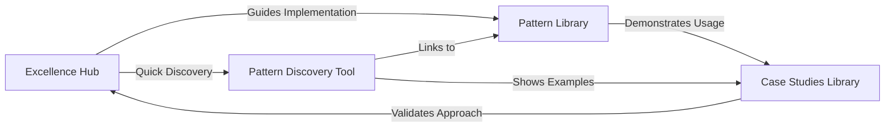

# Excellence Framework Reorganization Plan

## Vision
Transform the site structure to make the Excellence Framework the primary organizing principle, with patterns and case studies integrated as implementation resources within a cohesive learning journey.

## Current State
- **Patterns**: 101 patterns in `/patterns/` (38 Gold, 38 Silver, 25 Bronze)
- **Excellence**: Framework in `/excellence/` with guides, comparisons, migrations
- **Case Studies**: 91 case studies in `/case-studies/` (mostly disconnected from patterns)
- **Elite Engineering**: 5 case studies already under excellence framework

## Proposed Excellence-First Structure

### 1. Excellence Hub (`/excellence/`)
```
excellence/
├── index.md                          # Excellence framework overview
├── framework-overview.md             # Detailed framework explanation
├── quick-start/                      # Getting started with excellence
│   ├── index.md                     # Quick start guide
│   ├── for-architects.md            # Architecture excellence path
│   ├── for-teams.md                 # Team excellence path
│   └── for-organizations.md         # Organizational excellence path
│
├── pattern-discovery/                # Pattern exploration by excellence
│   ├── index.md                     # Interactive pattern discovery tool
│   ├── gold-patterns/               # Battle-tested patterns
│   │   ├── index.md                # Gold tier overview
│   │   ├── by-domain/              # Organized by problem domain
│   │   ├── by-architecture/        # Organized by architecture style
│   │   └── implementation-guides/   # Deep implementation guides
│   ├── silver-patterns/             # Specialized patterns
│   │   ├── index.md                # Silver tier overview
│   │   ├── by-use-case/           # Organized by use case
│   │   └── trade-off-analysis/    # When to use vs not use
│   └── bronze-patterns/             # Legacy/transitional patterns
│       ├── index.md                # Bronze tier overview
│       └── migration-paths/        # How to move to modern patterns
│
├── implementation-guides/            # How to implement excellence
│   ├── index.md                    # Implementation overview
│   ├── data-consistency.md         # Data consistency excellence
│   ├── resilience-first.md         # Resilience excellence
│   ├── performance-optimization.md # Performance excellence
│   ├── security-patterns.md        # Security excellence
│   ├── operational-excellence.md   # Operational excellence
│   ├── service-communication.md    # Communication excellence
│   └── platform-engineering.md     # Platform excellence
│
├── real-world-excellence/           # Case studies mapped to patterns
│   ├── index.md                    # Real-world overview
│   ├── elite-engineering/          # Top-tier implementations
│   │   ├── index.md               # Elite engineering overview
│   │   ├── netflix-resilience/    # Netflix: Circuit breaker, chaos engineering
│   │   ├── amazon-scale/          # Amazon: DynamoDB, consistent hashing
│   │   ├── google-consistency/    # Google: Spanner, consensus
│   │   ├── uber-geo/              # Uber: Geohashing, H3, location services
│   │   ├── discord-realtime/      # Discord: WebSocket, event-driven
│   │   ├── figma-collaboration/   # Figma: CRDT, real-time sync
│   │   └── stripe-reliability/    # Stripe: API design, idempotency
│   ├── system-implementations/     # Full system case studies
│   │   ├── by-domain/            # Organized by business domain
│   │   ├── by-scale/             # Small/medium/large scale
│   │   └── by-pattern-usage/     # Which patterns they implement
│   └── failure-studies/           # Learning from failures
│       ├── index.md              # Failure analysis overview
│       └── by-antipattern/       # What went wrong and why
│
├── pattern-comparisons/            # Side-by-side comparisons
│   ├── index.md                   # Comparison overview
│   ├── caching-patterns.md        # Cache-aside vs Read-through vs Write-through
│   ├── consistency-patterns.md    # 2PC vs Saga vs Event sourcing
│   ├── messaging-patterns.md      # Pub-sub vs Queues vs Streaming
│   ├── resilience-patterns.md     # Circuit breaker vs Bulkhead vs Retry
│   └── deployment-patterns.md     # Blue-green vs Canary vs Feature flags
│
├── migration-playbooks/           # How to evolve systems
│   ├── index.md                  # Migration overview
│   ├── monolith-to-microservices.md
│   ├── batch-to-streaming.md
│   ├── 2pc-to-saga.md
│   ├── shared-db-to-services.md
│   └── legacy-to-modern/         # Pattern-specific migrations
│
├── excellence-journeys/          # Learning paths through excellence
│   ├── index.md                 # Journey overview
│   ├── startup-to-scale.md     # Growing from MVP to scale
│   ├── legacy-modernization.md  # Modernizing existing systems
│   ├── reliability-transformation.md # Improving system reliability
│   └── performance-excellence.md # Achieving peak performance
│
└── pattern-health-dashboard/     # Pattern adoption metrics
    ├── index.md                 # Dashboard overview
    └── metrics/                 # Real-time pattern health
```

### 2. Pattern Library (`/patterns/`)
Keep as reference library but with enhanced metadata:
```
patterns/
├── index.md                     # Pattern library overview (links to excellence)
├── [pattern-name].md           # Individual pattern pages with:
│                               # - excellence_tier
│                               # - implementation_guide link
│                               # - case_study links
│                               # - comparison links
│                               # - migration_from/to
└── pattern-catalog.md          # Full searchable catalog
```

### 3. Case Studies Library (`/case-studies/`)
Maintain as comprehensive reference library with excellence mapping:
```
case-studies/
├── index.md                         # Case studies library overview
├── by-domain/                       # Domain-based organization
│   ├── e-commerce/                 # E-commerce systems
│   ├── social-media/               # Social platforms
│   ├── streaming/                  # Media streaming
│   ├── messaging/                  # Communication systems
│   ├── location-services/          # Maps and location
│   ├── infrastructure/             # Core infrastructure
│   └── payments/                   # Payment systems
├── by-scale/                        # Scale-based organization
│   ├── startup/                    # <1M users
│   ├── growth/                     # 1M-10M users
│   ├── scale/                      # 10M-100M users
│   └── hyperscale/                 # >100M users
├── by-pattern/                      # Pattern usage index
│   ├── gold-pattern-usage.md       # Which cases use gold patterns
│   ├── silver-pattern-usage.md     # Which cases use silver patterns
│   └── pattern-combinations.md     # Common pattern combinations
├── elite-engineering/               # Exceptional implementations
├── google-systems/                  # Google system deep dives
└── [case-study-name].md            # Individual case studies with:
                                    # Enhanced frontmatter:
```
```yaml
# In each case study frontmatter:
title: Netflix Video Streaming Architecture
excellence_patterns:
  gold:
    - circuit-breaker        # Hystrix implementation
    - load-balancing        # Multi-region load distribution
    - auto-scaling          # Predictive scaling
    - caching-strategies    # Multi-tier caching
  silver:
    - edge-computing        # Open Connect CDN
    - multi-region          # Active-active regions
excellence_guides:
  - resilience-first
  - performance-optimization
  - operational-excellence
scale: hyperscale
users: 230M+
domain: media-streaming
key_challenges:
  - Global content delivery
  - Peak traffic handling
  - Personalization at scale
implementation_highlights:
  - Chaos engineering practices
  - Circuit breaker patterns
  - Multi-CDN strategy
```

## Implementation Phases

### Phase 1: Excellence Hub Creation (Week 1)
1. Create excellence hub structure
2. Move existing excellence content
3. Create pattern discovery interface
4. Implement journey guides

### Phase 2: Pattern Integration (Week 2)
1. Add excellence metadata to all patterns
2. Create pattern groupings by tier/domain
3. Build comparison matrices
4. Link patterns to guides

### Phase 3: Case Study Mapping (Week 3)
1. Analyze all 91 case studies
2. Map to excellence patterns
3. Create real-world excellence section
4. Build failure analysis library

### Phase 4: Navigation & Discovery (Week 4)
1. Update site navigation
2. Create interactive tools
3. Build search/filter capabilities
4. Test user journeys

## Integration Strategy

### Excellence Hub ↔ Pattern Library ↔ Case Studies Library


### Cross-Referencing System
1. **From Excellence**: Links to relevant patterns and case studies
2. **From Patterns**: Links to excellence guides and real implementations
3. **From Case Studies**: Links to patterns used and excellence principles

### Navigation Paths
1. **Learning Path**: Excellence → Patterns → Case Studies
2. **Problem-Solving Path**: Case Studies → Patterns → Excellence
3. **Implementation Path**: Patterns → Excellence Guides → Case Studies

## Key Benefits

### For Users
- **Clear Learning Path**: Start with excellence principles → discover patterns → see real implementations
- **Context-Driven**: Understand WHY before HOW
- **Practical Focus**: Every pattern linked to real-world usage
- **Evolution Path**: Clear migration from legacy to modern
- **Multiple Entry Points**: Start from theory, patterns, or real examples

### For Content
- **Better Organization**: Excellence as organizing principle
- **Reduced Duplication**: Single source of truth
- **Enhanced Discovery**: Multiple ways to find content
- **Living Documentation**: Pattern health dashboard
- **Comprehensive Coverage**: Theory + Patterns + Implementation

## Success Metrics
- All 101 patterns mapped to excellence tiers ✓
- All 91 case studies linked to patterns
- 10+ comparison matrices created
- 5+ journey guides implemented
- Interactive discovery tools deployed

## Case Study Mapping Example

### By Excellence Patterns (Sample)
```yaml
# Infrastructure Systems (19 case studies)
amazon-dynamo:
  gold: [consistent-hashing, eventual-consistency, distributed-storage]
  silver: [merkle-trees, read-repair, vector-clocks]
  
google-spanner:
  gold: [consensus, distributed-lock, sharding]
  silver: [clock-sync, multi-region]

netflix-streaming:
  gold: [circuit-breaker, auto-scaling, caching-strategies]
  silver: [edge-computing, graceful-degradation]

# Location Services (12 case studies)  
uber-location:
  gold: [geohashing, sharding, event-driven]
  silver: [spatial-indexing, real-time-processing]

# E-commerce (6 case studies)
payment-system:
  gold: [saga, idempotency, distributed-lock]
  silver: [event-sourcing, audit-logging]
```

### By Scale Categories
- **Hyperscale (>100M users)**: Netflix, YouTube, Google Maps, Facebook
- **Large Scale (10-100M)**: Uber, Discord, Spotify, PayPal
- **Growth Scale (1-10M)**: Figma, Strava, Life360
- **Startup Scale (<1M)**: Hotel booking, URL shortener

## Next Steps
1. Review and approve structure
2. Create detailed implementation plan
3. Begin Phase 1 implementation
4. Set up tracking dashboard
5. Start pattern-to-case-study mapping