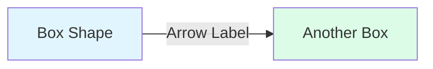

# Quality Assurance Checklist for Content Updates

## 🎯 Purpose
Ensure every content update maintains the high quality standards of The Compendium of Distributed Systems.

## ✅ Pre-Writing Checklist

### Content Planning
- [ ] Is this filling a "Coming Soon" placeholder?
- [ ] Have you reviewed the CLAUDE.md content guidelines?
- [ ] Do you have real-world examples ready?
- [ ] Have you identified which Laws/Pillars this relates to?

### Research Verification
- [ ] Are all performance numbers from credible sources?
- [ ] Do you have references for all claims?
- [ ] Have you verified with recent documentation (< 2 years old)?
- [ ] Are the examples from production systems?

## 📝 Writing Checklist

### Structure Compliance
- [ ] Does it follow the appropriate template (Pattern/Case Study/Tool)?
- [ ] Is there a visual component box at the top (axiom-box, decision-box, etc.)?
- [ ] Are there Mermaid diagrams for complex concepts?
- [ ] Do all sections have clear headers?

### Content Density
- [ ] No unnecessary verbose explanations?
- [ ] Tables used instead of lengthy comparisons?
- [ ] Bullet points for lists?
- [ ] Code examples concise and relevant?

### Technical Accuracy
- [ ] All code examples tested?
- [ ] Mermaid diagrams syntactically correct?
- [ ] Mathematical formulas verified?
- [ ] Performance numbers realistic?

### Cross-References
- [ ] Links to relevant Laws (Part 1)?
- [ ] Links to relevant Pillars (Part 2)?
- [ ] Related patterns referenced?
- [ ] External resources cited?

## 🔍 Post-Writing Review

### Self-Review (Author)
- [ ] Read the entire page out loud
- [ ] Check all internal links work
- [ ] Verify Mermaid diagrams render
- [ ] Confirm code syntax highlighting
- [ ] Test on mobile viewport

### Peer Review Checklist
- [ ] Does it teach the concept clearly?
- [ ] Are trade-offs explicitly stated?
- [ ] Would a junior engineer understand it?
- [ ] Would a senior engineer find it valuable?

### Technical Review
- [ ] Are the architectural patterns sound?
- [ ] Do the examples represent best practices?
- [ ] Are the performance claims realistic?
- [ ] Is the failure analysis comprehensive?

### Content Lead Review
- [ ] Consistent with site voice and tone?
- [ ] Follows visual design system?
- [ ] Appropriate complexity level?
- [ ] Adds unique value to the site?

## 🎨 Visual & Formatting Standards

### Component Usage
| Component | When to Use | Example |
|-----------|------------|---------|
| `.axiom-box` | Fundamental principles | Law connections |
| `.decision-box` | Choice frameworks | When to use X vs Y |
| `.failure-vignette` | Failure stories | Production disasters |
| `.truth-box` | Key insights | Aha moments |

### Diagram Standards

- Use consistent colors from palette
- Label all arrows
- Keep diagrams simple (max 10 nodes)

### Table Format
| Column 1 | Column 2 | Column 3 |
|----------|----------|----------|
| Always include headers | Use consistent alignment | Keep concise |
| ✅ Do | ❌ Don't | 💡 Why |

## 🔗 Link Validation

### Internal Links
- [ ] Use absolute paths from docs root: `/patterns/circuit-breaker`
- [ ] Remove .md extension in links
- [ ] Verify target exists
- [ ] Check anchor links work

### External Links
- [ ] Use HTTPS where possible
- [ ] Add title attribute for accessibility
- [ ] Verify link is not dead
- [ ] Consider archive.org backup for important refs

## 📊 Performance Checklist

### Page Load
- [ ] Page size < 100KB (excluding images)
- [ ] No more than 5 Mermaid diagrams per page
- [ ] Code blocks < 50 lines each
- [ ] Tables < 20 rows

### SEO & Metadata
- [ ] Page has unique title
- [ ] Description meta tag present
- [ ] Headers follow H1 → H2 → H3 hierarchy
- [ ] Alt text for any images

## 🚀 Deployment Checklist

### Pre-Commit
- [ ] Run link validator script
- [ ] Check for "TODO" or "FIXME" comments
- [ ] Verify no sensitive information
- [ ] Ensure consistent line endings

### Git Commit
- [ ] Clear, descriptive commit message
- [ ] Reference issue number if applicable
- [ ] One logical change per commit
- [ ] No generated files committed

### Post-Deploy
- [ ] Check live site renders correctly
- [ ] Test all new links
- [ ] Verify search indexes new content
- [ ] Monitor for 404 errors

## 🔄 Maintenance Tasks

### Weekly
- [ ] Review and fix any reported broken links
- [ ] Check for outdated version numbers
- [ ] Update "Coming Soon" count
- [ ] Review user feedback

### Monthly
- [ ] Audit external links
- [ ] Update performance benchmarks
- [ ] Review and refresh examples
- [ ] Check for deprecated patterns

### Quarterly
- [ ] Comprehensive link validation
- [ ] Content freshness review
- [ ] Navigation structure assessment
- [ ] User journey validation

## 🚨 Common Mistakes to Avoid

1. **Don't create new axiom references** - Use law1-law7
2. **Don't use relative paths** - Always absolute from /docs
3. **Don't forget mobile testing** - 40% of users on mobile
4. **Don't skip code testing** - All examples must work
5. **Don't ignore accessibility** - Use semantic HTML
6. **Don't add verbose content** - Density over length
7. **Don't break existing links** - Redirects if moving

## 📋 Sign-Off

### Author Certification
- [ ] I have followed all checklist items
- [ ] The content is accurate to my knowledge
- [ ] I have tested all code and links
- [ ] I take responsibility for this content

**Author**: ___________________ **Date**: ___________

### Reviewer Certification  
- [ ] I have reviewed against the checklist
- [ ] The content meets quality standards
- [ ] Technical accuracy verified
- [ ] Approved for publication

**Reviewer**: ___________________ **Date**: ___________

---

*This checklist is a living document. Suggest improvements via PR.*