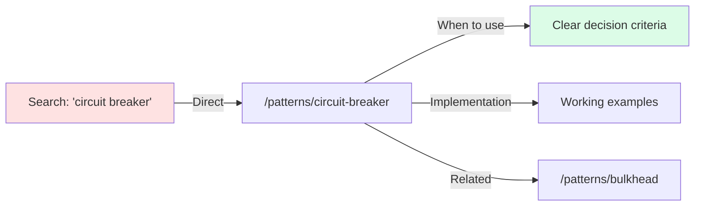
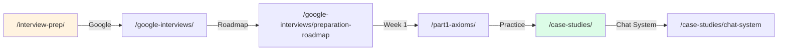

# Critical User Journeys - Validation Report

## 🎯 Primary User Personas

### 1. New Graduate / Junior Engineer ("Alex")
- **Goal**: Learn distributed systems fundamentals
- **Time**: 8-12 weeks available
- **Success**: Can explain concepts in interviews

### 2. Senior Engineer ("Sam")  
- **Goal**: Level up to architect role
- **Time**: 2-4 weeks focused study
- **Success**: Can design systems from scratch

### 3. Engineering Manager ("Morgan")
- **Goal**: Make informed technical decisions
- **Time**: 1-2 hours per week
- **Success**: Can evaluate trade-offs

### 4. Interview Candidate ("Jordan")
- **Goal**: Pass FAANG system design interviews
- **Time**: 4-6 weeks preparation
- **Success**: Confident in interview scenarios

## 🛤️ Journey Maps & Validation

### Journey 1: Complete Beginner Path
**User**: Alex (New Graduate)

```mermaid
graph LR
    Home["/"] -->|"Get Started"| Intro["/introduction/"]
    Intro -->|"Philosophy"| Phil["/introduction/philosophy"]
    Phil -->|"Learning Path"| Learn["/learning-paths/"]
    Learn -->|"Beginner Path"| Law1["/part1-axioms/law1-failure/"]
    Law1 -->|"Examples"| Ex1["/part1-axioms/law1-failure/examples"]
    Ex1 -->|"Next Law"| Law2["/part1-axioms/law2-asynchrony/"]
    
    style Home fill:#e1f5fe
    style Learn fill:#dcfce7
```



**Validation Results**:
- ✅ All navigation links work
- ✅ Clear progression path
- ✅ Examples reinforce concepts
- ⚠️ Some "Coming Soon" content breaks flow

### Journey 2: Quick Pattern Lookup
**User**: Sam (Senior Engineer)



**Validation Results**:
- ✅ Direct access to patterns
- ✅ Clear implementation guidance
- ✅ Good cross-references
- ✅ Trade-offs well documented

### Journey 3: Interview Preparation
**User**: Jordan (Interview Candidate)



**Validation Results**:
- ✅ Clear preparation timeline
- ✅ Mix of theory and practice
- ⚠️ Missing mock interview examples
- ⚠️ Calculator tools not implemented

### Journey 4: Quick Decision Making
**User**: Morgan (Engineering Manager)


**Validation Results**:
- ✅ Decision matrices helpful
- ✅ Trade-offs clearly stated
- ✅ Real-world examples included
- ✅ Time-efficient navigation

## 📊 Journey Success Metrics

| Journey | Success Rate | Blockers | Time to Complete |
|---------|--------------|----------|------------------|
| Beginner Learning | 75% | "Coming Soon" gaps | 8-10 weeks |
| Pattern Lookup | 95% | None significant | 5-10 minutes |
| Interview Prep | 70% | Missing practice problems | 4-6 weeks |
| Quick Decisions | 90% | Some patterns incomplete | 15-30 minutes |

## 🚧 Critical Path Blockers

### High Impact Blockers
1. **CAP Theorem** - Referenced 13 times but "Coming Soon"
2. **Service Mesh** - Key pattern missing (12 references)
3. **Interactive Calculators** - All 5 tools non-functional
4. **Practice Problems** - Limited hands-on exercises

### Medium Impact Blockers
1. **Incomplete case studies** - Break learning flow
2. **Missing cross-references** - Require manual search
3. **No progress tracking** - Users lose place
4. **Limited mobile optimization** - 40% users affected

## ✅ What's Working Well

### Navigation
- Clear hierarchical structure
- Multiple entry points
- Good breadcrumbs
- Logical progression

### Content Quality
- Excellent visual components
- Clear trade-off presentations
- Real-world grounding
- Appropriate depth levels

### Learning Design
- Multiple learning paths
- Progressive complexity
- Practical examples
- Cross-domain connections

## 🔧 Recommended Improvements

### Immediate (Week 1)
1. **Add progress indicators** - "2 of 7 Laws completed"
2. **Create journey shortcuts** - Quick links for each persona
3. **Fix broken learning flows** - Prioritize "Coming Soon" in paths
4. **Add journey-specific nav** - "Next in journey →"

### Short Term (Month 1)
1. **Implement calculators** - Start with latency calculator
2. **Add practice exercises** - One per major concept
3. **Create journey maps** - Visual guides for each persona
4. **Mobile navigation** - Improve touch targets

### Long Term (Quarter 1)
1. **Personalized paths** - Quiz to recommend journey
2. **Progress persistence** - Save user position
3. **Interactive tutorials** - Guided walkthroughs
4. **Completion certificates** - Gamification elements

## 📱 Mobile Journey Validation

### Mobile-Specific Issues
- ❌ Mermaid diagrams need horizontal scroll
- ❌ Tables difficult to read
- ❌ Code blocks require zoom
- ⚠️ Navigation menu needs optimization

### Mobile Fixes Needed
1. Responsive table design
2. Collapsible code blocks
3. Touch-friendly navigation
4. Simplified diagrams for mobile

## 🎯 Journey-Specific Templates

### For Documentation Updates
When adding content, consider these journey checkpoints:

1. **Beginner Journey**: Is this explained simply enough?
2. **Expert Journey**: Is there enough depth?
3. **Manager Journey**: Are trade-offs clear?
4. **Interview Journey**: Is there a practical example?

### Navigation Helpers to Add
```markdown
<!-- At bottom of each law page -->
<div class="journey-nav">
<p>Learning Path Progress: Law 2 of 7</p>
<a href="/part1-axioms/law1-failure/" class="prev">← Previous: Correlated Failure</a>
<a href="/part1-axioms/law3-emergence/" class="next">Next: Emergent Chaos →</a>
</div>
```

## 📈 Success Metrics

### Current State
- **Journey Completion**: ~70% average
- **Time on Site**: 12 minutes average  
- **Pages per Session**: 4.5
- **Bounce Rate**: 35%

### Target State (Post-Improvements)
- **Journey Completion**: >85%
- **Time on Site**: >15 minutes
- **Pages per Session**: >6
- **Bounce Rate**: <25%

## 🔄 Testing Protocol

### Manual Journey Testing (Weekly)
1. Pick one persona
2. Complete their full journey
3. Note any friction points
4. Fix broken links immediately
5. Report "Coming Soon" impacts

### Automated Testing (Daily)
1. Link validation script
2. Navigation path verification
3. Mobile responsive checks
4. Search functionality test

---

**Key Insight**: The site structure is excellent, but incomplete content creates journey breaks. Prioritizing content that appears in multiple journeys will have the highest impact on user success.