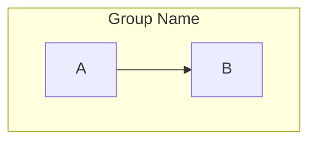

# Mermaid Diagram Analysis Report

## Summary

Found **249 files** containing Mermaid diagram blocks in the `/home/deepak/DStudio/docs` directory.

## Diagram Types Distribution

### 1. Graph Diagrams (graph TD/LR/TB/RL/BT)
- **245 files** containing `graph` directives
- **1,469 total occurrences**
- Most common type of diagram in the codebase

### 2. Flowchart Diagrams (flowchart TD/LR/TB/RL/BT)
- **67 files** containing `flowchart` directives  
- **177 total occurrences**
- Newer Mermaid syntax, mixed usage with `graph`

### 3. Other Diagram Types
- **175 files** with various diagram types:
  - `sequenceDiagram`
  - `classDiagram`
  - `stateDiagram` / `stateDiagram-v2`
  - `erDiagram`
  - `gantt`
  - `pie`
  - `journey`
  - Others

## Potential Syntax Issues for Mermaid v11.9.0

### 1. Style Directives
- **161 files** containing style directives (`style ... fill:`, `style ... stroke:`, `style ... color:`)
- **2,380 total occurrences**
- These inline styles may need review for compatibility with v11.9.0

### 2. RGB Colors in Sequence Diagrams
- **4 files** using `rect rgb()` syntax in sequence diagrams:
  - `/home/deepak/DStudio/docs/part2-pillars/truth/index.md`
  - `/home/deepak/DStudio/docs/patterns/consensus.md`
  - `/home/deepak/DStudio/docs/patterns/leader-election.md`
  - `/home/deepak/DStudio/docs/patterns/distributed-lock.md`

### 3. Mixed Graph/Flowchart Usage
- Some files use both `graph` and `flowchart` syntax
- This could cause rendering inconsistencies

### 4. StateDiagram Versions
- **20 files** using `stateDiagram-v2` (newer syntax)
- Others may still be using older `stateDiagram` syntax

## Common Patterns Observed

### 1. Subgraph Usage
Many diagrams use subgraphs extensively for grouping:


### 2. Style Applications
Heavy use of inline styling for visual differentiation:
```mermaid
style A fill:#f9f,stroke:#333,stroke-width:3px
```

### 3. Complex Layouts
Multi-level hierarchical diagrams with various node shapes and connections

## Recommendations

1. **Test Rendering**: All 249 files should be tested with Mermaid v11.9.0
2. **Style Migration**: Consider moving inline styles to CSS classes if v11.9.0 has breaking changes
3. **Syntax Standardization**: Standardize on either `graph` or `flowchart` syntax
4. **StateDiagram Update**: Ensure all state diagrams use `stateDiagram-v2` syntax
5. **RGB Color Review**: Check if `rect rgb()` syntax is still supported in sequence diagrams

## High-Priority Files to Review

Based on complexity and syntax patterns:
1. Files with RGB colors in sequence diagrams (4 files)
2. Files mixing graph/flowchart syntax
3. Files with extensive inline styling (161 files)
4. State diagram files not using v2 syntax

## File List Available

A complete list of all 249 files containing Mermaid diagrams has been identified and can be processed programmatically if needed.