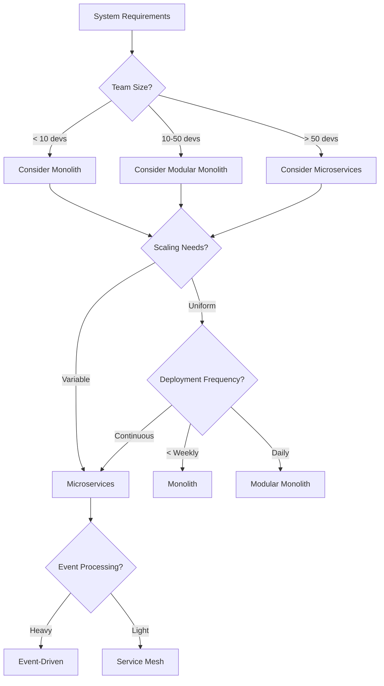
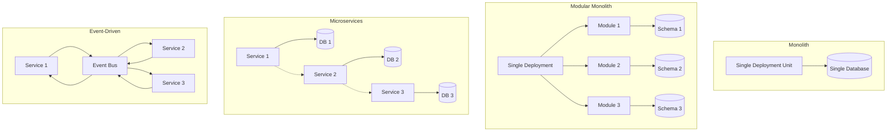

# Architecture Patterns - Platinum Tier Enhancement
**For Integration into Foundational Series**

## Comprehensive Architecture Pattern Analysis

### The Architecture Decision Framework

**Key Question**: When should you use each architecture pattern?



### Pattern 1: Monolith Architecture - When Simplicity Wins

**When to Use Monolith**:

| Scenario | Why Monolith Wins | Example |
|----------|-------------------|---------|
| Startup MVP | Speed to market | Airbnb's first 2 years |
| Small team (<10) | Communication overhead | Basecamp (still monolith) |
| Low traffic | No scaling complexity | Internal tools |
| Tight coupling required | Transaction consistency | Banking core systems |
| Simple domain | No need for complexity | Blog platforms |

**The Modular Monolith - Best of Both Worlds**:

```python
class ModularMonolithArchitecture:
    """
    Demonstrates how to structure a monolith for future decomposition
    """
    
    def __init__(self):
        self.modules = {
            'user': UserModule(),
            'order': OrderModule(),
            'inventory': InventoryModule(),
            'payment': PaymentModule()
        }
        
    def enforce_module_boundaries(self):
        """
        Key to modular monolith success: strict boundaries
        """
        rules = {
            # Module communication only through defined interfaces
            'communication': 'interfaces_only',
            
            # Each module has its own database schema
            'data_isolation': 'schema_per_module',
            
            # No shared domain objects
            'domain_isolation': 'no_shared_entities',
            
            # Module-specific API endpoints
            'api_structure': '/api/{module}/{resource}'
        }
        
        return rules
    
    def example_module_structure(self):
        """
        How Shopify structures their monolith
        """
        return {
            'app/components/shops/': {
                'models/': 'Shop domain models',
                'services/': 'Shop business logic',
                'controllers/': 'Shop API endpoints',
                'jobs/': 'Shop background jobs',
                'db/': 'Shop-specific migrations'
            },
            'app/components/orders/': {
                'models/': 'Order domain models',
                'services/': 'Order business logic',
                'controllers/': 'Order API endpoints',
                'jobs/': 'Order background jobs',
                'db/': 'Order-specific migrations'
            }
        }
```

**Real Example - Shopify's Monolith Success**:

```ruby
# Shopify's modular monolith handles 10,000+ requests/second
class ShopifyArchitecture
  # They use "componentization" within their Rails monolith
  
  # Each component is isolated
  module Components
    module Checkout
      class Service
        # Strict boundaries - no reaching into other components
        def process_checkout(cart_id)
          cart = Cart::Repository.find(cart_id) # OK
          # user = User.find(cart.user_id) # NOT OK - cross boundary
          user = User::Repository.find_by_cart(cart_id) # OK - defined interface
        end
      end
    end
  end
  
  # Database sharding by shop
  class ShardedDatabase
    def shard_for_shop(shop_id)
      # 100+ database shards, but still one codebase
      shard_id = shop_id % 128
      "shard_#{shard_id}"
    end
  end
end
```

### Pattern 2: Microservices - When Distribution is Worth It

**Case-by-Case Analysis**:

```python
class MicroservicesDecisionMatrix:
    """
    Quantitative framework for microservices decisions
    """
    
    def should_use_microservices(self, org_metrics):
        score = 0
        max_score = 100
        
        # Team autonomy need (0-20 points)
        if org_metrics['teams'] > 10:
            score += min(20, org_metrics['teams'] - 10)
            
        # Scaling requirements (0-20 points)
        if org_metrics['scaling_variance'] > 10:  # 10x difference between services
            score += 20
        elif org_metrics['scaling_variance'] > 5:
            score += 10
            
        # Technology diversity need (0-15 points)
        if org_metrics['tech_stack_count'] > 3:
            score += 15
        elif org_metrics['tech_stack_count'] > 1:
            score += 8
            
        # Deployment frequency (0-15 points)
        if org_metrics['deployments_per_day'] > 10:
            score += 15
        elif org_metrics['deployments_per_day'] > 1:
            score += 10
            
        # Fault isolation requirements (0-15 points)
        if org_metrics['availability_sla'] > 0.999:
            score += 15
        elif org_metrics['availability_sla'] > 0.99:
            score += 8
            
        # Development velocity requirements (0-15 points)
        if org_metrics['feature_teams'] > 5:
            score += 15
            
        recommendation = {
            'score': score,
            'recommendation': self.get_recommendation(score),
            'confidence': self.calculate_confidence(org_metrics)
        }
        
        return recommendation
    
    def get_recommendation(self, score):
        if score >= 70:
            return "Strong fit for microservices"
        elif score >= 50:
            return "Consider microservices with careful planning"
        elif score >= 30:
            return "Start with modular monolith, evolve to microservices"
        else:
            return "Monolith recommended"
```

**Amazon's Journey from Monolith to Microservices**:

```python
class AmazonMicroservicesEvolution:
    """
    How Amazon decomposed their monolith (2001-2006)
    """
    
    def __init__(self):
        self.year_2001 = "Monolithic Obidos application"
        self.year_2006 = "Hundreds of microservices"
        
    def decomposition_strategy(self):
        """
        Amazon's actual decomposition approach
        """
        phases = {
            'phase_1': {
                'name': 'Service Interface Definition',
                'duration': '6 months',
                'actions': [
                    'Mandate all teams expose data via service interfaces',
                    'No direct database access between teams',
                    'All communication via network calls'
                ]
            },
            'phase_2': {
                'name': 'Database Decomposition',
                'duration': '12 months',
                'actions': [
                    'Split shared database by domain',
                    'Each service owns its data',
                    'No shared tables allowed'
                ]
            },
            'phase_3': {
                'name': 'Team Reorganization',
                'duration': '6 months',
                'actions': [
                    'Two-pizza teams',
                    'Full ownership of services',
                    'On-call responsibilities'
                ]
            }
        }
        return phases
    
    def lessons_learned(self):
        return {
            'distributed_transactions': 'Eliminated - eventual consistency instead',
            'service_discovery': 'Built custom solution (later open-sourced concepts)',
            'monitoring': 'Had to build CloudWatch from scratch',
            'deployment': 'Pioneered immutable deployments',
            'cost': 'Initial 2x infrastructure cost, paid off in 2 years'
        }
```

### Pattern 3: Event-Driven Architecture - When Decoupling Matters

**When to Use Event-Driven**:

```python
class EventDrivenDecisionFramework:
    """
    Framework for deciding when event-driven makes sense
    """
    
    def analyze_use_case(self, system_characteristics):
        event_driven_score = 0
        
        # High score indicators
        if system_characteristics['integration_points'] > 5:
            event_driven_score += 25  # Many systems need updates
            
        if system_characteristics['temporal_coupling'] == 'problematic':
            event_driven_score += 25  # Systems don't need sync responses
            
        if system_characteristics['event_sourcing_fit'] == True:
            event_driven_score += 20  # Natural event-based domain
            
        if system_characteristics['replay_requirements'] == True:
            event_driven_score += 15  # Need to replay history
            
        if system_characteristics['multi_consumer'] == True:
            event_driven_score += 15  # Multiple systems need same data
            
        return {
            'score': event_driven_score,
            'recommended': event_driven_score > 60,
            'architecture': self.recommend_architecture(event_driven_score)
        }
    
    def recommend_architecture(self, score):
        if score > 80:
            return "Full event-driven with event sourcing"
        elif score > 60:
            return "Event-driven for integration, REST for queries"
        elif score > 40:
            return "Hybrid - critical flows event-driven"
        else:
            return "Traditional request-response"
```

**LinkedIn's Kafka-Based Architecture**:

```python
class LinkedInEventArchitecture:
    """
    How LinkedIn handles 7 trillion messages/day with Kafka
    """
    
    def __init__(self):
        self.daily_messages = 7_000_000_000_000
        self.kafka_clusters = 100
        self.topics = 100_000
        
    def architecture_overview(self):
        return {
            'data_pipeline': {
                'layer_1': 'Kafka for all data movement',
                'layer_2': 'Samza for stream processing',
                'layer_3': 'Pinot for real-time analytics',
                'layer_4': 'Venice for serving layer'
            },
            'use_cases': {
                'activity_tracking': 'Every page view, click, impression',
                'metrics': 'All operational metrics flow through Kafka',
                'database_changes': 'CDC from all databases',
                'application_logs': 'Centralized logging via Kafka'
            }
        }
    
    def scaling_lessons(self):
        return {
            'partitioning': {
                'strategy': 'Partition by member_id for user events',
                'count': 'Start with 10x expected throughput',
                'rebalancing': 'Automated partition reassignment'
            },
            'retention': {
                'default': '7 days for most topics',
                'compliance': '7 years for regulated data',
                'compacted': 'Latest value for changelog topics'
            },
            'monitoring': {
                'lag': 'Consumer lag alerts < 1 minute',
                'throughput': 'Bytes/messages per second per topic',
                'errors': 'Producer/consumer error rates'
            }
        }
```

### Pattern 4: Serverless Architecture - When Operations Disappear

**Serverless Decision Matrix**:

```python
class ServerlessArchitectureAnalysis:
    """
    When serverless makes sense (and when it doesn't)
    """
    
    def __init__(self):
        self.providers = ['AWS Lambda', 'Google Cloud Functions', 'Azure Functions']
        
    def calculate_serverless_fit(self, workload):
        """
        Quantitative analysis of serverless fit
        """
        
        # Cost analysis
        requests_per_month = workload['requests_per_month']
        avg_duration_ms = workload['avg_duration_ms']
        memory_mb = workload['memory_mb']
        
        # Lambda pricing model
        compute_gb_seconds = (requests_per_month * avg_duration_ms * memory_mb) / (1000 * 1024)
        serverless_cost = (
            requests_per_month * 0.0000002 +  # Request cost
            compute_gb_seconds * 0.0000166667  # Compute cost
        )
        
        # Traditional server cost (t3.medium example)
        servers_needed = max(1, requests_per_month / (30 * 24 * 60 * 60 * 1000))  # 1000 RPS per server
        traditional_cost = servers_needed * 37.44  # Monthly cost
        
        # Cold start impact
        cold_start_penalty = self.calculate_cold_start_impact(workload)
        
        return {
            'serverless_cost': serverless_cost,
            'traditional_cost': traditional_cost,
            'cost_savings': traditional_cost - serverless_cost,
            'cold_start_impact': cold_start_penalty,
            'recommendation': self.get_recommendation(workload, serverless_cost, traditional_cost, cold_start_penalty)
        }
    
    def calculate_cold_start_impact(self, workload):
        """
        Estimate cold start impact on user experience
        """
        cold_start_time = {
            'python': 100,  # ms
            'nodejs': 50,
            'go': 10,
            'java': 1000,
            'dotnet': 500
        }
        
        runtime = workload.get('runtime', 'python')
        cold_start_ms = cold_start_time.get(runtime, 200)
        
        # Estimate cold start frequency
        idle_timeout = 15 * 60 * 1000  # 15 minutes in ms
        avg_request_interval = (30 * 24 * 60 * 60 * 1000) / workload['requests_per_month']
        
        if avg_request_interval > idle_timeout:
            cold_start_percentage = 90  # Most requests hit cold start
        else:
            cold_start_percentage = min(10, (idle_timeout / avg_request_interval) * 10)
            
        avg_latency_impact = (cold_start_ms * cold_start_percentage) / 100
        
        return {
            'cold_start_ms': cold_start_ms,
            'affected_requests_percent': cold_start_percentage,
            'avg_latency_increase_ms': avg_latency_impact
        }
```

**Netflix's Serverless Video Encoding**:

```python
class NetflixServerlessEncoding:
    """
    How Netflix uses serverless for video processing
    """
    
    def __init__(self):
        self.encoding_pipeline = "Cosmos"
        self.functions_per_video = 1000  # Parallel chunks
        
    def encoding_strategy(self):
        """
        Netflix's approach to serverless video encoding
        """
        return {
            'chunking': {
                'strategy': 'Split video into 10-second chunks',
                'parallelism': 'Process all chunks simultaneously',
                'reassembly': 'Stitch chunks after encoding'
            },
            'cost_optimization': {
                'spot_instances': 'Use spot for non-urgent encodes',
                'quality_tiers': 'More functions for 4K/HDR',
                'caching': 'Cache common encode settings'
            },
            'scaling': {
                'peak_functions': 300_000,  # During new release
                'average_functions': 50_000,
                'burst_capacity': '6x average'
            }
        }
```

### Pattern 5: Service Mesh Architecture - When Services Multiply

**Service Mesh Adoption Guide**:

```python
class ServiceMeshDecisionFramework:
    """
    When you need a service mesh (and when you don't)
    """
    
    def __init__(self):
        self.mesh_options = ['Istio', 'Linkerd', 'Consul Connect', 'AWS App Mesh']
        
    def analyze_mesh_need(self, architecture_metrics):
        """
        Quantify the need for service mesh
        """
        
        mesh_score = 0
        
        # Number of services
        if architecture_metrics['service_count'] > 50:
            mesh_score += 30
        elif architecture_metrics['service_count'] > 20:
            mesh_score += 20
        elif architecture_metrics['service_count'] > 10:
            mesh_score += 10
            
        # Communication complexity
        service_connections = architecture_metrics['service_connections']
        if service_connections > architecture_metrics['service_count'] * 3:
            mesh_score += 25  # High interconnectedness
            
        # Security requirements
        if architecture_metrics['mtls_required']:
            mesh_score += 20
            
        # Traffic management needs
        if architecture_metrics['canary_deployments']:
            mesh_score += 15
            
        # Observability requirements
        if architecture_metrics['distributed_tracing_required']:
            mesh_score += 10
            
        return {
            'score': mesh_score,
            'needs_mesh': mesh_score > 60,
            'recommended_mesh': self.recommend_mesh(architecture_metrics, mesh_score)
        }
```

### Architecture Pattern Anti-Patterns

**Common Mistakes and How to Avoid Them**:

```python
class ArchitectureAntiPatterns:
    """
    Real anti-patterns from production systems
    """
    
    def distributed_monolith(self):
        """
        The worst of both worlds
        """
        return {
            'symptoms': [
                'All services must deploy together',
                'Shared database between services',
                'Synchronous calls everywhere',
                'No service can function independently'
            ],
            'example': 'Early Uber microservices (2014)',
            'fix': {
                'step_1': 'Identify true service boundaries',
                'step_2': 'Eliminate shared databases',
                'step_3': 'Move to async communication',
                'step_4': 'Independent deployments'
            }
        }
    
    def premature_microservices(self):
        """
        Microservices before you need them
        """
        return {
            'symptoms': [
                'More services than developers',
                'Most services < 1000 lines of code',
                'Spend more time on infrastructure than features',
                'Simple features require 5+ service changes'
            ],
            'example': 'Many failed startups (2015-2020)',
            'fix': {
                'step_1': 'Consolidate related services',
                'step_2': 'Move to modular monolith',
                'step_3': 'Extract services only when needed',
                'step_4': 'Focus on product-market fit'
            }
        }
```

### Visual Architecture Comparisons



### Architecture Migration Patterns

```python
class ArchitectureMigrationStrategies:
    """
    How to evolve between architectures safely
    """
    
    def monolith_to_microservices(self):
        """
        The strangler fig pattern in practice
        """
        return {
            'phase_1': {
                'name': 'Identify seams',
                'duration': '1-2 months',
                'actions': [
                    'Find natural module boundaries',
                    'Identify shared data',
                    'Map dependencies'
                ]
            },
            'phase_2': {
                'name': 'Extract first service',
                'duration': '2-3 months',
                'actions': [
                    'Choose least coupled module',
                    'Build API facade',
                    'Dual writes for data migration'
                ]
            },
            'phase_3': {
                'name': 'Prove the pattern',
                'duration': '1 month',
                'actions': [
                    'Monitor performance',
                    'Measure complexity increase',
                    'Validate benefits'
                ]
            },
            'phase_4': {
                'name': 'Accelerate extraction',
                'duration': '6-24 months',
                'actions': [
                    'Extract remaining services',
                    'Build shared infrastructure',
                    'Sunset monolith'
                ]
            }
        }
```

### Decision Checklist

**Architecture Selection Checklist**:

- [ ] Team size and structure analyzed
- [ ] Scaling requirements quantified
- [ ] Domain boundaries identified
- [ ] Data consistency needs assessed
- [ ] Operational capabilities evaluated
- [ ] Cost projections calculated
- [ ] Migration path planned
- [ ] Rollback strategy defined
- [ ] Success metrics established
- [ ] Anti-patterns checklist reviewed