# Episode 7: Consensus and Coordination
**The Foundational Series - Distributed Systems Engineering**

*Runtime: 2 hours 30 minutes*  
*Difficulty: Advanced*  
*Prerequisites: Episodes 1-6, basic understanding of distributed systems*

---

## Cold Open: The $12 Million Millisecond

*[Sound: Server room ambiance, gentle hum of cooling systems]*

**Narrator**: It's 3:47 AM on November 15th, 2014. MongoDB's primary data center in Virginia just went dark. Power failure. Total blackout.

*[Sound: Sudden silence, then emergency alarms]*

But here's where it gets interesting. MongoDB's replica set should handle this gracefully. Three nodes: one primary, two secondaries. When the primary dies, the secondaries should elect a new leader in seconds.

*[Sound: Typing, urgent commands]*

**Engineer**: "Secondary 1 thinks it's primary now..."  
**Engineer 2**: "Wait, Secondary 2 also thinks it's primary!"  
**Engineer**: "That's impossible. We can't have two primaries."  
**Engineer 2**: "Tell that to the database."

*[Sound: Phones ringing, escalation calls]*

For 47 minutes, MongoDB had a split-brain. Two nodes, both convinced they were the leader. Both accepting writes. Both creating divergent histories of reality.

When the network healed, they had to choose: Which version of the last hour was real? Which $12 million in transactions actually happened?

*[Sound: Deep breath, transition music]*

**Narrator**: Welcome to the consensus problem. The single hardest challenge in distributed systems. Today, we're diving deep into how distributed systems agree on reality when reality itself is under attack.

---

## Introduction: The Fundamental Challenge

### The Core Insight

In distributed systems, consensus isn't just nice to haveit's the foundation that everything else builds on. Without the ability to agree on a single version of truth, you have:

- **Split-brain scenarios**: Multiple nodes claiming leadership
- **Data divergence**: Different nodes with different "facts"  
- **Cascading failures**: Uncertainty propagating through systems
- **Byzantine behaviors**: Nodes actively lying or corrupted

But here's the brutal reality: **Perfect consensus is mathematically impossible** in asynchronous networks with failures. The FLP Impossibility Theorem proved this in 1985.

Yet somehow, we build systems that work. How?

### The Trade-off Triangle

Every consensus system lives somewhere in this triangle:

```
        Safety
         /|\
        / | \
       /  |  \
      /   |   \
     /    |    \
    /     |     \
   /      |      \
  /       |       \
 /        |        \
Liveness --------- Performance
```

- **Safety**: Never agree on wrong answer
- **Liveness**: Eventually agree on something  
- **Performance**: Agree quickly

Pick two. The third becomes your weakness.

---

## Part I: The Mathematics of Agreement (25 minutes)

### The FLP Impossibility Theorem

*Fischer, Lynch, and Paterson proved the impossible in 1985.*

**The Setup**: 
- Asynchronous network (no timing guarantees)
- At least one node can fail by stopping
- Deterministic consensus protocol

**The Proof** (simplified):
1. Any correct protocol must have decision points
2. Decision points create critical states  
3. In critical states, one delayed message changes the decision
4. But in asynchronous networks, delayed = failed
5. Therefore, no protocol can distinguish delayed from failed
6. Therefore, no protocol can guarantee both safety and liveness

**The Implication**: Perfect consensus is impossible.

### But Wait, We Have Paxos!

The FLP theorem has a loophole: **partial synchrony**.

In the real world:
- Networks usually deliver messages
- Nodes usually respond within reasonable time
- We can detect "probably failed" vs "probably slow"

This is why practical consensus algorithms work **most of the time**.

### The CAP Theorem Connection

CAP isn't just about databasesit's about consensus:

- **Consistency**: All nodes agree (consensus achieved)
- **Availability**: System responds (liveness maintained)  
- **Partition Tolerance**: Works despite network splits

During network partitions, you choose:
- **CP**: Maintain consensus, sacrifice availability
- **AP**: Stay available, sacrifice consensus

There is no CA in distributed systems. Networks always partition.

---

## Part II: The Raft Algorithm - Consensus Made Understandable (35 minutes)

### Why Raft Exists

Paxos dominated consensus for 30 years, but it had problems:
- Impossibly complex to understand
- Multiple interpretations of the algorithm  
- Implementation bugs were common
- Even experts got it wrong

In 2013, Diego Ongaro and John Ousterhout created Raft with one goal: **understandability**.

### The Raft Architecture

#### 1. Leader Election

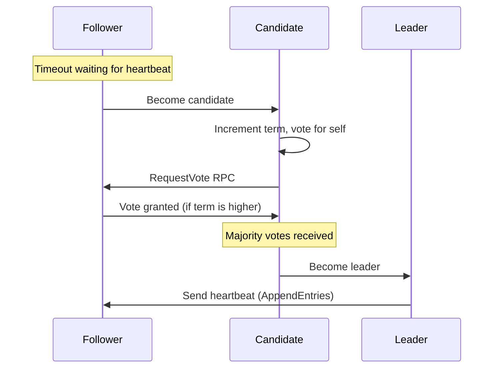

**Key Principles**:
- Only one leader per term
- Terms act as logical clocks
- Majority vote prevents split-brain
- Randomized timeouts prevent deadlocks

#### 2. Log Replication

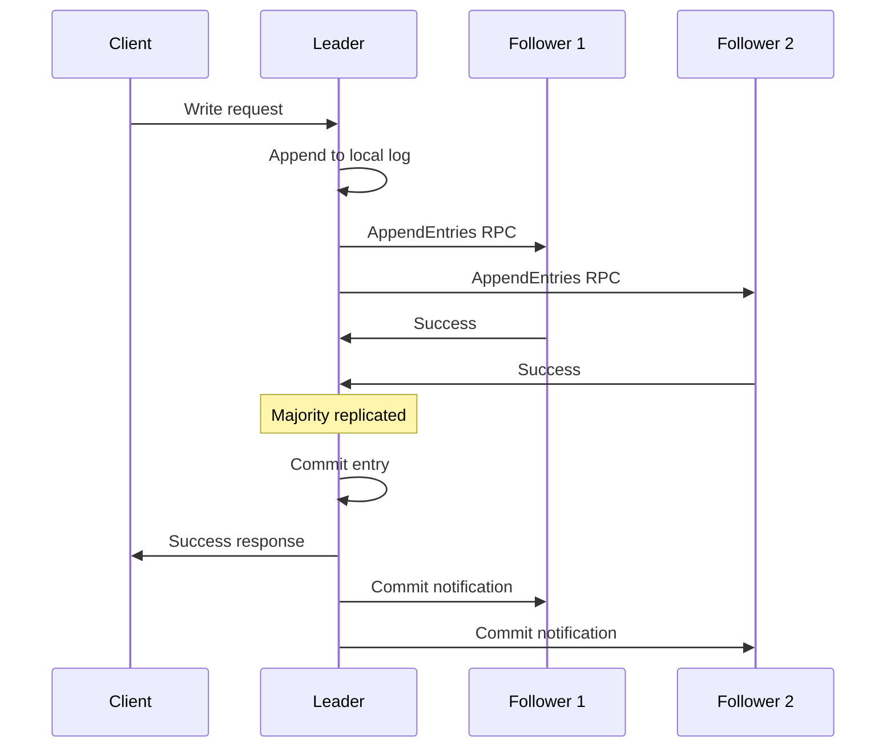

**Key Properties**:
- Log entries are immutable once committed
- Majority replication ensures durability
- Followers apply entries in order
- Leader manages all client interactions

#### 3. Safety Guarantees

**Election Safety**: At most one leader per term
- Achieved through majority voting
- Each node votes for at most one candidate per term

**Leader Append-Only**: Leaders never overwrite entries
- Leaders only append new entries
- Previous entries remain unchanged

**Log Matching**: If two logs contain an entry with same index and term, logs are identical up to that point
- Ensured by consistency checks in AppendEntries

**Leader Completeness**: All committed entries appear in future leaders
- Election restriction: candidate must have all committed entries

**State Machine Safety**: If any server applies a log entry at index i, no other server applies different entry for index i
- Follows from other properties

### Real-World Raft: etcd Deep Dive

**etcd** is the most successful Raft implementation, used by:
- Kubernetes (cluster coordination)
- CoreOS (service discovery)  
- Cloud Foundry (configuration management)

#### Performance Characteristics

```yaml
# etcd Raft Performance (3-node cluster)
Write Latency:
  - 50th percentile: ~2ms
  - 99th percentile: ~25ms
  - 99.9th percentile: ~100ms

Throughput:
  - Small objects (< 1KB): ~10,000 writes/sec
  - Large objects (> 10KB): ~1,000 writes/sec
  
Consistency:
  - Strong consistency: Always
  - Read preference: Leader reads for consistency
  - Follower reads: Eventually consistent
```

#### Configuration Best Practices

```yaml
# Production etcd.yml
# Cluster sizing
cluster-size: 3  # or 5 for higher availability

# Timeouts (milliseconds)
heartbeat-interval: 100      # Leader heartbeat frequency
election-timeout: 1000       # Follower timeout range: 1000-5000ms
auto-compaction-retention: 1 # Hours to keep history

# Performance tuning  
max-txn-ops: 128            # Operations per transaction
max-request-bytes: 1572864  # 1.5MB max request size

# Monitoring
metrics: extensive          # Prometheus metrics
log-level: info            # Operational visibility
```

### Raft Failure Scenarios

#### Scenario 1: Leader Failure

```
Time 0: [Leader] [Follower] [Follower]
Time 1: [  X   ] [Follower] [Follower]  # Leader crashes
Time 2: [  X   ] [Candidate][Follower]  # Election starts
Time 3: [  X   ] [  Leader ][Follower]  # New leader elected
```

**Recovery Time**: Election timeout + majority vote time (~1-5 seconds)

#### Scenario 2: Network Partition

```
Partition A: [Leader] [Follower]    # 2 nodes
Partition B: [Follower]             # 1 node

Result: 
- Partition A: Continues operating (has majority)
- Partition B: Becomes read-only (no majority)
```

**Key Insight**: Majority partitions stay available, minority partitions become read-only.

#### Scenario 3: Split-Brain Prevention

```
# What doesn't happen in Raft:
Partition A: [Leader] [Follower]    # Both claim leadership
Partition B: [Leader]               # IMPOSSIBLE

# Why it's prevented:
Partition A: Leader has majority, stays leader
Partition B: No majority, cannot elect leader
```

---

## Part III: Byzantine Fault Tolerance - When Nodes Lie (30 minutes)

### Beyond Simple Failures

Raft assumes **fail-stop** failures: nodes either work correctly or stop completely. But what about:

- **Hardware corruption**: Bit flips, memory errors
- **Software bugs**: Logic errors, race conditions  
- **Malicious actors**: Compromised nodes, insider attacks
- **Environmental factors**: Cosmic rays, EMI

These create **Byzantine failures**: nodes that behave arbitrarily, including maliciously.

### The Byzantine Generals Problem

*Lamport's famous formulation from 1982*

**Scenario**: Byzantine army surrounds enemy city. Generals must coordinate attack:
- Attack together = Victory
- Attack separately = Defeat  
- Some generals might be traitors

**Challenge**: Reach consensus despite traitors sending conflicting messages.

**Solution Requirements**:
1. All loyal generals decide on same action
2. Small number of traitors cannot cause loyal generals to adopt bad plan

### The 3f+1 Theorem

**For Byzantine fault tolerance with f malicious nodes, you need at least 3f+1 total nodes.**

**Why?**

Consider f=1 (one traitor):
- Need 4 total nodes
- Traitor can split honest nodes 2-2
- But majority of honest nodes (2 out of 3) can still outvote traitor

```
Scenario: 4 nodes, 1 Byzantine

Good nodes see:  [A] [A] [B] [?]  # Byzantine sends different values
Majority rule:   A wins with 2/3 honest votes
Byzantine impact: Cannot break consensus
```

### Practical Byzantine Fault Tolerance (PBFT)

**PBFT Algorithm** (Castro & Liskov, 1999):

#### Phase 1: Pre-Prepare
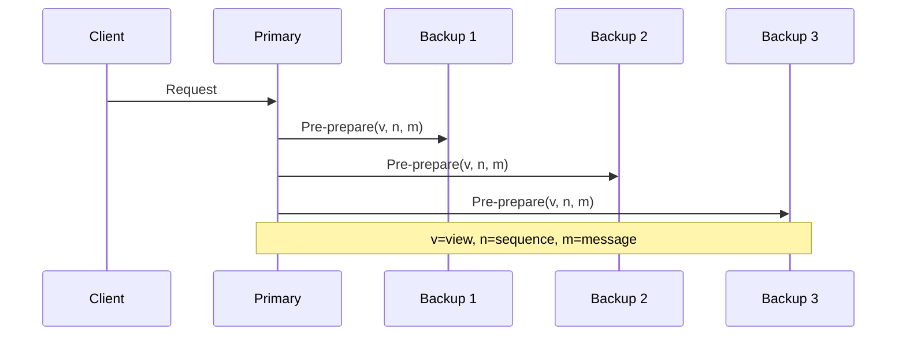

#### Phase 2: Prepare
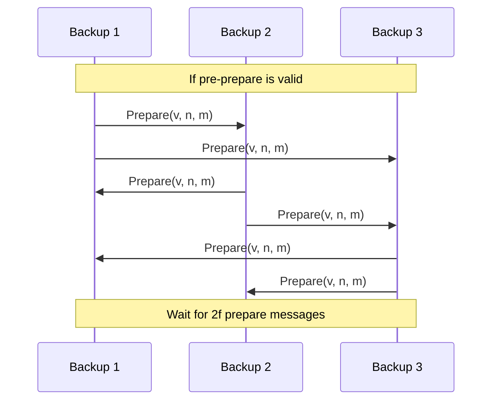

#### Phase 3: Commit
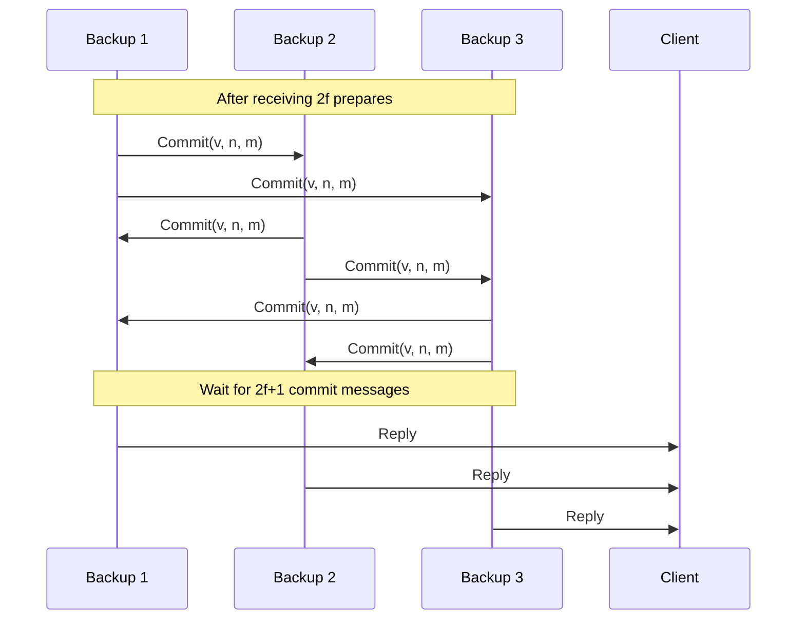

**Key Properties**:
- **3 phases** ensure agreement despite Byzantine behavior
- **2f+1 identical responses** required from client perspective
- **View changes** handle primary failures
- **Cryptographic signatures** prevent message forgery

### Modern Byzantine Systems

#### Blockchain Consensus

**Bitcoin (Proof of Work)**:
```
Consensus Rule: Longest valid chain wins
Byzantine Model: Up to 49% hashpower can be malicious
Security: Probabilistic (6 confirmations H 99.9% certain)
Throughput: ~7 transactions/second
Energy: ~700 kWh per transaction
```

**Ethereum 2.0 (Proof of Stake)**:
```
Consensus Rule: Casper FFG finality
Byzantine Model: Up to 33% stake can be malicious  
Security: Economic penalties for malicious behavior
Throughput: ~15 transactions/second (base layer)
Energy: ~0.0026 kWh per transaction
```

#### Hyperledger Fabric

Enterprise blockchain using PBFT variant:
```yaml
# Fabric Ordering Service
Consensus: PBFT-based (Kafka/Raft options)
Fault Model: Up to f Byzantine orderers in 3f+1 cluster
Throughput: ~3,500 transactions/second
Latency: ~100ms for finality
Use Case: Private/consortium blockchains
```

### Performance Implications

**BFT vs CFT Performance**:

| Metric | CFT (Raft) | BFT (PBFT) | Ratio |
|--------|------------|------------|-------|
| Message Complexity | O(n) | O(n²) | n times worse |
| Minimum Nodes | 3 | 4 | 33% more |
| Latency | 1 RTT | 3 RTT | 3x slower |
| Throughput | 10K ops/sec | 1K ops/sec | 10x slower |
| CPU Overhead | Low | High (crypto) | 5-10x more |

**When to Use BFT**:
-  Untrusted environments (blockchain, multi-org)
-  High-value transactions (financial systems)
-  Regulatory requirements (auditability)
- L Internal systems with trusted nodes
- L High-performance requirements
- L Resource-constrained environments

---

## Part IV: Vector Clocks and Logical Time (25 minutes)

### The Problem of Time in Distributed Systems

**Physical clocks are unreliable**:
- Clock drift: ~1ms/day for good hardware
- NTP synchronization: ~1-50ms accuracy
- Network delays: Variable and unpredictable
- Time zones, leap seconds, daylight savings

**But we need ordering**:
- Which event happened first?
- What's the causal relationship?
- How do we detect conflicts?

### Lamport Timestamps

**Leslie Lamport's insight (1978)**: We don't need absolute time, just ordering.

**Logical Clock Rules**:
1. Each process maintains counter C
2. Before each event: C = C + 1  
3. When sending message: include C in message
4. When receiving message with timestamp T: C = max(C, T) + 1

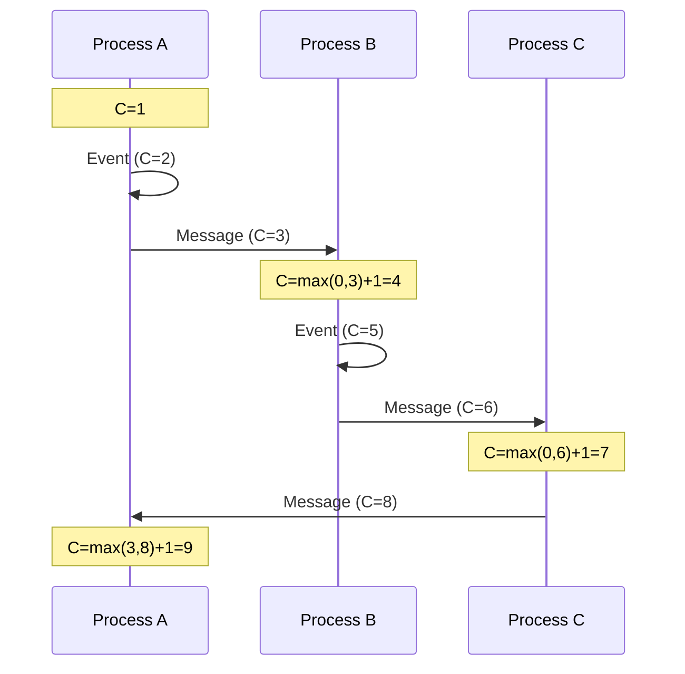

**Property**: If event A causally precedes event B, then timestamp(A) < timestamp(B).

**Limitation**: Converse isn't true. timestamp(A) < timestamp(B) doesn't mean A caused B.

### Vector Clocks: Capturing Causality

**The Solution**: Instead of single counter, maintain vector of counters.

**Vector Clock Rules**:
1. Each process Pi maintains vector Vi[1...n]
2. Before each local event: Vi[i] = Vi[i] + 1
3. When sending message: include entire vector Vi
4. When receiving message with vector Vj: 
   - Vi[i] = Vi[i] + 1 (local increment)
   - Vi[k] = max(Vi[k], Vj[k]) for all k`i

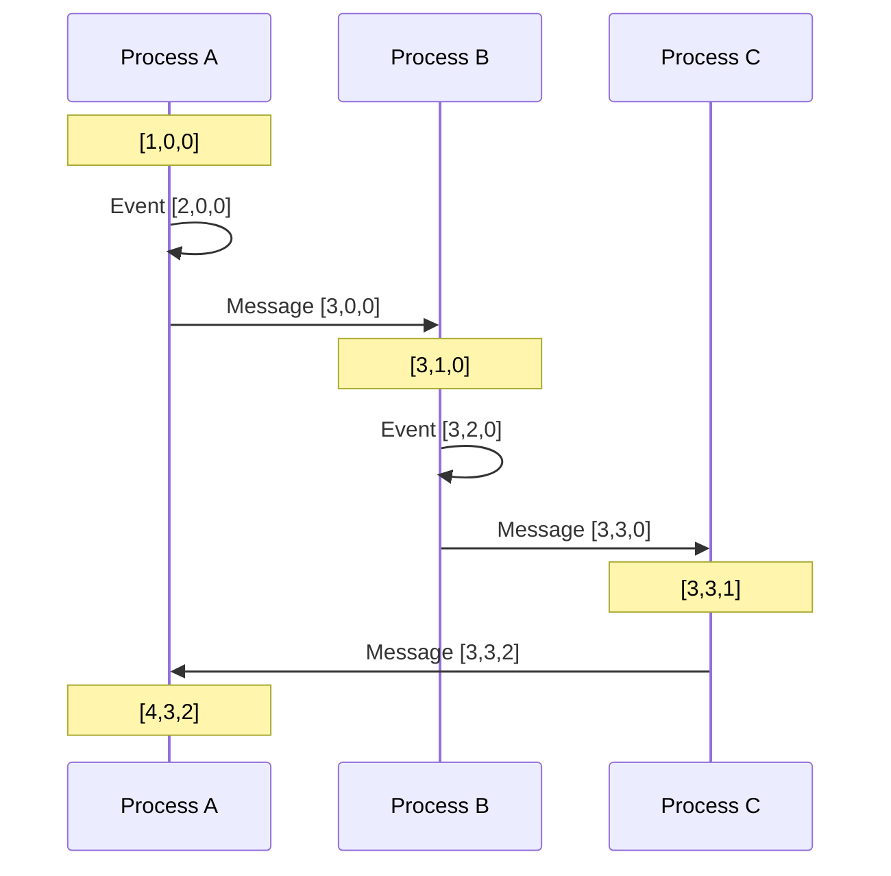

**Causality Detection**:
- A ’ B if VA d VB and VA ` VB (A causally precedes B)
- A || B if neither VA d VB nor VB d VA (A and B are concurrent)

### Real-World Vector Clock Systems

#### Riak Distributed Database

**Use Case**: Detecting conflicting updates in eventually consistent database.

```python
# Riak Vector Clock Example
class VectorClock:
    def __init__(self):
        self.clock = {}
    
    def increment(self, node_id):
        self.clock[node_id] = self.clock.get(node_id, 0) + 1
    
    def update(self, other_clock):
        for node_id, timestamp in other_clock.clock.items():
            self.clock[node_id] = max(
                self.clock.get(node_id, 0), 
                timestamp
            )
    
    def causally_precedes(self, other):
        # Check if self ’ other
        for node_id, timestamp in self.clock.items():
            if timestamp > other.clock.get(node_id, 0):
                return False
        return self.clock != other.clock
    
    def concurrent_with(self, other):
        return not (self.causally_precedes(other) or 
                   other.causally_precedes(self))

# Usage in Riak
def handle_write(key, value, context):
    # Get current vector clock from context
    vclock = context.vector_clock or VectorClock()
    
    # Increment for this node
    vclock.increment(node_id)
    
    # Store with vector clock
    return store_object(key, value, vclock)

def handle_read(key):
    siblings = get_all_versions(key)
    
    # Find concurrent versions (conflicts)
    conflicts = []
    for s1 in siblings:
        for s2 in siblings:
            if s1.vclock.concurrent_with(s2.vclock):
                conflicts.append((s1, s2))
    
    if conflicts:
        # Return all conflicting versions
        # Application must resolve
        return siblings
    else:
        # Return latest version
        return max(siblings, key=lambda s: s.vclock)
```

#### Amazon DynamoDB

**Vector Clocks in Practice**:
```yaml
# DynamoDB Item with Vector Clock
{
  "userId": "user123",
  "profile": {
    "name": "John Doe",
    "email": "john@example.com"
  },
  "_vclock": {
    "node1": 5,
    "node2": 3,
    "node3": 1
  }
}

# Conflict Resolution
conflict_versions:
  - version_a: {name: "John Doe", _vclock: {node1: 5, node2: 3}}
  - version_b: {name: "John Smith", _vclock: {node1: 4, node2: 4}}
  
# These are concurrent ’ Application must resolve
resolution_strategies:
  - last_writer_wins: Use wall-clock time (lossy)
  - merge_values: Combine non-conflicting fields
  - user_choice: Present options to user
  - business_logic: Domain-specific resolution
```

### Vector Clock Optimizations

#### 1. Clock Pruning
```python
def prune_vector_clock(vclock, max_entries=10):
    """Keep only most recent entries"""
    if len(vclock.clock) <= max_entries:
        return vclock
    
    # Sort by timestamp, keep newest
    sorted_entries = sorted(
        vclock.clock.items(), 
        key=lambda x: x[1], 
        reverse=True
    )
    
    pruned = VectorClock()
    pruned.clock = dict(sorted_entries[:max_entries])
    return pruned
```

#### 2. Dotted Version Vectors
```python
class DottedVersionVector:
    """More efficient than pure vector clocks"""
    def __init__(self):
        self.base = {}  # Continuous counters
        self.dots = set()  # Discrete events
    
    def update(self, node_id):
        # More compact representation
        # Used in Riak 2.0+
        pass
```

### Performance Characteristics

| System | Clock Type | Storage Overhead | Comparison Cost |
|--------|------------|------------------|-----------------|
| Lamport | Single integer | O(1) | O(1) |
| Vector | Vector of integers | O(n) | O(n) |
| Dotted | Base + dots | O(k) where k << n | O(k) |

**Space-Time Trade-offs**:
- **More nodes** = Larger vector clocks
- **More updates** = More storage overhead  
- **Pruning** = Lost causality information
- **Compression** = CPU overhead

---

## Part V: Practical Consensus Systems (30 minutes)

### Apache Kafka: Consensus for Streaming

**Kafka's Multi-Layer Consensus**:

#### 1. Cluster Membership (ZooKeeper ’ KRaft)

```yaml
# Legacy: ZooKeeper-based
zookeeper:
  servers:
    - zk1:2181
    - zk2:2181  
    - zk3:2181
  consensus: ZAB (ZooKeeper Atomic Broadcast)
  
# Modern: KRaft (Kafka Raft)  
kraft:
  controller.quorum.voters: 1@kafka1:9093,2@kafka2:9093,3@kafka3:9093
  consensus: Raft-based
  performance: 3x faster controller operations
```

#### 2. Partition Leadership

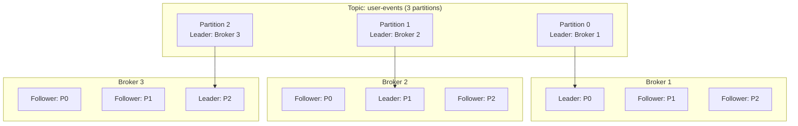

#### 3. Replica Synchronization

```python
# Kafka Replication Protocol
class KafkaReplication:
    def __init__(self, topic, partition):
        self.topic = topic
        self.partition = partition
        self.isr = set()  # In-Sync Replicas
        self.hw = 0       # High Water Mark
        
    def append_message(self, message):
        # 1. Leader appends to local log
        local_offset = self.append_local(message)
        
        # 2. Send to all followers
        for follower in self.get_followers():
            self.send_replica_request(follower, message)
        
        # 3. Wait for ISR acknowledgments
        acks = self.wait_for_acks(min_isr=2)
        
        # 4. Advance high water mark
        if len(acks) >= self.min_isr:
            self.hw = local_offset
            return local_offset
        else:
            raise InsufficientReplicasException()
    
    def handle_replica_request(self, message):
        # Follower handling
        if self.is_valid_message(message):
            self.append_local(message)
            self.send_ack_to_leader()
        else:
            self.request_missing_messages()
```

**Key Properties**:
- **At-least-once delivery**: Messages committed to ISR won't be lost
- **Ordering per partition**: Strict ordering within each partition
- **Leader election**: ISR members can become leader
- **Replication factor**: Configurable redundancy (typically 3)

### CockroachDB: Multi-Range Consensus

**Architecture**: Global database built on thousands of Raft groups.

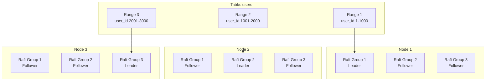

**Multi-Range Transactions**:
```sql
-- Transaction spanning multiple ranges
BEGIN;
UPDATE users SET balance = balance - 100 WHERE user_id = 500;   -- Range 1
UPDATE users SET balance = balance + 100 WHERE user_id = 1500;  -- Range 2
COMMIT;

-- Behind the scenes:
-- 1. Transaction coordinator elected
-- 2. Two-phase commit across ranges
-- 3. Each range uses Raft for local consensus
-- 4. Global consensus via 2PC + Raft
```

**Performance Characteristics**:
```yaml
# CockroachDB Consensus Performance
Single-Range Transaction:
  - Latency: ~10ms (1 Raft round-trip)
  - Throughput: ~1,000 txn/sec per range
  
Multi-Range Transaction:
  - Latency: ~50ms (2PC + multiple Raft groups)
  - Throughput: ~200 txn/sec (coordination overhead)
  
Range Splitting:
  - Trigger: 512MB or high load
  - Process: Split range, redistribute replicas
  - Impact: Brief unavailability (~100ms)
```

### Kubernetes etcd: Cluster Brain

**etcd as Kubernetes Foundation**:

```yaml
# Kubernetes API Server ’ etcd mapping
apiVersion: v1
kind: Pod
metadata:
  name: nginx
  namespace: default
---
# Stored in etcd as:
key: /registry/pods/default/nginx
value: {serialized pod spec}
revision: 12345
lease_ttl: null  # Persistent object
```

**Critical Operations**:

#### 1. Leader Election
```yaml
# kube-scheduler leader election
apiVersion: coordination.k8s.io/v1
kind: Lease
metadata:
  name: kube-scheduler
  namespace: kube-system
spec:
  holderIdentity: scheduler-node1
  leaseDurationSeconds: 15
  acquireTime: "2023-11-15T10:30:00Z"
  renewTime: "2023-11-15T10:30:14Z"
```

#### 2. Watch Mechanism
```python
# Kubernetes controller pattern
class PodController:
    def __init__(self):
        self.etcd_client = etcd3.client()
        
    def watch_pods(self):
        # Watch all pod changes
        events = self.etcd_client.watch_prefix("/registry/pods/")
        
        for event in events:
            if event.type == etcd3.events.PUT:
                self.handle_pod_update(event.key, event.value)
            elif event.type == etcd3.events.DELETE:
                self.handle_pod_deletion(event.key)
    
    def handle_pod_update(self, key, value):
        pod = deserialize_pod(value)
        
        # Ensure desired state
        if pod.spec.replicas != pod.status.ready_replicas:
            self.reconcile_pod(pod)
```

**Failure Scenarios and Recovery**:

```yaml
# etcd Cluster Failure Modes
Single Node Failure:
  - Impact: None (cluster continues with 2/3 majority)
  - Recovery: Automatic (failed node rejoins when restored)
  
Two Node Failure:  
  - Impact: Cluster read-only (no write quorum)
  - Recovery: Manual (restore from backup + add nodes)
  
Network Partition:
  - Majority partition: Continues operation
  - Minority partition: Read-only mode
  - Recovery: Automatic when partition heals

Data Corruption:
  - Impact: Potentially catastrophic
  - Recovery: Restore from backup + replay logs
  - Prevention: Regular snapshots + integrity checks
```

### Consul: Service Discovery Consensus

**Consul's Multi-DC Consensus**:

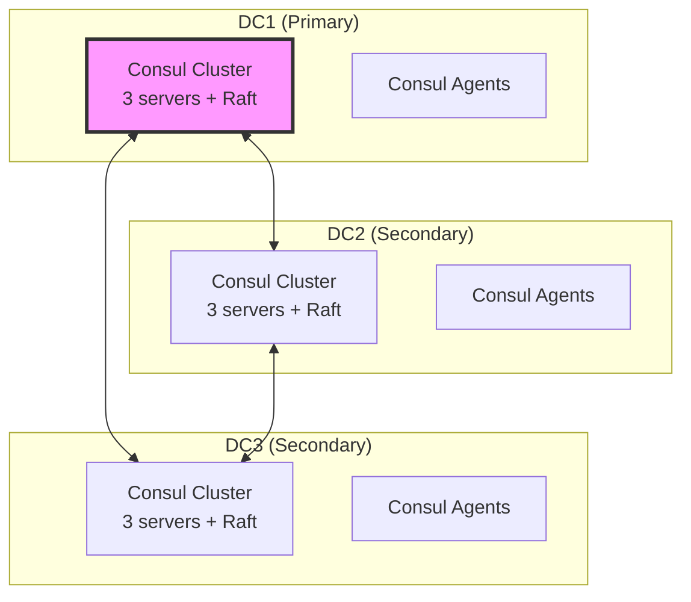

**Consensus Layers**:

#### 1. Local DC Consensus (Raft)
```json
{
  "service": {
    "name": "web",
    "port": 80,
    "check": {
      "http": "http://localhost:80/health",
      "interval": "10s"
    }
  }
}
```

#### 2. Cross-DC Replication (Gossip + Raft)
```yaml
# consul.hcl
datacenter = "dc1"
primary_datacenter = "dc1"

connect {
  enabled = true
  ca_provider = "consul"
}

# Cross-DC queries
acl = {
  enabled = true
  default_policy = "deny"
  enable_token_persistence = true
}
```

**Performance Characteristics**:
```yaml
# Consul Performance (per DC)
Service Registration:
  - Latency: ~5ms (local Raft commit)
  - Throughput: ~2,000 registrations/sec
  
Service Discovery:
  - Latency: ~1ms (local read)
  - Throughput: ~50,000 queries/sec
  
Cross-DC Queries:
  - Latency: ~50ms (network + remote Raft)
  - Consistency: Eventually consistent
```

---

## Part VI: Performance and Optimization (20 minutes)

### Consensus Performance Bottlenecks

#### 1. Network Round-Trips

**The fundamental limit**: Consensus requires communication.

```yaml
# Latency breakdown (3-node Raft cluster)
Network RTT: 1ms
Processing: 0.1ms  
Disk Write: 2ms

Total per operation:
- Leader ’ Followers: 1ms
- Wait for majority: 1ms  
- Commit notification: 1ms
- Total: ~3ms minimum
```

**Optimizations**:
- **Batching**: Group multiple operations
- **Pipelining**: Don't wait for previous operation
- **Read replicas**: Serve reads from followers

#### 2. Disk I/O

**The durability cost**: Consensus requires persistent storage.

```python
# Write-Ahead Log performance
class WAL:
    def __init__(self, path):
        self.file = open(path, 'ab')
        
    def append(self, entry):
        # The expensive operation
        self.file.write(serialize(entry))
        self.file.fsync()  # Force to disk (~2ms)
        
    def append_batch(self, entries):
        # Amortize fsync cost
        for entry in entries:
            self.file.write(serialize(entry))
        self.file.fsync()  # One fsync for many entries
```

**Optimization Strategies**:
- **Group commits**: Batch multiple writes
- **Fast storage**: NVMe SSDs, battery-backed RAM
- **Write combining**: Merge sequential writes
- **Async replication**: Trade consistency for speed

#### 3. CPU and Memory

**Consensus isn't CPU-bound, but...**:
- **Serialization/deserialization**: Protocol buffers, JSON
- **Cryptographic operations**: Byzantine systems
- **Memory allocation**: Garbage collection pressure
- **Context switching**: High concurrent load

```python
# Memory-efficient Raft implementation
class RaftLog:
    def __init__(self, max_memory_mb=100):
        self.entries = collections.deque()
        self.max_memory = max_memory_mb * 1024 * 1024
        self.current_memory = 0
        
    def append(self, entry):
        serialized = pickle.dumps(entry)
        
        if self.current_memory + len(serialized) > self.max_memory:
            self.compact_log()
            
        self.entries.append(serialized)
        self.current_memory += len(serialized)
        
    def compact_log(self):
        # Remove old entries, create snapshot
        while self.current_memory > self.max_memory // 2:
            old_entry = self.entries.popleft()
            self.current_memory -= len(old_entry)
```

### Performance Tuning Strategies

#### 1. Batch Size Optimization

```python
# Find optimal batch size
import time
import statistics

def benchmark_batch_size(raft_cluster, sizes=[1, 10, 50, 100, 500]):
    results = {}
    
    for batch_size in sizes:
        latencies = []
        
        for _ in range(100):  # 100 test runs
            start = time.time()
            
            # Submit batch
            batch = [f"operation_{i}" for i in range(batch_size)]
            raft_cluster.submit_batch(batch)
            
            end = time.time()
            latencies.append((end - start) * 1000)  # ms
        
        results[batch_size] = {
            'mean_latency': statistics.mean(latencies),
            'p99_latency': sorted(latencies)[99],
            'throughput': batch_size / (statistics.mean(latencies) / 1000)
        }
    
    return results

# Typical results:
# Batch Size 1:   Mean 3ms,  P99 5ms,   Throughput 333 ops/sec
# Batch Size 10:  Mean 5ms,  P99 8ms,   Throughput 2000 ops/sec  
# Batch Size 50:  Mean 15ms, P99 25ms,  Throughput 3333 ops/sec
# Batch Size 100: Mean 25ms, P99 40ms,  Throughput 4000 ops/sec
# Batch Size 500: Mean 80ms, P99 120ms, Throughput 6250 ops/sec
```

#### 2. Network Topology Optimization

```yaml
# Multi-AZ deployment
availability_zones:
  - us-west-2a: 
      nodes: [raft-1]
      latency_to_2b: 0.5ms
      latency_to_2c: 0.8ms
  - us-west-2b:
      nodes: [raft-2] 
      latency_to_2a: 0.5ms
      latency_to_2c: 0.3ms
  - us-west-2c:
      nodes: [raft-3]
      latency_to_2a: 0.8ms
      latency_to_2b: 0.3ms

# Placement strategy: Minimize maximum latency
optimal_placement: "Triangle topology with equal distances"
worst_case_latency: max(0.5ms, 0.8ms, 0.3ms) = 0.8ms
```

#### 3. Read Optimization Patterns

```python
class OptimizedRaftCluster:
    def __init__(self):
        self.leader = None
        self.followers = []
        self.read_strategy = "linearizable"  # or "lease", "follower"
    
    def read(self, key, consistency="strong"):
        if consistency == "strong":
            # Linearizable read from leader
            return self.leader.read_with_quorum_check(key)
            
        elif consistency == "lease":  
            # Leader lease-based read (faster)
            if self.leader.has_valid_lease():
                return self.leader.read_local(key)
            else:
                return self.leader.read_with_quorum_check(key)
                
        elif consistency == "follower":
            # Eventually consistent read from follower
            follower = self.select_closest_follower()
            return follower.read_local(key)
    
    def select_closest_follower(self):
        # Choose follower with lowest latency
        latencies = {f: self.measure_latency(f) for f in self.followers}
        return min(latencies, key=latencies.get)
```

### Monitoring Consensus Performance

#### Key Metrics to Track

```yaml
# Raft-specific metrics
raft_leader_election_count: 
  description: "Number of leader elections"
  alert_threshold: "> 1 per hour"
  
raft_commit_latency_p99:
  description: "99th percentile commit latency"  
  alert_threshold: "> 100ms"
  
raft_log_entries_behind:
  description: "Follower lag in log entries"
  alert_threshold: "> 1000 entries"
  
raft_heartbeat_failures:
  description: "Failed heartbeats between nodes"
  alert_threshold: "> 5% failure rate"

# Application-level metrics  
consensus_operations_per_second:
  description: "Throughput of consensus operations"
  
consensus_queue_depth:
  description: "Pending operations waiting for consensus"
  alert_threshold: "> 10000 operations"
```

#### Performance Alerting

```yaml
# Prometheus alerting rules
groups:
- name: consensus_performance
  rules:
  - alert: ConsensusHighLatency
    expr: histogram_quantile(0.99, raft_commit_duration_seconds) > 0.1
    for: 2m
    labels:
      severity: warning
    annotations:
      summary: "Consensus commit latency is high"
      description: "P99 commit latency is {{ $value }}s"
      
  - alert: ConsensusLeaderElections
    expr: increase(raft_leader_changes_total[1h]) > 1
    for: 0m
    labels:
      severity: critical
    annotations:
      summary: "Frequent leader elections detected"
      description: "{{ $value }} leader elections in the last hour"
      
  - alert: ConsensusFollowerLag
    expr: raft_log_last_index - raft_log_commit_index > 1000
    for: 5m
    labels:
      severity: warning
    annotations:
      summary: "Consensus follower lagging behind"
      description: "Follower is {{ $value }} entries behind"
```

---

## Part VII: Failure Modes and Recovery (25 minutes)

### The Taxonomy of Consensus Failures

#### 1. Transient Failures (Self-Healing)

**Network Partitions**:
```yaml
Scenario: Temporary network split
Duration: Seconds to minutes
Impact: Reduced availability for minority partition
Recovery: Automatic when network heals

Example:
  Time 0: [A-B-C] healthy cluster
  Time 1: [A] | [B-C] network split
  Time 2: A becomes read-only (no majority)
  Time 3: B or C becomes leader of majority
  Time 4: [A-B-C] network heals
  Time 5: A rejoins as follower
```

**Node Crashes**:
```yaml
Scenario: Process crash or hardware failure
Duration: Minutes to hours
Impact: Reduced fault tolerance
Recovery: Node restart + log replay

Example:
  Time 0: [Leader A, Follower B, Follower C]
  Time 1: A crashes
  Time 2: B and C start election
  Time 3: B becomes new leader
  Time 4: A restarts and rejoins as follower
```

#### 2. Persistent Failures (Require Intervention)

**Split-Brain (Configuration Error)**:
```yaml
Scenario: Two separate clusters both think they're authoritative
Cause: Configuration error, network misconfiguration
Impact: Data divergence, inconsistent state
Recovery: Manual intervention required

Example - The MongoDB Disaster:
  Cluster Config: 3 nodes across 2 datacenters
  DC1: [Primary, Secondary]  # 2 nodes
  DC2: [Secondary]           # 1 node
  
  Failure: Network partition between DCs
  Result: Both sides claim to be primary
  Duration: 47 minutes
  Impact: $12M in divergent transactions
```

**Quorum Loss**:
```yaml
Scenario: Majority of nodes fail simultaneously  
Cause: Correlated failures (power, network, deployment)
Impact: Complete system unavailability
Recovery: Manual cluster rebuild from backups

Prevention:
  - Independent failure domains
  - Staged deployments
  - Geographic distribution
  - Diverse infrastructure providers
```

#### 3. Catastrophic Failures (Data Loss Risk)

**Log Corruption**:
```python
# Detecting log corruption in Raft
class RaftLogValidator:
    def validate_log_integrity(self, log_entries):
        errors = []
        
        for i, entry in enumerate(log_entries):
            # Check term monotonicity
            if i > 0 and entry.term < log_entries[i-1].term:
                errors.append(f"Term decreased at index {i}")
            
            # Check checksum
            if not self.verify_checksum(entry):
                errors.append(f"Checksum mismatch at index {i}")
            
            # Check command validity
            if not self.validate_command(entry.command):
                errors.append(f"Invalid command at index {i}")
        
        return errors
    
    def recover_from_corruption(self, good_replicas, corrupted_node):
        # 1. Stop corrupted node
        corrupted_node.stop()
        
        # 2. Find latest consistent point
        consistent_index = self.find_last_consistent_index(good_replicas)
        
        # 3. Rebuild log from consistent replicas
        clean_log = self.reconstruct_log(good_replicas, consistent_index)
        
        # 4. Replace corrupted log
        corrupted_node.replace_log(clean_log)
        
        # 5. Restart and rejoin cluster
        corrupted_node.start()
```

### Real-World Failure Case Studies

#### Case Study 1: The GitHub MySQL Split-Brain (2012)

**Timeline**:
```
14:02 UTC: Primary MySQL server in datacenter A becomes unresponsive
14:02 UTC: Heartbeat timeout triggers failover to datacenter B  
14:03 UTC: New primary accepts write traffic in datacenter B
14:07 UTC: Original primary in datacenter A recovers
14:07 UTC: Two primaries now accepting writes (SPLIT-BRAIN)
14:52 UTC: Split-brain detected by monitoring
14:53 UTC: Emergency maintenance mode activated
18:10 UTC: Service restored after manual data reconciliation
```

**Root Cause**: Network partition + inadequate fencing mechanism

**Lessons**:
- **STONITH** (Shoot The Other Node In The Head) is mandatory
- **Witness nodes** in third location prevent split-brain
- **Automated health checks** must be comprehensive

#### Case Study 2: The Elasticsearch "Split-Brain Hell" (2015)

**The Problem**: Elasticsearch 1.x had weak split-brain protection.

```yaml
# Dangerous configuration (pre-2.0)
discovery.zen.minimum_master_nodes: 1  # WRONG!

# What happened:
cluster_size: 6 nodes
network_partition: [3 nodes] | [3 nodes]
result: Both sides elect masters
consequence: Two independent clusters with same name
```

**The Fix**: Proper quorum configuration
```yaml
# Correct configuration
discovery.zen.minimum_master_nodes: 4  # (6/2) + 1

# Result:
partition_a: 3 nodes < 4 required ’ no master
partition_b: 3 nodes < 4 required ’ no master  
outcome: Read-only mode until partition heals
```

#### Case Study 3: The etcd "Slow Disk Death" (2018)

**Scenario**: Production Kubernetes cluster becomes unresponsive.

**Investigation**:
```bash
# etcd metrics showed the problem
etcd_disk_wal_fsync_duration_seconds{quantile="0.99"} = 10.2

# Normal value should be < 0.01 (10ms)
# Actual value was 10+ seconds
```

**Root Cause**: Failing SSD causing write amplification
- **Symptom**: Leader election every 30 seconds
- **Cause**: Disk writes taking > election timeout
- **Impact**: Kubernetes API unavailable intermittently

**Solution**:
```yaml
# Monitoring disk performance
- alert: EtcdSlowDisk
  expr: histogram_quantile(0.99, etcd_disk_wal_fsync_duration_seconds) > 0.1
  for: 2m
  annotations:
    summary: "etcd disk performance degraded"
    
# Prevention: Disk health monitoring
iostat_extended: enabled
smart_monitoring: enabled  
disk_replacement_sla: "< 4 hours"
```

### Recovery Procedures

#### Standard Recovery Playbook

```yaml
# Phase 1: Assessment (5 minutes)
- check_cluster_status: 
    command: "raft-admin status"
    expected: "Leader elected, majority healthy"
    
- check_network_connectivity:
    command: "ping -c 3 $OTHER_NODES"
    expected: "< 10ms latency, 0% loss"
    
- check_disk_health:
    command: "iostat -x 1 5"
    expected: "< 10ms avgqu-sz, < 100ms await"

# Phase 2: Immediate Stabilization (10 minutes)  
- stop_traffic_if_split_brain:
    condition: "Multiple leaders detected"
    action: "Enable read-only mode"
    
- isolate_failed_nodes:
    condition: "Nodes not responding"
    action: "Remove from cluster configuration"
    
- promote_follower_if_needed:
    condition: "No leader for > 30 seconds"
    action: "Manual leader promotion"

# Phase 3: Full Recovery (30+ minutes)
- restore_from_backup:
    condition: "Quorum permanently lost"
    action: "Initialize new cluster from snapshot"
    
- rejoin_recovered_nodes:
    condition: "Nodes back online"
    action: "Add back to cluster with log replay"
    
- verify_data_consistency:
    command: "Compare checksums across all nodes"
    expected: "All nodes have identical state"
```

#### Disaster Recovery: The Nuclear Option

```python
# Complete cluster rebuild from backup
class DisasterRecovery:
    def rebuild_cluster_from_backup(self, backup_path, nodes):
        """Last resort: rebuild entire cluster"""
        
        # 1. Stop all nodes
        for node in nodes:
            node.stop()
            node.clear_data()
        
        # 2. Restore one node from backup
        primary_node = nodes[0]
        primary_node.restore_from_backup(backup_path)
        primary_node.start_as_single_node_cluster()
        
        # 3. Join other nodes one by one
        for node in nodes[1:]:
            self.join_node_to_cluster(node, primary_node)
            self.wait_for_log_sync(node)
        
        # 4. Verify cluster health
        assert self.verify_cluster_health(nodes)
        
        # 5. Resume normal operations
        self.enable_client_traffic()
    
    def join_node_to_cluster(self, new_node, cluster_leader):
        """Add node to existing cluster"""
        # Add to cluster configuration
        cluster_leader.add_node(new_node.id, new_node.address)
        
        # Start node and let it catch up
        new_node.start()
        
        # Wait for log replication
        while new_node.last_log_index < cluster_leader.last_log_index:
            time.sleep(1)
```

### Prevention Strategies

#### 1. Robust Testing

```python
# Chaos engineering for consensus systems
class ConsensusChaosTesting:
    def __init__(self, cluster):
        self.cluster = cluster
        
    def test_leader_failure(self):
        """Test leader election under various failure modes"""
        
        # Kill leader during high load
        leader = self.cluster.get_leader()
        self.generate_write_load(1000)  # ops/sec
        leader.kill()
        
        # Verify election happens quickly
        start_time = time.time()
        new_leader = self.cluster.wait_for_leader()
        election_time = time.time() - start_time
        
        assert election_time < 5.0  # Should elect in < 5 seconds
        assert new_leader != leader  # Should be different node
        
    def test_network_partition(self):
        """Test behavior during network partitions"""
        
        nodes = self.cluster.get_nodes()
        majority = nodes[:len(nodes)//2 + 1]
        minority = nodes[len(nodes)//2 + 1:]
        
        # Create partition
        self.partition_network(majority, minority)
        
        # Majority should stay available
        assert self.cluster.is_available(from_nodes=majority)
        
        # Minority should become read-only
        assert not self.cluster.can_write(from_nodes=minority)
        
        # Heal partition
        self.heal_network()
        
        # Full cluster should be available
        assert self.cluster.is_available()
        
    def test_cascading_failures(self):
        """Test multiple simultaneous failures"""
        
        # Kill f-1 nodes (where f is fault tolerance)
        nodes_to_kill = self.cluster.fault_tolerance - 1
        
        for i in range(nodes_to_kill):
            node = self.cluster.get_random_follower()
            node.kill()
            time.sleep(1)  # Stagger failures
        
        # Cluster should still be available
        assert self.cluster.is_available()
        
        # One more failure should break it
        last_follower = self.cluster.get_random_follower()
        last_follower.kill()
        
        assert not self.cluster.is_available()
```

#### 2. Comprehensive Monitoring

```yaml
# Multi-layer monitoring for consensus
monitoring_stack:
  
  # Infrastructure layer
  - node_health:
      cpu_usage: "< 80%"
      memory_usage: "< 90%"  
      disk_usage: "< 85%"
      disk_iops: "< 10000"
      
  # Network layer
  - network_health:
      latency_p99: "< 10ms"
      packet_loss: "< 0.1%"
      bandwidth_utilization: "< 70%"
      
  # Consensus layer  
  - raft_health:
      leader_election_rate: "< 1 per hour"
      commit_latency_p99: "< 100ms"
      log_replication_lag: "< 1000 entries"
      
  # Application layer
  - business_metrics:
      request_success_rate: "> 99.9%"
      request_latency_p99: "< 500ms"
      data_consistency_checks: "passing"
```

#### 3. Operational Procedures

```yaml
# Consensus system operational runbook
procedures:
  
  daily_health_checks:
    - verify_cluster_membership
    - check_log_replication_lag  
    - validate_leader_stability
    - review_performance_metrics
    - test_backup_restore_process
    
  weekly_maintenance:
    - rotate_logs_and_snapshots
    - update_monitoring_dashboards
    - review_and_test_alerting
    - practice_failover_procedures
    - capacity_planning_review
    
  monthly_disaster_drills:
    - full_cluster_failure_simulation
    - backup_restore_from_cold_storage
    - cross_datacenter_failover_test
    - chaos_engineering_scenarios
    - update_runbooks_and_procedures
```

---

## Part VIII: The Future of Consensus (15 minutes)

### Emerging Consensus Algorithms

#### 1. PBFT Variants for Modern Systems

**HotStuff** (Facebook Libra/Diem):
```yaml
Algorithm: Linear PBFT variant
Message Complexity: O(n) instead of O(n²)
View Changes: Simplified leader rotation
Pipelining: Multiple proposals in flight
Performance: ~1000x better than classic PBFT

Key Innovation: "Chained HotStuff"
- Phase 1: Prepare ’ QC (Quorum Certificate)
- Phase 2: Pre-commit ’ QC  
- Phase 3: Commit ’ QC
- Phase 4: Decide ’ QC
```

**Tendermint** (Cosmos blockchain):
```yaml
Consensus: PBFT-based with deterministic finality
Block Time: ~6 seconds
Finality: Immediate (no confirmations needed)
Validator Set: Up to 300 validators
Slashing: Economic penalties for Byzantine behavior

Benefits:
- Instant finality vs probabilistic (Bitcoin)
- Lower energy consumption vs Proof-of-Work
- Formal verification possible
```

#### 2. Multi-Leader Consensus

**EPaxos** (Egalitarian Paxos):
```yaml
Innovation: No distinguished leader
Benefit: Optimal latency from any replica
Challenge: Complex conflict resolution
Use Case: Geo-distributed systems

How it works:
- Any replica can propose
- Conflict detection and ordering
- Parallel execution of non-conflicting operations
```

**CRAQ** (Chain Replication with Apportioned Queries):
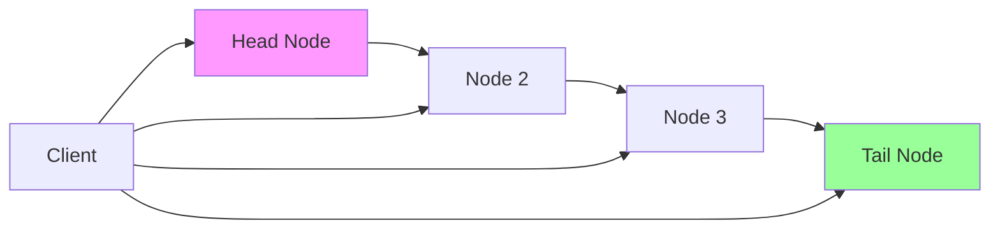

```yaml
Write Path: Client ’ Head ’ ... ’ Tail ’ Ack
Read Path: Client ’ Any Node (with version checking)
Performance: Read scale-out + write consistency
Complexity: Version vector management
```

#### 3. Blockchain-Inspired Consensus

**Proof-of-Stake Evolution**:
```yaml
# Ethereum 2.0 Consensus (Gasper)
finality_mechanism: Casper FFG
fork_choice: LMD GHOST
validator_count: ~500,000
stake_requirement: 32 ETH
slashing_conditions:
  - Double voting (same height, different blocks)
  - Surround voting (violating finality)
  
economics:
  - Rewards: ~5% APY for honest validators
  - Penalties: Up to entire stake for attacks
  - Capital_requirement: $50,000+ per validator
```

**Delegated Proof-of-Stake**:
```yaml
# EOS-style consensus
validators: 21 elected block producers
election: Token holder voting
block_time: 0.5 seconds
throughput: ~4,000 transactions/second

trade_offs:
  + High performance
  + Energy efficient
  - More centralized
  - Political/economic attacks possible
```

### Quantum-Resistant Consensus

#### The Quantum Threat

```yaml
threat_timeline:
  2030: ~50% chance of cryptographically relevant quantum computer
  2035: ~80% chance
  2040: Nearly certain

vulnerable_algorithms:
  - RSA: Factoring with Shor's algorithm
  - ECDSA: Discrete log with modified Shor's
  - Current blockchain signatures: All broken

resistant_algorithms:
  - Lattice-based: CRYSTALS-Dilithium
  - Hash-based: SPHINCS+
  - Code-based: Classic McEliece
```

#### Post-Quantum Consensus Design

```python
# Quantum-resistant consensus signatures
class PostQuantumConsensus:
    def __init__(self):
        # Use quantum-resistant signature scheme
        self.signature_scheme = CRYSTALS_Dilithium()
        self.hash_function = SHA3_256()  # Quantum-resistant
        
    def sign_proposal(self, proposal, private_key):
        # Larger signatures (3KB vs 64 bytes for ECDSA)
        message_hash = self.hash_function(proposal)
        signature = self.signature_scheme.sign(message_hash, private_key)
        return signature
    
    def verify_signatures(self, proposal, signatures, public_keys):
        # Slower verification (100x slower than ECDSA)
        message_hash = self.hash_function(proposal)
        
        valid_count = 0
        for sig, pubkey in zip(signatures, public_keys):
            if self.signature_scheme.verify(message_hash, sig, pubkey):
                valid_count += 1
                
        return valid_count >= self.quorum_size
```

**Implications**:
- **Larger messages**: Signatures 50x bigger
- **Slower verification**: 100x more CPU time
- **Network overhead**: Higher bandwidth requirements
- **Storage costs**: Larger ledgers and logs

### Edge Computing Consensus

#### Hierarchical Consensus

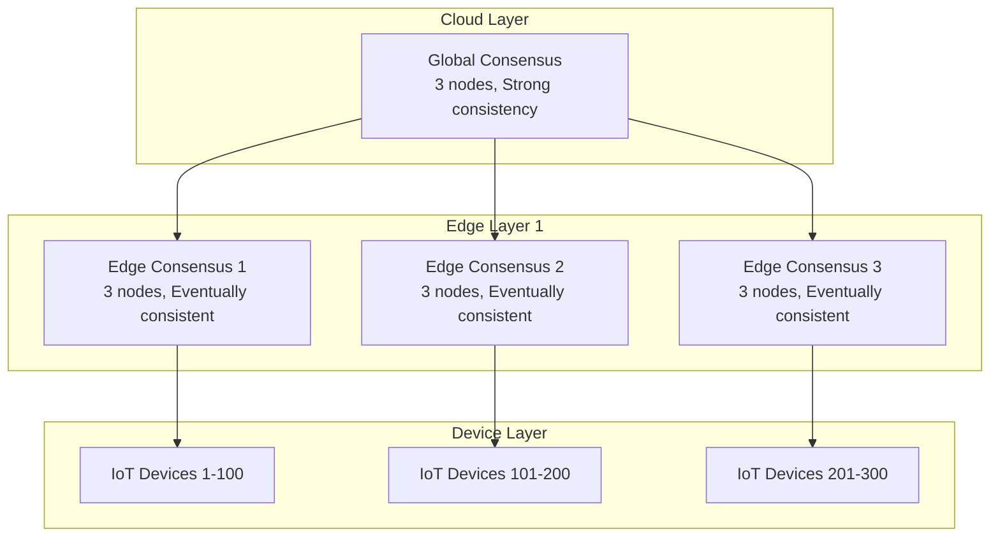

**Use Cases**:
- **Autonomous vehicles**: Local coordination + global updates
- **Smart cities**: District-level consensus + city-wide coordination
- **Industrial IoT**: Factory floor + enterprise systems

#### Lightweight Consensus for IoT

```python
# Resource-constrained consensus
class MicroRaft:
    def __init__(self, max_memory_kb=64, max_cpu_percent=10):
        self.max_memory = max_memory_kb * 1024
        self.cpu_budget = max_cpu_percent
        
        # Ultra-compact log
        self.log = CircularBuffer(max_entries=100)
        
        # Simplified state machine
        self.state = "follower"  # follower, candidate, leader
        self.term = 0
        self.voted_for = None
        
    def handle_append_entries(self, msg):
        # Minimal processing for IoT devices
        if msg.term >= self.term:
            self.term = msg.term
            self.state = "follower"
            return {"success": True}
        return {"success": False}
        
    def heartbeat(self):
        # Low-power heartbeat mechanism
        if self.is_leader():
            # Send minimal heartbeat
            msg = {"type": "heartbeat", "term": self.term}
            self.broadcast_low_power(msg)
```

### AI-Driven Consensus Optimization

#### Adaptive Consensus Parameters

```python
# ML-optimized consensus tuning
class AdaptiveRaft:
    def __init__(self):
        self.ml_model = self.load_consensus_optimizer()
        self.metrics_buffer = collections.deque(maxlen=1000)
        
    def optimize_parameters(self):
        # Current performance metrics
        features = self.extract_features()
        
        # ML prediction for optimal parameters
        optimal_params = self.ml_model.predict(features)
        
        # Apply with safety bounds
        self.apply_safe_parameters(optimal_params)
    
    def extract_features(self):
        recent_metrics = list(self.metrics_buffer)[-100:]
        
        return {
            'avg_latency': np.mean([m.latency for m in recent_metrics]),
            'throughput': len(recent_metrics) / 100,  # ops per metric
            'network_rtt': self.measure_network_rtt(),
            'cpu_usage': psutil.cpu_percent(),
            'memory_usage': psutil.virtual_memory().percent,
            'disk_io_wait': self.get_disk_io_wait(),
            'time_of_day': datetime.now().hour,
            'day_of_week': datetime.now().weekday()
        }
    
    def apply_safe_parameters(self, params):
        # Safety bounds to prevent instability
        election_timeout = max(150, min(300, params['election_timeout']))
        heartbeat_interval = max(50, min(100, params['heartbeat_interval']))
        batch_size = max(1, min(1000, params['batch_size']))
        
        self.update_configuration({
            'election_timeout': election_timeout,
            'heartbeat_interval': heartbeat_interval, 
            'batch_size': batch_size
        })
```

#### Predictive Failure Detection

```python
# AI-powered consensus failure prediction
class ConsensusFailurePredictor:
    def __init__(self):
        self.anomaly_detector = IsolationForest()
        self.time_series_model = LSTM()
        
    def predict_failures(self, metrics_stream):
        # Real-time anomaly detection
        anomaly_score = self.anomaly_detector.decision_function([metrics_stream])
        
        # Time series prediction
        future_metrics = self.time_series_model.predict(metrics_stream)
        
        # Combine signals
        failure_probability = self.combine_predictions(
            anomaly_score, future_metrics
        )
        
        if failure_probability > 0.8:
            self.trigger_preemptive_actions()
    
    def trigger_preemptive_actions(self):
        # Take action before failure occurs
        actions = [
            self.increase_heartbeat_frequency,
            self.reduce_batch_sizes,
            self.prepare_backup_leader,
            self.alert_operations_team
        ]
        
        for action in actions:
            action()
```

### The Consensus Singularity

**The Ultimate Vision**: Self-healing, self-optimizing distributed systems.

```python
# Autonomous consensus system
class AutonomousConsensus:
    """
    A consensus system that:
    - Detects and prevents failures before they occur
    - Optimizes its own parameters in real-time
    - Adapts to changing network conditions
    - Recovers from failures without human intervention
    - Evolves its algorithms over time
    """
    
    def __init__(self):
        self.core_consensus = MultiAlgorithmConsensus([
            RaftAlgorithm(),
            PBFTAlgorithm(), 
            EPaxosAlgorithm()
        ])
        
        self.ai_controller = ConsensusAI()
        self.self_diagnosis = FailurePrediction()
        self.auto_recovery = RecoveryAutomation()
        
    def run_forever(self):
        while True:
            # Monitor system health
            health_metrics = self.collect_comprehensive_metrics()
            
            # Predict and prevent failures
            if self.self_diagnosis.failure_imminent(health_metrics):
                self.auto_recovery.preemptive_action()
            
            # Optimize for current conditions
            optimal_algorithm = self.ai_controller.select_best_algorithm(
                network_conditions=self.measure_network(),
                load_pattern=self.analyze_load(),
                failure_probability=self.estimate_failure_risk()
            )
            
            self.core_consensus.switch_algorithm(optimal_algorithm)
            
            # Learn and evolve
            self.ai_controller.learn_from_experience()
            
            time.sleep(self.adaptive_monitoring_interval())
```

---

## Conclusion: The Eternal Challenge

### What We've Learned

**Consensus is the heart of distributed systems**. Without the ability to agree on a single version of truth, we have chaos. But achieving consensus is fundamentally hard:

1. **Perfect consensus is impossible** (FLP Theorem)
2. **Practical consensus requires trade-offs** (CAP Theorem)
3. **Byzantine faults make everything harder** (3f+1 requirement)
4. **Performance and consistency are always in tension**

### The Core Patterns

**Every consensus system follows these patterns**:

1. **Leader Election**: Someone must coordinate
2. **Log Replication**: Decisions must be durable  
3. **Majority Voting**: Quorums prevent split-brain
4. **Heartbeats**: Detect failures quickly
5. **Recovery**: Handle inevitable failures gracefully

### Production Lessons

**From the trenches**:

- **Monitor everything**: Elections, latency, replication lag
- **Test failures constantly**: Chaos engineering is mandatory
- **Plan for disasters**: Split-brain will happen
- **Understand your trade-offs**: AP vs CP isn't just theory
- **Keep humans in the loop**: Autonomous systems still need operators

### The Future is Distributed

**Consensus will only become more important**:

- **Edge computing**: Consensus at the network edge
- **Quantum resistance**: New cryptographic foundations
- **AI optimization**: Self-tuning consensus systems
- **Blockchain evolution**: New economic consensus models

### Final Thoughts

The $12 million MongoDB split-brain we started with? It was preventable. Not through better technology, but through better understanding.

**Consensus isn't just an algorithmit's a discipline**. It requires:
- Deep technical knowledge
- Rigorous operational practices  
- Constant vigilance against failure
- Humility in the face of distributed systems complexity

The next time your system needs to agree on somethingwhether it's electing a leader, committing a transaction, or coordinating a deploymentremember the fundamental challenge you're facing.

You're asking a bunch of computers, connected by unreliable networks, running software with bugs, to agree on a single version of reality.

That's not just hard. **It's miraculous when it works.**

---

## Additional Resources

### Essential Papers
- **"Impossibility of Distributed Consensus with One Faulty Process"** - Fischer, Lynch, Paterson (1985)
- **"The Byzantine Generals Problem"** - Lamport, Shostak, Pease (1982)  
- **"In Search of an Understandable Consensus Algorithm"** - Ongaro, Ousterhout (2013)
- **"Practical Byzantine Fault Tolerance"** - Castro, Liskov (1999)

### Production Systems Documentation
- **etcd**: https://etcd.io/docs/
- **Apache Kafka**: https://kafka.apache.org/documentation/
- **CockroachDB**: https://www.cockroachlabs.com/docs/
- **Consul**: https://www.consul.io/docs/

### Tools and Libraries
- **Raft implementations**: etcd/raft (Go), hashicorp/raft (Go), tikv/raft-rs (Rust)
- **Testing frameworks**: Jepsen, FoundationDB's simulation testing
- **Monitoring**: Prometheus metrics, Grafana dashboards

---

*"In distributed systems, the only thing harder than consensus is explaining why consensus is hard."*

**Total Runtime: 2 hours 30 minutes**
**Next Episode: State Management - The consistency spectrum from eventual to strong**