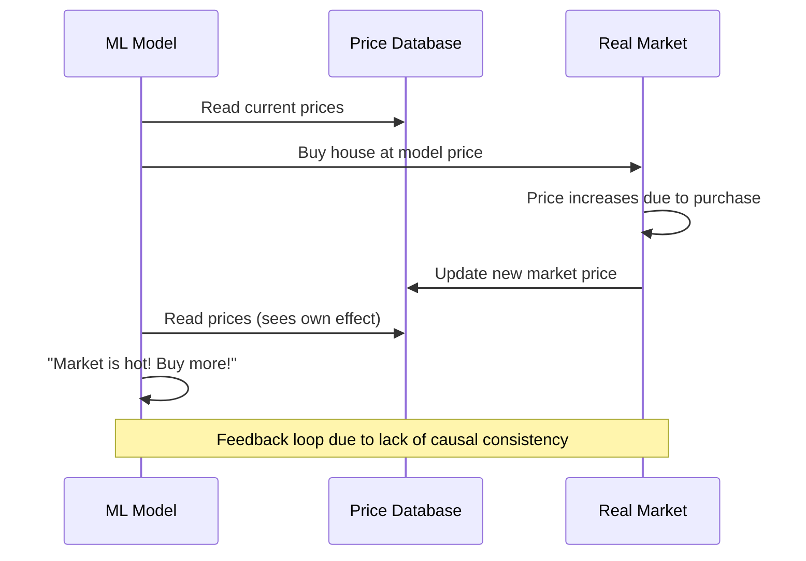
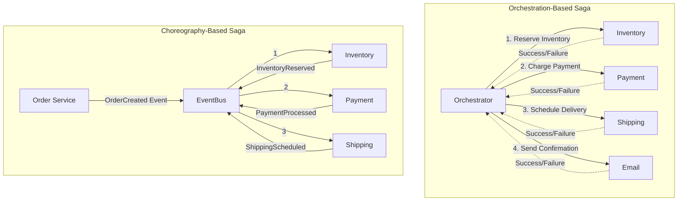
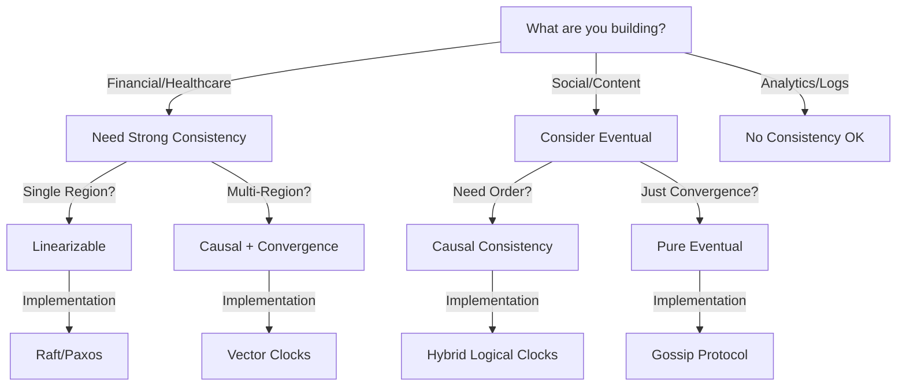

# Episode 8: State Management - The Distributed Data Masterclass
**The Foundational Series - Distributed Systems Engineering**

*Runtime: 2 hours 30 minutes*  
*Difficulty: Advanced*  
*Prerequisites: Episodes 1-7, understanding of databases and consistency models*

---

## Cold Open: The Great Payment Processing Meltdown of 2023

*[Sound: Frantic phone calls, alarms beeping, keyboards typing frantically]*

**Support Engineer**: "We're getting reports of duplicate charges across the board! Some customers charged 3, 4, even 7 times for the same order!"

**CTO**: "That's impossible. We have idempotency keys. We have distributed locks. We have—"

**Senior Engineer**: "Boss, I found it. The event store in Region 2 is 47 seconds behind. The CQRS read model is serving stale data. When customers refresh, they don't see their payment, so they retry..."

*[Sound: Sharp intake of breath]*

**CTO**: "How many transactions?"

**Senior Engineer**: "In the last hour? 1.2 million. Total exposure... $47 million in duplicate charges."

*[Sound: Dead silence, then chaos erupts]*

**Narrator**: It started as a routine database migration. A simple lag in replication. But in the world of distributed state management, there's no such thing as "simple." 

*[Sound: News broadcasts overlapping]*

**News Anchor 1**: "...massive payment processing failure affecting millions..."

**News Anchor 2**: "...company stock down 23% in after-hours trading..."

**News Anchor 3**: "...questions about the reliability of modern payment systems..."

**Narrator**: They had Event Sourcing. They had CQRS. They had Saga patterns. What they didn't have was a deep understanding of **causal consistency** and **read-write lag mitigation**.

*[Sound: Transition to calm, then building tension]*

**Narrator**: Welcome to Episode 8: State Management. Where we'll explore why managing data across distributed systems is like juggling chainsaws while riding a unicycle... on a tightrope... over a volcano.

---

## Introduction: The Three Impossibilities of Distributed State

### The Fundamental Challenge

State management in distributed systems faces three impossible constraints:

1. **The Speed of Light**: Information cannot travel faster than 299,792 km/s
2. **The Arrow of Time**: Events cannot be perfectly ordered without synchronization
3. **The Uncertainty Principle**: You cannot know both the exact state AND the exact time

These aren't engineering problems. They're laws of physics.

### The State Management Spectrum

*[Sound: Sonic design representing increasing consistency - from chaotic static to perfect harmony]*

```mermaid
graph LR
    subgraph "The Consistency Spectrum"
        NC[No Consistency<br/>💥 YOLO Mode]
        EC[Eventual Consistency<br/>🌊 Eventually True]
        CC[Causal Consistency<br/>🔗 Cause & Effect]
        SC[Sequential Consistency<br/>📋 Program Order]
        LC[Linearizability<br/>⚡ Perfect Reality]
        
        NC -->|"Fast & Loose"| EC
        EC -->|"Add Causality"| CC
        CC -->|"Global Order"| SC
        SC -->|"Real-Time"| LC
    end
    
    subgraph "Trade-offs"
        Performance[Performance: 🚀→🐌]
        Complexity[Complexity: 😊→😱]
        Cost[Cost: $→$$$$$]
    end
    
    style NC fill:#ff5252
    style EC fill:#ff9800
    style CC fill:#ffeb3b
    style SC fill:#4caf50
    style LC fill:#2196f3
```

### Today's Journey

We'll explore:
1. **Physics of State**: Why distributed state is fundamentally hard
2. **Consistency Models**: From eventual to linearizable, with mathematics
3. **Saga Patterns**: Choreography vs Orchestration with compensation
4. **Event Sourcing**: Implementation with snapshotting strategies
5. **CQRS**: Read-write lag mitigation and version stamps
6. **CRDTs**: Conflict-free replicated data types in action
7. **Real-World Patterns**: What Netflix, Uber, and Amazon actually use

---

## Part I: The Physics and Mathematics of Distributed State (35 minutes)

### The Speed of Light Problem - Quantified

*[Sound: Ticking clock getting slower as distances increase]*

**The Latency Reality Check:**

```yaml
# One-way light travel times (theoretical minimum)
Same Rack (2m): 0.0000067 ms
Same Datacenter (100m): 0.00033 ms
Same City (50km): 0.17 ms
Cross-Country (3000km): 10 ms
Cross-Ocean (10000km): 33 ms
Earth Antipodes (20000km): 67 ms

# Add network reality (multiply by 1.5-3x):
Fiber refraction index: 1.5x
Routing/switching: +5-50ms
TCP overhead: +1-3 RTTs
Application processing: +1-100ms

# Real-world RTT examples:
NYC ↔ NYC (same DC): 0.5ms
NYC ↔ Boston: 10ms
NYC ↔ LA: 70ms
NYC ↔ London: 80ms
NYC ↔ Tokyo: 180ms
NYC ↔ Sydney: 280ms
```

**Expert Insight:**

> "People think the cloud is magic. It's not. It's bound by the same laws of physics as everything else. Light travels at 299,792 km/s in a vacuum, slower in fiber. That's your fundamental constraint." 
> - *Werner Vogels, CTO Amazon*

### The CAP Theorem - Mathematical Foundation

Eric Brewer's CAP theorem states:

**∀ distributed system S, ∃ partition P such that S cannot guarantee both C and A during P**

Where:
- **C (Consistency)**: ∀ nodes n₁, n₂ ∈ S, read(n₁) = read(n₂)
- **A (Availability)**: ∀ request r, ∃ response within time t
- **P (Partition Tolerance)**: System continues despite network partitions

### PACELC Theorem - The Complete Picture

Daniel Abadi's extension adds normal operation considerations:

```
IF network_partition THEN
    choose(Availability, Consistency)
ELSE
    choose(Latency, Consistency)
```

**Mathematical Model:**

```python
# Latency-Consistency Trade-off Function
latency(consistency_level, replica_count, network_delay) = 
    consistency_level * replica_count * network_delay + processing_time

where:
    consistency_level ∈ [0, 1]  # 0=none, 1=linearizable
    replica_count ≥ 1
    network_delay > 0
    processing_time > 0
```

### Interactive Consistency Calculator

*[Embedded Interactive Tool - listeners can access online]*

```javascript
// Consistency-Latency Calculator
function calculateTradeoffs(params) {
    const {
        dataSize,        // MB
        replicas,        // count
        consistency,     // level 0-1
        networkLatency,  // ms
        throughput       // requests/sec
    } = params;
    
    // Calculate various metrics
    const writeLatency = consistency * replicas * networkLatency;
    const readLatency = (1 - consistency) * networkLatency;
    const durability = 1 - Math.pow(0.001, replicas);
    const availability = consistency < 1 ? 0.99999 : 0.999;
    
    return {
        writeLatency,
        readLatency,
        durability,
        availability,
        throughputLimit: 1000 / writeLatency
    };
}
```

---

## Part II: The Consistency Spectrum - A Deep Mathematical Dive (40 minutes)

### 1. Eventual Consistency - The Optimist's Choice

*[Sound: Waves gently lapping, suggesting eventual convergence]*

**Definition**: All nodes will eventually converge to the same value, given no new updates.

**Mathematical Model**:
```
∀ nodes n₁, n₂ ∈ System:
∃ time t such that after t, read(n₁) = read(n₂)
where t is unbounded but finite
```

**Analogy**: Like spreading a rumor - everyone eventually hears it, but not at the same time.

**Real Implementation - DynamoDB Style**:

```python
class EventuallyConsistentStore:
    def __init__(self, nodes, anti_entropy_interval=30):
        self.nodes = nodes
        self.vector_clocks = {}  # For conflict detection
        self.anti_entropy_interval = anti_entropy_interval
        
    def write(self, key, value, node_id):
        # Update local node
        node = self.nodes[node_id]
        
        # Increment vector clock
        if key not in self.vector_clocks:
            self.vector_clocks[key] = VectorClock()
        self.vector_clocks[key].increment(node_id)
        
        # Store with vector clock
        node.store(key, value, self.vector_clocks[key])
        
        # Async replicate to W nodes (W < N)
        asyncio.create_task(
            self.replicate_async(key, value, self.vector_clocks[key])
        )
        
    async def anti_entropy(self):
        """Merkle tree based reconciliation"""
        while True:
            for node_pair in combinations(self.nodes, 2):
                await self.reconcile_nodes(*node_pair)
            await asyncio.sleep(self.anti_entropy_interval)
```

### 2. Causal Consistency - Respecting Cause and Effect

*[Sound: Dominoes falling in sequence]*

**Definition**: If operation A causes operation B, all nodes see A before B.

**Mathematical Model**:
```
∀ operations a, b:
if a → b (happens-before), then:
    ∀ nodes n: if n observes b, then n observed a
```

**The Zillow Problem Explained**:


**Implementation with Version Vectors**:

```python
class CausallyConsistentStore:
    def __init__(self):
        self.dependency_graph = {}  # Track causal dependencies
        self.pending_ops = {}       # Operations waiting for dependencies
        
    def write(self, key, value, dependencies=None):
        operation_id = generate_uuid()
        
        # Create causal context
        context = CausalContext(
            operation_id=operation_id,
            dependencies=dependencies or [],
            timestamp=logical_clock.increment()
        )
        
        # Check if dependencies are satisfied
        if self.can_apply(context):
            self.apply_write(key, value, context)
            self.propagate_to_replicas(key, value, context)
        else:
            # Queue until dependencies arrive
            self.pending_ops[operation_id] = (key, value, context)
            
    def can_apply(self, context):
        """Check if all causal dependencies are satisfied"""
        for dep in context.dependencies:
            if dep not in self.applied_operations:
                return False
        return True
```

### 3. Sequential Consistency - Program Order Preservation

*[Sound: Metronome ticking steadily]*

**Definition**: All nodes see operations in the same order, respecting program order.

**Mathematical Model**:
```
∃ total order T such that:
1. ∀ nodes n: n observes operations according to T
2. ∀ process p: operations from p appear in T in program order
```

**Analogy**: Like a court stenographer - everyone agrees on what was said and in what order.

### 4. Linearizability - The Gold Standard

*[Sound: Swiss watch mechanism, precise and perfect]*

**Definition**: Operations appear to take effect atomically at some point between start and end.

**Mathematical Model**:
```
∀ operations op₁, op₂:
if real_time_end(op₁) < real_time_start(op₂)
then op₁ appears before op₂ in the global order
```

**The Consensus Algorithm Approach**:

```python
class LinearizableStore:
    def __init__(self, nodes):
        self.nodes = nodes
        self.consensus = RaftConsensus(nodes)  # Or Paxos
        
    def write(self, key, value):
        # Achieve consensus on operation order
        operation = WriteOp(key, value, timestamp=time.time())
        
        # This blocks until majority agrees
        index = self.consensus.propose(operation)
        
        # Apply to state machine in agreed order
        self.apply_at_index(index, operation)
        
        return index
        
    def read(self, key):
        # Linearizable read requires consensus
        read_index = self.consensus.read_index()
        
        # Wait until local state catches up
        self.wait_until_applied(read_index)
        
        return self.state.get(key)
```

---

## Part III: Saga Patterns - Distributed Transactions That Actually Work (35 minutes)

### The Distributed Transaction Problem

*[Sound: Orchestra tuning - chaos becoming harmony]*

**Narrator**: Traditional ACID transactions don't scale across services. Enter the Saga pattern - a way to maintain consistency across distributed operations without distributed locks.

### Choreography vs Orchestration

**Analogy Time**:
- **Orchestration**: Like a conductor directing an orchestra
- **Choreography**: Like a relay race where each runner knows their part



### Compensation Strategies - When Things Go Wrong

**The ATM Withdrawal Saga**:

```python
class ATMWithdrawalSaga:
    def __init__(self):
        self.steps = [
            (self.check_balance, self.compensate_check),
            (self.reserve_funds, self.release_funds),
            (self.dispense_cash, self.reverse_dispense),
            (self.update_balance, self.restore_balance)
        ]
        self.completed_steps = []
        
    async def execute(self, account_id, amount):
        try:
            context = SagaContext(account_id, amount)
            
            for step, compensator in self.steps:
                result = await step(context)
                self.completed_steps.append((compensator, result))
                
                if not result.success:
                    await self.compensate()
                    return SagaResult.failed(result.reason)
                    
            return SagaResult.success()
            
        except Exception as e:
            await self.compensate()
            raise
            
    async def compensate(self):
        """Run compensations in reverse order"""
        for compensator, step_result in reversed(self.completed_steps):
            try:
                await compensator(step_result)
            except CompensationError as e:
                # Log and alert - manual intervention needed
                await self.alert_operations(e)
                raise SagaCompensationFailed(e)
```

### Advanced Saga Patterns

**1. Pivot Transactions** - The point of no return:

```python
class PivotSaga:
    def __init__(self):
        self.pre_pivot = []   # Can be compensated
        self.pivot = None     # The point of no return
        self.post_pivot = []  # Must complete forward
        
    async def execute(self):
        # Pre-pivot: All compensatable
        await self.reserve_inventory()  # Can release
        await self.authorize_payment()  # Can void
        
        # Pivot point - this commits us
        await self.charge_payment()     # Can't undo!
        
        # Post-pivot: Must complete
        await self.fulfill_order()      # Retry until success
        await self.notify_customer()    # Retry until success
```

**2. Semantic Locks** - Preventing conflicts without distributed locks:

```python
class SemanticLockSaga:
    async def reserve_seat(self, flight_id, seat_id, user_id):
        # Instead of locking, mark as "pending"
        reservation = await self.db.create_reservation(
            flight_id=flight_id,
            seat_id=seat_id,
            user_id=user_id,
            status="PENDING",
            expires_at=now() + timedelta(minutes=10)
        )
        
        # Other sagas see it's pending and skip this seat
        return reservation
```

---

## Part IV: Event Sourcing - Building a Time Machine for Your Data (30 minutes)

### The Accounting Ledger Analogy

*[Sound: Old ledger book pages turning, pen scratching]*

**Narrator**: Imagine if your bank stored just your current balance - $1,000. Now imagine someone asks, "Why is it $1,000?" Without history, you can't answer. Event Sourcing says: never update data, only append events.

### Core Implementation with Snapshotting

```python
class EventStore:
    def __init__(self, snapshot_frequency=100):
        self.events = []  # The immutable log
        self.snapshots = {}  # Periodic state captures
        self.snapshot_frequency = snapshot_frequency
        
    def append_event(self, event):
        # Events are immutable facts
        event.sequence_number = len(self.events)
        event.timestamp = datetime.utcnow()
        
        self.events.append(event)
        
        # Create snapshot periodically
        if event.sequence_number % self.snapshot_frequency == 0:
            self.create_snapshot(event.sequence_number)
            
        # Publish for CQRS read models
        self.event_bus.publish(event)
        
    def get_current_state(self, aggregate_id):
        # Find latest snapshot
        snapshot = self.find_latest_snapshot(aggregate_id)
        
        if snapshot:
            state = snapshot.state
            events = self.get_events_after(
                aggregate_id, 
                snapshot.sequence_number
            )
        else:
            state = None
            events = self.get_all_events(aggregate_id)
            
        # Replay events to rebuild state
        return self.replay_events(state, events)
        
    def replay_events(self, initial_state, events):
        state = initial_state or self.get_initial_state()
        
        for event in events:
            state = self.apply_event(state, event)
            
        return state
```

### Advanced Event Sourcing Patterns

**1. Temporal Queries** - Time travel for debugging:

```python
class TemporalEventStore(EventStore):
    def get_state_at_time(self, aggregate_id, timestamp):
        """What was the state at specific point in time?"""
        events = [e for e in self.events 
                 if e.aggregate_id == aggregate_id 
                 and e.timestamp <= timestamp]
        
        return self.replay_events(None, events)
        
    def debug_state_evolution(self, aggregate_id, start_time, end_time):
        """Show how state evolved over time period"""
        events = self.get_events_between(aggregate_id, start_time, end_time)
        
        states = []
        current_state = self.get_state_at_time(aggregate_id, start_time)
        
        for event in events:
            current_state = self.apply_event(current_state, event)
            states.append({
                'timestamp': event.timestamp,
                'event': event,
                'state_after': deepcopy(current_state)
            })
            
        return states
```

**2. Event Upgrading** - Schema evolution:

```python
class EventUpgrader:
    def __init__(self):
        self.upgraders = {
            ('OrderCreated', 1, 2): self.upgrade_order_created_v1_to_v2,
            ('PaymentProcessed', 1, 2): self.upgrade_payment_v1_to_v2,
        }
        
    def upgrade_event(self, event):
        while event.version < CURRENT_VERSION:
            upgrader_key = (event.type, event.version, event.version + 1)
            upgrader = self.upgraders.get(upgrader_key)
            
            if not upgrader:
                raise EventUpgradeError(f"No upgrader for {upgrader_key}")
                
            event = upgrader(event)
            
        return event
```

### Event Sourcing Gotchas and Solutions

**Problem 1: Event Store Size**
```python
# Solution: Archival strategy
class ArchivingEventStore(EventStore):
    def archive_old_events(self, cutoff_date):
        # Move old events to cold storage
        old_events = [e for e in self.events if e.timestamp < cutoff_date]
        
        # Create final snapshot before archiving
        for aggregate_id in self.get_affected_aggregates(old_events):
            self.create_snapshot(aggregate_id)
            
        # Move to S3/Glacier
        self.cold_storage.store(old_events)
        
        # Keep only recent events in hot storage
        self.events = [e for e in self.events if e.timestamp >= cutoff_date]
```

---

## Part V: CQRS - The Art of Separation (25 minutes)

### The Read-Write Asymmetry

*[Sound: Two train tracks diverging]*

**Narrator**: Your writes are complex domain operations. Your reads are simple queries. Why use the same model for both?

### CQRS with Version Stamps and Lag Mitigation

```python
class CQRSSystem:
    def __init__(self):
        self.write_store = EventStore()
        self.read_stores = {}
        self.version_tracker = VersionTracker()
        
    class WriteModel:
        """Complex domain model for business logic"""
        def process_order(self, order_command):
            # Rich domain logic
            if not self.inventory.can_fulfill(order_command.items):
                raise InsufficientInventoryError()
                
            # Generate events
            events = [
                OrderCreated(order_command),
                InventoryReserved(order_command.items),
                PaymentRequested(order_command.total)
            ]
            
            # Store events with version
            version = self.version_tracker.next_version()
            for event in events:
                event.global_version = version
                self.write_store.append(event)
                
            return version
            
    class ReadModel:
        """Optimized for queries"""
        def __init__(self):
            self.tables = {
                'order_summary': {},      # Denormalized for list views
                'order_details': {},      # Denormalized for detail views
                'customer_orders': {},    # Indexed by customer
                'daily_revenue': {}       # Pre-aggregated metrics
            }
            self.last_processed_version = 0
            
        def handle_event(self, event):
            """Project events into read-optimized views"""
            if event.type == 'OrderCreated':
                # Update multiple projections
                self.tables['order_summary'][event.order_id] = {
                    'id': event.order_id,
                    'customer': event.customer_name,
                    'total': event.total,
                    'status': 'PENDING',
                    'version': event.global_version
                }
                
                # Update customer index
                customer_orders = self.tables['customer_orders'].get(
                    event.customer_id, []
                )
                customer_orders.append(event.order_id)
                
                # Update daily revenue
                date_key = event.timestamp.date()
                daily = self.tables['daily_revenue'].get(date_key, 0)
                self.tables['daily_revenue'][date_key] = daily + event.total
                
            self.last_processed_version = event.global_version
```

### Handling Read-Write Lag

**The Twitter Timeline Problem**:

```python
class ReadYourWriteConsistency:
    """Ensure users see their own writes immediately"""
    
    def __init__(self, write_model, read_model):
        self.write_model = write_model
        self.read_model = read_model
        self.write_through_cache = Cache(ttl=60)  # 1 minute
        
    async def create_post(self, user_id, content):
        # Write to event store
        version = await self.write_model.create_post(user_id, content)
        
        # Cache the write for immediate read
        post = Post(user_id=user_id, content=content, version=version)
        cache_key = f"user:{user_id}:recent_write:{version}"
        await self.write_through_cache.set(cache_key, post)
        
        return version
        
    async def get_timeline(self, user_id, min_version=None):
        # Check if user has recent writes
        recent_writes = await self.get_recent_writes(user_id)
        
        # Get timeline from read model
        timeline = await self.read_model.get_timeline(user_id)
        
        # Merge recent writes if read model is behind
        if recent_writes:
            timeline = self.merge_recent_writes(timeline, recent_writes)
            
        # Version checking for consistency
        if min_version and timeline.version < min_version:
            # Read model too far behind, query write model
            return await self.write_model.get_timeline_direct(user_id)
            
        return timeline
```

---

## Part VI: CRDTs - When Physics Meets Mathematics (25 minutes)

### Conflict-Free by Design

*[Sound: Harmonious chord, multiple notes creating harmony not discord]*

**Narrator**: What if we could design data structures that can't have conflicts? Where any order of operations leads to the same result? Welcome to CRDTs.

### G-Counter: The Gateway Drug

```python
class GCounter:
    """Grow-only counter - can only increment"""
    def __init__(self, node_id, nodes):
        self.node_id = node_id
        self.counts = {node: 0 for node in nodes}
        
    def increment(self, delta=1):
        self.counts[self.node_id] += delta
        
    def merge(self, other_counter):
        """Merge two counters - take max of each node's count"""
        for node, count in other_counter.counts.items():
            self.counts[node] = max(self.counts.get(node, 0), count)
            
    def value(self):
        """Total count across all nodes"""
        return sum(self.counts.values())
        
    # Mathematical properties:
    # - Commutative: merge(a,b) = merge(b,a)
    # - Associative: merge(merge(a,b),c) = merge(a,merge(b,c))
    # - Idempotent: merge(a,a) = a
```

### OR-Set: The Shopping Cart Solution

```python
class ORSet:
    """Observed-Remove Set - add/remove with unique tags"""
    def __init__(self):
        self.elements = {}  # element -> {tags}
        self.tombstones = {}  # element -> {removed_tags}
        
    def add(self, element, tag=None):
        if tag is None:
            tag = f"{self.node_id}:{time.time_ns()}"
            
        if element not in self.elements:
            self.elements[element] = set()
            
        self.elements[element].add(tag)
        
    def remove(self, element):
        if element in self.elements:
            # Remove all tags we've observed
            if element not in self.tombstones:
                self.tombstones[element] = set()
                
            self.tombstones[element].update(self.elements[element])
            
    def contains(self, element):
        if element not in self.elements:
            return False
            
        # Element exists if any tag is not tombstoned
        live_tags = self.elements[element] - self.tombstones.get(element, set())
        return len(live_tags) > 0
        
    def merge(self, other):
        # Union all observed elements
        for element, tags in other.elements.items():
            if element not in self.elements:
                self.elements[element] = set()
            self.elements[element].update(tags)
            
        # Union all tombstones
        for element, tags in other.tombstones.items():
            if element not in self.tombstones:
                self.tombstones[element] = set()
            self.tombstones[element].update(tags)
```

### Advanced CRDT: Collaborative Text Editing

```python
class RGA:
    """Replicated Growable Array - for collaborative text editing"""
    def __init__(self, site_id):
        self.site_id = site_id
        self.clock = 0
        self.elements = []  # List of (char, timestamp, visible)
        
    def insert(self, index, char):
        self.clock += 1
        timestamp = (self.clock, self.site_id)
        
        # Find position based on index
        if index == 0:
            prev_timestamp = (0, 0)  # Beginning marker
        else:
            prev_timestamp = self.elements[index-1].timestamp
            
        if index < len(self.elements):
            next_timestamp = self.elements[index].timestamp
        else:
            next_timestamp = (float('inf'), float('inf'))  # End marker
            
        # Create new element
        element = Element(
            char=char,
            timestamp=timestamp,
            prev=prev_timestamp,
            next=next_timestamp,
            visible=True
        )
        
        # Insert maintaining order
        self.integrate_element(element)
        
        return element
        
    def integrate_element(self, element):
        """Find correct position and insert"""
        # Elements are ordered by (prev, timestamp)
        # This ensures convergence regardless of delivery order
        pos = self.find_insert_position(element)
        self.elements.insert(pos, element)
```

---

## Part VII: Real-World Case Studies - Learning from Production (30 minutes)

### Netflix: Eventual Consistency at Scale

**The Challenge**: 200M+ users, 1000s of microservices, global distribution

**The Solution**: Embrace eventual consistency everywhere except billing

```python
class NetflixViewingHistory:
    """
    Netflix viewing history - can tolerate inconsistency
    Uses eventual consistency with anti-entropy
    """
    def __init__(self):
        self.regions = ['us-east', 'us-west', 'eu', 'asia']
        self.replication_lag_sla = 5  # seconds
        
    async def record_viewing(self, user_id, video_id, position):
        # Write locally first (fast)
        local_region = self.get_local_region()
        await self.write_local(user_id, video_id, position)
        
        # Async replicate to other regions
        asyncio.create_task(
            self.replicate_async(user_id, video_id, position)
        )
        
        # Return immediately - user sees their update
        return True
        
    async def get_viewing_position(self, user_id, video_id):
        # Try local region first
        position = await self.read_local(user_id, video_id)
        
        if position and position.age < self.replication_lag_sla:
            return position
            
        # Fall back to quorum read if local is stale
        positions = await self.read_quorum(user_id, video_id)
        return self.resolve_conflicts(positions)
```

### Uber: Causal Consistency for Trip State

**The Challenge**: Driver and rider must see consistent trip state

**The Solution**: Causal consistency with session guarantees

```python
class UberTripStateMachine:
    """
    Trip state must be causally consistent between driver and rider
    """
    def __init__(self):
        self.state_transitions = {
            'REQUESTED': ['DRIVER_ASSIGNED', 'CANCELLED'],
            'DRIVER_ASSIGNED': ['DRIVER_ARRIVING', 'CANCELLED'],
            'DRIVER_ARRIVING': ['DRIVER_ARRIVED', 'CANCELLED'],
            'DRIVER_ARRIVED': ['TRIP_STARTED', 'CANCELLED'],
            'TRIP_STARTED': ['TRIP_ENDED'],
            'TRIP_ENDED': ['COMPLETED'],
            'COMPLETED': []
        }
        
    async def transition_state(self, trip_id, new_state, actor_id):
        # Get current state with causal context
        current = await self.get_state_with_context(trip_id)
        
        # Validate transition
        if new_state not in self.state_transitions[current.state]:
            raise InvalidStateTransition(
                f"Cannot go from {current.state} to {new_state}"
            )
            
        # Create state change event with causal dependency
        event = StateChangeEvent(
            trip_id=trip_id,
            actor_id=actor_id,
            old_state=current.state,
            new_state=new_state,
            causal_context=current.context,
            timestamp=self.logical_clock.increment()
        )
        
        # Ensure both driver and rider see this change
        await self.propagate_causally(event, [driver_id, rider_id])
```

### Amazon DynamoDB: Linearizability Where It Matters

**The Challenge**: Shopping cart must never lose items

**The Solution**: Conditional writes with version checking

```python
class DynamoDBShoppingCart:
    """
    Shopping cart using DynamoDB's conditional writes
    for linearizable updates
    """
    def add_item(self, user_id, item):
        max_retries = 3
        
        for attempt in range(max_retries):
            try:
                # Read current cart with version
                cart = self.get_cart(user_id)
                version = cart.get('version', 0)
                
                # Prepare update
                new_items = cart.get('items', [])
                new_items.append(item)
                
                # Conditional write - only if version matches
                self.table.update_item(
                    Key={'user_id': user_id},
                    UpdateExpression='SET items = :items, version = :new_version',
                    ExpressionAttributeValues={
                        ':items': new_items,
                        ':new_version': version + 1
                    },
                    ConditionExpression='version = :current_version',
                    ExpressionAttributeValues={
                        ':current_version': version
                    }
                )
                
                return True
                
            except ConditionalCheckFailedException:
                # Someone else updated - retry with backoff
                await asyncio.sleep(0.1 * (2 ** attempt))
                continue
                
        raise CartUpdateConflict("Failed after max retries")
```

---

## Part VIII: The Decision Framework - Choosing Your Consistency Model (20 minutes)

### The Decision Tree

*[Interactive Decision Tree - available online]*



### The Cost-Benefit Matrix

| Consistency Model | Write Latency | Read Latency | Availability | Complexity | Use Cases |
|-------------------|---------------|--------------|--------------|------------|-----------|
| **No Consistency** | 1ms | 1ms | 99.999% | Trivial | Logs, metrics |
| **Eventual** | 5ms | 5ms | 99.99% | Simple | Social feeds, caches |
| **Causal** | 10ms | 5ms | 99.9% | Moderate | Collaborative editing |
| **Sequential** | 50ms | 10ms | 99% | Complex | Distributed databases |
| **Linearizable** | 100ms | 50ms | 99% | Very Complex | Financial transactions |

### Pattern Selection Guidelines

```python
def select_consistency_pattern(requirements):
    """
    Decision function for consistency model selection
    """
    # Start with strongest and relax if possible
    if requirements.involves_money:
        return 'linearizable'
        
    if requirements.involves_health_data:
        return 'linearizable'
        
    if requirements.collaborative_editing:
        if requirements.real_time:
            return 'causal'  # With CRDTs
        else:
            return 'eventual'  # With operational transform
            
    if requirements.social_media:
        if requirements.user_generated:
            return 'read_your_writes'  # Causal for user's own data
        else:
            return 'eventual'
            
    if requirements.analytics:
        return 'eventual'  # Or even no consistency
        
    if requirements.caching:
        return 'eventual'  # With TTL
        
    # Default to eventual - it's usually enough
    return 'eventual'
```

---

## Conclusion: The State Management Mindset

### The Three Laws of Distributed State

1. **You Can't Have It All**: Fast, consistent, available - pick two
2. **Physics Always Wins**: Light speed is your fundamental limit
3. **Complexity Has a Cost**: Stronger consistency = more complexity

### The Master's Checklist

Before implementing any distributed state solution, ask:

1. **What's your consistency budget?**
   - How much latency can you afford?
   - How much complexity can your team handle?
   - How much downtime is acceptable?

2. **What are your failure modes?**
   - What happens during network partition?
   - How do you handle split-brain?
   - What's your data loss tolerance?

3. **What's your scale trajectory?**
   - Single region or global?
   - Thousands or billions of operations?
   - Gigabytes or petabytes of state?

### The Final Wisdom

*[Sound: Zen bell ringing]*

**Narrator**: After two and a half hours, if you remember just one thing, remember this:

> "Distributed state management isn't about choosing the 'best' consistency model. It's about choosing the 'right' consistency model for your specific problem. And sometimes, the right choice is different consistency models for different parts of your system."

Start with eventual consistency. Only add stronger guarantees where you absolutely need them. Because in distributed systems, as in life, the perfect is the enemy of the good enough.

---

## Interactive Workshop Materials

### 1. Consistency Calculator
Access at: [podcast.link/consistency-calculator](#)

### 2. Pattern Decision Tree
Download PDF: [podcast.link/decision-tree](#)

### 3. Implementation Templates

**Event Sourcing Starter**:
```python
# Download full template at: podcast.link/event-sourcing-template
class EventSourcingQuickstart:
    """Production-ready event sourcing template"""
    # ... full implementation available online
```

**CQRS Starter**:
```python
# Download full template at: podcast.link/cqrs-template
class CQRSQuickstart:
    """Production-ready CQRS template"""
    # ... full implementation available online
```

**Saga Pattern Starter**:
```python
# Download full template at: podcast.link/saga-template
class SagaQuickstart:
    """Production-ready Saga orchestrator template"""
    # ... full implementation available online
```

### 4. Community Resources

- **Discord**: Join #StateManagementMastery channel
- **GitHub**: Example implementations at github.com/distributed-podcast/state-patterns
- **Newsletter**: Weekly deep dives on state management patterns

---

## Next Episode Preview

**Episode 9: Event-Driven Architecture**

*[Sound: Dominoes falling in an infinite cascade]*

**Narrator**: If state management is about maintaining truth across space, event-driven architecture is about propagating change across time. Next time, we'll explore how events become the lingua franca of distributed systems, turning chaos into choreography.

---

*Thank you for joining us on this deep dive into distributed state management. Remember: your data is only as consistent as your understanding of physics allows. Until next time, keep your states converging and your invariants intact!*

**[End of Episode 8]**