# Episode 8: State Management
**The Foundational Series - Distributed Systems Engineering**

*Runtime: 2 hours 15 minutes*  
*Difficulty: Advanced*  
*Prerequisites: Episodes 1-7, understanding of databases and consistency models*

---

## Cold Open: The $881 Million Misunderstanding

*[Sound: Quiet suburban neighborhood, children playing in the distance]*

**Narrator**: It's April 2021. Austin, Texas. A team of data scientists at Zillow is celebrating. Their machine learning models are performing beautifully. House price predictions are accurate within 1.9%. The algorithm is buying houses faster than ever.

*[Sound: Keyboards typing, excited chatter]*

**Data Scientist**: "The model says this house is worth $350K. Market analysis confirms it. Auto-buy approved!"

**System**: *DING* "Purchase complete. Transaction ID: ZIL-4458291"

*[Sound: Phone buzzing]*

**Real Estate Agent**: "Hey, about that house you just bought for $350K? I just listed an identical one next door for $280K."

**Data Scientist**: "That's... that's impossible. Our model accounts for neighborhood pricing."

**Real Estate Agent**: "Your model bought 47 houses on this street in the last month. You drove up the prices by 25%. Your algorithm created the market it was trying to predict."

*[Sound: Stunned silence, papers rustling]*

**Narrator**: By November 2021, Zillow had to shut down their entire house-flipping operation. They lost $881 million. Not because their data was wrong. Not because their algorithm was buggy. But because they fundamentally misunderstood state management in distributed systems.

*[Sound: News reporters, stock market ticker]*

**News Reporter**: "Zillow Offers is closing down after massive losses. The company failed to account for how their own buying behavior affected the housing market..."

**Narrator**: They had perfect **eventual consistency** in their pricing data. What they didn't have was **causal consistency**. They couldn't distinguish between correlation and causation. Their reads weren't seeing the writes that their own system was making.

*[Sound: Deep breath, transition music]*

**Narrator**: Welcome to the most dangerous topic in distributed systems: State Management. Where the difference between "eventually consistent" and "causally consistent" can cost you nearly a billion dollars.

---

## Introduction: The Hardest Problem in Computing

### The Brutal Reality

State management in distributed systems isn't just hard—it's the place where physics meets philosophy, where mathematics meets Murphy's Law, and where your clever algorithms meet the speed of light.

**Phil Karlton** once said there are only two hard things in computer science: cache invalidation and naming things. He was wrong. There are three hard things:
1. Cache invalidation  
2. Naming things
3. **Distributed state consistency**

And the third one makes the first two look trivial.

### Why State Is Different

In a single-node system, state is simple:
- **One source of truth**: The memory
- **One timeline**: The program counter
- **One consistency model**: Perfect

In distributed systems, everything breaks:
- **Multiple sources of truth**: Which one is right?
- **Multiple timelines**: What happened first?
- **Multiple consistency models**: Which one do you need?

### The State Spectrum

Today we're going to explore the entire consistency spectrum, from the chaos of **no consistency** to the mathematical beauty of **linearizability**:

```
NO CONSISTENCY ←→ EVENTUAL ←→ CAUSAL ←→ SEQUENTIAL ←→ LINEARIZABLE
     💥              🌊          🔗         📋            ⚡
   "YOLO"         "Eventually"  "Cause &   "Program    "Perfect
   Mode            True"         Effect"    Order"      Reality"
   
   Free            Cheap         Medium     Expensive   $$$$$
   Fast            Fast          Medium     Slow        Glacial
   Simple          Simple        Complex    Very Hard   PhD Required
```

Each point on this spectrum represents a different way to think about distributed state, with different costs, different guarantees, and different failure modes.

---

## Part I: The Physics of Distributed State (30 minutes)

### The Speed of Light Problem

**The fundamental constraint**: Information cannot travel faster than light.

```yaml
# The hard limits of distributed state
Physical Constants:
  speed_of_light: 299,792,458 m/s
  light_ms_per_km: 0.0033 ms/km
  
Geographic Distances:
  same_rack: 2 meters = 0.000007 ms
  same_datacenter: 100 meters = 0.0003 ms  
  same_city: 50 km = 0.17 ms
  same_continent: 3000 km = 10 ms
  cross_pacific: 12000 km = 40 ms
  
Network Reality (add these on top):
  fiber_overhead: 1.5x light speed
  routing_delays: 5-50 ms
  switch_processing: 0.1-1 ms
  tcp_handshake: 1 RTT
  application_processing: 1-100 ms
```

**The brutal truth**: A distributed system spanning New York to Tokyo has a **minimum** 80ms round-trip time. No amount of engineering can make it faster. Physics wins.

### The Ordering Problem

**Without synchronized clocks, there is no global ordering of events.**

Consider this scenario:
```
Time    Node A (NYC)          Node B (London)         Node C (Tokyo)
────    ──────────────        ──────────────          ─────────────
10:00   Write X = 1           -                       -
10:00   -                     Write X = 2             -  
10:00   -                     -                       Read X = ?
```

**Question**: What should Node C read?

**Answer**: It depends on your consistency model:
- **No consistency**: Could be 1, 2, or undefined
- **Eventual consistency**: 1 or 2, eventually both see same value
- **Causal consistency**: Whichever write C observes first
- **Sequential consistency**: Same order all nodes see writes
- **Linearizability**: Whatever happened "really first" in real time

### The CAP Theorem's Real Meaning

Eric Brewer's CAP theorem isn't really about databases. It's about the fundamental impossibility of distributed state management:

```mermaid
graph TB
    subgraph "The CAP Reality"
        C[Consistency<br/>"All nodes agree"]
        A[Availability<br/>"Always responsive"]  
        P[Partition Tolerance<br/>"Survives network splits"]
    end
    
    C ---|"Banks, Trading<br/>Strong consistency"| P
    A ---|"Social Media, CDN<br/>Always available"| P
    C ---|"Single Node<br/>(Not distributed)"| A
    
    subgraph "Real Systems"
        Banks[Banks: CP<br/>Unavailable during partition]
        Social[Social Media: AP<br/>Inconsistent during partition]
        Single[Single Node: CA<br/>Dies when node fails]
    end
    
    style C fill:#4CAF50
    style A fill:#2196F3  
    style P fill:#FF9800
    style Banks fill:#f44336
    style Social fill:#3f51b5
    style Single fill:#9e9e9e
```

**The hard choice**: When the network partitions (and it will), do you:
- **Reject requests** to maintain consistency? (CP)
- **Accept requests** risking inconsistency? (AP)

There is no third option. CA systems only exist in PowerPoint presentations.

### The PACELC Extension

CAP theorem only tells you about partition scenarios. **PACELC** tells you about normal operation:

**IF** Partition **THEN** Availability **OR** Consistency  
**ELSE** Latency **OR** Consistency

**The key insight**: Even when the network is working perfectly, you still must choose between fast responses and consistent data. This is where most systems actually spend their time.


| System | Partition Choice | Normal Operation | Real-World Example | Performance Impact |
|--------|------------------|------------------|-------------------|-------------------|
| **MongoDB** | PC (Consistency) | EC (Consistency) | Banking transactions | 50-100ms writes |
| **Cassandra** | PA (Availability) | EL (Latency) | Social media feeds | 1-5ms writes |
| **DynamoDB** | PA (Availability) | EL (Latency) | Shopping carts | 1-10ms writes |
| **Spanner** | PC (Consistency) | EC (Consistency) | Global financial ledger | 100-500ms writes |
| **Redis Cluster** | PA (Availability) | EL (Latency) | Session storage | <1ms writes |

**The mathematics of PACELC trade-offs**:
```python
def calculate_pacelc_cost(consistency_level: str, geo_distribution: str) -> Dict:
    """Calculate the performance cost of PACELC choices"""
    
    base_latencies = {
        "single_dc": 1,      # 1ms base latency
        "multi_region": 50,   # 50ms inter-region
        "global": 150        # 150ms transcontinental
    }
    
    base_latency = base_latencies.get(geo_distribution, 50)
    
    if consistency_level == "EC":  # Choose Consistency
        return {
            "write_latency_ms": base_latency * 2,  # Synchronous replication
            "read_latency_ms": base_latency,       # Any replica
            "availability_9s": 2.5,                # Limited by synchronization
            "consistency_guarantee": "Strong"
        }
    else:  # EL - Choose Latency
        return {
            "write_latency_ms": 5,                 # Local write only
            "read_latency_ms": 2,                  # Local read
            "availability_9s": 4,                  # High availability
            "consistency_guarantee": "Eventual"
        }

# Example: Global e-commerce platform choice
consistency_cost = calculate_pacelc_cost("EC", "global")
latency_cost = calculate_pacelc_cost("EL", "global")

print(f"Consistency choice: {consistency_cost['write_latency_ms']}ms writes")  # 300ms
print(f"Latency choice: {latency_cost['write_latency_ms']}ms writes")          # 5ms
# 60x performance difference!
```

---

## Part II: The Consistency Spectrum Deep Dive (40 minutes)

### Level 0: No Consistency (The Wild West)

**Guarantee**: None whatsoever.

**Example**: Memcached, CDN edge caches, DNS

```python
# What "no consistency" looks like
class NoConsistencyStore:
    def __init__(self):
        self.nodes = {
            'nyc': {},
            'london': {},  
            'tokyo': {}
        }
    
    def write(self, key, value, node):
        # Write only to one node
        self.nodes[node][key] = value
        # No replication, no coordination
        
    def read(self, key, node):
        # Read from whichever node you hit
        return self.nodes[node].get(key, "NOT_FOUND")

# Usage example
store = NoConsistencyStore()
store.write("user:123:balance", 1000, "nyc")
store.write("user:123:balance", 500, "london")  # Completely different value!

# Different results from different locations
print(store.read("user:123:balance", "nyc"))     # 1000
print(store.read("user:123:balance", "london"))  # 500  
print(store.read("user:123:balance", "tokyo"))   # NOT_FOUND
```

**Use cases**: 
- ✅ **Caching**: Stale data is better than no data
- ✅ **Static content**: Images, CSS, JavaScript  
- ✅ **Metrics**: Approximate counts are fine
- ❌ **Financial data**: Never acceptable
- ❌ **User profiles**: Confusing experience

**Real-world example**: CDN cache invalidation
```
Time 0: Update website logo
Time 1: Invalidate CDN cache  
Time 2: Users in NYC see new logo
Time 30: Users in London still see old logo
Time 60: Users in Tokyo still see old logo
```

### Level 1: Eventual Consistency

**Guarantee**: All nodes will eventually converge to the same value, assuming no new writes.

**The math**: If you stop writing, and the network eventually works, all replicas will eventually be identical.

```python
# Eventual consistency with gossip protocol
import random
import time
from typing import Dict, Set

class EventuallyConsistentStore:
    def __init__(self, node_id: str, all_nodes: Set[str]):
        self.node_id = node_id
        self.all_nodes = all_nodes
        self.data = {}
        self.vector_clock = {node: 0 for node in all_nodes}
        
    def write(self, key: str, value: any) -> None:
        # Update local state
        self.vector_clock[self.node_id] += 1
        self.data[key] = {
            'value': value,
            'timestamp': time.time(),
            'vector_clock': self.vector_clock.copy()
        }
        
        # Asynchronously replicate to other nodes
        self._replicate_async(key, value)
    
    def read(self, key: str) -> any:
        # Return local value (might be stale)
        if key in self.data:
            return self.data[key]['value']
        return None
    
    def _replicate_async(self, key: str, value: any):
        # In real implementation, this would be async
        for node in self.all_nodes:
            if node != self.node_id:
                # Send update (with some probability of success)
                if random.random() > 0.1:  # 90% success rate
                    self._send_update(node, key, value)
    
    def gossip_with_peer(self, peer_data: Dict):
        # Merge data from peer using vector clocks
        for key, peer_value in peer_data.items():
            if key not in self.data:
                self.data[key] = peer_value
            else:
                # Resolve conflicts using vector clocks
                if self._happened_before(peer_value['vector_clock'], 
                                       self.data[key]['vector_clock']):
                    self.data[key] = peer_value
                elif not self._happened_before(self.data[key]['vector_clock'],
                                             peer_value['vector_clock']):
                    # Concurrent writes - use last-writer-wins
                    if peer_value['timestamp'] > self.data[key]['timestamp']:
                        self.data[key] = peer_value
```

**Amazon DynamoDB's Implementation**:
```yaml
# DynamoDB eventual consistency model
Write Path:
  1. Client sends PUT request
  2. DynamoDB writes to random primary node
  3. Primary replicates to N-1 secondary nodes asynchronously
  4. Returns success after primary write
  5. Secondaries eventually receive update
  
Read Path:
  1. Client sends GET request  
  2. DynamoDB routes to random node (primary or secondary)
  3. Returns current value from that node
  4. May be stale if secondary hasn't received update yet
  
Consistency Window:
  - Typical: 100ms - 1 second
  - 99th percentile: < 1 second  
  - Worst case: Until next gossip round
```

**Real-world example**: Amazon's shopping cart
```
User adds item in US → Item appears immediately
User views cart from Europe → Item missing (still propagating)
User adds another item in Europe → Both items appear
30 seconds later → All regions have both items
```

### Consistency Anomaly Deep Dive

**The dangerous edge cases**: Even "simple" eventual consistency can create user-facing problems. Let's examine specific anomalies with timeline diagrams:

#### Read-Your-Writes Violations


#### Monotonic Read Violations  


#### Causal Order Violations


#### The Profile Update Race Condition


**How causal consistency prevents these anomalies**:
```python
class CausalConsistencyGuarantees:
    """Prevents the anomalies shown above"""
    
    def read_your_writes_guarantee(self, user_session, write_context):
        """Ensure user sees their own writes immediately"""
        # Route reads to same datacenter as write for this session
        if write_context and write_context.datacenter:
            return self.route_to_datacenter(user_session, write_context.datacenter)
        
        # Or use session tokens to ensure causality
        return self.read_with_session_token(user_session.causal_token)
    
    def monotonic_read_guarantee(self, user_session, previous_read_context):
        """Ensure later reads don't show older state"""
        # Track the "version" user has seen
        if previous_read_context:
            min_version = previous_read_context.version_vector
            return self.read_at_least_version(min_version)
        
        return self.read_latest()
    
    def causal_order_guarantee(self, event_stream):
        """Ensure causal dependencies are delivered in order"""
        buffered_events = []
        
        for event in event_stream:
            # Check if all dependencies are satisfied
            if self.dependencies_satisfied(event.causal_dependencies):
                self.deliver_event(event)
                
                # Process any buffered events that now have dependencies met
                self.process_buffered_events(buffered_events)
            else:
                # Buffer until dependencies arrive
                buffered_events.append(event)
```

### Level 2: Causal Consistency

**Guarantee**: If event A causally influenced event B, then all nodes observe A before B.

**The insight**: We don't need global ordering, just causal ordering.

```python
# Causal consistency with vector clocks
class CausallyConsistentStore:
    def __init__(self, node_id: str, all_nodes: Set[str]):
        self.node_id = node_id
        self.all_nodes = all_nodes
        self.data = {}
        self.vector_clock = {node: 0 for node in all_nodes}
        self.dependency_buffer = []  # Buffer for out-of-order events
        
    def write(self, key: str, value: any, depends_on: Dict = None) -> Dict:
        # Update vector clock for this operation
        self.vector_clock[self.node_id] += 1
        
        # Create causal metadata
        causal_context = {
            'vector_clock': self.vector_clock.copy(),
            'dependencies': depends_on or {}
        }
        
        # Write with causal context
        self.data[key] = {
            'value': value,
            'context': causal_context
        }
        
        return causal_context
    
    def read(self, key: str) -> tuple:
        """Return (value, causal_context)"""
        if key in self.data:
            return self.data[key]['value'], self.data[key]['context']
        return None, {}
    
    def causal_write(self, key: str, value: any, causal_context: Dict):
        """Write that depends on previous reads"""
        # Ensure all dependencies are satisfied
        if self._dependencies_satisfied(causal_context.get('dependencies', {})):
            self.write(key, value, causal_context['dependencies'])
        else:
            # Buffer until dependencies arrive
            self.dependency_buffer.append({
                'key': key,
                'value': value, 
                'context': causal_context
            })
    
    def _dependencies_satisfied(self, dependencies: Dict) -> bool:
        """Check if all causal dependencies have been observed"""
        for dep_key, dep_context in dependencies.items():
            if dep_key not in self.data:
                return False
            if not self._happened_before(dep_context['vector_clock'],
                                       self.vector_clock):
                return False
        return True
```

**Real-world example**: Social media comments

```mermaid
sequenceDiagram
    participant Alice
    participant Bob  
    participant Carol
    participant System
    
    Alice->>System: Post "Great weather today!"
    System->>Bob: Sees post
    System->>Carol: Sees post
    
    Bob->>System: Comment "Perfect for hiking!"
    Note over System: Bob's comment depends on Alice's post
    
    Carol->>System: Comment "Love sunny days"
    Note over System: Carol's comment also depends on Alice's post
    
    System->>Alice: Shows Bob's comment first, then Carol's
    Note over System: Causal order preserved: post → comments
```


**Why this matters**: Without causal consistency, Carol might see Bob's hiking comment before seeing Alice's weather post, making the conversation incomprehensible.

### Level 3: Sequential Consistency

**Guarantee**: All nodes observe the same ordering of operations, but not necessarily real-time ordering.

**The insight**: We need agreement on order, but not on timing.

```python
# Sequential consistency with total ordering
class SequentiallyConsistentStore:
    def __init__(self, node_id: str):
        self.node_id = node_id
        self.data = {}
        self.operation_log = []  # Totally ordered log
        self.sequence_number = 0
        
    def write(self, key: str, value: any) -> int:
        # Get global sequence number (requires coordination!)
        seq_num = self._get_next_sequence_number()
        
        # Create operation
        operation = {
            'type': 'WRITE',
            'key': key,
            'value': value,
            'seq_num': seq_num,
            'node_id': self.node_id
        }
        
        # Apply operation in sequence order
        self._apply_operation(operation)
        
        # Replicate to all nodes in same order
        self._replicate_operation(operation)
        
        return seq_num
    
    def read(self, key: str) -> any:
        # Apply any pending operations in sequence order
        self._apply_pending_operations()
        return self.data.get(key)
    
    def _get_next_sequence_number(self) -> int:
        # This requires consensus! (Raft, Paxos, etc.)
        # For simplicity, assume we have a sequence number service  
        return self._consensus_sequence_service.next()
    
    def _apply_operation(self, operation: Dict):
        # Apply operations in strict sequence order
        self.operation_log.append(operation)
        self.operation_log.sort(key=lambda op: op['seq_num'])
        
        # Apply any newly ordered operations
        while self.operation_log and \
              self.operation_log[0]['seq_num'] == self.sequence_number + 1:
            op = self.operation_log.pop(0)
            self.data[op['key']] = op['value']
            self.sequence_number = op['seq_num']
```

**Real-world example**: Apache Kafka
```yaml
# Kafka's sequential consistency model
Topic Partitions:
  - Each partition is a totally ordered log
  - All consumers see messages in same order
  - Different partitions may have different orders
  
Producer Behavior:
  - Writes assigned sequence numbers
  - All brokers apply writes in sequence order
  - Replicas maintain identical logs
  
Consumer Behavior:
  - Reads messages in partition order
  - Can read from any replica
  - Always sees same message sequence
  
Example:
  Partition 0: [msg1, msg2, msg3, msg4]
  All consumers: Always see in order 1→2→3→4
  Never: 1→3→2→4 or any other permutation
```

### Consensus Algorithm Demystification

**The problem**: How do distributed nodes agree on ordering without a central authority?

**The insight**: Think of it as a "majority vote" for every operation, but with mathematical guarantees.

#### Raft Consensus - The Intuitive Approach

**The analogy**: Imagine a group of friends trying to decide where to eat dinner via group chat:

```mermaid
graph TB
    subgraph "Raft Leader Election (Friend Group Analogy)"
        Start[Everyone starts as Follower<br/>"Let's wait for someone to suggest"]
        
        Timeout[Leader timeout<br/>"Nobody's suggesting anything"]
        
        Campaign[Become Candidate<br/>"I'll suggest Italian food!"]
        
        Vote1[Ask friends for votes<br/>"Who agrees with Italian?"]
        
        MajorityCheck{Got majority votes?}
        
        Leader[Become Leader<br/>"Great! I'll coordinate dinner"]
        
        KeepTrying[Back to Follower<br/>"Someone else is leading"]
        
        Start --> Timeout
        Timeout --> Campaign  
        Campaign --> Vote1
        Vote1 --> MajorityCheck
        MajorityCheck -->|Yes| Leader
        MajorityCheck -->|No| KeepTrying
        KeepTrying --> Start
    end
    
    style Start fill:#e3f2fd
    style Leader fill:#4caf50
    style Campaign fill:#ff9800
```

**How Raft actually works**:
```python
class RaftNode:
    """Simplified Raft implementation with intuitive explanations"""
    
    def __init__(self, node_id: str, cluster_nodes: List[str]):
        self.node_id = node_id
        self.cluster_nodes = cluster_nodes
        self.state = "FOLLOWER"  # FOLLOWER, CANDIDATE, LEADER
        self.current_term = 0    # Election "round number"
        self.voted_for = None    # Who we voted for this term
        self.log = []           # Sequence of agreed-upon operations
        self.commit_index = 0   # How many operations are "final"
        
    def handle_client_request(self, operation: Dict) -> bool:
        """The 'majority vote' process for each operation"""
        if self.state != "LEADER":
            return False  # Only leader can accept requests
        
        # Step 1: "I propose we do this operation"
        log_entry = {
            'term': self.current_term,
            'operation': operation,
            'index': len(self.log)
        }
        self.log.append(log_entry)
        
        # Step 2: "Does everyone agree to this operation?"
        agreement_count = 1  # Leader agrees with itself
        
        for node in self.cluster_nodes:
            if node != self.node_id:
                if self._ask_node_to_append(node, log_entry):
                    agreement_count += 1
        
        # Step 3: "If majority agrees, operation is final"
        majority_size = len(self.cluster_nodes) // 2 + 1
        
        if agreement_count >= majority_size:
            # Operation is now "committed" - can't be undone
            self.commit_index = log_entry['index']
            self._apply_to_state_machine(log_entry)
            return True
        else:
            # Not enough agreement - operation is rejected
            self.log.remove(log_entry)
            return False
    
    def _ask_node_to_append(self, node_id: str, log_entry: Dict) -> bool:
        """Ask another node: 'Will you accept this operation?'"""
        try:
            response = self._send_append_entries_rpc(node_id, log_entry)
            return response.success
        except NetworkError:
            return False  # Node unreachable = no vote
    
    def become_leader_if_elected(self):
        """The 'election' process"""
        self.state = "CANDIDATE"
        self.current_term += 1
        self.voted_for = self.node_id  # Vote for ourselves
        
        # Ask everyone: "Should I be the leader?"
        votes_received = 1  # Our own vote
        
        for node in self.cluster_nodes:
            if node != self.node_id:
                if self._request_vote(node):
                    votes_received += 1
        
        # If majority votes for us, we become leader
        if votes_received >= len(self.cluster_nodes) // 2 + 1:
            self.state = "LEADER"
            self._send_heartbeats()  # Tell everyone we're in charge
        else:
            self.state = "FOLLOWER"  # We lost the election
```

**The mathematical guarantees**:
```python
def raft_safety_properties():
    """What Raft mathematically guarantees"""
    return {
        "election_safety": "At most one leader per term",
        "leader_append_only": "Leader never overwrites its log",
        "log_matching": "If two logs have same entry, all previous entries match",
        "leader_completeness": "All committed entries appear in future leaders",
        "state_machine_safety": "If one server applies entry, all apply same entry at same index"
    }

def raft_performance_characteristics():
    """Real-world Raft performance"""
    return {
        "latency": {
            "single_datacenter": "10-50ms per operation",
            "cross_region": "100-500ms per operation",
            "limiting_factor": "Network round-trip to majority"
        },
        "throughput": {
            "typical": "10,000-50,000 ops/sec",
            "limiting_factor": "Leader CPU and network bandwidth",
            "scaling": "Add read replicas, not write nodes"
        },
        "fault_tolerance": {
            "3_nodes": "Survives 1 failure (99.99% availability)",
            "5_nodes": "Survives 2 failures (99.999% availability)",
            "7_nodes": "Survives 3 failures (99.9999% availability)"
        }
    }
```

#### Consensus in Action: etcd Example
```go
// Real etcd client example showing consensus
package main

import (
    "context"
    "go.etcd.io/etcd/clientv3"
    "time"
)

func consensusExample() {
    // Connect to etcd cluster (3 nodes minimum for fault tolerance)
    client, _ := clientv3.New(clientv3.Config{
        Endpoints:   []string{"etcd1:2379", "etcd2:2379", "etcd3:2379"},
        DialTimeout: 5 * time.Second,
    })
    defer client.Close()

    ctx := context.Background()
    
    // This operation requires consensus across majority of nodes
    putResp, err := client.Put(ctx, "user:123:balance", "1000")
    if err != nil {
        // Consensus failed - maybe network partition or not enough nodes
        panic("Could not achieve consensus")
    }
    
    // putResp.Header.Revision is the globally agreed sequence number
    fmt.Printf("Operation committed at revision %d\n", putResp.Header.Revision)
    
    // This read is guaranteed to see the write above
    // because it happened after the consensus commit
    getResp, _ := client.Get(ctx, "user:123:balance")
    fmt.Printf("Balance: %s\n", getResp.Kvs[0].Value)  // "1000"
}
```

**Trade-offs: Consensus adds ~50% latency overhead but eliminates conflicts completely**
- **Without consensus**: 10ms writes, but possible conflicts and lost updates
- **With consensus**: 15ms writes, but mathematically impossible to have conflicts
- **The mathematics**: `Consensus_Cost = Base_Latency + (Network_RTT_to_Majority * 0.5)`

### Level 4: Linearizability (Strong Consistency)

**Guarantee**: Operations appear to happen instantaneously at some point between their start and end times, in real-time order.

**The gold standard**: This is what most people think "consistency" means.

```python
# Linearizable store (simplified implementation)
class LinearizableStore:
    def __init__(self, nodes: Set[str]):
        self.nodes = nodes
        self.data = {}
        self.consensus = RaftConsensus(nodes)  # Requires consensus algorithm
        
    def write(self, key: str, value: any) -> bool:
        """Linearizable write - requires majority consensus"""
        operation = {
            'type': 'WRITE',
            'key': key,
            'value': value,
            'timestamp': self._get_global_timestamp()
        }
        
        # Requires consensus from majority of nodes
        success = self.consensus.propose(operation)
        
        if success:
            # Operation is now committed and linearizable
            self.data[key] = value
            return True
        return False
    
    def read(self, key: str) -> any:
        """Linearizable read - must check with quorum"""
        
        # Option 1: Read from leader (guaranteed fresh)
        if self.consensus.is_leader():
            return self.data.get(key)
            
        # Option 2: Quorum read (majority must agree)
        read_responses = self._quorum_read(key)
        latest_version = max(read_responses, key=lambda r: r['timestamp'])
        return latest_version['value']
    
    def _quorum_read(self, key: str) -> List[Dict]:
        """Read from majority of nodes to ensure linearizability"""
        responses = []
        for node in self.nodes:
            response = self._read_from_node(node, key)
            responses.append(response)
            
            # Early return if we have majority
            if len(responses) > len(self.nodes) // 2:
                return responses
        
        return responses
```

**Google Spanner's Implementation**:
```yaml
# Spanner's linearizability approach
TrueTime API:
  - GPS + atomic clocks give global time
  - Every timestamp is an interval [earliest, latest]
  - Operations wait for timestamp certainty
  
Two-Phase Commit:
  - Phase 1: All participants prepare
  - Phase 2: Commit with globally consistent timestamp
  - Abort if any participant fails
  
Read Protocol:
  - Reads must use timestamp from after latest write
  - May need to wait for clock synchronization
  - Guarantees linearizability across continents
  
Cost:
  - Every write: 2 network round-trips minimum
  - Cross-continent: 100-500ms per operation
  - Hardware: GPS + atomic clocks in every datacenter
  - Monthly cost: $50,000+ for global deployment
```

---

## Part III: The State Replication Patterns (35 minutes)

### Master-Slave Replication

**The simplest approach**: One node handles writes, others replicate.


**Advantages**:
- Simple to understand and implement
- No write conflicts (single writer)
- Read scalability through replicas
- Strong consistency for writes

**Disadvantages**:
- Single point of failure (master)
- Write bottleneck (all writes through master)
- Replication lag affects read consistency
- Complex failover procedures

**Real-world example**: MySQL replication
```sql
-- Master configuration
[mysql]
server-id = 1
log-bin = mysql-bin
binlog-format = ROW

-- Slave configuration  
[mysql]
server-id = 2
relay-log = relay-bin
read-only = 1

-- On slave: Set up replication
CHANGE MASTER TO
  MASTER_HOST='master.example.com',
  MASTER_USER='replication',
  MASTER_PASSWORD='secret',
  MASTER_LOG_FILE='mysql-bin.000001',
  MASTER_LOG_POS=107;
START SLAVE;
```

**The GitHub disaster revisited**:
```yaml
# What went wrong with GitHub's MySQL setup
Problem: Network partition between master and slave
Duration: 43 seconds
Master thinking: "Slave is down, I'm still the primary"
Slave thinking: "Master is down, I should promote myself"
Result: Two masters accepting writes simultaneously
Impact: 24 hours to manually reconcile divergent data
Lesson: Master-slave needs proper fencing mechanisms
```

### Multi-Master Replication

**The brave approach**: Multiple nodes handle writes simultaneously.


**The conflict problem**:
```python
# What happens with conflicting writes
class MultiMasterConflict:
    def scenario_1_lost_update(self):
        """The lost update problem"""
        # Time 0: Both masters have balance = $1000
        
        # Time 1: Concurrent transactions
        master_us = Transaction(user_id=123, 
                               operation="withdraw", 
                               amount=800,
                               balance_read=1000)
        
        master_eu = Transaction(user_id=123,
                               operation="withdraw", 
                               amount=600,
                               balance_read=1000)
        
        # Time 2: Both commit locally
        # US: balance = 1000 - 800 = 200
        # EU: balance = 1000 - 600 = 400
        
        # Time 3: Replication happens
        # Which balance wins? 200 or 400?
        # User either has $200 or $400, neither is correct!
        
    def scenario_2_auto_increment(self):
        """The auto-increment nightmare"""
        # US master: assigns user_id = 1001
        # EU master: assigns user_id = 1001 (same!)
        # Result: Two different users with same ID
        
    def scenario_3_delete_resurrect(self):
        """The resurrection problem"""
        # US: DELETE user WHERE id = 123
        # EU: UPDATE user SET email = 'new@email.com' WHERE id = 123
        # Replication result: User 123 exists with new email!
        # Delete was "undone" by the update
```

**Conflict resolution strategies**:

1. **Last-Writer-Wins (LWW)**:
```python
def last_writer_wins(local_value, remote_value):
    """Simple but lossy conflict resolution"""
    if remote_value.timestamp > local_value.timestamp:
        return remote_value
    return local_value
    # Problem: Loses one of the updates completely
```

2. **Vector Clocks**:
```python
def vector_clock_resolution(local_value, remote_value):
    """Preserve causality but may create siblings"""
    if vector_clock_before(local_value.vclock, remote_value.vclock):
        return remote_value  # Remote is newer
    elif vector_clock_before(remote_value.vclock, local_value.vclock):
        return local_value   # Local is newer
    else:
        return [local_value, remote_value]  # Concurrent siblings
```

3. **Application-Level Resolution**:
```python
def application_merge(local_value, remote_value):
    """Domain-specific conflict resolution"""
    if isinstance(local_value, ShoppingCart):
        # Merge cart items from both versions
        merged_cart = ShoppingCart()
        merged_cart.items = local_value.items.union(remote_value.items)
        return merged_cart
    elif isinstance(local_value, UserProfile):
        # Keep most recent non-null fields
        merged_profile = UserProfile()
        merged_profile.name = remote_value.name or local_value.name
        merged_profile.email = (remote_value.email if remote_value.updated_at > local_value.updated_at 
                               else local_value.email)
        return merged_profile
```

4. **Conflict-Free Replicated Data Types (CRDTs)**:

**The breakthrough**: Data structures that mathematically cannot have conflicts.

```python
class GrowOnlyCounter:
    """CRDT that only increments - no conflicts possible"""
    
    def __init__(self, node_id: str):
        self.node_id = node_id
        self.counters = {}  # {node_id: count}
    
    def increment(self, amount: int = 1):
        """Increment local counter - always safe"""
        if self.node_id not in self.counters:
            self.counters[self.node_id] = 0
        self.counters[self.node_id] += amount
    
    def value(self) -> int:
        """Global counter value - sum of all node counters"""
        return sum(self.counters.values())
    
    def merge(self, other: 'GrowOnlyCounter') -> 'GrowOnlyCounter':
        """Merge with another replica - mathematically commutative"""
        merged = GrowOnlyCounter(self.node_id)
        
        # Take maximum counter value for each node
        all_nodes = set(self.counters.keys()) | set(other.counters.keys())
        for node in all_nodes:
            merged.counters[node] = max(
                self.counters.get(node, 0),
                other.counters.get(node, 0)
            )
        
        return merged

# Usage example - no conflicts ever!
counter_nyc = GrowOnlyCounter("nyc")
counter_london = GrowOnlyCounter("london")

# Concurrent increments
counter_nyc.increment(5)    # NYC: {nyc: 5}
counter_london.increment(3) # London: {london: 3}

# Merge states - always converges to same result
merged1 = counter_nyc.merge(counter_london)   # {nyc: 5, london: 3} = 8
merged2 = counter_london.merge(counter_nyc)   # {nyc: 5, london: 3} = 8
# merged1.value() == merged2.value() == 8 (always!)
```

**ORSet - Conflict-free set operations**:
```python
class ORSet:
    """Observed-Remove Set - handles add/remove conflicts automatically"""
    
    def __init__(self, node_id: str):
        self.node_id = node_id
        self.added = {}     # {element: set of add_tags}
        self.removed = set() # set of remove_tags
        self.tag_counter = 0
    
    def add(self, element):
        """Add element with unique tag"""
        tag = f"{self.node_id}:{self.tag_counter}"
        self.tag_counter += 1
        
        if element not in self.added:
            self.added[element] = set()
        self.added[element].add(tag)
    
    def remove(self, element):
        """Remove element by tagging all current add tags"""
        if element in self.added:
            self.removed.update(self.added[element])
    
    def contains(self, element) -> bool:
        """Element exists if any add tag hasn't been removed"""
        if element not in self.added:
            return False
        
        live_tags = self.added[element] - self.removed
        return len(live_tags) > 0
    
    def merge(self, other: 'ORSet') -> 'ORSet':
        """Merge with another replica"""
        merged = ORSet(self.node_id)
        
        # Union all added tags
        all_elements = set(self.added.keys()) | set(other.added.keys())
        for element in all_elements:
            merged.added[element] = (
                self.added.get(element, set()) | 
                other.added.get(element, set())
            )
        
        # Union all removed tags
        merged.removed = self.removed | other.removed
        
        return merged

# Example: Concurrent add/remove operations
set_alice = ORSet("alice")
set_bob = ORSet("bob")

# Concurrent operations
set_alice.add("pizza")     # Alice adds pizza
set_bob.remove("pizza")    # Bob removes pizza (but hasn't seen Alice's add!)

# Merge - Alice's add "wins" because Bob removed something he hadn't seen
merged = set_alice.merge(set_bob)
print(merged.contains("pizza"))  # True - add after remove
```

**The mathematical properties enabling CRDTs**:
```python
def crdt_mathematical_properties():
    """The math that makes CRDTs work"""
    return {
        "commutativity": "merge(A, B) = merge(B, A)",
        "associativity": "merge(A, merge(B, C)) = merge(merge(A, B), C)",
        "idempotency": "merge(A, A) = A",
        "convergence": "All replicas eventually reach same state"
    }

# Real-world CRDT example: Figma's collaborative editing
class FigmaLikeCollaborativeDocument:
    """Simplified version of how Figma handles concurrent editing"""
    
    def __init__(self, user_id: str):
        self.user_id = user_id
        self.objects = {}  # object_id -> CRDTObject
        self.version_vector = {}
    
    def add_rectangle(self, x: int, y: int, width: int, height: int):
        """Add rectangle - no conflicts with other users"""
        obj_id = f"{self.user_id}:{uuid.uuid4()}"
        self.objects[obj_id] = {
            'type': 'rectangle',
            'position': {'x': x, 'y': y},  # LWW register
            'size': {'width': width, 'height': height},
            'created_by': self.user_id
        }
    
    def move_object(self, obj_id: str, new_x: int, new_y: int):
        """Move object - uses Last-Writer-Wins semantics"""
        if obj_id in self.objects:
            self.objects[obj_id]['position'] = {
                'x': new_x, 
                'y': new_y,
                'timestamp': time.time(),
                'updated_by': self.user_id
            }
    
    def merge_from_peer(self, peer_document: 'FigmaLikeCollaborativeDocument'):
        """Merge changes from another user - always convergent"""
        # Union of all objects (CRDTs guarantee no conflicts)
        for obj_id, obj_data in peer_document.objects.items():
            if obj_id not in self.objects:
                # New object from peer
                self.objects[obj_id] = obj_data
            else:
                # Conflict resolution using timestamps (LWW)
                if (obj_data.get('timestamp', 0) > 
                    self.objects[obj_id].get('timestamp', 0)):
                    self.objects[obj_id] = obj_data
```

### Split-Brain Scenarios

**The nightmare scenario**: Network partition causes two "primary" halves of your system.

```mermaid
graph TB
    subgraph "Before Split-Brain"
        DB_Master[Database Master<br/>Handles all writes]
        DB_Slave1[Database Slave 1<br/>Read replica]
        DB_Slave2[Database Slave 2<br/>Read replica]
        
        DB_Master --> DB_Slave1
        DB_Master --> DB_Slave2
        
        App1[App Server 1] --> DB_Master
        App2[App Server 2] --> DB_Master
    end
    
    subgraph "After Network Partition"
        subgraph "Partition A"
            DB_Master_A[Database Master<br/>"I'm still the primary!"]
            App1_A[App Server 1] --> DB_Master_A
        end
        
        subgraph "Partition B"
            DB_Slave1_B[Database Slave 1<br/>"Master is gone, I'm primary now!"]
            DB_Slave2_B[Database Slave 2<br/>Read replica]
            App2_B[App Server 2] --> DB_Slave1_B
            DB_Slave1_B --> DB_Slave2_B
        end
        
        DB_Master_A -.x|Network Partition|.-> DB_Slave1_B
    end
    
    style DB_Master fill:#4CAF50
    style DB_Master_A fill:#f44336
    style DB_Slave1_B fill:#f44336
```

**Real split-brain failure modes**:
```python
class SplitBrainDisaster:
    """Examples of split-brain causing data corruption"""
    
    def scenario_1_double_charge(self):
        """Customer gets charged twice for same order"""
        # Partition A: Processes payment for Order #123
        partition_a_state = {
            "order_123": {"status": "paid", "amount": 99.99, "payment_id": "pay_001"},
            "user_456_balance": 500.01  # $500.01 remaining
        }
        
        # Partition B: Also processes payment for Order #123 (retry!)
        partition_b_state = {
            "order_123": {"status": "paid", "amount": 99.99, "payment_id": "pay_002"}, 
            "user_456_balance": 400.02  # $400.02 remaining (charged twice!)
        }
        
        # When partitions merge: Which state wins?
        # Customer either has $500 or $400 - both wrong!
        
    def scenario_2_inventory_oversell(self):
        """Sell more items than exist in inventory"""
        # Both partitions think they have the last item
        partition_a_sells = {
            "product_789_inventory": 0,  # Sold to customer A
            "order_A": {"product_789": 1, "customer": "alice@example.com"}
        }
        
        partition_b_sells = {
            "product_789_inventory": 0,  # Sold to customer B  
            "order_B": {"product_789": 1, "customer": "bob@example.com"}
        }
        
        # Reality: Promised 2 items but only had 1 in stock
        
    def scenario_3_counter_divergence(self):
        """Website hit counters become completely wrong"""
        # Website gets 1000 hits during partition
        partition_a_counts = {
            "page_views": 5000 + 600,    # Counted 600 hits
            "unique_visitors": 1200 + 150
        }
        
        partition_b_counts = {
            "page_views": 5000 + 400,    # Counted 400 hits  
            "unique_visitors": 1200 + 200
        }
        
        # Total hits: 1000, but counts show either 600 or 400
        # When merged: Do we get 5600, 5400, or 6000?
```

**Split-brain detection and recovery mechanisms**:
```python
class SplitBrainPrevention:
    """Techniques to prevent and recover from split-brain"""
    
    def __init__(self, cluster_size: int):
        self.cluster_size = cluster_size
        self.quorum_size = cluster_size // 2 + 1
        self.fencing_tokens = {}
    
    def quorum_based_writes(self, operation: Dict) -> bool:
        """Only allow writes if majority of nodes agree"""
        nodes_contacted = 0
        nodes_successful = 0
        
        for node in self.get_cluster_nodes():
            try:
                if self.send_operation_to_node(node, operation):
                    nodes_successful += 1
                nodes_contacted += 1
            except NetworkError:
                continue  # Node unreachable
        
        # Only commit if we reached quorum
        if nodes_successful >= self.quorum_size:
            return True
        else:
            # Not enough nodes - refuse write to prevent split-brain
            raise QuorumNotMetError(f"Only {nodes_successful}/{self.quorum_size} nodes available")
    
    def fencing_token_validation(self, node_id: str, token: str) -> bool:
        """Prevent old "primary" from making changes after partition heals"""
        current_token = self.fencing_tokens.get(node_id)
        
        if not current_token:
            # First time seeing this node - accept
            self.fencing_tokens[node_id] = token
            return True
        
        if token == current_token:
            return True  # Valid token
        elif token < current_token:
            # Old token - this node was partitioned and is stale
            return False
        else:
            # New token - update our records
            self.fencing_tokens[node_id] = token
            return True
    
    def split_brain_recovery(self, partition_a_state: Dict, partition_b_state: Dict) -> Dict:
        """Recover from split-brain by merging states intelligently"""
        recovery_strategies = {
            "financial_data": self._merge_with_compensation,
            "counters": self._merge_with_addition,
            "user_profiles": self._merge_with_timestamps,
            "inventory": self._merge_with_minimum,
        }
        
        merged_state = {}
        
        for data_type, data in partition_a_state.items():
            if data_type in partition_b_state:
                # Both partitions have this data - need conflict resolution
                strategy = recovery_strategies.get(data_type, self._merge_with_manual_review)
                merged_state[data_type] = strategy(data, partition_b_state[data_type])
            else:
                # Only partition A has this data
                merged_state[data_type] = data
        
        # Add data that only partition B has
        for data_type, data in partition_b_state.items():
            if data_type not in merged_state:
                merged_state[data_type] = data
        
        return merged_state
    
    def _merge_with_compensation(self, state_a: Dict, state_b: Dict) -> Dict:
        """For financial data - create compensation transactions"""
        # Example: If money was charged twice, create refund transaction
        discrepancies = self.find_financial_discrepancies(state_a, state_b)
        
        merged_state = self.merge_financial_transactions(state_a, state_b)
        
        for discrepancy in discrepancies:
            compensation_tx = self.create_compensation_transaction(discrepancy)
            merged_state['pending_compensations'].append(compensation_tx)
        
        return merged_state
```

**Performance cost quantification formulas**:
```python
def calculate_consistency_performance_cost():
    """Mathematical formulas for consistency overhead"""
    
    def replication_lag_formula(consistency_level: str, network_latency_ms: int, node_count: int):
        """Calculate replication lag based on consistency guarantees"""
        if consistency_level == "strong":
            # Must wait for all nodes
            return network_latency_ms * 2  # Round-trip to furthest node
        elif consistency_level == "quorum":
            # Must wait for majority
            return network_latency_ms * 1.5  # Average of majority
        elif consistency_level == "eventual":
            # No waiting
            return 0
    
    def throughput_impact_formula(base_throughput: int, consistency_level: str):
        """How consistency affects system throughput"""
        consistency_multipliers = {
            "none": 1.0,      # No coordination overhead
            "eventual": 0.95,  # 5% overhead for async replication
            "causal": 0.70,    # 30% overhead for dependency tracking
            "sequential": 0.50, # 50% overhead for ordering
            "strong": 0.30     # 70% overhead for consensus
        }
        
        multiplier = consistency_multipliers.get(consistency_level, 0.5)
        return int(base_throughput * multiplier)
    
    def availability_impact_formula(base_availability: float, consistency_level: str, partition_frequency: float):
        """How consistency choice affects availability during partitions"""
        if consistency_level in ["strong", "sequential"]:
            # CP systems - unavailable during partitions
            partition_downtime = partition_frequency * 0.1  # 10% of partition time is downtime
            return base_availability - partition_downtime
        else:
            # AP systems - remain available during partitions
            return base_availability
    
    # Example calculations
    return {
        "latency_overhead": {
            "strong_consistency": replication_lag_formula("strong", 50, 5),    # 100ms
            "quorum_consistency": replication_lag_formula("quorum", 50, 5),   # 75ms  
            "eventual_consistency": replication_lag_formula("eventual", 50, 5) # 0ms
        },
        "throughput_impact": {
            "base_throughput": 10000,
            "with_strong_consistency": throughput_impact_formula(10000, "strong"),     # 3000 ops/sec
            "with_causal_consistency": throughput_impact_formula(10000, "causal"),     # 7000 ops/sec
            "with_eventual_consistency": throughput_impact_formula(10000, "eventual")  # 9500 ops/sec
        }
    }
```

### Consensus-Based Replication

**The mathematically correct approach**: Use consensus algorithms to ensure all nodes agree.


**Raft consensus algorithm**:
```python
class RaftNode:
    def __init__(self, node_id: str, cluster: Set[str]):
        self.node_id = node_id
        self.cluster = cluster
        self.state = "FOLLOWER"  # FOLLOWER, CANDIDATE, LEADER
        self.current_term = 0
        self.voted_for = None
        self.log = []
        self.commit_index = 0
        
    def client_request(self, operation: Dict) -> bool:
        """Handle client request (only leader can do this)"""
        if self.state != "LEADER":
            return False  # Redirect to leader
            
        # 1. Append to local log
        log_entry = {
            'term': self.current_term,
            'operation': operation,
            'index': len(self.log)
        }
        self.log.append(log_entry)
        
        # 2. Replicate to majority of followers
        successful_replicas = self._replicate_to_followers(log_entry)
        
        # 3. Commit if majority acknowledges
        if successful_replicas >= len(self.cluster) // 2:
            self.commit_index = log_entry['index']
            self._apply_to_state_machine(log_entry)
            return True
        else:
            # Remove from log if couldn't replicate
            self.log.remove(log_entry)
            return False
    
    def _replicate_to_followers(self, log_entry: Dict) -> int:
        """Send log entry to all followers, count successes"""
        successes = 0
        for node in self.cluster:
            if node != self.node_id:
                if self._send_append_entries(node, log_entry):
                    successes += 1
        return successes
    
    def leader_election(self):
        """Elect new leader when current leader fails"""
        if self.state == "FOLLOWER" and self._leader_timeout():
            # Become candidate
            self.state = "CANDIDATE" 
            self.current_term += 1
            self.voted_for = self.node_id
            
            # Request votes from all nodes
            votes = 1  # Vote for self
            for node in self.cluster:
                if node != self.node_id:
                    if self._request_vote(node):
                        votes += 1
            
            # Become leader if majority votes
            if votes > len(self.cluster) // 2:
                self.state = "LEADER"
                self._send_heartbeats()
```

**Performance characteristics**:
```yaml
Raft Consensus Performance:
  Write Latency: 
    - Best case: 1 network round-trip to majority
    - Typical: 10-50ms in single datacenter
    - Cross-region: 100-500ms
    
  Throughput:
    - Single leader bottleneck
    - Typical: 10,000-50,000 operations/second
    - Limited by leader CPU and network
    
  Availability:
    - Survives f failures with 2f+1 nodes
    - 3 nodes: survives 1 failure (99.99% availability)
    - 5 nodes: survives 2 failures (99.999% availability)
    
  Consistency:
    - Linearizable reads and writes
    - No conflicts, no lost updates
    - Perfect consistency at cost of performance
```

---

## Part IV: Event Sourcing - Time Travel for Data (25 minutes)

### The Paradigm Shift

**Traditional approach**: Store current state, lose history.
**Event sourcing**: Store all changes, derive current state.


### The Core Concepts

**Events are immutable facts**:
```python
# Events represent what happened, not current state
class Event:
    def __init__(self, aggregate_id: str, event_type: str, 
                 data: Dict, timestamp: datetime):
        self.aggregate_id = aggregate_id
        self.event_type = event_type
        self.data = data
        self.timestamp = timestamp
        self.version = None  # Set when stored
        
    def __str__(self):
        return f"{self.event_type}({self.data}) at {self.timestamp}"

# Example events
events = [
    Event("account:123", "AccountOpened", 
          {"initial_balance": 1000, "owner": "Alice"}, 
          datetime(2023, 1, 1)),
    
    Event("account:123", "MoneyDeposited",
          {"amount": 500, "source": "paycheck"},
          datetime(2023, 1, 15)),
    
    Event("account:123", "MoneyWithdrawn", 
          {"amount": 200, "destination": "rent"},
          datetime(2023, 2, 1)),
]
```

**State is derived from events**:
```python
class AccountAggregate:
    def __init__(self):
        self.account_id = None
        self.balance = 0
        self.owner = None
        self.version = 0
        
    def apply_event(self, event: Event):
        """Apply event to change state"""
        if event.event_type == "AccountOpened":
            self.account_id = event.aggregate_id
            self.balance = event.data["initial_balance"]
            self.owner = event.data["owner"]
            
        elif event.event_type == "MoneyDeposited":
            self.balance += event.data["amount"]
            
        elif event.event_type == "MoneyWithdrawn":
            self.balance -= event.data["amount"]
            
        self.version += 1
    
    @classmethod
    def from_events(cls, events: List[Event]) -> 'AccountAggregate':
        """Rebuild state from event history"""
        account = cls()
        for event in sorted(events, key=lambda e: e.timestamp):
            account.apply_event(event)
        return account
```

### Time Travel Queries

**The superpower**: Query state at any point in time.

```python
class EventStore:
    def __init__(self):
        self.events = []
        self.snapshots = {}  # Performance optimization
        
    def append_event(self, event: Event) -> None:
        """Add new event to stream"""
        event.version = len(self.events) + 1
        self.events.append(event)
        
    def get_events(self, aggregate_id: str, 
                   from_version: int = 0, 
                   to_timestamp: datetime = None) -> List[Event]:
        """Get events for an aggregate, optionally up to a point in time"""
        events = [e for e in self.events 
                 if e.aggregate_id == aggregate_id 
                 and e.version > from_version]
        
        if to_timestamp:
            events = [e for e in events if e.timestamp <= to_timestamp]
            
        return events
    
    def get_state_at_time(self, aggregate_id: str, 
                         at_time: datetime) -> AccountAggregate:
        """Time travel: get state as it was at specific time"""
        events = self.get_events(aggregate_id, to_timestamp=at_time)
        return AccountAggregate.from_events(events)
    
    def create_snapshot(self, aggregate_id: str) -> None:
        """Performance optimization: cache current state"""
        current_state = self.get_current_state(aggregate_id)
        self.snapshots[aggregate_id] = {
            'state': current_state,
            'version': current_state.version,
            'timestamp': datetime.now()
        }
```

**Real-world time travel example**:
```python
# Debugging a financial discrepancy
store = EventStore()

# Load production events
events = store.get_events("account:fraud-investigation-123")

# Time travel to different points
balance_jan_1 = store.get_state_at_time("account:fraud-investigation-123", 
                                       datetime(2023, 1, 1))
print(f"Balance on Jan 1: ${balance_jan_1.balance}")

balance_feb_1 = store.get_state_at_time("account:fraud-investigation-123",
                                       datetime(2023, 2, 1)) 
print(f"Balance on Feb 1: ${balance_feb_1.balance}")

# Find the exact transaction that caused the issue
for event in events:
    if event.event_type == "MoneyWithdrawn" and event.data["amount"] > 10000:
        print(f"Suspicious large withdrawal: {event}")
        print(f"State before: {store.get_state_at_time(event.aggregate_id, event.timestamp - timedelta(seconds=1))}")
        print(f"State after: {store.get_state_at_time(event.aggregate_id, event.timestamp)}")
```

### The Walmart Success Story

**Scale**: 4,700+ stores, 350M+ items tracked daily, 1M+ events/second

```yaml
Walmart's Event Sourcing Implementation:
  
  Event Types:
    - ItemReceived: New inventory arrives
    - ItemSold: Customer purchase
    - ItemReturned: Customer return
    - ItemMoved: Transfer between locations
    - ItemDamaged: Shrinkage event
    - InventoryAdjusted: Manual correction
  
  Architecture:
    Event Store: Kafka (distributed, fault-tolerant)
    Projections: Real-time inventory counts
    Snapshots: Daily per SKU (optimization)
    Retention: 7 years (compliance)
    Compression: 10:1 ratio after 30 days
  
  Queries Supported:
    - Current inventory by store/SKU
    - Historical inventory at any date
    - Shrinkage analysis by time period
    - Supply chain movement tracking
    - Loss prevention alerts
  
  Business Impact:
    - Shrinkage detection: +40% improvement
    - Inventory accuracy: 95% → 99.8%
    - Audit completion: Days → Minutes
    - Annual savings: $2B+ from better visibility
```

### Performance Considerations

**The storage trade-off**:
```python
def calculate_event_storage_requirements(
    transactions_per_day: int,
    events_per_transaction: float,
    average_event_size_bytes: int,
    retention_years: int
) -> Dict:
    """Calculate storage needs for event sourcing"""
    
    events_per_day = transactions_per_day * events_per_transaction
    bytes_per_day = events_per_day * average_event_size_bytes
    
    # Calculate storage over time
    daily_gb = bytes_per_day / (1024**3)
    annual_tb = (daily_gb * 365) / 1024
    total_tb = annual_tb * retention_years
    
    # Factor in compression (typically 5-10x for old events)
    compressed_tb = total_tb * 0.3  # 70% compression after first year
    
    return {
        'events_per_day': events_per_day,
        'daily_storage_gb': daily_gb,
        'annual_storage_tb': annual_tb,
        'total_raw_tb': total_tb,
        'total_compressed_tb': compressed_tb,
        'estimated_cost_usd': compressed_tb * 50  # $50/TB/year
    }

# Example calculation for medium-scale e-commerce
requirements = calculate_event_storage_requirements(
    transactions_per_day=100_000,
    events_per_transaction=4.5,  # Order, payment, inventory, shipping
    average_event_size_bytes=1024,  # 1KB average
    retention_years=7
)

print(f"Daily storage: {requirements['daily_storage_gb']:.1f} GB")
print(f"Annual storage: {requirements['annual_storage_tb']:.1f} TB") 
print(f"7-year total: {requirements['total_compressed_tb']:.1f} TB")
print(f"Estimated annual cost: ${requirements['estimated_cost_usd']:,.0f}")
```

**Snapshot strategy**:
```python
class SnapshotOptimizedEventStore(EventStore):
    def __init__(self, snapshot_frequency: int = 1000):
        super().__init__()
        self.snapshot_frequency = snapshot_frequency
        
    def get_current_state_optimized(self, aggregate_id: str) -> AccountAggregate:
        """Use snapshots to avoid replaying all events"""
        
        # Find latest snapshot
        snapshot = self.snapshots.get(aggregate_id)
        
        if snapshot:
            # Start from snapshot
            base_state = snapshot['state']
            from_version = snapshot['version']
        else:
            # No snapshot, start from beginning
            base_state = AccountAggregate()
            from_version = 0
        
        # Apply events since snapshot
        recent_events = self.get_events(aggregate_id, from_version)
        
        for event in recent_events:
            base_state.apply_event(event)
            
        # Create new snapshot if enough events have accumulated
        if len(recent_events) >= self.snapshot_frequency:
            self.create_snapshot(aggregate_id)
            
        return base_state
```

---

## Part V: CQRS - The Great Separation (20 minutes)

### The Problem with Traditional CRUD

**The impedance mismatch**: Your reads and writes have different needs.

```python
# Traditional CRUD - one model for everything
class UserAccount:
    def __init__(self):
        self.user_id = None
        self.email = None
        self.password_hash = None
        self.first_name = None
        self.last_name = None
        self.created_at = None
        self.updated_at = None
        self.last_login = None
        self.login_count = 0
        self.preferences = {}
        self.billing_address = None
        self.shipping_addresses = []
        self.order_history = []
        
    def authenticate(self, password: str) -> bool:
        """Write operation: simple, focused"""
        return bcrypt.checkpw(password, self.password_hash)
    
    def update_profile(self, **kwargs) -> None:
        """Write operation: simple, focused"""
        for key, value in kwargs.items():
            if hasattr(self, key):
                setattr(self, key, value)
        self.updated_at = datetime.now()
    
    def get_dashboard_view(self) -> Dict:
        """Read operation: complex, joins multiple data"""
        return {
            'user_info': {
                'name': f"{self.first_name} {self.last_name}",
                'email': self.email,
                'member_since': self.created_at
            },
            'recent_orders': self.order_history[-5:],  # Last 5 orders
            'recommendations': self._get_recommendations(),  # Complex ML
            'notifications': self._get_notifications(),  # Cross-system
            'loyalty_status': self._calculate_loyalty(),  # Complex calculation
            'saved_items': self._get_saved_items(),  # Another service
        }
```

**The problems**:
1. **Complex reads slow down simple writes**
2. **Simple writes complicate complex reads**  
3. **One database schema for different access patterns**
4. **Locking conflicts between reads and writes**
5. **Difficult to optimize for both patterns**

### CQRS: Command Query Responsibility Segregation

**The insight**: Separate read models from write models completely.


### Implementation Example

**Command side** (writes):
```python
# Write model - optimized for consistency and business logic
class UserWriteModel:
    def __init__(self, user_id: str):
        self.user_id = user_id
        self.email = None
        self.password_hash = None
        self.created_at = None
        self.version = 0  # For optimistic locking
        
    def change_email(self, new_email: str, current_user: str) -> List[Event]:
        """Business logic for email change"""
        events = []
        
        # Validate business rules
        if not self._is_valid_email(new_email):
            raise InvalidEmailError(new_email)
            
        if self.email != new_email:
            old_email = self.email
            self.email = new_email
            self.version += 1
            
            # Emit domain event
            events.append(EmailChangedEvent(
                user_id=self.user_id,
                old_email=old_email,
                new_email=new_email,
                changed_by=current_user,
                timestamp=datetime.now()
            ))
            
        return events

class UserCommandHandler:
    def __init__(self, repository: UserRepository, event_bus: EventBus):
        self.repository = repository
        self.event_bus = event_bus
        
    def handle_change_email_command(self, command: ChangeEmailCommand):
        """Handle write command"""
        # Load aggregate
        user = self.repository.get_by_id(command.user_id)
        
        # Execute business logic
        events = user.change_email(command.new_email, command.current_user)
        
        # Persist changes
        self.repository.save(user)
        
        # Publish events
        for event in events:
            self.event_bus.publish(event)
```

**Query side** (reads):
```python
# Read models - optimized for specific queries
class UserProfileReadModel:
    """Optimized for user profile display"""
    def __init__(self):
        self.user_id = None
        self.display_name = None
        self.email = None
        self.avatar_url = None
        self.member_since = None
        self.last_login = None
        self.total_orders = 0
        self.loyalty_level = None
        
class UserAnalyticsReadModel:
    """Optimized for analytics queries"""
    def __init__(self):
        self.user_id = None
        self.registration_date = None
        self.total_revenue = 0
        self.order_frequency = 0
        self.avg_order_value = 0
        self.customer_lifetime_value = 0
        self.churn_risk_score = 0.0
        
class UserQueryHandler:
    def __init__(self, profile_db: Database, analytics_db: Database):
        self.profile_db = profile_db
        self.analytics_db = analytics_db
        
    def get_user_profile(self, user_id: str) -> UserProfileReadModel:
        """Simple, fast profile lookup"""
        return self.profile_db.get(user_id)
        
    def get_user_analytics(self, user_id: str) -> UserAnalyticsReadModel:
        """Pre-calculated analytics"""
        return self.analytics_db.get(user_id)
        
    def search_users_by_criteria(self, criteria: Dict) -> List[UserProfileReadModel]:
        """Complex search optimized with proper indexes"""
        return self.profile_db.search(criteria)

# Event handlers update read models
class UserProfileProjection:
    def __init__(self, database: Database):
        self.database = database
        
    def handle_email_changed_event(self, event: EmailChangedEvent):
        """Update read model when write model changes"""
        profile = self.database.get(event.user_id)
        profile.email = event.new_email
        self.database.save(profile)
        
    def handle_order_placed_event(self, event: OrderPlacedEvent):
        """Update analytics when user places order"""
        # Update profile
        profile = self.database.get(event.user_id)
        profile.total_orders += 1
        profile.last_order_date = event.timestamp
        self.database.save(profile)
        
        # Update analytics (could be different database)
        analytics = self.analytics_db.get(event.user_id)
        analytics.total_revenue += event.order_total
        analytics.recalculate_metrics()
        self.analytics_db.save(analytics)
```

### The Netflix Case Study

**Scale**: 200M+ subscribers, 1B+ viewing events/day, global distribution

```yaml
Netflix CQRS Implementation:

Command Side:
  Purpose: User actions (play, pause, rate, subscribe)
  Technology: Microservices + Apache Kafka
  Consistency: Strong consistency for business rules
  Database: MySQL for transactions
  
Query Side:
  Purpose: Recommendations, viewing history, search
  Technology: Cassandra + ElasticSearch + Redis
  Consistency: Eventual consistency (acceptable for reads)
  Optimization: Denormalized, cached, indexed
  
Event Flow:
  1. User clicks "Play" button
  2. Command: StartPlaybackCommand
  3. Handler: Validates subscription, starts billing
  4. Events: PlaybackStartedEvent, BillingEvent
  5. Projections: Update viewing history, recommendations
  6. Read models: Pre-calculate "Continue Watching"
  
Benefits:
  - Write latency: <50ms (simple operations)
  - Read latency: <10ms (pre-calculated views)
  - Scale: Reads scale independently of writes
  - Flexibility: Different read models for different UIs
  
Challenges:
  - Eventual consistency: UI may show stale data
  - Complexity: More moving parts to maintain
  - Debugging: Harder to trace read/write interactions
```

### When CQRS Makes Sense

**Use CQRS when**:
- ✅ **Complex domain logic**: Writes involve business rules
- ✅ **Different read patterns**: Dashboard vs API vs reports
- ✅ **High read/write ratio**: 100:1 or higher
- ✅ **Performance requirements**: Sub-10ms reads needed
- ✅ **Team separation**: Different teams handle reads vs writes

**Don't use CQRS when**:
- ❌ **Simple CRUD**: Just storing and retrieving data
- ❌ **Small team**: Overhead exceeds benefits
- ❌ **Tight consistency**: Reads must see writes immediately
- ❌ **Low traffic**: Performance isn't a concern

---

## Part VI: The Real-World Case Studies (25 minutes)

### Case Study 1: The Airbnb Consistency Challenge

**The problem**: Global platform with hosts and guests across time zones, multiple currencies, and different legal jurisdictions.

**State management challenges**:
- **Booking conflicts**: Same property booked by multiple guests
- **Pricing consistency**: Exchange rates change during booking flow
- **Availability sync**: Calendar updates across multiple platforms
- **Payment timing**: Different payment processors, settlement times

**Their solution**:
```yaml
Airbnb's Multi-Level Consistency:

Level 1 - Critical Operations (Strong Consistency):
  - Booking confirmation: Uses distributed transactions
  - Payment processing: Immediate consistency required
  - Calendar blocking: Prevents double-booking
  - Technology: Database transactions + 2PC
  
Level 2 - User Experience (Causal Consistency):
  - Search results: User sees their own listing updates
  - Messages: Conversation order preserved
  - Profile updates: User sees their changes immediately
  - Technology: Session affinity + read-after-write
  
Level 3 - Analytics (Eventual Consistency):
  - Search rankings: Updated periodically
  - Recommendation engine: Batch processing overnight
  - Performance metrics: Aggregated hourly
  - Technology: Kafka + batch processing
  
Architecture:
  Write Path: User action → API Gateway → Service → MySQL (master)
  Read Path: Query → Load Balancer → Service → MySQL (replica)
  Consistency: Read replicas lag 1-2 seconds maximum
  
Conflict Resolution:
  - Booking conflicts: First-write-wins with compensation
  - Price updates: Timestamps with business logic
  - Calendar sync: External systems eventual consistency
```

**The results**:
- **99.95% availability** despite global distribution
- **<200ms response times** for booking operations
- **<5 second** consistency window for non-critical updates
- **$0 lost revenue** from state inconsistencies in 2023

### Case Study 2: Uber's Surge Pricing Nightmare

**The challenge**: Dynamically adjust prices based on real-time supply and demand across millions of drivers and riders.

**The original approach (failed)**:
```python
# Uber's first attempt - global consistency
class SurgePricingV1:
    def __init__(self):
        self.global_pricing_service = GlobalPricingService()
        
    def calculate_surge(self, location: GeoLocation) -> float:
        # Get all drivers in area (global query)
        drivers = self.global_pricing_service.get_drivers_in_area(location)
        
        # Get all ride requests (global query)  
        requests = self.global_pricing_service.get_requests_in_area(location)
        
        # Calculate supply/demand ratio
        if len(drivers) == 0:
            return 5.0  # Max surge
        
        demand_ratio = len(requests) / len(drivers)
        return min(5.0, max(1.0, demand_ratio))
    
    def request_ride(self, rider_location: GeoLocation) -> RideRequest:
        # Problem: Surge calculation takes 2-3 seconds globally
        # Problem: Price changes between calculation and booking
        # Problem: Creates thundering herd when many riders request simultaneously
        
        surge_multiplier = self.calculate_surge(rider_location)
        base_price = self.get_base_price(rider_location)
        
        return RideRequest(
            price=base_price * surge_multiplier,
            surge_multiplier=surge_multiplier,
            timestamp=datetime.now()
        )
```

**The problems**:
- **2-3 second pricing calculations** (unacceptable for mobile app)
- **Thundering herd**: 10,000 simultaneous requests crashed pricing service
- **Price inconsistency**: Surge changed between quote and booking
- **Driver gaming**: Drivers would go offline to increase surge

**The solution - Geographic partitioning with eventual consistency**:
```python
class SurgePricingV2:
    def __init__(self):
        # Partition world into hexagonal grid cells
        self.geo_partitions = HexagonalGridPartitioner(resolution=7)  # ~5km hexagons
        self.local_pricing_services = {}
        
    def calculate_surge_local(self, hex_id: str) -> float:
        """Calculate surge for specific geographic hex"""
        pricing_service = self.local_pricing_services[hex_id]
        
        # Use local data only (fast!)
        local_drivers = pricing_service.get_local_drivers()
        local_requests = pricing_service.get_local_requests()
        
        # Simple supply/demand calculation
        if len(local_drivers) == 0:
            return 5.0
            
        ratio = len(local_requests) / len(local_drivers)
        return self._smooth_surge_changes(ratio, hex_id)
    
    def _smooth_surge_changes(self, raw_ratio: float, hex_id: str) -> float:
        """Prevent surge from changing too rapidly"""
        current_surge = self.get_current_surge(hex_id)
        new_surge = min(5.0, max(1.0, raw_ratio))
        
        # Limit surge changes to 0.1x per update
        max_change = 0.1
        if new_surge > current_surge:
            return min(new_surge, current_surge + max_change)
        else:
            return max(new_surge, current_surge - max_change)
    
    def request_ride(self, rider_location: GeoLocation) -> RideRequest:
        hex_id = self.geo_partitions.get_hex_id(rider_location)
        
        # Fast local lookup (<50ms)
        surge_multiplier = self.get_cached_surge(hex_id)
        base_price = self.get_base_price(rider_location)
        
        # Price guaranteed for 5 minutes
        return RideRequest(
            price=base_price * surge_multiplier,
            surge_multiplier=surge_multiplier,
            price_guaranteed_until=datetime.now() + timedelta(minutes=5),
            hex_id=hex_id
        )
    
    def update_surge_background(self):
        """Background process updates surge every 30 seconds"""
        for hex_id in self.geo_partitions.get_all_hexes():
            try:
                new_surge = self.calculate_surge_local(hex_id)
                self.cache_surge(hex_id, new_surge)
                
                # Notify nearby hexes (eventual consistency)
                self.propagate_to_neighbors(hex_id, new_surge)
            except Exception as e:
                # Continue with stale data rather than fail
                logger.warning(f"Surge calculation failed for {hex_id}: {e}")
```

**The architecture**:


**The results**:
- **Latency**: 2-3 seconds → <50ms
- **Availability**: 99.9% → 99.99% (local failures don't cascade)
- **Scalability**: Linear scaling by adding geographic partitions
- **Consistency**: Eventual (30 second updates) - acceptable for pricing

### Case Study 3: WhatsApp's 2 Billion User State Challenge

**The scale**: 2 billion users, 100 billion messages/day, 99.999% availability requirement

**State management challenges**:
- **Message delivery**: Exactly-once delivery guarantee
- **Conversation consistency**: Messages appear in order
- **Presence information**: Online/offline status
- **Group messaging**: Coordination across hundreds of participants

**Their solution - Hybrid consistency model**:

```yaml
WhatsApp's State Management Strategy:

Message Delivery (Strong Consistency):
  Problem: Messages must be delivered exactly once
  Solution: Sequence numbers + acknowledgments
  Technology: Erlang processes + Mnesia database
  Guarantee: Linearizable delivery per conversation
  
  Flow:
    1. Client sends message with client-generated ID
    2. Server assigns sequence number for conversation
    3. Server stores message with sequence number
    4. Server sends ACK to sender
    5. Server delivers to recipients with sequence number
    6. Recipients send delivery confirmations
    
Conversation State (Causal Consistency):
  Problem: Message order must be preserved
  Solution: Vector clocks per conversation
  Technology: Merkle trees for sync
  Guarantee: Messages appear in causal order
  
  Implementation:
    - Each conversation has a sequence number
    - Messages within conversation are totally ordered
    - Different conversations are independent
    - Group messages use conversation-level ordering
    
Presence Information (Eventual Consistency):  
  Problem: Online/offline status changes frequently
  Solution: Gossip protocol with batching
  Technology: Distributed hash table
  Guarantee: Status converges within 30 seconds
  
  Strategy:
    - Presence updates are batched every 10 seconds
    - Friends receive updates via push notifications
    - Stale presence is acceptable (better than no info)
    - Explicit "last seen" timestamps for accuracy
```

**Key architectural decisions**:

```erlang
% WhatsApp's Erlang-based message handling
-module(message_handler).

handle_message(From, To, MessageBody, ConversationId) ->
    % Generate sequence number for this conversation
    SeqNum = conversation_seq:get_next(ConversationId),
    
    % Create message record
    Message = #message{
        id = generate_message_id(),
        from = From,
        to = To,
        body = MessageBody,
        conversation_id = ConversationId,
        sequence_number = SeqNum,
        timestamp = erlang:timestamp()
    },
    
    % Store message (durable)
    ok = message_store:save(Message),
    
    % Send acknowledgment to sender
    sender_ack:send(From, Message#message.id),
    
    % Deliver to recipient(s)
    case is_group_conversation(ConversationId) of
        true ->
            Members = group_manager:get_members(ConversationId),
            [deliver_to_user(Member, Message) || Member <- Members, Member =/= From];
        false ->
            deliver_to_user(To, Message)
    end.

deliver_to_user(UserId, Message) ->
    case user_connection:get_connection(UserId) of
        {ok, Connection} ->
            % User is online, deliver immediately
            connection:send_message(Connection, Message),
            message_store:mark_delivered(Message#message.id, UserId);
        {error, offline} ->
            % User is offline, queue for later delivery
            offline_queue:enqueue(UserId, Message)
    end.
```

**The results**:
- **Message latency**: <100ms globally
- **Delivery guarantee**: 99.999% exactly-once delivery
- **Storage efficiency**: 4TB/day for 100B messages
- **Engineering team**: <50 engineers for 2B users (incredible efficiency)

---

## Part VII: Choosing Your Consistency Model (15 minutes)

### The Decision Framework

**Step 1: Classify your data by consistency requirements**.

```python
class DataConsistencyClassifier:
    @staticmethod
    def classify_data_type(data_description: str, business_impact: str) -> str:
        """Classify data into consistency categories"""
        
        # Critical data - strong consistency required
        critical_patterns = [
            "financial", "payment", "money", "billing", "charge",
            "inventory", "stock", "reservation", "booking",
            "security", "authentication", "authorization", "login",
            "legal", "compliance", "audit", "regulation"
        ]
        
        # Important data - causal consistency sufficient
        important_patterns = [
            "user profile", "settings", "preferences", "configuration",
            "social", "messages", "notifications", "comments",
            "content", "posts", "articles", "documents"
        ]
        
        # Nice-to-have data - eventual consistency acceptable
        eventual_patterns = [
            "analytics", "metrics", "statistics", "reporting",
            "search index", "cache", "recommendation", "suggestion",
            "logging", "monitoring", "debugging", "performance"
        ]
        
        description_lower = data_description.lower()
        impact_lower = business_impact.lower()
        combined = f"{description_lower} {impact_lower}"
        
        if any(pattern in combined for pattern in critical_patterns):
            return "STRONG_CONSISTENCY"
        elif any(pattern in combined for pattern in important_patterns):
            return "CAUSAL_CONSISTENCY"
        elif any(pattern in combined for pattern in eventual_patterns):
            return "EVENTUAL_CONSISTENCY"
        else:
            return "NEEDS_ANALYSIS"

# Example classifications
classifier = DataConsistencyClassifier()

print(classifier.classify_data_type(
    "User account balance", 
    "Financial loss if incorrect"
))  # STRONG_CONSISTENCY

print(classifier.classify_data_type(
    "Social media post likes", 
    "User experience degraded if stale"
))  # EVENTUAL_CONSISTENCY

print(classifier.classify_data_type(
    "Chat messages in conversation",
    "User confusion if out of order"
))  # CAUSAL_CONSISTENCY
```

**Step 2: Calculate the cost of consistency**.

```python
def calculate_consistency_cost(
    operations_per_second: int,
    geographic_distribution: str,
    availability_requirement: float
) -> Dict[str, Dict]:
    """Calculate approximate costs for different consistency levels"""
    
    # Base latency by geographic distribution
    latency_base = {
        "single_datacenter": 5,   # 5ms
        "multi_region": 50,       # 50ms
        "global": 150             # 150ms
    }
    
    base_latency = latency_base.get(geographic_distribution, 50)
    
    costs = {}
    
    # No consistency
    costs["NO_CONSISTENCY"] = {
        "latency_ms": 1,
        "monthly_cost_usd": operations_per_second * 0.00001 * 2592000,  # $0.01 per 1M ops
        "availability": 0.99,
        "complexity": "Low"
    }
    
    # Eventual consistency
    costs["EVENTUAL_CONSISTENCY"] = {
        "latency_ms": 5,
        "monthly_cost_usd": operations_per_second * 0.00005 * 2592000,  # $0.05 per 1M ops
        "availability": 0.999,
        "complexity": "Medium"
    }
    
    # Causal consistency
    costs["CAUSAL_CONSISTENCY"] = {
        "latency_ms": base_latency * 1.5,
        "monthly_cost_usd": operations_per_second * 0.0002 * 2592000,   # $0.20 per 1M ops
        "availability": 0.9995,
        "complexity": "High"
    }
    
    # Sequential consistency
    costs["SEQUENTIAL_CONSISTENCY"] = {
        "latency_ms": base_latency * 2,
        "monthly_cost_usd": operations_per_second * 0.0005 * 2592000,   # $0.50 per 1M ops
        "availability": 0.999,
        "complexity": "Very High"
    }
    
    # Strong consistency
    costs["STRONG_CONSISTENCY"] = {
        "latency_ms": base_latency * 3,
        "monthly_cost_usd": operations_per_second * 0.002 * 2592000,    # $2.00 per 1M ops
        "availability": 0.99,
        "complexity": "Extreme"
    }
    
    return costs

# Example cost analysis
costs = calculate_consistency_cost(
    operations_per_second=1000,
    geographic_distribution="global",
    availability_requirement=0.999
)

for level, metrics in costs.items():
    print(f"{level}:")
    print(f"  Latency: {metrics['latency_ms']}ms")
    print(f"  Monthly cost: ${metrics['monthly_cost_usd']:,.0f}")
    print(f"  Availability: {metrics['availability']:.3%}")
    print(f"  Complexity: {metrics['complexity']}")
    print()
```

**Step 3: Make the trade-off explicit**.

```yaml
# Decision matrix template
Data_Type: "User shopping cart"
Business_Context: "E-commerce checkout flow"
Scale: "10M users, 1K updates/sec"
Geographic: "Global"

Consistency_Analysis:
  Strong_Consistency:
    Pros: 
      - No cart conflicts
      - Perfect accuracy
      - Simple reasoning
    Cons:
      - 300ms latency globally
      - $20K/month cost
      - Lower availability during partitions
    Decision: "Too expensive for cart updates"
    
  Causal_Consistency:
    Pros:
      - User sees their own changes
      - Reasonable performance
      - Handles most conflicts
    Cons:
      - Complex implementation
      - Eventual convergence for conflicts
      - $5K/month cost
    Decision: "Good middle ground"
    
  Eventual_Consistency:
    Pros:
      - Very fast (50ms)
      - Cheap ($1K/month)
      - High availability
    Cons:
      - Cart conflicts possible
      - User confusion with stale data
      - Complex conflict resolution
    Decision: "Acceptable with good UX design"

Final_Decision: "Eventual consistency with conflict resolution"
Reasoning: "Cart conflicts are rare and can be resolved during checkout"
Mitigation: "Show conflict resolution UI, merge cart items"
```

### Common Anti-Patterns

**Anti-pattern 1: Consistency by default**
```python
# Wrong: Everything uses strong consistency
class EverythingStrongConsistency:
    def update_user_preference(self, user_id, theme):
        # Overkill: Requires global consensus for theme change
        return self.strong_consistent_db.update(user_id, {"theme": theme})
    
    def increment_page_view_counter(self, page_id):
        # Disaster: Global consensus for every page view
        return self.strong_consistent_db.increment(page_id, "views")

# Right: Match consistency to requirements
class AppropriateConsistency:
    def update_user_preference(self, user_id, theme):
        # Eventually consistent: Theme change can have delay
        return self.eventually_consistent_db.update(user_id, {"theme": theme})
    
    def increment_page_view_counter(self, page_id):
        # No consistency: Approximate counts are fine
        return self.counter_cache.increment(page_id)
```

**Anti-pattern 2: Ignoring the CAP theorem**
```python
# Wrong: Trying to have it all
class ImpossibleSystem:
    def __init__(self):
        self.replicas = ["us-east", "eu-west", "asia-pacific"]
        
    def write_data(self, key, value):
        # Impossible: Trying to get strong consistency + availability + partition tolerance
        success_count = 0
        for replica in self.replicas:
            try:
                # This will fail during network partitions
                result = self.synchronous_write(replica, key, value)
                if result:
                    success_count += 1
            except NetworkPartitionError:
                # Now what? Fail the write (lose availability) or 
                # continue (lose consistency)?
                pass
                
        # This logic is fundamentally flawed
        return success_count == len(self.replicas)  # Will never be true during partitions

# Right: Choose your trade-off explicitly
class ExplicitTradeoffSystem:
    def __init__(self, consistency_mode="CP"):  # or "AP"
        self.consistency_mode = consistency_mode
        self.replicas = ["us-east", "eu-west", "asia-pacific"]
        
    def write_data(self, key, value):
        if self.consistency_mode == "CP":
            # Choose consistency over availability
            return self.consensus_write(key, value)  # May fail during partitions
        else:
            # Choose availability over consistency  
            return self.async_write_all(key, value)  # May create conflicts
```

**Anti-pattern 3: Mixing consistency levels carelessly**
```python
# Wrong: Inconsistent consistency
class InconsistentConsistency:
    def transfer_money(self, from_account, to_account, amount):
        # Strong consistency for debit
        self.strong_db.update(from_account, {"balance": "-=" + str(amount)})
        
        # Eventual consistency for credit (DANGEROUS!)
        self.eventual_db.update(to_account, {"balance": "+=" + str(amount)})
        
        # Result: Money can disappear if eventual update fails!

# Right: Consistent consistency within transactions
class ConsistentConsistency:
    def transfer_money(self, from_account, to_account, amount):
        # Use same consistency level for entire transaction
        with self.strong_db.transaction():
            self.strong_db.update(from_account, {"balance": "-=" + str(amount)})
            self.strong_db.update(to_account, {"balance": "+=" + str(amount)})
        
        # Or use eventual consistency with compensation
        transfer_id = self.create_transfer_record(from_account, to_account, amount)
        self.eventual_db.debit_async(from_account, amount, transfer_id)
        self.eventual_db.credit_async(to_account, amount, transfer_id)
        # Background process ensures both sides complete or rolls back
```

---

## Conclusion: The State Management Mindset

### What We've Learned

**State management in distributed systems is not a technical problem—it's a business problem**. Every consistency choice is a business trade-off:

- **Strong consistency**: Pay for correctness with latency and availability
- **Eventual consistency**: Pay for performance with complexity and confusion
- **Causal consistency**: Pay for causality with implementation complexity
- **No consistency**: Pay for speed with chaos and conflicts

### The Mental Models That Matter

1. **The Consistency Spectrum**: There's no "right" consistency model, only trade-offs
2. **Geographic Reality**: Physics limits what's possible across distances
3. **CAP Theorem**: You can't have it all, so choose explicitly
4. **Data Classification**: Different data has different consistency needs
5. **Failure Modes**: Every consistency model has different ways to fail

### The Tools in Your Toolkit

- **Event Sourcing**: When you need perfect audit trails and time travel
- **CQRS**: When reads and writes have different requirements
- **Master-Slave**: When you need simple consistency with read scaling
- **Multi-Master**: When you need write scaling despite conflicts
- **Consensus**: When you need mathematically correct agreement

### The Questions That Guide You

Before you choose a consistency model, ask:

1. **What happens if this data is wrong?** (Business impact)
2. **What happens if this data is stale?** (User experience)
3. **What happens if this service is unavailable?** (System resilience)
4. **How much can you afford to pay for correctness?** (Economic reality)

### The Uncomfortable Truth

**Most systems use stronger consistency than they need** because:
- Engineers fear eventual consistency
- Businesses don't understand the trade-offs
- Simple is easier than correct

**The best distributed systems use weaker consistency than you think** because:
- They explicitly classify their data
- They design UX to handle inconsistency
- They optimize for the common case, not the edge case

### Enhanced Takeaways by Audience

#### For New Graduates (0-2 years)
**Start here - master the fundamentals**:

1. **Data Classification Exercise**:
   ```python
   # Practice exercise: Classify these data types
   data_types = [
       "user_preferences", "financial_transactions", "shopping_cart", 
       "page_view_counts", "chat_messages", "inventory_levels"
   ]
   
   for data_type in data_types:
       consistency_needed = classify_consistency_requirement(data_type)
       print(f"{data_type}: {consistency_needed}")
   ```

2. **Build Your Intuition**:
   - Set up a 3-node etcd cluster locally
   - Practice network partitions with `iptables`
   - Observe consistency vs availability trade-offs
   - Measure latency impact of different consistency levels

3. **Career Development**:
   - Learn one consistency model deeply (start with eventual consistency)
   - Understand CAP theorem implications for your projects  
   - Practice explaining consistency trade-offs to non-technical stakeholders

#### For Senior Engineers (3-8 years)
**Apply advanced patterns in production**:

1. **System Design Mastery**:
   ```python
   # Design exercise: Multi-region e-commerce platform
   class ECommerceConsistencyDesign:
       def choose_consistency_per_service(self):
           return {
               "payment_service": "strong_consistency",     # Financial accuracy critical
               "inventory_service": "causal_consistency",   # Prevent overselling
               "recommendation_service": "eventual_consistency", # Performance over accuracy
               "user_preferences": "causal_consistency",    # User sees own changes
               "analytics_service": "eventual_consistency"  # Batch processing acceptable
           }
   ```

2. **Production Implementation**:
   - Implement CQRS for at least one service with different read/write patterns
   - Add consistency monitoring and alerting
   - Design graceful degradation during network partitions
   - Practice split-brain recovery procedures

3. **Technical Leadership**:
   - Create consistency decision frameworks for your team
   - Train junior engineers on consistency trade-offs
   - Establish consistency testing practices (chaos engineering)

#### For Staff/Principal Engineers (8+ years)
**Drive organization-wide consistency strategy**:

1. **Architectural Leadership**:
   ```python
   # Create company-wide consistency guidelines
   class OrganizationConsistencyStrategy:
       def define_consistency_patterns(self):
           return {
               "tier_1_services": {
                   "consistency": "strong",
                   "rationale": "Customer-facing, business-critical",
                   "cost_tolerance": "high"
               },
               "tier_2_services": {
                   "consistency": "causal", 
                   "rationale": "User experience important",
                   "cost_tolerance": "medium"
               },
               "tier_3_services": {
                   "consistency": "eventual",
                   "rationale": "Performance over accuracy",
                   "cost_tolerance": "low"
               }
           }
   ```

2. **Cross-Team Coordination**:
   - Standardize consistency models across microservices
   - Design consistency boundaries for distributed systems
   - Create reusable consistency libraries and patterns
   - Establish consistency review processes for new systems

3. **Business Impact**:
   - Quantify consistency costs vs business requirements
   - Design consistency SLAs and monitoring
   - Plan consistency evolution strategies (migration paths)
   - Train product managers on consistency implications

#### For Engineering Managers
**Balance technical debt with business needs**:

1. **Team Development**:
   - Assess team's consistency knowledge gaps
   - Plan training on distributed systems fundamentals
   - Establish consistency design review processes
   - Create runbooks for consistency-related incidents

2. **Resource Planning**:
   ```python
   # Cost-benefit analysis template
   def consistency_investment_analysis(current_system, proposed_system):
       return {
           "development_cost": calculate_migration_effort(current_system, proposed_system),
           "operational_cost": calculate_ongoing_costs(proposed_system),
           "risk_reduction": calculate_consistency_risk_reduction(proposed_system),
           "performance_impact": calculate_performance_change(current_system, proposed_system),
           "roi_timeline": "6-12 months for consistency improvements"
       }
   ```

3. **Stakeholder Communication**:
   - Translate consistency trade-offs into business terms
   - Plan consistency improvement roadmaps
   - Establish consistency incident response procedures
   - Create consistency cost models for budgeting

### Your Next Actions (Revised)

#### This Week:
**New Grads**: Set up local distributed system, practice partition scenarios
**Senior Engineers**: Audit one production system's consistency assumptions  
**Staff+ Engineers**: Review organization's consistency patterns for gaps
**Managers**: Assess team's consistency knowledge and training needs

#### This Month:
**New Grads**: Implement simple CRDT in a side project
**Senior Engineers**: Add consistency monitoring to production system
**Staff+ Engineers**: Create consistency guidelines for your organization
**Managers**: Plan consistency improvement initiatives with business impact

#### This Quarter:
**New Grads**: Contribute to consistency-related features in production
**Senior Engineers**: Lead consistency improvement project
**Staff+ Engineers**: Drive cross-team consistency standardization
**Managers**: Execute consistency training and process improvements

## The Final Insight

You started this episode thinking state management was about choosing the right database.

You're ending it with the realization that state management is about **accepting that there is no perfect state—only different imperfect states that you can reason about**.

The Zillow disaster wasn't caused by bad technology. It was caused by assuming that their system's state reflected reality, rather than understanding that their system was changing the reality it was trying to measure.

**The moment you truly understand distributed state management is the moment you stop trying to achieve perfect consistency and start designing systems that work beautifully with imperfect consistency.**

---

*"In distributed systems, the only state you can trust is the state you're currently observing. And even that might be wrong."*

**Total Runtime: 2 hours 15 minutes**
**Next Episode: Performance and Scale - The mathematics of throughput, latency, and system limits**