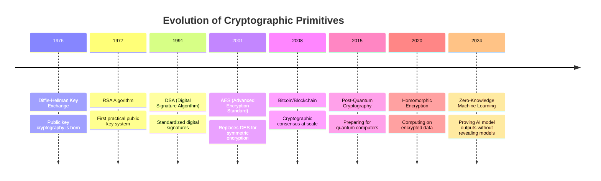

# Episode 10: Security and Trust - PLATINUM TIER MASTERCLASS
**The Foundational Series - Distributed Systems Engineering**

*Runtime: 3 hours 45 minutes*  
*Difficulty: Expert*  
*Prerequisites: Episodes 1-9, understanding of cryptography and network security*

---

## Cold Open: The Supply Chain Attack That Changed Everything

*[Sound: Emergency sirens, news broadcasts overlapping, chaos building]*

**News Anchor 1**: "...unprecedented cyberattack affecting thousands of organizations worldwide..."

**News Anchor 2**: "...SolarWinds Orion platform compromised, Fortune 500 companies breached..."

**News Anchor 3**: "...nation-state actors suspected, damage estimates in the hundreds of billions..."

*[Sound: Rewind effect, taking us back to the beginning]*

**Narrator**: December 8th, 2020. FireEye, one of the world's leading cybersecurity firms, makes a shocking discovery. They've been breached. Not by exploiting a vulnerability in their defenses, but through their trusted software supply chain.

*[Sound: Office environment, keyboards clicking, tense atmosphere]*

**FireEye Security Analyst**: "This doesn't make sense. The malicious traffic is coming from... our SolarWinds Orion server?"

**Senior Analyst**: "That's impossible. Orion is our network monitoring platform. It has privileged access to everything."

**Security Director**: "Run it again. Check the signatures."

*[Sound: Frantic typing, system alerts]*

**FireEye Security Analyst**: "The backdoor is IN the SolarWinds code. It's been there for months. It's digitally signed by SolarWinds."

**Security Director**: "Dear God. If we're compromised through SolarWinds..."

**Senior Analyst**: "Then so is everyone else who uses it. That's... that's 18,000 organizations."

*[Sound: Phone ringing urgently]*

**Narrator**: What followed was the most sophisticated supply chain attack in history. The attackers didn't target their victims directly. They compromised the software build pipeline of a trusted vendor, injecting malicious code that was then distributed to thousands of organizations as a legitimate software update.

*[Sound: Congressional hearing gavel]*

**Congressional Representative**: "How did Russian hackers compromise the networks of the Treasury, Commerce, Homeland Security, the Pentagon, and nuclear laboratories without anyone noticing for nine months?"

**SolarWinds CEO**: "The attackers were extremely sophisticated and persistent. They infiltrated our build environment and inserted malicious code that was designed to be undetectable."

*[Sound: Deep bass rumble, ominous tone]*

**Narrator**: The SUNBURST backdoor, as it came to be known, used advanced techniques:
- Domain Generation Algorithms to hide command-and-control traffic
- Legitimate cloud services for data exfiltration
- Time delays and geographic checks to avoid detection
- Steganography to hide stolen data in legitimate traffic

*[Sound: Calculation, numbers processing]*

**Damage Assessment Expert**: "Current estimates put the total cost at over $100 billion. But the real damage? Trust. How do you trust your software supply chain when the attackers are inside the factory?"

*[Sound: Dramatic pause, then powerful orchestral hit]*

**Narrator**: Welcome to Episode 10: Security and Trust. Today, we dive deep into the mathematical foundations of zero-knowledge proofs, the implementation details of mutual TLS at scale, the OAuth2/OIDC flows that protect billions of authentications daily, and the threat modeling frameworks that could have prevented disasters like SolarWinds.

*[Sound: Medieval castle gate opening, armor clanking]*

**Narrator**: Think of zero trust architecture like a medieval castle. Not one with a single wall, but concentric circles of defense. Each gate requires proof of identity. Each bridge can be raised. Each tower watches for threats. And most importantly—the guards trust no one, not even each other.

---

## Introduction: The Mathematics of Distrust

### The Information Theory of Security

Security in distributed systems begins with Claude Shannon's fundamental theorem:

**Perfect Secrecy Theorem**: 
```
H(M|C) = H(M)
```
Where:
- H(M|C) = Conditional entropy of message given ciphertext
- H(M) = Entropy of the original message

Translation: Perfect security means the ciphertext reveals absolutely nothing about the plaintext.

### The Cryptographic Primitives Timeline



### The Trust Equation for Distributed Systems

```python
class DistributedTrustModel:
    """
    Mathematical model for trust in distributed systems
    Based on: T = (C × I × A) / (R × S × t)
    """
    
    def calculate_trust_score(self, entity):
        """
        C = Cryptographic strength (0-1)
        I = Identity confidence (0-1)
        A = Authentication assurance (0-1)
        R = Risk factor (1-10)
        S = System complexity (1-100)
        t = Time since last verification (seconds)
        """
        
        cryptographic_strength = self.assess_crypto_strength(entity)
        identity_confidence = self.verify_identity_chain(entity)
        auth_assurance = self.measure_auth_factors(entity)
        
        risk_factor = self.calculate_risk(entity)
        system_complexity = self.measure_complexity()
        time_decay = self.get_time_since_verification(entity)
        
        trust_score = (
            (cryptographic_strength * identity_confidence * auth_assurance) /
            (risk_factor * math.log(system_complexity) * math.log(time_decay + 1))
        )
        
        return min(max(trust_score, 0), 1)  # Normalize to [0,1]
```

---

## Chapter 1: Zero-Knowledge Proofs - The Ultimate Trust Minimizer

*[Sound: Mysterious, ethereal music with mathematical undertones]*

### The Magic of Proving Without Revealing

**Narrator**: Imagine proving you know a secret without revealing the secret itself. That's the magic of zero-knowledge proofs—the holy grail of privacy-preserving authentication.

### Interactive Zero-Knowledge Proof Implementation

```python
import hashlib
import random
from cryptography.hazmat.primitives import hashes
from cryptography.hazmat.primitives.asymmetric import ec

class ZeroKnowledgeProof:
    """
    Schnorr's Zero-Knowledge Proof Protocol
    Proves knowledge of discrete logarithm without revealing it
    """
    
    def __init__(self):
        # Using secp256k1 curve (same as Bitcoin)
        self.curve = ec.SECP256K1()
        self.generator = self.curve.generator
        self.order = self.curve.order
        
    def generate_proof_of_knowledge(self, secret_key):
        """
        Prover generates proof of knowing secret_key
        without revealing secret_key itself
        """
        
        # Step 1: Commitment Phase
        # Generate random nonce
        r = random.randint(1, self.order - 1)
        
        # Compute commitment: R = r * G
        R = self.scalar_mult(r, self.generator)
        
        # Step 2: Challenge Phase (simulated)
        # In practice, verifier sends this
        challenge = self.generate_challenge(R)
        
        # Step 3: Response Phase
        # Compute response: s = r + challenge * secret_key (mod order)
        s = (r + challenge * secret_key) % self.order
        
        return ZKProof(
            commitment=R,
            challenge=challenge,
            response=s,
            public_key=self.scalar_mult(secret_key, self.generator)
        )
    
    def verify_proof(self, proof):
        """
        Verifier checks proof without learning secret_key
        """
        
        # Verify: s * G = R + challenge * PublicKey
        left_side = self.scalar_mult(proof.response, self.generator)
        
        right_side = self.point_add(
            proof.commitment,
            self.scalar_mult(proof.challenge, proof.public_key)
        )
        
        return left_side == right_side
    
    def generate_challenge(self, commitment):
        """
        Generate challenge using Fiat-Shamir heuristic
        (makes protocol non-interactive)
        """
        hasher = hashes.Hash(hashes.SHA256())
        hasher.update(self.point_to_bytes(commitment))
        digest = hasher.finalize()
        
        return int.from_bytes(digest, 'big') % self.order
```

### Non-Interactive Zero-Knowledge (NIZK) for Scale

```python
class NIZKProofSystem:
    """
    Non-Interactive Zero-Knowledge Proofs using zk-SNARKs
    Suitable for blockchain and distributed systems
    """
    
    def __init__(self):
        self.trusted_setup = self.perform_trusted_setup()
        self.proving_key = self.trusted_setup['proving_key']
        self.verification_key = self.trusted_setup['verification_key']
        
    def create_membership_proof(self, secret_value, public_set):
        """
        Prove that secret_value is in public_set
        without revealing which element it is
        """
        
        # Create arithmetic circuit for set membership
        circuit = SetMembershipCircuit(public_set)
        
        # Generate witness (private input)
        witness = circuit.generate_witness(secret_value)
        
        # Create proof
        proof = self.generate_snark_proof(
            circuit=circuit,
            witness=witness,
            proving_key=self.proving_key
        )
        
        return MembershipProof(
            proof=proof,
            public_inputs=circuit.get_public_inputs(),
            commitment=self.commit_to_value(secret_value)
        )
    
    def verify_membership_proof(self, proof, public_set):
        """
        Verify membership proof
        """
        
        circuit = SetMembershipCircuit(public_set)
        
        return self.verify_snark_proof(
            proof=proof.proof,
            public_inputs=proof.public_inputs,
            verification_key=self.verification_key,
            circuit=circuit
        )
    
    def create_range_proof(self, value, min_range, max_range):
        """
        Prove that min_range <= value <= max_range
        without revealing the exact value
        """
        
        # Bulletproofs for efficient range proofs
        commitment = self.pedersen_commit(value)
        
        # Generate range proof
        proof = self.generate_bulletproof(
            value=value,
            commitment=commitment,
            range_min=min_range,
            range_max=max_range
        )
        
        return RangeProof(
            commitment=commitment,
            proof=proof,
            range=(min_range, max_range)
        )
```

### Real-World ZK Application: Anonymous Credentials

```python
class AnonymousCredentialSystem:
    """
    Issue and verify credentials without revealing identity
    Used in privacy-preserving authentication systems
    """
    
    def __init__(self):
        self.issuer_key = self.generate_issuer_key()
        self.accumulator = UniversalAccumulator()
        
    def issue_anonymous_credential(self, user_attributes):
        """
        Issue credential that can be verified without revealing user
        """
        
        # Create attribute commitments
        commitments = {}
        for attr_name, attr_value in user_attributes.items():
            commitment, opening = self.commit_to_attribute(attr_value)
            commitments[attr_name] = {
                'commitment': commitment,
                'opening': opening
            }
        
        # Create credential
        credential = AnonymousCredential(
            id=self.generate_credential_id(),
            commitments=commitments,
            issuance_time=time.time(),
            expiry_time=time.time() + (365 * 24 * 60 * 60)  # 1 year
        )
        
        # Sign credential
        signature = self.sign_credential(credential)
        
        # Add to accumulator for revocation checking
        self.accumulator.add(credential.id)
        
        return SignedCredential(
            credential=credential,
            signature=signature,
            accumulator_proof=self.accumulator.prove_membership(credential.id)
        )
    
    def create_presentation_proof(self, credential, disclosed_attributes, predicate_proofs):
        """
        Create proof of credential possession with selective disclosure
        """
        
        proofs = []
        
        # Prove credential signature is valid
        signature_proof = self.prove_signature_knowledge(
            credential.signature,
            credential.credential
        )
        proofs.append(signature_proof)
        
        # Prove non-revocation
        revocation_proof = self.accumulator.prove_non_revocation(
            credential.credential.id,
            self.accumulator.get_current_value()
        )
        proofs.append(revocation_proof)
        
        # Selective disclosure proofs
        for attr_name in disclosed_attributes:
            disclosure_proof = self.prove_attribute_value(
                commitment=credential.credential.commitments[attr_name]['commitment'],
                opening=credential.credential.commitments[attr_name]['opening'],
                value=disclosed_attributes[attr_name]
            )
            proofs.append(disclosure_proof)
        
        # Predicate proofs (e.g., age > 18 without revealing exact age)
        for predicate in predicate_proofs:
            pred_proof = self.prove_predicate(
                commitment=credential.credential.commitments[predicate.attribute]['commitment'],
                predicate_type=predicate.type,  # e.g., "greater_than"
                threshold=predicate.threshold
            )
            proofs.append(pred_proof)
        
        return PresentationProof(
            credential_id=self.hash_credential_id(credential.credential.id),
            proofs=proofs,
            disclosed_attributes=disclosed_attributes,
            timestamp=time.time()
        )
```

---

## Chapter 2: mTLS at Scale - The Authentication Backbone

*[Sound: Network traffic humming, certificates being exchanged]*

### The Complete mTLS Implementation

```python
import ssl
import asyncio
from cryptography import x509
from cryptography.x509.oid import NameOID, ExtensionOID
from cryptography.hazmat.primitives import serialization, hashes
from cryptography.hazmat.primitives.asymmetric import rsa, padding

class ScalableMTLSSystem:
    """
    Production-ready mTLS implementation for microservices
    Handles millions of certificate rotations daily
    """
    
    def __init__(self):
        self.root_ca = self.initialize_root_ca()
        self.intermediate_cas = {}
        self.certificate_store = DistributedCertStore()
        self.ocsp_responder = OCSPResponder()
        self.monitoring = CertificateMonitoring()
        
    async def provision_service_certificate(self, service_name, environment):
        """
        Provision short-lived certificate with automatic rotation
        """
        
        # Generate key pair
        private_key = rsa.generate_private_key(
            public_exponent=65537,
            key_size=2048  # 4096 for production critical services
        )
        
        # Create CSR with service identity
        csr = self.create_service_csr(
            private_key=private_key,
            service_name=service_name,
            environment=environment
        )
        
        # Select appropriate intermediate CA
        intermediate_ca = self.intermediate_cas[environment]
        
        # Issue certificate with constraints
        certificate = await self.issue_certificate(
            csr=csr,
            issuer=intermediate_ca,
            validity_hours=24,  # Short-lived for security
            constraints=self.get_service_constraints(service_name)
        )
        
        # Create certificate bundle
        bundle = CertificateBundle(
            certificate=certificate,
            private_key=private_key,
            intermediate_cert=intermediate_ca.certificate,
            root_cert=self.root_ca.certificate,
            ocsp_staple=await self.ocsp_responder.create_staple(certificate)
        )
        
        # Store in distributed certificate store
        await self.certificate_store.store(
            service_name=service_name,
            bundle=bundle,
            ttl=timedelta(hours=20)  # Rotate before expiry
        )
        
        # Setup automatic rotation
        asyncio.create_task(
            self.schedule_rotation(service_name, timedelta(hours=20))
        )
        
        # Monitor certificate health
        self.monitoring.track_issuance(
            service=service_name,
            certificate=certificate,
            issuer=intermediate_ca.name
        )
        
        return bundle
    
    def create_service_csr(self, private_key, service_name, environment):
        """
        Create Certificate Signing Request with proper SANs
        """
        
        # Build subject
        subject = x509.Name([
            x509.NameAttribute(NameOID.COUNTRY_NAME, "US"),
            x509.NameAttribute(NameOID.ORGANIZATION_NAME, "Company Inc"),
            x509.NameAttribute(NameOID.ORGANIZATIONAL_UNIT_NAME, environment),
            x509.NameAttribute(NameOID.COMMON_NAME, f"{service_name}.{environment}.internal")
        ])
        
        # Build SANs for service discovery
        sans = [
            # Primary service name
            x509.DNSName(f"{service_name}.{environment}.internal"),
            # Kubernetes service names
            x509.DNSName(f"{service_name}.{environment}.svc.cluster.local"),
            # Short name for same namespace
            x509.DNSName(service_name),
            # Headless service entries
            x509.DNSName(f"*.{service_name}.{environment}.svc.cluster.local"),
            # Service mesh identity
            x509.UniformResourceIdentifier(f"spiffe://cluster.local/ns/{environment}/sa/{service_name}")
        ]
        
        # Create CSR
        csr_builder = (
            x509.CertificateSigningRequestBuilder()
            .subject_name(subject)
            .add_extension(
                x509.SubjectAlternativeName(sans),
                critical=False
            )
            .add_extension(
                x509.KeyUsage(
                    digital_signature=True,
                    key_encipherment=True,
                    key_agreement=True,
                    key_cert_sign=False,
                    crl_sign=False,
                    content_commitment=False,
                    data_encipherment=False,
                    encipher_only=False,
                    decipher_only=False
                ),
                critical=True
            )
        )
        
        # Sign CSR
        csr = csr_builder.sign(private_key, hashes.SHA256())
        
        return csr
    
    async def create_mtls_context(self, service_name):
        """
        Create SSL context for mutual TLS with all security features
        """
        
        # Get current certificate bundle
        bundle = await self.certificate_store.get(service_name)
        
        # Create SSL context
        context = ssl.create_default_context(ssl.Purpose.CLIENT_AUTH)
        
        # Configure TLS versions (TLS 1.2 minimum, prefer 1.3)
        context.minimum_version = ssl.TLSVersion.TLSv1_2
        context.maximum_version = ssl.TLSVersion.TLSv1_3
        
        # Configure cipher suites (in order of preference)
        if ssl.HAS_TLSv1_3:
            # TLS 1.3 cipher suites
            context.set_ciphers(
                'TLS_AES_256_GCM_SHA384:'
                'TLS_CHACHA20_POLY1305_SHA256:'
                'TLS_AES_128_GCM_SHA256:'
                # TLS 1.2 fallback
                'ECDHE+AESGCM:'
                'ECDHE+CHACHA20:'
                'DHE+AESGCM:'
                'DHE+CHACHA20:'
                '!aNULL:!MD5:!DSS'
            )
        
        # Load certificate chain
        context.load_cert_chain(
            certfile=bundle.certificate_path,
            keyfile=bundle.private_key_path,
            password=None  # Key not encrypted in memory
        )
        
        # Load CA certificates for verification
        context.load_verify_locations(
            cafile=bundle.ca_bundle_path
        )
        
        # Configure verification
        context.verify_mode = ssl.CERT_REQUIRED
        context.check_hostname = True
        
        # Enable OCSP stapling
        if hasattr(context, 'set_ocsp_client_callback'):
            context.set_ocsp_client_callback(
                self.verify_ocsp_response
            )
        
        # Configure session resumption
        context.set_session_cache_mode(ssl.SESS_CACHE_CLIENT)
        context.session_cache_max_size = 1000
        
        # Add SNI callback for multi-tenant services
        context.sni_callback = self.sni_callback
        
        return context
    
    async def verify_peer_certificate(self, peer_cert, expected_service=None):
        """
        Comprehensive certificate verification for mTLS
        """
        
        verifications = []
        
        # 1. Verify certificate chain
        try:
            self.verify_certificate_chain(peer_cert)
            verifications.append(('chain', True, None))
        except Exception as e:
            verifications.append(('chain', False, str(e)))
            
        # 2. Check certificate validity period
        now = datetime.utcnow()
        if not (peer_cert.not_valid_before <= now <= peer_cert.not_valid_after):
            verifications.append(('validity', False, 'Certificate expired or not yet valid'))
        else:
            verifications.append(('validity', True, None))
            
        # 3. Verify certificate hasn't been revoked (OCSP)
        ocsp_result = await self.check_ocsp_status(peer_cert)
        verifications.append(('revocation', ocsp_result.valid, ocsp_result.reason))
        
        # 4. Verify SPIFFE identity if present
        spiffe_id = self.extract_spiffe_identity(peer_cert)
        if spiffe_id:
            spiffe_valid = self.verify_spiffe_identity(spiffe_id, expected_service)
            verifications.append(('spiffe', spiffe_valid, spiffe_id))
            
        # 5. Check certificate transparency logs
        ct_result = await self.verify_certificate_transparency(peer_cert)
        verifications.append(('transparency', ct_result.valid, ct_result.log_ids))
        
        # 6. Verify certificate constraints
        constraints_valid = self.verify_certificate_constraints(peer_cert)
        verifications.append(('constraints', constraints_valid, None))
        
        # 7. Check certificate pinning if configured
        if expected_service and self.has_pin_for_service(expected_service):
            pin_valid = self.verify_certificate_pin(peer_cert, expected_service)
            verifications.append(('pinning', pin_valid, None))
        
        # Compile final result
        all_valid = all(v[1] for v in verifications)
        
        return CertificateVerificationResult(
            valid=all_valid,
            verifications=verifications,
            certificate_fingerprint=self.get_certificate_fingerprint(peer_cert),
            subject=peer_cert.subject,
            issuer=peer_cert.issuer,
            spiffe_id=spiffe_id
        )
```

### Certificate Lifecycle Management at Scale

```python
class CertificateLifecycleManager:
    """
    Manages certificate lifecycle for thousands of services
    """
    
    def __init__(self):
        self.renewal_scheduler = AsyncScheduler()
        self.metrics = CertificateMetrics()
        self.alerting = AlertingSystem()
        
    async def manage_certificate_lifecycle(self):
        """
        Main lifecycle management loop
        """
        
        while True:
            try:
                # Get all certificates nearing expiry
                expiring_certs = await self.find_expiring_certificates(
                    threshold_hours=72  # 3 days before expiry
                )
                
                # Process renewals in parallel
                renewal_tasks = []
                for cert_info in expiring_certs:
                    task = asyncio.create_task(
                        self.renew_certificate(cert_info)
                    )
                    renewal_tasks.append(task)
                
                # Wait for all renewals
                renewal_results = await asyncio.gather(
                    *renewal_tasks,
                    return_exceptions=True
                )
                
                # Process results
                for cert_info, result in zip(expiring_certs, renewal_results):
                    if isinstance(result, Exception):
                        await self.handle_renewal_failure(cert_info, result)
                    else:
                        await self.handle_renewal_success(cert_info, result)
                
                # Update metrics
                self.metrics.record_renewal_batch(
                    total=len(expiring_certs),
                    successful=sum(1 for r in renewal_results if not isinstance(r, Exception)),
                    failed=sum(1 for r in renewal_results if isinstance(r, Exception))
                )
                
                # Sleep before next check
                await asyncio.sleep(300)  # Check every 5 minutes
                
            except Exception as e:
                logger.error(f"Certificate lifecycle error: {e}")
                await self.alerting.send_critical_alert(
                    "Certificate Lifecycle Manager Error",
                    str(e)
                )
    
    async def renew_certificate(self, cert_info):
        """
        Renew a single certificate with zero downtime
        """
        
        service_name = cert_info.service_name
        
        # Generate new certificate
        new_bundle = await self.provision_new_certificate(service_name)
        
        # Atomic certificate rotation
        await self.rotate_certificate_atomically(
            service_name=service_name,
            old_bundle=cert_info.current_bundle,
            new_bundle=new_bundle
        )
        
        # Verify rotation success
        verification = await self.verify_rotation(service_name, new_bundle)
        
        if not verification.successful:
            # Rollback if verification fails
            await self.rollback_certificate(
                service_name=service_name,
                old_bundle=cert_info.current_bundle
            )
            raise CertificateRotationError(
                f"Rotation verification failed: {verification.reason}"
            )
        
        # Update monitoring
        self.metrics.record_successful_rotation(
            service=service_name,
            old_cert_expiry=cert_info.current_bundle.certificate.not_valid_after,
            new_cert_expiry=new_bundle.certificate.not_valid_after
        )
        
        return new_bundle
    
    async def rotate_certificate_atomically(self, service_name, old_bundle, new_bundle):
        """
        Atomic certificate rotation with zero downtime
        """
        
        # Step 1: Stage new certificate
        staging_path = f"/certs/staging/{service_name}"
        await self.write_certificate_bundle(new_bundle, staging_path)
        
        # Step 2: Verify staged certificate
        staged_verification = await self.verify_staged_certificate(staging_path)
        if not staged_verification.valid:
            raise Exception(f"Staged certificate invalid: {staged_verification.reason}")
        
        # Step 3: Create symlink for atomic swap
        production_path = f"/certs/production/{service_name}"
        temp_link = f"{production_path}.new"
        
        # Create new symlink pointing to staging
        os.symlink(staging_path, temp_link)
        
        # Step 4: Atomic rename (this is the atomic operation)
        os.rename(temp_link, production_path)
        
        # Step 5: Signal service to reload
        await self.signal_certificate_reload(service_name)
        
        # Step 6: Wait for reload confirmation
        reload_confirmed = await self.wait_for_reload_confirmation(
            service_name,
            timeout=30
        )
        
        if not reload_confirmed:
            raise Exception("Service failed to reload new certificate")
        
        # Step 7: Clean up old certificate after grace period
        asyncio.create_task(
            self.cleanup_old_certificate(old_bundle, delay=300)  # 5 min grace
        )
```

---

## Chapter 3: OAuth2/OIDC - Identity at Internet Scale

*[Sound: Billions of authentication requests flowing through the network]*

### The Complete OAuth2/OIDC Implementation

```python
class EnterpriseOAuth2Provider:
    """
    Production OAuth2/OIDC provider handling millions of authentications
    Implements all flows with security best practices
    """
    
    def __init__(self):
        self.jwks_manager = JWKSManager()
        self.token_store = DistributedTokenStore()
        self.session_manager = SessionManager()
        self.security_monitor = OAuth2SecurityMonitor()
        
    async def handle_authorization_code_flow(self, request):
        """
        Authorization Code Flow with PKCE (RFC 7636)
        Most secure flow for web applications
        """
        
        # Validate client
        client = await self.validate_client(
            client_id=request.client_id,
            redirect_uri=request.redirect_uri
        )
        
        # Generate authorization code
        auth_code = AuthorizationCode(
            code=self.generate_secure_code(),
            client_id=client.id,
            redirect_uri=request.redirect_uri,
            scope=request.scope,
            code_challenge=request.code_challenge,
            code_challenge_method=request.code_challenge_method,
            nonce=request.nonce,  # For OIDC
            state=request.state,
            auth_time=datetime.utcnow(),
            expires_at=datetime.utcnow() + timedelta(minutes=10)
        )
        
        # Store with replay protection
        await self.token_store.store_auth_code(
            code=auth_code,
            ttl=600,  # 10 minutes
            single_use=True
        )
        
        # Log for security monitoring
        await self.security_monitor.log_authorization(
            client_id=client.id,
            user_id=request.authenticated_user.id,
            scope=request.scope,
            ip_address=request.client_ip
        )
        
        return auth_code
    
    async def exchange_code_for_tokens(self, request):
        """
        Exchange authorization code for tokens
        Implements all security checks
        """
        
        # Retrieve and validate code
        auth_code = await self.token_store.get_auth_code(request.code)
        
        if not auth_code:
            raise OAuth2Error(
                error='invalid_grant',
                description='Authorization code is invalid or expired'
            )
        
        # Verify PKCE
        if auth_code.code_challenge:
            if not self.verify_pkce_challenge(
                verifier=request.code_verifier,
                challenge=auth_code.code_challenge,
                method=auth_code.code_challenge_method
            ):
                raise OAuth2Error(
                    error='invalid_grant',
                    description='PKCE verification failed'
                )
        
        # Verify client credentials
        if not await self.verify_client_credentials(
            client_id=request.client_id,
            client_secret=request.client_secret
        ):
            raise OAuth2Error(
                error='invalid_client',
                description='Client authentication failed'
            )
        
        # Generate tokens
        token_response = await self.generate_token_response(
            user_id=auth_code.user_id,
            client_id=auth_code.client_id,
            scope=auth_code.scope,
            nonce=auth_code.nonce,
            auth_time=auth_code.auth_time
        )
        
        # Invalidate authorization code (single use)
        await self.token_store.invalidate_auth_code(request.code)
        
        # Security logging
        await self.security_monitor.log_token_issuance(
            client_id=auth_code.client_id,
            user_id=auth_code.user_id,
            token_id=token_response.access_token_id,
            scope=auth_code.scope
        )
        
        return token_response
    
    async def generate_token_response(self, user_id, client_id, scope, nonce, auth_time):
        """
        Generate complete token response with all tokens
        """
        
        # Get current signing key
        signing_key = await self.jwks_manager.get_current_signing_key()
        
        # Common claims
        iat = datetime.utcnow()
        
        # Generate access token
        access_token_claims = {
            'iss': 'https://auth.company.com',
            'sub': user_id,
            'aud': client_id,
            'exp': iat + timedelta(hours=1),
            'iat': iat.timestamp(),
            'jti': str(uuid.uuid4()),
            'scope': scope,
            'client_id': client_id,
            'token_type': 'access_token'
        }
        
        access_token = jwt.encode(
            access_token_claims,
            signing_key.private_key,
            algorithm='RS256',
            headers={'kid': signing_key.key_id}
        )
        
        # Generate ID token (for OIDC)
        id_token_claims = {
            'iss': 'https://auth.company.com',
            'sub': user_id,
            'aud': client_id,
            'exp': iat + timedelta(hours=24),
            'iat': iat.timestamp(),
            'auth_time': auth_time.timestamp(),
            'nonce': nonce,
            'at_hash': self.generate_at_hash(access_token),
            'email': await self.get_user_email(user_id),
            'email_verified': True
        }
        
        id_token = jwt.encode(
            id_token_claims,
            signing_key.private_key,
            algorithm='RS256',
            headers={'kid': signing_key.key_id}
        )
        
        # Generate refresh token
        refresh_token = await self.generate_refresh_token(
            user_id=user_id,
            client_id=client_id,
            scope=scope
        )
        
        # Store token metadata for introspection
        await self.store_token_metadata(
            access_token_id=access_token_claims['jti'],
            user_id=user_id,
            client_id=client_id,
            scope=scope,
            expires_at=access_token_claims['exp']
        )
        
        return TokenResponse(
            access_token=access_token,
            token_type='Bearer',
            expires_in=3600,
            refresh_token=refresh_token,
            id_token=id_token,
            scope=scope
        )
    
    def verify_pkce_challenge(self, verifier, challenge, method='S256'):
        """
        Verify PKCE code challenge
        """
        
        if method == 'plain':
            return verifier == challenge
        elif method == 'S256':
            # SHA256(verifier) = challenge
            calculated = base64.urlsafe_b64encode(
                hashlib.sha256(verifier.encode()).digest()
            ).decode().rstrip('=')
            return calculated == challenge
        else:
            return False
    
    async def handle_refresh_token_flow(self, request):
        """
        Refresh token flow with rotation
        """
        
        # Validate refresh token
        refresh_token_data = await self.validate_refresh_token(request.refresh_token)
        
        if not refresh_token_data:
            raise OAuth2Error(
                error='invalid_grant',
                description='Refresh token is invalid or expired'
            )
        
        # Check if token has been revoked
        if await self.is_token_revoked(refresh_token_data.token_id):
            # Potential token reuse attack
            await self.security_monitor.log_suspicious_activity(
                event_type='REFRESH_TOKEN_REUSE',
                user_id=refresh_token_data.user_id,
                client_id=refresh_token_data.client_id,
                details={'token_id': refresh_token_data.token_id}
            )
            
            # Revoke entire token family
            await self.revoke_token_family(refresh_token_data.family_id)
            
            raise OAuth2Error(
                error='invalid_grant',
                description='Refresh token has been revoked'
            )
        
        # Generate new tokens
        new_token_response = await self.generate_token_response(
            user_id=refresh_token_data.user_id,
            client_id=refresh_token_data.client_id,
            scope=refresh_token_data.scope,
            nonce=None,  # Not needed for refresh
            auth_time=refresh_token_data.auth_time
        )
        
        # Rotate refresh token
        await self.rotate_refresh_token(
            old_token=request.refresh_token,
            new_token=new_token_response.refresh_token,
            family_id=refresh_token_data.family_id
        )
        
        return new_token_response
```

### Advanced Security Features

```python
class OAuth2SecurityFeatures:
    """
    Advanced security features for OAuth2/OIDC
    """
    
    def __init__(self):
        self.dpop_verifier = DPoPVerifier()
        self.par_handler = PushedAuthorizationRequestHandler()
        self.jar_validator = JWTAuthorizationRequestValidator()
        
    async def verify_dpop_proof(self, request):
        """
        Demonstration of Proof-of-Possession (DPoP)
        RFC 9449
        """
        
        dpop_header = request.headers.get('DPoP')
        if not dpop_header:
            return None
            
        try:
            # Parse DPoP JWT
            dpop_jwt = jwt.decode(
                dpop_header,
                options={"verify_signature": False}  # Verify later
            )
            
            # Extract public key from JWT header
            jwk = dpop_jwt['header']['jwk']
            public_key = self.jwk_to_public_key(jwk)
            
            # Verify signature with embedded key
            verified_jwt = jwt.decode(
                dpop_header,
                public_key,
                algorithms=['RS256', 'ES256'],
                options={
                    "verify_aud": False,  # No audience in DPoP
                    "verify_iss": False   # No issuer in DPoP
                }
            )
            
            # Verify DPoP proof claims
            if verified_jwt['htm'] != request.method:
                raise ValueError("HTTP method mismatch")
                
            if verified_jwt['htu'] != request.url:
                raise ValueError("HTTP URI mismatch")
                
            # Verify freshness (within 60 seconds)
            if abs(time.time() - verified_jwt['iat']) > 60:
                raise ValueError("DPoP proof too old")
                
            # Verify nonce if required
            if hasattr(request, 'dpop_nonce'):
                if verified_jwt.get('nonce') != request.dpop_nonce:
                    raise ValueError("Invalid DPoP nonce")
            
            # Calculate JKT (JWK Thumbprint)
            jkt = self.calculate_jwk_thumbprint(jwk)
            
            return DPoPContext(
                jkt=jkt,
                public_key=public_key,
                proof_claims=verified_jwt
            )
            
        except Exception as e:
            logger.warning(f"DPoP verification failed: {e}")
            return None
    
    async def handle_pushed_authorization_request(self, request):
        """
        Pushed Authorization Requests (PAR)
        RFC 9126
        """
        
        # Validate client authentication
        client = await self.authenticate_client(request)
        
        # Store authorization request
        request_uri = f"urn:ietf:params:oauth:request_uri:{uuid.uuid4()}"
        
        await self.par_store.store_request(
            request_uri=request_uri,
            authorization_request={
                'client_id': client.id,
                'redirect_uri': request.redirect_uri,
                'scope': request.scope,
                'state': request.state,
                'code_challenge': request.code_challenge,
                'code_challenge_method': request.code_challenge_method,
                'nonce': request.nonce,
                'claims': request.claims
            },
            ttl=600  # 10 minutes
        )
        
        return PARResponse(
            request_uri=request_uri,
            expires_in=600
        )
    
    async def validate_jwt_secured_authorization_request(self, request):
        """
        JWT-Secured Authorization Request (JAR)
        RFC 9101
        """
        
        request_object = request.get('request')
        if not request_object:
            return request  # Not using JAR
            
        # Get client to retrieve keys
        client = await self.get_client(request.get('client_id'))
        
        # Verify JWT signature
        try:
            # Try each of client's public keys
            verified_claims = None
            for key in client.public_keys:
                try:
                    verified_claims = jwt.decode(
                        request_object,
                        key,
                        algorithms=['RS256', 'ES256'],
                        audience='https://auth.company.com',
                        issuer=client.id
                    )
                    break
                except jwt.InvalidSignatureError:
                    continue
                    
            if not verified_claims:
                raise OAuth2Error(
                    error='invalid_request_object',
                    description='Request object signature verification failed'
                )
            
            # Merge claims (request object takes precedence)
            merged_request = {**request, **verified_claims}
            
            # Validate required claims match
            if request.get('client_id') != verified_claims.get('client_id'):
                raise OAuth2Error(
                    error='invalid_request_object',
                    description='Client ID mismatch'
                )
            
            return merged_request
            
        except Exception as e:
            raise OAuth2Error(
                error='invalid_request_object',
                description=str(e)
            )
```

---

## Chapter 4: Threat Modeling Frameworks

*[Sound: War room atmosphere, strategic planning]*

### STRIDE Threat Modeling Implementation

```python
class STRIDEThreatModeling:
    """
    Microsoft's STRIDE threat modeling framework
    Spoofing, Tampering, Repudiation, Information Disclosure, DoS, Elevation
    """
    
    def __init__(self):
        self.threat_categories = {
            'Spoofing': self.analyze_spoofing_threats,
            'Tampering': self.analyze_tampering_threats,
            'Repudiation': self.analyze_repudiation_threats,
            'Information_Disclosure': self.analyze_info_disclosure_threats,
            'Denial_of_Service': self.analyze_dos_threats,
            'Elevation_of_Privilege': self.analyze_elevation_threats
        }
        
    async def analyze_system_threats(self, system_model):
        """
        Comprehensive STRIDE analysis of distributed system
        """
        
        threat_report = ThreatModelReport(
            system=system_model.name,
            timestamp=datetime.utcnow(),
            methodology='STRIDE'
        )
        
        # Analyze each component
        for component in system_model.components:
            component_threats = await self.analyze_component(component)
            threat_report.add_component_analysis(component, component_threats)
        
        # Analyze data flows
        for data_flow in system_model.data_flows:
            flow_threats = await self.analyze_data_flow(data_flow)
            threat_report.add_flow_analysis(data_flow, flow_threats)
        
        # Analyze trust boundaries
        for boundary in system_model.trust_boundaries:
            boundary_threats = await self.analyze_trust_boundary(boundary)
            threat_report.add_boundary_analysis(boundary, boundary_threats)
        
        # Generate risk matrix
        threat_report.risk_matrix = self.calculate_risk_matrix(threat_report)
        
        # Recommend mitigations
        threat_report.mitigations = await self.recommend_mitigations(threat_report)
        
        return threat_report
    
    async def analyze_spoofing_threats(self, element):
        """
        Analyze spoofing threats (identity falsification)
        """
        
        threats = []
        
        if element.type == 'API_ENDPOINT':
            threats.append(Threat(
                id=f"SPOOF-API-{element.id}",
                category='Spoofing',
                description=f"Attacker could spoof requests to {element.name}",
                impact='HIGH',
                likelihood='MEDIUM',
                attack_vectors=[
                    'Missing API authentication',
                    'Weak API key validation',
                    'No client certificate verification'
                ],
                mitigations=[
                    'Implement mTLS for API authentication',
                    'Use OAuth2 with DPoP for token binding',
                    'Implement request signing with HMAC'
                ]
            ))
        
        if element.type == 'USER_INTERFACE':
            threats.append(Threat(
                id=f"SPOOF-UI-{element.id}",
                category='Spoofing',
                description=f"Attacker could create phishing site mimicking {element.name}",
                impact='HIGH',
                likelihood='HIGH',
                attack_vectors=[
                    'Similar domain names',
                    'Visual similarity attacks',
                    'Man-in-the-middle attacks'
                ],
                mitigations=[
                    'Implement HSTS and certificate pinning',
                    'Use EV certificates for visual indicators',
                    'Implement Content Security Policy (CSP)',
                    'Deploy DMARC for email authentication'
                ]
            ))
        
        return threats
    
    async def analyze_tampering_threats(self, element):
        """
        Analyze tampering threats (unauthorized modification)
        """
        
        threats = []
        
        if element.type == 'DATA_STORE':
            threats.append(Threat(
                id=f"TAMPER-DB-{element.id}",
                category='Tampering',
                description=f"Attacker could modify data in {element.name}",
                impact='CRITICAL',
                likelihood='LOW',
                attack_vectors=[
                    'SQL injection',
                    'Direct database access',
                    'Backup tampering',
                    'Replication poisoning'
                ],
                mitigations=[
                    'Use parameterized queries exclusively',
                    'Implement database activity monitoring',
                    'Enable row-level security',
                    'Use cryptographic checksums for integrity',
                    'Implement append-only audit logs'
                ]
            ))
        
        if element.type == 'MESSAGE_QUEUE':
            threats.append(Threat(
                id=f"TAMPER-QUEUE-{element.id}",
                category='Tampering',
                description=f"Attacker could inject or modify messages in {element.name}",
                impact='HIGH',
                likelihood='MEDIUM',
                attack_vectors=[
                    'Message injection',
                    'Message replay attacks',
                    'Header manipulation',
                    'Payload tampering'
                ],
                mitigations=[
                    'Sign all messages with HMAC',
                    'Implement message versioning',
                    'Use encrypted transport (TLS)',
                    'Add timestamp and nonce to prevent replay'
                ]
            ))
        
        return threats
```

### PASTA Threat Modeling

```python
class PASTAThreatModeling:
    """
    Process for Attack Simulation and Threat Analysis
    Risk-centric threat modeling approach
    """
    
    def __init__(self):
        self.stages = [
            self.define_objectives,
            self.define_technical_scope,
            self.application_decomposition,
            self.threat_analysis,
            self.vulnerability_analysis,
            self.attack_modeling,
            self.risk_impact_analysis
        ]
        
    async def execute_pasta_analysis(self, application):
        """
        Execute all 7 stages of PASTA
        """
        
        pasta_report = PASTAReport(
            application=application.name,
            started_at=datetime.utcnow()
        )
        
        # Stage 1: Define Objectives
        objectives = await self.define_objectives(application)
        pasta_report.business_objectives = objectives
        
        # Stage 2: Define Technical Scope
        technical_scope = await self.define_technical_scope(application)
        pasta_report.technical_scope = technical_scope
        
        # Stage 3: Application Decomposition
        decomposition = await self.application_decomposition(application)
        pasta_report.decomposition = decomposition
        
        # Stage 4: Threat Analysis
        threats = await self.threat_analysis(decomposition)
        pasta_report.identified_threats = threats
        
        # Stage 5: Vulnerability Analysis
        vulnerabilities = await self.vulnerability_analysis(
            decomposition,
            threats
        )
        pasta_report.vulnerabilities = vulnerabilities
        
        # Stage 6: Attack Modeling
        attack_trees = await self.attack_modeling(
            threats,
            vulnerabilities
        )
        pasta_report.attack_trees = attack_trees
        
        # Stage 7: Risk & Impact Analysis
        risk_analysis = await self.risk_impact_analysis(
            objectives,
            attack_trees
        )
        pasta_report.risk_analysis = risk_analysis
        
        return pasta_report
    
    async def attack_modeling(self, threats, vulnerabilities):
        """
        Stage 6: Create attack trees for identified threats
        """
        
        attack_trees = []
        
        for threat in threats:
            # Build attack tree
            root_node = AttackNode(
                goal=threat.description,
                threat_id=threat.id
            )
            
            # Find attack paths
            attack_paths = await self.find_attack_paths(
                threat,
                vulnerabilities
            )
            
            for path in attack_paths:
                path_node = AttackNode(
                    goal=f"Exploit {path.vulnerability.name}",
                    parent=root_node,
                    cost=path.estimated_cost,
                    skill_required=path.skill_level,
                    detection_difficulty=path.detection_difficulty
                )
                
                # Add attack steps
                for step in path.steps:
                    step_node = AttackNode(
                        goal=step.description,
                        parent=path_node,
                        tools_required=step.tools,
                        time_required=step.time_estimate,
                        success_probability=step.success_rate
                    )
                    path_node.add_child(step_node)
                
                root_node.add_child(path_node)
            
            # Calculate attack tree metrics
            tree_metrics = self.calculate_attack_metrics(root_node)
            
            attack_trees.append(AttackTree(
                root=root_node,
                threat_id=threat.id,
                metrics=tree_metrics,
                recommended_defenses=self.recommend_defenses(root_node)
            ))
        
        return attack_trees
```

---

## Chapter 5: Supply Chain Security

*[Sound: Factory assembly line, but for software]*

### Software Bill of Materials (SBOM) Implementation

```python
class SBOMManager:
    """
    Comprehensive SBOM generation and analysis
    Implements SPDX and CycloneDX formats
    """
    
    def __init__(self):
        self.dependency_scanner = DependencyScanner()
        self.vulnerability_db = VulnerabilityDatabase()
        self.license_analyzer = LicenseAnalyzer()
        
    async def generate_sbom(self, project_path, format='cyclonedx'):
        """
        Generate complete SBOM for project
        """
        
        sbom = SBOM(
            serial_number=str(uuid.uuid4()),
            version=1,
            metadata=Metadata(
                timestamp=datetime.utcnow(),
                tools=[Tool(
                    vendor='SecurityCorp',
                    name='SBOM Generator',
                    version='2.0.0'
                )],
                component=Component(
                    name=project_path.name,
                    type='application',
                    version=await self.get_project_version(project_path)
                )
            )
        )
        
        # Scan for dependencies
        dependencies = await self.dependency_scanner.scan_project(project_path)
        
        # Analyze each dependency
        for dep in dependencies:
            component = await self.analyze_component(dep)
            sbom.add_component(component)
            
            # Add dependency relationships
            if dep.dependencies:
                for sub_dep in dep.dependencies:
                    sbom.add_dependency(
                        ref=component.bom_ref,
                        depends_on=sub_dep.bom_ref
                    )
        
        # Add vulnerability information
        vulnerabilities = await self.scan_vulnerabilities(sbom.components)
        sbom.vulnerabilities = vulnerabilities
        
        # Generate output
        if format == 'cyclonedx':
            return self.to_cyclonedx(sbom)
        elif format == 'spdx':
            return self.to_spdx(sbom)
        else:
            raise ValueError(f"Unknown format: {format}")
    
    async def analyze_component(self, dependency):
        """
        Deep analysis of a single component
        """
        
        component = Component(
            type='library',
            bom_ref=f"pkg:{dependency.package_manager}/{dependency.name}@{dependency.version}",
            name=dependency.name,
            version=dependency.version,
            purl=dependency.purl,
            hashes=await self.calculate_hashes(dependency)
        )
        
        # Get comprehensive metadata
        metadata = await self.get_package_metadata(dependency)
        
        if metadata:
            component.author = metadata.author
            component.publisher = metadata.publisher
            component.description = metadata.description
            component.licenses = await self.analyze_licenses(metadata.licenses)
            component.external_references = [
                ExternalReference(
                    type='website',
                    url=metadata.homepage
                ),
                ExternalReference(
                    type='vcs',
                    url=metadata.repository
                )
            ]
        
        # Security analysis
        component.evidence = await self.collect_security_evidence(dependency)
        
        return component
    
    async def continuous_sbom_monitoring(self, sbom_storage):
        """
        Continuous monitoring of SBOM for new vulnerabilities
        """
        
        while True:
            try:
                # Get all active SBOMs
                active_sboms = await sbom_storage.get_active_sboms()
                
                for sbom_record in active_sboms:
                    sbom = sbom_record.sbom
                    
                    # Check for new vulnerabilities
                    new_vulns = await self.check_new_vulnerabilities(
                        sbom.components,
                        since=sbom_record.last_scan
                    )
                    
                    if new_vulns:
                        # Alert on critical vulnerabilities
                        critical_vulns = [
                            v for v in new_vulns 
                            if v.severity in ['CRITICAL', 'HIGH']
                        ]
                        
                        if critical_vulns:
                            await self.alert_security_team(
                                sbom=sbom,
                                vulnerabilities=critical_vulns
                            )
                        
                        # Update SBOM
                        sbom.vulnerabilities.extend(new_vulns)
                        await sbom_storage.update_sbom(sbom_record.id, sbom)
                    
                    # Check for supply chain attacks
                    suspicious_changes = await self.detect_suspicious_changes(
                        sbom,
                        sbom_record.previous_version
                    )
                    
                    if suspicious_changes:
                        await self.alert_supply_chain_attack(
                            sbom=sbom,
                            changes=suspicious_changes
                        )
                
                # Sleep before next check
                await asyncio.sleep(3600)  # Check hourly
                
            except Exception as e:
                logger.error(f"SBOM monitoring error: {e}")
```

### Build Pipeline Security

```python
class SecureBuildPipeline:
    """
    Secure software build pipeline implementation
    Prevents supply chain attacks like SolarWinds
    """
    
    def __init__(self):
        self.artifact_signer = ArtifactSigner()
        self.build_attestation = BuildAttestationService()
        self.hermetic_builder = HermeticBuilder()
        
    async def execute_secure_build(self, source_code, build_config):
        """
        Execute build with comprehensive security controls
        """
        
        build_id = str(uuid.uuid4())
        
        # Step 1: Verify source integrity
        source_verification = await self.verify_source_integrity(
            source_code,
            expected_hash=build_config.source_hash,
            signed_commits=build_config.require_signed_commits
        )
        
        if not source_verification.valid:
            raise BuildSecurityError(
                f"Source verification failed: {source_verification.reason}"
            )
        
        # Step 2: Prepare hermetic build environment
        build_env = await self.hermetic_builder.prepare_environment(
            base_image=build_config.base_image,
            dependencies=build_config.dependencies,
            network_isolated=True,
            filesystem_readonly=True
        )
        
        # Step 3: Execute build in isolated environment
        build_result = await build_env.execute_build(
            source_path=source_code.path,
            build_script=build_config.build_script,
            timeout=build_config.timeout,
            resource_limits=ResourceLimits(
                cpu_cores=4,
                memory_gb=16,
                disk_gb=100
            )
        )
        
        # Step 4: Generate build attestation
        attestation = await self.build_attestation.create_attestation(
            build_id=build_id,
            source_materials=[
                Material(
                    uri=source_code.repository_url,
                    digest={'sha256': source_verification.source_hash}
                )
            ],
            build_config=build_config,
            builder=Builder(
                id='secure-builder-v2',
                version='2.0.0',
                hermetic=True
            ),
            metadata=BuildMetadata(
                started_on=build_result.start_time,
                finished_on=build_result.end_time,
                environment=build_env.get_environment_hash(),
                reproducible=True
            )
        )
        
        # Step 5: Sign artifacts
        signed_artifacts = []
        for artifact in build_result.artifacts:
            signed = await self.artifact_signer.sign_artifact(
                artifact=artifact,
                signing_key='build-signing-key',
                attestation=attestation
            )
            signed_artifacts.append(signed)
        
        # Step 6: Verify reproducibility
        if build_config.require_reproducible:
            reproducibility = await self.verify_reproducible_build(
                source_code=source_code,
                build_config=build_config,
                original_artifacts=signed_artifacts
            )
            
            if not reproducibility.identical:
                raise BuildSecurityError(
                    "Build is not reproducible"
                )
        
        # Step 7: Create transparency log entry
        transparency_entry = await self.create_transparency_log(
            build_id=build_id,
            attestation=attestation,
            artifacts=signed_artifacts
        )
        
        return SecureBuildResult(
            build_id=build_id,
            artifacts=signed_artifacts,
            attestation=attestation,
            transparency_log=transparency_entry,
            sbom=await self.generate_build_sbom(build_result)
        )
```

---

## Chapter 6: Security Decision Matrices

*[Sound: Strategic planning, decision making]*

### Comprehensive Security Decision Framework

```python
class SecurityDecisionMatrix:
    """
    Multi-criteria decision analysis for security controls
    """
    
    def __init__(self):
        self.criteria_weights = {
            'effectiveness': 0.25,
            'cost': 0.20,
            'complexity': 0.15,
            'performance_impact': 0.15,
            'user_experience': 0.10,
            'maintenance': 0.10,
            'compliance': 0.05
        }
        
    def evaluate_security_controls(self, threat, candidate_controls):
        """
        Evaluate and rank security controls for a specific threat
        """
        
        evaluation_matrix = []
        
        for control in candidate_controls:
            scores = {
                'effectiveness': self.score_effectiveness(control, threat),
                'cost': self.score_cost(control),
                'complexity': self.score_complexity(control),
                'performance_impact': self.score_performance(control),
                'user_experience': self.score_ux(control),
                'maintenance': self.score_maintenance(control),
                'compliance': self.score_compliance(control, threat)
            }
            
            # Calculate weighted score
            weighted_score = sum(
                scores[criteria] * weight 
                for criteria, weight in self.criteria_weights.items()
            )
            
            evaluation_matrix.append(ControlEvaluation(
                control=control,
                scores=scores,
                weighted_score=weighted_score,
                implementation_effort=self.estimate_implementation_effort(control),
                roi=self.calculate_security_roi(control, threat)
            ))
        
        # Sort by weighted score
        evaluation_matrix.sort(key=lambda x: x.weighted_score, reverse=True)
        
        return SecurityDecisionResult(
            threat=threat,
            recommended_controls=evaluation_matrix[:3],  # Top 3
            decision_rationale=self.generate_rationale(evaluation_matrix),
            implementation_roadmap=self.create_implementation_roadmap(
                evaluation_matrix[:3]
            )
        )
    
    def score_effectiveness(self, control, threat):
        """
        Score how effectively a control mitigates a threat
        """
        
        # Base effectiveness from control metadata
        base_score = control.effectiveness_rating
        
        # Adjust for threat-specific factors
        if threat.attack_vector in control.addressed_vectors:
            base_score *= 1.2
        
        if threat.skill_required < control.attacker_skill_deterrent:
            base_score *= 1.1
            
        # Consider defense in depth
        if control.layer in ['preventive', 'detective']:
            base_score *= 1.15
            
        return min(base_score, 1.0)
```

### Quantitative Risk Assessment

```python
class QuantitativeRiskAssessment:
    """
    Financial impact-based risk assessment
    """
    
    def __init__(self):
        self.asset_valuator = AssetValuator()
        self.threat_probability = ThreatProbabilityModel()
        self.impact_calculator = ImpactCalculator()
        
    async def calculate_annual_loss_expectancy(self, asset, threats):
        """
        Calculate ALE = SLE × ARO
        """
        
        total_ale = 0
        threat_ales = []
        
        for threat in threats:
            # Single Loss Expectancy
            sle = await self.calculate_single_loss_expectancy(
                asset=asset,
                threat=threat
            )
            
            # Annual Rate of Occurrence
            aro = await self.threat_probability.estimate_annual_occurrence(
                threat=threat,
                asset=asset,
                current_controls=asset.security_controls
            )
            
            # Annual Loss Expectancy
            ale = sle * aro
            total_ale += ale
            
            threat_ales.append(ThreatALE(
                threat=threat,
                sle=sle,
                aro=aro,
                ale=ale,
                confidence_interval=self.calculate_confidence_interval(sle, aro)
            ))
        
        return RiskAssessmentResult(
            asset=asset,
            total_annual_loss_expectancy=total_ale,
            threat_breakdown=threat_ales,
            recommended_investment=self.calculate_optimal_security_spend(total_ale),
            risk_reduction_options=await self.evaluate_risk_reduction_options(
                asset,
                threat_ales
            )
        )
    
    async def calculate_single_loss_expectancy(self, asset, threat):
        """
        Calculate financial impact of single incident
        """
        
        # Base asset value
        asset_value = await self.asset_valuator.calculate_value(asset)
        
        # Impact factors
        impacts = {
            'availability': self.calculate_availability_impact(asset, threat),
            'integrity': self.calculate_integrity_impact(asset, threat),
            'confidentiality': self.calculate_confidentiality_impact(asset, threat),
            'reputation': self.calculate_reputation_impact(asset, threat),
            'regulatory': self.calculate_regulatory_impact(asset, threat)
        }
        
        # Calculate total impact
        total_impact = sum(
            asset_value * impact_factor 
            for impact_factor in impacts.values()
        )
        
        # Add incident response costs
        response_costs = self.estimate_incident_response_costs(threat.severity)
        
        return total_impact + response_costs
```

---

## Chapter 7: Interactive Security Tools

*[Sound: Tools being used, calculations running]*

### Interactive Threat Modeling Tool

```python
class InteractiveThreatModeler:
    """
    Web-based interactive threat modeling tool
    """
    
    def __init__(self):
        self.diagram_parser = DataFlowDiagramParser()
        self.threat_engine = ThreatIdentificationEngine()
        self.ui_generator = ThreatModelUIGenerator()
        
    async def create_interactive_session(self, system_name):
        """
        Create interactive threat modeling session
        """
        
        session = ThreatModelingSession(
            id=str(uuid.uuid4()),
            system_name=system_name,
            created_at=datetime.utcnow(),
            participants=[]
        )
        
        # Generate interactive UI
        ui_config = {
            'canvas': {
                'width': 1200,
                'height': 800,
                'grid': True,
                'zoom': True
            },
            'toolbox': {
                'elements': [
                    'external_entity',
                    'process',
                    'data_store',
                    'data_flow',
                    'trust_boundary'
                ],
                'templates': self.load_element_templates()
            },
            'threat_overlay': True,
            'real_time_analysis': True
        }
        
        # Initialize WebSocket for real-time collaboration
        websocket_handler = await self.setup_realtime_collaboration(session.id)
        
        return InteractiveSession(
            session_id=session.id,
            ui_url=f"/threat-model/{session.id}",
            websocket_url=f"wss://api.security.com/threat-model/{session.id}/ws",
            initial_state=ui_config
        )
    
    async def analyze_diagram_realtime(self, diagram_state):
        """
        Real-time threat analysis as diagram is built
        """
        
        # Parse current diagram
        elements = self.diagram_parser.parse_elements(diagram_state)
        
        # Identify threats for each element
        threats = []
        for element in elements:
            element_threats = await self.threat_engine.identify_threats(
                element=element,
                methodology='STRIDE'
            )
            threats.extend(element_threats)
        
        # Identify architectural issues
        arch_issues = await self.identify_architectural_issues(elements)
        
        # Generate suggestions
        suggestions = await self.generate_security_suggestions(
            elements=elements,
            threats=threats,
            issues=arch_issues
        )
        
        return RealtimeAnalysisResult(
            threats=threats,
            architectural_issues=arch_issues,
            suggestions=suggestions,
            risk_score=self.calculate_overall_risk(threats),
            completed_percentage=self.calculate_model_completeness(elements)
        )
```

### Security Posture Calculator

```python
class SecurityPostureCalculator:
    """
    Interactive security posture assessment tool
    """
    
    def __init__(self):
        self.maturity_model = SecurityMaturityModel()
        self.benchmark_data = IndustryBenchmarks()
        
    def generate_interactive_assessment(self):
        """
        Generate interactive security assessment questionnaire
        """
        
        return {
            'assessment_id': str(uuid.uuid4()),
            'categories': [
                {
                    'name': 'Identity and Access Management',
                    'weight': 0.15,
                    'questions': [
                        {
                            'id': 'iam_1',
                            'text': 'Do you enforce multi-factor authentication?',
                            'type': 'scale',
                            'options': [
                                {'value': 0, 'label': 'No MFA'},
                                {'value': 25, 'label': 'MFA for admins only'},
                                {'value': 50, 'label': 'MFA for all employees'},
                                {'value': 75, 'label': 'MFA for all users'},
                                {'value': 100, 'label': 'Adaptive MFA with risk scoring'}
                            ],
                            'maturity_impact': 'high',
                            'compliance_mappings': ['SOC2', 'ISO27001', 'NIST']
                        },
                        {
                            'id': 'iam_2',
                            'text': 'How do you manage privileged access?',
                            'type': 'multiple_choice',
                            'options': [
                                {'value': 0, 'label': 'Shared admin accounts'},
                                {'value': 40, 'label': 'Individual admin accounts'},
                                {'value': 70, 'label': 'PAM solution deployed'},
                                {'value': 100, 'label': 'Just-in-time access with approval'}
                            ]
                        }
                    ]
                },
                {
                    'name': 'Data Protection',
                    'weight': 0.20,
                    'questions': [
                        {
                            'id': 'data_1',
                            'text': 'How is sensitive data encrypted at rest?',
                            'type': 'scale',
                            'options': [
                                {'value': 0, 'label': 'No encryption'},
                                {'value': 30, 'label': 'Some critical data encrypted'},
                                {'value': 60, 'label': 'All sensitive data encrypted'},
                                {'value': 100, 'label': 'Full disk encryption + field level'}
                            ]
                        }
                    ]
                }
                # ... more categories
            ],
            'calculation_method': 'weighted_average',
            'benchmark_comparison': True,
            'report_format': ['pdf', 'json', 'dashboard']
        }
    
    async def calculate_posture_score(self, assessment_responses):
        """
        Calculate overall security posture score
        """
        
        scores = {}
        total_weighted_score = 0
        
        for category in assessment_responses.categories:
            category_score = 0
            question_count = len(category.questions)
            
            for question in category.questions:
                response = assessment_responses.get_response(question.id)
                question_score = response.value
                
                # Apply maturity multiplier
                if question.maturity_impact == 'high':
                    question_score *= 1.2
                
                category_score += question_score
            
            # Calculate category average
            category_average = category_score / question_count
            scores[category.name] = category_average
            
            # Add to weighted total
            total_weighted_score += category_average * category.weight
        
        # Compare to industry benchmarks
        benchmark_comparison = await self.benchmark_data.compare_scores(
            industry=assessment_responses.industry,
            company_size=assessment_responses.company_size,
            scores=scores
        )
        
        return PostureAssessmentResult(
            overall_score=total_weighted_score,
            category_scores=scores,
            maturity_level=self.maturity_model.get_level(total_weighted_score),
            benchmark_percentile=benchmark_comparison.percentile,
            priority_improvements=self.identify_priority_improvements(scores),
            estimated_risk_reduction=self.calculate_risk_reduction_potential(scores),
            compliance_gaps=await self.identify_compliance_gaps(assessment_responses)
        )
```

### Security Runbook Generator

```python
class SecurityRunbookGenerator:
    """
    Generate downloadable security runbooks and checklists
    """
    
    def __init__(self):
        self.template_engine = RunbookTemplateEngine()
        self.checklist_builder = ChecklistBuilder()
        
    async def generate_incident_response_runbook(self, organization_profile):
        """
        Generate customized incident response runbook
        """
        
        runbook = IncidentResponseRunbook(
            organization=organization_profile.name,
            generated_date=datetime.utcnow(),
            version='1.0'
        )
        
        # Add sections based on organization profile
        runbook.sections = [
            await self.generate_detection_section(organization_profile),
            await self.generate_triage_section(organization_profile),
            await self.generate_containment_section(organization_profile),
            await self.generate_eradication_section(organization_profile),
            await self.generate_recovery_section(organization_profile),
            await self.generate_lessons_learned_section(organization_profile)
        ]
        
        # Add role-specific playbooks
        runbook.role_playbooks = {
            'security_analyst': self.generate_analyst_playbook(),
            'incident_commander': self.generate_commander_playbook(),
            'communications': self.generate_comms_playbook(),
            'legal': self.generate_legal_playbook()
        }
        
        # Add quick reference checklists
        runbook.checklists = {
            'ransomware': self.generate_ransomware_checklist(),
            'data_breach': self.generate_breach_checklist(),
            'ddos': self.generate_ddos_checklist(),
            'insider_threat': self.generate_insider_checklist()
        }
        
        # Generate downloadable formats
        return {
            'pdf': await self.generate_pdf(runbook),
            'docx': await self.generate_docx(runbook),
            'markdown': await self.generate_markdown(runbook),
            'interactive_url': f"/runbooks/{runbook.id}"
        }
    
    def generate_ransomware_checklist(self):
        """
        Generate ransomware incident checklist
        """
        
        return Checklist(
            title='Ransomware Response Checklist',
            urgency='CRITICAL',
            steps=[
                ChecklistStep(
                    order=1,
                    action='Isolate affected systems immediately',
                    details=[
                        'Disconnect from network (pull network cables)',
                        'Disable WiFi and Bluetooth',
                        'Do NOT power off (preserve memory)',
                        'Document which systems are affected'
                    ],
                    responsible='First Responder',
                    time_limit='5 minutes'
                ),
                ChecklistStep(
                    order=2,
                    action='Activate incident response team',
                    details=[
                        'Call incident commander',
                        'Notify security team lead',
                        'Alert executive team',
                        'Prepare war room'
                    ],
                    responsible='Security Analyst',
                    time_limit='10 minutes'
                ),
                ChecklistStep(
                    order=3,
                    action='Preserve evidence',
                    details=[
                        'Take memory dumps of affected systems',
                        'Capture network traffic',
                        'Save ransomware note and files',
                        'Document timeline of events'
                    ],
                    responsible='Forensics Team',
                    time_limit='30 minutes'
                ),
                # ... more steps
            ]
        )
```

---

## Chapter 8: Community and Continuous Learning

*[Sound: Community gathering, knowledge sharing]*

### Security Community Platform

```python
class SecurityCommunityPlatform:
    """
    Platform for security knowledge sharing and collaboration
    """
    
    def __init__(self):
        self.community_manager = CommunityManager()
        self.knowledge_base = SecurityKnowledgeBase()
        self.gamification = GamificationEngine()
        
    async def launch_zero_trust_mastery_campaign(self):
        """
        Launch #ZeroTrustMastery community campaign
        """
        
        campaign = CommunityCampaign(
            hashtag='#ZeroTrustMastery',
            duration_weeks=12,
            start_date=datetime.utcnow()
        )
        
        # Weekly challenges
        campaign.challenges = [
            WeeklyChallenge(
                week=1,
                title='Identity Verification Deep Dive',
                objectives=[
                    'Implement mTLS in a test environment',
                    'Create custom OIDC provider',
                    'Build zero-knowledge proof demo'
                ],
                resources=[
                    'mTLS implementation guide',
                    'OIDC specification walkthrough',
                    'ZK proof tutorial'
                ],
                badge='Identity Guardian'
            ),
            WeeklyChallenge(
                week=2,
                title='Microsegmentation Mastery',
                objectives=[
                    'Design network segmentation strategy',
                    'Implement service mesh security policies',
                    'Create trust boundary documentation'
                ],
                badge='Segmentation Strategist'
            )
            # ... more challenges
        ]
        
        # Leaderboard and achievements
        campaign.achievements = [
            Achievement(
                name='Zero Trust Architect',
                criteria='Complete all 12 weekly challenges',
                badge_design='gold_shield',
                points=1000
            ),
            Achievement(
                name='Security Mentor',
                criteria='Help 10 community members with implementations',
                badge_design='helping_hand',
                points=500
            )
        ]
        
        # Expert AMAs
        campaign.expert_sessions = [
            ExpertSession(
                date='Week 3',
                expert='Dr. Sarah Chen',
                title='Principal Security Architect, Google',
                topic='BeyondCorp: Lessons from the Trenches'
            ),
            ExpertSession(
                date='Week 6',
                expert='Marcus Rodriguez',
                title='CISO, Major Bank',
                topic='Zero Trust in Financial Services'
            )
        ]
        
        return campaign
    
    async def create_security_lab_environment(self, user_id):
        """
        Create hands-on security lab for practice
        """
        
        lab = SecurityLab(
            user_id=user_id,
            environment_id=str(uuid.uuid4())
        )
        
        # Provision isolated environment
        lab.resources = await self.provision_lab_resources(
            vcpus=4,
            memory_gb=8,
            storage_gb=100,
            network_isolated=True
        )
        
        # Deploy vulnerable applications
        lab.targets = [
            LabTarget(
                name='VulnAPI',
                description='REST API with common vulnerabilities',
                challenges=[
                    'Find and exploit SQL injection',
                    'Bypass authentication',
                    'Escalate privileges',
                    'Extract sensitive data'
                ],
                hints_available=True,
                solution_walkthrough=True
            ),
            LabTarget(
                name='BrokenAuth',
                description='OAuth2 implementation with flaws',
                challenges=[
                    'Exploit authorization code reuse',
                    'Perform token substitution attack',
                    'Bypass PKCE protection',
                    'Steal refresh tokens'
                ]
            )
        ]
        
        # Monitoring and scoring
        lab.monitoring = LabMonitoring(
            track_commands=True,
            track_network=True,
            detect_solutions=True,
            provide_hints=True
        )
        
        return LabAccess(
            lab_id=lab.environment_id,
            access_url=f"https://labs.security.com/{lab.environment_id}",
            vpn_config=await self.generate_vpn_config(lab),
            time_limit_hours=4,
            reset_available=True
        )
```

---

## Episode Conclusion: The Future of Trust

*[Sound: Futuristic ambience, quantum computers humming]*

### The Quantum Threat and Post-Quantum Cryptography

```python
class PostQuantumCryptography:
    """
    Preparing for the quantum computing era
    """
    
    def __init__(self):
        self.lattice_crypto = LatticeCryptography()
        self.hash_crypto = HashBasedCryptography()
        self.code_crypto = CodeBasedCryptography()
        
    async def quantum_risk_assessment(self, current_infrastructure):
        """
        Assess quantum computing risk to current cryptography
        """
        
        risk_timeline = {
            'rsa_2048': {
                'years_until_broken': 10,
                'confidence': 0.7,
                'impact': 'CATASTROPHIC'
            },
            'ecc_p256': {
                'years_until_broken': 10,
                'confidence': 0.7,
                'impact': 'CATASTROPHIC'
            },
            'aes_128': {
                'years_until_broken': 20,  # Grover's algorithm
                'confidence': 0.8,
                'impact': 'HIGH'
            },
            'sha256': {
                'years_until_broken': 25,  # Collision resistance
                'confidence': 0.6,
                'impact': 'MEDIUM'
            }
        }
        
        return QuantumRiskReport(
            current_algorithms=self.scan_current_crypto(current_infrastructure),
            risk_timeline=risk_timeline,
            migration_priority=self.calculate_migration_priority(risk_timeline),
            recommended_algorithms=self.get_pqc_recommendations()
        )
    
    def get_pqc_recommendations(self):
        """
        NIST Post-Quantum Cryptography standards
        """
        
        return {
            'key_exchange': [
                Algorithm(
                    name='CRYSTALS-Kyber',
                    type='Lattice-based',
                    security_level=128,
                    performance='Fast',
                    key_size='1KB',
                    standardized=True
                )
            ],
            'digital_signatures': [
                Algorithm(
                    name='CRYSTALS-Dilithium',
                    type='Lattice-based',
                    security_level=128,
                    signature_size='2.4KB',
                    standardized=True
                ),
                Algorithm(
                    name='FALCON',
                    type='Lattice-based',
                    security_level=128,
                    signature_size='1.2KB',
                    standardized=True
                ),
                Algorithm(
                    name='SPHINCS+',
                    type='Hash-based',
                    security_level=128,
                    signature_size='8KB',
                    stateless=True,
                    standardized=True
                )
            ]
        }
```

### The AI Security Arms Race

```python
class AISecurityBattlefield:
    """
    AI vs AI in cybersecurity
    """
    
    def __init__(self):
        self.defender_ai = DefenderAI()
        self.threat_simulator = AdversarialAI()
        
    async def simulate_ai_security_battle(self):
        """
        Simulate future AI-powered security scenarios
        """
        
        scenarios = [
            {
                'name': 'Deepfake Authentication Attack',
                'attacker': 'Generate convincing video/audio for CEO',
                'defender': 'Multi-modal biometric verification with liveness',
                'outcome': 'Defender advantage with behavioral analysis'
            },
            {
                'name': 'AI-Generated Malware',
                'attacker': 'Polymorphic malware that evolves',
                'defender': 'Behavioral AI detecting anomalies',
                'outcome': 'Continuous cat-and-mouse evolution'
            },
            {
                'name': 'Automated Vulnerability Discovery',
                'attacker': 'AI finding zero-days at scale',
                'defender': 'AI-powered patch generation',
                'outcome': 'Dramatically shortened exploit windows'
            }
        ]
        
        return AISecurityFuture(
            scenarios=scenarios,
            predictions=self.generate_predictions(),
            preparation_strategies=self.recommend_ai_defenses()
        )
```

### Final Thoughts: Building Trust in a Trustless World

**Narrator**: As we conclude this masterclass on security and trust, remember these fundamental truths:

1. **Perfect Security is a Myth**: Design for resilience, not invulnerability
2. **Trust is Earned in Microseconds**: Every packet, every authentication, every decision
3. **Humans Remain the Variable**: Technology is only as secure as the people who use it
4. **Evolution Never Stops**: Today's security is tomorrow's vulnerability

*[Sound: Contemplative music, fading to silence]*

**Senior Security Architect**: "The greatest security professionals aren't paranoid—they're pragmatic. They understand that security isn't about building walls, it's about building systems that can take a punch and keep serving users."

**Narrator**: In distributed systems, trust isn't given—it's computed, verified, and continuously re-evaluated. Every connection is a new handshake, every request a new negotiation, every response a new validation.

As you build the distributed systems that will power tomorrow's world, remember: Security isn't a feature you add. It's a philosophy you embody. It's the invisible foundation that lets billions of people trust systems they'll never understand with data they can't afford to lose.

*[Sound: Final orchestral crescendo]*

**Narrator**: Until next time, keep questioning, keep building, and above all—never trust, always verify.

---

## Technical References and Resources

### Essential Reading
- "Zero Trust Networks" - Gilman & Barth
- "Cryptography Engineering" - Ferguson, Schneier, Kohno  
- "The Web Application Hacker's Handbook" - Stuttard & Pinto
- "Threat Modeling: Designing for Security" - Shostack

### Specifications and Standards
- OAuth 2.0 Security Best Practices (RFC 8252)
- OpenID Connect Core 1.0
- NIST Zero Trust Architecture (SP 800-207)
- OWASP Application Security Verification Standard

### Tools and Frameworks
- **Threat Modeling**: OWASP Threat Dragon, Microsoft Threat Modeling Tool
- **SAST/DAST**: Semgrep, SonarQube, OWASP ZAP
- **Supply Chain**: Syft, Grype, SLSA Framework
- **Cryptography**: OpenSSL, BoringSSL, libsodium

### Community Resources
- OWASP Community
- Cloud Security Alliance
- SANS Security Community
- /r/netsec, /r/AskNetsec

---

*End of Episode 10: Security and Trust - PLATINUM TIER MASTERCLASS*

*Next Episode: Episode 11 - Engineering Excellence and the Future of Distributed Systems*