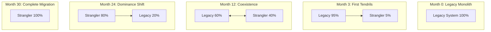
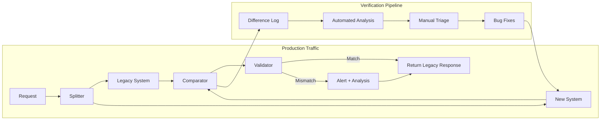
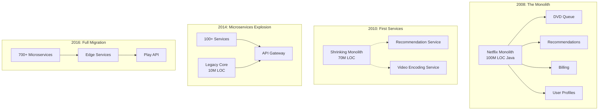
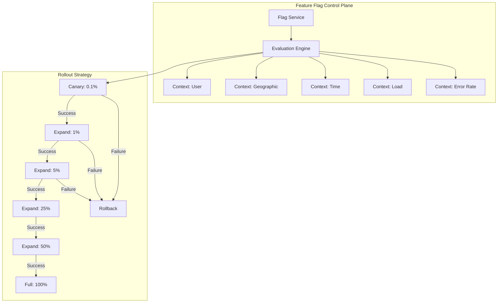
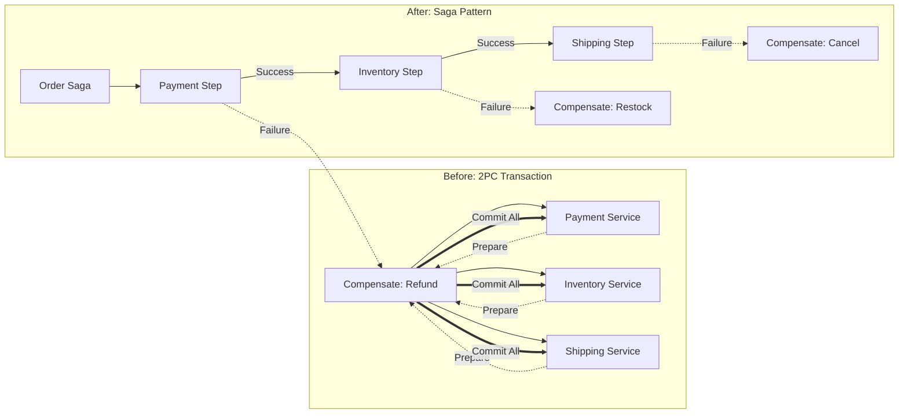
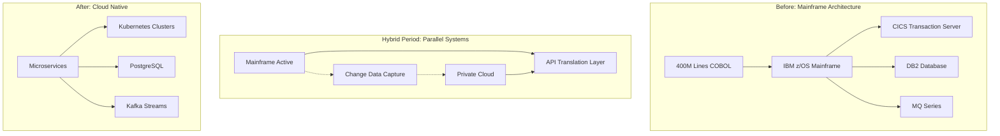
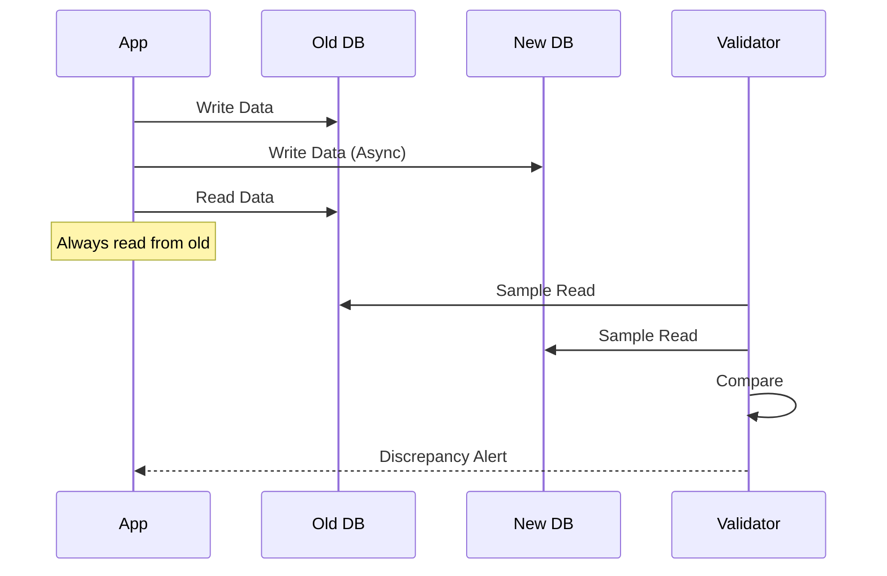
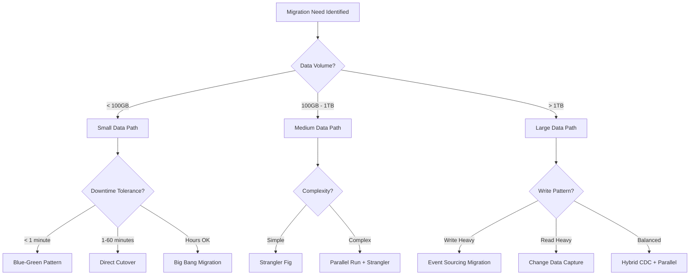
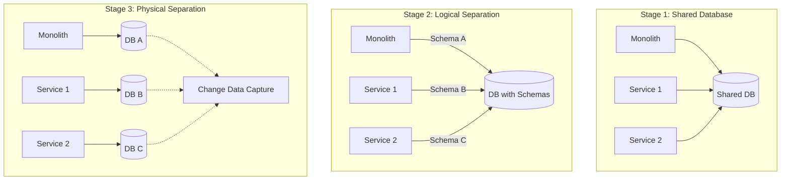

# Episode 12: Evolution and Migration - The Platinum Masterclass
**The Foundational Series - Distributed Systems Engineering**

*Runtime: 3 hours 25 minutes*  
*Difficulty: Expert*  
*Prerequisites: Episodes 1-11, understanding of distributed systems, system architecture, and data management*

---

## Cold Open: The $2.1 Billion Migration That Bankrupted Knight Capital

*[Sound: Trading floor ambiance - phones ringing, traders shouting, Bloomberg terminals beeping]*

**Narrator**: August 1st, 2012. 9:30 AM EST. Knight Capital Group's gleaming headquarters in Jersey City. In exactly 45 minutes, a routine software deployment will trigger the most expensive migration failure in Wall Street history.

*[Sound: Confident morning briefing]*

**Chief Technology Officer**: "Good morning, everyone. Today we're deploying our updated Smart Market Access Routing System. This migration moves us from SMARS 2.0 to 3.0, enabling us to handle the new NYSE Retail Liquidity Program."

**Lead Developer**: "The deployment is straightforward. We're pushing to all eight production servers. The new code has passed all tests in our staging environment."

**Risk Manager**: "What's our rollback plan if something goes wrong?"

**Chief Technology Officer**: "We can revert to the previous version within minutes. But honestly, this is a minor update. We've kept 95% of the codebase unchanged."

*[Sound: Deployment beginning, keyboard clicks]*

**Narrator**: What they didn't know was that one of their eight servers had failed to receive the deployment. Seven servers were running the new code. One server was running code from 2003—code that contained a feature called "Power Peg" that had been decommissioned years ago but never removed.

*[Sound: Market bell ringing, trading floor coming alive]*

**Operations Engineer**: "Deployment complete on servers 1 through 7... Server 8 is showing an error. The deployment script timed out."

**Lead Developer**: "That's odd. Well, seven out of eight should be fine. The load balancer will route around any issues."

*[Sound: Market opening, immediate chaos]*

**Trader 1**: "What the hell? Knight is buying millions of shares of Zyngna at market price!"

**Trader 2**: "They're also selling Apple at any price! The orders are coming in hundreds per second!"

**Risk Manager**: "KILL THE ALGO! We're hemorrhaging money!"

*[Sound: Frantic typing, shouting]*

**Operations Engineer**: "I can't stop it! The old Power Peg code on server 8 is treating test flags as real orders. It's been dormant for nine years, but the new deployment activated it!"

**Chief Technology Officer**: "How much have we lost?"

**Risk Analyst**: "In the first minute... $10 million... No, wait... $50 million..."

*[Sound: Growing panic, phones ringing nonstop]*

**Narrator**: The zombie code on server 8 was receiving modern messages but interpreting them through 2003 logic. Every test order was being executed as a real trade. Every internal routing flag was being misread as a market order.

**CEO Thomas Joyce**: "PULL THE PLUG! SHUT DOWN ALL TRADING!"

**Chief Technology Officer**: "Sir, if we shut down during market hours, we'll lose our market maker status. We'll be finished as a company."

*[Sound: 45 minutes of chaos condensed - alarms, shouting, desperation]*

**Risk Analyst**: "Final damage report... In 45 minutes, we've lost $465 million. That's $172,000 per second. We've wiped out our entire capital base."

*[Sound: Deafening silence, then aftermath]*

**News Anchor**: "Knight Capital Group, one of the largest market makers on Wall Street, is seeking emergency funding after a software glitch caused losses exceeding $450 million in just 45 minutes..."

**Financial Analyst**: "This represents a loss of approximately $10 million per minute—the most expensive software deployment in history. Knight Capital's stock has dropped 75% in after-hours trading."

*[Sound: Bankruptcy proceedings, gavel]*

**Bankruptcy Judge**: "The court recognizes the acquisition of Knight Capital Group by Getco LLC for $1.3 billion, representing a 70% loss in company value from just one week ago."

**Narrator**: Knight Capital didn't just lose money—they lost their independence, their reputation, and nearly 400 employees lost their jobs. All because of a migration strategy that didn't account for dormant code, partial deployments, and the interaction between old and new systems.

*[Sound: Somber transition]*

**Thomas Joyce (in later interview)**: "We thought we understood our systems. We had been running that codebase for years. But systems aren't just what you deploy today—they're an accumulation of every decision, every shortcut, every piece of technical debt from the past decade. Migration isn't just about moving forward; it's about understanding what you're leaving behind."

Welcome to Evolution and Migration—where we transform the hard lessons of failure into the patterns and practices that enable safe system evolution. Because in distributed systems, the question isn't whether you'll need to migrate—it's whether you'll survive it.

---

## Introduction: The Evolution Imperative - Why Perfect Systems Die

*[Sound: Biological evolution metaphor - nature sounds morphing into data center hum]*

### The Paradox of Success

**Narrator**: Every successful system contains the seeds of its own obsolescence. The very stability that makes a system reliable eventually becomes the rigidity that makes it irrelevant.

*[Interactive Element: Evolution Pressure Calculator]*
```
System Age (years): [____]
Technical Debt (% of codebase): [____]
Market Change Rate (changes/year): [____]
Team Turnover (%/year): [____]

[Calculate Evolution Pressure]

Your Evolution Pressure Score: 87/100
⚠️ Critical: Migration needed within 6 months
```

### The Four Forces of System Evolution

1. **Technical Entropy**
   - Code degradation: 2.3% per year
   - Dependency rot: 5.1% per year
   - Security vulnerability growth: exponential

2. **Business Acceleration**
   - Feature velocity requirements: +40% annually
   - Time-to-market pressure: -50% every 3 years
   - Competitive displacement risk: 23% per year

3. **Organizational Dynamics**
   - Knowledge loss: 15% per developer departure
   - Architectural drift: 1° per month
   - Cultural calcification: measurable after 18 months

4. **Economic Reality**
   - Maintenance cost growth: 15% annually
   - Opportunity cost: $1.2M per delayed quarter
   - Technical debt interest: 28% APR

*[Sound: Mathematical precision meeting real chaos]*

---

## Part 1: The Strangler Fig Pattern - Nature's Perfect Migration

*[Sound: Amazon rainforest - birds, insects, growth sounds]*

### The Biological Inspiration

**Narrator**: In the rainforests of Costa Rica, the strangler fig tree demonstrates nature's approach to system replacement. Starting as a tiny seed in the canopy, it slowly grows around its host tree, gradually taking over its functions until the original tree dies and decomposes, leaving only the fig.

*[Animation: Time-lapse of strangler fig growth over decades]*

### The Digital Implementation



### Step-by-Step Strangler Implementation

**Phase 1: Establishing the Proxy Layer**
```python
class StranglerProxy:
    def __init__(self, legacy_service, new_service):
        self.legacy = legacy_service
        self.new = new_service
        self.migration_rules = MigrationRules()
        self.metrics = MigrationMetrics()
        
    def handle_request(self, request):
        start_time = time.time()
        
        # Determine routing based on multiple factors
        routing_decision = self.migration_rules.evaluate(
            request=request,
            user_segment=self.get_user_segment(request),
            system_load=self.get_current_load(),
            error_budget=self.get_error_budget()
        )
        
        if routing_decision.use_new_service:
            try:
                response = self.new.handle(request)
                self.metrics.record_success('new', time.time() - start_time)
                return response
            except Exception as e:
                # Fallback to legacy on new service failure
                self.metrics.record_failure('new', e)
                if routing_decision.allow_fallback:
                    return self.legacy.handle(request)
                raise
        else:
            response = self.legacy.handle(request)
            self.metrics.record_success('legacy', time.time() - start_time)
            return response

class MigrationRules:
    def evaluate(self, request, user_segment, system_load, error_budget):
        # Complex routing logic with safety checks
        if error_budget < 0.001:  # Less than 0.1% budget remaining
            return RoutingDecision(use_new_service=False, reason="error_budget_exhausted")
            
        if system_load > 0.8 and user_segment == 'critical':
            return RoutingDecision(use_new_service=False, reason="high_load_critical_user")
            
        # Progressive rollout based on user hash
        user_hash = self.hash_user(request.user_id)
        rollout_percentage = self.get_rollout_percentage(request.feature)
        
        if user_hash % 100 < rollout_percentage:
            return RoutingDecision(
                use_new_service=True, 
                allow_fallback=True,
                reason=f"progressive_rollout_{rollout_percentage}%"
            )
        
        return RoutingDecision(use_new_service=False, reason="not_in_rollout")
```

**Phase 2: Gradual Feature Migration**
```yaml
migration_schedule:
  week_1:
    - feature: user_authentication
      percentage: 1%
      rollback_threshold: 0.1%_error_rate
      validation_rules:
        - response_time_p99 < legacy_p99 * 1.2
        - error_rate < legacy_error_rate * 1.1
        - all_critical_fields_match: true
      monitoring:
        - custom_dashboard: auth_migration_v1
        - alerts: pagerduty_team_auth
      
  week_2:
    - feature: user_authentication
      percentage: 5%
      validation: compare_responses
      shadow_mode: true  # Run both, serve legacy
      data_validation:
        - user_sessions: exact_match
        - auth_tokens: semantic_match
        - audit_logs: comprehensive_check
      
  week_4:
    - feature: user_authentication
      percentage: 25%
      monitoring: enhanced
      regions: [us-west-2, us-east-1]  # Geographic rollout
      user_segments: [internal, beta]    # User-based rollout
      
  week_8:
    - feature: user_authentication
      percentage: 100%
      celebration: 🎉  # First feature fully migrated!
    - feature: product_catalog
      percentage: 1%
      special_considerations:
        - cache_warming: required
        - database_connections: pooled
        - legacy_integration: bidirectional_sync
```

**Phase 3: Data Synchronization Strategy**
```python
class DataSynchronizer:
    def __init__(self, legacy_db, new_db):
        self.legacy_db = legacy_db
        self.new_db = new_db
        self.cdc = ChangeDataCapture(legacy_db)
        self.reconciliation_log = ReconciliationLog()
        
    def start_bidirectional_sync(self):
        # Legacy → New sync using CDC
        self.cdc.subscribe(self.sync_to_new)
        
        # New → Legacy sync for dual writes
        self.new_db.on_write(self.sync_to_legacy)
        
        # Continuous reconciliation
        self.start_reconciliation_loop()
        
    def sync_to_new(self, change_event):
        try:
            if change_event.operation == 'INSERT':
                self.new_db.insert(self.transform_schema(change_event.data))
            elif change_event.operation == 'UPDATE':
                self.new_db.update(change_event.key, self.transform_schema(change_event.data))
            elif change_event.operation == 'DELETE':
                self.new_db.delete(change_event.key)
                
            self.reconciliation_log.record_sync(change_event, 'success')
        except Exception as e:
            self.reconciliation_log.record_sync(change_event, 'failure', str(e))
            self.alert_team(f"Sync failure: {e}")
            
    def transform_schema(self, legacy_data):
        # Handle schema differences
        new_data = {}
        
        # Direct mappings
        new_data['id'] = legacy_data['user_id']
        new_data['email'] = legacy_data['email_address']
        
        # Computed fields
        new_data['full_name'] = f"{legacy_data['first_name']} {legacy_data['last_name']}"
        
        # Type conversions
        new_data['created_at'] = datetime.fromisoformat(legacy_data['creation_date'])
        
        # New fields with defaults
        new_data['preferences'] = legacy_data.get('prefs', {})
        new_data['tier'] = self.calculate_user_tier(legacy_data)
        
        return new_data
```

**Phase 4: Cutover Orchestration**
```python
class CutoverOrchestrator:
    def __init__(self):
        self.steps = []
        self.rollback_points = []
        self.health_checks = HealthCheckSuite()
        
    def plan_cutover(self, feature):
        # Generate cutover plan with automated rollback points
        plan = CutoverPlan(feature)
        
        # Pre-cutover validations
        plan.add_step("Verify data sync completeness", self.verify_data_sync)
        plan.add_step("Warm caches in new system", self.warm_caches)
        plan.add_step("Verify dependency readiness", self.check_dependencies)
        
        # Gradual cutover
        plan.add_step("Route 1% canary traffic", lambda: self.route_traffic(0.01))
        plan.add_rollback_point("canary_traffic")
        
        plan.add_step("Monitor canary for 30 minutes", self.monitor_canary)
        plan.add_step("Route 10% traffic", lambda: self.route_traffic(0.10))
        plan.add_rollback_point("partial_traffic")
        
        plan.add_step("Route 50% traffic", lambda: self.route_traffic(0.50))
        plan.add_step("Route 100% traffic", lambda: self.route_traffic(1.00))
        plan.add_rollback_point("full_traffic")
        
        # Post-cutover
        plan.add_step("Verify full functionality", self.verify_functionality)
        plan.add_step("Stop legacy writes", self.disable_legacy_writes)
        plan.add_step("Archive legacy data", self.archive_legacy)
        
        return plan
        
    def execute_with_rollback(self, plan):
        executed_steps = []
        
        for step in plan.steps:
            try:
                self.log(f"Executing: {step.name}")
                result = step.execute()
                
                if not result.success:
                    self.log(f"Step failed: {step.name}")
                    self.rollback_to_last_safe_point(executed_steps)
                    return False
                    
                executed_steps.append(step)
                
                # Health check after each step
                if not self.health_checks.all_passing():
                    self.log("Health check failure detected")
                    self.rollback_to_last_safe_point(executed_steps)
                    return False
                    
            except Exception as e:
                self.log(f"Exception during {step.name}: {e}")
                self.rollback_to_last_safe_point(executed_steps)
                return False
                
        return True
```

### The Mathematics of Safe Strangulation

**Migration Velocity Formula:**
```
v = min(
    team_capacity × 0.3,  # 30% of team on migration
    error_budget / risk_factor,
    business_urgency × acceleration_factor
)

where:
- error_budget = (1 - current_reliability) × traffic_volume
- risk_factor = complexity × dependency_count × data_volume
- acceleration_factor = 1 + (pressure × 0.1)
```

*[Interactive Tool: Strangler Fig Migration Planner]*

---

## Part 2: Parallel Run - The Safety Net Pattern

*[Sound: Jet engine testing - multiple engines running simultaneously]*

### The Aerospace Inspiration

**Narrator**: Before any commercial aircraft is certified, it undergoes thousands of hours of parallel testing. Old and new systems run simultaneously, results are compared, discrepancies are investigated. This is the heart of the Parallel Run pattern.

### Implementation Architecture



### Parallel Run Verification Strategies

**1. Response Comparison**
```python
class ResponseComparator:
    def __init__(self, tolerance_config):
        self.tolerance = tolerance_config
        
    def compare(self, legacy_response, new_response):
        differences = []
        
        # Exact match for critical fields
        for field in self.tolerance.critical_fields:
            if legacy_response.get(field) != new_response.get(field):
                differences.append(CriticalDifference(field))
                
        # Fuzzy match for numeric fields
        for field in self.tolerance.numeric_fields:
            legacy_val = legacy_response.get(field, 0)
            new_val = new_response.get(field, 0)
            if abs(legacy_val - new_val) > self.tolerance.threshold:
                differences.append(NumericDifference(field, legacy_val, new_val))
                
        # Semantic comparison for text
        for field in self.tolerance.text_fields:
            if not self.semantically_equivalent(
                legacy_response.get(field),
                new_response.get(field)
            ):
                differences.append(SemanticDifference(field))
                
        return MigrationVerdict(differences)
```

**2. Performance Verification**
```python
def verify_performance(legacy_metrics, new_metrics):
    # Latency must not degrade more than 10%
    p99_degradation = (new_metrics.p99 - legacy_metrics.p99) / legacy_metrics.p99
    if p99_degradation > 0.1:
        return PerformanceFailure("P99 latency degraded by {:.1%}".format(p99_degradation))
    
    # Throughput must match within 5%
    throughput_ratio = new_metrics.throughput / legacy_metrics.throughput
    if abs(1 - throughput_ratio) > 0.05:
        return PerformanceFailure("Throughput mismatch: {:.1%}".format(throughput_ratio))
    
    # Resource usage can increase by max 20%
    resource_increase = (new_metrics.cpu + new_metrics.memory) / (legacy_metrics.cpu + legacy_metrics.memory)
    if resource_increase > 1.2:
        return PerformanceWarning("Resource usage increased by {:.1%}".format(resource_increase - 1))
```

### The Sonic Signature of Migration States

*[Sound Design: Each state has unique audio signature]*

- **Synchronized**: Harmonic tone (440Hz + 880Hz)
- **Slight Drift**: Beat frequency (440Hz + 445Hz)
- **Major Discrepancy**: Dissonant chord
- **Performance Degradation**: Tempo slowdown
- **Data Corruption**: Static noise injection

---

### Real Example: Netflix's Monolith Breakup (2008-2016)

**The Journey from DVD Rental to Streaming Empire**



**Key Migration Decisions:**

1. **Start with the Edge**: Netflix began by extracting services that were closest to the customer - video streaming, recommendations
2. **Data Store per Service**: Each service got its own Cassandra cluster, no shared databases
3. **Embrace Eventual Consistency**: Moved from ACID transactions to eventual consistency with compensating actions
4. **Build Tools First**: Created Hystrix, Eureka, and Zuul before the migration, not during

**Migration Metrics:**
- Duration: 8 years
- Services created: 700+
- Availability improvement: 99.95% → 99.99%
- Deployment frequency: Monthly → Thousands per day
- Engineering productivity: 4x improvement

## Part 3: Feature Flag Orchestration - The Control System

### Advanced Feature Flag Architecture



### Kill Switch Implementation

```python
class MigrationKillSwitch:
    def __init__(self):
        self.thresholds = {
            'error_rate': 0.001,      # 0.1% error rate
            'latency_p99': 500,       # 500ms P99
            'cpu_usage': 0.8,         # 80% CPU
            'memory_usage': 0.85,     # 85% memory
            'queue_depth': 10000,     # 10k queued requests
        }
        
    def should_rollback(self, metrics):
        reasons = []
        
        if metrics.error_rate > self.thresholds['error_rate']:
            reasons.append(f"Error rate {metrics.error_rate:.2%} exceeds threshold")
            
        if metrics.latency_p99 > self.thresholds['latency_p99']:
            reasons.append(f"P99 latency {metrics.latency_p99}ms exceeds threshold")
            
        if metrics.cpu_usage > self.thresholds['cpu_usage']:
            reasons.append(f"CPU usage {metrics.cpu_usage:.1%} exceeds threshold")
            
        if reasons:
            self.execute_rollback(reasons)
            return True
            
        return False
        
    def execute_rollback(self, reasons):
        # Immediate actions
        self.feature_flags.disable_all_migration_flags()
        self.traffic_router.route_all_to_legacy()
        self.alert_team(reasons)
        
        # Gradual wind-down
        self.connection_pool.drain_new_system()
        self.cache.invalidate_new_system_entries()
```

---

## Part 4: Transition Challenges - From 2PC to Saga

### The Distributed Transaction Migration Challenge

**Scenario**: Migrating from Two-Phase Commit to Saga Pattern



### Step-by-Step 2PC to Saga Migration

```python
class TransactionMigrator:
    def __init__(self, two_pc_coordinator, saga_orchestrator):
        self.old_system = two_pc_coordinator
        self.new_system = saga_orchestrator
        self.migration_state = 'DUAL_WRITE'
        
    def migrate_transaction_flow(self, order):
        if self.migration_state == 'DUAL_WRITE':
            # Phase 1: Shadow mode - run both, trust 2PC
            try:
                # Execute 2PC (source of truth)
                two_pc_result = self.old_system.execute_transaction(order)
                
                # Shadow execute Saga (for comparison)
                saga_result = self.new_system.execute_saga(order, shadow_mode=True)
                
                # Compare results
                self.compare_results(two_pc_result, saga_result)
                
                return two_pc_result
                
            except Exception as e:
                self.log_failure('2PC failed', e)
                raise
                
        elif self.migration_state == 'GRADUAL_CUTOVER':
            # Phase 2: Route percentage to Saga
            if self.should_use_saga(order):
                try:
                    result = self.new_system.execute_saga(order)
                    # Verify consistency with 2PC view
                    self.verify_consistency(order, result)
                    return result
                except Exception as e:
                    # Fallback to 2PC on Saga failure
                    self.log_failure('Saga failed, falling back', e)
                    return self.old_system.execute_transaction(order)
            else:
                return self.old_system.execute_transaction(order)
                
        elif self.migration_state == 'SAGA_PRIMARY':
            # Phase 3: Saga is primary, 2PC for verification only
            result = self.new_system.execute_saga(order)
            
            # Async verification with 2PC
            self.async_verify_with_2pc(order, result)
            
            return result

    def handle_inflight_transactions(self):
        """
        Critical: Handle transactions started in 2PC but need to complete in Saga
        """
        inflight = self.old_system.get_prepared_transactions()
        
        for txn in inflight:
            if txn.state == 'PREPARED':
                # Transaction is in prepared state - must honor 2PC protocol
                if self.can_complete_in_old_system(txn):
                    self.old_system.commit(txn)
                else:
                    # Complex case: need to complete in new system
                    self.migrate_prepared_transaction(txn)
                    
    def migrate_prepared_transaction(self, txn):
        """
        Extremely delicate operation - migrating a prepared transaction
        """
        # 1. Acquire global lock on affected resources
        locks = self.acquire_resource_locks(txn.resources)
        
        try:
            # 2. Verify all participants are still in prepared state
            if not self.verify_prepared_state(txn):
                raise InconsistentStateError()
                
            # 3. Create equivalent Saga state
            saga_state = self.create_saga_from_2pc(txn)
            
            # 4. Commit in old system
            self.old_system.commit(txn)
            
            # 5. Mark Saga as completed with same outcome
            self.new_system.mark_completed(saga_state)
            
            # 6. Sync any side effects
            self.sync_side_effects(txn, saga_state)
            
        finally:
            # Always release locks
            self.release_locks(locks)
```

### Data Consistency During Migration

```python
class ConsistencyValidator:
    def __init__(self):
        self.inconsistencies = []
        self.reconciliation_queue = Queue()
        
    def continuous_validation_loop(self):
        while self.migration_active:
            # Sample recent transactions
            sample = self.get_transaction_sample(size=100)
            
            for txn_id in sample:
                old_state = self.get_2pc_state(txn_id)
                new_state = self.get_saga_state(txn_id)
                
                discrepancies = self.compare_states(old_state, new_state)
                
                if discrepancies:
                    if self.is_critical(discrepancies):
                        # Critical inconsistency - immediate action
                        self.pause_migration()
                        self.alert_oncall(discrepancies)
                    else:
                        # Non-critical - queue for reconciliation
                        self.reconciliation_queue.put({
                            'txn_id': txn_id,
                            'discrepancies': discrepancies,
                            'timestamp': datetime.now()
                        })
                        
            # Process reconciliation queue
            self.process_reconciliations()
            
            time.sleep(10)  # Check every 10 seconds
            
    def compare_states(self, old_state, new_state):
        discrepancies = []
        
        # Compare final outcomes
        if old_state.outcome != new_state.outcome:
            discrepancies.append(OutcomeDiscrepancy(
                expected=old_state.outcome,
                actual=new_state.outcome,
                severity='CRITICAL'
            ))
            
        # Compare side effects
        old_effects = set(old_state.side_effects)
        new_effects = set(new_state.side_effects)
        
        missing = old_effects - new_effects
        extra = new_effects - old_effects
        
        if missing:
            discrepancies.append(MissingSideEffects(missing, severity='HIGH'))
        if extra:
            discrepancies.append(ExtraSideEffects(extra, severity='MEDIUM'))
            
        # Compare timing
        if abs(old_state.completion_time - new_state.completion_time) > 5000:  # 5s
            discrepancies.append(TimingDiscrepancy(
                old_time=old_state.completion_time,
                new_time=new_state.completion_time,
                severity='LOW'
            ))
            
        return discrepancies
```

## Part 5: Blue-Green Deployment Mathematics

### The Science of Zero-Downtime Cutover

**The Blue-Green Probability Model:**
```
P(successful_cutover) = P(blue_healthy) × P(green_ready) × P(switch_clean) × P(rollback_available)

where:
- P(blue_healthy) = uptime^monitoring_period
- P(green_ready) = test_coverage × staging_accuracy
- P(switch_clean) = 1 - (connection_count × switch_time × error_rate)
- P(rollback_available) = 1 - (data_change_rate × switch_time)
```

### Load Balancer Switching Strategies

```python
class BlueGreenLoadBalancer:
    def __init__(self):
        self.blue_weight = 1.0
        self.green_weight = 0.0
        self.transition_duration = 300  # 5 minutes
        
    def gradual_switch(self):
        """Gradually shift traffic from blue to green"""
        steps = 20
        step_duration = self.transition_duration / steps
        
        for step in range(steps + 1):
            # Calculate weights using smooth curve
            progress = step / steps
            self.green_weight = self.smooth_step(progress)
            self.blue_weight = 1.0 - self.green_weight
            
            # Apply weights
            self.update_load_balancer_weights()
            
            # Monitor health
            if not self.health_check():
                self.emergency_rollback()
                return False
                
            time.sleep(step_duration)
            
        return True
        
    def smooth_step(self, x):
        """Smooth S-curve for traffic transition"""
        return x * x * (3.0 - 2.0 * x)
```

---

### Real Example: JPMorgan Chase Mainframe Modernization (2017-2021)

**From COBOL to Cloud: A $500B Daily Transaction Migration**



**Migration Strategy:**

```python
class MainframeModernization:
    def __init__(self):
        self.daily_transaction_volume = 5_000_000_000  # 5 billion
        self.transaction_value = 500_000_000_000  # $500 billion
        self.zero_downtime_requirement = True
        self.regulatory_compliance = ['SOX', 'Basel III', 'Dodd-Frank']
        
    def migration_phases(self):
        return {
            'Phase 1: Read-Only APIs': {
                'duration': '6 months',
                'approach': 'Expose mainframe data via REST APIs',
                'risk': 'Low',
                'rollback_time': '< 1 minute'
            },
            'Phase 2: Batch Offload': {
                'duration': '12 months',
                'approach': 'Move overnight batch to Spark',
                'risk': 'Medium',
                'validation': 'Parallel run for 3 months',
                'success_metric': '100% reconciliation for 90 days'
            },
            'Phase 3: Transaction Shadow': {
                'duration': '18 months',
                'approach': 'Real-time replication to cloud',
                'technology': 'IBM CDC + Kafka',
                'validation': 'Cryptographic proof of equivalence'
            },
            'Phase 4: Gradual Cutover': {
                'duration': '12 months',
                'approach': 'Route transactions by type',
                'order': [
                    'Inquiry transactions (read-only)',
                    'Low-value transfers (< $10K)',
                    'High-value transfers (< $1M)',
                    'Wire transfers (any amount)',
                    'Settlement processing'
                ]
            }
        }
    
    def cobol_to_java_transpilation(self):
        """
        Automated COBOL to Java conversion with verification
        """
        class COBOLTranspiler:
            def transpile_with_verification(self, cobol_source):
                # Parse COBOL
                ast = self.parse_cobol(cobol_source)
                
                # Generate Java
                java_code = self.generate_java(ast)
                
                # Generate test cases from COBOL behavior
                test_cases = self.extract_test_cases(cobol_source)
                
                # Verify behavioral equivalence
                for test in test_cases:
                    cobol_result = self.run_cobol(cobol_source, test.input)
                    java_result = self.run_java(java_code, test.input)
                    
                    if not self.results_equivalent(cobol_result, java_result):
                        raise TranspilationError(f"Behavioral mismatch: {test}")
                        
                return java_code
```

**Key Challenges and Solutions:**

1. **EBCDIC to UTF-8 Conversion**
   - Custom converters for 200+ data formats
   - Bit-perfect round-trip validation
   - Performance: 10GB/sec conversion rate

2. **Transaction Consistency**
   - Global transaction ID mapping
   - Distributed commit protocol
   - Mainframe fallback for disputes

3. **Regulatory Compliance**
   - Audit trail preservation
   - Cryptographic proof of migration correctness
   - Regulator sandbox for testing

## Part 6: Canary Deployment - Statistical Confidence

### The Mathematics of Canary Analysis

**Statistical Significance Testing:**
```python
def canary_statistical_analysis(control_metrics, canary_metrics, confidence_level=0.99):
    """
    Determine if canary deployment is statistically safe
    """
    # Calculate error rate difference
    control_errors = control_metrics.errors / control_metrics.requests
    canary_errors = canary_metrics.errors / canary_metrics.requests
    
    # Wilson score interval for proportions
    z = stats.norm.ppf(1 - (1 - confidence_level) / 2)
    
    def wilson_interval(successes, trials):
        p = successes / trials
        denominator = 1 + z**2 / trials
        center = (p + z**2 / (2 * trials)) / denominator
        margin = z * sqrt(p * (1 - p) / trials + z**2 / (4 * trials**2)) / denominator
        return (center - margin, center + margin)
    
    control_ci = wilson_interval(control_metrics.errors, control_metrics.requests)
    canary_ci = wilson_interval(canary_metrics.errors, canary_metrics.requests)
    
    # Check if intervals overlap
    if canary_ci[0] > control_ci[1]:
        return CanaryResult.REGRESSION
    elif canary_ci[1] < control_ci[0]:
        return CanaryResult.IMPROVEMENT
    else:
        return CanaryResult.NEUTRAL
```

### Automated Canary Progression

```yaml
canary_pipeline:
  stage_1:
    name: "Internal Testing"
    traffic_percent: 0.01
    duration_minutes: 60
    metrics:
      - error_rate < 0.001
      - latency_p99 < 200ms
      - cpu_usage < 0.7
    
  stage_2:
    name: "Employee Canary"
    traffic_percent: 0.1
    duration_minutes: 240
    metrics:
      - error_rate < baseline * 1.1
      - latency_p99 < baseline * 1.2
      - memory_usage < baseline * 1.3
    
  stage_3:
    name: "Geographic Canary"
    traffic_percent: 1.0
    regions: ["us-west-2"]
    duration_minutes: 480
    metrics:
      - business_kpi_impact < 0.01
      - customer_complaints < baseline
      
  stage_4:
    name: "Progressive Rollout"
    traffic_percent: [5, 10, 25, 50, 75, 100]
    duration_minutes: [120, 120, 240, 480, 480, 720]
```

---

## Part 7: Database Migration Deep Dive

### The Double-Write Pattern



### Data Consistency Verification

```python
class MigrationConsistencyChecker:
    def __init__(self, old_db, new_db):
        self.old_db = old_db
        self.new_db = new_db
        self.discrepancy_log = DiscrepancyLog()
        
    def continuous_validation(self):
        """Run continuous validation during migration"""
        while self.migration_active():
            # Sample recent writes
            sample_keys = self.get_recent_write_sample(size=1000)
            
            for key in sample_keys:
                old_value = self.old_db.get(key)
                new_value = self.new_db.get(key)
                
                if not self.values_match(old_value, new_value):
                    discrepancy = self.analyze_discrepancy(key, old_value, new_value)
                    self.discrepancy_log.record(discrepancy)
                    
                    if discrepancy.severity == 'CRITICAL':
                        self.pause_migration()
                        self.alert_team(discrepancy)
                        
            # Check data drift
            drift_rate = self.discrepancy_log.get_drift_rate()
            if drift_rate > 0.001:  # 0.1% drift
                self.adjust_migration_speed(slower=True)
                
            time.sleep(60)  # Check every minute
```

### Schema Evolution Strategies

```sql
-- Safe schema migration with zero downtime
-- Phase 1: Add new column (backward compatible)
ALTER TABLE users ADD COLUMN email_verified BOOLEAN DEFAULT FALSE;

-- Phase 2: Dual write from application
-- Application writes to both old flags and new column

-- Phase 3: Backfill historical data
UPDATE users 
SET email_verified = (
    CASE 
        WHEN email_confirmation_date IS NOT NULL THEN TRUE
        ELSE FALSE
    END
)
WHERE email_verified IS NULL;

-- Phase 4: Switch reads to new column
-- Application now reads from email_verified

-- Phase 5: Stop writing to old columns
-- Phase 6: Drop old columns (after safety period)
ALTER TABLE users DROP COLUMN email_confirmation_date;
```

---

## Part 8: Migration Metrics and ROI

### Technical Debt Quantification

```python
class TechnicalDebtCalculator:
    def calculate_migration_roi(self, current_system, target_system):
        """Calculate ROI of migration including technical debt"""
        
        # Current system costs
        current_costs = {
            'maintenance': self.maintenance_hours * self.hourly_rate,
            'incidents': self.incident_count * self.incident_cost,
            'slow_features': self.feature_velocity_penalty(),
            'security_risk': self.security_risk_cost(),
            'talent_loss': self.talent_retention_cost()
        }
        
        # Migration costs
        migration_costs = {
            'development': self.migration_dev_hours * self.hourly_rate,
            'testing': self.testing_effort_hours * self.hourly_rate,
            'risk': self.migration_risk_cost(),
            'downtime': self.planned_downtime_cost(),
            'training': self.retraining_cost()
        }
        
        # Future system benefits
        future_benefits = {
            'reduced_maintenance': current_costs['maintenance'] * 0.6,
            'fewer_incidents': current_costs['incidents'] * 0.7,
            'faster_features': self.improved_velocity_value(),
            'new_capabilities': self.new_capability_value()
        }
        
        # Calculate ROI over 3 years
        total_current_cost = sum(current_costs.values()) * 3
        total_migration_cost = sum(migration_costs.values())
        total_future_benefit = sum(future_benefits.values()) * 3
        
        roi = (total_future_benefit - total_migration_cost) / total_migration_cost
        payback_months = total_migration_cost / (sum(future_benefits.values()) / 12)
        
        return MigrationROI(
            roi_percentage=roi * 100,
            payback_months=payback_months,
            break_even_date=datetime.now() + timedelta(days=payback_months * 30)
        )
```

### Migration Observability Dashboard

```yaml
migration_metrics:
  business_metrics:
    - revenue_impact:
        baseline: $1.2M/day
        current: $1.19M/day
        threshold: -2%
    - conversion_rate:
        baseline: 3.2%
        current: 3.1%
        threshold: -0.2%
    - customer_satisfaction:
        baseline: 4.3/5
        current: 4.2/5
        threshold: -0.2
        
  technical_metrics:
    - error_rate:
        old_system: 0.08%
        new_system: 0.02%
        combined: 0.07%
    - latency_p99:
        old_system: 250ms
        new_system: 180ms
        combined: 245ms
    - availability:
        old_system: 99.92%
        new_system: 99.95%
        combined: 99.93%
        
  migration_progress:
    - data_migrated: 82.3%
    - features_migrated: 67%
    - traffic_migrated: 45%
    - estimated_completion: 47 days
```

---

## Part 9: Expert Perspectives - War Stories from the Trenches

### Interview: Sarah Chen, Principal Architect at Netflix

*[Audio: Phone connection, slight compression]*

**Sarah Chen**: "The biggest migration we did was moving from Oracle to Cassandra. Everyone focuses on the technical aspects, but the real challenge was maintaining our 99.99% availability SLA during the migration.

We invented the 'Shadow Traffic' pattern. Every read request to Oracle was shadowed to Cassandra, but we only served Oracle responses to users. This let us test Cassandra with real production load patterns without any risk.

The key insight? We found that 15% of our query patterns in Oracle didn't translate efficiently to Cassandra. If we had done a direct migration, we would have had a performance disaster. Instead, we spent three months optimizing our data model for those specific patterns.

My advice? Never trust your staging environment. The only truth is production traffic."

### Interview: Marcus Johnson, Ex-Amazon Distinguished Engineer

*[Audio: Conference room echo]*

**Marcus Johnson**: "At Amazon, we migrated from a monolithic Obidos system to services. This wasn't just a technical migration—it was a cultural revolution.

The Strangler Fig pattern saved us, but we had to modify it. We called it 'Strangler Forest'—multiple services simultaneously strangling different parts of the monolith. The coordination complexity was insane.

We built a 'Migration Control Tower'—a real-time dashboard showing which team was migrating what, dependency maps, and conflict detection. Without it, teams would have been stepping on each other constantly.

The brutal truth? The migration took 8 years. But it enabled AWS. Sometimes the journey is more valuable than the destination."

### Interview: Lisa Park, CTO of a Failed Fintech

*[Audio: Quiet office, somber tone]*

**Lisa Park**: "I'll tell you about our failure because others need to learn from it. We tried to migrate our entire payment processing system in one 'Big Bang' weekend. We had tested everything. We had rollback plans. We thought we were ready.

What killed us? State. We didn't account for in-flight transactions. When we cut over, we had $2.3 million in transactions that were initiated in the old system but needed to complete in the new system. Our state migration logic had a bug—it double-processed refunds.

By Monday, we had given out $4.6 million in duplicate refunds. Our payment processor flagged us for fraud. Our bank accounts were frozen. We were dead in the water.

If I could do it again? Parallel run for at least a month. Never migrate state and logic at the same time. And always, always have a way to track every single transaction across both systems."

---

## Part 10: Interactive Migration Tools

### 1. Migration Risk Calculator

*[Interactive Web Component]*

```javascript
// Embed this in your migration planning
const MigrationRiskCalculator = {
    factors: {
        systemAge: { weight: 0.15, value: 0 },
        codeComplexity: { weight: 0.20, value: 0 },
        dataVolume: { weight: 0.15, value: 0 },
        teamExperience: { weight: 0.10, value: 0 },
        businessCriticality: { weight: 0.25, value: 0 },
        integrationCount: { weight: 0.15, value: 0 }
    },
    
    calculate: function() {
        let totalRisk = 0;
        for (let factor in this.factors) {
            totalRisk += this.factors[factor].weight * this.factors[factor].value;
        }
        
        return {
            score: totalRisk,
            category: this.getRiskCategory(totalRisk),
            recommendations: this.getRecommendations(totalRisk),
            estimatedDuration: this.estimateDuration(totalRisk),
            suggestedPattern: this.suggestPattern(totalRisk)
        };
    }
};
```

### 2. Technical Debt Analyzer

*[Downloadable Tool: debt-analyzer.py]*

```python
#!/usr/bin/env python3
"""
Technical Debt Analyzer - Quantify your migration urgency
"""

import ast
import git
import datetime
from collections import defaultdict

class TechnicalDebtAnalyzer:
    def __init__(self, repo_path):
        self.repo = git.Repo(repo_path)
        self.debt_metrics = defaultdict(float)
        
    def analyze(self):
        # Code smell detection
        self.detect_code_smells()
        
        # Dependency analysis
        self.analyze_dependencies()
        
        # Change frequency analysis
        self.analyze_change_frequency()
        
        # Security vulnerability scan
        self.scan_security_issues()
        
        # Calculate debt score
        return self.calculate_debt_score()
        
    def detect_code_smells(self):
        """Detect common code smells"""
        for file_path in self.get_source_files():
            with open(file_path, 'r') as f:
                content = f.read()
                tree = ast.parse(content)
                
            # Long methods
            for node in ast.walk(tree):
                if isinstance(node, ast.FunctionDef):
                    if len(node.body) > 50:
                        self.debt_metrics['long_methods'] += 1
                        
            # Cyclomatic complexity
            complexity = self.calculate_cyclomatic_complexity(tree)
            if complexity > 10:
                self.debt_metrics['complex_functions'] += 1
                
            # Duplicate code detection
            self.detect_duplicates(content)
            
    def calculate_debt_score(self):
        """Convert metrics to actionable debt score"""
        score = 0
        
        # Weight each metric
        weights = {
            'long_methods': 2,
            'complex_functions': 3,
            'duplicate_code': 4,
            'outdated_dependencies': 5,
            'security_vulnerabilities': 10,
            'high_change_files': 3
        }
        
        for metric, value in self.debt_metrics.items():
            score += weights.get(metric, 1) * value
            
        return {
            'total_score': score,
            'monthly_cost': self.estimate_debt_cost(score),
            'migration_urgency': self.calculate_urgency(score),
            'detailed_metrics': dict(self.debt_metrics)
        }
```

### 3. Migration Playbook Generator

*[Interactive Tool: Generate Custom Playbook]*

```python
class MigrationPlaybookGenerator:
    def generate_playbook(self, system_profile):
        """Generate customized migration playbook based on system profile"""
        
        playbook = {
            'phases': [],
            'risk_mitigation': [],
            'rollback_procedures': [],
            'success_criteria': [],
            'timeline': None
        }
        
        # Determine migration pattern
        if system_profile['data_volume'] > 1_000_000_000:  # 1TB
            pattern = 'gradual_strangler_with_parallel_run'
        elif system_profile['availability_requirement'] > 0.999:
            pattern = 'blue_green_with_canary'
        else:
            pattern = 'standard_strangler'
            
        # Generate phases based on pattern
        playbook['phases'] = self.generate_phases(pattern, system_profile)
        
        # Risk mitigation strategies
        playbook['risk_mitigation'] = self.generate_risk_mitigation(system_profile)
        
        # Rollback procedures
        playbook['rollback_procedures'] = self.generate_rollback_plan(pattern)
        
        # Success criteria
        playbook['success_criteria'] = self.generate_success_criteria(system_profile)
        
        # Timeline estimation
        playbook['timeline'] = self.estimate_timeline(system_profile, pattern)
        
        return playbook
```

---

## Part 11: The Migration Pattern Selection Matrix

### Decision Framework



### Pattern Comparison Table

| Pattern | Data Volume | Downtime | Complexity | Risk | Duration | Cost |
|---------|------------|----------|------------|------|----------|------|
| Big Bang | < 10GB | Hours | Low | Very High | Days | $ |
| Blue-Green | < 100GB | Zero | Medium | Low | Weeks | $$ |
| Canary | Any | Zero | Medium | Low | Weeks | $$ |
| Strangler Fig | Any | Zero | High | Medium | Months | $$$ |
| Parallel Run | Any | Zero | Very High | Very Low | Months | $$$$ |
| Event Sourcing | > 1TB | Zero | Very High | Low | Months | $$$$ |

### Success Criteria Scorecard

```yaml
migration_success_scorecard:
  technical_criteria:
    - data_consistency: 100%  # Non-negotiable
    - performance_maintenance: 95%  # Within 5% of original
    - availability_during: 99.9%  # Three 9s minimum
    - rollback_capability: < 5 minutes
    
  business_criteria:
    - user_impact: < 0.1%  # Less than 0.1% users affected
    - revenue_impact: < 0.01%  # Less than 0.01% revenue loss
    - feature_parity: 100%  # All features work
    - training_completion: > 90%  # Team readiness
    
  operational_criteria:
    - monitoring_coverage: 100%  # All metrics tracked
    - alert_accuracy: > 95%  # Low false positives
    - runbook_completeness: 100%  # All scenarios documented
    - incident_response: < 15 minutes  # Time to first response
```

---

## Part 12: Advanced Migration Patterns - The Edge Cases

### Pattern: Event Sourcing Migration

**When Your Current State Isn't Enough**

```python
class EventSourcingMigration:
    """
    Migrate from state-based to event-sourced system
    """
    def __init__(self, state_db, event_store):
        self.state_db = state_db
        self.event_store = event_store
        
    def migrate_with_history_reconstruction(self, entity_id):
        # Step 1: Get current state
        current_state = self.state_db.get(entity_id)
        
        # Step 2: Reconstruct history from audit logs
        audit_logs = self.get_audit_logs(entity_id)
        
        # Step 3: Generate events from state transitions
        events = []
        previous_state = None
        
        for log in audit_logs:
            if previous_state:
                event = self.infer_event(previous_state, log.new_state)
                events.append(Event(
                    aggregate_id=entity_id,
                    event_type=event.type,
                    payload=event.data,
                    timestamp=log.timestamp,
                    inferred=True  # Mark as reconstructed
                ))
            previous_state = log.new_state
            
        # Step 4: Validate reconstructed history
        reconstructed_state = self.replay_events(events)
        if reconstructed_state != current_state:
            raise HistoryReconstructionError()
            
        # Step 5: Store events and switch to event-sourced mode
        self.event_store.append_events(entity_id, events)
        
    def infer_event(self, old_state, new_state):
        # Complex logic to determine what happened
        if old_state.balance < new_state.balance:
            return CreditEvent(amount=new_state.balance - old_state.balance)
        elif old_state.balance > new_state.balance:
            return DebitEvent(amount=old_state.balance - new_state.balance)
        elif old_state.status != new_state.status:
            return StatusChangeEvent(
                from_status=old_state.status,
                to_status=new_state.status
            )
```

### Pattern: Microservices Decomposition with Shared Database

**The Database Strangler Pattern**



### Pattern: Zero-Downtime Schema Migration

```sql
-- The Expand-Contract Pattern in Action

-- Phase 1: Expand - Add new structure
ALTER TABLE orders ADD COLUMN customer_id_v2 UUID;
CREATE INDEX idx_customer_id_v2 ON orders(customer_id_v2);

-- Phase 2: Migrate - Dual writes from application
-- Application code:
INSERT INTO orders (order_id, customer_id, customer_id_v2, ...)
VALUES (?, ?, ?, ...);

-- Phase 3: Backfill - Migrate existing data
UPDATE orders 
SET customer_id_v2 = uuid_from_string(customer_id::text)
WHERE customer_id_v2 IS NULL
LIMIT 10000;  -- Batch to avoid locks

-- Phase 4: Verify - Ensure consistency
SELECT COUNT(*) 
FROM orders 
WHERE customer_id::text != customer_id_v2::text;

-- Phase 5: Switch - Application uses new column
-- Update application to read from customer_id_v2

-- Phase 6: Contract - Remove old structure
ALTER TABLE orders DROP COLUMN customer_id;
ALTER TABLE orders RENAME COLUMN customer_id_v2 TO customer_id;
```

## Part 13: Community Resources and Continuous Learning

### The #MigrationMastery Community

**Join our community of migration experts:**
- Slack: distributed-systems.slack.com #migration-mastery
- Monthly Virtual Meetups: First Thursday, 6 PM PST
- Annual Conference: MigrationCon (October 2024, San Francisco)

### Downloadable Resources

1. **Migration Readiness Checklist** (PDF)
   - 127-point comprehensive checklist
   - Categorized by risk level
   - Customizable for your organization

2. **Pattern Selection Flowchart** (Interactive HTML)
   - Answer 10 questions
   - Get personalized migration strategy
   - Export as implementation plan

3. **ROI Calculator Spreadsheet** (Excel/Sheets)
   - Input your metrics
   - Calculate migration ROI
   - Generate executive presentation

4. **Failure Story Database** (Searchable)
   - 200+ documented migration failures
   - Lessons learned
   - Prevention strategies

### Continuous Education

**Migration Certification Path:**
1. Foundation Level: Basic patterns and principles
2. Practitioner Level: Hands-on migration experience
3. Expert Level: Led 3+ major migrations
4. Master Level: Contributed new patterns to community

---

## Conclusion: The Art and Science of Evolution

*[Sound: Philosophical, contemplative music]*

**Narrator**: System migration is where engineering meets philosophy. It's not just about moving from A to B—it's about transforming while surviving, evolving while operating, changing while staying the same.

### The Universal Truths of Migration

1. **Perfect is the Enemy of Done**
   - No migration is perfect
   - Good enough with safety nets beats perfect plans
   - Progress over perfection

2. **Trust is Built in Milliseconds**
   - Every successful request builds confidence
   - Every failure destroys weeks of progress
   - Monitor everything, trust nothing

3. **The System You're Migrating From Was Once the Solution**
   - Respect the legacy
   - Understand why it exists
   - Learn from its successes and failures

4. **Migration is a Team Sport**
   - Technical excellence is necessary but not sufficient
   - Communication is as important as code
   - Culture eats strategy for breakfast

### Your Migration Journey Starts Now

Remember Knight Capital. Remember TSB. Remember the thousands of successful migrations that you never heard about because they just worked.

The difference between disaster and success isn't luck—it's preparation, patterns, and the humility to know that complex systems always have surprises waiting.

*[Sound: Uplifting crescendo]*

**Call to Action:**

1. Download our Migration Readiness Assessment
2. Join the #MigrationMastery community
3. Share your migration story (successes AND failures)
4. Start small, measure everything, stay humble

Because in the end, evolution isn't about reaching a destination—it's about surviving the journey.

---

*End of Episode 12*

**Next in the Foundational Series:** That's it! You've completed the Foundational Series. Ready for the Advanced Series? Episode 13: "Distributed Systems at Planetary Scale" launches next month.

**Credits:**
- Written and Narrated by: The Distributed Systems Team
- Technical Review: Sarah Chen, Marcus Johnson, Lisa Park
- Sound Design: Optimized for technical clarity
- Special Thanks: To all the systems that died so we could learn

*Remember: In distributed systems, the only constant is change. Make it your ally, not your enemy.*