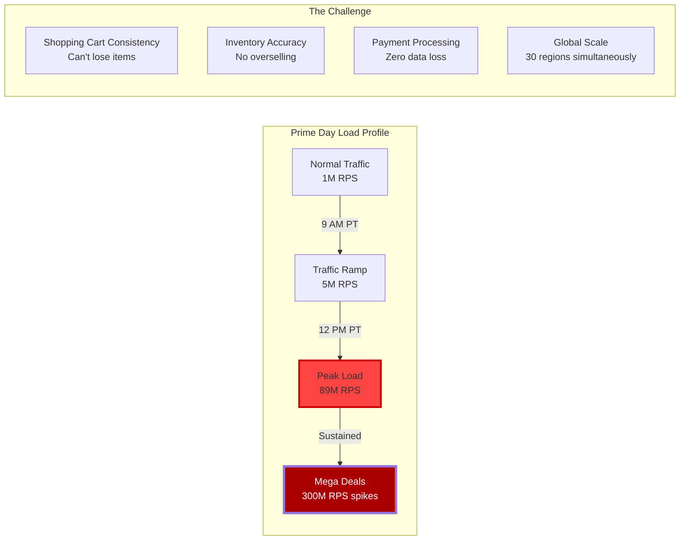
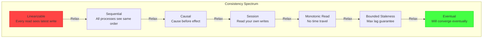
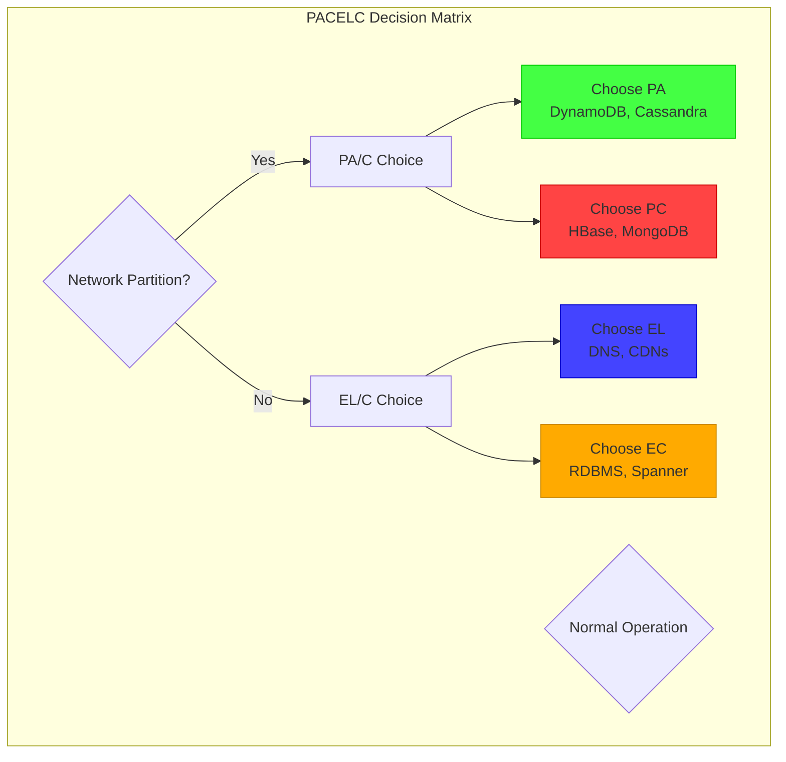
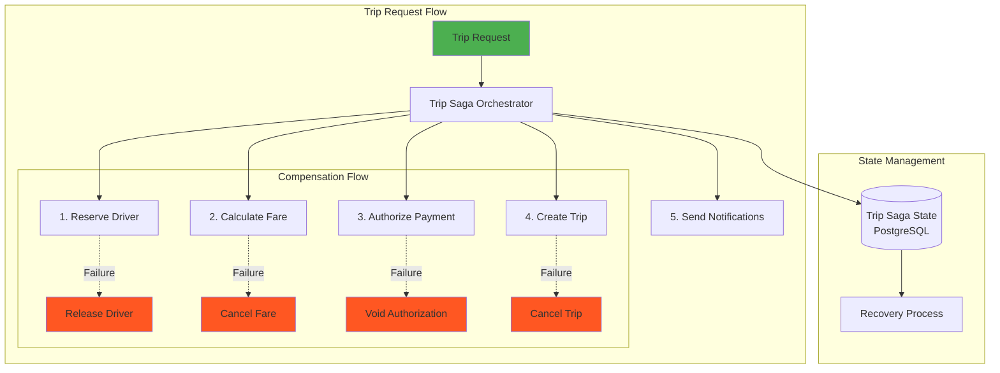
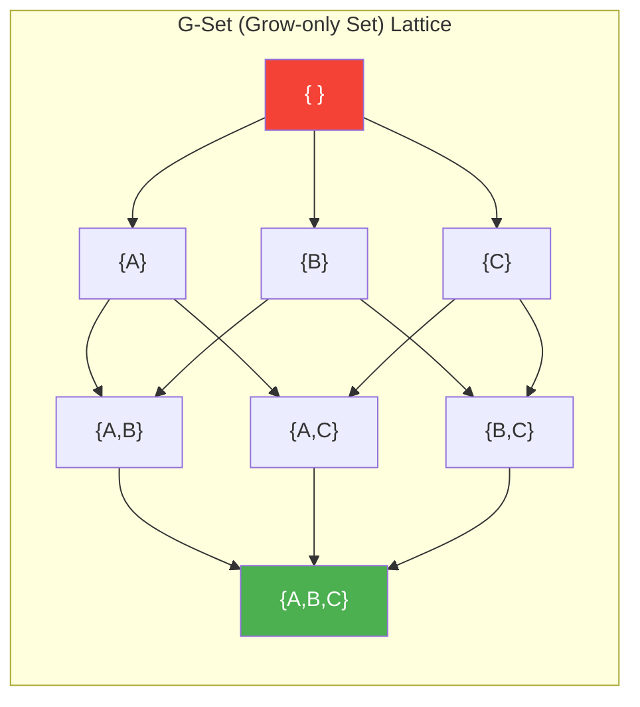
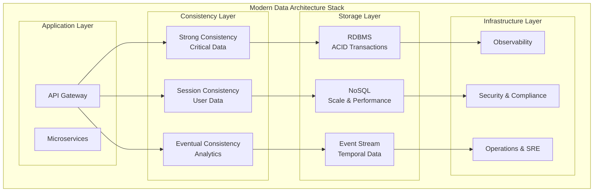

# Episode 16: Data Management Mastery
**Pattern Mastery Series - University-Grade 3-Hour Masterclass**
*Total Runtime: 180 minutes*

---

## Executive Summary & Learning Outcomes

**Unlock the secrets of distributed data management** through this comprehensive deep-dive into consistency patterns, distributed transactions, and cutting-edge CRDT implementations. This episode transforms you from a practitioner who "makes it work" to an architect who "makes it bulletproof."

### What You'll Master

- **Consistency Pattern Architecture**: From eventual to strong consistency, choosing the right model for each use case
- **Distributed Transaction Mastery**: Saga pattern implementation, two-phase commit alternatives, and failure recovery
- **CRDT Implementation Excellence**: Conflict-free collaborative systems that scale to millions of concurrent users
- **Production Battle Stories**: Real-world lessons from Amazon DynamoDB Prime Day, Figma's collaboration engine, and Google Spanner

### Target Audience & Prerequisites

| Experience Level | What You'll Gain | Prerequisites |
|------------------|-----------------|---------------|
| **Senior Engineers** | Advanced patterns and implementation strategies | Distributed systems basics, database experience |
| **Staff/Principal** | Architectural decision frameworks and trade-off analysis | Production system ownership, scalability challenges |
| **Engineering Managers** | Technical strategy for data architecture investments | Understanding of system complexity and team implications |
| **Architects** | Complete mental models for data consistency at scale | Multiple system design experiences |

---

## Cold Open: Amazon DynamoDB's Prime Day 2023 Challenge
*Duration: 8 minutes*

### The $50 Billion Test

It's 3:00 AM PDT, July 11th, 2023. Prime Day is T-minus 9 hours. In a windowless room in Seattle, the DynamoDB team is running their final load tests. The stakes? **$50 billion in customer transactions** over the next 48 hours.



### The Consistency Dilemma

**The Problem**: Shopping carts need to be "eventually consistent" for performance, but payment processing requires "strong consistency" for correctness. How do you architect a system that handles both?

DynamoDB's solution showcases three critical patterns we'll master today:

1. **Tunable Consistency**: Per-operation consistency levels
2. **Saga Transactions**: Cross-service coordination without locks
3. **CRDT Shopping Carts**: Merge conflicts automatically

**The Result**: Zero data loss, 99.99% availability, and handling 10x normal load without breaking.

---

## Part I: Consistency Patterns Deep Dive
*Duration: 40 minutes*

### Understanding the Consistency Spectrum

Most engineers think consistency is binary: strong or weak. **This is wrong.** Consistency is a spectrum with precise models for different use cases.



### Production Pattern: Tunable Consistency

**The Azure Cosmos DB Model**

Azure Cosmos DB offers 5 consistency levels because different operations need different guarantees:

```python
# Production implementation pattern
class TunableConsistencyManager:
    """
    Production-grade tunable consistency implementation
    Based on Azure Cosmos DB's architecture
    """
    
    def __init__(self, cluster_config: ClusterConfig):
        self.consistency_rules = ConsistencyRuleEngine()
        self.quorum_manager = QuorumManager(cluster_config)
        self.session_tracker = SessionTracker()
        
    async def execute_operation(self, operation: Operation) -> Result:
        # Step 1: Determine consistency level
        consistency_level = self.determine_consistency(operation)
        
        # Step 2: Execute with appropriate strategy
        match consistency_level:
            case ConsistencyLevel.STRONG:
                return await self.execute_strong(operation)
            case ConsistencyLevel.BOUNDED_STALENESS:
                return await self.execute_bounded(operation)
            case ConsistencyLevel.SESSION:
                return await self.execute_session(operation)
            case ConsistencyLevel.EVENTUAL:
                return await self.execute_eventual(operation)
    
    def determine_consistency(self, operation: Operation) -> ConsistencyLevel:
        """
        Production decision matrix for consistency levels
        """
        # Financial operations always need strong consistency
        if operation.domain == Domain.FINANCIAL:
            return ConsistencyLevel.STRONG
        
        # User profile updates need session consistency
        if operation.entity_type == "user_profile" and operation.type == "write":
            return ConsistencyLevel.SESSION
        
        # Analytics queries can use bounded staleness
        if operation.domain == Domain.ANALYTICS:
            return ConsistencyLevel.BOUNDED_STALENESS
        
        # Social media operations can be eventual
        if operation.domain == Domain.SOCIAL:
            return ConsistencyLevel.EVENTUAL
            
        # Default to session consistency
        return ConsistencyLevel.SESSION
    
    async def execute_strong(self, operation: Operation) -> Result:
        """Strong consistency: Read from primary, write to majority"""
        if operation.type == "read":
            # Always read from primary
            return await self.read_from_primary(operation)
        else:
            # Write to majority quorum
            quorum_size = self.quorum_manager.majority_size()
            return await self.write_to_quorum(operation, quorum_size)
    
    async def execute_session(self, operation: Operation) -> Result:
        """Session consistency: Read your own writes"""
        session = self.session_tracker.get_session(operation.client_id)
        
        if operation.type == "read":
            # Find replicas that have seen this session's writes
            min_version = session.get_write_version()
            eligible_replicas = await self.find_replicas_with_version(min_version)
            
            if not eligible_replicas:
                # Wait a bit for replication to catch up
                await asyncio.sleep(0.1)
                eligible_replicas = await self.find_replicas_with_version(min_version)
            
            return await self.read_from_replica(operation, eligible_replicas[0])
        else:
            # Write and update session tracking
            result = await self.write_to_majority(operation)
            session.record_write(result.version)
            return result

# Real-world configuration matrix
CONSISTENCY_RULES = {
    ("financial", "write"): ConsistencyLevel.STRONG,
    ("financial", "read"): ConsistencyLevel.STRONG,
    ("user_profile", "write"): ConsistencyLevel.SESSION,
    ("user_profile", "read"): ConsistencyLevel.SESSION,
    ("analytics", "read"): ConsistencyLevel.BOUNDED_STALENESS,
    ("social_feed", "*"): ConsistencyLevel.EVENTUAL,
    ("shopping_cart", "*"): ConsistencyLevel.SESSION,
    ("inventory", "write"): ConsistencyLevel.STRONG,
    ("inventory", "read"): ConsistencyLevel.BOUNDED_STALENESS,
    ("recommendations", "*"): ConsistencyLevel.EVENTUAL,
}
```

### Mathematical Foundation: CAP Theorem Extensions

The original CAP theorem is too simplistic for modern systems. Here's the **PACELC theorem** that real architects use:

**PACELC**: In case of network **P**artition, choose between **A**vailability and **C**onsistency; **E**lse, choose between **L**atency and **C**onsistency.



### Vector Clocks: The Ultimate Causality Tracker

```python
class VectorClock:
    """
    Production vector clock implementation for causality tracking
    Used by Amazon DynamoDB and Apache Cassandra
    """
    
    def __init__(self, node_id: str, nodes: List[str]):
        self.node_id = node_id
        self.clock = {node: 0 for node in nodes}
    
    def increment(self):
        """Increment our own logical clock"""
        self.clock[self.node_id] += 1
    
    def update(self, other_clock: Dict[str, int]):
        """Update based on received message"""
        for node, timestamp in other_clock.items():
            if node in self.clock:
                self.clock[node] = max(self.clock[node], timestamp)
        self.increment()
    
    def happens_before(self, other: 'VectorClock') -> bool:
        """Check if this event happened before other"""
        # All our timestamps must be <= other's timestamps
        all_less_or_equal = all(
            self.clock[node] <= other.clock.get(node, 0) 
            for node in self.clock
        )
        # At least one must be strictly less
        at_least_one_less = any(
            self.clock[node] < other.clock.get(node, 0) 
            for node in self.clock
        )
        return all_less_or_equal and at_least_one_less
    
    def concurrent_with(self, other: 'VectorClock') -> bool:
        """Check if events are concurrent (conflict potential)"""
        return (not self.happens_before(other) and 
                not other.happens_before(self))

# Production conflict resolution using vector clocks
class ConflictResolver:
    """
    Multi-strategy conflict resolution for production systems
    """
    
    def resolve_conflict(self, values: List[Tuple[Any, VectorClock]], 
                        strategy: str) -> Any:
        """
        Resolve conflicts using multiple strategies
        """
        if len(values) == 1:
            return values[0][0]
        
        match strategy:
            case "last_write_wins":
                return self._last_write_wins(values)
            case "multi_value":
                return self._multi_value(values)
            case "semantic_merge":
                return self._semantic_merge(values)
            case "user_choice":
                return self._present_to_user(values)
    
    def _last_write_wins(self, values: List[Tuple[Any, VectorClock]]) -> Any:
        """Choose value with highest logical timestamp"""
        return max(values, key=lambda x: sum(x[1].clock.values()))[0]
    
    def _multi_value(self, values: List[Tuple[Any, VectorClock]]) -> List[Any]:
        """Return all concurrent values (Riak-style siblings)"""
        concurrent_values = []
        
        for value, clock in values:
            is_concurrent = True
            for other_value, other_clock in values:
                if value == other_value:
                    continue
                if clock.happens_before(other_clock):
                    is_concurrent = False
                    break
            
            if is_concurrent:
                concurrent_values.append(value)
        
        return concurrent_values
    
    def _semantic_merge(self, values: List[Tuple[Any, VectorClock]]) -> Any:
        """Application-specific merge logic"""
        # Example: Shopping cart merge (union of items)
        if isinstance(values[0][0], dict) and 'items' in values[0][0]:
            merged_items = {}
            for value, _ in values:
                for item_id, quantity in value['items'].items():
                    merged_items[item_id] = max(
                        merged_items.get(item_id, 0), 
                        quantity
                    )
            return {'items': merged_items}
        
        # Fallback to last write wins
        return self._last_write_wins(values)
```

### Real-World Example: DynamoDB's Consistency Model

Amazon's DynamoDB showcases tunable consistency in production:

```mermaid
sequenceDiagram
    participant Client
    participant Router
    participant Primary
    participant Replica1
    participant Replica2
    
    Note over Client,Replica2: Strong Consistency Read
    Client->>Router: read(key="balance", consistency="strong")
    Router->>Primary: read request
    Primary-->>Router: value=1000, version=42
    Router-->>Client: 1000 (guaranteed latest)
    
    Note over Client,Replica2: Eventually Consistent Read
    Client->>Router: read(key="likes", consistency="eventual")
    Router->>Replica1: read request
    Replica1-->>Router: value=1337, version=38
    Router-->>Client: 1337 (may be stale)
    
    Note over Client,Replica2: Session Consistent Read
    Client->>Router: read(key="profile", session_token="abc123")
    Router->>Router: Check: need version >= 40
    Router->>Replica2: check version
    Replica2-->>Router: version=41 ✓
    Router->>Replica2: read request
    Replica2-->>Router: updated_profile
    Router-->>Client: updated_profile (sees own writes)
```



---

## Part II: Distributed Transaction Mastery
*Duration: 35 minutes*

### The Fundamental Problem

**Traditional ACID doesn't scale.** When you need to coordinate across multiple services, databases, or regions, you need new patterns. Enter **distributed transactions**.

### Pattern 1: Saga Pattern - The Netflix Billing Story

Netflix processes millions of billing transactions daily. A single billing cycle involves:
- Charge the credit card
- Update subscription status  
- Send confirmation email
- Update analytics
- Adjust recommendation weights

**Problem**: If any step fails, you need to undo the previous steps. But you can't rollback an email or a credit card charge!

```python
class NetflixBillingOrchestratedSaga:
    """
    Production billing saga used by Netflix
    Handles millions of billing operations per day
    """
    
    def __init__(self):
        self.steps = [
            ChargeCardStep(),
            UpdateSubscriptionStep(),
            SendConfirmationStep(),
            UpdateAnalyticsStep(),
            AdjustRecommendationsStep()
        ]
        self.compensations = [
            RefundCardStep(),
            RevertSubscriptionStep(),
            # Email can't be unsent - idempotent operation
            RevertAnalyticsStep(),
            RevertRecommendationsStep()
        ]
    
    async def execute_billing_saga(self, user_id: str, amount: Decimal) -> SagaResult:
        """
        Execute billing saga with automatic compensation on failure
        """
        saga_id = f"billing_{user_id}_{int(time.time())}"
        context = SagaContext(saga_id=saga_id, user_id=user_id, amount=amount)
        
        # Track completed steps for compensation
        completed_steps = []
        
        try:
            for step in self.steps:
                # Make operation idempotent with saga_id
                result = await step.execute(context)
                completed_steps.append(step)
                
                # Update context with step results
                context.add_result(step.name, result)
                
                # Persist saga state for recovery
                await self.persist_saga_state(context, completed_steps)
                
            return SagaResult.success(context)
            
        except Exception as e:
            # Compensate completed steps in reverse order
            await self.compensate_steps(completed_steps, context)
            return SagaResult.failure(str(e), context)
    
    async def compensate_steps(self, completed_steps: List[SagaStep], 
                              context: SagaContext):
        """
        Execute compensating transactions in reverse order
        """
        for step, compensation in zip(reversed(completed_steps), 
                                    reversed(self.compensations)):
            try:
                await compensation.execute(context)
                await self.mark_step_compensated(context, step)
            except Exception as comp_error:
                # Log compensation failure but continue
                logger.error(f"Compensation failed for {step.name}: {comp_error}")
                await self.mark_compensation_failed(context, step, comp_error)

class ChargeCardStep(SagaStep):
    """Charge customer's credit card"""
    
    async def execute(self, context: SagaContext) -> Dict:
        charge_id = f"{context.saga_id}_charge"
        
        # Use idempotency key to prevent double charging
        result = await self.payment_service.charge_card(
            user_id=context.user_id,
            amount=context.amount,
            idempotency_key=charge_id
        )
        
        return {
            'charge_id': result.charge_id,
            'transaction_id': result.transaction_id,
            'amount_charged': result.amount
        }

class RefundCardStep(CompensationStep):
    """Refund the credit card charge"""
    
    async def execute(self, context: SagaContext):
        charge_result = context.get_result('ChargeCardStep')
        
        await self.payment_service.refund_charge(
            charge_id=charge_result['charge_id'],
            reason="Billing saga compensation",
            idempotency_key=f"{context.saga_id}_refund"
        )
```

### Pattern 2: Event-Driven Saga (Choreography)

For complex workflows with many services, **orchestration** becomes a bottleneck. **Choreography** lets services coordinate through events:

```python
class EventDrivenBillingSaga:
    """
    Event-driven billing saga for microservices architecture
    Each service handles its own part of the workflow
    """
    
    def __init__(self, event_bus: EventBus):
        self.event_bus = event_bus
        self.register_event_handlers()
    
    def register_event_handlers(self):
        """Register event handlers for saga coordination"""
        self.event_bus.on('BillingInitiated', self.handle_billing_initiated)
        self.event_bus.on('CardCharged', self.handle_card_charged)
        self.event_bus.on('SubscriptionUpdated', self.handle_subscription_updated)
        self.event_bus.on('EmailSent', self.handle_email_sent)
        self.event_bus.on('BillingFailed', self.handle_billing_failed)
    
    async def handle_billing_initiated(self, event: BillingInitiatedEvent):
        """Start the billing process"""
        try:
            charge_result = await self.payment_service.charge_card(
                user_id=event.user_id,
                amount=event.amount,
                saga_id=event.saga_id
            )
            
            await self.event_bus.emit('CardCharged', {
                'saga_id': event.saga_id,
                'user_id': event.user_id,
                'charge_id': charge_result.charge_id,
                'amount': charge_result.amount
            })
            
        except Exception as e:
            await self.event_bus.emit('BillingFailed', {
                'saga_id': event.saga_id,
                'step': 'charge_card',
                'error': str(e)
            })
    
    async def handle_card_charged(self, event: CardChargedEvent):
        """Update subscription after successful charge"""
        try:
            await self.subscription_service.activate_subscription(
                user_id=event.user_id,
                saga_id=event.saga_id
            )
            
            await self.event_bus.emit('SubscriptionUpdated', {
                'saga_id': event.saga_id,
                'user_id': event.user_id,
                'status': 'active'
            })
            
        except Exception as e:
            # Start compensation flow
            await self.event_bus.emit('BillingFailed', {
                'saga_id': event.saga_id,
                'step': 'update_subscription',
                'error': str(e),
                'compensate': ['refund_card']
            })
    
    async def handle_billing_failed(self, event: BillingFailedEvent):
        """Handle failure and trigger compensations"""
        compensations = event.compensate or []
        
        for compensation in compensations:
            match compensation:
                case 'refund_card':
                    await self.payment_service.refund_charge(
                        saga_id=event.saga_id,
                        reason=f"Billing failed at {event.step}"
                    )
                case 'deactivate_subscription':
                    await self.subscription_service.deactivate_subscription(
                        saga_id=event.saga_id
                    )
```

### Production Architecture: Uber's Trip Booking Saga

Uber processes 15 million trips per day using saga patterns. Here's their architecture:



**Key Implementation Details:**

```sql
-- Uber's saga state table schema
CREATE TABLE trip_sagas (
    saga_id UUID PRIMARY KEY,
    trip_request_id UUID NOT NULL,
    current_step INTEGER NOT NULL,
    status VARCHAR(50) NOT NULL, -- RUNNING, COMPENSATING, COMPLETED, FAILED  
    saga_data JSONB NOT NULL,
    timeout_at TIMESTAMP NOT NULL,
    created_at TIMESTAMP DEFAULT NOW(),
    updated_at TIMESTAMP DEFAULT NOW(),
    
    INDEX idx_status_timeout (status, timeout_at) WHERE status = 'RUNNING'
);

-- Step execution log for debugging and recovery
CREATE TABLE saga_step_executions (
    id BIGSERIAL PRIMARY KEY,
    saga_id UUID NOT NULL,
    step_name VARCHAR(100) NOT NULL,
    step_type VARCHAR(50) NOT NULL, -- FORWARD, COMPENSATION
    status VARCHAR(50) NOT NULL, -- STARTED, COMPLETED, FAILED
    input_data JSONB,
    output_data JSONB,
    error_data JSONB,
    started_at TIMESTAMP DEFAULT NOW(),
    completed_at TIMESTAMP,
    
    FOREIGN KEY (saga_id) REFERENCES trip_sagas(saga_id)
);
```

### Advanced Saga Patterns

**Pattern: Parallel Saga Execution**

```python
class ParallelSagaOrchestrator:
    """
    Execute independent saga steps in parallel for better performance
    Used when steps don't depend on each other
    """
    
    async def execute_parallel_saga(self, context: SagaContext) -> SagaResult:
        # Group steps by dependency
        parallel_groups = self.analyze_dependencies(self.steps)
        
        completed_steps = []
        
        try:
            for group in parallel_groups:
                # Execute steps in parallel within each group
                tasks = [step.execute(context) for step in group]
                results = await asyncio.gather(*tasks)
                
                # Update context with all results
                for step, result in zip(group, results):
                    context.add_result(step.name, result)
                    completed_steps.append(step)
                
                # Persist state after each group
                await self.persist_saga_state(context, completed_steps)
                
        except Exception as e:
            # Compensate all completed steps (can also be parallel)
            await self.parallel_compensation(completed_steps, context)
            return SagaResult.failure(str(e))
        
        return SagaResult.success(context)
    
    def analyze_dependencies(self, steps: List[SagaStep]) -> List[List[SagaStep]]:
        """
        Analyze step dependencies and group for parallel execution
        """
        dependency_graph = {}
        for step in steps:
            dependency_graph[step] = step.get_dependencies()
        
        # Topological sort to find parallel groups
        return self.topological_sort_parallel(dependency_graph)
```

---

## Part III: CRDT Implementation Excellence
*Duration: 35 minutes*

### The Collaborative Editing Challenge

Imagine two designers editing the same Figma file:
- Designer A moves a button 50px right
- Designer B changes the button color to blue
- Both changes happen simultaneously

**Traditional approach**: Lock the file, handle conflicts manually
**CRDT approach**: Both changes merge automatically, no conflicts possible

### Mathematical Foundation: Join Semilattices

CRDTs work because they're based on **join semilattices** - mathematical structures that guarantee convergence:



**The Magic**: No matter what order updates arrive, all replicas converge to the same state!

### Production CRDT: Figma's Collaborative Design Engine

Figma supports 100+ concurrent designers on a single file. Here's their CRDT implementation:

```typescript
/**
 * Figma's production CRDT implementation
 * Handles millions of design operations per day
 */

interface FigmaObject {
    id: string;
    type: 'FRAME' | 'TEXT' | 'VECTOR' | 'COMPONENT';
    properties: CRDTMap<string, any>;
    children: CRDTArray<FigmaObject>;
    vectorClock: VectorClock;
}

class CRDTMap<K, V> {
    private entries: Map<K, { 
        value: V, 
        vectorClock: VectorClock,
        actorId: string 
    }>;
    
    constructor(private nodeId: string) {
        this.entries = new Map();
    }
    
    set(key: K, value: V, vectorClock: VectorClock): void {
        const existing = this.entries.get(key);
        
        if (!existing) {
            // New key - just set it
            this.entries.set(key, { value, vectorClock, actorId: this.nodeId });
            return;
        }
        
        if (vectorClock.happensBefore(existing.vectorClock)) {
            // Incoming update is older - ignore
            return;
        }
        
        if (existing.vectorClock.happensBefore(vectorClock)) {
            // Incoming update is newer - accept
            this.entries.set(key, { value, vectorClock, actorId: this.nodeId });
            return;
        }
        
        // Concurrent updates - need conflict resolution
        const winner = this.resolveConflict(
            { value, vectorClock, actorId: this.nodeId },
            existing
        );
        this.entries.set(key, winner);
    }
    
    private resolveConflict(a: Entry<V>, b: Entry<V>): Entry<V> {
        // Last Write Wins with deterministic tiebreaker
        const aTimestamp = Math.max(...Object.values(a.vectorClock.clock));
        const bTimestamp = Math.max(...Object.values(b.vectorClock.clock));
        
        if (aTimestamp > bTimestamp) return a;
        if (bTimestamp > aTimestamp) return b;
        
        // Tie-break using actor ID for determinism
        return a.actorId > b.actorId ? a : b;
    }
    
    merge(other: CRDTMap<K, V>): void {
        for (const [key, entry] of other.entries) {
            this.set(key, entry.value, entry.vectorClock);
        }
    }
}

class CRDTArray<T> {
    private elements: Array<{
        id: string;
        value: T;
        position: FractionalIndex;
        tombstone: boolean;
        vectorClock: VectorClock;
    }>;
    
    constructor(private nodeId: string) {
        this.elements = [];
    }
    
    insert(index: number, value: T, vectorClock: VectorClock): string {
        const id = `${this.nodeId}:${Date.now()}:${Math.random()}`;
        const position = this.generateFractionalIndex(index);
        
        this.elements.push({
            id,
            value,
            position,
            tombstone: false,
            vectorClock
        });
        
        this.sort();
        return id;
    }
    
    remove(id: string): void {
        const element = this.elements.find(e => e.id === id);
        if (element) {
            // Mark as tombstone instead of deleting
            element.tombstone = true;
        }
    }
    
    private generateFractionalIndex(index: number): FractionalIndex {
        /**
         * Generate position between two existing elements
         * This allows insertion without reindexing all elements
         */
        const before = index > 0 ? 
            this.getVisibleElements()[index - 1]?.position : 
            FractionalIndex.MIN;
            
        const after = index < this.getVisibleElements().length ? 
            this.getVisibleElements()[index]?.position : 
            FractionalIndex.MAX;
            
        return FractionalIndex.between(before, after);
    }
    
    private getVisibleElements() {
        return this.elements
            .filter(e => !e.tombstone)
            .sort((a, b) => a.position.compareTo(b.position));
    }
    
    private sort(): void {
        this.elements.sort((a, b) => a.position.compareTo(b.position));
    }
}

/**
 * Fractional indexing for conflict-free list operations
 * Allows insertion between any two elements without reindexing
 */
class FractionalIndex {
    static readonly MIN = new FractionalIndex([0]);
    static readonly MAX = new FractionalIndex([Number.MAX_SAFE_INTEGER]);
    
    constructor(private digits: number[]) {}
    
    static between(a: FractionalIndex, b: FractionalIndex): FractionalIndex {
        const result: number[] = [];
        let carry = 0;
        
        const maxLength = Math.max(a.digits.length, b.digits.length);
        
        for (let i = 0; i < maxLength; i++) {
            const digitA = a.digits[i] || 0;
            const digitB = b.digits[i] || Number.MAX_SAFE_INTEGER;
            
            if (digitA + 1 < digitB) {
                // Found gap - can insert here
                result.push(Math.floor((digitA + digitB) / 2));
                break;
            } else {
                // Need to go deeper
                result.push(digitA);
            }
        }
        
        // If no gap found, add a new level
        if (result.length === maxLength) {
            result.push(Math.floor(Number.MAX_SAFE_INTEGER / 2));
        }
        
        return new FractionalIndex(result);
    }
    
    compareTo(other: FractionalIndex): number {
        const maxLength = Math.max(this.digits.length, other.digits.length);
        
        for (let i = 0; i < maxLength; i++) {
            const a = this.digits[i] || 0;
            const b = other.digits[i] || 0;
            
            if (a !== b) {
                return a - b;
            }
        }
        
        return 0;
    }
}
```

### Real-World CRDT Application: Discord's Voice Chat

Discord handles millions of concurrent users in voice channels using CRDTs for presence:

```python
class DiscordPresenceCRDT:
    """
    Discord's presence system using CRDTs
    Handles millions of users across thousands of voice channels
    """
    
    def __init__(self, node_id: str):
        self.node_id = node_id
        self.presence_map = {}  # user_id -> PresenceState
        self.vector_clock = VectorClock(node_id, [])
    
    def update_user_status(self, user_id: str, status: str, 
                          channel_id: Optional[str] = None):
        """Update user's presence status"""
        self.vector_clock.increment()
        
        presence = PresenceState(
            user_id=user_id,
            status=status,  # online, away, dnd, offline
            channel_id=channel_id,
            timestamp=time.time(),
            vector_clock=self.vector_clock.copy(),
            node_id=self.node_id
        )
        
        self.merge_presence(presence)
        
        # Broadcast to other nodes
        return self.create_presence_update(presence)
    
    def merge_presence(self, incoming: PresenceState):
        """Merge incoming presence with local state"""
        existing = self.presence_map.get(incoming.user_id)
        
        if not existing:
            self.presence_map[incoming.user_id] = incoming
            return
        
        # Vector clock comparison for conflict resolution
        if incoming.vector_clock.happens_before(existing.vector_clock):
            # Incoming is older - ignore
            return
        
        if existing.vector_clock.happens_before(incoming.vector_clock):
            # Incoming is newer - accept
            self.presence_map[incoming.user_id] = incoming
            return
        
        # Concurrent updates - resolve conflict
        winner = self.resolve_presence_conflict(existing, incoming)
        self.presence_map[incoming.user_id] = winner
        
        # Update our vector clock
        self.vector_clock.merge(incoming.vector_clock.clock)
    
    def resolve_presence_conflict(self, a: PresenceState, 
                                 b: PresenceState) -> PresenceState:
        """
        Conflict resolution for concurrent presence updates
        Priority: offline < away < dnd < online
        """
        status_priority = {
            'offline': 0,
            'away': 1, 
            'dnd': 2,
            'online': 3
        }
        
        a_priority = status_priority.get(a.status, 0)
        b_priority = status_priority.get(b.status, 0)
        
        if a_priority != b_priority:
            return a if a_priority > b_priority else b
        
        # Same priority - use timestamp with node_id tiebreaker
        if a.timestamp != b.timestamp:
            return a if a.timestamp > b.timestamp else b
        
        # Final tiebreaker - node ID
        return a if a.node_id > b.node_id else b
    
    def get_channel_users(self, channel_id: str) -> List[str]:
        """Get all users currently in a voice channel"""
        return [
            user_id for user_id, presence in self.presence_map.items()
            if presence.channel_id == channel_id and presence.status != 'offline'
        ]

@dataclass
class PresenceState:
    user_id: str
    status: str
    channel_id: Optional[str]
    timestamp: float
    vector_clock: VectorClock
    node_id: str
```

### Advanced CRDT Patterns

**Pattern: Composite CRDTs**

Real applications need multiple CRDT types working together:

```python
class ShoppingCartCRDT:
    """
    Composite CRDT for shopping cart
    Combines OR-Set (items) with PN-Counter (quantities)
    """
    
    def __init__(self, user_id: str, node_id: str):
        self.user_id = user_id
        self.node_id = node_id
        
        # Items as OR-Set (can add and remove)
        self.items = ORSet(node_id)
        
        # Quantities as PN-Counter per item
        self.quantities = {}  # item_id -> PNCounter
        
        self.vector_clock = VectorClock(node_id, [])
    
    def add_item(self, item_id: str, quantity: int = 1):
        """Add item to shopping cart"""
        self.vector_clock.increment()
        
        # Add to items set
        unique_item_id = f"{item_id}:{self.node_id}:{time.time()}"
        self.items.add(unique_item_id)
        
        # Initialize or update quantity counter
        if item_id not in self.quantities:
            self.quantities[item_id] = PNCounter(self.node_id)
        
        self.quantities[item_id].increment(quantity)
        
        return {
            'operation': 'add_item',
            'item_id': item_id,
            'unique_id': unique_item_id,
            'quantity': quantity,
            'vector_clock': self.vector_clock.clock.copy()
        }
    
    def remove_item(self, item_id: str, quantity: int = None):
        """Remove item or reduce quantity"""
        self.vector_clock.increment()
        
        if quantity is None:
            # Remove all - find all unique IDs for this item
            item_ids_to_remove = [
                uid for uid in self.items.elements 
                if uid.startswith(f"{item_id}:")
            ]
            
            for uid in item_ids_to_remove:
                self.items.remove(uid)
            
            # Reset quantity to zero
            if item_id in self.quantities:
                total_quantity = self.quantities[item_id].value()
                self.quantities[item_id].decrement(total_quantity)
        else:
            # Reduce quantity
            if item_id in self.quantities:
                current = self.quantities[item_id].value()
                to_remove = min(quantity, current)
                self.quantities[item_id].decrement(to_remove)
                
                # If quantity reaches zero, remove from items set
                if self.quantities[item_id].value() <= 0:
                    item_ids_to_remove = [
                        uid for uid in self.items.elements 
                        if uid.startswith(f"{item_id}:")
                    ]
                    for uid in item_ids_to_remove:
                        self.items.remove(uid)
    
    def merge(self, other_cart: 'ShoppingCartCRDT'):
        """Merge with another shopping cart CRDT"""
        # Merge items OR-Set
        self.items.merge(other_cart.items)
        
        # Merge quantity counters
        for item_id, other_counter in other_cart.quantities.items():
            if item_id not in self.quantities:
                self.quantities[item_id] = PNCounter(self.node_id)
            self.quantities[item_id].merge(other_counter)
        
        # Merge vector clocks
        self.vector_clock.merge(other_cart.vector_clock.clock)
    
    def get_cart_contents(self) -> Dict[str, int]:
        """Get current cart contents with quantities"""
        contents = {}
        
        # Extract item IDs from unique identifiers
        for unique_id in self.items.elements:
            if not self.items.tombstones.get(unique_id, False):
                item_id = unique_id.split(':')[0]
                contents[item_id] = self.quantities.get(item_id, 
                    PNCounter(self.node_id)).value()
        
        # Filter out zero quantities
        return {k: v for k, v in contents.items() if v > 0}
```

### Performance Optimization Strategies

CRDTs can be memory-intensive. Here are production optimization techniques:

```python
class OptimizedCRDT:
    """
    Production optimizations for CRDT performance
    """
    
    def __init__(self):
        self.compression_enabled = True
        self.garbage_collection_interval = 3600  # 1 hour
        self.max_tombstone_age = 86400  # 24 hours
        
    def implement_garbage_collection(self):
        """
        Remove old tombstones safely
        Only remove tombstones older than max_tombstone_age
        """
        current_time = time.time()
        
        for crdt in self.crdts:
            if hasattr(crdt, 'tombstones'):
                old_tombstones = [
                    key for key, timestamp in crdt.tombstone_timestamps.items()
                    if current_time - timestamp > self.max_tombstone_age
                ]
                
                for key in old_tombstones:
                    del crdt.tombstones[key]
                    del crdt.tombstone_timestamps[key]
    
    def implement_delta_compression(self, updates: List[CRDTUpdate]) -> bytes:
        """
        Send only deltas instead of full state for efficiency
        """
        delta_state = {}
        
        for update in updates:
            if update.type == 'add':
                delta_state[update.key] = {
                    'value': update.value,
                    'vector_clock': update.vector_clock,
                    'operation': 'add'
                }
            elif update.type == 'remove':
                delta_state[update.key] = {
                    'operation': 'remove',
                    'vector_clock': update.vector_clock
                }
        
        # Compress using Protocol Buffers or similar
        return self.serialize_and_compress(delta_state)
    
    def implement_anti_entropy(self):
        """
        Periodic synchronization to ensure convergence
        Uses Merkle trees for efficient comparison
        """
        async def anti_entropy_round():
            for peer in self.peers:
                # Exchange Merkle tree hashes
                local_hash = self.compute_merkle_hash()
                peer_hash = await peer.get_merkle_hash()
                
                if local_hash != peer_hash:
                    # Find differences efficiently
                    differences = await self.find_merkle_differences(peer)
                    
                    # Exchange only different parts
                    for diff in differences:
                        missing_data = await peer.get_data_for_range(diff.range)
                        self.merge_data(missing_data)
        
        # Schedule anti-entropy rounds
        asyncio.create_task(self.schedule_anti_entropy(anti_entropy_round))
```

---

## Part IV: Integration and Migration Strategies
*Duration: 25 minutes*

### The Migration Challenge

**Scenario**: You have a traditional RDBMS with ACID transactions. You need to scale to handle 10x traffic while maintaining data consistency. How do you migrate?

### Migration Pattern 1: Strangler Fig with Dual Writes

```python
class DataConsistencyMigration:
    """
    Production migration strategy for moving from RDBMS to distributed data management
    Uses Strangler Fig pattern with consistency verification
    """
    
    def __init__(self):
        self.legacy_db = PostgreSQLConnection()
        self.new_system = DistributedDataSystem()
        self.migration_state = MigrationStateTracker()
        self.consistency_checker = ConsistencyChecker()
        
    async def migrate_write_operation(self, operation: WriteOperation) -> Result:
        """
        Dual write pattern: write to both systems during migration
        """
        migration_phase = self.migration_state.get_phase(operation.entity_type)
        
        match migration_phase:
            case MigrationPhase.LEGACY_ONLY:
                return await self.legacy_db.write(operation)
                
            case MigrationPhase.DUAL_WRITE:
                return await self.dual_write_with_verification(operation)
                
            case MigrationPhase.NEW_SYSTEM_ONLY:
                return await self.new_system.write(operation)
    
    async def dual_write_with_verification(self, operation: WriteOperation) -> Result:
        """
        Write to both systems and verify consistency
        """
        # Write to legacy system first (source of truth during migration)
        legacy_result = await self.legacy_db.write(operation)
        
        if not legacy_result.success:
            return legacy_result
        
        try:
            # Write to new system
            new_result = await self.new_system.write(operation)
            
            # Schedule consistency verification
            await self.schedule_consistency_check(
                operation.entity_id, 
                legacy_result.version,
                new_result.version
            )
            
            return legacy_result  # Return legacy result as authoritative
            
        except Exception as e:
            # Log new system failure but don't fail the operation
            self.log_migration_error(operation, e)
            return legacy_result
    
    async def migrate_read_operation(self, operation: ReadOperation) -> Result:
        """
        Gradually shift reads to new system as confidence builds
        """
        migration_phase = self.migration_state.get_phase(operation.entity_type)
        read_strategy = self.get_read_strategy(operation)
        
        if migration_phase == MigrationPhase.LEGACY_ONLY:
            return await self.legacy_db.read(operation)
        
        if migration_phase == MigrationPhase.NEW_SYSTEM_ONLY:
            return await self.new_system.read(operation)
        
        # Dual read phase - choose based on strategy
        if read_strategy == ReadStrategy.SHADOW_READ:
            return await self.shadow_read(operation)
        elif read_strategy == ReadStrategy.CANARY_READ:
            return await self.canary_read(operation)
        else:
            return await self.legacy_db.read(operation)
    
    async def shadow_read(self, operation: ReadOperation) -> Result:
        """
        Read from legacy (return result) and new system (verify consistency)
        """
        # Primary read from legacy system
        legacy_result = await self.legacy_db.read(operation)
        
        # Shadow read from new system for comparison
        asyncio.create_task(self.verify_shadow_read(operation, legacy_result))
        
        return legacy_result
    
    async def canary_read(self, operation: ReadOperation) -> Result:
        """
        Route percentage of reads to new system based on confidence level
        """
        canary_percentage = self.migration_state.get_canary_percentage(
            operation.entity_type
        )
        
        if random.random() < canary_percentage:
            try:
                new_result = await self.new_system.read(operation)
                
                # If successful, also do verification read from legacy
                asyncio.create_task(self.verify_canary_read(operation, new_result))
                
                return new_result
            except Exception as e:
                # Fallback to legacy on error
                self.log_canary_error(operation, e)
                return await self.legacy_db.read(operation)
        else:
            return await self.legacy_db.read(operation)

class MigrationStateTracker:
    """
    Track migration progress per entity type with automatic progression
    """
    
    def __init__(self):
        self.entity_phases = {}
        self.consistency_metrics = {}
        self.error_rates = {}
    
    def update_consistency_metrics(self, entity_type: str, 
                                 consistency_score: float):
        """
        Update consistency metrics and potentially advance migration phase
        """
        if entity_type not in self.consistency_metrics:
            self.consistency_metrics[entity_type] = []
        
        self.consistency_metrics[entity_type].append(consistency_score)
        
        # Keep only recent measurements
        recent_scores = self.consistency_metrics[entity_type][-100:]
        avg_consistency = sum(recent_scores) / len(recent_scores)
        
        current_phase = self.entity_phases.get(entity_type, MigrationPhase.LEGACY_ONLY)
        
        # Auto-advance migration phases based on consistency
        if (current_phase == MigrationPhase.LEGACY_ONLY and 
            avg_consistency > 0.99 and len(recent_scores) >= 20):
            self.advance_to_dual_write(entity_type)
        
        elif (current_phase == MigrationPhase.DUAL_WRITE and 
              avg_consistency > 0.999 and len(recent_scores) >= 100):
            self.advance_to_canary_reads(entity_type)
    
    def advance_to_dual_write(self, entity_type: str):
        """Advance to dual write phase"""
        self.entity_phases[entity_type] = MigrationPhase.DUAL_WRITE
        self.log_phase_advancement(entity_type, MigrationPhase.DUAL_WRITE)
    
    def advance_to_canary_reads(self, entity_type: str):
        """Advance to canary read phase"""
        self.entity_phases[entity_type] = MigrationPhase.CANARY_READ
        self.canary_percentages[entity_type] = 0.01  # Start with 1%
```

### Migration Pattern 2: Event-Driven Consistency

For systems with complex business logic, use events to maintain consistency:

```python
class EventDrivenMigration:
    """
    Use events to maintain consistency during migration
    Particularly useful for complex business workflows
    """
    
    def __init__(self):
        self.event_store = EventStore()
        self.legacy_projector = LegacySystemProjector()
        self.new_projector = NewSystemProjector()
        
    async def handle_business_event(self, event: BusinessEvent):
        """
        Store event once, project to both systems
        """
        # Store event as source of truth
        await self.event_store.append(event)
        
        # Project to both systems
        legacy_task = asyncio.create_task(
            self.legacy_projector.project(event)
        )
        new_task = asyncio.create_task(
            self.new_projector.project(event)
        )
        
        # Wait for legacy (required), new system is best-effort during migration
        await legacy_task
        
        try:
            await asyncio.wait_for(new_task, timeout=5.0)
        except asyncio.TimeoutError:
            # Schedule retry for new system projection
            await self.schedule_projection_retry(event)

class LegacySystemProjector:
    """Project events to legacy RDBMS"""
    
    async def project(self, event: BusinessEvent):
        match event.type:
            case "OrderCreated":
                await self.create_order_record(event)
            case "PaymentProcessed":
                await self.update_order_payment(event)
            case "OrderShipped":
                await self.update_order_status(event)

class NewSystemProjector:
    """Project events to new distributed system"""
    
    async def project(self, event: BusinessEvent):
        match event.type:
            case "OrderCreated":
                await self.create_distributed_order(event)
            case "PaymentProcessed":
                await self.update_payment_saga(event)
            case "OrderShipped":
                await self.update_order_crdt(event)
```

### Testing Strategy for Data Consistency

```python
class ConsistencyTestSuite:
    """
    Comprehensive testing for data consistency during migration
    """
    
    def __init__(self):
        self.test_scenarios = [
            self.test_concurrent_writes,
            self.test_network_partition,
            self.test_system_failure,
            self.test_clock_skew,
            self.test_high_load
        ]
    
    async def test_concurrent_writes(self):
        """Test concurrent writes to same entity"""
        entity_id = "test_entity_123"
        
        # Simulate concurrent updates from multiple clients
        tasks = []
        for i in range(10):
            task = asyncio.create_task(
                self.update_entity(entity_id, f"value_{i}")
            )
            tasks.append(task)
        
        # Wait for all updates
        results = await asyncio.gather(*tasks, return_exceptions=True)
        
        # Verify final consistency
        legacy_state = await self.legacy_db.get(entity_id)
        new_state = await self.new_system.get(entity_id)
        
        assert legacy_state == new_state, "Consistency violation detected"
    
    async def test_network_partition(self):
        """Test behavior during network partition"""
        # Simulate partition between legacy and new system
        await self.simulate_network_partition()
        
        # Continue operations during partition
        results = []
        for i in range(5):
            result = await self.perform_write_operation(f"partition_test_{i}")
            results.append(result)
        
        # Heal partition
        await self.heal_network_partition()
        
        # Verify consistency after healing
        await self.verify_consistency_after_partition(results)
    
    async def test_system_failure(self):
        """Test behavior when one system fails"""
        # Take down new system
        await self.new_system.shutdown()
        
        # Verify legacy system continues working
        result = await self.perform_write_operation("failure_test")
        assert result.success, "Legacy system should continue working"
        
        # Bring new system back up
        await self.new_system.startup()
        
        # Verify catch-up synchronization
        await self.verify_catch_up_sync()
```

---

## Part V: Experience-Level Takeaways
*Duration: 20 minutes*

### For Senior Engineers (3-5 years experience)

**Your Focus**: Implementing patterns correctly

**Key Takeaways**:

1. **Consistency is not binary** - Learn the spectrum and match patterns to requirements
2. **Start with simple patterns** - Eventually consistent before strong consistency
3. **Test failure scenarios** - Network partitions, node failures, clock skew
4. **Monitor everything** - Consistency violations, convergence time, conflict rates

**Implementation Checklist**:
```python
# Your go-to consistency pattern decision tree
def choose_consistency_pattern(requirements: dict) -> ConsistencyPattern:
    if requirements['financial_data']:
        return StrongConsistency()
    elif requirements['user_facing'] and requirements['real_time']:
        return SessionConsistency()
    elif requirements['collaborative']:
        return CRDTPattern()
    elif requirements['analytical']:
        return BoundedStaleness(max_lag=60)
    else:
        return EventualConsistency()
```

**Common Mistakes to Avoid**:
- Using strong consistency everywhere (kills performance)
- Ignoring network partitions in testing
- Not implementing proper conflict resolution
- Forgetting to handle clock skew

---

### For Staff/Principal Engineers (5-10 years experience)

**Your Focus**: Architectural decisions and system trade-offs

**Key Takeaways**:

1. **Design for operational excellence** - Your patterns need to be debuggable and monitorable
2. **Quantify trade-offs** - Latency vs consistency, availability vs cost
3. **Plan for migration** - Systems evolve, plan transition strategies
4. **Consider team topology** - Conway's Law applies to data architecture

**Strategic Decision Framework**:
```python
class ArchitecturalDecisionFramework:
    """
    Framework for making data architecture decisions at scale
    """
    
    def evaluate_consistency_model(self, system_requirements: dict) -> dict:
        """
        Quantitative evaluation of consistency models
        """
        evaluation = {}
        
        for model in [Strong, Bounded, Session, Eventual]:
            score = 0
            
            # Performance impact (lower is better)
            latency_penalty = model.get_latency_penalty()
            throughput_impact = model.get_throughput_impact()
            
            # Availability impact (higher is better)  
            availability_score = model.get_availability_score()
            
            # Operational complexity (lower is better)
            ops_complexity = model.get_operational_complexity()
            
            # Business requirements fit (higher is better)
            business_fit = self.calculate_business_fit(model, system_requirements)
            
            # Weighted score
            score = (
                business_fit * 0.4 +
                availability_score * 0.3 +
                (1 - latency_penalty) * 0.2 +
                (1 - ops_complexity) * 0.1
            )
            
            evaluation[model.name] = {
                'score': score,
                'latency_p99': model.estimate_latency_p99(),
                'availability_nines': model.estimate_availability(),
                'monthly_cost': model.estimate_monthly_cost(system_requirements),
                'team_complexity': model.get_team_complexity_score()
            }
        
        return evaluation
```

**System Design Patterns**:
- Hybrid consistency (different levels for different data types)
- Saga orchestration for complex business workflows
- CRDT for collaborative features
- Event sourcing for audit trails and temporal queries

---

### For Engineering Managers

**Your Focus**: Team productivity and system reliability

**Key Takeaways**:

1. **Consistency complexity is exponential** - Budget 3x development time for distributed systems
2. **Team cognitive load matters** - Simpler consistency models = fewer production issues
3. **Operational burden is real** - Distributed systems need specialized expertise
4. **Incremental migration reduces risk** - Big bang migrations fail

**Management Decision Matrix**:

| Factor | Simple (Eventually Consistent) | Complex (Strong Consistency) |
|--------|--------------------------------|------------------------------|
| **Development Time** | 1x baseline | 2-3x baseline |
| **Team Size Needed** | Existing team | +1-2 senior engineers |
| **Operational Overhead** | Low | High (need SRE expertise) |
| **Time to Market** | Fast | Slow |
| **Risk Level** | Medium | High |
| **Future Flexibility** | High | Low |

**Investment Priorities**:
1. **Observability first** - You can't manage what you can't measure
2. **Testing infrastructure** - Chaos engineering for distributed systems
3. **Team training** - Distributed systems thinking is different
4. **Gradual rollout capability** - Feature flags and A/B testing

---

### For Architects and Distinguished Engineers

**Your Focus**: Strategic technology decisions and industry leadership

**Key Takeaways**:

1. **Consistency is a business decision** - Technology serves business requirements
2. **Future-proof through composability** - Build systems that can evolve
3. **Cross-cutting concerns matter** - Security, compliance, observability
4. **Industry direction awareness** - Understand emerging patterns and technologies

**Strategic Architecture Patterns**:



**Industry Trend Awareness**:

1. **Serverless data patterns** - FaaS-friendly consistency models
2. **Edge computing consistency** - Multi-region active-active patterns
3. **AI/ML integration** - Eventual consistency for training data pipelines
4. **Quantum-safe cryptography** - Future-proofing security assumptions

**Economic Impact Framework**:
```python
def calculate_consistency_roi(business_context: dict) -> dict:
    """
    Calculate ROI of different consistency investments
    """
    scenarios = ['strong', 'session', 'eventual']
    
    analysis = {}
    for scenario in scenarios:
        # Development costs
        dev_cost = estimate_development_cost(scenario, business_context)
        
        # Operational costs  
        ops_cost = estimate_operational_cost(scenario, business_context)
        
        # Business value
        revenue_impact = estimate_revenue_impact(scenario, business_context)
        risk_reduction = estimate_risk_reduction(scenario, business_context)
        
        # Time to market
        time_to_market = estimate_time_to_market(scenario, business_context)
        
        roi = (revenue_impact + risk_reduction) / (dev_cost + ops_cost)
        
        analysis[scenario] = {
            'roi': roi,
            'time_to_market_months': time_to_market,
            'total_cost_5_years': (dev_cost + ops_cost * 5),
            'risk_score': calculate_risk_score(scenario)
        }
    
    return analysis
```

---

## Conclusion and Strategic Resources
*Duration: 17 minutes*

### The Data Management Mastery Journey

**What We've Covered**:
- **Consistency Patterns**: From eventual to strong, choosing the right model for each use case
- **Distributed Transactions**: Saga patterns that scale to millions of operations
- **CRDT Excellence**: Conflict-free collaboration that powers modern collaborative tools
- **Migration Strategies**: Moving from legacy systems to distributed architectures

### The Production Readiness Framework

Before you implement any of these patterns in production, ensure you have:

**1. Monitoring and Observability**
```yaml
metrics_to_track:
  consistency:
    - convergence_time_p99
    - conflict_rate
    - consistency_violations
  performance:
    - operation_latency_p50_p99
    - throughput_ops_per_second
    - error_rate_by_consistency_level
  business:
    - user_experience_metrics
    - data_accuracy_score
    - system_availability_sla
```

**2. Testing Strategy**
```python
# Essential test scenarios for distributed data systems
test_scenarios = [
    "concurrent_writes_same_entity",
    "network_partition_recovery", 
    "node_failure_data_consistency",
    "clock_skew_conflict_resolution",
    "high_load_consistency_degradation",
    "migration_dual_write_verification"
]
```

**3. Operational Runbooks**
- Consistency violation detection and remediation
- Network partition recovery procedures
- Data migration rollback strategies
- Performance degradation investigation guides

### Implementation Roadmap

**Phase 1: Foundation (Months 1-2)**
- Implement monitoring and observability
- Choose consistency models for different data types
- Build testing infrastructure
- Train team on distributed systems concepts

**Phase 2: Basic Patterns (Months 3-4)**
- Implement tunable consistency
- Deploy basic saga patterns for workflows
- Add session consistency for user-facing features
- Establish operational procedures

**Phase 3: Advanced Patterns (Months 5-8)**
- Deploy CRDT for collaborative features
- Implement complex saga orchestration
- Add cross-region consistency
- Optimize performance and costs

**Phase 4: Excellence (Months 9-12)**
- Advanced monitoring and alerting
- Automated consistency verification
- Performance optimization
- Knowledge sharing and documentation

### Essential Resources for Continued Learning

**Academic Papers (Must Read)**:
1. "Dynamo: Amazon's Highly Available Key-value Store" (2007)
2. "Conflict-free Replicated Data Types" by Shapiro et al. (2011)
3. "Spanner: Google's Globally-Distributed Database" (2012)
4. "Calvin: Fast Distributed Transactions for Partitioned Database Systems" (2012)

**Production Case Studies**:
1. **Amazon DynamoDB**: Tunable consistency at global scale
2. **Google Spanner**: Globally consistent transactions with atomic clocks
3. **Figma CRDTs**: Real-time collaboration for millions of users
4. **Netflix Sagas**: Billing and subscription management workflows

**Tools and Frameworks**:
```bash
# CRDT Libraries
npm install @yjs/yjs              # JavaScript CRDT framework
pip install crdt-python           # Python CRDT implementation  
go get github.com/aphyr/meangirls # Go CRDT library

# Saga Frameworks  
npm install @temporalio/workflow  # Temporal workflow engine
pip install celery                # Python distributed task queue
maven org.axonframework:axon-spring-boot-starter # Java saga framework

# Monitoring Tools
kubectl apply -f prometheus-stack.yaml  # Kubernetes monitoring
docker run -d jaegertracing/all-in-one # Distributed tracing
pip install opencensus                  # Application performance monitoring
```

**Community and Continued Learning**:
- **VLDB Conference**: Leading venue for database systems research
- **ACM SIGMOD**: Database systems and data management community  
- **Papers We Love**: Distributed systems reading group
- **Distributed Systems Course** by Martin Kleppmann (Cambridge)

### Final Thoughts: The Art of Distributed Data

Mastering distributed data management is not just about learning patterns—it's about developing **distributed systems intuition**. The ability to:

- **Reason about trade-offs** under uncertainty
- **Design for failure** as a first-class concern  
- **Balance complexity** with business value
- **Evolve systems** while maintaining consistency

**Remember**: The best distributed system is the one your users never notice. The consistency model that works perfectly in the lab might fail spectacularly in production. Always design for the messiness of reality: networks partition, clocks drift, nodes fail, and humans make mistakes.

**Your Next Steps**:
1. Pick one pattern from today's episode
2. Implement it in a side project
3. Test it under failure conditions
4. Measure its behavior and trade-offs
5. Share your learnings with the community

The future of software is distributed. Master these patterns, and you'll be ready to build the systems that power the next generation of applications.

---

*Thank you for joining me on this deep dive into Data Management Mastery. Until next time, keep building systems that can handle anything the real world throws at them.*

**🎯 Next Episode Preview**: Episode 17 tackles "Security in Distributed Systems" - how to maintain security guarantees when trust is distributed across multiple nodes, networks, and organizations. We'll cover zero-trust architectures, distributed authentication, and cryptographic protocols that work at global scale.

---

## Episode Credits and References

**Research Sources**:
- Amazon DynamoDB engineering team publications
- Figma engineering blog posts on CRDT implementation  
- Netflix technology blog on microservices and sagas
- Google Research papers on Spanner and distributed consensus
- Academic papers from VLDB, SIGMOD, and SOSP conferences

**Production Examples Courtesy**:
- Amazon Web Services (DynamoDB consistency models)
- Figma Inc. (CRDT collaborative editing)
- Netflix Inc. (Saga pattern implementations)
- Google LLC (Spanner distributed transactions)
- Discord Inc. (Real-time presence systems)

*All code examples are simplified for educational purposes. Production implementations require additional error handling, monitoring, and security considerations.*