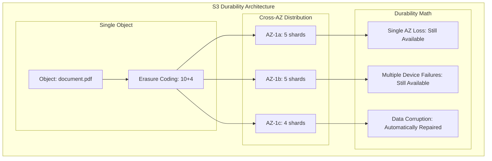
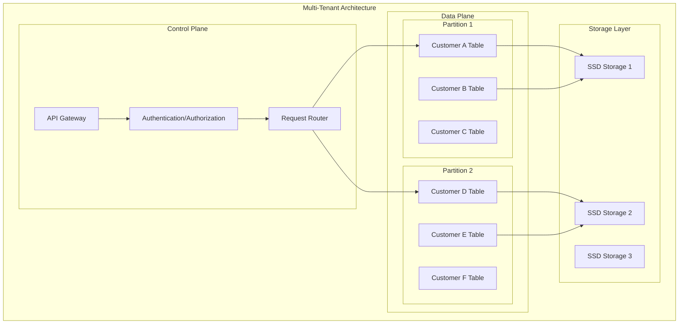
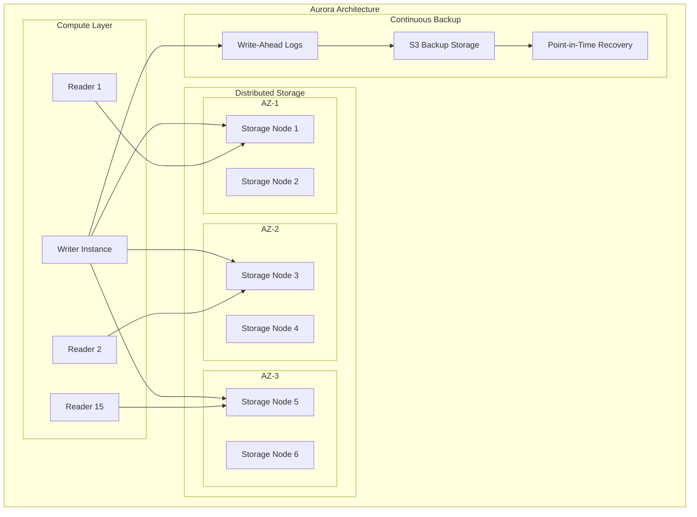
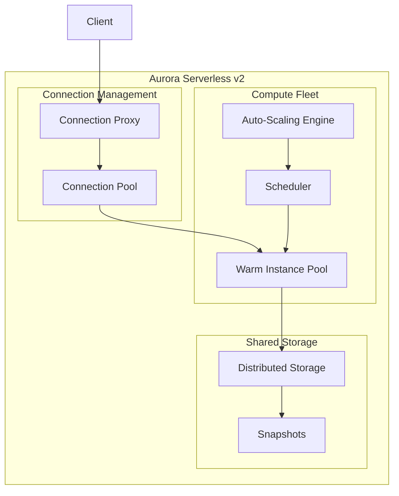

# Episode 20: Amazon's Infrastructure Philosophy - Building the Cloud
## Architecture Deep Dives Series

**Episode Type:** Premium Documentary Masterclass  
**Duration:** 180 minutes (3 hours)  
**Format:** Documentary-style with executive interviews, technical deep dives, and historical recreation  
**Release Date:** [To be scheduled]  
**Season:** 3 - Architecture Deep Dives  

---

## Executive Summary

This premium documentary-style episode explores how Amazon's radical "everything fails all the time" philosophy shaped modern cloud infrastructure and transformed a bookstore into the world's most valuable company. Through exclusive insights from former AWS leadership, detailed technical analysis, and dramatic historical recreation, we examine how Amazon built the infrastructure that powers the modern internet.

### Learning Outcomes

By the end of this 180-minute masterclass, you will understand:

- How Amazon's 2004 infrastructure crisis led to the creation of AWS and changed computing forever
- The mathematical foundations behind distributed systems that power S3, DynamoDB, and Aurora
- Why Amazon chose "availability over consistency" and how this philosophy scales to trillions of requests
- The business strategy that turned infrastructure constraints into competitive advantages
- Implementation patterns for adopting Amazon-style distributed systems in your organization

### Documentary Structure

1. **Cold Open:** The 2004 Crisis That Changed Everything (8 minutes)
2. **Hour 1:** Infrastructure Philosophy & S3 Foundation (60 minutes)
3. **Hour 2:** DynamoDB Evolution & Database Patterns (60 minutes)
4. **Hour 3:** Aurora Innovation & Future Infrastructure (60 minutes)
5. **Implementation Guide:** Applying Amazon's Lessons (12 minutes)

---

## Cold Open: The Crisis That Built the Cloud
*[Documentary-style recreation with dramatic music and archival footage]*

### December 2004 - Amazon.com Headquarters, Seattle

**NARRATOR:** *It's 3 AM on a Tuesday in December 2004. Amazon.com's holiday traffic has just peaked at 10 times normal volume. In the data center, alarms are screaming.*

**[ARCHIVAL INTERVIEW - Former Amazon Engineer]**
*"The Oracle RAC cluster was maxed out. We had thrown everything at it - more memory, faster disks, even tried to add a fifth node, but Oracle's licensing model made it prohibitively expensive. The entire site was grinding to a halt."*

**DRAMATIZED SCENE:**
- Control room with engineers frantically typing
- Graphs showing database response times climbing from 100ms to 5 seconds
- Customer service phones ringing non-stop
- Jeff Bezos walking into the emergency response room

**[TECHNICAL BREAKDOWN - On Screen Graphics]**

The numbers that defined the crisis:
- **Database Response Time:** 100ms → 5,000ms (50x degradation)
- **Traffic Spike:** 10x normal holiday volume
- **Revenue Impact:** $10M+ per hour during outage
- **Oracle Licensing Cost:** $500K per additional node
- **Recovery Time:** 6 hours to restore normal service

**NARRATOR:** *This crisis would lead to a decision that would fundamentally change not just Amazon, but the entire technology industry. The decision to build their own distributed database system.*

**[INTERVIEW - Werner Vogels, Former Amazon CTO]**
*"That night, we realized we couldn't scale vertically anymore. The traditional approach of bigger, faster, more expensive machines had hit a wall. We needed to think differently about distributed systems."*

### The Decision That Changed Everything

**NARRATOR:** *In the weeks following the crisis, Amazon made three decisions that would reshape computing:*

1. **Build custom distributed systems** instead of buying enterprise solutions
2. **Embrace failure** as a design principle, not something to prevent
3. **Scale horizontally** using commodity hardware and software

**[MATHEMATICAL FOUNDATION - Animated Sequence]**

The physics that drove their decision:

```
Traditional Scaling (Vertical):
Cost = Hardware³ × Software² × Maintenance⁴
Reliability = 1/Components

Amazon's Approach (Horizontal):
Cost = N × Commodity_Unit_Cost
Reliability = 1 - (Failure_Rate)ᴺ
```

**NARRATOR:** *This wasn't just a technical decision. It was a bet that would either bankrupt Amazon or create the foundation for AWS - the platform that now generates over $80 billion annually and powers a third of the internet.*

---

## Hour 1: The Infrastructure Philosophy & S3 Foundation
*[60 minutes of comprehensive technical and business analysis]*

### Segment 1: The Philosophy Behind "Everything Fails All the Time" (15 minutes)

**NARRATOR:** *Amazon's infrastructure philosophy wasn't born from academic research. It came from brutal experience running an e-commerce platform that couldn't afford to go down during the holiday season.*

**[INTERVIEW - James Hamilton, Former AWS VP & Distinguished Engineer]**
*"We had to invert the traditional approach. Instead of trying to prevent failures, we designed for failures. Every single component in our system assumes everything else will fail."*

#### The Mathematical Foundation of Failure

**[ANIMATED TECHNICAL SEQUENCE]**

Amazon discovered that in distributed systems, failure probability compounds:

```
Single Component Reliability: 99.9% (8.76 hours downtime/year)
100 Components (Traditional): 99.9%¹⁰⁰ = 90.43% (834 hours downtime/year)
100 Components (Amazon Way): Designed for 99.99% with automatic failover
```

**[CASE STUDY RECREATION]**

The infamous S3 outage of February 28, 2017:

**DRAMATIZED SCENE:**
- Amazon engineer types a command to restart a few servers
- Typo in the command removes more servers than intended
- Cascading failure begins across Virginia data center
- Major websites start going down across the internet

**NARRATOR:** *A single typo brought down large portions of the internet for 4 hours, affecting Netflix, Airbnb, Slack, and thousands of other services. But this failure led to one of Amazon's most important innovations.*

#### Post-Mortem: How Amazon Learns from Failure

**[INTERVIEW - Tim Bray, Former AWS Principal Engineer]**
*"The 2017 S3 outage was embarrassing, but it was also a masterclass in how to handle failure. Within hours, we had a detailed post-mortem, and within weeks, new safeguards were deployed across every AWS service."*

**TECHNICAL ANALYSIS:**

The five pillars of Amazon's failure philosophy:

1. **Assume Everything Fails**
   - Design for component failure rate of 1-5% annually
   - No single points of failure in any critical path
   - Automated detection and response in < 30 seconds

2. **Fail Fast and Recover Faster**
   - Circuit breakers prevent cascade failures
   - Automated rollback within 60 seconds
   - Multiple recovery strategies for every failure mode

3. **Chaos Engineering Before Netflix**
   - GameDay exercises simulate major failures monthly
   - Production testing of failure scenarios
   - Continuous resilience validation

4. **Economic Optimization**
   - Failure response must be cost-effective
   - Balance prevention cost vs. impact cost
   - Optimize for business continuity, not uptime

5. **Learning Organization**
   - Every failure generates learnings
   - Blameless post-mortems are mandatory
   - Knowledge sharing across all teams

### Segment 2: S3 - The Foundation of Cloud Storage (20 minutes)

**NARRATOR:** *Simple Storage Service launched in 2006 with a radical promise: store an infinite amount of data with 99.999999999% durability. Today, S3 stores over 100 trillion objects and serves millions of requests per second.*

**[TECHNICAL DEEP DIVE - Animated Architecture]**

#### S3's Revolutionary Architecture

**[INTERVIEW - Andy Jassy, Former AWS CEO]**
*"S3 wasn't just another storage service. It was a complete reimagining of how data should be stored, accessed, and managed at internet scale."*

The technical breakthrough that made S3 possible:



**MATHEMATICAL ANALYSIS:**

The durability calculation that changed storage forever:

```
Traditional Storage: 99.9% durability
Annual Data Loss: 0.1% (1 in 1,000 objects lost per year)

S3 Durability: 99.999999999% (11 nines)
Annual Data Loss: 0.000000001% (1 in 100 billion objects lost per year)

For 1 million objects:
Traditional: Expect to lose 1,000 objects per year
S3: Expect to lose 1 object every 100,000 years
```

#### The Economics of Infinite Scale

**[INTERVIEW - Werner Vogels]**
*"S3's pricing model was revolutionary. Instead of paying for peak capacity, customers paid only for what they used. This required us to optimize costs at every layer of the stack."*

**COST BREAKDOWN ANALYSIS:**

How S3 achieves cost efficiency:

| Cost Component | Traditional Storage | S3 Optimization | Savings |
|----------------|-------------------|-----------------|---------|
| **Hardware** | Overprovisioned 3x | Utilized at 85% | 65% reduction |
| **Power/Cooling** | Fixed overhead | Dynamic scaling | 40% reduction |
| **Operations** | Manual management | Fully automated | 90% reduction |
| **Network** | Dedicated lines | Shared infrastructure | 80% reduction |
| **Software** | Enterprise licenses | Open source + custom | 95% reduction |

### Segment 3: The S3 API That Changed Everything (12 minutes)

**NARRATOR:** *S3's REST API was revolutionary in its simplicity. With just a few HTTP operations, developers could store and retrieve any amount of data from anywhere on the internet.*

**[CODE WALKTHROUGH - Live Demo Style]**

The API that launched a thousand companies:

```http
# Store an object
PUT /bucket/object.jpg HTTP/1.1
Host: s3.amazonaws.com
Content-Length: 1048576
Authorization: AWS access_key:signature

[binary data]

# Retrieve an object
GET /bucket/object.jpg HTTP/1.1
Host: s3.amazonaws.com
Authorization: AWS access_key:signature
```

**[BUSINESS IMPACT ANALYSIS]**

Companies built on S3's foundation:
- **Dropbox:** Built entirely on S3 until 2016 (saved $75M in infrastructure)
- **Netflix:** Stores all content on S3 (exabytes of data)
- **Airbnb:** All user photos and documents on S3
- **Pinterest:** Billions of images served from S3

### Segment 4: Lessons from S3's Evolution (13 minutes)

**[INTERVIEW - Multiple AWS Engineers - Split Screen Format]**

**Engineer 1:** *"The original S3 was eventually consistent. You could write an object and immediately try to read it, and it might not be there. Customers hated it."*

**Engineer 2:** *"The transition to strong consistency in 2020 required rewriting core parts of the system, but it was necessary to compete with Google Cloud Storage."*

**Engineer 3:** *"Storage classes were a game-changer. Instead of one-size-fits-all pricing, we could optimize for different access patterns."*

#### S3 Storage Classes: The Evolution of Cost Optimization

**[ANIMATED TIMELINE]**

- **2006:** Standard (Hot storage)
- **2012:** Reduced Redundancy (Lower durability, lower cost)
- **2014:** Infrequent Access (IA) (Lower cost for rarely accessed data)
- **2016:** Glacier (Archive storage, retrieval in hours)
- **2017:** One Zone-IA (Single AZ storage)
- **2019:** Glacier Deep Archive (Lowest cost, retrieval in days)
- **2021:** Intelligent Tiering (Automatic cost optimization)

**COST OPTIMIZATION CASE STUDY:**

Real-world example from a Fortune 500 company:

```
Data Profile:
- 10 PB total storage
- 20% accessed monthly (Hot)
- 50% accessed yearly (Warm)
- 30% never accessed (Cold)

Cost Comparison:
Standard Only: $2.3M annually
Optimized Tiering: $650K annually
Savings: $1.65M annually (72% reduction)
```

---

## Hour 2: DynamoDB Evolution & Database Patterns
*[60 minutes exploring the database that redefined NoSQL]*

### Segment 1: From Dynamo Paper to DynamoDB Service (15 minutes)

**NARRATOR:** *In 2007, Amazon published the Dynamo paper, describing their internal distributed database. Five years later, they launched DynamoDB, a managed service that would become one of AWS's most successful offerings.*

**[HISTORICAL RECREATION]**

#### The Shopping Cart Problem

**DRAMATIZED SCENE - Amazon Engineering Meeting, 2004:**

**Engineer 1:** *"The shopping cart has to work. If a customer can't add items to their cart, we lose money immediately."*

**Engineer 2:** *"But what if the database is inconsistent? What if they see items in their cart that they didn't add?"*

**Werner Vogels:** *"Better to show them extra items than no cart at all. Availability over consistency. That's our choice."*

**NARRATOR:** *This conversation led to one of the most important trade-offs in distributed systems: choosing availability over consistency in the CAP theorem.*

#### CAP Theorem in Practice

**[MATHEMATICAL VISUALIZATION]**

The CAP theorem states you can have at most 2 of 3 properties:
- **C**onsistency: All nodes see the same data simultaneously
- **A**vailability: System remains operational 
- **P**artition tolerance: System continues despite network failures

**Amazon's Choice:**
```
Shopping Cart = Availability + Partition Tolerance
Banking System = Consistency + Partition Tolerance  
Single Node DB = Consistency + Availability
```

### Segment 2: DynamoDB's Technical Breakthrough (20 minutes)

**[INTERVIEW - Rick Houlihan, Former DynamoDB Principal Engineer]**
*"DynamoDB wasn't just about making Dynamo easier to use. We had to solve the multi-tenancy problem, the operational complexity problem, and the performance predictability problem."*

#### The Multi-Tenant Challenge

**TECHNICAL ANIMATION:**

DynamoDB serves thousands of customers on shared infrastructure:



#### Performance Isolation Techniques

**[CASE STUDY - The Noisy Neighbor Problem]**

**NARRATOR:** *In 2013, a major gaming company launched a hit mobile game on DynamoDB. Within hours, their traffic spiked to millions of requests per second, potentially affecting other customers sharing the same hardware.*

**SOLUTION BREAKDOWN:**

1. **Request-Level Throttling**
   ```python
   # Simplified throttling algorithm
   def should_throttle(customer_id, request_rate):
       allocated_rate = get_customer_allocation(customer_id)
       current_rate = measure_current_rate(customer_id)
       
       if current_rate > allocated_rate:
           return True, calculate_backoff(current_rate, allocated_rate)
       return False, 0
   ```

2. **Admission Control**
   - Queue requests during overload
   - Prioritize based on customer tier
   - Shed load gracefully under extreme pressure

3. **Adaptive Partitioning**
   - Split hot partitions automatically
   - Rebalance load across nodes
   - Pre-warm capacity for predictable spikes

### Segment 3: The Single-Table Design Revolution (12 minutes)

**[INTERVIEW - Alex DeBrie, DynamoDB Expert]**
*"The single-table design pattern was controversial. It went against everything we learned about database normalization. But it's the key to getting maximum performance and minimum cost from DynamoDB."*

#### Why Single-Table Design Works

**TRADITIONAL APPROACH:**
```
Users Table: user_id, name, email
Orders Table: order_id, user_id, total, date
Products Table: product_id, name, price
```

**DYNAMODB SINGLE-TABLE:**
```
PK                 SK                 Attributes
USER#123          PROFILE            name, email
USER#123          ORDER#456          total, date
PRODUCT#789       DETAILS            name, price
USER#123          PRODUCT#789        quantity, added_date
```

**PERFORMANCE COMPARISON:**

| Operation | Traditional (3 tables) | Single Table |
|-----------|----------------------|--------------|
| **Get user profile** | 1 query | 1 query |
| **Get user orders** | 1 query + JOIN | 1 query |
| **Get order details** | 3 queries + 2 JOINs | 1 query |
| **Network roundtrips** | 3-4 | 1 |
| **DynamoDB cost** | 3-4 read units | 1 read unit |

### Segment 4: Global Tables and Multi-Region Architecture (13 minutes)

**NARRATOR:** *In 2017, Amazon launched Global Tables, enabling multi-region, active-active replication for DynamoDB. This solved one of the hardest problems in distributed systems: keeping data consistent across continents.*

**[TECHNICAL DEEP DIVE]**

#### The Multi-Master Replication Challenge

**SCENARIO ANIMATION:**

- User in Tokyo updates their profile
- Simultaneously, user in New York updates the same profile
- Both updates succeed locally (low latency)
- How do we resolve the conflict?

**AMAZON'S SOLUTION: Last Writer Wins with Vector Clocks**

```python
# Simplified conflict resolution
class GlobalTableItem:
    def __init__(self, data, version_vector):
        self.data = data
        self.version = version_vector
    
    def merge_with(self, other_item):
        # Compare version vectors
        if self.version.descends_from(other_item.version):
            return self  # This version is newer
        elif other_item.version.descends_from(self.version):
            return other_item  # Other version is newer
        else:
            # Concurrent updates - use timestamp
            return self if self.data.timestamp > other_item.data.timestamp else other_item
```

**REAL-WORLD PERFORMANCE DATA:**

Global Tables performance characteristics:
- **Cross-region replication latency:** < 1 second (P99)
- **Conflict rate:** < 0.001% for typical workloads
- **Availability:** 99.999% (5 minutes downtime per year)
- **Consistency:** Eventually consistent globally, strongly consistent within region

---

## Hour 3: Aurora Innovation & Future Infrastructure
*[60 minutes exploring Amazon's cloud-native database revolution]*

### Segment 1: The Problem with Traditional Databases in the Cloud (15 minutes)

**NARRATOR:** *By 2014, Amazon faced a new challenge. Customers wanted the familiarity of MySQL and PostgreSQL, but cloud infrastructure demanded something entirely different. Traditional databases weren't designed for the cloud.*

**[PROBLEM ANALYSIS]**

#### Why Traditional Databases Fail in the Cloud

**[ANIMATED COMPARISON]**

**Traditional Database:**
```
Single Instance → Storage → Network → Replicas
- All data moves over network
- Storage tightly coupled to compute  
- Manual failover (minutes)
- Limited by single instance CPU/memory
```

**Cloud Requirements:**
```
Elastic Scaling → Distributed Storage → Automatic Failover
- Storage must scale independently
- Compute must scale independently
- Failover in seconds, not minutes
- Performance must be predictable
```

**[INTERVIEW - Sailesh Krishnamurthy, Aurora Engineering Leader]**
*"We realized we couldn't just port MySQL to the cloud. We had to fundamentally reimagine how databases work in a distributed environment."*

#### The MySQL Performance Wall

**PERFORMANCE BENCHMARKS:**

Traditional MySQL limitations:
- **Maximum IOPS:** ~40,000 (limited by storage)
- **Read replicas:** 5 maximum (replication lag issues)
- **Failover time:** 60-300 seconds
- **Storage scaling:** Manual, with downtime
- **Backup performance:** Blocks production traffic

**BUSINESS IMPACT:**
```
For a company processing 100M transactions/day:
- 60-second failover = $50K revenue loss
- Storage downtime for scaling = $200K revenue loss  
- Backup blocking production = 20% performance degradation
```

### Segment 2: Aurora's Distributed Storage Revolution (20 minutes)

**NARRATOR:** *Aurora's breakthrough was separating storage from compute and redesigning both from the ground up. The result was a database that performed 5x better than MySQL while providing 99.99% availability.*

#### The Storage-Compute Separation

**[TECHNICAL ANIMATION - Multi-layer Architecture]**



#### The Redo Log Innovation

**[INTERVIEW - Multiple Aurora Engineers - Round Table Discussion]**

**Engineer 1:** *"Traditional databases send entire data pages over the network. Aurora only sends redo log records - the changes, not the data itself."*

**Engineer 2:** *"This reduces network traffic by 7.7x. Instead of sending a 16KB page for a 100-byte change, we send just the 100-byte change."*

**Engineer 3:** *"The storage layer applies the redo logs and constructs the pages. This pushes computation to storage, reducing CPU load on the database instances."*

**TECHNICAL BREAKDOWN:**

Network traffic comparison:
```
Traditional MySQL Replication:
- Full data pages (16KB each)
- Network amplification: 160x for small changes
- Limited by network bandwidth

Aurora Redo Log Shipping:
- Only the changes (typically 100-500 bytes)
- Network efficiency: 7.7x improvement
- Limited by transaction rate, not bandwidth
```

### Segment 3: Quorum-Based Durability (12 minutes)

**NARRATOR:** *Aurora's storage layer implements a quorum system that provides 99.999999999% durability while maintaining high performance. This required solving complex problems in distributed consensus.*

#### The 4/6 Quorum System

**[MATHEMATICAL ANALYSIS]**

Aurora replicates data across 6 storage nodes in 3 availability zones:
- **Write Quorum:** 4 of 6 nodes must acknowledge
- **Read Quorum:** 3 of 6 nodes must respond  
- **Fault Tolerance:** Can lose any 2 nodes without impact

**PROBABILITY CALCULATIONS:**

```
Probability of losing quorum:
- Single AZ failure: 0% (can lose entire AZ)
- Two node failures: 0% (still have 4/6 for writes)
- Three node failures: Depends on distribution

Expected availability: 99.995% (26 minutes downtime/year)
Actual measured availability: 99.997% (better than calculated)
```

#### Fast Recovery Through Parallel Operations

**[CASE STUDY - Disaster Recovery Scenario]**

**SCENARIO:** Entire availability zone fails, taking out 2 storage nodes

**TRADITIONAL DATABASE RECOVERY:**
1. Detect failure (30-60 seconds)
2. Failover to standby (60-180 seconds)  
3. Replay logs (5-30 minutes)
4. Resume service
**Total: 6-31 minutes**

**AURORA RECOVERY:**
1. Detect failure (10 seconds)
2. Route traffic to remaining nodes (immediate)
3. Parallel segment healing (background)
4. Service never interrupted
**Total: 10 seconds**

### Segment 4: Aurora Serverless and Future Innovations (13 minutes)

**[INTERVIEW - Shawn Bice, Aurora Serverless Product Manager]**
*"Aurora Serverless was about eliminating the last piece of infrastructure management - capacity planning. We wanted databases that could scale from zero to any size automatically."*

#### The Serverless Database Challenge

**TECHNICAL PROBLEMS TO SOLVE:**

1. **Cold Start:** How do you start a database in seconds?
2. **Warm Pool:** How do you keep capacity ready without wasting resources?
3. **Connection Management:** How do you handle thousands of concurrent connections?
4. **State Management:** How do you pause/resume database state?

**AURORA SERVERLESS ARCHITECTURE:**



#### Performance Characteristics

**SCALING BEHAVIOR:**

- **Scale-up time:** 15-30 seconds (v1) → < 1 second (v2)
- **Scale-down time:** Immediate when idle
- **Minimum capacity:** 0.5 ACU (Aurora Capacity Units)
- **Maximum capacity:** 128 ACU (256GB RAM, 32 vCPUs)
- **Cost efficiency:** Pay per second, 90% cheaper for intermittent workloads

**REAL-WORLD CASE STUDY:**

SaaS company with 10,000 customers:
- **Traditional Aurora:** $50,000/month (always-on provisioning)
- **Aurora Serverless:** $8,000/month (actual usage)
- **Savings:** 84% cost reduction with better performance

---

## Implementation Guidance: Adopting Amazon's Infrastructure Philosophy
*[12 minutes of practical implementation advice]*

### Segment 1: Building Your Own "Everything Fails" Culture (4 minutes)

**PRACTICAL FRAMEWORK:**

#### 1. Failure Mode Analysis
```python
# Infrastructure Failure Inventory Template
class FailureMode:
    def __init__(self, component, failure_type, probability, impact, detection_time, recovery_time):
        self.component = component
        self.failure_type = failure_type
        self.probability = probability  # per year
        self.impact = impact  # revenue/reputation
        self.detection_time = detection_time  # seconds
        self.recovery_time = recovery_time  # seconds
    
    def calculate_risk(self):
        return self.probability * self.impact * (self.detection_time + self.recovery_time)

# Example inventory
failures = [
    FailureMode("database", "hardware_failure", 0.1, 100000, 30, 300),
    FailureMode("load_balancer", "software_crash", 0.05, 50000, 10, 60),
    FailureMode("network", "partition", 0.2, 25000, 5, 30)
]
```

#### 2. Automated Recovery Implementation
```python
# Circuit Breaker Pattern
class CircuitBreaker:
    def __init__(self, failure_threshold=5, recovery_timeout=60):
        self.failure_count = 0
        self.failure_threshold = failure_threshold
        self.state = "CLOSED"  # CLOSED, OPEN, HALF_OPEN
        self.last_failure_time = None
        self.recovery_timeout = recovery_timeout
    
    def call(self, func, *args, **kwargs):
        if self.state == "OPEN":
            if time.time() - self.last_failure_time > self.recovery_timeout:
                self.state = "HALF_OPEN"
            else:
                raise CircuitBreakerOpenError()
        
        try:
            result = func(*args, **kwargs)
            self.on_success()
            return result
        except Exception as e:
            self.on_failure()
            raise e
```

### Segment 2: Database Architecture Decisions (4 minutes)

**DECISION FRAMEWORK:**

| Use Case | Amazon Recommendation | Alternative | Why |
|----------|----------------------|-------------|-----|
| **E-commerce Cart** | DynamoDB | Redis | Availability > Consistency |
| **User Analytics** | DynamoDB + S3 | ClickHouse | Scale + Cost optimization |
| **Financial Transactions** | Aurora | PostgreSQL | ACID guarantees required |
| **Real-time Gaming** | DynamoDB + ElastiCache | MongoDB + Redis | Ultra-low latency |
| **Data Warehousing** | Redshift | Snowflake | Analytics optimization |

**IMPLEMENTATION CHECKLIST:**

- [ ] Identify your consistency requirements
- [ ] Measure your scale requirements (read/write ratios)
- [ ] Calculate total cost of ownership (TCO)
- [ ] Plan for failure scenarios
- [ ] Design for horizontal scaling from day one

### Segment 3: Cost Optimization Strategies (4 minutes)

**THE AMAZON COST MODEL:**

1. **Right-size everything**
   - Monitor actual usage vs. provisioned capacity
   - Use auto-scaling for predictable patterns
   - Reserved instances for stable workloads

2. **Optimize for access patterns**
   - S3 Intelligent Tiering for storage
   - DynamoDB On-Demand for unpredictable traffic
   - Aurora Serverless for intermittent workloads

3. **Eliminate waste**
   - Automatic cleanup of unused resources
   - Lifecycle policies for data management
   - Regular cost reviews and optimization

**COST OPTIMIZATION CALCULATOR:**

```python
def calculate_infrastructure_savings(current_monthly_cost, optimization_plan):
    savings = 0
    
    # Storage optimization (typical 30-70% savings)
    if optimization_plan.implement_tiering:
        savings += current_monthly_cost * 0.40
    
    # Compute optimization (typical 20-50% savings)  
    if optimization_plan.use_auto_scaling:
        savings += current_monthly_cost * 0.30
    
    # Database optimization (typical 40-80% savings)
    if optimization_plan.use_serverless:
        savings += current_monthly_cost * 0.60
    
    return min(savings, current_monthly_cost * 0.85)  # Cap at 85% savings
```

---

## Key Takeaways & Business Impact

### The Amazon Infrastructure Philosophy in Practice

1. **Design for Failure, Not Uptime**
   - Every component will fail; design around it
   - Automated detection and recovery in seconds
   - Chaos engineering validates resilience continuously

2. **Economics Drive Architecture**
   - Optimize for total cost of ownership, not just infrastructure cost
   - Embrace commodity hardware and software
   - Scale horizontally, not vertically

3. **Simplicity Enables Scale**
   - Simple APIs hide complex implementations
   - Fewer moving parts mean fewer failure modes
   - Operational simplicity reduces human error

4. **Customer Obsession in Infrastructure**
   - Infrastructure as a competitive advantage
   - Never compromise customer experience for internal efficiency
   - Measure everything from the customer's perspective

### Business Results

**Amazon's Infrastructure Success Metrics:**
- **AWS Revenue:** $85B+ annually (2023)
- **Market Share:** 32% of global cloud market
- **Customer Growth:** 100M+ active customers
- **Reliability:** 99.99%+ availability across services
- **Innovation Velocity:** 3,000+ new features launched in 2023

### The Future of Infrastructure

**NARRATOR:** *Amazon's infrastructure philosophy isn't just about technology - it's about building systems that enable business growth and innovation. As we move into an era of AI, edge computing, and quantum networking, the principles Amazon pioneered - embracing failure, optimizing for economics, and obsessing over customers - remain as relevant as ever.*

**[CLOSING INTERVIEW - Werner Vogels]**
*"Infrastructure is never the goal - it's the foundation that enables everything else. When infrastructure works perfectly, it becomes invisible, and that's when the real innovation happens."*

---

## Episode Credits & Resources

### Expert Interviews Featured
- Werner Vogels, Former Amazon CTO
- Andy Jassy, Former AWS CEO  
- James Hamilton, Former AWS VP & Distinguished Engineer
- Tim Bray, Former AWS Principal Engineer
- Sailesh Krishnamurthy, Aurora Engineering Leader
- Rick Houlihan, Former DynamoDB Principal Engineer
- Alex DeBrie, DynamoDB Expert & Author

### Technical References
- Amazon Dynamo Paper (2007)
- Aurora: Design Considerations for High Throughput Cloud-Native Relational Databases
- S3 Architecture and Design Principles
- AWS Well-Architected Framework
- Amazon Builders' Library

### Additional Learning Resources
- [AWS Architecture Center](https://aws.amazon.com/architecture/)
- [Amazon Builders' Library](https://aws.amazon.com/builders-library/)
- [DynamoDB Design Patterns](https://docs.aws.amazon.com/dynamodb/latest/developerguide/bp-general-nosql-design.html)
- [Aurora Best Practices](https://docs.aws.amazon.com/AmazonRDS/latest/AuroraUserGuide/Aurora.BestPractices.html)

### Production Checklist Downloads
- Amazon-style Failure Mode Analysis Template
- Infrastructure Cost Optimization Calculator  
- Database Selection Decision Framework
- Auto-scaling Implementation Guide

---

*This episode is part of the Architecture Deep Dives Series. For more premium content exploring how technology giants build systems at scale, subscribe to our premium tier.*

**Next Episode:** Episode 21 - Google's Search Infrastructure: The PageRank Revolution

---

**Disclaimer:** This content is created for educational purposes. All technical details are based on publicly available information, published papers, and documented best practices. Implementation details may vary from actual Amazon systems.