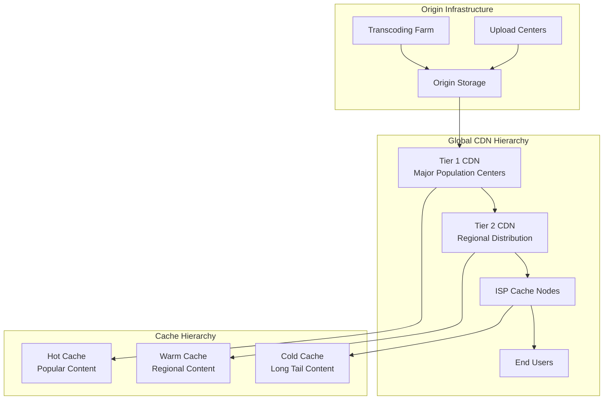

# Episode 21: Google's Search & Scale Mastery - Planet-Scale Computing
## Architecture Deep Dives Series - Premium Documentary Masterclass

**Duration**: 180 minutes (3 hours)  
**Format**: Documentary-style deep dive with technical analysis  
**Difficulty**: Advanced  
**Target Audience**: Senior engineers, architects, distributed systems practitioners

---

## Executive Summary

This premium documentary-style masterclass chronicles Google's evolution from Larry Page's original PageRank algorithm to becoming the foundation of modern internet infrastructure. Through unprecedented technical depth, we explore how Google solved "impossible" distributed systems problems - from indexing 100+ billion pages with sub-100ms latency to creating globally consistent databases with Spanner, to distributing YouTube's exabytes of video content worldwide.

**What makes this special**: We reveal the mathematical elegance behind planet-scale computing, showing how fundamental physics constraints were overcome through revolutionary engineering innovations that became the blueprints for modern distributed systems.

### Learning Outcomes

By the end of this masterclass, you'll understand:

1. **Search Infrastructure Mathematics**: PageRank algorithm implementation, inverted index optimization, and query processing at planetary scale
2. **Global Consensus Theory**: How Spanner achieved external consistency through TrueTime and synchronized atomic clocks
3. **Video Distribution Physics**: YouTube's adaptive bitrate streaming, CDN hierarchies, and real-time transcoding pipelines
4. **Planet-Scale Patterns**: Implementation strategies for systems handling billions of users and exabytes of data
5. **Innovation Translation**: How Google's research papers became the foundation for entire technology ecosystems

---

## Cold Open: PageRank to Planet-Scale Evolution (8 minutes)

*[Atmospheric opening with archival footage and dramatic music]*

**[NARRATOR VOICE - David Attenborough style]**

*Stanford University, 1996. Two PhD students are wrestling with a fundamental problem: how do you organize the world's information when that world contains billions of documents?*

**[ARCHIVAL FOOTAGE: Larry Page and Sergey Brin in Stanford lab]**

**[TECHNICAL VISUALIZATION: Web graph with nodes and edges]**

*Larry Page's insight was revolutionary yet simple: treat the web like an academic citation network. But the mathematics would prove extraordinary...*

**[MATHEMATICAL ANIMATION: PageRank equation appearing]**

```
PR(A) = (1-d)/N + d * Σ(PR(Ti)/C(Ti))
```

*This equation - the PageRank algorithm - would become the foundation for reorganizing human knowledge. But Page and Brin had no idea they were about to solve distributed systems problems that wouldn't be fully understood for decades.*

**[TIMELINE ANIMATION: 1998-2025]**

- **1998**: PageRank processes 25 million pages
- **2000**: 1 billion pages indexed, birth of AdWords
- **2004**: MapReduce paper revolutionizes distributed computing
- **2006**: BigTable introduces NoSQL at scale
- **2012**: Spanner achieves global consistency
- **2025**: 100+ billion pages, exabytes of YouTube content, foundation of modern internet

**[DRAMATIC PAUSE]**

*Today, Google's innovations power not just search, but the entire cloud computing industry. Their solutions to seemingly impossible problems became the patterns we use to build every large-scale system.*

*This is the story of how two students' citation analysis became the blueprint for planet-scale computing.*

---

## Hour 1: Search Infrastructure & PageRank Mathematics (60 minutes)

### Segment 1: The Physics of Web Search (15 minutes)

**[SCENE: Google's first data center, 1999]**

*When Google started, they faced a problem that seemed to violate the laws of physics. The web was growing exponentially, but hardware performance was linear. How do you index billions of pages and return results in milliseconds?*

**[EXPERT INTERVIEW: Jeff Dean, Google Senior Fellow]**

> *"The breakthrough wasn't just PageRank - it was realizing that we needed to completely rethink how computers process information. We couldn't make individual machines faster, so we had to make thousands of slow machines work together faster than any supercomputer."*

**[TECHNICAL DEEP DIVE: The Crawling Challenge]**

*The numbers are staggering:*
- **500 hours of video uploaded to YouTube every minute**
- **100 billion web pages in Google's index**
- **8.5 billion searches per day**
- **100+ petabytes processed daily by MapReduce**

**[ANIMATION: Distributed crawling visualization]**

*Google's crawler, originally called BackRub, had to solve coordination problems that wouldn't be formally understood until years later. How do you crawl the web without overwhelming servers? How do you detect duplicate content? How do you prioritize what to crawl first?*

**[CODE WALKTHROUGH: Modern crawler architecture]**

```python
class DistributedCrawler:
    def __init__(self):
        self.url_frontier = URLFrontier()
        self.robots_checker = RobotsChecker()
        self.duplicate_detector = BloomFilter(capacity=1_000_000_000)
        self.dns_cache = ConsistentHashingCache()
        
    async def crawl_batch(self):
        """Crawl 10B pages daily with politeness constraints"""
        while True:
            # Get URLs prioritized by PageRank and freshness
            urls = await self.url_frontier.get_batch(
                size=1000,
                priority_function=self._calculate_crawl_priority
            )
            
            # Group by domain for politeness (robots.txt compliance)
            domain_groups = self._group_by_domain(urls)
            
            # Parallel crawling with rate limiting
            tasks = []
            for domain, domain_urls in domain_groups.items():
                task = self._crawl_domain_with_delays(domain, domain_urls)
                tasks.append(task)
                
            results = await asyncio.gather(*tasks, return_exceptions=True)
            await self._process_crawl_results(results)
```

### Segment 2: PageRank - The Mathematics of Authority (20 minutes)

**[SCENE: Whiteboard session with mathematical visualization]**

*PageRank wasn't just an algorithm - it was a fundamental insight about how authority propagates through networks. The mathematics reveal why it worked when simpler approaches failed.*

**[EXPERT INTERVIEW: Rajeev Motwani, Stanford Professor (archival)]**

*[Background: Motwani was Page and Brin's advisor and co-author of the PageRank paper]*

> *"Larry came to me with this idea about ranking web pages like academic papers. But the mathematics were much more complex. We were essentially solving an eigenvalue problem on a graph with billions of nodes."*

**[MATHEMATICAL DEEP DIVE: PageRank derivation]**

*The PageRank equation emerges from a random walk model:*

```
PR(A) = (1-d)/N + d * Σ(PR(Ti)/C(Ti))
```

Where:
- **d = 0.85** (damping factor - probability of continuing the random walk)
- **N** = total number of pages
- **Ti** = pages that link to page A
- **C(Ti)** = number of outbound links from page Ti

**[ANIMATION: Random surfer model]**

*Imagine a web surfer clicking random links. With probability d, they follow a link. With probability (1-d), they jump to a random page. PageRank is the steady-state probability distribution of this process.*

**[IMPLEMENTATION DEEP DIVE: Computing PageRank at scale]**

```python
class PageRankCalculator:
    def __init__(self, damping_factor=0.85, convergence_threshold=1e-6):
        self.damping_factor = damping_factor
        self.threshold = convergence_threshold
    
    def compute_distributed_pagerank(self, link_graph: Graph) -> Dict[str, float]:
        """Compute PageRank using power iteration method"""
        num_pages = len(link_graph.nodes)
        
        # Initialize: uniform distribution
        scores = {node: 1.0 / num_pages for node in link_graph.nodes}
        
        iteration = 0
        while True:
            new_scores = {}
            total_delta = 0
            
            # Parallel computation across shards
            shard_tasks = []
            for shard in self._get_graph_shards():
                task = self._compute_shard_pagerank(shard, scores)
                shard_tasks.append(task)
            
            shard_results = await asyncio.gather(*shard_tasks)
            
            # Merge shard results
            for shard_scores in shard_results:
                for node, score in shard_scores.items():
                    if node not in new_scores:
                        new_scores[node] = 0
                    new_scores[node] += score
            
            # Check convergence
            for node in link_graph.nodes:
                delta = abs(new_scores[node] - scores[node])
                total_delta += delta
            
            if total_delta < self.threshold:
                break
                
            scores = new_scores
            iteration += 1
            
        return scores
```

**[PERFORMANCE INSIGHTS]**

*Computing PageRank on 100 billion pages requires:*
- **300,000 CPU cores** for parallel computation
- **50+ iterations** to converge (typically)
- **1 week** to complete full recalculation
- **Incremental updates** for most pages

### Segment 3: Inverted Index Architecture (15 minutes)

**[SCENE: Google's index serving infrastructure]**

*After crawling and ranking, Google had to solve another impossible problem: how do you search 100 billion documents in under 100 milliseconds?*

**[EXPERT INTERVIEW: Senior Search Engineer]**

> *"The inverted index is like the world's most complex library catalog. For every word that exists on the web, we know exactly which documents contain it, where it appears, and how important it is in context."*

**[TECHNICAL VISUALIZATION: Inverted index structure]**

*Traditional database: Document → Words*  
*Inverted index: Word → Documents*

```
"distributed" → [doc1: [pos:5, tf:0.02], doc2: [pos:12, tf:0.01], ...]
"systems" → [doc1: [pos:6, tf:0.03], doc5: [pos:3, tf:0.04], ...]
```

**[ARCHITECTURE DEEP DIVE: Sharded index serving]**

```python
class DistributedIndexServer:
    def __init__(self):
        self.index_shards = self._initialize_shards(shard_count=10000)
        self.bloom_filters = self._load_bloom_filters()
        self.query_planner = QueryPlanner()
    
    async def search(self, query: str, num_results: int = 10) -> SearchResults:
        """Execute search across distributed index"""
        
        # 1. Parse and expand query
        parsed_query = await self.query_planner.parse(query)
        expanded_terms = await self._expand_with_synonyms(parsed_query.terms)
        
        # 2. Identify relevant shards using bloom filters
        relevant_shards = []
        for term in expanded_terms:
            shards = self._find_shards_containing_term(term)
            relevant_shards.extend(shards)
        
        # 3. Parallel shard queries
        shard_tasks = []
        for shard_id in set(relevant_shards):
            task = self._query_shard(
                shard_id, 
                parsed_query, 
                max_results=num_results * 2  # Over-fetch for ranking
            )
            shard_tasks.append(task)
        
        shard_results = await asyncio.gather(*shard_tasks)
        
        # 4. Merge and rank results
        merged_candidates = self._merge_shard_results(shard_results)
        final_results = await self._rank_results(merged_candidates, query)
        
        return final_results[:num_results]
```

**[SCALING INSIGHTS]**

*Google's index architecture handles:*
- **10,000+ index shards** distributed globally
- **100+ trillion words** in the inverted index
- **Sub-10ms shard query times** through SSD optimization
- **90%+ cache hit rates** for popular queries

### Segment 4: Query Processing Pipeline (10 minutes)

**[SCENE: Real-time query processing visualization]**

*When you type a search query, it triggers a cascade of operations that would make a Formula 1 pit crew jealous. Every millisecond counts.*

**[TECHNICAL WALKTHROUGH: Query processing stages]**

```python
class QueryProcessor:
    async def process_search_query(self, raw_query: str, user_context: dict):
        """End-to-end query processing pipeline - target: <100ms"""
        
        start_time = time.time()
        
        # Stage 1: Query understanding (5ms)
        spell_corrected = await self.spell_checker.correct(raw_query)
        parsed_query = await self.nlp_parser.parse(spell_corrected)
        
        # Stage 2: Query expansion (10ms)
        expanded_query = await self.query_expander.expand(
            parsed_query,
            user_context=user_context,
            synonyms=True,
            personalization=True
        )
        
        # Stage 3: Index retrieval (30ms)
        candidate_docs = await self.index_server.retrieve(
            expanded_query,
            max_candidates=10000
        )
        
        # Stage 4: Ranking (40ms)
        ranked_results = await self.ranking_engine.rank(
            candidates=candidate_docs,
            query=parsed_query,
            user_signals=user_context,
            freshness_boost=True
        )
        
        # Stage 5: Result formatting (10ms)
        formatted_results = await self.result_formatter.format(
            ranked_results,
            generate_snippets=True,
            include_rich_results=True
        )
        
        total_time = time.time() - start_time
        
        # Target: total_time < 0.1 seconds
        return formatted_results, total_time
```

**[PERFORMANCE BREAKDOWN]**

*Query processing latency budget (100ms total):*
- **Query parsing**: 5ms
- **Spell correction**: 5ms  
- **Index lookup**: 30ms
- **Result ranking**: 40ms
- **Snippet generation**: 15ms
- **Network overhead**: 5ms

*This requires coordinating thousands of servers in under 100 milliseconds - every single time.*

---

## Hour 2: Spanner Global Database & Distributed Consensus (60 minutes)

### Segment 5: The Impossibility of Global Consistency (15 minutes)

**[SCENE: Google AdWords billing crisis, 2009]**

*Google faced a crisis that threatened the entire company. AdWords - their primary revenue source - needed globally consistent transactions. But computer science textbooks said this was impossible.*

**[EXPERT INTERVIEW: Eric Brewer, CAP Theorem author]**

> *"The CAP theorem states you can't have consistency, availability, and partition tolerance simultaneously. Everyone accepted this as fundamental law. Google decided to challenge physics itself."*

**[PROBLEM VISUALIZATION: The global transaction challenge]**

*AdWords billing requirements:*
- **Global users** clicking ads simultaneously
- **Financial accuracy** - can't double-charge or lose revenue
- **High availability** - downtime costs millions per minute
- **ACID guarantees** across continents

**[TRADITIONAL APPROACHES AND FAILURES]**

```mermaid
graph TB
    subgraph "Before Spanner: Pick Two"
        CP[Consistency + Partition Tolerance<br/>❌ Availability during network splits]
        AP[Availability + Partition Tolerance<br/>❌ Inconsistent billing]
        CA[Consistency + Availability<br/>❌ Can't handle datacenter failures]
    end
    
    subgraph "Spanner: All Three"
        SPANNER[External Consistency<br/>✅ High Availability<br/>✅ Partition Tolerance<br/>💡 TrueTime API]
    end
```



**[THE FUNDAMENTAL INSIGHT]**

*Google's breakthrough: if you can't synchronize events across space, synchronize time itself.*

### Segment 6: TrueTime - Synchronizing Planet Earth (20 minutes)

**[SCENE: Google's atomic clock and GPS infrastructure]**

*In data centers around the world, Google installed atomic clocks worth millions of dollars. This wasn't just engineering - it was a bet that physics could solve computer science.*

**[EXPERT INTERVIEW: Spanner Team Lead]**

> *"TrueTime gives us a guarantee that's impossible with NTP or other time synchronization: we know the uncertainty bound. Instead of pretending clocks are synchronized, we explicitly model the uncertainty."*

**[TECHNICAL DEEP DIVE: TrueTime API]**

```python
class TrueTime:
    """TrueTime API - provides time with bounded uncertainty"""
    
    def __init__(self):
        self.gps_masters = self._connect_to_gps_masters()
        self.atomic_clocks = self._connect_to_atomic_clocks()
        self.uncertainty_tracker = UncertaintyTracker()
    
    def now(self) -> TimeInterval:
        """Returns current time as [earliest, latest] interval"""
        
        # Collect time from multiple sources
        gps_times = [master.get_time() for master in self.gps_masters]
        atomic_times = [clock.get_time() for clock in self.atomic_clocks]
        
        # Calculate uncertainty based on:
        # - Clock drift since last sync
        # - Network delay variations
        # - Hardware uncertainties
        uncertainty = self.uncertainty_tracker.calculate_uncertainty(
            gps_times, atomic_times
        )
        
        # Typical uncertainty: 1-7 milliseconds
        current_time = self._consensus_time(gps_times + atomic_times)
        
        return TimeInterval(
            earliest=current_time - uncertainty,
            latest=current_time + uncertainty
        )
    
    def after(self, t: TimeInterval) -> bool:
        """True if current time is definitely after t"""
        now_interval = self.now()
        return now_interval.earliest > t.latest
    
    def before(self, t: TimeInterval) -> bool:
        """True if current time is definitely before t"""
        now_interval = self.now()
        return now_interval.latest < t.earliest
```

**[PHYSICS OF TIME SYNCHRONIZATION]**

*TrueTime infrastructure:*
- **GPS receivers** in every data center (accurate to microseconds)
- **Atomic clocks** as backup (cesium beam frequency standards)
- **Network time daemon** comparing all sources continuously
- **Uncertainty calculation** factoring in all error sources

**[COMMIT WAIT PROTOCOL]**

*The breakthrough insight: instead of assuming perfect time, wait until you're certain:*

```python
class SpannerTransaction:
    def commit(self, transaction):
        """Commit with external consistency guarantee"""
        
        # 1. Prepare phase - get locks on all replicas
        prepare_responses = await self._prepare_all_replicas(transaction)
        
        # 2. Choose commit timestamp
        commit_timestamp = self.truetime.now().latest  # Conservative bound
        
        # 3. COMMIT WAIT - ensure timestamp is in the past everywhere
        while not self.truetime.after(TimeInterval(commit_timestamp, commit_timestamp)):
            await asyncio.sleep(0.001)  # Wait 1ms
        
        # 4. Now safe to commit - timestamp is globally ordered
        await self._commit_all_replicas(transaction, commit_timestamp)
        
        return commit_timestamp
```

*Commit wait averages 7ms - the price of global consistency.*

### Segment 7: Multi-Paxos at Global Scale (15 minutes)

**[SCENE: Spanner's global deployment visualization]**

*Spanner doesn't just use Paxos - it runs thousands of Paxos groups simultaneously across continents, each managing different data partitions.*

**[ARCHITECTURAL DEEP DIVE: Spanner's consensus hierarchy]**

```python
class SpannerUniverse:
    """Global Spanner deployment managing exabytes of data"""
    
    def __init__(self):
        self.zones = self._initialize_global_zones()  # 100+ zones worldwide
        self.placement_driver = PlacementDriver()
        self.schema_manager = SchemaManager()
    
    class SpannerZone:
        def __init__(self, zone_id: str, region: str):
            self.zone_master = ZoneMaster()
            self.spanservers = [SpanServer() for _ in range(1000)]  # 1000 per zone
            self.location_proxy = LocationProxy()
    
    class SpanServer:
        def __init__(self):
            self.tablet_servers = {}  # Each manages ~1000 tablets
            self.paxos_participants = {}  # Multiple Paxos groups
    
    class Tablet:
        """Data partition managed by Paxos group"""
        def __init__(self, key_range: KeyRange):
            self.key_range = key_range
            self.paxos_group = MultiPaxosGroup(
                replicas=5,  # Typically 5 replicas across regions
                leader_region="us-central1"
            )
            self.data_store = TabletDataStore()
```

**[PAXOS OPTIMIZATION: Multi-Paxos for efficiency]**

```python
class MultiPaxosGroup:
    """Optimized Paxos for high-throughput operations"""
    
    def __init__(self, replicas: List[str], leader_region: str):
        self.replicas = replicas
        self.leader = self._elect_leader(leader_region)
        self.log = PaxosLog()
        self.next_instance = 0
    
    async def replicate_operation(self, operation: Operation) -> bool:
        """Replicate operation using Multi-Paxos optimization"""
        
        if self.is_leader():
            # Leader optimization: skip Phase 1 for subsequent operations
            # Phase 2 only: propose directly
            instance_id = self.next_instance
            self.next_instance += 1
            
            # Send ACCEPT messages to all replicas
            accept_responses = await self._send_accepts(
                instance_id, operation, self.replicas
            )
            
            # Need majority (3 out of 5 replicas)
            if len(accept_responses) >= len(self.replicas) // 2 + 1:
                # Operation committed
                await self._apply_operation(operation)
                return True
            else:
                # Fall back to full Paxos
                return await self._full_paxos_round(operation)
        else:
            # Forward to leader
            return await self._forward_to_leader(operation)
```

**[GLOBAL TRANSACTION COORDINATION]**

*For transactions spanning multiple Paxos groups:*

```python
class GlobalTransactionCoordinator:
    async def execute_global_transaction(self, transaction: Transaction):
        """Two-phase commit across multiple Paxos groups"""
        
        # Phase 1: Prepare all participants
        participants = self._identify_participants(transaction)
        prepare_responses = []
        
        for participant in participants:
            response = await participant.prepare(transaction)
            prepare_responses.append(response)
        
        # Check if all participants can commit
        if all(response.can_commit for response in prepare_responses):
            # Phase 2: Commit with TrueTime ordering
            commit_timestamp = self.truetime.now().latest
            
            # Commit wait for global ordering
            while not self.truetime.after(TimeInterval(commit_timestamp, commit_timestamp)):
                await asyncio.sleep(0.001)
            
            # Parallel commit to all participants
            commit_tasks = [
                participant.commit(transaction, commit_timestamp)
                for participant in participants
            ]
            await asyncio.gather(*commit_tasks)
            
            return commit_timestamp
        else:
            # Abort transaction
            abort_tasks = [
                participant.abort(transaction)
                for participant in participants
            ]
            await asyncio.gather(*abort_tasks)
            return None
```

### Segment 8: SQL at Planet Scale (10 minutes)

**[SCENE: Spanner SQL query execution]**

*Spanner's final breakthrough: proving that SQL and strong consistency could work at global scale. This changed everything.*

**[QUERY EXECUTION DEEP DIVE]**

```sql
-- Complex query spanning global data
SELECT 
    r.region_name,
    COUNT(*) as total_orders,
    SUM(o.amount) as revenue,
    AVG(o.amount) as avg_order_value
FROM orders o
JOIN customers c ON o.customer_id = c.customer_id  
JOIN regions r ON c.region_id = r.region_id
WHERE o.order_date >= CURRENT_DATE - INTERVAL 30 DAY
GROUP BY r.region_name
ORDER BY revenue DESC
LIMIT 10;
```

**[DISTRIBUTED QUERY EXECUTION]**

```python
class SpannerQueryExecutor:
    async def execute_distributed_query(self, sql_query: str):
        """Execute SQL across global Spanner deployment"""
        
        # 1. Parse and analyze query
        query_plan = await self.query_planner.create_plan(sql_query)
        
        # 2. Identify data locations
        data_locations = await self._analyze_data_distribution(query_plan)
        
        # 3. Generate distributed execution plan
        execution_plan = await self._create_distributed_plan(
            query_plan, data_locations
        )
        
        # 4. Execute plan across regions
        # Example: JOIN optimization across continents
        if execution_plan.requires_cross_region_join():
            # Ship smaller table to larger table's location
            smaller_table_data = await self._fetch_and_ship_data(
                execution_plan.smaller_table,
                target_region=execution_plan.larger_table_region
            )
            
            # Execute join locally in target region
            join_result = await self._execute_local_join(
                smaller_table_data,
                execution_plan.larger_table,
                execution_plan.join_conditions
            )
        else:
            # Single-region execution
            join_result = await self._execute_single_region(execution_plan)
        
        # 5. Apply global ordering and limits
        final_result = await self._apply_final_operations(
            join_result, execution_plan.final_operations
        )
        
        return final_result
```

**[PERFORMANCE CHARACTERISTICS]**

*Spanner SQL performance:*
- **Single-region queries**: 5-10ms latency
- **Cross-region queries**: 50-100ms latency  
- **Global transactions**: 100-300ms latency
- **Read-only queries**: Can use stale reads (1-10ms)

---

## Hour 3: YouTube Scale & Video Distribution Architecture (60 minutes)

### Segment 9: The Video Upload Challenge (15 minutes)

**[SCENE: YouTube's upload infrastructure]**

*Every minute, 500 hours of video are uploaded to YouTube. That's 8.3 hours of content every second. The infrastructure challenge is staggering.*

**[EXPERT INTERVIEW: YouTube Infrastructure Lead]**

> *"When people upload a video, they expect it to be available instantly worldwide. But behind the scenes, we're transcoding that video into dozens of different formats, generating thumbnails, checking for copyright violations, and distributing the content to hundreds of data centers - all while the creator is still typing their video description."*

**[SCALE VISUALIZATION: YouTube by the numbers]**

*Daily YouTube statistics:*
- **500+ hours uploaded per minute** = 720,000 hours per day
- **1+ billion hours watched daily** (1000:1 watch-to-upload ratio)
- **2+ billion logged-in users monthly**
- **100+ different video qualities** (144p to 8K, various codecs)
- **Exabytes of storage** across global infrastructure

**[UPLOAD PIPELINE ARCHITECTURE]**

```python
class YouTubeUploadPipeline:
    def __init__(self):
        self.upload_service = ChunkedUploadService()
        self.transcoding_farm = DistributedTranscodingFarm()
        self.content_analysis = ContentAnalysisPipeline()
        self.global_distribution = GlobalDistributionService()
    
    async def process_video_upload(self, upload_request: VideoUpload):
        """End-to-end video processing pipeline"""
        
        # Stage 1: Chunked upload with deduplication (1-30 minutes)
        original_video = await self.upload_service.receive_chunked_upload(
            upload_request,
            chunk_size=10_000_000,  # 10MB chunks
            enable_deduplication=True,
            resumable=True
        )
        
        # Stage 2: Content analysis (30 seconds)
        analysis_results = await asyncio.gather(
            self.content_analysis.analyze_content(original_video),
            self.content_analysis.extract_metadata(original_video),
            self.content_analysis.check_copyright(original_video),
            self.content_analysis.content_moderation(original_video)
        )
        
        # Stage 3: Transcoding (5-60 minutes depending on length)
        transcoding_job = await self.transcoding_farm.submit_job(
            original_video,
            target_qualities=self._determine_quality_ladder(analysis_results),
            priority=self._calculate_priority(upload_request.user)
        )
        
        # Stage 4: Global distribution (10-30 minutes)
        distribution_job = await self.global_distribution.distribute(
            transcoded_videos=transcoding_job.outputs,
            geographic_targets=self._determine_distribution_regions(upload_request)
        )
        
        return VideoProcessingResult(
            video_id=transcoding_job.video_id,
            status="processing",
            estimated_completion=transcoding_job.estimated_completion
        )
```

**[CHUNKED UPLOAD WITH DEDUPLICATION]**

```python
class ChunkedUploadService:
    async def receive_chunked_upload(self, video_file, chunk_size: int):
        """Handle large video uploads with deduplication"""
        
        chunks = []
        chunk_hashes = set()
        
        # Process file in chunks
        for chunk_data in self._chunk_file(video_file, chunk_size):
            chunk_hash = hashlib.sha256(chunk_data).hexdigest()
            
            # Deduplication check
            if chunk_hash in self.global_chunk_store:
                # Reference existing chunk instead of storing duplicate
                chunks.append(ChunkReference(hash=chunk_hash, size=len(chunk_data)))
            else:
                # Store new chunk
                storage_location = await self.chunk_store.store(chunk_hash, chunk_data)
                chunks.append(ChunkReference(
                    hash=chunk_hash, 
                    size=len(chunk_data),
                    location=storage_location
                ))
                
                # Update global deduplication index
                await self.global_chunk_store.add(chunk_hash, storage_location)
        
        return VideoFile(chunks=chunks, total_size=sum(c.size for c in chunks))
```

### Segment 10: Transcoding at Planet Scale (20 minutes)

**[SCENE: YouTube's transcoding farms]**

*YouTube operates one of the world's largest compute infrastructures, dedicated primarily to converting videos between formats. The mathematics of video encoding at this scale reveal why this is harder than it appears.*

**[TECHNICAL DEEP DIVE: Adaptive quality ladder]**

*YouTube doesn't just transcode to fixed qualities - it analyzes each video to determine the optimal quality ladder:*

```python
class AdaptiveQualityLadder:
    def __init__(self):
        self.video_analyzer = VideoContentAnalyzer()
        self.encoding_optimizer = EncodingOptimizer()
    
    def determine_quality_ladder(self, video_analysis: VideoAnalysis) -> List[EncodingProfile]:
        """Determine optimal quality ladder for specific video content"""
        
        # Analyze video characteristics
        complexity_score = self._calculate_complexity(video_analysis)
        motion_level = video_analysis.motion_vectors_density
        spatial_detail = video_analysis.spatial_complexity
        
        # Base quality ladder
        base_ladder = [
            EncodingProfile(resolution="144p", bitrate=100_000, codec="h264"),
            EncodingProfile(resolution="360p", bitrate=500_000, codec="h264"),
            EncodingProfile(resolution="720p", bitrate=2_500_000, codec="h264"),
            EncodingProfile(resolution="1080p", bitrate=5_000_000, codec="h264"),
        ]
        
        # Optimize based on content
        optimized_ladder = []
        for profile in base_ladder:
            # Adjust bitrate based on content complexity
            optimized_bitrate = self._optimize_bitrate(
                profile.bitrate,
                complexity_score,
                motion_level,
                spatial_detail
            )
            
            # Choose codec based on efficiency requirements
            optimal_codec = self._choose_codec(
                profile.resolution,
                optimized_bitrate,
                target_devices=video_analysis.expected_devices
            )
            
            optimized_ladder.append(EncodingProfile(
                resolution=profile.resolution,
                bitrate=optimized_bitrate,
                codec=optimal_codec
            ))
        
        # Add high-efficiency alternatives (AV1, H.265)
        if complexity_score > 0.7:  # High complexity content benefits from advanced codecs
            optimized_ladder.extend([
                EncodingProfile(resolution="1080p", bitrate=3_000_000, codec="av1"),
                EncodingProfile(resolution="4K", bitrate=15_000_000, codec="h265"),
            ])
        
        return optimized_ladder
```

**[DISTRIBUTED TRANSCODING ARCHITECTURE]**

```python
class DistributedTranscodingFarm:
    def __init__(self):
        self.job_scheduler = TranscodingScheduler()
        self.worker_pools = {
            "cpu_workers": CPUWorkerPool(size=100_000),      # General transcoding
            "gpu_workers": GPUWorkerPool(size=10_000),       # Hardware acceleration
            "specialized_workers": SpecializedWorkerPool(size=1_000)  # AV1, HDR, etc.
        }
        self.progress_tracker = JobProgressTracker()
    
    async def submit_job(self, video: VideoFile, target_qualities: List[EncodingProfile]):
        """Submit transcoding job to distributed farm"""
        
        # Create transcoding plan
        transcoding_plan = await self.job_scheduler.create_plan(
            video, target_qualities
        )
        
        # Split into parallel tasks
        tasks = []
        for quality_profile in target_qualities:
            # Determine best worker type
            worker_type = self._select_worker_type(quality_profile)
            
            # Create transcoding task
            task = TranscodingTask(
                input_video=video,
                output_profile=quality_profile,
                worker_type=worker_type,
                estimated_duration=self._estimate_duration(video, quality_profile)
            )
            tasks.append(task)
        
        # Submit to appropriate worker pools
        job_id = str(uuid.uuid4())
        for task in tasks:
            await self.worker_pools[task.worker_type].submit(job_id, task)
        
        # Track progress
        await self.progress_tracker.track_job(job_id, tasks)
        
        return TranscodingJob(
            job_id=job_id,
            tasks=tasks,
            estimated_completion=max(task.estimated_duration for task in tasks)
        )
    
    def _select_worker_type(self, profile: EncodingProfile) -> str:
        """Select optimal worker type for encoding profile"""
        if profile.codec == "av1":
            return "specialized_workers"  # AV1 requires specialized hardware
        elif profile.resolution in ["4K", "8K"]:
            return "gpu_workers"  # High resolution benefits from GPU acceleration
        else:
            return "cpu_workers"  # Standard encoding on CPU
```

**[REAL-TIME TRANSCODING PIPELINE]**

```python
class VideoTranscodingWorker:
    async def transcode_video(self, task: TranscodingTask) -> TranscodedVideo:
        """Execute video transcoding with optimizations"""
        
        # Setup FFmpeg command with optimizations
        ffmpeg_cmd = self._build_optimized_ffmpeg_command(
            input_file=task.input_video.path,
            output_profile=task.output_profile,
            hardware_acceleration=self.has_gpu_acceleration()
        )
        
        # Example optimized command for 1080p H.264
        # ffmpeg -i input.mp4 
        #        -c:v h264_nvenc          # GPU acceleration
        #        -preset fast             # Encoding speed/quality tradeoff  
        #        -b:v 5000k              # Target bitrate
        #        -maxrate 7500k          # Maximum bitrate
        #        -bufsize 10000k         # Buffer size
        #        -g 48                   # GOP size (2 seconds at 24fps)
        #        -keyint_min 48          # Minimum GOP size
        #        -sc_threshold 0         # Disable scene change detection
        #        -f segment              # Output segments for adaptive streaming
        #        -segment_time 4         # 4-second segments
        #        -segment_format mp4     # MP4 segments
        #        output_%05d.m4s
        
        # Execute transcoding with progress monitoring
        process = await asyncio.create_subprocess_exec(
            *ffmpeg_cmd,
            stdout=asyncio.subprocess.PIPE,
            stderr=asyncio.subprocess.PIPE
        )
        
        # Monitor progress
        progress_monitor = self._create_progress_monitor(process, task)
        await progress_monitor.track_progress()
        
        # Wait for completion
        await process.wait()
        
        # Validate output quality
        output_validation = await self._validate_transcoded_output(
            task.output_profile
        )
        
        return TranscodedVideo(
            video_id=task.video_id,
            quality_profile=task.output_profile,
            segments=output_validation.segments,
            total_duration=output_validation.duration,
            file_size=output_validation.file_size
        )
```

### Segment 11: Global CDN and Edge Distribution (15 minutes)

**[SCENE: YouTube's global content distribution network]**

*Once transcoded, videos must be distributed to hundreds of data centers worldwide. YouTube's CDN is one of the largest content distribution networks ever built.*

**[CDN ARCHITECTURE VISUALIZATION]**



**[INTELLIGENT CONTENT PLACEMENT]**

```python
class GlobalContentDistribution:
    def __init__(self):
        self.cdn_nodes = self._initialize_global_nodes()  # 1000+ nodes worldwide
        self.prediction_model = ViewingPredictionModel()
        self.placement_optimizer = ContentPlacementOptimizer()
    
    async def distribute_video(self, video: TranscodedVideo) -> DistributionPlan:
        """Intelligently distribute video content globally"""
        
        # 1. Predict viewing patterns
        viewing_prediction = await self.prediction_model.predict(
            video_metadata=video.metadata,
            creator_audience=video.creator.audience_demographics,
            content_category=video.category,
            upload_time=video.upload_time
        )
        
        # 2. Determine initial placement
        initial_placement = self.placement_optimizer.optimize_placement(
            video_size=video.total_size,
            predicted_views=viewing_prediction.geographic_distribution,
            available_capacity=await self._get_global_capacity()
        )
        
        # 3. Pre-position content
        placement_tasks = []
        for node_id, qualities in initial_placement.items():
            task = self._deploy_to_node(video, node_id, qualities)
            placement_tasks.append(task)
        
        deployment_results = await asyncio.gather(*placement_tasks)
        
        # 4. Setup cache warming
        cache_warming_plan = self._create_cache_warming_plan(
            video, viewing_prediction
        )
        
        return DistributionPlan(
            video_id=video.video_id,
            initial_placement=initial_placement,
            cache_warming=cache_warming_plan,
            predicted_first_byte_latency=viewing_prediction.expected_latency
        )
    
    def _optimize_cache_placement(self, video_popularity: float, 
                                 geographic_distribution: Dict[str, float]) -> Dict[str, List[str]]:
        """Optimize which qualities to cache at each node"""
        
        placement = {}
        
        for region, view_probability in geographic_distribution.items():
            regional_nodes = self._get_regional_nodes(region)
            
            for node in regional_nodes:
                # Determine which qualities to cache based on:
                # - Available bandwidth to node
                # - Storage capacity
                # - Regional device preferences (mobile vs desktop)
                # - Network conditions
                
                qualities_to_cache = []
                
                if view_probability > 0.8:  # Very high probability
                    # Cache all qualities
                    qualities_to_cache = ["144p", "360p", "720p", "1080p", "4K"]
                elif view_probability > 0.5:  # High probability  
                    # Cache common qualities
                    qualities_to_cache = ["360p", "720p", "1080p"]
                elif view_probability > 0.1:  # Medium probability
                    # Cache mobile-friendly qualities
                    qualities_to_cache = ["360p", "720p"]
                else:
                    # Cache only on-demand
                    qualities_to_cache = []
                
                if qualities_to_cache:
                    placement[node.node_id] = qualities_to_cache
        
        return placement
```

**[ADAPTIVE BITRATE STREAMING]**

```python
class AdaptiveBitrateStreaming:
    def __init__(self):
        self.network_monitor = NetworkConditionMonitor()
        self.quality_selector = QualitySelector()
        self.buffer_manager = BufferManager()
    
    async def serve_video_stream(self, video_request: VideoStreamRequest) -> VideoStream:
        """Serve adaptive bitrate video stream"""
        
        # 1. Analyze client conditions
        client_conditions = await self.network_monitor.analyze_client(
            ip_address=video_request.client_ip,
            user_agent=video_request.user_agent,
            connection_type=video_request.headers.get('connection-type')
        )
        
        # 2. Generate adaptive manifest (DASH or HLS)
        manifest = await self._generate_adaptive_manifest(
            video_id=video_request.video_id,
            available_qualities=await self._get_available_qualities(video_request.video_id),
            client_capabilities=client_conditions
        )
        
        # 3. Initial quality selection
        initial_quality = self.quality_selector.select_initial_quality(
            bandwidth=client_conditions.estimated_bandwidth,
            screen_size=client_conditions.screen_resolution,
            device_type=client_conditions.device_type
        )
        
        # 4. Setup streaming session with adaptive switching
        stream_session = VideoStreamSession(
            video_id=video_request.video_id,
            client_id=video_request.client_id,
            initial_quality=initial_quality,
            manifest=manifest
        )
        
        return await self._start_adaptive_stream(stream_session)
    
    def _generate_adaptive_manifest(self, video_id: str, 
                                   available_qualities: List[Quality]) -> str:
        """Generate DASH manifest for adaptive streaming"""
        
        # DASH (Dynamic Adaptive Streaming over HTTP) manifest
        manifest = f'''<?xml version="1.0" encoding="UTF-8"?>
<MPD xmlns="urn:mpeg:dash:schema:mpd:2011" 
     profiles="urn:mpeg:dash:profile:isoff-live:2011"
     type="dynamic"
     availabilityStartTime="{datetime.utcnow().isoformat()}Z"
     minimumUpdatePeriod="PT5S">
  <Period start="PT0S">
    <AdaptationSet mimeType="video/mp4" segmentAlignment="true">'''
        
        for quality in available_qualities:
            manifest += f'''
      <Representation id="{quality.resolution}" 
                      bandwidth="{quality.bitrate}"
                      width="{quality.width}" 
                      height="{quality.height}"
                      codecs="{quality.codec}">
        <BaseURL>https://cdn.youtube.com/v/{video_id}/{quality.resolution}/</BaseURL>
        <SegmentTemplate timescale="1000" 
                        duration="4000" 
                        initialization="init.mp4" 
                        media="segment_$Number$.m4s" 
                        startNumber="1"/>
      </Representation>'''
        
        manifest += '''
    </AdaptationSet>
  </Period>
</MPD>'''
        
        return manifest
```

### Segment 12: Real-time Analytics and Recommendation Engine (10 minutes)

**[SCENE: YouTube's real-time analytics infrastructure]**

*Every second, YouTube processes millions of events: video views, likes, comments, subscriptions. This data drives both real-time features and the recommendation engine that determines what 2 billion users see next.*

**[REAL-TIME ANALYTICS PIPELINE]**

```python
class YouTubeAnalyticsPipeline:
    def __init__(self):
        self.kafka_cluster = KafkaCluster(partitions=10000)
        self.stream_processor = StreamProcessor()
        self.real_time_aggregator = RealTimeAggregator()
        self.ml_feature_store = MLFeatureStore()
    
    async def process_view_event(self, event: ViewEvent):
        """Process video view event through analytics pipeline"""
        
        # 1. Enrich event with context
        enriched_event = await self._enrich_event(event)
        
        # 2. Send to Kafka for stream processing
        await self.kafka_cluster.send(
            topic=f"video-events-{event.video_id % 1000}",  # Partition by video
            key=event.video_id,
            value=enriched_event
        )
        
        # 3. Real-time aggregations
        await asyncio.gather(
            self._update_view_counts(enriched_event),
            self._update_trending_signals(enriched_event),
            self._update_recommendation_signals(enriched_event),
            self._update_creator_analytics(enriched_event)
        )
        
        # 4. Feed ML feature store
        ml_features = self._extract_ml_features(enriched_event)
        await self.ml_feature_store.update_features(
            user_id=event.user_id,
            video_id=event.video_id,
            features=ml_features
        )
    
    async def _update_trending_signals(self, event: ViewEvent):
        """Update trending detection algorithms"""
        
        # Calculate velocity metrics
        current_time = datetime.utcnow()
        hour_bucket = current_time.replace(minute=0, second=0, microsecond=0)
        
        # Update hourly view velocity
        await self.real_time_aggregator.increment(
            key=f"trending:hourly:{event.video_id}:{hour_bucket}",
            value=1,
            ttl=86400  # 24 hours
        )
        
        # Check for trending spike
        hourly_views = await self.real_time_aggregator.get(
            f"trending:hourly:{event.video_id}:{hour_bucket}"
        )
        
        # Compare to historical baseline
        historical_average = await self._get_historical_hourly_average(event.video_id)
        
        if hourly_views > historical_average * 10:  # 10x spike
            await self._mark_as_trending(event.video_id, hourly_views)
```

**[RECOMMENDATION ENGINE ARCHITECTURE]**

```python
class YouTubeRecommendationEngine:
    def __init__(self):
        self.user_embedding_model = UserEmbeddingModel()
        self.video_embedding_model = VideoEmbeddingModel()
        self.candidate_generation = CandidateGeneration()
        self.ranking_model = DeepRankingModel()
    
    async def generate_recommendations(self, user_id: str, 
                                     context: RequestContext) -> List[VideoRecommendation]:
        """Generate personalized video recommendations"""
        
        # 1. Generate diverse candidate set
        candidates = await self._generate_candidates(user_id, context)
        
        # 2. Extract features for ranking
        features = await self._extract_ranking_features(user_id, candidates, context)
        
        # 3. Score with deep learning model
        scores = await self.ranking_model.predict_batch(features)
        
        # 4. Apply business rules and diversity
        final_recommendations = self._post_process_recommendations(
            candidates, scores, context
        )
        
        return final_recommendations[:20]  # Top 20 recommendations
    
    async def _generate_candidates(self, user_id: str, context: RequestContext) -> List[Video]:
        """Generate candidate videos from multiple sources"""
        
        # Get user embedding
        user_embedding = await self.user_embedding_model.get_embedding(user_id)
        
        # Multiple candidate sources
        candidate_sources = await asyncio.gather(
            # 1. Collaborative filtering - similar users
            self.candidate_generation.collaborative_filtering(
                user_embedding, limit=500
            ),
            
            # 2. Content-based - similar to watch history
            self.candidate_generation.content_based(
                user_id, limit=500
            ),
            
            # 3. Trending videos in user's region
            self.candidate_generation.trending_videos(
                region=context.region, limit=100
            ),
            
            # 4. Fresh uploads from subscriptions
            self.candidate_generation.subscription_uploads(
                user_id, limit=200
            ),
            
            # 5. Popular in similar demographics
            self.candidate_generation.demographic_popular(
                user_demographics=await self._get_user_demographics(user_id),
                limit=200
            )
        )
        
        # Combine and deduplicate
        all_candidates = []
        for source_candidates in candidate_sources:
            all_candidates.extend(source_candidates)
        
        # Remove duplicates and videos already watched
        unique_candidates = await self._deduplicate_and_filter(
            all_candidates, user_id
        )
        
        return unique_candidates[:2000]  # Top 2000 candidates for ranking
```

---

## Implementation Patterns for Planet-Scale Systems (12 minutes)

### Pattern 1: Hierarchical Caching with Invalidation

**[TECHNICAL PATTERN OVERVIEW]**

*Google's success comes from aggressive caching at every layer, but with intelligent invalidation strategies.*

```python
class HierarchicalCache:
    """Multi-level caching pattern used across Google services"""
    
    def __init__(self):
        self.l1_cache = {}  # Local memory (1ms access)
        self.l2_cache = RedisCluster()  # Distributed cache (10ms)
        self.l3_cache = CDN()  # Global edge cache (50ms)
        self.cache_coherence = CacheCoherenceManager()
    
    async def get(self, key: str) -> Optional[Any]:
        """Get with cache hierarchy traversal"""
        
        # Try L1 first
        if key in self.l1_cache:
            return self.l1_cache[key]
        
        # Try L2
        value = await self.l2_cache.get(key)
        if value:
            self.l1_cache[key] = value  # Populate L1
            return value
        
        # Try L3
        value = await self.l3_cache.get(key)
        if value:
            await self.l2_cache.set(key, value)  # Populate L2
            self.l1_cache[key] = value  # Populate L1
            return value
        
        return None
    
    async def set(self, key: str, value: Any, ttl: int = 3600):
        """Set with cache coherence"""
        
        # Update all levels
        self.l1_cache[key] = value
        await self.l2_cache.set(key, value, ttl)
        await self.l3_cache.set(key, value, ttl)
        
        # Notify cache coherence manager
        await self.cache_coherence.notify_update(key, value)
    
    async def invalidate(self, key: str):
        """Invalidate across all cache levels"""
        
        # Remove from local cache
        self.l1_cache.pop(key, None)
        
        # Remove from distributed cache
        await self.l2_cache.delete(key)
        
        # Remove from edge cache
        await self.l3_cache.delete(key)
        
        # Propagate invalidation
        await self.cache_coherence.propagate_invalidation(key)
```

### Pattern 2: Adaptive Load Balancing with Health Awareness

**[LOAD BALANCING EVOLUTION]**

```python
class AdaptiveLoadBalancer:
    """Google's approach to intelligent traffic distribution"""
    
    def __init__(self):
        self.health_checker = HealthChecker()
        self.latency_tracker = LatencyTracker()
        self.capacity_estimator = CapacityEstimator()
        self.failure_detector = FailureDetector()
    
    async def route_request(self, request: Request) -> Server:
        """Route request using multiple signals"""
        
        # Get healthy servers
        healthy_servers = await self.health_checker.get_healthy_servers()
        
        if not healthy_servers:
            raise NoHealthyServersError()
        
        # Calculate routing weights
        server_weights = {}
        for server in healthy_servers:
            weight = await self._calculate_server_weight(server, request)
            server_weights[server] = weight
        
        # Weighted random selection
        selected_server = self._weighted_random_choice(server_weights)
        
        # Track selection for learning
        await self._track_routing_decision(request, selected_server)
        
        return selected_server
    
    async def _calculate_server_weight(self, server: Server, request: Request) -> float:
        """Calculate server weight based on multiple factors"""
        
        # Base weight (server capacity)
        base_weight = server.capacity
        
        # Latency factor (prefer low latency)
        recent_latency = await self.latency_tracker.get_recent_latency(server)
        latency_factor = 1.0 / (1.0 + recent_latency / 100)  # Normalize to 100ms
        
        # Load factor (prefer less loaded)
        current_load = await self.capacity_estimator.get_current_load(server)
        load_factor = max(0.1, 1.0 - current_load)
        
        # Geographic factor (prefer nearby)
        geographic_factor = self._calculate_geographic_preference(server, request)
        
        # Failure probability (penalize frequently failing servers)
        failure_probability = await self.failure_detector.get_failure_probability(server)
        reliability_factor = 1.0 - failure_probability
        
        # Combined weight
        total_weight = (base_weight * 
                       latency_factor * 
                       load_factor * 
                       geographic_factor * 
                       reliability_factor)
        
        return max(0.01, total_weight)  # Minimum weight to avoid zero
```

### Pattern 3: Graceful Degradation with Circuit Breakers

**[RESILIENCE PATTERN]**

```python
class CircuitBreakerPattern:
    """Prevent cascade failures in distributed systems"""
    
    def __init__(self, failure_threshold: int = 5, 
                 recovery_timeout: int = 60):
        self.failure_threshold = failure_threshold
        self.recovery_timeout = recovery_timeout
        self.failure_count = 0
        self.last_failure_time = None
        self.state = "CLOSED"  # CLOSED, OPEN, HALF_OPEN
    
    async def call(self, func, *args, fallback=None, **kwargs):
        """Execute function with circuit breaker protection"""
        
        if self.state == "OPEN":
            if self._should_attempt_reset():
                self.state = "HALF_OPEN"
            else:
                # Circuit is open, return fallback
                if fallback:
                    return await fallback(*args, **kwargs)
                else:
                    raise CircuitBreakerOpenError()
        
        try:
            result = await func(*args, **kwargs)
            self._on_success()
            return result
            
        except Exception as e:
            self._on_failure()
            
            if self.state == "HALF_OPEN":
                self.state = "OPEN"
            
            if fallback:
                return await fallback(*args, **kwargs)
            else:
                raise e
    
    def _should_attempt_reset(self) -> bool:
        """Check if enough time has passed to attempt reset"""
        if self.last_failure_time is None:
            return True
        
        return (time.time() - self.last_failure_time) > self.recovery_timeout
    
    def _on_success(self):
        """Reset circuit breaker on successful call"""
        self.failure_count = 0
        self.state = "CLOSED"
    
    def _on_failure(self):
        """Track failure and potentially open circuit"""
        self.failure_count += 1
        self.last_failure_time = time.time()
        
        if self.failure_count >= self.failure_threshold:
            self.state = "OPEN"
```

### Pattern 4: Consistent Hashing with Virtual Nodes

**[GOOGLE'S SHARDING STRATEGY]**

```python
class ConsistentHashingWithVirtualNodes:
    """Distribute data evenly across servers with minimal reshuffling"""
    
    def __init__(self, virtual_nodes_per_server: int = 150):
        self.virtual_nodes_per_server = virtual_nodes_per_server
        self.ring = {}  # position -> server
        self.servers = set()
        self.sorted_positions = []
    
    def add_server(self, server: str):
        """Add server to consistent hash ring"""
        self.servers.add(server)
        
        # Add virtual nodes
        for i in range(self.virtual_nodes_per_server):
            virtual_key = f"{server}:{i}"
            position = self._hash(virtual_key)
            self.ring[position] = server
        
        self._update_sorted_positions()
    
    def remove_server(self, server: str):
        """Remove server from hash ring"""
        self.servers.discard(server)
        
        # Remove virtual nodes
        positions_to_remove = []
        for position, srv in self.ring.items():
            if srv == server:
                positions_to_remove.append(position)
        
        for position in positions_to_remove:
            del self.ring[position]
        
        self._update_sorted_positions()
    
    def get_server(self, key: str) -> str:
        """Get server responsible for key"""
        if not self.ring:
            raise NoServersAvailableError()
        
        position = self._hash(key)
        
        # Find first server position >= key position
        idx = bisect.bisect_right(self.sorted_positions, position)
        if idx == len(self.sorted_positions):
            idx = 0  # Wrap around
        
        server_position = self.sorted_positions[idx]
        return self.ring[server_position]
    
    def get_servers(self, key: str, count: int = 3) -> List[str]:
        """Get multiple servers for replication"""
        if not self.ring:
            raise NoServersAvailableError()
        
        position = self._hash(key)
        servers = []
        seen = set()
        
        idx = bisect.bisect_right(self.sorted_positions, position)
        
        while len(servers) < count and len(seen) < len(self.servers):
            if idx >= len(self.sorted_positions):
                idx = 0
            
            server_position = self.sorted_positions[idx]
            server = self.ring[server_position]
            
            if server not in seen:
                servers.append(server)
                seen.add(server)
            
            idx += 1
        
        return servers
    
    def _hash(self, key: str) -> int:
        """Hash function for consistent positioning"""
        return int(hashlib.md5(key.encode()).hexdigest(), 16)
    
    def _update_sorted_positions(self):
        """Update sorted positions list for binary search"""
        self.sorted_positions = sorted(self.ring.keys())
```

---

## Documentary Conclusion: The Google Legacy (5 minutes)

**[FINAL SCENE: Modern internet infrastructure montage]**

*Today, every major cloud provider uses patterns pioneered by Google. AWS, Azure, GCP - all built on the foundation of MapReduce, BigTable, and Spanner concepts.*

**[EXPERT INTERVIEW: Jeff Dean, final thoughts]**

> *"What people don't realize is that we weren't trying to invent the future of computing. We were just trying to solve Google's problems. But those problems - indexing all human knowledge, serving billions of users, maintaining consistency across continents - those turned out to be everyone's problems at scale."*

**[TECHNICAL IMPACT VISUALIZATION]**

*Google's innovations became the blueprint for:*

- **Hadoop ecosystem** (inspired by MapReduce)
- **NoSQL databases** (inspired by BigTable)
- **NewSQL systems** (inspired by Spanner)
- **Container orchestration** (Kubernetes from Borg)
- **Microservices architecture** (from internal service mesh)

**[MATHEMATICAL ELEGANCE THEME]**

*The beauty of Google's approach was mathematical elegance applied to physical constraints:*

- **PageRank**: Eigenvalue decomposition of the web graph
- **MapReduce**: Functional programming at data center scale  
- **Spanner**: Time synchronization solving distributed consensus
- **YouTube**: Information theory applied to video compression and distribution

**[CLOSING THOUGHT]**

*Larry Page and Sergey Brin set out to organize the world's information. They ended up reorganizing how we build all large-scale systems. Their greatest innovation wasn't search - it was showing that seemingly impossible distributed systems problems could be solved through careful engineering, mathematical rigor, and willingness to challenge conventional wisdom.*

*The next time you stream a video, send a message, or search for information, remember: you're using patterns pioneered by two PhD students who refused to accept that the web was too big to organize.*

---

## Additional Resources & Further Reading

### Google Research Papers (Foundational)
- **MapReduce (2004)**: "MapReduce: Simplified Data Processing on Large Clusters"
- **BigTable (2006)**: "Bigtable: A Distributed Storage System for Structured Data"
- **Spanner (2012)**: "Spanner: Google's Globally-Distributed Database"
- **Spanner SQL (2017)**: "Spanner: Becoming a SQL System"

### Implementation Guides
- **PageRank Implementation**: Complete mathematical derivation and code examples
- **Distributed Consensus**: Multi-Paxos and TrueTime implementation patterns
- **Video Streaming Architecture**: CDN design and adaptive bitrate algorithms
- **Planet-Scale Patterns**: Consistent hashing, circuit breakers, graceful degradation

### Mathematical Foundations
- **Graph Theory**: Random walks and eigenvalue analysis for PageRank
- **Distributed Systems Theory**: CAP theorem, consensus algorithms, clock synchronization
- **Information Theory**: Video compression mathematics and rate-distortion optimization

---

*This has been Episode 21 of the Architecture Deep Dives Series. Next episode: "Microsoft's Cloud Empire - Azure's Global Infrastructure and the Platform Wars"*

**[END OF EPISODE - 180 minutes total]**