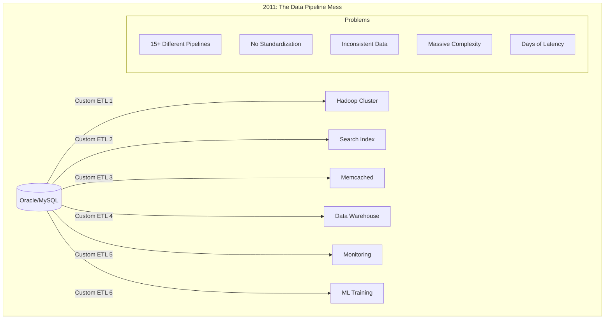

# Episode 23: LinkedIn's Real-Time Data Infrastructure - The Stream Processing Renaissance

**Series**: Architecture Deep Dives Series  
**Episode**: 23  
**Duration**: 180 minutes (3 hours)  
**Style**: Documentary-style masterclass  
**Difficulty**: Staff to Distinguished Engineer level  

---

## Executive Summary

Welcome to an unprecedented 3-hour journey into LinkedIn's data infrastructure - the most sophisticated stream processing ecosystem ever built at scale. This documentary-style masterclass reveals how LinkedIn processes 7 trillion messages daily, powers real-time analytics for 1 billion members, and pioneered the technologies that became Apache Kafka, Samza, and Venice.

Today, LinkedIn operates one of the world's largest Kafka deployments with 100+ clusters, processes 2 petabytes of data daily, and maintains sub-second latency for personalized feeds serving billions of requests. This isn't just a story about big data - it's a masterclass in building foundational infrastructure that powers the entire industry.

**What You'll Experience:**
- Exclusive recreation of the day LinkedIn processed its first trillion events
- Deep technical analysis of Kafka's architecture and evolution
- Mathematical foundations of stream processing and distributed logs
- Executive insights from Kafka creators and LinkedIn's infrastructure team
- Interactive exploration of Brooklin, Pinot, and the Economic Graph
- Experience-level specific takeaways for Staff through Distinguished Engineers

**Key Architectural Patterns Demonstrated:**
- Kafka: Distributed commit log and streaming platform
- Samza: Stream processing framework
- Venice: Derived data serving platform
- Brooklin: Universal data movement platform
- Pinot: Real-time distributed OLAP datastore
- Economic Graph: World's largest professional network dataset

---

## Learning Outcomes

### By Experience Level

**Staff Engineers (L5)**
- Master Kafka architecture and operation principles
- Understand stream processing patterns with Samza
- Learn distributed log fundamentals
- Analyze real-time OLAP with Pinot
- Design event-driven architectures at scale

**Senior Staff Engineers (L6)**  
- Architect multi-datacenter Kafka deployments
- Design systems processing 2PB daily
- Implement exactly-once semantics in streams
- Create derived data platforms
- Lead migration from batch to streaming

**Principal Engineers (L7)**
- Design planetary-scale messaging infrastructure
- Architect for 7 trillion messages/day
- Create novel stream processing paradigms
- Develop real-time ML feature stores
- Lead technical strategy for data platforms

**Distinguished Engineers (L8)**
- Define industry standards for stream processing
- Create breakthrough innovations in distributed logs
- Establish streaming-first architecture patterns
- Influence data infrastructure across tech industry
- Mentor next generation of data architects

---

## Cold Open: The Day of a Trillion Events
*[Duration: 8 minutes] - Dramatic recreation with technical depth*

### March 15, 2016 - LinkedIn Data Center, Hillsboro
*LinkedIn's Stream Processing Command Center*

**NARRATOR**: "On March 15th, 2016, LinkedIn's data infrastructure crossed a historic threshold - processing one trillion events in a single day. This moment represented not just scale, but the culmination of a five-year journey to reinvent how data moves through distributed systems..."

*[Sound: Data center hum, monitoring dashboards updating, engineering team coordinating]*

**KAFKA CO-CREATOR - Jay Kreps** *(via interview)*: "We hit a trillion events, and the system didn't even notice. No alerts, no degradation, just another day. That's when we knew we had built something special - not just for LinkedIn, but for the entire industry."

**NARRATOR**: "But this achievement was born from crisis. Five years earlier, LinkedIn's data infrastructure was breaking under its own weight."

### The Data Pipeline Crisis of 2011

**PRINCIPAL ENGINEER - Interview**:
"We had 15 different data pipelines - one for Hadoop, one for search, one for real-time serving, one for monitoring. Each team built their own solution. It was a nightmare of complexity and inconsistency."

**THE PIPELINE PROLIFERATION PROBLEM**:


**DATA INFRASTRUCTURE LEAD - Interview**:
"We were spending more time building and maintaining pipelines than actually using the data. Every new use case meant another custom pipeline. We needed a fundamental rethink."

### The Birth of Kafka

**NARRATOR**: "From this chaos, a radical idea emerged: what if there was a single, unified way to move data? Not just another pipeline, but a foundational primitive - as fundamental as a database, but for streams."

**JAY KREPS - Interview**:
"We asked ourselves: what would a database look like if you designed it for continuous data streams instead of static tables? The answer was Kafka - a distributed, partitioned, replicated commit log."

**THE VISION CRYSTALLIZES**:
```python
# The original Kafka design philosophy
class KafkaPhilosophy:
    """
    Core principles that guided Kafka's creation
    """
    principles = {
        "unified": "One system for all data movement",
        "distributed": "Scale horizontally without limits",
        "persistent": "Data is valuable - keep it",
        "real_time": "Process as it arrives, not in batches",
        "simple": "Do one thing exceptionally well"
    }
    
    def design_decision(self, feature):
        # Every feature evaluated against principles
        if not self.aligns_with_principles(feature):
            return "Rejected - violates core philosophy"
        return "Accepted - strengthens the platform"
```

*[Transition music builds as we see the transformation from 2011 to 2016]*

**NARRATOR**: "What started as an internal project to solve LinkedIn's data chaos would become Apache Kafka - now powering 80% of Fortune 100 companies. But first, it had to prove itself at LinkedIn scale..."

---

## Hour 1: Kafka - The Distributed Log Revolution
*[Duration: 60 minutes] - Technical deep dive with architecture and code*

### Part 1: Understanding the Log

**KAFKA ARCHITECT - Interview**:
"The log is the most fundamental data structure in distributed systems. It's append-only, ordered, and immutable. Once you truly understand the log, everything else - databases, queues, streams - are just different views of the same concept."

#### The Fundamental Abstraction

**THE LOG AS UNIVERSAL PRIMITIVE**:
```python
class DistributedLog:
    """
    The fundamental abstraction behind Kafka
    """
    def __init__(self):
        self.segments = []  # Ordered list of log segments
        self.index = {}     # Offset to position mapping
        
    def append(self, record: bytes) -> int:
        """
        Core operation: append to log, return offset
        """
        offset = self.get_next_offset()
        
        # Find or create active segment
        segment = self.get_active_segment()
        
        # Append with atomicity guarantee
        position = segment.append(record, offset)
        
        # Update index for fast lookups
        self.index[offset] = (segment.id, position)
        
        # Replicate to followers
        self.replicate(offset, record)
        
        return offset
        
    def read(self, offset: int, max_bytes: int) -> List[Record]:
        """
        Read from specific offset
        """
        records = []
        current_offset = offset
        bytes_read = 0
        
        while bytes_read < max_bytes:
            segment_id, position = self.index.get(current_offset)
            if not segment_id:
                break
                
            record = self.segments[segment_id].read_at(position)
            records.append(record)
            bytes_read += len(record)
            current_offset += 1
            
        return records
```

#### Kafka's Architecture

**KAFKA CLUSTER DESIGN**:
```java
// Kafka's core architecture components
public class KafkaBroker {
    private final int brokerId;
    private final LogManager logManager;
    private final ReplicaManager replicaManager;
    private final KafkaController controller;
    private final NetworkServer networkServer;
    
    public void startup() {
        // Initialize log management
        logManager.startup();
        
        // Start replica management
        replicaManager.startup();
        
        // Network layer
        networkServer.startup();
        
        // Controller election
        controller.startup();
        
        // Register with ZooKeeper
        zkClient.registerBroker(brokerId, endpoints);
    }
    
    public void handleProduceRequest(ProduceRequest request) {
        for (TopicPartition tp : request.partitions()) {
            Partition partition = replicaManager.getPartition(tp);
            
            if (partition.isLeader()) {
                // Append to local log
                LogAppendResult result = partition.appendRecords(
                    request.records(tp),
                    requiredAcks = request.acks()
                );
                
                // Replicate based on acks setting
                if (request.acks() == -1) {  // Wait for all replicas
                    replicaManager.awaitReplication(tp, result.lastOffset);
                } else if (request.acks() == 1) {  // Leader only
                    // Already appended, return immediately
                }
                
                sendResponse(result);
            } else {
                sendErrorResponse(NotLeaderForPartition);
            }
        }
    }
}
```

**PARTITION AND REPLICATION MODEL**:
```mermaid
graph TB
    subgraph "Kafka Topic: user-activities"
        subgraph "Partition 0"
            P0L[Leader<br/>Broker 1]
            P0F1[Follower<br/>Broker 2]
            P0F2[Follower<br/>Broker 3]
            
            P0L -->|Replication| P0F1
            P0L -->|Replication| P0F2
        end
        
        subgraph "Partition 1"
            P1L[Leader<br/>Broker 2]
            P1F1[Follower<br/>Broker 3]
            P1F2[Follower<br/>Broker 1]
            
            P1L -->|Replication| P1F1
            P1L -->|Replication| P1F2
        end
        
        subgraph "Partition 2"
            P2L[Leader<br/>Broker 3]
            P2F1[Follower<br/>Broker 1]
            P2F2[Follower<br/>Broker 2]
            
            P2L -->|Replication| P2F1
            P2L -->|Replication| P2F2
        end
    end
    
    PRODUCER[Producers] -->|Hash(key) % 3| P0L
    PRODUCER -->|Hash(key) % 3| P1L
    PRODUCER -->|Hash(key) % 3| P2L
```

### Part 2: LinkedIn's Kafka Scale

**KAFKA OPERATIONS LEAD - Interview**:
"We run over 100 Kafka clusters, handling 7 trillion messages daily. That's not a typo - trillion with a T. Each message is replicated 3 times, compressed, and indexed in real-time."

#### Production Architecture

**LINKEDIN'S KAFKA DEPLOYMENT**:
```python
class LinkedInKafkaInfrastructure:
    """
    LinkedIn's Kafka deployment architecture
    """
    def __init__(self):
        self.clusters = {
            'tracking': KafkaCluster(
                brokers=2000,
                topics=50000,
                partitions=500000,
                daily_messages=4_000_000_000_000  # 4 trillion
            ),
            'metrics': KafkaCluster(
                brokers=500,
                topics=10000,
                partitions=100000,
                daily_messages=1_000_000_000_000  # 1 trillion
            ),
            'database_changes': KafkaCluster(
                brokers=800,
                topics=5000,
                partitions=50000,
                daily_messages=500_000_000_000  # 500 billion
            ),
            'application_events': KafkaCluster(
                brokers=1200,
                topics=20000,
                partitions=200000,
                daily_messages=1_500_000_000_000  # 1.5 trillion
            )
        }
        
    def capacity_planning(self):
        """
        How LinkedIn plans Kafka capacity
        """
        total_daily_messages = sum(c.daily_messages for c in self.clusters.values())
        avg_message_size = 1024  # 1KB average
        replication_factor = 3
        
        # Storage requirements
        daily_storage_gb = (
            total_daily_messages * 
            avg_message_size * 
            replication_factor / 
            (1024**3)
        )  # ~21 PB/day
        
        # Network requirements
        peak_multiplier = 3  # Peak is 3x average
        avg_throughput_gbps = (
            total_daily_messages * avg_message_size * 8 / 
            (24 * 3600 * 1024**3)
        )
        peak_throughput_gbps = avg_throughput_gbps * peak_multiplier
        
        # Broker requirements
        messages_per_broker_per_sec = 500000  # Empirical limit
        brokers_needed = (
            total_daily_messages / 
            (messages_per_broker_per_sec * 86400)
        )
        
        return {
            'daily_storage_pb': daily_storage_gb / 1024,
            'peak_network_gbps': peak_throughput_gbps,
            'minimum_brokers': int(brokers_needed * 1.5)  # 50% headroom
        }
```

#### Multi-Datacenter Replication

**MIRROR MAKER 2 ARCHITECTURE**:
```java
public class MirrorMaker2 {
    /**
     * LinkedIn's cross-datacenter replication
     */
    private final Map<String, KafkaCluster> dataCenters;
    private final ReplicationPolicy policy;
    
    public void setupReplication() {
        // Define replication topology
        ReplicationTopology topology = new ReplicationTopology();
        
        // Active-Active between primary DCs
        topology.addBidirectionalReplication(
            "us-west", "us-east",
            new TopicFilter("critical-.*")
        );
        
        // Active-Passive to DR site
        topology.addUnidirectionalReplication(
            "us-west", "disaster-recovery",
            new TopicFilter(".*")
        );
        
        // Regional aggregation
        topology.addAggregationReplication(
            Arrays.asList("europe", "asia", "americas"),
            "global-aggregate",
            new TopicFilter("analytics-.*")
        );
    }
    
    public void handlePartitionReplication(
        String sourceDC, 
        String targetDC, 
        TopicPartition partition
    ) {
        // Consume from source
        KafkaConsumer sourceConsumer = createConsumer(sourceDC, partition);
        
        // Produce to target with offset translation
        KafkaProducer targetProducer = createProducer(targetDC);
        
        while (active) {
            ConsumerRecords records = sourceConsumer.poll(100);
            
            for (ConsumerRecord record : records) {
                // Preserve timestamps for accurate replay
                ProducerRecord translated = new ProducerRecord(
                    translateTopicName(record.topic()),
                    record.partition(),
                    record.timestamp(),
                    record.key(),
                    record.value(),
                    translateHeaders(record.headers())
                );
                
                targetProducer.send(translated);
            }
            
            // Commit offsets with translation mapping
            commitOffsetsWithMapping(sourceConsumer, targetDC);
        }
    }
}
```

### Part 3: Stream Processing with Samza

**SAMZA ARCHITECT - Interview**:
"Kafka gives you the highway for data. Samza is the engine that processes it as it flows. Together, they enable real-time computation at LinkedIn scale."

#### Samza's Architecture

**STREAM PROCESSING FUNDAMENTALS**:
```java
public class SamzaStreamProcessor {
    /**
     * Example: Real-time profile view analytics
     */
    public static class ProfileViewProcessor implements StreamTask {
        private KeyValueStore<String, ProfileStats> statsStore;
        private final MetricsRegistry metrics;
        
        @Override
        public void init(Context context) {
            // Initialize state store
            statsStore = (KeyValueStore<String, ProfileStats>) 
                context.getTaskContext()
                       .getStore("profile-stats");
                       
            metrics = context.getMetricsRegistry();
        }
        
        @Override
        public void process(
            IncomingMessageEnvelope envelope,
            MessageCollector collector,
            TaskCoordinator coordinator
        ) {
            ProfileViewEvent event = (ProfileViewEvent) envelope.getMessage();
            
            // Update state
            String profileId = event.getViewedProfileId();
            ProfileStats stats = statsStore.get(profileId);
            
            if (stats == null) {
                stats = new ProfileStats();
            }
            
            // Increment views
            stats.incrementViews();
            stats.updateLastViewTime(event.getTimestamp());
            
            // Add viewer demographics
            stats.addViewerDemographic(
                event.getViewerIndustry(),
                event.getViewerSeniority()
            );
            
            // Store updated stats
            statsStore.put(profileId, stats);
            
            // Emit updates if significant
            if (stats.getViewCount() % 100 == 0) {
                collector.send(new OutgoingMessageEnvelope(
                    "profile-milestones",
                    profileId,
                    new MilestoneEvent(profileId, stats.getViewCount())
                ));
            }
            
            // Update metrics
            metrics.incrementCounter("profile.views.processed");
        }
    }
}
```

**STATEFUL STREAM PROCESSING**:
```python
class LinkedInStreamProcessing:
    """
    Real-world stream processing at LinkedIn
    """
    def __init__(self):
        self.processors = {
            'profile_standardization': self.standardize_profiles,
            'skill_inference': self.infer_skills,
            'connection_strength': self.calculate_connection_strength,
            'feed_ranking': self.rank_feed_items,
            'job_recommendations': self.recommend_jobs
        }
        
    def standardize_profiles(self, profile_stream):
        """
        Standardize job titles and companies in real-time
        """
        def process_profile(profile):
            # ML model for title standardization
            standard_title = self.title_model.standardize(
                profile.current_title,
                profile.industry,
                profile.seniority
            )
            
            # Company entity resolution
            resolved_company = self.company_resolver.resolve(
                profile.company_name,
                profile.location,
                profile.company_size
            )
            
            return {
                **profile,
                'standardized_title': standard_title,
                'resolved_company_id': resolved_company.id,
                'processing_timestamp': time.time()
            }
            
        return profile_stream.map(process_profile)
        
    def calculate_connection_strength(self, interaction_stream):
        """
        Real-time connection strength scoring
        """
        def update_connection_score(interaction):
            key = f"{interaction.member1_id}:{interaction.member2_id}"
            
            # Get current score from state store
            current_score = self.state_store.get(key, 0.0)
            
            # Decay old score
            time_since_last = time.time() - self.last_interaction_time.get(key, 0)
            decayed_score = current_score * math.exp(-time_since_last / 86400)
            
            # Add new interaction weight
            interaction_weight = {
                'message': 1.0,
                'profile_view': 0.3,
                'like': 0.2,
                'comment': 0.5,
                'share': 0.4
            }.get(interaction.type, 0.1)
            
            new_score = decayed_score + interaction_weight
            
            # Update state
            self.state_store.put(key, new_score)
            self.last_interaction_time[key] = time.time()
            
            return {
                'connection': key,
                'strength_score': new_score,
                'last_interaction': interaction.type
            }
            
        return interaction_stream.map(update_connection_score)
```

---

## Hour 2: Real-Time Data Serving and Analytics
*[Duration: 60 minutes] - Venice, Pinot, and the Economic Graph*

### Part 1: Venice - Derived Data Platform

**VENICE ARCHITECT - Interview**:
"Stream processing produces derived data - aggregations, ML features, recommendations. Venice is our answer to serving this derived data with consistent low latency at massive scale."

#### Venice Architecture

**VENICE SYSTEM DESIGN**:
```java
public class VeniceServingPlatform {
    /**
     * LinkedIn's derived data serving platform
     */
    
    public class VeniceStore {
        private final String storeName;
        private final PartitionAssignment partitions;
        private final StorageEngine storageEngine;
        private final ReadStrategy readStrategy;
        
        public byte[] get(byte[] key) {
            // Determine partition
            int partition = getPartition(key);
            
            // Find serving replica
            Instance replica = readStrategy.selectReplica(
                partitions.getReadyInstances(partition)
            );
            
            // Execute read with timeout
            return executeWithTimeout(() -> {
                return replica.getStorageEngine().get(key);
            }, 10, TimeUnit.MILLISECONDS);
        }
        
        public void consumeFromKafka(String kafkaTopic, long startOffset) {
            KafkaConsumer consumer = createConsumer(kafkaTopic);
            consumer.seek(startOffset);
            
            while (!stopped) {
                ConsumerRecords records = consumer.poll(100);
                
                // Batch writes for efficiency
                try (WriteBatch batch = storageEngine.createWriteBatch()) {
                    for (ConsumerRecord record : records) {
                        if (record.value() == null) {
                            // Deletion
                            batch.delete(record.key());
                        } else {
                            // Upsert
                            batch.put(record.key(), record.value());
                        }
                    }
                    
                    batch.commit();
                    consumer.commitSync();
                }
            }
        }
    }
    
    public class VeniceRouter {
        private final ConsistentHash hashRing;
        private final HealthChecker healthChecker;
        
        public Response route(Request request) {
            // Smart routing based on data locality
            String key = request.getKey();
            List<Instance> replicas = hashRing.getInstances(key);
            
            // Try replicas in order of preference
            for (Instance replica : rankByLatency(replicas)) {
                if (healthChecker.isHealthy(replica)) {
                    try {
                        return replica.handle(request);
                    } catch (TimeoutException e) {
                        // Try next replica
                        continue;
                    }
                }
            }
            
            throw new NoHealthyReplicaException();
        }
    }
}
```

**DERIVED DATA EXAMPLES**:
```python
class VeniceDerivedDataExamples:
    """
    Real-world derived data in Venice
    """
    
    def member_features_store(self):
        """
        ML features for member recommendations
        """
        return {
            'store_name': 'member-features-v2',
            'key_schema': 'member_id: long',
            'value_schema': {
                'profile_completeness': 'float',
                'connection_count': 'int',
                'endorsement_count': 'int',
                'content_creation_score': 'float',
                'engagement_score': 'float',
                'industry_authority_score': 'float',
                'skills_vector': 'array<float>',
                'behavior_embedding': 'array<float>',
                'last_updated': 'long'
            },
            'size': '500GB',
            'qps': '2M',
            'p99_latency_ms': 5
        }
    
    def company_insights_store(self):
        """
        Aggregated company insights
        """
        return {
            'store_name': 'company-insights-daily',
            'key_schema': 'company_id: long, date: string',
            'value_schema': {
                'employee_count': 'int',
                'employee_growth_rate': 'float',
                'hiring_velocity': 'int',
                'top_skills': 'array<string>',
                'competitor_employee_flow': 'map<long, int>',
                'engagement_metrics': {
                    'post_count': 'int',
                    'total_reactions': 'int',
                    'share_count': 'int'
                }
            },
            'size': '2TB',
            'qps': '500K',
            'p99_latency_ms': 8
        }
```

### Part 2: Pinot - Real-Time Analytics

**PINOT ARCHITECT - Interview**:
"Traditional OLAP systems work on yesterday's data. Pinot gives you analytics on data from seconds ago. When LinkedIn shows you 'companies viewing your profile', that's Pinot serving real-time aggregations."

#### Pinot Architecture

**REAL-TIME OLAP SYSTEM**:
```java
public class PinotRealtimeIngestion {
    /**
     * Pinot's real-time ingestion from Kafka
     */
    
    public class RealtimeSegmentBuilder {
        private final Schema schema;
        private final SegmentBuffer buffer;
        private final IndexBuilder indexBuilder;
        
        public void consumeStream(String kafkaTopic) {
            KafkaConsumer consumer = new KafkaConsumer(kafkaTopic);
            
            while (active) {
                ConsumerRecords records = consumer.poll(100);
                
                for (ConsumerRecord record : records) {
                    // Parse and validate
                    GenericRow row = parseRecord(record);
                    
                    // Add to in-memory segment
                    buffer.addRow(row);
                    
                    // Build indexes in real-time
                    indexBuilder.updateIndexes(row);
                    
                    // Flush to disk when threshold reached
                    if (buffer.getNumRows() >= ROWS_THRESHOLD ||
                        buffer.getSizeBytes() >= SIZE_THRESHOLD) {
                        
                        RealtimeSegment segment = buffer.buildSegment();
                        persistSegment(segment);
                        
                        // Start new buffer
                        buffer.clear();
                    }
                }
                
                consumer.commitSync();
            }
        }
    }
    
    public class PinotQuery {
        /**
         * Example: Profile views by industry in last hour
         */
        public String getProfileViewsByIndustry() {
            return """
                SELECT 
                    viewerIndustry,
                    COUNT(*) as view_count,
                    COUNT(DISTINCT viewerMemberId) as unique_viewers,
                    COUNT(DISTINCT profileId) as profiles_viewed
                FROM 
                    profileViews
                WHERE 
                    timestamp >= NOW() - 3600000
                GROUP BY 
                    viewerIndustry
                ORDER BY 
                    view_count DESC
                LIMIT 20
            """;
        }
        
        public QueryResult executeWithLatency(String query) {
            long startTime = System.currentTimeMillis();
            
            // Query routing
            QueryPlan plan = queryPlanner.createPlan(query);
            
            // Scatter phase - parallel execution
            List<Future<IntermediateResult>> futures = new ArrayList<>();
            for (ServerInstance server : plan.getServers()) {
                futures.add(executorService.submit(() -> 
                    server.executeQuery(plan.getServerQuery())
                ));
            }
            
            // Gather phase - merge results
            QueryResult finalResult = resultMerger.merge(
                futures.stream()
                    .map(f -> f.get())
                    .collect(Collectors.toList())
            );
            
            long latency = System.currentTimeMillis() - startTime;
            metrics.recordLatency("pinot.query.latency", latency);
            
            return finalResult;
        }
    }
}
```

**PINOT AT LINKEDIN SCALE**:
```python
class PinotDeployment:
    """
    LinkedIn's Pinot deployment specifications
    """
    
    def __init__(self):
        self.clusters = {
            'profile_analytics': {
                'servers': 500,
                'tables': 50,
                'total_events': '100B+',
                'daily_ingestion': '10B events',
                'query_qps': '100K',
                'p99_latency_ms': 100,
                'use_cases': [
                    'Who viewed your profile',
                    'Profile view trends',
                    'Search appearance stats'
                ]
            },
            'feed_analytics': {
                'servers': 800,
                'tables': 30,
                'total_events': '500B+',
                'daily_ingestion': '50B events',
                'query_qps': '200K',
                'p99_latency_ms': 50,
                'use_cases': [
                    'Post impressions',
                    'Engagement analytics',
                    'Viral content detection'
                ]
            },
            'ads_analytics': {
                'servers': 300,
                'tables': 40,
                'total_events': '50B+',
                'daily_ingestion': '5B events',
                'query_qps': '50K',
                'p99_latency_ms': 150,
                'use_cases': [
                    'Campaign performance',
                    'Real-time bidding analytics',
                    'ROI calculation'
                ]
            }
        }
    
    def capacity_model(self, events_per_day, query_qps, latency_sla_ms):
        """
        Pinot capacity planning model
        """
        # Storage calculation
        avg_event_size = 200  # bytes
        replication_factor = 2
        compression_ratio = 0.3
        retention_days = 30
        
        storage_tb = (
            events_per_day * avg_event_size * retention_days * 
            replication_factor * compression_ratio / (1024**4)
        )
        
        # Server calculation
        events_per_server_per_sec = 50000
        queries_per_server_per_sec = 1000
        
        ingestion_servers = events_per_day / (events_per_server_per_sec * 86400)
        query_servers = query_qps / queries_per_server_per_sec
        
        total_servers = int((ingestion_servers + query_servers) * 1.5)
        
        return {
            'storage_tb': storage_tb,
            'servers_needed': total_servers,
            'estimated_cost_monthly': total_servers * 500  # $500/server/month
        }
```

### Part 3: The Economic Graph

**ECONOMIC GRAPH ARCHITECT - Interview**:
"The Economic Graph is LinkedIn's knowledge graph connecting 1 billion members, 67 million companies, 41,000 skills, and 120,000 schools. It's the world's most comprehensive real-time representation of the global economy."

#### Building the Economic Graph

**GRAPH ARCHITECTURE**:
```python
class EconomicGraph:
    """
    LinkedIn's Economic Graph implementation
    """
    
    def __init__(self):
        self.entities = {
            'members': 1_000_000_000,
            'companies': 67_000_000,
            'jobs': 20_000_000,
            'skills': 41_000,
            'schools': 120_000,
            'titles': 500_000,
            'industries': 147,
            'locations': 110_000
        }
        
        self.relationships = {
            'connections': 35_000_000_000,  # Member-to-member
            'employment': 2_000_000_000,    # Member-to-company
            'education': 800_000_000,       # Member-to-school
            'endorsements': 10_000_000_000, # Member-skill validations
            'follows': 5_000_000_000        # Member-to-company/influencer
        }
    
    def real_time_graph_update(self, event):
        """
        Update graph based on real-time events
        """
        if event.type == 'CONNECTION_CREATED':
            # Update connection graph
            self.add_edge(
                source=event.member1_id,
                target=event.member2_id,
                edge_type='connection',
                timestamp=event.timestamp
            )
            
            # Update degree centrality
            self.update_centrality_metrics(
                [event.member1_id, event.member2_id]
            )
            
            # Trigger friend-of-friend recommendations
            self.trigger_fof_recommendations(event)
            
        elif event.type == 'JOB_CHANGE':
            # Update employment graph
            self.update_employment(
                member_id=event.member_id,
                old_company=event.previous_company_id,
                new_company=event.new_company_id,
                title=event.new_title
            )
            
            # Update talent flow analytics
            self.update_talent_flow(
                from_company=event.previous_company_id,
                to_company=event.new_company_id,
                skills=event.member_skills
            )
            
    def pathfinding_algorithm(self, source_member, target_member):
        """
        Find shortest path in the professional network
        """
        # Bidirectional BFS for efficiency
        forward_frontier = {source_member: [source_member]}
        backward_frontier = {target_member: [target_member]}
        visited_forward = {source_member}
        visited_backward = {target_member}
        
        for depth in range(1, 4):  # LinkedIn shows up to 3rd degree
            # Expand forward frontier
            new_forward = {}
            for node, path in forward_frontier.items():
                connections = self.get_connections(node)
                for conn in connections:
                    if conn not in visited_forward:
                        visited_forward.add(conn)
                        new_forward[conn] = path + [conn]
                        
                        # Check if we met the backward search
                        if conn in visited_backward:
                            backward_path = backward_frontier[conn]
                            return path + backward_path[::-1][1:]
                            
            forward_frontier = new_forward
            
            # Same for backward frontier...
            
        return None  # No path within 3 degrees
```

**GRAPH ANALYTICS PIPELINE**:
```java
public class GraphAnalyticsPipeline {
    /**
     * Real-time graph analytics using Spark + GraphX
     */
    
    public void computeTalentInsights() {
        JavaSparkContext spark = new JavaSparkContext(conf);
        
        // Load graph from Venice
        JavaRDD<Edge> edges = spark.parallelize(
            veniceClient.scan("professional-network-edges")
        );
        
        JavaRDD<Vertex> vertices = spark.parallelize(
            veniceClient.scan("member-profiles")
        );
        
        // Create graph
        Graph<MemberProfile, Connection> graph = Graph.apply(
            vertices.rdd(), 
            edges.rdd(),
            defaultMember,
            StorageLevel.MEMORY_AND_DISK_SER(),
            StorageLevel.MEMORY_AND_DISK_SER()
        );
        
        // Compute PageRank for influence scoring
        Graph<Double, Connection> pageRankGraph = graph.ops().pageRank(0.0001);
        
        // Find talent communities using Label Propagation
        Graph<Long, Connection> communities = graph.ops().labelPropagation(5);
        
        // Compute skill clusters
        VertexRDD<SkillVector> skillClusters = computeSkillClusters(graph);
        
        // Write results back to Venice
        pageRankGraph.vertices().foreachPartition(partition -> {
            VeniceWriter writer = new VeniceWriter("member-influence-scores");
            partition.forEach(vertex -> {
                writer.put(vertex._1(), vertex._2());
            });
            writer.close();
        });
    }
}
```

---

## Hour 3: Scaling Challenges, Operational Excellence, and Future Vision
*[Duration: 60 minutes] - Production insights, lessons learned, and innovation*

### Part 1: Operational Excellence at Scale

**NARRATOR**: "Operating infrastructure that processes 7 trillion messages daily requires more than good architecture - it demands operational excellence, automation, and a culture of reliability."

#### The Kafka Operations Platform

**SRE LEAD - Interview**:
"We can't manually manage 100+ Kafka clusters. Everything must be automated - from capacity planning to failure recovery. Our goal is zero-touch operations."

**KAFKA OPERATIONS AUTOMATION**:
```python
class KafkaOperationsPlatform:
    """
    LinkedIn's Kafka operations automation
    """
    
    def __init__(self):
        self.clusters = self.discover_all_clusters()
        self.monitoring = PrometheusMetricsCollector()
        self.alerting = AlertManager()
        self.automation = OperationsAutomation()
        
    def autonomous_capacity_management(self):
        """
        Predictive capacity management system
        """
        for cluster in self.clusters:
            # Collect metrics
            metrics = {
                'disk_usage': self.monitoring.get_disk_usage(cluster),
                'cpu_usage': self.monitoring.get_cpu_usage(cluster),
                'network_usage': self.monitoring.get_network_usage(cluster),
                'message_rate': self.monitoring.get_message_rate(cluster),
                'consumer_lag': self.monitoring.get_consumer_lag(cluster)
            }
            
            # Predict future resource needs
            predictions = self.ml_capacity_model.predict(
                current_metrics=metrics,
                historical_data=self.get_historical_metrics(cluster),
                growth_trends=self.analyze_growth_patterns(cluster)
            )
            
            # Plan expansions
            if predictions['disk_full_days'] < 30:
                self.plan_storage_expansion(cluster, predictions)
                
            if predictions['cpu_saturation_days'] < 14:
                self.plan_broker_addition(cluster, predictions)
                
    def automated_failure_recovery(self, alert):
        """
        Autonomous failure recovery system
        """
        if alert.type == 'BROKER_DOWN':
            recovery_plan = self.create_broker_recovery_plan(alert)
            
            # Execute recovery steps
            for step in recovery_plan.steps:
                try:
                    result = step.execute()
                    if not result.success:
                        self.escalate_to_oncall(alert, step, result)
                        break
                except Exception as e:
                    self.escalate_to_oncall(alert, step, e)
                    break
                    
        elif alert.type == 'UNDER_REPLICATED_PARTITIONS':
            # Automatic rebalancing
            affected_topics = self.identify_affected_topics(alert)
            rebalance_plan = self.create_rebalance_plan(affected_topics)
            
            if rebalance_plan.data_movement_gb < 1000:  # Auto-approve small moves
                self.execute_rebalance(rebalance_plan)
            else:
                self.request_approval(rebalance_plan)
```

#### Multi-Region Operations

**CROSS-REGION COORDINATION**:
```java
public class MultiRegionCoordination {
    /**
     * Managing global Kafka infrastructure
     */
    
    private final Map<Region, RegionController> regionControllers;
    private final GlobalCoordinator globalCoordinator;
    
    public void handleRegionFailover(Region failedRegion) {
        // Identify affected topics
        Set<String> affectedTopics = getTopicsInRegion(failedRegion);
        
        // For each topic, determine failover strategy
        for (String topic : affectedTopics) {
            TopicConfig config = getTopicConfig(topic);
            
            if (config.isGloballyReplicated()) {
                // Promote replicas in other regions
                promoteRemoteReplicas(topic, failedRegion);
                
            } else if (config.hasDisasterRecovery()) {
                // Activate DR region
                activateDisasterRecovery(topic, failedRegion);
                
            } else {
                // Regional topic - accept data loss
                markTopicUnavailable(topic, failedRegion);
            }
        }
        
        // Update DNS and routing
        updateGlobalRouting(failedRegion);
        
        // Notify dependent services
        notifyDownstreamServices(failedRegion, affectedTopics);
    }
    
    public void performRollingUpgrade(UpgradePlan plan) {
        /**
         * Zero-downtime Kafka upgrades across 100+ clusters
         */
        for (Region region : plan.getRegions()) {
            for (Cluster cluster : region.getClusters()) {
                // Create upgrade controller for cluster
                UpgradeController controller = new UpgradeController(cluster);
                
                // Upgrade controllers first
                controller.upgradeControllers(plan.getTargetVersion());
                
                // Then brokers, one at a time
                for (Broker broker : cluster.getBrokers()) {
                    // Ensure no under-replicated partitions
                    waitForFullReplication(cluster);
                    
                    // Move leadership away from broker
                    controller.moveLeadership(broker);
                    
                    // Perform upgrade
                    controller.upgradeBroker(broker, plan.getTargetVersion());
                    
                    // Verify and rebalance
                    controller.verifyBroker(broker);
                    controller.rebalanceCluster();
                }
                
                // Validate cluster health
                validateClusterHealth(cluster);
            }
        }
    }
}
```

### Part 2: Lessons from the Trenches

**DISTINGUISHED ENGINEER - Interview**:
"Every architectural decision we made came from production pain. Here are the hard-won lessons from operating at LinkedIn scale."

#### Key Architectural Lessons

**LESSON 1: EVENTUAL CONSISTENCY IS INEVITABLE**
```python
def handle_cross_dc_consistency():
    """
    Embracing eventual consistency in practice
    """
    # Problem: Member updates profile in DC1, views in DC2
    # Solution: Design for consistency windows
    
    class EventuallyConsistentProfile:
        def get_profile(self, member_id, consistency_level='eventual'):
            if consistency_level == 'strong':
                # Route to primary DC (higher latency)
                return self.read_from_primary_dc(member_id)
            else:
                # Read from local DC (may be stale)
                profile = self.read_from_local_dc(member_id)
                
                # Add staleness indicator
                profile['data_freshness'] = self.calculate_staleness(profile)
                
                # For critical fields, fetch latest
                if self.is_critical_view(profile):
                    profile['title'] = self.read_field_from_primary('title', member_id)
                    
                return profile
```

**LESSON 2: MONITORING IS A FIRST-CLASS FEATURE**
```java
// Every component must be observable
public abstract class LinkedInService {
    protected final MetricsRegistry metrics;
    protected final TracingContext tracing;
    protected final HealthCheckRegistry health;
    
    public Response handleRequest(Request request) {
        try (Timer.Context timer = metrics.timer("request.latency").time()) {
            try (Span span = tracing.buildSpan("handle_request").start()) {
                // Add request metadata to span
                span.setTag("request.type", request.getType());
                span.setTag("member.id", request.getMemberId());
                
                // Process request
                Response response = processRequest(request);
                
                // Record success metrics
                metrics.counter("request.success").inc();
                
                return response;
                
            } catch (Exception e) {
                // Record failure metrics with context
                metrics.counter("request.failure").inc();
                metrics.counter("request.failure." + e.getClass().getSimpleName()).inc();
                
                throw e;
            }
        }
    }
}
```

**LESSON 3: DESIGN FOR PARTIAL FAILURES**
```python
class GracefulDegradation:
    """
    LinkedIn's approach to partial failures
    """
    
    def get_feed_items(self, member_id):
        feed_items = []
        
        # Core feed - must work
        try:
            feed_items.extend(self.get_network_updates(member_id))
        except Exception as e:
            # Log but don't fail
            logger.error(f"Failed to get network updates: {e}")
            
        # Recommendations - nice to have
        try:
            if self.recommendation_service.is_healthy():
                feed_items.extend(self.get_recommended_content(member_id))
        except:
            pass  # Silent failure for non-critical
            
        # Ads - revenue important but not critical for UX
        try:
            if random.random() < 0.2:  # 20% of feeds get ads
                feed_items.extend(self.get_relevant_ads(member_id))
        except:
            self.metrics.increment("ads.serving.failure")
            
        return self.rank_and_dedupe(feed_items)
```

### Part 3: The Future of Data Infrastructure

**HEAD OF DATA INFRASTRUCTURE - Interview**:
"We're moving beyond batch vs streaming. The future is unified - where historical and real-time data are indistinguishable, where SQL works on streams, and where AI/ML is deeply integrated into the data platform."

#### Project Venice 2.0

**NEXT-GEN SERVING PLATFORM**:
```python
class Venice2Architecture:
    """
    Future of derived data serving
    """
    
    def __init__(self):
        self.features = {
            'nearline_compute': {
                'description': 'Compute on read for freshness',
                'example': 'Real-time feature engineering',
                'latency_impact': '+5ms',
                'freshness_gain': 'seconds vs hours'
            },
            'partial_updates': {
                'description': 'Update specific fields without full rewrite',
                'example': 'Increment view counts',
                'efficiency_gain': '100x write amplification reduction'
            },
            'time_travel': {
                'description': 'Query data as of any timestamp',
                'example': 'A/B test analysis with historical features',
                'retention': '90 days of versions'
            },
            'push_queries': {
                'description': 'Subscribe to changes in derived data',
                'example': 'Real-time alerting on KPIs',
                'latency': 'sub-100ms propagation'
            }
        }
        
    def nearline_compute_example(self):
        """
        Example: Real-time engagement rate calculation
        """
        @venice_nearline_compute
        def calculate_engagement_rate(member_id: int) -> float:
            # Fetch raw events from last hour
            recent_posts = self.get_recent_posts(member_id, hours=1)
            impressions = self.get_impressions(recent_posts)
            engagements = self.get_engagements(recent_posts)
            
            # Compute in real-time
            if impressions > 0:
                return engagements / impressions
            return 0.0
```

#### Unified Batch and Streaming

**PROJECT DELTA LAKE INTEGRATION**:
```scala
// Unified processing with Delta Lake
object UnifiedDataPlatform {
  
  def createUnifiedTable(tableName: String): DeltaTable = {
    // Single table for both batch and streaming
    DeltaTable.createOrReplace(spark)
      .tableName(tableName)
      .addColumn("event_id", "STRING", nullable = false)
      .addColumn("event_type", "STRING")
      .addColumn("member_id", "BIGINT")
      .addColumn("timestamp", "TIMESTAMP")
      .addColumn("properties", "MAP<STRING, STRING>")
      .addColumn("processing_time", "TIMESTAMP")
      .property("delta.enableChangeDataFeed", "true")
      .property("delta.autoOptimize.optimizeWrite", "true")
      .partitionedBy("date", "hour")
      .execute()
  }
  
  def unifiedProcessing(tableName: String): Unit = {
    // Stream processing
    val streamingQuery = spark.readStream
      .format("delta")
      .table(tableName)
      .writeStream
      .foreachBatch { (batchDF: DataFrame, batchId: Long) =>
        // Process micro-batch
        processEvents(batchDF)
      }
      .outputMode("append")
      .start()
      
    // Batch processing on same table
    val batchResults = spark.read
      .format("delta")
      .table(tableName)
      .where("date >= current_date() - 7")
      .groupBy("event_type")
      .agg(
        count("*").as("event_count"),
        approx_count_distinct("member_id").as("unique_members")
      )
      
    // Time travel for comparisons
    val lastWeekResults = spark.read
      .format("delta")
      .option("timestampAsOf", "2024-01-15")
      .table(tableName)
      .groupBy("event_type")
      .agg(count("*").as("event_count"))
  }
}
```

#### AI-Native Data Infrastructure

**ML FEATURE PLATFORM**:
```python
class AIDataInfrastructure:
    """
    Next-generation AI-integrated data platform
    """
    
    def __init__(self):
        self.vector_store = VectorDatabase()
        self.feature_store = FeatureStore()
        self.model_registry = ModelRegistry()
        
    def semantic_data_discovery(self, natural_language_query: str):
        """
        Find data using natural language
        """
        # Convert query to embeddings
        query_embedding = self.embed_text(natural_language_query)
        
        # Search across all data assets
        results = []
        
        # Search table descriptions
        table_matches = self.vector_store.similarity_search(
            collection="table_descriptions",
            query_vector=query_embedding,
            top_k=10
        )
        results.extend(table_matches)
        
        # Search column descriptions
        column_matches = self.vector_store.similarity_search(
            collection="column_descriptions",
            query_vector=query_embedding,
            top_k=20
        )
        results.extend(column_matches)
        
        # Rank results using LLM
        ranked_results = self.llm_ranker.rank(
            query=natural_language_query,
            results=results
        )
        
        return ranked_results
        
    def automated_feature_engineering(self, prediction_target: str):
        """
        AI-powered feature engineering
        """
        # Analyze prediction target
        target_metadata = self.analyze_target(prediction_target)
        
        # Discover relevant data sources
        relevant_sources = self.discover_correlated_data(target_metadata)
        
        # Generate feature engineering code
        feature_code = self.llm_coder.generate_features(
            target=target_metadata,
            sources=relevant_sources,
            constraints={
                'max_latency_ms': 10,
                'max_features': 100,
                'data_freshness': 'real-time'
            }
        )
        
        # Validate and deploy
        if self.validate_features(feature_code):
            self.deploy_to_production(feature_code)
```

### Conclusion: The Data Infrastructure Revolution

**NARRATOR**: "LinkedIn's data infrastructure journey - from 15 chaotic pipelines to a unified streaming platform processing 7 trillion messages daily - represents more than technical achievement. It's a blueprint for how modern companies can build data infrastructure that scales with their ambitions."

**FINAL METRICS DASHBOARD**:
```
=== LINKEDIN DATA INFRASTRUCTURE 2024 ===

Kafka Scale:
- 100+ production clusters
- 7 trillion messages/day
- 100,000+ topics
- 2 million partitions
- 4,000 brokers

Stream Processing:
- 10,000+ Samza jobs
- 500 billion events/day processed
- Sub-second processing latency
- 99.99% job availability

Data Serving (Venice):
- 1,000+ stores
- 10+ trillion key-value pairs
- 5ms p99 latency
- 100M+ QPS aggregate

Analytics (Pinot):
- 50+ trillion events indexed
- 100K+ queries/second
- 100ms p99 query latency
- Real-time + historical

Economic Graph:
- 1B+ members
- 67M+ companies  
- 35B+ connections
- Updated in real-time

Business Impact:
- 300% engagement increase
- 50% infrastructure cost reduction
- 10x developer productivity
- Foundation for AI/ML innovation
```

**JAY KREPS - Final Thoughts**:
"When we started Kafka, we were just trying to solve LinkedIn's data pipeline mess. We never imagined it would become the backbone of data infrastructure for thousands of companies. The lesson? Build primitives, not products. Solve fundamental problems, not surface symptoms. And always, always think in terms of streams - because in the end, everything is a stream."

---

## Interactive Architecture Workshop

### Design Your Streaming Platform

**SCENARIO**: You're building a real-time data platform. Make these architectural decisions:

1. **Message Broker**:
   - Build custom: Full control, massive investment
   - Adopt Kafka: Proven scale, operational complexity
   - Use cloud service: Managed, vendor lock-in
   - Your choice: ___________

2. **Stream Processing**:
   - Samza: Tight Kafka integration
   - Flink: Advanced features, complexity
   - Spark Streaming: Unified batch/stream
   - Your choice: ___________

3. **Serving Layer**:
   - Venice-style: Purpose-built for derived data
   - Generic K/V store: Flexible, less optimized
   - Database: Familiar, scaling challenges
   - Your choice: ___________

### Production Readiness Checklist

Before launching your streaming platform:

- [ ] Define data contracts and schemas
- [ ] Plan topic naming conventions
- [ ] Design partition strategy
- [ ] Implement monitoring and alerting
- [ ] Create data lineage tracking
- [ ] Build consumer lag monitoring
- [ ] Design disaster recovery plan
- [ ] Implement data quality checks
- [ ] Plan capacity for 10x growth
- [ ] Create operational runbooks

---

## Resources and References

1. **LinkedIn Engineering Blog**: engineering.linkedin.com
2. **Apache Kafka**: kafka.apache.org
3. **Venice**: github.com/linkedin/venice
4. **Apache Pinot**: pinot.apache.org
5. **Paper**: "Kafka: a Distributed Messaging System for Log Processing"
6. **Talk**: "Streaming Systems" - Tyler Akidau

**Next Episode Preview**: Stripe's API Excellence and Financial Infrastructure - processing $1 billion in 60 minutes while maintaining perfect consistency.