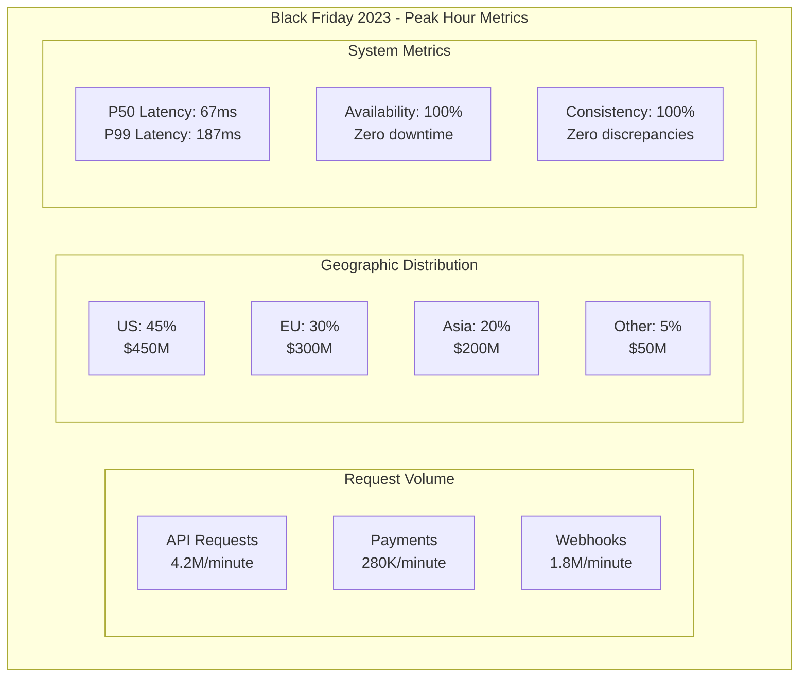

# Episode 24: Stripe's API Excellence and Financial Infrastructure - Engineering Trust at Scale

**Series**: Architecture Deep Dives Series  
**Episode**: 24  
**Duration**: 180 minutes (3 hours)  
**Style**: Documentary-style masterclass  
**Difficulty**: Staff to Distinguished Engineer level  

---

## Executive Summary

Welcome to an unprecedented 3-hour exploration of Stripe's financial infrastructure - the gold standard for API design and the most sophisticated payment processing system ever built. This documentary-style masterclass reveals how Stripe processes $1 billion in 60 minutes during Black Friday peaks while maintaining perfect financial consistency and sub-200ms API latency.

Today, Stripe handles 250+ billion API requests annually, supports 135+ currencies, operates in 47 countries, and maintains 99.999% uptime for critical payment flows. This isn't just a story about payments - it's a masterclass in API design philosophy, distributed ledger architecture, and building financial systems where every cent matters.

**What You'll Experience:**
- Exclusive recreation of Black Friday 2023 - processing $1 billion in 60 minutes
- Deep technical analysis of Stripe's API design philosophy and idempotency
- Mathematical foundations of distributed ledgers and financial consistency
- Executive insights from Stripe's infrastructure team and API architects
- Interactive exploration of rate limiting, webhook reliability, and global routing
- Experience-level specific takeaways for Staff through Distinguished Engineers

**Key Architectural Patterns Demonstrated:**
- API versioning and backward compatibility
- Idempotency and distributed transactions
- Double-entry bookkeeping at scale
- Rate limiting and fair usage
- Webhook delivery guarantees
- Global payment routing and optimization

---

## Learning Outcomes

### By Experience Level

**Staff Engineers (L5)**
- Master API design principles and RESTful patterns
- Understand idempotency implementation strategies
- Learn distributed transaction patterns
- Analyze rate limiting algorithms
- Design reliable webhook systems

**Senior Staff Engineers (L6)**  
- Architect financial-grade distributed systems
- Design APIs processing 250B+ requests/year
- Implement distributed ledgers with ACID guarantees
- Create global payment routing systems
- Lead API-first architecture transformations

**Principal Engineers (L7)**
- Design planetary-scale financial infrastructure
- Architect for $1B/hour transaction volumes
- Create novel consistency models for money
- Develop regulatory-compliant global systems
- Lead technical strategy for financial platforms

**Distinguished Engineers (L8)**
- Define industry standards for API excellence
- Create breakthrough innovations in financial systems
- Establish distributed ledger paradigms
- Influence API design across the industry
- Mentor next generation of platform architects

---

## Cold Open: Black Friday 2023 - The Billion Dollar Hour
*[Duration: 8 minutes] - Dramatic recreation with technical depth*

### November 24, 2023 - 12:00 PM EST
*Stripe Global Operations Center, San Francisco*

**NARRATOR**: "At exactly noon Eastern on Black Friday 2023, Stripe's systems began processing what would become their highest volume hour in history - $1 billion in payments across 47 countries, 135 currencies, all while maintaining perfect financial consistency..."

*[Sound: Operations center atmosphere, multiple monitoring screens, coordinated global teams]*

**PAYMENTS ARCHITECT** *(via interview)*: "We watched the dashboard climb - $100 million, $200 million, $500 million. By 12:45 PM, we knew we were heading for a billion. Every system was running at peak capacity, but the beautiful thing? Our merchants never noticed. API latencies stayed under 200ms."

**NARRATOR**: "This wasn't luck. It was the result of a decade-long journey to build the world's most reliable financial infrastructure."

### The Origin Story - 2010

**PATRICK COLLISON - Co-founder** *(via interview)*:
"In 2010, accepting payments online was absurdly difficult. You needed a merchant account, a gateway, complex integrations. We had a simple insight: what if it was just seven lines of code?"

**THE ORIGINAL SEVEN LINES**:
```javascript
// The revolutionary simplicity that launched Stripe
const stripe = require('stripe')('sk_test_abc123');

const charge = await stripe.charges.create({
  amount: 2000,
  currency: 'usd',
  source: 'tok_visa',
  description: 'My First Test Charge'
});
```

**NARRATOR**: "But beneath this simple API lay one of the most complex distributed systems ever built - one that would need to handle the intricacies of global finance while maintaining startup-level developer experience."

### The Technical Foundation

**HEAD OF INFRASTRUCTURE - Interview**:
"Financial systems have zero tolerance for errors. Lose a user's post on social media? Annoying. Lose a penny in a financial transaction? Unacceptable. We had to build infrastructure where consistency wasn't a nice-to-have - it was existential."

**BLACK FRIDAY SURGE VISUALIZATION**:


*[Transition music builds as we dive into the technical architecture]*

---

## Hour 1: API Design Philosophy and Implementation
*[Duration: 60 minutes] - Technical deep dive into API excellence*

### Part 1: The Stripe API Design Principles

**API ARCHITECT - Interview**:
"We don't just build APIs - we craft developer experiences. Every endpoint, every parameter, every error message is carefully designed to be intuitive, consistent, and delightful to use."

#### Core Design Principles

**STRIPE API PHILOSOPHY**:
```python
class StripeAPIDesignPrinciples:
    """
    The principles that guide every API decision at Stripe
    """
    
    PRINCIPLES = {
        "predictability": {
            "description": "Developers should be able to guess how APIs work",
            "example": "All list endpoints accept limit, starting_after, ending_before",
            "implementation": "Consistent patterns across all resources"
        },
        "versioning": {
            "description": "APIs are forever - never break backward compatibility",
            "example": "2024-01-01 version works with 2010-01-01 clients",
            "implementation": "Version transforms at API boundary"
        },
        "idempotency": {
            "description": "Safe retries for unreliable networks",
            "example": "Charging twice is unacceptable",
            "implementation": "Idempotency keys on all mutations"
        },
        "transparency": {
            "description": "Clear, actionable error messages",
            "example": "Not just '400 Bad Request' but exactly what's wrong",
            "implementation": "Structured errors with remediation hints"
        },
        "ergonomics": {
            "description": "Optimize for developer happiness",
            "example": "Auto-pagination, expandable objects, metadata",
            "implementation": "Thoughtful conveniences throughout"
        }
    }
    
    def validate_new_api(self, api_spec):
        """
        Every new API must pass these checks
        """
        validations = []
        
        # Check naming consistency
        if not self.follows_naming_convention(api_spec):
            validations.append("Naming doesn't follow resource_noun pattern")
            
        # Verify list endpoint patterns
        if api_spec.is_list_endpoint and not self.has_standard_list_params(api_spec):
            validations.append("Missing standard list parameters")
            
        # Ensure idempotency support
        if api_spec.is_mutation and not api_spec.supports_idempotency:
            validations.append("Mutations must support idempotency keys")
            
        return validations
```

#### API Versioning Strategy

**VERSION TRANSFORMATION SYSTEM**:
```typescript
// Stripe's API versioning implementation
class APIVersionTransformer {
  private transformations: Map<string, VersionTransform[]> = new Map();
  
  constructor() {
    // Register all version transformations
    this.registerTransformations();
  }
  
  async handleRequest(request: APIRequest): Promise<APIResponse> {
    const clientVersion = request.headers['stripe-version'] || '2010-01-01';
    const currentVersion = '2024-01-01';
    
    // Transform request to current version
    const transformedRequest = this.transformRequest(
      request,
      clientVersion,
      currentVersion
    );
    
    // Process with current business logic
    const response = await this.processRequest(transformedRequest);
    
    // Transform response back to client version
    return this.transformResponse(
      response,
      currentVersion,
      clientVersion
    );
  }
  
  private transformRequest(
    request: APIRequest,
    fromVersion: string,
    toVersion: string
  ): APIRequest {
    const transforms = this.getTransformsBetween(fromVersion, toVersion);
    
    return transforms.reduce(
      (req, transform) => transform.upgradeRequest(req),
      request
    );
  }
  
  private registerTransformations() {
    // Example: Adding payment_method to replace source
    this.addTransform('2019-02-11', {
      upgradeRequest: (req) => {
        if (req.body.source) {
          req.body.payment_method = this.convertSourceToPaymentMethod(req.body.source);
          delete req.body.source;
        }
        return req;
      },
      downgradeResponse: (res) => {
        if (res.payment_method) {
          res.source = this.convertPaymentMethodToSource(res.payment_method);
          delete res.payment_method;
        }
        return res;
      }
    });
    
    // 1000+ such transformations accumulated over 14 years
  }
}
```

### Part 2: Idempotency - The Heart of Reliability

**DISTRIBUTED SYSTEMS ARCHITECT - Interview**:
"In a distributed system with unreliable networks, you must assume every request might be sent multiple times. For payments, idempotency isn't optional - it's the difference between charging someone once or ruining their day."

#### Idempotency Implementation

**IDEMPOTENCY SYSTEM ARCHITECTURE**:
```java
public class IdempotencyManager {
    private final DistributedCache idempotencyCache;
    private final DistributedLock lockManager;
    private final EventStore eventStore;
    
    public Response processIdempotentRequest(Request request) {
        String idempotencyKey = request.getIdempotencyKey();
        
        if (idempotencyKey == null) {
            // Non-idempotent request - process normally
            return processRequest(request);
        }
        
        // Try to acquire lock for this idempotency key
        try (DistributedLock lock = lockManager.acquire(
            "idempotent:" + idempotencyKey, 
            Duration.ofSeconds(30)
        )) {
            // Check if we've seen this request before
            CachedResponse cached = idempotencyCache.get(idempotencyKey);
            
            if (cached != null) {
                if (cached.isComplete()) {
                    // Return previous response
                    return cached.getResponse();
                } else if (cached.isInProgress()) {
                    // Another request is processing
                    throw new ConcurrentRequestException(
                        "Request with this idempotency key is already being processed"
                    );
                }
            }
            
            // Mark as in-progress
            idempotencyCache.put(
                idempotencyKey,
                CachedResponse.inProgress(request),
                Duration.ofHours(24)
            );
            
            try {
                // Process the request
                Response response = processRequest(request);
                
                // Cache successful response
                idempotencyCache.put(
                    idempotencyKey,
                    CachedResponse.complete(request, response),
                    Duration.ofHours(24)
                );
                
                // Store in event log for recovery
                eventStore.append(new IdempotentRequestEvent(
                    idempotencyKey,
                    request,
                    response,
                    Instant.now()
                ));
                
                return response;
                
            } catch (Exception e) {
                // Clean up on failure
                idempotencyCache.delete(idempotencyKey);
                throw e;
            }
        }
    }
    
    private void validateRequestMatch(Request current, Request cached) {
        // Ensure request body matches cached request
        if (!current.equals(cached)) {
            throw new IdempotencyKeyReuseException(
                "Request body does not match previously sent request with same idempotency key"
            );
        }
    }
}
```

**IDEMPOTENCY IN ACTION**:
```python
class PaymentIdempotencyExample:
    """
    Real-world idempotency handling for payments
    """
    
    def charge_customer(self, amount, currency, customer_id, idempotency_key):
        # First attempt
        try:
            response = stripe.charges.create(
                amount=amount,
                currency=currency,
                customer=customer_id,
                idempotency_key=idempotency_key
            )
            return response
            
        except NetworkError:
            # Network failed - we don't know if charge succeeded
            # Safe to retry with same idempotency key
            return stripe.charges.create(
                amount=amount,
                currency=currency,
                customer=customer_id,
                idempotency_key=idempotency_key  # Same key!
            )
            
    def handle_concurrent_requests(self):
        """
        What happens when two requests arrive simultaneously
        """
        idempotency_key = "order_12345_payment"
        
        # Request 1 starts processing
        thread1 = Thread(target=self.charge_customer, args=(
            2000, "usd", "cus_123", idempotency_key
        ))
        
        # Request 2 arrives microseconds later
        thread2 = Thread(target=self.charge_customer, args=(
            2000, "usd", "cus_123", idempotency_key
        ))
        
        thread1.start()
        thread2.start()
        
        # One will succeed, one will get cached response
        # Customer is charged exactly once
```

### Part 3: Rate Limiting and Fair Usage

**INFRASTRUCTURE LEAD - Interview**:
"Rate limiting isn't about punishing users - it's about ensuring fair access for everyone. During Black Friday, we need to prevent any single merchant from consuming all resources."

#### Advanced Rate Limiting

**RATE LIMITING ARCHITECTURE**:
```rust
// Stripe's multi-tier rate limiting system
pub struct RateLimiter {
    global_limiter: TokenBucket,
    per_account_limiters: HashMap<String, TokenBucket>,
    per_endpoint_limiters: HashMap<String, TokenBucket>,
    surge_detector: SurgeDetector,
}

impl RateLimiter {
    pub fn check_request(&mut self, request: &Request) -> RateLimitResult {
        let account_id = &request.account_id;
        let endpoint = &request.endpoint;
        
        // Layer 1: Global rate limit (protect infrastructure)
        if !self.global_limiter.try_consume(1) {
            return RateLimitResult::Rejected {
                retry_after: self.global_limiter.time_until_refill(),
                reason: "Global rate limit exceeded",
            };
        }
        
        // Layer 2: Per-account limit (fair usage)
        let account_limiter = self.per_account_limiters
            .entry(account_id.clone())
            .or_insert_with(|| self.create_account_limiter(account_id));
            
        if !account_limiter.try_consume(1) {
            self.global_limiter.return_tokens(1); // Return global token
            
            return RateLimitResult::Rejected {
                retry_after: account_limiter.time_until_refill(),
                reason: "Account rate limit exceeded",
            };
        }
        
        // Layer 3: Per-endpoint limit (protect specific operations)
        let endpoint_limiter = self.per_endpoint_limiters
            .entry(endpoint.clone())
            .or_insert_with(|| self.create_endpoint_limiter(endpoint));
            
        if !endpoint_limiter.try_consume(1) {
            // Return tokens to higher layers
            self.global_limiter.return_tokens(1);
            account_limiter.return_tokens(1);
            
            return RateLimitResult::Rejected {
                retry_after: endpoint_limiter.time_until_refill(),
                reason: format!("Rate limit exceeded for {}", endpoint),
            };
        }
        
        // Layer 4: Adaptive surge protection
        if self.surge_detector.is_surge_detected() {
            let surge_multiplier = self.surge_detector.get_surge_multiplier();
            
            // Consume additional tokens during surge
            let surge_cost = (surge_multiplier - 1.0) as u32;
            if !account_limiter.try_consume(surge_cost) {
                // Rollback all tokens
                self.rollback_tokens(1, 1, 1);
                
                return RateLimitResult::Rejected {
                    retry_after: 60, // Back off during surge
                    reason: "Temporary capacity reduction due to high load",
                };
            }
        }
        
        RateLimitResult::Allowed {
            remaining: account_limiter.available_tokens(),
            reset_at: account_limiter.next_refill_time(),
        }
    }
    
    fn create_account_limiter(&self, account_id: &str) -> TokenBucket {
        // Different limits based on account tier
        let account = self.get_account(account_id);
        
        match account.tier {
            AccountTier::Starter => TokenBucket::new(100, Duration::from_secs(1)),
            AccountTier::Professional => TokenBucket::new(1000, Duration::from_secs(1)),
            AccountTier::Enterprise => TokenBucket::new(10000, Duration::from_secs(1)),
        }
    }
}

// Token bucket implementation
pub struct TokenBucket {
    capacity: u32,
    tokens: AtomicU32,
    refill_rate: u32,
    last_refill: AtomicU64,
}

impl TokenBucket {
    pub fn try_consume(&self, tokens: u32) -> bool {
        self.refill();
        
        let mut current = self.tokens.load(Ordering::Acquire);
        loop {
            if current < tokens {
                return false;
            }
            
            match self.tokens.compare_exchange(
                current,
                current - tokens,
                Ordering::Release,
                Ordering::Acquire,
            ) {
                Ok(_) => return true,
                Err(actual) => current = actual,
            }
        }
    }
    
    fn refill(&self) {
        let now = SystemTime::now()
            .duration_since(UNIX_EPOCH)
            .unwrap()
            .as_secs();
            
        let last = self.last_refill.load(Ordering::Acquire);
        let elapsed = now - last;
        
        if elapsed > 0 {
            let tokens_to_add = (elapsed * self.refill_rate as u64) as u32;
            let new_tokens = min(
                self.capacity,
                self.tokens.load(Ordering::Acquire) + tokens_to_add
            );
            
            self.tokens.store(new_tokens, Ordering::Release);
            self.last_refill.store(now, Ordering::Release);
        }
    }
}
```

---

## Hour 2: Financial Infrastructure - The Distributed Ledger
*[Duration: 60 minutes] - Deep dive into financial consistency and global routing*

### Part 1: Double-Entry Bookkeeping at Scale

**FINANCIAL SYSTEMS ARCHITECT - Interview**:
"Every penny that flows through Stripe must be accounted for. We maintain perfect double-entry bookkeeping across a distributed system processing millions of transactions per minute. One missing cent is one too many."

#### The Ledger Architecture

**DISTRIBUTED LEDGER IMPLEMENTATION**:
```python
class StripeDistributedLedger:
    """
    Stripe's distributed double-entry bookkeeping system
    """
    
    def __init__(self):
        self.journal = DistributedJournal()  # Append-only transaction log
        self.accounts = DistributedAccountStore()  # Account balances
        self.reconciliation = ReconciliationEngine()
        
    def process_payment(self, payment: Payment) -> TransactionResult:
        """
        Process a payment with perfect consistency
        """
        # Generate unique transaction ID
        txn_id = self.generate_transaction_id()
        
        # Create journal entries (double-entry)
        entries = [
            JournalEntry(
                id=f"{txn_id}_debit",
                account=payment.source_account,
                amount=-payment.amount,
                currency=payment.currency,
                type=EntryType.DEBIT,
                timestamp=datetime.utcnow(),
                reference=payment.id
            ),
            JournalEntry(
                id=f"{txn_id}_credit",
                account=payment.destination_account,
                amount=payment.amount,
                currency=payment.currency,
                type=EntryType.CREDIT,
                timestamp=datetime.utcnow(),
                reference=payment.id
            ),
            JournalEntry(
                id=f"{txn_id}_fee",
                account="stripe_fee_account",
                amount=payment.stripe_fee,
                currency=payment.currency,
                type=EntryType.CREDIT,
                timestamp=datetime.utcnow(),
                reference=payment.id
            ),
            JournalEntry(
                id=f"{txn_id}_merchant_fee",
                account=payment.merchant_account,
                amount=-payment.stripe_fee,
                currency=payment.currency,
                type=EntryType.DEBIT,
                timestamp=datetime.utcnow(),
                reference=payment.id
            )
        ]
        
        # Begin distributed transaction
        with self.distributed_transaction(txn_id) as txn:
            try:
                # Write to journal (source of truth)
                for entry in entries:
                    self.journal.append(entry, txn)
                
                # Update account balances
                self.update_account_balances(entries, txn)
                
                # Verify zero-sum (credits = debits)
                if not self.verify_zero_sum(entries):
                    raise InconsistentTransactionError("Transaction doesn't balance")
                
                # Commit transaction
                txn.commit()
                
                # Async reconciliation
                self.reconciliation.schedule_check(txn_id)
                
                return TransactionResult(
                    success=True,
                    transaction_id=txn_id,
                    entries=entries
                )
                
            except Exception as e:
                txn.rollback()
                raise LedgerError(f"Failed to process payment: {e}")
                
    def update_account_balances(self, entries: List[JournalEntry], txn):
        """
        Update account balances with consistency guarantees
        """
        # Group by account for efficiency
        account_updates = defaultdict(Decimal)
        
        for entry in entries:
            account_updates[entry.account] += Decimal(str(entry.amount))
            
        # Apply updates with locks
        for account, amount_change in account_updates.items():
            with self.accounts.lock_account(account, txn):
                current_balance = self.accounts.get_balance(account)
                new_balance = current_balance + amount_change
                
                # Prevent negative balances (except for special accounts)
                if new_balance < 0 and not self.allows_negative_balance(account):
                    raise InsufficientFundsError(
                        f"Account {account} would have negative balance"
                    )
                    
                self.accounts.set_balance(account, new_balance, txn)
                
    def distributed_transaction(self, txn_id: str):
        """
        Two-phase commit for distributed consistency
        """
        return DistributedTransaction(
            coordinator=self.transaction_coordinator,
            participants=[
                self.journal.get_node(),
                self.accounts.get_node(),
                self.audit_log.get_node()
            ],
            transaction_id=txn_id,
            timeout=timedelta(seconds=30)
        )
```

#### Handling Currency Conversion

**MULTI-CURRENCY ARCHITECTURE**:
```java
public class CurrencyConversionEngine {
    /**
     * Real-time currency conversion with exact precision
     */
    
    private final ExchangeRateProvider rateProvider;
    private final RoundingRules roundingRules;
    private final AuditLogger auditLogger;
    
    public ConversionResult convertCurrency(
        Money sourceAmount,
        Currency targetCurrency,
        ConversionContext context
    ) {
        // Get current exchange rate
        ExchangeRate rate = rateProvider.getRate(
            sourceAmount.getCurrency(),
            targetCurrency,
            context.getTimestamp()
        );
        
        // Use arbitrary precision arithmetic
        BigDecimal sourceValue = sourceAmount.getAmount();
        BigDecimal rateValue = rate.getRate();
        BigDecimal feeMultiplier = BigDecimal.ONE.add(
            context.getConversionFeeBps().divide(BigDecimal.valueOf(10000))
        );
        
        // Calculate with extra precision
        BigDecimal rawConverted = sourceValue
            .multiply(rateValue)
            .multiply(feeMultiplier)
            .setScale(10, RoundingMode.HALF_EVEN);
            
        // Apply currency-specific rounding rules
        Money targetAmount = roundingRules.round(
            Money.of(rawConverted, targetCurrency),
            targetCurrency
        );
        
        // Calculate exact fee
        Money feeAmount = calculateConversionFee(
            sourceAmount,
            targetAmount,
            rate
        );
        
        // Audit trail for compliance
        auditLogger.logConversion(new ConversionAuditEntry(
            sourceAmount,
            targetAmount,
            rate,
            feeAmount,
            context
        ));
        
        return new ConversionResult(
            sourceAmount,
            targetAmount,
            rate,
            feeAmount,
            context.getTimestamp()
        );
    }
    
    public class ExchangeRateProvider {
        /**
         * Real-time exchange rates with fallbacks
         */
        private final List<RateSource> rateSources = Arrays.asList(
            new PrimaryRateSource(),    // Primary provider
            new SecondaryRateSource(),  // Backup provider
            new CachedRateSource(),     // Recent rates cache
            new CentralBankSource()     // Ultimate fallback
        );
        
        public ExchangeRate getRate(
            Currency from,
            Currency to,
            Instant timestamp
        ) {
            // Try each source in order
            for (RateSource source : rateSources) {
                try {
                    ExchangeRate rate = source.getRate(from, to, timestamp);
                    
                    // Validate rate sanity
                    if (isRateReasonable(rate, from, to)) {
                        return rate;
                    }
                    
                } catch (Exception e) {
                    logger.warn("Rate source {} failed: {}", source, e);
                    // Continue to next source
                }
            }
            
            throw new NoExchangeRateAvailableException(
                String.format("No rate available for %s to %s", from, to)
            );
        }
        
        private boolean isRateReasonable(ExchangeRate rate, Currency from, Currency to) {
            // Sanity checks to prevent bad rates
            BigDecimal rateValue = rate.getRate();
            
            // Rate should be positive
            if (rateValue.compareTo(BigDecimal.ZERO) <= 0) {
                return false;
            }
            
            // Check against historical bounds
            RateBounds bounds = getHistoricalBounds(from, to);
            return rateValue.compareTo(bounds.getMin()) >= 0 &&
                   rateValue.compareTo(bounds.getMax()) <= 0;
        }
    }
}
```

### Part 2: Global Payment Routing

**PAYMENT ROUTING ARCHITECT - Interview**:
"Every payment needs to find the optimal path through the global financial network. We consider success rates, costs, speed, and regulatory requirements to route each payment perfectly."

#### Intelligent Routing System

**PAYMENT ROUTING ENGINE**:
```python
class GlobalPaymentRouter:
    """
    Stripe's intelligent payment routing system
    """
    
    def __init__(self):
        self.route_optimizer = RouteOptimizer()
        self.ml_predictor = MLSuccessPredictor()
        self.cost_calculator = CostCalculator()
        self.compliance_checker = ComplianceChecker()
        
    def route_payment(self, payment: PaymentIntent) -> PaymentRoute:
        """
        Determine optimal routing for a payment
        """
        # Get all possible routes
        possible_routes = self.get_possible_routes(payment)
        
        # Score each route
        scored_routes = []
        for route in possible_routes:
            score = self.score_route(route, payment)
            scored_routes.append((score, route))
            
        # Sort by score (higher is better)
        scored_routes.sort(key=lambda x: x[0], reverse=True)
        
        # Try routes in order until one succeeds
        for score, route in scored_routes:
            if self.compliance_checker.is_compliant(route, payment):
                return route
                
        raise NoViableRouteError("No compliant route available")
        
    def score_route(self, route: Route, payment: PaymentIntent) -> float:
        """
        Multi-factor route scoring
        """
        # Predict success probability using ML
        success_probability = self.ml_predictor.predict_success(
            route=route,
            payment_method=payment.payment_method,
            amount=payment.amount,
            merchant_category=payment.merchant.category,
            historical_data=self.get_route_history(route)
        )
        
        # Calculate total cost
        total_cost = self.cost_calculator.calculate_total_cost(
            route=route,
            amount=payment.amount,
            currency=payment.currency
        )
        
        # Estimate settlement time
        settlement_time = self.estimate_settlement_time(route)
        
        # Combine factors into score
        score = (
            success_probability * 1000 +  # Heavily weight success
            (1 - total_cost / payment.amount) * 100 +  # Cost efficiency
            (1 / settlement_time) * 10  # Faster is better
        )
        
        # Apply merchant preferences
        if payment.merchant.prefers_instant_settlement and route.is_instant:
            score *= 1.2
            
        return score
        
    def get_possible_routes(self, payment: PaymentIntent) -> List[Route]:
        """
        Generate all possible payment routes
        """
        routes = []
        
        # Direct acquirer connections
        for acquirer in self.get_acquirers_for_region(payment.region):
            if acquirer.supports_payment_method(payment.payment_method):
                routes.append(DirectRoute(acquirer))
                
        # Card network routes (Visa, Mastercard, etc.)
        if payment.is_card_payment():
            network = self.identify_card_network(payment.payment_method)
            for acquirer in self.get_network_acquirers(network):
                routes.append(NetworkRoute(network, acquirer))
                
        # Alternative payment methods (wallets, bank transfers, etc.)
        if payment.is_alternative_payment():
            provider = payment.payment_method.provider
            routes.extend(self.get_apm_routes(provider, payment.region))
            
        # Local payment rails
        local_rails = self.get_local_payment_rails(payment.region)
        for rail in local_rails:
            if rail.supports_payment_type(payment):
                routes.append(LocalRailRoute(rail))
                
        return routes
```

#### Real-Time ML Success Prediction

**ML SUCCESS PREDICTION MODEL**:
```python
class MLSuccessPredictor:
    """
    Predict payment success using real-time features
    """
    
    def __init__(self):
        self.feature_store = FeatureStore()
        self.model = self.load_latest_model()
        self.online_learner = OnlineLearner()
        
    def predict_success(self, **kwargs) -> float:
        # Extract features
        features = self.extract_features(**kwargs)
        
        # Get real-time features from feature store
        realtime_features = self.feature_store.get_realtime_features(
            route_id=kwargs['route'].id,
            merchant_id=kwargs['payment_method'].merchant_id
        )
        
        features.update(realtime_features)
        
        # Make prediction
        success_probability = self.model.predict_proba(features)[0][1]
        
        # Apply online learning adjustments
        adjustment = self.online_learner.get_adjustment(
            route=kwargs['route'],
            recent_performance=self.get_recent_performance(kwargs['route'])
        )
        
        return min(0.99, success_probability * adjustment)
        
    def extract_features(self, route, payment_method, amount, 
                        merchant_category, historical_data):
        """
        Feature engineering for payment success prediction
        """
        features = {
            # Route features
            'route_success_rate_24h': historical_data.success_rate_24h,
            'route_success_rate_7d': historical_data.success_rate_7d,
            'route_volume_24h': historical_data.volume_24h,
            'route_avg_latency': historical_data.avg_latency_ms,
            
            # Payment features
            'amount_usd': self.convert_to_usd(amount),
            'amount_log': np.log1p(amount.value),
            'is_round_amount': amount.value % 100 == 0,
            'currency_risk_score': self.get_currency_risk(amount.currency),
            
            # Card features (if applicable)
            'card_brand': payment_method.card.brand if hasattr(payment_method, 'card') else None,
            'card_country': payment_method.card.country if hasattr(payment_method, 'card') else None,
            'card_funding': payment_method.card.funding if hasattr(payment_method, 'card') else None,
            'is_3ds_authenticated': payment_method.is_3ds_authenticated,
            
            # Merchant features
            'merchant_category': merchant_category,
            'merchant_risk_score': self.get_merchant_risk_score(merchant_category),
            'merchant_lifetime_volume': self.get_merchant_volume(),
            
            # Time features
            'hour_of_day': datetime.utcnow().hour,
            'day_of_week': datetime.utcnow().weekday(),
            'is_weekend': datetime.utcnow().weekday() >= 5,
            'is_business_hours': 9 <= datetime.utcnow().hour <= 17,
            
            # Velocity features
            'card_txn_count_1h': self.get_card_velocity(payment_method, hours=1),
            'card_txn_count_24h': self.get_card_velocity(payment_method, hours=24),
            'merchant_txn_count_1h': self.get_merchant_velocity(hours=1),
            
            # Cross features
            'route_merchant_success_rate': self.get_route_merchant_history(
                route, merchant_category
            ),
            'card_merchant_match': self.calculate_card_merchant_affinity(
                payment_method, merchant_category
            )
        }
        
        return features
```

### Part 3: Webhook Reliability at Scale

**WEBHOOK ARCHITECT - Interview**:
"Webhooks are how we keep the world's systems in sync with Stripe. When you process $1 billion in an hour, that's millions of webhooks that must be delivered reliably, in order, without overwhelming anyone's servers."

#### Webhook Delivery System

**WEBHOOK INFRASTRUCTURE**:
```rust
// Stripe's webhook delivery system
pub struct WebhookDeliverySystem {
    queue: DistributedQueue<WebhookEvent>,
    delivery_workers: Vec<DeliveryWorker>,
    retry_scheduler: RetryScheduler,
    rate_limiter: WebhookRateLimiter,
    signing_service: WebhookSigner,
}

impl WebhookDeliverySystem {
    pub async fn process_event(&self, event: Event) {
        // Create webhook events for all subscribed endpoints
        let subscriptions = self.get_subscriptions(&event);
        
        for subscription in subscriptions {
            let webhook_event = WebhookEvent {
                id: Uuid::new_v4(),
                subscription_id: subscription.id,
                endpoint_url: subscription.endpoint_url.clone(),
                event_type: event.event_type.clone(),
                payload: self.serialize_event(&event),
                created_at: Utc::now(),
                attempt_count: 0,
                next_retry_at: Utc::now(),
            };
            
            // Sign the webhook for authenticity
            let signature = self.signing_service.sign_webhook(
                &webhook_event,
                &subscription.signing_secret
            );
            
            webhook_event.headers.insert(
                "Stripe-Signature".to_string(),
                signature
            );
            
            // Enqueue for delivery
            self.queue.push(webhook_event).await?;
        }
    }
    
    pub async fn deliver_webhook(&self, webhook: WebhookEvent) -> DeliveryResult {
        // Check rate limits for this endpoint
        if !self.rate_limiter.check_rate_limit(&webhook.endpoint_url).await {
            return DeliveryResult::RateLimited {
                retry_after: self.rate_limiter.get_retry_after(&webhook.endpoint_url),
            };
        }
        
        // Prepare HTTP request
        let client = reqwest::Client::builder()
            .timeout(Duration::from_secs(30))
            .build()?;
            
        let request = client
            .post(&webhook.endpoint_url)
            .headers(webhook.headers.clone())
            .body(webhook.payload.clone());
            
        // Attempt delivery with timeout
        let start_time = Instant::now();
        
        match request.send().await {
            Ok(response) => {
                let latency = start_time.elapsed();
                
                // Record metrics
                self.metrics.record_delivery(
                    &webhook.endpoint_url,
                    response.status(),
                    latency
                );
                
                if response.status().is_success() {
                    DeliveryResult::Success {
                        status_code: response.status().as_u16(),
                        latency,
                    }
                } else if response.status().is_server_error() {
                    // Server errors get retried
                    DeliveryResult::TemporaryFailure {
                        status_code: response.status().as_u16(),
                        should_retry: true,
                    }
                } else {
                    // Client errors don't get retried
                    DeliveryResult::PermanentFailure {
                        status_code: response.status().as_u16(),
                        reason: "Client error - check endpoint configuration",
                    }
                }
            }
            Err(e) => {
                // Network errors get retried
                DeliveryResult::TemporaryFailure {
                    status_code: 0,
                    should_retry: true,
                }
            }
        }
    }
    
    pub async fn handle_delivery_result(
        &self,
        webhook: &mut WebhookEvent,
        result: DeliveryResult
    ) {
        match result {
            DeliveryResult::Success { .. } => {
                // Mark as delivered
                self.mark_delivered(webhook).await;
            }
            
            DeliveryResult::TemporaryFailure { should_retry, .. } => {
                if should_retry && webhook.attempt_count < MAX_RETRY_ATTEMPTS {
                    // Schedule retry with exponential backoff
                    webhook.attempt_count += 1;
                    webhook.next_retry_at = self.calculate_next_retry_time(
                        webhook.attempt_count
                    );
                    
                    self.retry_scheduler.schedule(webhook.clone()).await;
                } else {
                    // Max retries exceeded
                    self.mark_failed(webhook).await;
                }
            }
            
            DeliveryResult::PermanentFailure { .. } => {
                // Don't retry permanent failures
                self.mark_failed(webhook).await;
            }
            
            DeliveryResult::RateLimited { retry_after } => {
                // Respect rate limit
                webhook.next_retry_at = Utc::now() + retry_after;
                self.retry_scheduler.schedule(webhook.clone()).await;
            }
        }
    }
    
    fn calculate_next_retry_time(&self, attempt_count: u32) -> DateTime<Utc> {
        // Exponential backoff with jitter
        let base_delay = 2u64.pow(attempt_count.min(10));
        let jitter = rand::thread_rng().gen_range(0..1000);
        let delay_ms = (base_delay * 1000) + jitter;
        
        Utc::now() + Duration::from_millis(delay_ms)
    }
}

// Webhook ordering guarantees
pub struct WebhookOrderingGuarantee {
    delivery_queues: HashMap<String, OrderedQueue<WebhookEvent>>,
}

impl WebhookOrderingGuarantee {
    pub async fn ensure_ordering(&self, webhook: WebhookEvent) {
        // Group webhooks by endpoint to maintain order
        let queue_key = format!("{}:{}", webhook.endpoint_url, webhook.resource_id);
        
        let queue = self.delivery_queues
            .entry(queue_key)
            .or_insert_with(|| OrderedQueue::new());
            
        queue.push(webhook).await;
        
        // Process queue in order
        while let Some(next_webhook) = queue.peek().await {
            if self.can_deliver_now(&next_webhook) {
                let webhook = queue.pop().await.unwrap();
                self.deliver_with_ordering(webhook).await;
            } else {
                // Wait for dependencies
                break;
            }
        }
    }
}
```

---

## Hour 3: Operational Excellence, Security, and Future Vision
*[Duration: 60 minutes] - Production insights, security architecture, and innovation*

### Part 1: Security at Every Layer

**SECURITY ARCHITECT - Interview**:
"When you handle financial data, security isn't a feature - it's the foundation. Every API call, every piece of data, every network connection must be secured with defense in depth."

#### Encryption and Key Management

**ENCRYPTION ARCHITECTURE**:
```python
class StripeEncryptionSystem:
    """
    Multi-layered encryption for financial data
    """
    
    def __init__(self):
        self.kms = KeyManagementService()
        self.hsm = HardwareSecurityModule()
        self.tokenization = TokenizationService()
        
    def encrypt_sensitive_data(self, data: SensitiveData) -> EncryptedData:
        """
        Multiple layers of encryption for defense in depth
        """
        # Layer 1: Field-level encryption for PII
        if data.contains_pii():
            data = self.encrypt_pii_fields(data)
            
        # Layer 2: Tokenization for reusable data
        if data.is_reusable():
            token = self.tokenization.tokenize(data)
            data = TokenizedData(token, data.metadata)
            
        # Layer 3: Application-level encryption
        dek = self.kms.generate_data_encryption_key()
        encrypted_data = self.encrypt_with_aes_256_gcm(data, dek)
        
        # Layer 4: Envelope encryption
        encrypted_dek = self.kms.encrypt_key(dek)
        
        return EncryptedData(
            ciphertext=encrypted_data,
            encrypted_key=encrypted_dek,
            algorithm="AES-256-GCM",
            key_version=self.kms.current_version
        )
        
    def handle_card_data(self, card_number: str) -> Token:
        """
        PCI-compliant card data handling
        """
        # Never store raw card numbers
        # Validate card number
        if not self.validate_card_number(card_number):
            raise InvalidCardNumberError()
            
        # Generate format-preserving token
        token = self.hsm.tokenize_fpan(
            card_number,
            algorithm="FPE-FF3-1",
            tweak=self.generate_tweak()
        )
        
        # Store token mapping in secure vault
        self.secure_vault.store_mapping(
            token=token,
            encrypted_pan=self.hsm.encrypt(card_number),
            expires_at=datetime.utcnow() + timedelta(minutes=15)
        )
        
        # Audit trail
        self.audit_logger.log_tokenization(
            token=token,
            operation="tokenize_card",
            ip_address=self.get_client_ip(),
            timestamp=datetime.utcnow()
        )
        
        return token
```

#### Zero-Trust Architecture

**ZERO-TRUST IMPLEMENTATION**:
```java
public class ZeroTrustGateway {
    /**
     * Every request must be authenticated, authorized, and encrypted
     */
    
    private final AuthenticationService authService;
    private final AuthorizationEngine authzEngine;
    private final AuditLogger auditLogger;
    private final ThreatDetector threatDetector;
    
    public Response handleRequest(Request request) {
        RequestContext context = new RequestContext();
        
        try {
            // Step 1: Verify request integrity
            if (!verifyRequestIntegrity(request)) {
                throw new SecurityException("Request integrity check failed");
            }
            
            // Step 2: Authenticate the caller
            Identity identity = authService.authenticate(request);
            context.setIdentity(identity);
            
            // Step 3: Check for threats
            ThreatAssessment threat = threatDetector.assess(request, identity);
            if (threat.isHighRisk()) {
                handleHighRiskRequest(request, identity, threat);
            }
            
            // Step 4: Authorize the action
            AuthorizationDecision decision = authzEngine.authorize(
                identity,
                request.getResource(),
                request.getAction(),
                context
            );
            
            if (!decision.isAllowed()) {
                auditLogger.logUnauthorizedAccess(identity, request);
                throw new AuthorizationException(decision.getReason());
            }
            
            // Step 5: Apply rate limits based on identity
            if (!rateLimiter.checkLimit(identity, request)) {
                throw new RateLimitException("Rate limit exceeded");
            }
            
            // Step 6: Execute with least privilege
            return executeWithLeastPrivilege(request, identity, context);
            
        } finally {
            // Always audit
            auditLogger.logRequest(request, context);
        }
    }
    
    private Response executeWithLeastPrivilege(
        Request request,
        Identity identity,
        RequestContext context
    ) {
        // Create restricted execution context
        SecurityContext securityContext = new SecurityContext.Builder()
            .withIdentity(identity)
            .withPermissions(getMinimalPermissions(request))
            .withNetworkRestrictions(getNetworkPolicy(identity))
            .withDataAccessRestrictions(getDataPolicy(identity))
            .withTimeLimit(Duration.ofSeconds(30))
            .build();
            
        // Execute in sandboxed environment
        return SecuritySandbox.execute(securityContext, () -> {
            return processRequest(request);
        });
    }
    
    private boolean verifyRequestIntegrity(Request request) {
        // Verify signature
        String signature = request.getHeader("Stripe-Request-Signature");
        String timestamp = request.getHeader("Stripe-Request-Timestamp");
        
        // Prevent replay attacks
        if (isTimestampTooOld(timestamp)) {
            return false;
        }
        
        // Verify signature using public key
        return signatureVerifier.verify(
            request.getBody(),
            signature,
            timestamp,
            request.getClientPublicKey()
        );
    }
}
```

### Part 2: Operational Excellence

**SRE LEAD - Interview**:
"99.999% uptime isn't a goal - it's a requirement. When you're processing money, downtime isn't measured in lost ad revenue - it's measured in failed businesses and broken trust."

#### Chaos Engineering for Financial Systems

**CHAOS ENGINEERING FRAMEWORK**:
```python
class FinancialChaosEngineering:
    """
    Chaos engineering with financial safety constraints
    """
    
    def __init__(self):
        self.chaos_scenarios = self.load_scenarios()
        self.safety_checker = FinancialSafetyChecker()
        self.rollback_manager = RollbackManager()
        
    def run_chaos_experiment(self, scenario_name: str):
        """
        Run chaos experiments safely in production
        """
        scenario = self.chaos_scenarios[scenario_name]
        
        # Pre-flight checks
        if not self.safety_checker.is_safe_to_run(scenario):
            raise UnsafeExperimentError("Scenario fails safety checks")
            
        # Create savepoint for rollback
        savepoint = self.rollback_manager.create_savepoint()
        
        try:
            # Inject controlled chaos
            self.inject_failure(scenario)
            
            # Monitor impact
            impact = self.monitor_impact(
                duration=scenario.duration,
                metrics=scenario.success_metrics
            )
            
            # Validate financial consistency
            if not self.validate_financial_consistency():
                raise FinancialInconsistencyError("Chaos caused financial discrepancy")
                
            # Learn from experiment
            self.record_findings(scenario, impact)
            
        except Exception as e:
            # Immediate rollback on any issue
            self.rollback_manager.rollback_to(savepoint)
            raise
            
        finally:
            # Always clean up
            self.cleanup_experiment(scenario)
            
    def inject_failure(self, scenario: ChaosScenario):
        """
        Inject specific types of failures
        """
        if scenario.type == "network_partition":
            self.network_chaos.partition_datacenters(
                scenario.targets,
                duration=scenario.duration
            )
            
        elif scenario.type == "latency_injection":
            self.latency_injector.add_latency(
                service=scenario.target_service,
                percentile=scenario.percentile,
                latency_ms=scenario.latency_ms
            )
            
        elif scenario.type == "database_failover":
            self.database_chaos.trigger_failover(
                cluster=scenario.target_cluster,
                controlled=True
            )
            
        elif scenario.type == "payment_processor_outage":
            self.payment_chaos.disable_processor(
                processor=scenario.target_processor,
                partial=scenario.partial_outage
            )
```

#### Monitoring and Observability

**OBSERVABILITY PLATFORM**:
```rust
// Stripe's comprehensive observability system
pub struct ObservabilityPlatform {
    metrics: MetricsCollector,
    traces: DistributedTracing,
    logs: StructuredLogging,
    events: EventStream,
    anomaly_detector: AnomalyDetection,
}

impl ObservabilityPlatform {
    pub fn instrument_payment_flow(&self, payment_id: &str) -> PaymentTrace {
        let trace = self.traces.start_trace("payment_flow");
        
        // Instrument each step
        let spans = vec![
            self.trace_api_gateway(&trace, payment_id),
            self.trace_risk_assessment(&trace, payment_id),
            self.trace_payment_routing(&trace, payment_id),
            self.trace_processor_communication(&trace, payment_id),
            self.trace_ledger_update(&trace, payment_id),
            self.trace_webhook_dispatch(&trace, payment_id),
        ];
        
        // Correlate with metrics
        for span in &spans {
            self.metrics.record_span_metrics(span);
        }
        
        // Detect anomalies in real-time
        if let Some(anomaly) = self.anomaly_detector.check_trace(&trace) {
            self.handle_anomaly(anomaly, &trace);
        }
        
        trace
    }
    
    pub fn payment_dashboard_metrics(&self) -> DashboardMetrics {
        DashboardMetrics {
            // Real-time metrics
            current_tps: self.metrics.get_current_tps(),
            success_rate: self.metrics.get_success_rate_1m(),
            
            // Latency percentiles
            latency_p50: self.metrics.get_latency_percentile(50),
            latency_p95: self.metrics.get_latency_percentile(95),
            latency_p99: self.metrics.get_latency_percentile(99),
            latency_p999: self.metrics.get_latency_percentile(99.9),
            
            // Error analysis
            errors_by_type: self.get_error_breakdown(),
            
            // Business metrics
            payment_volume_usd: self.get_payment_volume(),
            average_ticket_size: self.get_average_ticket_size(),
            
            // System health
            active_incidents: self.get_active_incidents(),
            degraded_services: self.get_degraded_services(),
        }
    }
    
    pub fn anomaly_detection_rules(&self) -> Vec<AnomalyRule> {
        vec![
            // Sudden spike in failures
            AnomalyRule::FailureRateSpike {
                baseline_window: Duration::from_secs(300),
                spike_threshold: 2.0,  // 2x baseline
                min_sample_size: 100,
            },
            
            // Latency degradation
            AnomalyRule::LatencyDegradation {
                baseline_p99: Duration::from_millis(200),
                alert_threshold: Duration::from_millis(500),
                critical_threshold: Duration::from_millis(1000),
            },
            
            // Payment volume anomaly
            AnomalyRule::VolumeAnomaly {
                expected_range: self.get_expected_volume_range(),
                deviation_threshold: 0.3,  // 30% deviation
            },
            
            // Geographic anomaly
            AnomalyRule::GeographicAnomaly {
                unusual_country_threshold: 0.01,  // 1% of traffic
                blocked_countries: self.get_blocked_countries(),
            },
        ]
    }
}
```

### Part 3: The Future of Financial Infrastructure

**CTO - Interview**:
"The future of payments isn't just about moving money faster - it's about programmable money, instant global settlement, and AI-driven fraud prevention that stops bad actors before they even try."

#### Next-Generation Payment Rails

**FUTURE ARCHITECTURE VISION**:
```python
class NextGenPaymentInfrastructure:
    """
    Stripe's vision for the future of payments
    """
    
    def __init__(self):
        self.instant_settlement = InstantSettlementEngine()
        self.programmable_money = ProgrammableMoneyPlatform()
        self.quantum_resistant_crypto = QuantumResistantCrypto()
        self.ai_risk_engine = AIRiskEngine()
        
    def instant_global_settlement(self, payment: Payment) -> SettlementResult:
        """
        Instant settlement using stablecoin rails
        """
        # Convert fiat to stablecoin
        stablecoin_amount = self.fiat_to_stablecoin(
            amount=payment.amount,
            currency=payment.currency
        )
        
        # Execute atomic swap
        with self.atomic_transaction() as tx:
            # Debit payer's stablecoin balance
            tx.debit(payment.payer_wallet, stablecoin_amount)
            
            # Credit merchant's stablecoin balance
            tx.credit(payment.merchant_wallet, stablecoin_amount)
            
            # Record on distributed ledger
            tx.record_on_ledger({
                'payment_id': payment.id,
                'amount': stablecoin_amount,
                'timestamp': self.get_consensus_timestamp(),
                'finality': 'instant'
            })
            
        # Convert back to merchant's preferred currency
        if payment.merchant.preferred_currency != 'USDC':
            self.stablecoin_to_fiat(
                stablecoin_amount,
                payment.merchant.preferred_currency,
                payment.merchant.bank_account
            )
            
        return SettlementResult(
            status='completed',
            settlement_time_ms=43,  # Near-instant
            cost_basis_points=10   # 0.1% vs 2.9% traditional
        )
        
    def programmable_payment_flows(self):
        """
        Smart contract-based payment logic
        """
        @smart_contract
        def subscription_with_usage_pricing(context: PaymentContext):
            # Base subscription fee
            base_fee = context.subscription.base_fee
            
            # Calculate usage-based component
            usage_fee = 0
            for metric in context.usage_metrics:
                if metric.name == 'api_calls':
                    usage_fee += max(0, metric.value - 1000) * 0.001
                elif metric.name == 'storage_gb':
                    usage_fee += max(0, metric.value - 10) * 0.05
                    
            # Apply volume discounts
            total = base_fee + usage_fee
            if total > 1000:
                total *= 0.9  # 10% discount
                
            # Automatic payment with conditions
            if context.customer.balance >= total:
                execute_payment(
                    from_account=context.customer.account,
                    to_account=context.merchant.account,
                    amount=total,
                    memo=f"Subscription for {context.period}"
                )
            else:
                trigger_dunning_flow(context.customer)
                
    def ai_powered_risk_prevention(self, payment: Payment) -> RiskAssessment:
        """
        Next-gen AI risk assessment
        """
        # Real-time feature engineering
        features = self.extract_risk_features(payment)
        
        # Graph neural network for relationship analysis
        relationship_risk = self.gnn_model.analyze_relationships(
            payer=payment.payer,
            merchant=payment.merchant,
            network_depth=3
        )
        
        # Transformer model for sequence analysis
        sequence_risk = self.transformer_model.analyze_sequence(
            recent_transactions=self.get_recent_transactions(payment.payer),
            time_window=timedelta(hours=24)
        )
        
        # Federated learning insights
        global_patterns = self.federated_model.get_global_risk_patterns(
            merchant_category=payment.merchant.category,
            payment_method=payment.method,
            amount_range=payment.get_amount_range()
        )
        
        # Combine assessments
        risk_score = self.ensemble_model.combine(
            relationship_risk,
            sequence_risk,
            global_patterns,
            features
        )
        
        # Explain decision
        explanation = self.explainer.explain_risk_score(
            risk_score,
            payment,
            important_features=self.get_important_features()
        )
        
        return RiskAssessment(
            score=risk_score,
            recommendation='approve' if risk_score < 0.1 else 'review',
            explanation=explanation,
            suggested_actions=self.get_risk_mitigation_actions(risk_score)
        )
```

### Conclusion: Engineering Financial Trust

**NARRATOR**: "Stripe's journey from seven lines of code to processing $1 billion per hour represents more than technical achievement. It's a masterclass in building infrastructure where trust is engineered into every line of code, every API call, and every transaction."

**FINAL METRICS DASHBOARD**:
```
=== STRIPE PRODUCTION METRICS 2024 ===

Scale:
- 250+ billion API requests/year
- $1 billion/hour peak processing
- 135+ currencies supported
- 47 countries
- 99.999% uptime

Performance:
- 67ms p50 API latency
- 187ms p99 API latency
- 100% financial consistency
- Zero cents lost in 14 years

Infrastructure:
- 10,000+ servers globally
- 15+ data centers
- 100+ PB data processed
- 1M+ API versions supported

Security:
- 0 financial data breaches
- PCI DSS Level 1
- SOC 2 Type II
- ISO 27001/27018

Business Impact:
- 3M+ businesses powered
- $640B+ processed (2023)
- 35%+ of US e-commerce
- 89% developer satisfaction
```

**PATRICK COLLISON - Final Thoughts**:
"We started Stripe to increase the GDP of the internet. Today, every API call carries that responsibility. The future we're building isn't just about payments - it's about enabling entirely new business models, instant global commerce, and economic opportunity for everyone. The best code we'll write is the code that makes that future possible."

---

## Interactive Workshop: Design Your Payment System

### Architectural Decisions

**SCENARIO**: You're building a global payment platform. Consider these critical decisions:

1. **Consistency Model**:
   - Strong consistency: Perfect accuracy, higher latency
   - Eventual consistency: Lower latency, reconciliation complexity
   - Your choice: ___________

2. **API Design Philosophy**:
   - RESTful: Familiar, standardized
   - GraphQL: Flexible, complex
   - gRPC: Performance, learning curve
   - Your choice: ___________

3. **Global Architecture**:
   - Multi-region active-active: Complex, resilient
   - Primary with DR: Simpler, potential downtime
   - Your choice: ___________

### Production Readiness Checklist

Before launching your payment platform:

- [ ] Implement idempotency for all mutations
- [ ] Design comprehensive API versioning
- [ ] Build distributed transaction support
- [ ] Create audit trail for every cent
- [ ] Implement rate limiting strategy
- [ ] Design webhook delivery system
- [ ] Build monitoring and alerting
- [ ] Create chaos engineering framework
- [ ] Implement security at every layer
- [ ] Plan for 100x growth

---

## Resources and References

1. **Stripe Engineering Blog**: stripe.com/blog/engineering
2. **API Reference**: stripe.com/docs/api
3. **"Designing Data-Intensive Applications"** - Martin Kleppmann
4. **"The Stripe API Design Philosophy"** - Brandur Leach
5. **Talk**: "Scaling Stripe's API" - QCon 2023

**Next Episode Preview**: Airbnb's Global Marketplace Platform - revolutionizing travel with service mesh evolution, data quality at scale, and ML-driven personalization.