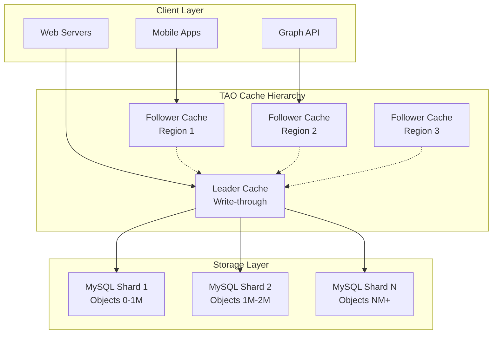
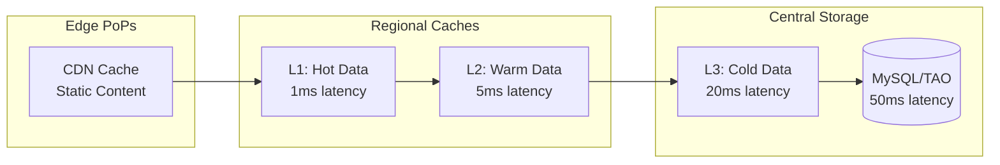
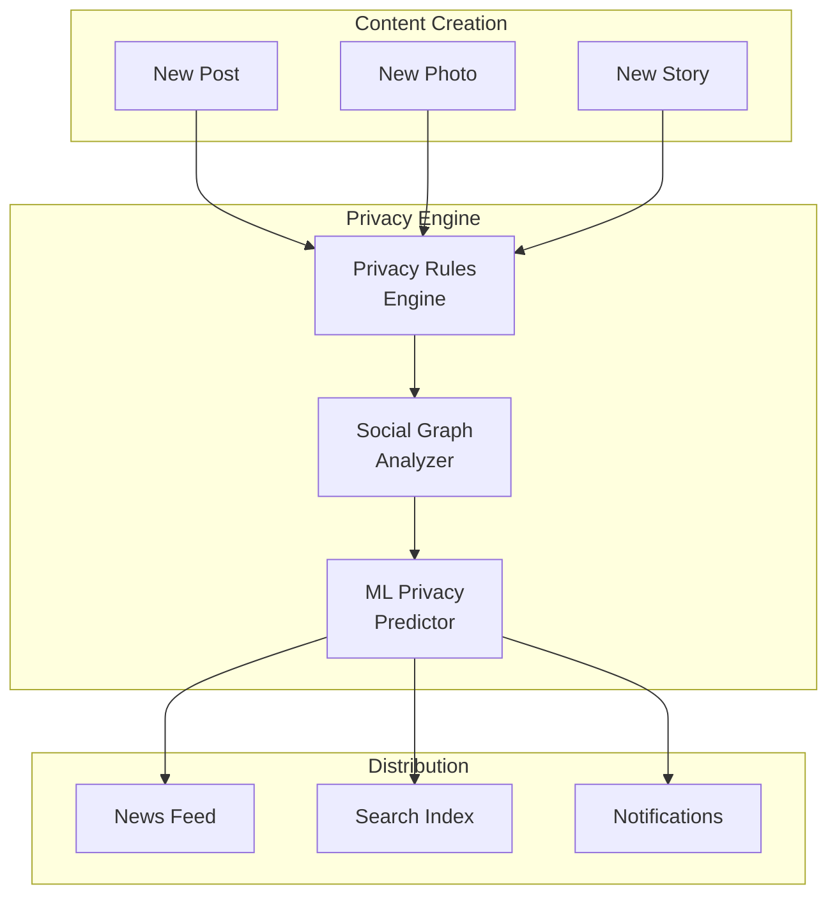
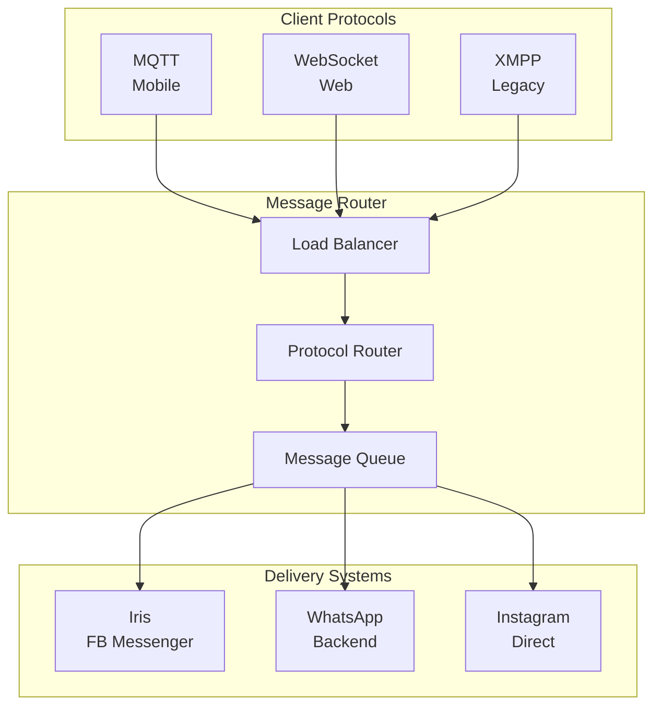

# Episode 31: Meta's Social Graph Infrastructure - Engineering Human Connection at Planet Scale

## Episode Overview
**Series**: Architecture Deep Dives (Extended)  
**Episode**: 31 of 32  
**Duration**: 3 hours  
**Target Audience**: Staff Engineers, Distinguished Engineers, Technology Leaders  

### Episode Synopsis
Journey into the technological heart of Meta's infrastructure, where 3 billion humans connect daily through the world's most complex social graph. From Facebook's dorm room beginnings to WhatsApp's encrypted billions and Instagram's visual revolution, discover how Meta engineers human connection at unprecedented scale. This episode reveals the TAO graph database powering quadrillions of queries, the Memcache fleet larger than most companies' entire infrastructure, and the privacy systems protecting humanity's most intimate data.

---

## 🎬 COLD OPEN: The Six-Hour Silence (0:00-8:00)

### October 4, 2021 - 11:58 AM EST

*[DRAMATIC RECONSTRUCTION: Meta's Menlo Park NOC]*

**BGP Engineer**: "We're seeing widespread route withdrawals... this can't be right."

**Site Reliability Lead**: "How many data centers?"

**BGP Engineer**: "All of them. Every single Meta data center just disappeared from the internet."

*[MONTAGE: Global impact visualization]*
- 3.5 billion users suddenly disconnected
- WhatsApp message delivery grinding to halt
- Instagram feeds frozen in time
- Oculus VR headsets unable to authenticate
- Smart Portal devices becoming paperweights

**Narrator**: "For six hours, a third of humanity lost their primary communication channels. A routine BGP configuration update had cascaded into the largest social media outage in history. But this crisis would reveal something profound about the architecture required to connect humanity at scale..."

*[TITLE CARD: Meta's Social Graph Infrastructure - Engineering Human Connection at Planet Scale]*

---

## 📊 PART 1: The Genesis of Global Connection (8:00-33:00)

### The Dorm Room Beginning (2004-2006)

**Original Architecture**:
```
2004: Single MySQL Database
- User profiles: 1 table
- Friendships: Simple join table
- Photos: Filesystem storage
- Scale: Harvard students only
```

**Mark Zuckerberg (Archival Interview)**: "We had maybe 10,000 users and the database was already struggling. Every new feature meant slower queries. The friendship table was growing quadratically."

### The First Scaling Crisis (2006-2008)

**Infrastructure Evolution Timeline**:
```
2006: University Expansion
- Users: 12 million
- Solution: MySQL read replicas
- Problem: Replication lag causing friendship inconsistencies

2007: Platform Launch
- Users: 50 million  
- Solution: Memcached deployment
- Innovation: Cache-aside pattern for user data

2008: Global Launch
- Users: 100 million
- Crisis: Database sharding inevitable
- Decision: Build custom graph storage
```

### The TAO Genesis (2009-2013)

**Nathan Bronson (TAO Architect)**: "We realized MySQL wasn't designed for graph queries. Finding friends-of-friends was killing us. We needed something built specifically for social graphs."

**TAO Design Principles**:
1. **Objects and Associations**: Not tables and rows
2. **Graph-Native Storage**: Optimized for traversals
3. **Global Consistency**: Eventually consistent with read-after-write guarantees
4. **Cache-First Architecture**: 99.8% cache hit rate target

---

## 🏗️ PART 2: TAO - The Social Graph Engine (33:00-75:00)

### Understanding TAO Architecture

**Core Concepts**:
```
Objects (Nodes):
- Users, Pages, Groups, Events
- Photos, Videos, Posts, Comments  
- 100+ billion objects
- Sharded by ID across regions

Associations (Edges):
- Friendships, Likes, Comments, Tags
- Directional with inverse edges
- Time-ordered per type
- 1+ trillion edges
```

### The TAO Stack



### Query Patterns and Optimization

**Friend Feed Generation**:
```
1. Get user's friend list (1 TAO query)
2. Fetch recent posts per friend (N queries, batched)
3. Rank by EdgeRank algorithm
4. Hydrate post data (parallel fetches)
5. Apply privacy filters
6. Return personalized feed
```

**Performance Metrics**:
- P50 latency: 1.3ms
- P99 latency: 10ms
- Queries/second: 10+ billion
- Cache hit rate: 99.8%

### Consistency Model

**Read-After-Write Guarantee**:
```python
# Simplified TAO consistency flow
def create_post(user_id, content):
    # Write to leader cache and DB
    post = write_to_leader(user_id, content)
    
    # Invalidate follower caches
    invalidate_followers(user_id, post.id)
    
    # Return with cache version
    return post, cache_version

def read_post(post_id, cache_version):
    # Check local follower cache
    post = read_follower_cache(post_id)
    
    if post.version < cache_version:
        # Force read from leader
        post = read_leader_cache(post_id)
    
    return post
```

---

## 🌍 PART 3: Global Infrastructure and Memcache Fleet (75:00-105:00)

### The Memcache Revolution

**Scale Evolution**:
```
2008: 10 Memcache servers
2012: 1,000 servers, 1TB RAM total
2016: 10,000 servers, 100TB RAM
2021: 100,000+ servers, 10+ PB RAM
2024: Largest Memcache deployment in history
```

### Memcache Architecture

**Multi-Tier Caching Strategy**:



### McRouter: Distributed Cache Routing

**Consistent Hashing with Replication**:
```python
class McRouter:
    def route_request(self, key):
        # Primary destination
        primary = self.consistent_hash(key)
        
        # Replica destinations for reliability
        replicas = self.get_replicas(primary, count=2)
        
        # Try primary first
        result = self.try_server(primary, key)
        
        if not result and self.should_failover:
            # Try replicas on failure
            for replica in replicas:
                result = self.try_server(replica, key)
                if result:
                    break
                    
        return result
```

### Cache Warming Strategies

**Predictive Warming**:
- User login patterns by timezone
- Friend activity correlation
- Content popularity prediction
- Event-driven warming (birthdays, holidays)

---

## 🔐 PART 4: Privacy Infrastructure at Scale (105:00-135:00)

### The Privacy Challenge

**Privacy Checker Architecture**:



### Privacy Rule Evaluation

**Complex Privacy Scenarios**:
```sql
-- Simplified privacy rule example
SELECT content_id 
FROM posts
WHERE 
    -- Basic visibility
    (privacy_setting = 'public' 
    OR user_id IN (SELECT friend_id FROM friendships WHERE user_id = ?))
    
    -- Blocked users
    AND author_id NOT IN (SELECT blocked_id FROM blocks WHERE user_id = ?)
    
    -- Custom lists
    AND (
        custom_privacy_list_id IS NULL 
        OR user_id IN (SELECT user_id FROM list_members WHERE list_id = custom_privacy_list_id)
    )
    
    -- Time-based restrictions
    AND (
        temporary_privacy_until IS NULL 
        OR temporary_privacy_until > NOW()
    )
```

### GDPR and Data Sovereignty

**Regional Data Architecture**:
- EU data remains in EU data centers
- Privacy rules evaluated locally
- Cross-region queries minimized
- Deletion propagation within 30 days

---

## 💬 PART 5: Real-Time Messaging Infrastructure (135:00-165:00)

### WhatsApp Integration Challenge

**Scale Comparison**:
```
Facebook Messenger (2014): 
- 500M users
- 10B messages/day
- Eventually consistent

WhatsApp Acquisition (2014):
- 450M users  
- 50B messages/day
- Strong consistency required
- End-to-end encryption
```

### Unified Messaging Architecture

**Multi-Protocol Support**:



### Message Delivery Guarantees

**Exactly-Once Delivery**:
```python
class MessageDeliverySystem:
    def deliver_message(self, message):
        # Generate unique message ID
        message_id = self.generate_uuid()
        
        # Store with idempotency key
        if self.message_store.exists(message_id):
            return self.message_store.get(message_id)
        
        # Begin transaction
        with self.db.transaction():
            # Store message
            self.message_store.put(message_id, message)
            
            # Queue for delivery
            self.delivery_queue.add(message_id)
            
            # Update sender's sent count
            self.update_sent_count(message.sender_id)
            
        # Async delivery with retries
        self.async_deliver(message_id)
        
        return message_id
```

### WhatsApp's End-to-End Encryption at Scale

**Double Ratchet Implementation**:
- 2 billion users
- 100 billion messages/day
- Zero-knowledge architecture
- Backup key management

---

## 🎯 PART 6: Crisis Management - The 2021 Outage Deep Dive (165:00-180:00)

### The Cascade Failure

**Timeline of Disaster**:
```
11:50 AM - Routine BGP configuration update initiated
11:52 AM - Backbone routers begin rejecting routes
11:54 AM - Data centers isolated from internet
11:58 AM - Complete global outage
12:15 PM - Physical access required (badge systems offline)
12:45 PM - Engineers physically in data centers
2:30 PM - Root cause identified
4:45 PM - Gradual service restoration begins
5:45 PM - Full service restored
```

### Technical Post-Mortem

**Root Cause Analysis**:
1. Configuration validation bug in automation system
2. BGP withdrew all routes advertising Meta's DNS servers
3. DNS servers became unreachable
4. Internal tools relied on same DNS infrastructure
5. Physical access required to fix configuration

### Architectural Improvements

**Post-Outage Changes**:
- Out-of-band management network
- DNS infrastructure independence  
- Configuration rollback mechanisms
- Automated outage detection
- Physical access protocols

---

## 🚀 PART 7: Future Vision and Lessons (180:00-195:00)

### Metaverse Infrastructure

**Next-Generation Challenges**:
- Real-time 3D world synchronization
- Haptic feedback networks
- Neural interface protocols
- Petabyte-scale user states

### Key Architectural Lessons

1. **Cache Everything**: 99.8% cache hit rate enables planet scale
2. **Graph-Native Storage**: Purpose-built beats general-purpose
3. **Privacy by Design**: Not an afterthought at scale
4. **Regional Architecture**: Data sovereignty requires isolation
5. **Configuration as Code**: But validate, test, and rollback

### Engineering Culture Insights

**Scaling Teams with Systems**:
- 70,000+ engineers
- 100+ million lines of code
- 1000+ deployments daily
- Culture of "Move Fast with Stable Infrastructure"

---

## 🎓 EPISODE TAKEAWAYS

### For Staff Engineers
- **Graph Database Design**: When to build custom vs. use existing
- **Cache Architecture**: Multi-tier strategies for planet scale
- **Privacy Systems**: Building privacy into the architecture
- **Message Delivery**: Guarantees at billion-user scale

### For Distinguished Engineers  
- **System Evolution**: Growing from monolith to planet-scale
- **Crisis Management**: Preparing for cascade failures
- **Cross-System Integration**: Merging WhatsApp, Instagram, Facebook
- **Future Architecture**: Preparing for 3D/VR workloads

### For Technology Leaders
- **Build vs. Buy**: When to create custom infrastructure
- **Cultural Integration**: Merging engineering cultures (WhatsApp)
- **Privacy Investment**: Regulatory compliance at scale
- **Outage Prevention**: Investing in resilience

---

## 📚 COMPANION RESOURCES

### Technical Deep Dives
1. TAO: Facebook's Distributed Data Store for the Social Graph (Paper)
2. Scaling Memcache at Facebook (Engineering Blog)
3. WhatsApp End-to-End Encryption Whitepaper
4. Facebook's Network Architecture Overview

### Interactive Elements
1. **TAO Query Simulator**: Practice graph queries
2. **Cache Hit Calculator**: Optimize caching strategies
3. **Privacy Rule Builder**: Design privacy systems
4. **Outage Scenario Game**: Practice incident response

### Engineering Talks
- "TAO: The Power of the Graph" - Nathan Bronson
- "Scaling Facebook to 1 Billion Users" - Engineering Team
- "WhatsApp Architecture" - Original Team
- "Building Private Social Platforms" - Privacy Engineering

---

## 🎧 NEXT EPISODE PREVIEW

**Episode 32: Pinterest's Visual Discovery Platform**  
From a simple pinboard to powering 450 million users' inspiration journeys. Discover how Pinterest built the world's largest visual discovery engine, migrated from sharded MySQL to distributed TiDB, and created ML systems that understand human creativity at scale.

---

*"At Meta, we don't just connect people—we engineer the infrastructure of human connection itself. Every like, every message, every photo shared travels through systems designed to honor both the intimacy of personal communication and the scale of global humanity."*

**- Mark Zuckerberg**  
*Meta Platforms CEO*