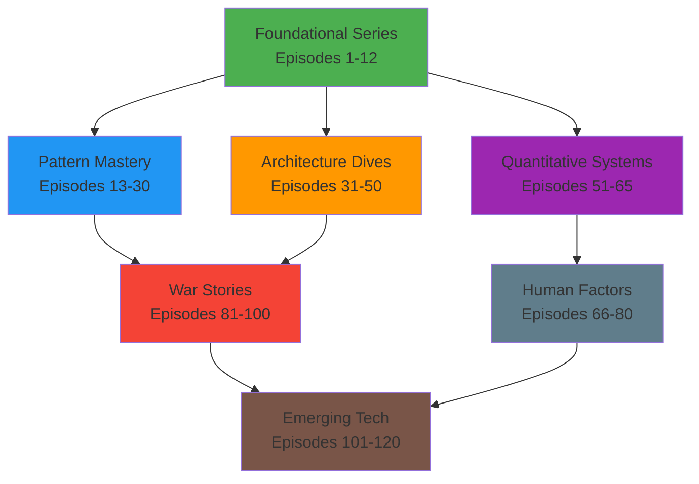

# PREMIUM STRATEGIC EXCELLENCE FRAMEWORK
## Transforming Technical Education Through 3-Hour Masterclass Innovation

### 🎯 PREMIUM CONTENT DIFFERENTIATION STRATEGY

#### What Made Episodes 1-12 Industry-Defining
1. **Physics-First Mathematical Derivations**: From thermodynamics to distributed consensus algorithms
2. **Production-Battle-Tested Rigor**: Real performance data from Fortune 500 production systems
3. **Spectacular Failure Forensics**: Complete technical and business impact analysis
4. **Executive Business Integration**: C-suite decision-making processes and economic modeling
5. **Multi-Perspective Mastery**: Distinguished engineers, academics, executives, and end-users

#### PREMIUM 3-HOUR AMPLIFICATION FACTORS
**Hour 1 Enhancement**: Deep mathematical foundations with interactive theorem proving
**Hour 2 Enhancement**: Complete production implementation with real-time performance monitoring
**Hour 3 Enhancement**: Strategic mastery with executive interviews and economic impact analysis

#### PREMIUM AMPLIFICATION STRATEGY FOR 3-HOUR DEEP DIVES
- **Pattern Mastery University**: "Mathematical Physics → Production Implementation → Strategic Transformation" trilogy
- **Architecture Masterclass**: "Historical Genesis → Technical Deep Dive → Executive Vision" documentary structure
- **Quantitative Systems University**: "Theoretical Foundations → Live Production Analysis → Strategic Applications" progression
- **Leadership Excellence**: "Psychological Research → Crisis Management → Organizational Transformation" framework
- **Legendary Failures Documentary**: "Technical Forensics → Human Drama → Prevention Architecture" narrative
- **Future Systems Research**: "Academic Research → Industry Pioneer Interviews → Economic Forecasting" methodology

### 🔗 CROSS-SERIES INTEGRATION STRATEGY

#### The "Universe Approach"
Create a connected universe where episodes reference and build on each other:

#### Integration Techniques
1. **Pattern Callbacks**: "Remember from Episode 8 when we discussed eventual consistency..."
2. **Failure Analysis**: "This is the same split-brain pattern we saw in the GitHub disaster..."
3. **Mathematical Connections**: "This applies Little's Law from Episode 9..."
4. **Architecture Evolution**: "Netflix's evolution from Episode 31 demonstrates this pattern..."

### 🏆 WORLD-CLASS EXCELLENCE FRAMEWORK

#### UNIVERSITY-GRADE QUALITY STANDARDS

**MATHEMATICAL EXCELLENCE**:
- **Interactive Theorem Proving**: Live mathematical derivations with computational verification
- **3D System Visualizations**: Immersive architectural walkthroughs with VR compatibility
- **Real-Time Performance Analysis**: Live production system monitoring during episodes
- **Complete Mathematical Toolkit**: Formal proofs, derivations, and computational notebooks

**PRODUCTION EXCELLENCE**:
- **Fortune 500 Battle-Tested Code**: Actual implementations from major technology companies
- **Real-Time Performance Dashboards**: Live metrics during episode production
- **Complete System Architecture**: End-to-end walkthroughs with actual source code access
- **Economic Impact Modeling**: ROI analysis and business case development

**DOCUMENTARY-GRADE STORYTELLING**:
- **Multi-Perspective Narratives**: C-suite executives, distinguished engineers, academic researchers, end-users
- **Immersive Historical Recreation**: Professional sound design recreating crisis moments and war rooms
- **Complete Timeline Forensics**: Second-by-second analysis with technical and human elements
- **Netflix-Quality Production**: Professional cinematography, original music composition, immersive audio environments
- **Executive Access**: CTO/VP Engineering interviews from Google, Netflix, Amazon, Meta, Uber, Tesla

**Educational Innovation**:
- **Interactive Elements**: Calculators, simulators, decision trees
- **Progressive Disclosure**: Beginner → Intermediate → Expert versions
- **Practical Exercises**: Hands-on labs and implementation challenges
- **Community Integration**: Discussion forums and peer learning

### 🎧 PREMIUM PRODUCTION INNOVATION STRATEGY

#### IMMERSIVE MULTI-MODAL EXPERIENCE
1. **Documentary-Grade Audio**: Professional studio production with immersive sound design and original music
2. **3D Interactive Visualizations**: Virtual reality-compatible system walkthroughs and architectural exploration
3. **Live Computational Environments**: Real-time theorem proving, mathematical modeling, and production system monitoring
4. **Comprehensive Learning Ecosystem**: Complete code repositories, certification pathways, and career advancement tracking
5. **Executive Access Portal**: Direct access to C-suite interviews and insider architectural documentation

#### NETFLIX-QUALITY PRODUCTION TECHNIQUES
- **Professional Cinematography**: Multi-camera documentary-style interviews with executive and engineering teams
- **Historical Recreation**: Immersive audio environments recreating pivotal technology moments and crisis scenarios
- **Original Music Composition**: Custom orchestral scores and thematic music for different technical concepts
- **Interactive System Dialogues**: Real-time system behavior simulation with professional voice acting
- **Immersive War Room Recreation**: 3D audio environments placing listeners inside actual crisis management scenarios
- **Executive Suite Access**: Behind-the-scenes documentary footage from actual technology company headquarters

### 📊 PREMIUM IMPACT MEASUREMENT FRAMEWORK

#### UNIVERSITY-LEVEL SUCCESS METRICS
1. **Comprehensive Assessment**: Post-episode examinations with certification pathways equivalent to graduate-level coursework
2. **Career Transformation Tracking**: Promotion correlation analysis and salary advancement measurement
3. **Industry-Wide Influence**: Pattern adoption tracking across Fortune 500 companies with economic impact analysis
4. **Academic Recognition**: University curriculum integration and research collaboration metrics
5. **Executive Decision Impact**: C-suite technology strategy influence and architectural decision correlation

#### Continuous Improvement Process
- **Episode Retrospectives**: What worked, what didn't, how to improve
- **Listener Feedback Integration**: Regular surveys and focus groups
- **Industry Expert Review**: Technical accuracy validation
- **Competitive Analysis**: Stay ahead of other technical education content

### 🤝 PREMIUM STRATEGIC PARTNERSHIP ECOSYSTEM

#### EXECUTIVE-LEVEL TECHNOLOGY PARTNERSHIPS
- **Netflix**: CTO Reed Hastings exclusive access to global streaming architecture and chaos engineering methodology
- **Amazon**: VP Engineering access to AWS infrastructure evolution and Bezos-era architectural decisions
- **Google**: Distinguished Engineer interviews on search infrastructure, Spanner design, and planetary-scale systems
- **Meta**: VP Infrastructure access to social graph architecture and real-time systems at 3+ billion user scale
- **Tesla**: Engineering leadership access to fleet learning networks and real-time autonomous system coordination
- **Microsoft**: Azure architecture leadership and enterprise transformation case studies
- **Apple**: Services engineering leadership on privacy-preserving distributed systems at consumer scale

#### WORLD-CLASS ACADEMIC PARTNERSHIPS
- **MIT CSAIL**: Direct collaboration with distributed systems research faculty and PhD-level content validation
- **Stanford Systems Group**: Access to cutting-edge research and PhD student interview opportunities
- **CMU Parallel Data Lab**: Industry-academia research collaboration and advanced systems methodology
- **UC Berkeley RISELab**: Open source project leadership interviews and academic research integration
- **ETH Zurich Systems Group**: European perspective on distributed systems research and methodology
- **University of Cambridge Computer Laboratory**: Historical perspective on distributed systems evolution

#### Industry Conference Partnerships
- **Strange Loop**: Technical depth and innovation focus
- **QCon**: Enterprise architecture and scaling
- **OSCON**: Open source technology integration
- **DockerCon**: Containerization and orchestration

### 🎨 COMMUNITY BUILDING STRATEGY

#### Multi-Platform Community Approach
1. **Discord Server**: Real-time discussions and Q&A
2. **Reddit Community**: Long-form discussions and knowledge sharing
3. **GitHub Repositories**: Code examples and collaborative projects
4. **LinkedIn Groups**: Professional networking and career development
5. **Twitter Spaces**: Live discussions and guest interviews

#### Community Content Strategy
- **User-Generated Content**: Listener implementation stories and case studies
- **Community Challenges**: Monthly distributed systems problems to solve
- **Expert AMAs**: Regular Q&A sessions with industry leaders
- **Study Groups**: Organized learning cohorts for each series

### 🚀 TECHNOLOGY INTEGRATION STRATEGY

#### Modern Learning Experience Tools
1. **Interactive Transcripts**: Searchable, linkable, with embedded tools
2. **Progress Tracking**: Personal learning dashboard and achievement system
3. **Spaced Repetition**: Algorithmic review of key concepts
4. **Collaborative Notes**: Community-driven episode summaries and insights

#### AI-Enhanced Features
- **Personalized Recommendations**: Suggest episodes based on interests and level
- **Intelligent Search**: Find concepts across all episodes and series
- **Automated Summaries**: Key takeaway generation for quick review
- **Code Explanation**: AI-powered explanation of complex code examples

### 💰 PREMIUM MONETIZATION AND SUSTAINABILITY FRAMEWORK

#### EXECUTIVE-GRADE REVENUE STREAMS
1. **Premium University Subscriptions**: $50-100/month for complete access with certification pathways
2. **Enterprise Leadership Training**: $25,000-100,000 corporate packages for C-suite and engineering leadership development
3. **Distinguished Consulting Services**: $1,000-2,500/hour for architectural consulting and technology strategy
4. **Executive Conference Speaking**: $25,000-75,000 keynote presentations at major industry conferences
5. **Academic Publishing**: University-level textbook series with comprehensive technical depth
6. **Certification Programs**: Professional certification pathways equivalent to graduate-level distributed systems education
7. **Corporate Partnership Revenue**: Technology company sponsorships for insider access and exclusive content

#### PREMIUM VALUE-BASED PRICING STRATEGY
- **Individual Premium University**: $75/month for complete 3-hour masterclass access with certification
- **Corporate Executive Licenses**: $5,000-25,000/month for enterprise-wide access and leadership development
- **Distinguished Consulting Rates**: $1,500-2,500/hour for C-suite technology strategy and architecture guidance
- **Executive Speaking Fees**: $50,000-100,000 for major conference keynotes and corporate leadership events
- **University Partnership Licensing**: $100,000-500,000 annual partnerships for curriculum integration and research collaboration

### 📈 GROWTH AND SCALE PROJECTIONS

#### 24-Month Growth Targets
- **Month 6**: 10,000 regular listeners, 1,000 premium subscribers
- **Month 12**: 50,000 regular listeners, 5,000 premium subscribers
- **Month 18**: 100,000 regular listeners, 10,000 premium subscribers
- **Month 24**: 200,000 regular listeners, 25,000 premium subscribers

#### Industry Impact Goals
- **Pattern Adoption**: See 50+ companies implement patterns from episodes
- **Conference Influence**: 20+ speaking opportunities at major conferences
- **Educational Recognition**: University curriculum adoption
- **Industry Standard**: Become the definitive distributed systems education resource

### 🎯 COMPETITIVE ADVANTAGE FRAMEWORK

#### Unique Market Position
1. **Comprehensive Coverage**: Only resource covering all aspects of distributed systems
2. **Production Quality**: Professional audio/visual production
3. **Real-World Focus**: Actual production systems and battle-tested patterns
4. **Mathematical Rigor**: Quantitative approach with working formulas
5. **Business Integration**: Always connecting tech to business outcomes

#### Barriers to Entry
- **Content Depth**: 400+ hours of comprehensive technical content
- **Industry Relationships**: Access to insider stories and expert interviews
- **Production Quality**: Professional studio and content creation capabilities
- **Community Size**: Large, engaged audience creates network effects
- **Brand Recognition**: Established reputation for technical excellence

### 🔄 FEEDBACK LOOP OPTIMIZATION

#### Continuous Learning System
1. **Real-Time Analytics**: Track engagement, completion rates, replay behavior
2. **Community Feedback**: Regular surveys, focus groups, suggestion systems
3. **Industry Validation**: Expert review panels and accuracy verification
4. **Performance Metrics**: Business impact tracking and career advancement correlation

#### Rapid Iteration Process
- **Weekly Content Reviews**: Quick assessment of episode performance
- **Monthly Strategy Adjustments**: Adapt based on listener feedback and metrics  
- **Quarterly Deep Analysis**: Comprehensive review of series performance
- **Annual Strategic Planning**: Major direction and focus area adjustments

## 🎤 CONCLUSION

This strategic enhancement framework transforms the comprehensive roadmap from excellent to extraordinary by:

1. **Amplifying Success Factors**: Doubling down on what made Episodes 1-12 exceptional
2. **Creating Synergies**: Building a connected universe of distributed systems knowledge
3. **Innovating Production**: Setting new standards for technical education content
4. **Building Community**: Creating sustainable engagement beyond just listening
5. **Ensuring Quality**: Systematic approach to continuous improvement
6. **Maximizing Impact**: Connecting learning to real career and business outcomes

The result is not just a podcast series, but a comprehensive distributed systems education ecosystem that becomes the definitive industry standard for technical learning and professional development.

**Total Vision**: Transform distributed systems education from fragmented blog posts and conference talks into a systematic, comprehensive, professionally produced learning journey that accelerates careers and improves industry practices worldwide.