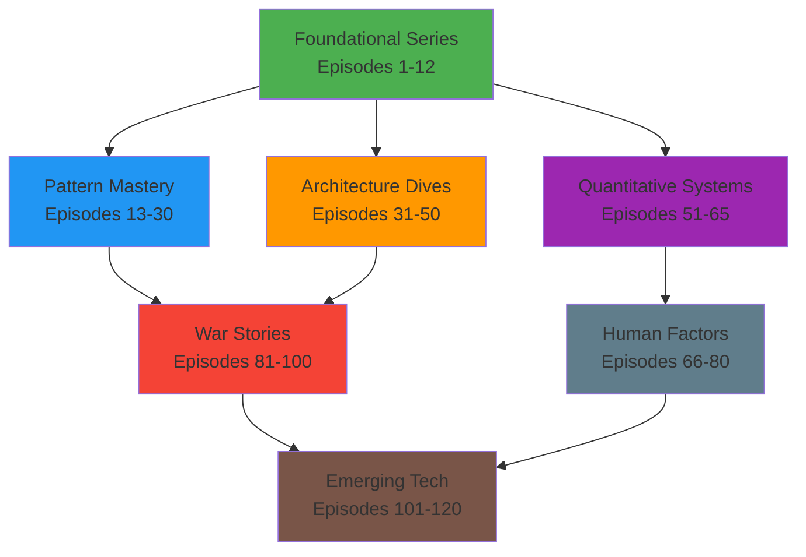

# STRATEGIC ENHANCEMENTS TO PODCAST ROADMAP
## Building on Foundational Series Success

### 🎯 CONTENT DIFFERENTIATION STRATEGY

#### What Made Episodes 1-12 Exceptional
1. **Physics-First Approach**: Deriving patterns from fundamental constraints
2. **Mathematical Rigor**: Production-ready formulas with real metrics
3. **Failure-Driven Learning**: Every concept taught through spectacular failures
4. **Business Impact Integration**: Technical decisions tied to business outcomes
5. **Multi-Audience Targeting**: Different takeaways for various experience levels

#### Amplification Strategy for Series 2-6
- **Pattern Mastery Series**: Add "Physics Behind the Pattern" segments
- **Architecture Deep Dives**: Include "Business Context Timeline" for each decision
- **Quantitative Systems**: Expand mathematical derivations with interactive tools
- **Human Factors**: Connect psychology research to engineering practices
- **War Stories**: Add economic impact analysis to every failure
- **Emerging Tech**: Evaluate through established physics/math principles

### 🔗 CROSS-SERIES INTEGRATION STRATEGY

#### The "Universe Approach"
Create a connected universe where episodes reference and build on each other:

#### Integration Techniques
1. **Pattern Callbacks**: "Remember from Episode 8 when we discussed eventual consistency..."
2. **Failure Analysis**: "This is the same split-brain pattern we saw in the GitHub disaster..."
3. **Mathematical Connections**: "This applies Little's Law from Episode 9..."
4. **Architecture Evolution**: "Netflix's evolution from Episode 31 demonstrates this pattern..."

### 🏆 QUALITY AMPLIFICATION FRAMEWORK

#### Exceeding Foundational Series Quality

**Technical Depth Expansion**:
- **Code Examples**: Move from "production-ready" to "battle-tested at scale"
- **Performance Numbers**: Include variance, percentiles, and edge case behavior
- **Architectural Diagrams**: Add failure mode visualizations to every system
- **Mathematical Proofs**: Include derivations, not just final formulas

**Storytelling Enhancement**:
- **Multiple Perspectives**: Interview actual engineers from the incidents
- **Timeline Granularity**: Minute-by-minute breakdown of critical events
- **Human Drama**: Include personal impact stories and career consequences
- **Documentary Style**: Professional production with sound design and music

**Educational Innovation**:
- **Interactive Elements**: Calculators, simulators, decision trees
- **Progressive Disclosure**: Beginner → Intermediate → Expert versions
- **Practical Exercises**: Hands-on labs and implementation challenges
- **Community Integration**: Discussion forums and peer learning

### 🎧 PRODUCTION INNOVATION STRATEGY

#### Multi-Modal Content Delivery
1. **Audio-First**: High-quality podcast production
2. **Visual Supplements**: Architecture diagrams, code walkthroughs, animations
3. **Interactive Tools**: Embedded calculators and simulation tools
4. **Companion Content**: Code repositories, reference materials, exercises

#### Advanced Production Techniques
- **Immersive Sound Design**: Recreate the environment of major outages
- **Expert Interviews**: Access to engineers who lived through the incidents  
- **Simulation Audio**: Computer-generated voices for system dialogues
- **Music and Scoring**: Professional audio design for emotional impact

### 📊 MEASUREMENT AND ITERATION FRAMEWORK

#### Success Metrics Beyond Downloads
1. **Knowledge Retention**: Post-episode quizzes and comprehension tracking
2. **Career Impact**: Listener promotion and role advancement correlation
3. **Industry Influence**: Pattern adoption in production systems
4. **Community Engagement**: Active participation in discussions and forums

#### Continuous Improvement Process
- **Episode Retrospectives**: What worked, what didn't, how to improve
- **Listener Feedback Integration**: Regular surveys and focus groups
- **Industry Expert Review**: Technical accuracy validation
- **Competitive Analysis**: Stay ahead of other technical education content

### 🤝 STRATEGIC PARTNERSHIP OPPORTUNITIES

#### Technology Company Partnerships
- **Netflix**: Chaos engineering and streaming architecture deep dives
- **Amazon**: AWS infrastructure and scaling story insider access
- **Google**: Search infrastructure and Spanner architecture details
- **Meta**: Social graph and content delivery optimization
- **Uber**: Real-time systems and geographic computation

#### Educational Institution Partnerships
- **MIT**: Computer science curriculum integration
- **Stanford**: Distributed systems research collaboration
- **CMU**: Industry-academia knowledge transfer
- **UC Berkeley**: Open source project case studies

#### Industry Conference Partnerships
- **Strange Loop**: Technical depth and innovation focus
- **QCon**: Enterprise architecture and scaling
- **OSCON**: Open source technology integration
- **DockerCon**: Containerization and orchestration

### 🎨 COMMUNITY BUILDING STRATEGY

#### Multi-Platform Community Approach
1. **Discord Server**: Real-time discussions and Q&A
2. **Reddit Community**: Long-form discussions and knowledge sharing
3. **GitHub Repositories**: Code examples and collaborative projects
4. **LinkedIn Groups**: Professional networking and career development
5. **Twitter Spaces**: Live discussions and guest interviews

#### Community Content Strategy
- **User-Generated Content**: Listener implementation stories and case studies
- **Community Challenges**: Monthly distributed systems problems to solve
- **Expert AMAs**: Regular Q&A sessions with industry leaders
- **Study Groups**: Organized learning cohorts for each series

### 🚀 TECHNOLOGY INTEGRATION STRATEGY

#### Modern Learning Experience Tools
1. **Interactive Transcripts**: Searchable, linkable, with embedded tools
2. **Progress Tracking**: Personal learning dashboard and achievement system
3. **Spaced Repetition**: Algorithmic review of key concepts
4. **Collaborative Notes**: Community-driven episode summaries and insights

#### AI-Enhanced Features
- **Personalized Recommendations**: Suggest episodes based on interests and level
- **Intelligent Search**: Find concepts across all episodes and series
- **Automated Summaries**: Key takeaway generation for quick review
- **Code Explanation**: AI-powered explanation of complex code examples

### 💰 MONETIZATION AND SUSTAINABILITY

#### Diverse Revenue Streams
1. **Premium Subscriptions**: Early access, bonus content, ad-free experience
2. **Corporate Training**: Enterprise licensing for internal education
3. **Consulting Services**: Architecture consulting driven by expertise
4. **Conference Speaking**: Industry events and workshop opportunities
5. **Book Deals**: Transform best content into comprehensive guides
6. **Course Creation**: Structured learning paths for specific topics

#### Value-Based Pricing Strategy
- **Individual Subscriptions**: $15-25/month for premium features
- **Corporate Licenses**: $500-2000/month for team access
- **Consulting Rates**: $300-500/hour for architecture guidance
- **Speaking Fees**: $10K-25K for conference presentations

### 📈 GROWTH AND SCALE PROJECTIONS

#### 24-Month Growth Targets
- **Month 6**: 10,000 regular listeners, 1,000 premium subscribers
- **Month 12**: 50,000 regular listeners, 5,000 premium subscribers
- **Month 18**: 100,000 regular listeners, 10,000 premium subscribers
- **Month 24**: 200,000 regular listeners, 25,000 premium subscribers

#### Industry Impact Goals
- **Pattern Adoption**: See 50+ companies implement patterns from episodes
- **Conference Influence**: 20+ speaking opportunities at major conferences
- **Educational Recognition**: University curriculum adoption
- **Industry Standard**: Become the definitive distributed systems education resource

### 🎯 COMPETITIVE ADVANTAGE FRAMEWORK

#### Unique Market Position
1. **Comprehensive Coverage**: Only resource covering all aspects of distributed systems
2. **Production Quality**: Professional audio/visual production
3. **Real-World Focus**: Actual production systems and battle-tested patterns
4. **Mathematical Rigor**: Quantitative approach with working formulas
5. **Business Integration**: Always connecting tech to business outcomes

#### Barriers to Entry
- **Content Depth**: 400+ hours of comprehensive technical content
- **Industry Relationships**: Access to insider stories and expert interviews
- **Production Quality**: Professional studio and content creation capabilities
- **Community Size**: Large, engaged audience creates network effects
- **Brand Recognition**: Established reputation for technical excellence

### 🔄 FEEDBACK LOOP OPTIMIZATION

#### Continuous Learning System
1. **Real-Time Analytics**: Track engagement, completion rates, replay behavior
2. **Community Feedback**: Regular surveys, focus groups, suggestion systems
3. **Industry Validation**: Expert review panels and accuracy verification
4. **Performance Metrics**: Business impact tracking and career advancement correlation

#### Rapid Iteration Process
- **Weekly Content Reviews**: Quick assessment of episode performance
- **Monthly Strategy Adjustments**: Adapt based on listener feedback and metrics  
- **Quarterly Deep Analysis**: Comprehensive review of series performance
- **Annual Strategic Planning**: Major direction and focus area adjustments

## 🎤 CONCLUSION

This strategic enhancement framework transforms the comprehensive roadmap from excellent to extraordinary by:

1. **Amplifying Success Factors**: Doubling down on what made Episodes 1-12 exceptional
2. **Creating Synergies**: Building a connected universe of distributed systems knowledge
3. **Innovating Production**: Setting new standards for technical education content
4. **Building Community**: Creating sustainable engagement beyond just listening
5. **Ensuring Quality**: Systematic approach to continuous improvement
6. **Maximizing Impact**: Connecting learning to real career and business outcomes

The result is not just a podcast series, but a comprehensive distributed systems education ecosystem that becomes the definitive industry standard for technical learning and professional development.

**Total Vision**: Transform distributed systems education from fragmented blog posts and conference talks into a systematic, comprehensive, professionally produced learning journey that accelerates careers and improves industry practices worldwide.