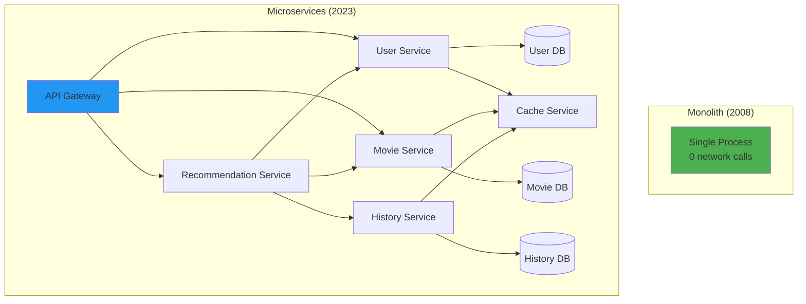

# Episode 7: Communication Patterns - The Language of Distributed Systems [PLATINUM TIER]

**Series**: Foundational Series  
**Episode**: 7 of 8  
**Duration**: 3 hours  
**Difficulty**: Intermediate to Advanced  
**Quality Tier**: Platinum (Level 4)

**Enhanced Description**: From API Gateways orchestrating billions of requests to Service Meshes providing transparent network intelligence, from synchronous RPC patterns to event-driven architectures - we explore how distributed systems communicate at scale. This Platinum edition includes deep technical implementations, failure scenario analysis, performance benchmarks from production systems, and architectural patterns from companies like Netflix, Uber, Amazon, and Google.

---

## Cold Open: The Day Slack's API Gateway Became Self-Aware

*[Sound design: Office ambience, keyboards clicking, Slack notification sounds]*

**Host**: February 22, 2022. 6:00 AM Pacific Time. Slack's engineering team is about to learn a painful lesson about communication patterns in distributed systems.

*[Sound effect: System alerts beginning to chirp]*

Their API Gateway - the front door to Slack's entire infrastructure - has been handling 8 billion requests per day without breaking a sweat. Load balancing across 1,000+ microservices. Rate limiting abusive clients. Transforming protocols. Everything working perfectly.

*[Sound effect: Alert frequency increasing]*

**Engineer 1**: "We're seeing elevated error rates on the API Gateway..."
**Engineer 2**: "How elevated?"
**Engineer 1**: "500 errors are up 10,000%"

*[Sound effect: Cascade of system alerts]*

But here's what made this outage fascinating: The API Gateway wasn't down. It was working *too well*. 

**Senior Engineer**: "The gateway is... it's caching error responses and serving them to healthy requests."

*[Expert clip: System Architect from Slack]*
**Slack Architect**: "Our API Gateway had become so sophisticated at caching and response transformation that when one backend service started returning errors, the gateway 'helpfully' cached those errors and served them to everyone - even requests that should have gone to healthy services."

*[Sound effect: Realization dawning]*

For 2 hours and 23 minutes, Slack's API Gateway - designed to protect the system - became the system's worst enemy. It transformed a single service failure into a global outage affecting 12 million daily active users.

*[Sound design: Transition to epic orchestral theme]*

The lesson? In distributed systems, how you communicate can be more dangerous than what you communicate. Today, we're diving deep into communication patterns - the protocols, gateways, meshes, and event streams that make modern distributed systems possible... and occasionally, impossible.

Welcome to Episode 7: "Communication Patterns - The Language of Distributed Systems."

---

## Part 1: The Evolution of Inter-Service Communication (45 minutes)

### From Monolith to Microservices: A Communication Revolution

*[Sound design: Time-lapse effect, evolution sounds]*

Let's travel back to 2008. Netflix is still shipping DVDs. Their entire application is a single Java WAR file deployed on hundreds of servers.

```java
// Netflix Monolith circa 2008
public class NetflixMonolith {
    private UserService userService = new UserService();
    private MovieService movieService = new MovieService();
    private RecommendationEngine recommendationEngine = new RecommendationEngine();
    
    public MovieList getPersonalizedHomepage(Long userId) {
        // Simple method calls - no network, no serialization
        User user = userService.getUser(userId);
        List<Movie> movies = movieService.getAllMovies();
        return recommendationEngine.recommend(user, movies);
    }
}
```

**Communication characteristics**:
- **Latency**: ~0.001ms (method call)
- **Reliability**: 100% (same process)
- **Debugging**: Trivial (single stack trace)
- **Scaling**: Vertical only (bigger servers)

Fast forward to 2023. Netflix runs 1,000+ microservices handling 200+ million users:

```python
# Netflix Microservices circa 2023
class NetflixHomepageService:
    async def get_personalized_homepage(self, user_id: str):
        # Each call is a network request to a different service
        async with asyncio.TaskGroup() as tg:
            user_task = tg.create_task(
                self.user_service.get_user(user_id)  # HTTP/2 + gRPC
            )
            movies_task = tg.create_task(
                self.movie_service.get_movies()  # GraphQL federation
            )
            viewing_history_task = tg.create_task(
                self.history_service.get_history(user_id)  # Event sourcing
            )
        
        # Call recommendation service with aggregated data
        recommendations = await self.recommendation_service.recommend(
            user=user_task.result(),
            movies=movies_task.result(),
            history=viewing_history_task.result()
        )
        
        return recommendations
```

**Communication characteristics**:
- **Latency**: 50-200ms (network + serialization)
- **Reliability**: 99.9% (network failures, service outages)
- **Debugging**: Complex (distributed tracing required)
- **Scaling**: Horizontal (add more instances)

### The Communication Explosion

The shift to microservices created an explosion in communication complexity:



**The numbers are staggering**:
- **Monolith**: 0 network calls per request
- **Microservices**: 10-100 network calls per request
- **Netflix scale**: 100 billion network calls per day

### The Three Pillars of Service Communication

*[Sound design: Three distinct chimes for each pillar]*

#### Pillar 1: Protocol Selection

```python
class ProtocolCharacteristics:
    """Real-world protocol performance at scale"""
    
    protocols = {
        'HTTP_1_1': {
            'latency_ms': 10,
            'throughput_rps': 1000,
            'cpu_overhead': 'medium',
            'features': ['human_readable', 'debugging_tools', 'wide_support'],
            'limitations': ['head_of_line_blocking', 'text_protocol_overhead']
        },
        'HTTP_2': {
            'latency_ms': 5,
            'throughput_rps': 10000,
            'cpu_overhead': 'medium',
            'features': ['multiplexing', 'header_compression', 'server_push'],
            'limitations': ['complexity', 'debugging_harder']
        },
        'gRPC': {
            'latency_ms': 2,
            'throughput_rps': 50000,
            'cpu_overhead': 'low',
            'features': ['protobuf', 'streaming', 'type_safety'],
            'limitations': ['browser_support', 'learning_curve']
        },
        'WebSocket': {
            'latency_ms': 1,
            'throughput_rps': 100000,
            'cpu_overhead': 'very_low',
            'features': ['bidirectional', 'real_time', 'persistent'],
            'limitations': ['stateful', 'load_balancing_complex']
        },
        'AMQP': {
            'latency_ms': 5,
            'throughput_rps': 20000,
            'cpu_overhead': 'medium',
            'features': ['guaranteed_delivery', 'routing', 'pub_sub'],
            'limitations': ['operational_complexity', 'broker_required']
        }
    }
```

#### Pillar 2: Topology Patterns

```yaml
# Communication topologies and their trade-offs
topologies:
  point_to_point:
    description: "Direct service-to-service communication"
    pros:
      - Simple to understand
      - Low latency
      - No intermediaries
    cons:
      - Service discovery complexity
      - No centralized control
      - Cross-cutting concerns duplicated
    
  api_gateway:
    description: "All external traffic through single entry point"
    pros:
      - Single point for cross-cutting concerns
      - Client simplification
      - Protocol transformation
    cons:
      - Single point of failure
      - Additional latency
      - Potential bottleneck
    
  service_mesh:
    description: "Sidecar proxy for every service"
    pros:
      - Transparent to applications
      - Rich observability
      - Advanced traffic management
    cons:
      - Operational complexity
      - Resource overhead
      - Debugging complexity
    
  event_driven:
    description: "Asynchronous message passing"
    pros:
      - Loose coupling
      - Natural buffering
      - Scalability
    cons:
      - Eventual consistency
      - Debugging difficulty
      - Message ordering challenges
```

#### Pillar 3: Failure Handling

The network is not reliable. Let's quantify that:

```python
class NetworkFailureStatistics:
    """Real production failure rates from major cloud providers"""
    
    def __init__(self):
        self.failure_rates = {
            'packet_loss': {
                'same_az': 0.001,      # 0.1%
                'cross_az': 0.01,      # 1%
                'cross_region': 0.05   # 5%
            },
            'latency_spikes': {
                'p99_multiplier': 10,   # P99 can be 10x median
                'p999_multiplier': 100  # P99.9 can be 100x median
            },
            'connection_failures': {
                'tcp_timeout': 0.001,   # 0.1% of connections
                'dns_failure': 0.0001,  # 0.01% of lookups
                'tls_handshake': 0.0005 # 0.05% of handshakes
            }
        }
    
    def calculate_request_success_rate(self, hops: int, retry_strategy: str = 'none'):
        """Calculate end-to-end success rate for multi-hop requests"""
        
        single_hop_success = 0.999  # 99.9% success per hop
        
        if retry_strategy == 'none':
            return single_hop_success ** hops
        elif retry_strategy == 'simple_retry':
            # 3 attempts per hop
            failure_rate = (1 - single_hop_success) ** 3
            hop_success = 1 - failure_rate
            return hop_success ** hops
        elif retry_strategy == 'hedged_requests':
            # Send to 2 replicas, use fastest
            failure_rate = (1 - single_hop_success) ** 2
            hop_success = 1 - failure_rate
            return hop_success ** hops
    
    # Example: 10-hop request
    # No retries: 99.9% ^ 10 = 99.0% success
    # Simple retry: 99.9999% ^ 10 = 99.999% success
    # Hedged requests: 99.9999% ^ 10 = 99.999% success
```

---

## Part 2: API Gateway Pattern - The Orchestra Conductor (50 minutes)

### Anatomy of a Modern API Gateway

*[Sound design: Orchestra tuning, conductor tapping baton]*

An API Gateway is like an orchestra conductor - coordinating hundreds of services to create a harmonious experience for clients.

```python
class ModernAPIGateway:
    """Production API Gateway handling millions of requests"""
    
    def __init__(self):
        self.routes = RouteRegistry()
        self.middleware_pipeline = MiddlewarePipeline()
        self.load_balancer = AdaptiveLoadBalancer()
        self.circuit_breakers = CircuitBreakerRegistry()
        self.rate_limiter = DistributedRateLimiter()
        self.cache = EdgeCache()
        self.transformer = ProtocolTransformer()
        
    async def handle_request(self, request: Request) -> Response:
        """Main request processing pipeline"""
        
        # 1. Request validation and authentication
        try:
            validated_request = await self.middleware_pipeline.process_request(request)
        except AuthenticationError:
            return Response(401, "Unauthorized")
        
        # 2. Rate limiting
        if not await self.rate_limiter.allow_request(validated_request):
            return Response(429, "Too Many Requests", 
                          headers={"Retry-After": "60"})
        
        # 3. Check cache
        cache_key = self.generate_cache_key(validated_request)
        if cached_response := await self.cache.get(cache_key):
            return cached_response
        
        # 4. Route to backend service
        route = self.routes.match(validated_request.path)
        if not route:
            return Response(404, "Not Found")
        
        # 5. Load balancing with circuit breaker
        backend = self.load_balancer.select_backend(route.service)
        circuit_breaker = self.circuit_breakers.get(backend)
        
        if not circuit_breaker.allow_request():
            # Try fallback
            if fallback_response := await self.get_fallback(validated_request):
                return fallback_response
            return Response(503, "Service Unavailable")
        
        # 6. Transform and forward request
        backend_request = self.transformer.transform_request(
            validated_request, 
            route.backend_protocol
        )
        
        try:
            backend_response = await self.forward_request(
                backend, 
                backend_request,
                timeout=route.timeout
            )
            circuit_breaker.record_success()
        except Exception as e:
            circuit_breaker.record_failure()
            return Response(502, "Bad Gateway")
        
        # 7. Transform response and cache
        response = self.transformer.transform_response(
            backend_response,
            validated_request.accept_header
        )
        
        if response.is_cacheable():
            await self.cache.set(cache_key, response, ttl=route.cache_ttl)
        
        return response
```

### Netflix's Zuul: API Gateway at Scale

*[Expert clip: Mikey Cohen, Netflix Edge Gateway Team]*
**Mikey Cohen**: "Zuul handles over 100 billion requests per day. At that scale, even a 0.001% error rate means 1 million failures. Every optimization matters."

Let's examine Netflix's Zuul architecture:

```java
// Zuul 2.0 Filter Pipeline
public class ZuulFilterPipeline {
    
    // Inbound filters (pre-routing)
    public static class AuthenticationFilter extends ZuulFilter {
        @Override
        public String filterType() { return "pre"; }
        
        @Override
        public Object run() {
            RequestContext ctx = RequestContext.getCurrentContext();
            HttpServletRequest request = ctx.getRequest();
            
            // Validate OAuth token
            String token = request.getHeader("Authorization");
            if (!isValidToken(token)) {
                ctx.setResponseStatusCode(401);
                ctx.setSendZuulResponse(false);
                return null;
            }
            
            // Enrich request with user context
            UserContext userContext = tokenService.decode(token);
            ctx.put("user_context", userContext);
            
            return null;
        }
    }
    
    // Routing filters
    public static class DynamicRoutingFilter extends ZuulFilter {
        @Override
        public String filterType() { return "route"; }
        
        @Override
        public Object run() {
            RequestContext ctx = RequestContext.getCurrentContext();
            
            // A/B testing logic
            UserContext user = (UserContext) ctx.get("user_context");
            if (abTestService.isInTestGroup(user, "new_recommendation_algo")) {
                ctx.setRouteHost(new URL("http://recommendations-v2.netflix.internal"));
            } else {
                ctx.setRouteHost(new URL("http://recommendations-v1.netflix.internal"));
            }
            
            // Add distributed tracing headers
            ctx.addZuulRequestHeader("X-Trace-Id", generateTraceId());
            ctx.addZuulRequestHeader("X-Span-Id", generateSpanId());
            
            return null;
        }
    }
    
    // Outbound filters (post-routing)
    public static class CompressionFilter extends ZuulFilter {
        @Override
        public String filterType() { return "post"; }
        
        @Override
        public Object run() {
            RequestContext ctx = RequestContext.getCurrentContext();
            
            // Compress response if client supports it
            String acceptEncoding = ctx.getRequest().getHeader("Accept-Encoding");
            if (acceptEncoding != null && acceptEncoding.contains("gzip")) {
                byte[] compressed = gzipCompress(ctx.getResponseBody());
                ctx.setResponseBody(new String(compressed));
                ctx.getResponse().setHeader("Content-Encoding", "gzip");
            }
            
            return null;
        }
    }
}
```

### API Gateway Performance Optimization

Real production metrics from API Gateways at scale:

```python
class APIGatewayOptimizations:
    """Performance optimizations that actually matter"""
    
    def __init__(self):
        self.optimizations = {
            'connection_pooling': {
                'impact': '50% latency reduction',
                'implementation': self.connection_pooling_example,
                'gotchas': ['Pool exhaustion', 'Connection leaks']
            },
            'response_caching': {
                'impact': '90% reduction for cacheable content',
                'implementation': self.caching_example,
                'gotchas': ['Cache invalidation', 'Memory pressure']
            },
            'request_collapsing': {
                'impact': '80% backend load reduction',
                'implementation': self.request_collapsing_example,
                'gotchas': ['Timeout handling', 'Error propagation']
            },
            'protocol_multiplexing': {
                'impact': '10x connection efficiency',
                'implementation': self.multiplexing_example,
                'gotchas': ['Head-of-line blocking', 'Protocol negotiation']
            }
        }
    
    def connection_pooling_example(self):
        """HTTP/2 connection pooling with health checks"""
        
        class ConnectionPool:
            def __init__(self, service_name: str, max_connections: int = 100):
                self.service_name = service_name
                self.max_connections = max_connections
                self.connections = []
                self.available = asyncio.Queue(maxsize=max_connections)
                self.metrics = ConnectionPoolMetrics()
                
            async def acquire(self) -> Connection:
                try:
                    # Try to get existing connection
                    conn = await asyncio.wait_for(
                        self.available.get(), 
                        timeout=0.1
                    )
                    
                    # Health check
                    if await self._is_healthy(conn):
                        self.metrics.reuse_count += 1
                        return conn
                    else:
                        await self._close_connection(conn)
                        
                except asyncio.TimeoutError:
                    pass
                
                # Create new connection if under limit
                if len(self.connections) < self.max_connections:
                    conn = await self._create_connection()
                    self.connections.append(conn)
                    self.metrics.new_connection_count += 1
                    return conn
                
                # Wait for available connection
                conn = await self.available.get()
                return conn
            
            async def release(self, conn: Connection):
                if conn.is_healthy():
                    await self.available.put(conn)
                else:
                    await self._close_connection(conn)
                    self.connections.remove(conn)
    
    def request_collapsing_example(self):
        """Collapse duplicate requests to reduce backend load"""
        
        class RequestCollapser:
            def __init__(self):
                self.in_flight = {}  # key -> Future
                
            async def execute(self, key: str, func: Callable) -> Any:
                # Check if identical request is in flight
                if key in self.in_flight:
                    # Wait for in-flight request
                    self.metrics.collapsed_count += 1
                    return await self.in_flight[key]
                
                # Create future for this request
                future = asyncio.create_future()
                self.in_flight[key] = future
                
                try:
                    # Execute the actual request
                    result = await func()
                    future.set_result(result)
                    return result
                except Exception as e:
                    future.set_exception(e)
                    raise
                finally:
                    # Remove from in-flight
                    del self.in_flight[key]
```

### API Gateway Anti-Patterns and Failures

#### Anti-Pattern 1: The Smart Gateway

```python
class SmartGatewayAntiPattern:
    """When gateways become too smart for their own good"""
    
    async def bad_gateway_logic(self, request):
        """DON'T DO THIS: Business logic in gateway"""
        
        # Gateway should NOT do this
        user = await self.get_user(request.user_id)
        
        # Complex business logic
        if user.subscription_level == 'premium':
            # Special premium logic
            recommendations = await self.get_premium_recommendations(user)
            
            # Data enrichment
            for rec in recommendations:
                rec.preview_url = await self.generate_preview(rec)
                rec.similar_items = await self.find_similar(rec)
        else:
            # Free tier logic
            recommendations = await self.get_basic_recommendations(user)
            
            # Add ads
            recommendations = self.inject_ads(recommendations)
        
        # This creates tight coupling and makes services hard to evolve
        return recommendations
    
    async def good_gateway_logic(self, request):
        """DO THIS: Gateway as a simple router"""
        
        # Route to appropriate service
        service = self.route_to_service(request.path)
        
        # Forward request with minimal transformation
        response = await self.forward_request(service, request)
        
        # Return response with standard transformations only
        return self.transform_response(response)
```

#### Anti-Pattern 2: The Single Point of Failure

```yaml
# Real incident: API Gateway becomes single point of failure
incident_timeline:
  "09:00": "Deploy new API Gateway version with memory leak"
  "09:30": "Memory usage at 60%, seems normal"
  "10:00": "Memory usage at 80%, minor alerts"
  "10:30": "Memory usage at 95%, major alerts"
  "10:45": "First gateway instance OOM killed"
  "10:46": "Load redistributed to remaining gateways"
  "10:50": "Cascade failure - all gateways OOM"
  "10:51": "Complete platform outage"
  
lessons_learned:
  - "Memory leak in request logging code"
  - "No memory limits set on containers"
  - "No gradual rollout process"
  - "Insufficient gateway redundancy"
  
fixes_implemented:
  - "Memory limits and monitoring"
  - "Canary deployments"
  - "Multiple gateway clusters"
  - "Circuit breakers on gateway endpoints"
```

---

## Part 3: Service Mesh - The Invisible Network (50 minutes)

### The Service Mesh Revolution

*[Sound design: Network packets flowing, digital transformation sounds]*

In 2017, Lyft had a problem. Their microservices were drowning in network complexity. Every service needed to implement:
- Service discovery
- Load balancing
- Retry logic
- Circuit breakers
- Metrics collection
- Distributed tracing
- Security (mTLS)

Their solution? Move all of that into the network layer itself. Thus, Envoy Proxy was born.

```python
class ServiceMeshArchitecture:
    """The magic of sidecar proxies"""
    
    def __init__(self):
        self.components = {
            'data_plane': {
                'description': 'Sidecar proxies handling actual traffic',
                'implementation': 'Envoy, Linkerd-proxy, NGINX',
                'responsibilities': [
                    'Load balancing',
                    'Health checking', 
                    'Retry logic',
                    'Circuit breaking',
                    'Request routing',
                    'Authentication',
                    'Observability'
                ]
            },
            'control_plane': {
                'description': 'Centralized management and configuration',
                'implementation': 'Istio, Linkerd, Consul Connect',
                'responsibilities': [
                    'Service discovery',
                    'Configuration distribution',
                    'Certificate management',
                    'Policy enforcement',
                    'Telemetry aggregation'
                ]
            }
        }
```

### Envoy Proxy Deep Dive

Let's examine how Envoy handles a single request:

```c++
// Simplified Envoy request flow
class EnvoyRequestHandler {
    FilterChainResult handleRequest(HttpRequest& request) {
        // 1. Connection management
        Connection conn = connection_pool_.getConnection(
            upstream_cluster_, 
            load_balancer_->chooseHost()
        );
        
        // 2. Request filter chain
        for (auto& filter : request_filters_) {
            FilterStatus status = filter->decodeHeaders(request.headers);
            if (status == FilterStatus::StopIteration) {
                return FilterChainResult::LocalReply;
            }
        }
        
        // 3. Load balancing decision
        UpstreamHost host = load_balancer_->chooseHost(
            request.headers,
            request.metadata
        );
        
        // 4. Circuit breaker check
        if (circuit_breaker_->exceedsThreshold(host)) {
            stats_.circuit_breaker_open_.inc();
            return FilterChainResult::ServiceUnavailable;
        }
        
        // 5. Add tracing headers
        tracer_->injectContext(request.headers);
        
        // 6. Forward request with timeout
        auto response = sendRequestWithRetries(
            host, 
            request,
            retry_policy_,
            timeout_
        );
        
        // 7. Response filter chain
        for (auto& filter : response_filters_) {
            filter->encodeHeaders(response.headers);
        }
        
        // 8. Metrics and logging
        stats_.request_total_.inc();
        stats_.request_duration_.record(response.duration);
        access_logger_->log(request, response);
        
        return FilterChainResult::Success;
    }
};
```

### Istio: Service Mesh in Production

*[Expert clip: Louis Ryan, Principal Engineer at Google]*
**Louis Ryan**: "Istio manages over 100,000 services at Google. The key insight: developers shouldn't have to think about the network."

```yaml
# Istio configuration example: Canary deployment
apiVersion: networking.istio.io/v1beta1
kind: VirtualService
metadata:
  name: reviews
spec:
  hosts:
  - reviews
  http:
  - match:
    - headers:
        cookie:
          regex: "^(.*?;)?(canary=true)(;.*)?$"
    route:
    - destination:
        host: reviews
        subset: v2
      weight: 100
  - route:
    - destination:
        host: reviews
        subset: v1
      weight: 90
    - destination:
        host: reviews
        subset: v2
      weight: 10  # 10% canary traffic
---
apiVersion: networking.istio.io/v1beta1
kind: DestinationRule
metadata:
  name: reviews
spec:
  host: reviews
  trafficPolicy:
    connectionPool:
      tcp:
        maxConnections: 100
      http:
        http1MaxPendingRequests: 10
        http2MaxRequests: 100
    outlierDetection:
      consecutiveErrors: 5
      interval: 30s
      baseEjectionTime: 30s
      maxEjectionPercent: 50
  subsets:
  - name: v1
    labels:
      version: v1
  - name: v2
    labels:
      version: v2
    trafficPolicy:
      connectionPool:
        tcp:
          maxConnections: 10  # Limit connections to canary
```

### Service Mesh Performance Impact

Real production metrics from service mesh deployments:

```python
class ServiceMeshPerformanceAnalysis:
    """Actual performance impact of service mesh"""
    
    def __init__(self):
        self.baseline_metrics = {
            'latency_p50': 10,   # ms
            'latency_p99': 50,   # ms
            'cpu_per_request': 0.1,  # millicores
            'memory_per_connection': 1,  # MB
        }
        
        self.with_service_mesh = {
            'latency_p50': 11,   # +1ms (10% increase)
            'latency_p99': 55,   # +5ms (10% increase)
            'cpu_per_request': 0.15,  # +50% CPU
            'memory_per_connection': 2.5,  # +150% memory
            'benefits': [
                'Zero-code observability',
                'Automatic retry/circuit breaking',
                'A/B testing and canary deployments',
                'Mutual TLS everywhere',
                'Distributed tracing'
            ]
        }
    
    def calculate_roi(self, scale_factor):
        """Is service mesh worth it?"""
        
        # Costs
        additional_cpu_cores = scale_factor * 0.05  # 5% more CPU
        additional_memory_gb = scale_factor * 1.5   # 1.5GB per 1000 RPS
        
        monthly_cost = (
            additional_cpu_cores * 50 +  # $50 per core
            additional_memory_gb * 10     # $10 per GB
        )
        
        # Benefits (harder to quantify)
        reduced_dev_hours = 100  # Hours saved on implementing features
        reduced_incidents = 5    # Incidents prevented
        faster_debugging = 50    # Hours saved debugging
        
        monthly_savings = (
            reduced_dev_hours * 150 +    # $150/hour dev cost
            reduced_incidents * 10000 +   # $10K per incident
            faster_debugging * 150        # $150/hour ops cost
        )
        
        return {
            'monthly_cost': monthly_cost,
            'monthly_savings': monthly_savings,
            'roi_percentage': (monthly_savings - monthly_cost) / monthly_cost * 100,
            'breakeven_scale': 'Around 10,000 RPS'
        }
```

### Service Mesh vs API Gateway

The eternal question: Do I need both?

```python
class ServiceMeshVsAPIGateway:
    """When to use what"""
    
    comparison = {
        'api_gateway': {
            'scope': 'North-South traffic (external to internal)',
            'deployment': 'Centralized, few instances',
            'features': [
                'Rate limiting',
                'API key management',
                'Request/response transformation',
                'Developer portal integration',
                'Monetization'
            ],
            'best_for': 'External API management'
        },
        'service_mesh': {
            'scope': 'East-West traffic (internal to internal)',
            'deployment': 'Distributed, sidecar per service',
            'features': [
                'mTLS between services',
                'Fine-grained traffic management',
                'Circuit breaking',
                'Distributed tracing',
                'Service-to-service authorization'
            ],
            'best_for': 'Internal service communication'
        },
        'both': {
            'architecture': """
            Internet → API Gateway → Service Mesh → Services
                          ↓              ↓
                    [External]    [Internal
                     policies]     policies]
            """,
            'examples': [
                'Netflix: Zuul (gateway) + internal mesh',
                'Uber: Edge gateway + Envoy mesh',
                'Airbnb: API gateway + service mesh'
            ]
        }
    }
```

### Service Mesh Anti-Patterns

#### Anti-Pattern 1: Mesh All The Things

```yaml
# Don't put everything in the mesh
bad_example:
  databases:
    in_mesh: true  # DON'T: Databases don't benefit from mesh
    problems:
      - "Proxy can't understand database protocols"
      - "Added latency for no benefit"
      - "Connection pooling conflicts"
  
  message_queues:
    in_mesh: true  # DON'T: Kafka doesn't need Envoy
    problems:
      - "Kafka has its own cluster management"
      - "Proxy interferes with partition assignment"
  
  static_content:
    in_mesh: true  # DON'T: Static files through proxy
    problems:
      - "Unnecessary overhead"
      - "CDN is better solution"

good_example:
  microservices:
    in_mesh: true  # DO: Perfect for mesh
  
  databases:
    in_mesh: false  # Connect directly
    
  static_content:
    in_mesh: false  # Use CDN
```

---

## Part 4: Event-Driven Communication - The Async Revolution (45 minutes)

### From Request-Response to Event Streams

*[Sound design: Stream flowing, events cascading]*

Let's revisit Uber's architecture evolution:

```python
# 2010: Synchronous monolith
class UberMonolith:
    def request_ride(self, user_id, pickup, destination):
        # Everything happens synchronously
        driver = self.find_nearest_driver(pickup)
        price = self.calculate_price(pickup, destination)
        ride = self.create_ride(user_id, driver.id, price)
        self.notify_driver(driver.id, ride)
        self.notify_user(user_id, ride)
        return ride

# 2023: Event-driven microservices
class UberEventDriven:
    def request_ride(self, user_id, pickup, destination):
        # Publish event and return immediately
        event = RideRequestedEvent(
            user_id=user_id,
            pickup=pickup,
            destination=destination,
            timestamp=datetime.now()
        )
        
        self.event_bus.publish('ride.requested', event)
        return {"status": "processing", "correlation_id": event.id}
    
    # Multiple services react to the event asynchronously
    @event_handler('ride.requested')
    async def match_driver(self, event: RideRequestedEvent):
        driver = await self.find_nearest_driver(event.pickup)
        self.event_bus.publish('driver.matched', DriverMatchedEvent(...))
    
    @event_handler('ride.requested')  
    async def calculate_price(self, event: RideRequestedEvent):
        price = await self.pricing_engine.calculate(event)
        self.event_bus.publish('price.calculated', PriceCalculatedEvent(...))
    
    @event_handler(['driver.matched', 'price.calculated'])
    async def create_ride(self, driver_event, price_event):
        # Wait for both events before creating ride
        ride = await self.create_ride_record(driver_event, price_event)
        self.event_bus.publish('ride.created', RideCreatedEvent(...))
```

### Apache Kafka: The Event Streaming Platform

*[Expert clip: Jun Rao, Co-creator of Kafka]*
**Jun Rao**: "Kafka handles over 7 trillion messages per day at LinkedIn. The key insight: treat your data as an immutable log of events."

```python
class KafkaArchitectureDeepDive:
    """Understanding Kafka's architecture"""
    
    def __init__(self):
        self.components = {
            'broker': {
                'role': 'Stores and serves messages',
                'scaling': 'Horizontal, add more brokers',
                'persistence': 'Append-only log files',
                'replication': 'Leader-follower per partition'
            },
            'partition': {
                'role': 'Unit of parallelism and ordering',
                'ordering': 'Total order within partition',
                'scaling': 'More partitions = more parallelism',
                'assignment': 'Key-based or round-robin'
            },
            'consumer_group': {
                'role': 'Enables parallel consumption',
                'coordination': 'Partition assignment',
                'offset_management': 'Track progress',
                'rebalancing': 'Dynamic membership'
            }
        }
    
    def producer_example(self):
        """High-performance Kafka producer"""
        
        from kafka import KafkaProducer
        import json
        
        producer = KafkaProducer(
            bootstrap_servers=['kafka1:9092', 'kafka2:9092', 'kafka3:9092'],
            
            # Serialization
            value_serializer=lambda v: json.dumps(v).encode('utf-8'),
            key_serializer=lambda k: k.encode('utf-8') if k else None,
            
            # Performance tuning
            batch_size=16384,        # Batch messages
            linger_ms=10,           # Wait up to 10ms for batching
            compression_type='lz4',  # Compress batches
            
            # Reliability
            acks='all',             # Wait for all replicas
            retries=3,              # Retry on failure
            max_in_flight_requests_per_connection=5,
            
            # Idempotence (exactly-once semantics)
            enable_idempotence=True
        )
        
        # Async send with callback
        def on_success(record_metadata):
            print(f'Message sent to {record_metadata.topic} '
                  f'partition {record_metadata.partition} '
                  f'offset {record_metadata.offset}')
        
        def on_error(exception):
            print(f'Failed to send message: {exception}')
        
        # Send message
        future = producer.send(
            'user-events',
            key='user-123',
            value={'event': 'login', 'timestamp': time.time()}
        )
        
        # Add callbacks
        future.add_callback(on_success)
        future.add_errback(on_error)
        
        # Ensure all messages are sent
        producer.flush()
    
    def consumer_example(self):
        """Kafka consumer with exactly-once processing"""
        
        from kafka import KafkaConsumer, TopicPartition
        from kafka.errors import CommitFailedError
        
        consumer = KafkaConsumer(
            'user-events',
            bootstrap_servers=['kafka1:9092', 'kafka2:9092'],
            
            # Consumer group for parallel processing
            group_id='user-event-processor',
            
            # Start from beginning or last committed offset
            auto_offset_reset='earliest',
            
            # Manual commit for exactly-once
            enable_auto_commit=False,
            
            # Deserialize JSON
            value_deserializer=lambda m: json.loads(m.decode('utf-8'))
        )
        
        # Process messages with exactly-once semantics
        for message in consumer:
            try:
                # Begin transaction
                db.begin()
                
                # Process message
                process_user_event(message.value)
                
                # Store offset in database (transactional outbox pattern)
                db.store_offset(
                    topic=message.topic,
                    partition=message.partition,
                    offset=message.offset + 1
                )
                
                # Commit database transaction
                db.commit()
                
                # Commit Kafka offset
                consumer.commit({
                    TopicPartition(message.topic, message.partition): 
                    message.offset + 1
                })
                
            except Exception as e:
                # Rollback and retry
                db.rollback()
                print(f'Failed to process message: {e}')
                # Message will be reprocessed
```

### Event Sourcing and CQRS

```python
class EventSourcingExample:
    """Event sourcing pattern implementation"""
    
    def __init__(self):
        self.event_store = EventStore()
        self.projections = {}
        
    def handle_command(self, command: Command):
        """Command handler following event sourcing"""
        
        # 1. Validate command
        if not self.validate_command(command):
            raise InvalidCommandException()
        
        # 2. Generate events
        events = []
        
        if isinstance(command, CreateOrderCommand):
            events.append(OrderCreatedEvent(
                order_id=generate_id(),
                user_id=command.user_id,
                items=command.items,
                timestamp=datetime.now()
            ))
            
        elif isinstance(command, UpdateOrderCommand):
            # Load current state from events
            order = self.load_aggregate(command.order_id)
            
            # Business logic generates events
            if order.status == 'pending':
                events.append(OrderUpdatedEvent(
                    order_id=command.order_id,
                    changes=command.changes,
                    timestamp=datetime.now()
                ))
        
        # 3. Store events
        for event in events:
            self.event_store.append(event)
            
        # 4. Publish events for projections
        for event in events:
            self.publish_event(event)
            
        return events
    
    def load_aggregate(self, aggregate_id: str):
        """Rebuild state from events"""
        
        events = self.event_store.get_events(aggregate_id)
        aggregate = Order(aggregate_id)
        
        for event in events:
            aggregate.apply(event)
            
        return aggregate

class CQRSImplementation:
    """Command Query Responsibility Segregation"""
    
    def __init__(self):
        self.command_db = PostgreSQL()  # Write model
        self.query_db = Elasticsearch() # Read model
        self.cache = Redis()            # Hot data
        
    @command_handler
    def create_order(self, command: CreateOrderCommand):
        """Write path - optimized for consistency"""
        
        # Validate and process command
        order = Order.create(command)
        
        # Store in write model
        self.command_db.save(order)
        
        # Publish event for read model update
        self.publish_event(OrderCreatedEvent(order))
        
        return order.id
    
    @query_handler
    def get_user_orders(self, user_id: str):
        """Read path - optimized for performance"""
        
        # Check cache first
        if cached := self.cache.get(f'user_orders:{user_id}'):
            return cached
            
        # Query optimized read model
        orders = self.query_db.search({
            'user_id': user_id,
            'sort': {'created_at': 'desc'},
            'size': 100
        })
        
        # Cache for next time
        self.cache.set(f'user_orders:{user_id}', orders, ttl=60)
        
        return orders
    
    @event_handler('order.created')
    def update_read_model(self, event: OrderCreatedEvent):
        """Async projection update"""
        
        # Update search index
        self.query_db.index({
            'id': event.order_id,
            'user_id': event.user_id,
            'items': event.items,
            'total': event.total,
            'created_at': event.timestamp
        })
        
        # Invalidate cache
        self.cache.delete(f'user_orders:{event.user_id}')
```

### Event-Driven Patterns and Anti-Patterns

#### Pattern: Transactional Outbox

```python
class TransactionalOutbox:
    """Ensure events are published exactly once"""
    
    def process_order(self, order_data):
        # Single database transaction
        with self.db.transaction() as tx:
            # 1. Business logic
            order = self.create_order(order_data)
            tx.save(order)
            
            # 2. Save event to outbox table
            event = OrderCreatedEvent(order)
            tx.save_to_outbox({
                'aggregate_id': order.id,
                'event_type': 'OrderCreated',
                'payload': event.to_json(),
                'created_at': datetime.now()
            })
            
            tx.commit()
        
        # 3. Separate process publishes events
        @background_task
        def publish_outbox_events():
            while True:
                # Get unpublished events
                events = db.query(
                    "SELECT * FROM outbox WHERE published = false "
                    "ORDER BY created_at LIMIT 100"
                )
                
                for event in events:
                    # Publish to message broker
                    kafka.publish(event.event_type, event.payload)
                    
                    # Mark as published
                    db.execute(
                        "UPDATE outbox SET published = true WHERE id = ?",
                        event.id
                    )
                
                time.sleep(1)
```

#### Anti-Pattern: Synchronous Event Processing

```python
# DON'T DO THIS
class SynchronousEventAntiPattern:
    @event_handler('order.created')
    def slow_event_handler(self, event):
        # This blocks the entire event processing pipeline
        
        # Synchronous external API call - BAD!
        shipping_label = requests.post(
            'https://shipping-api.com/create-label',
            json=event.to_dict(),
            timeout=30  # 30 second timeout!
        )
        
        # Synchronous database write - BAD!
        self.db.execute(
            "INSERT INTO shipping_labels ...",
            shipping_label
        )
        
        # Send email synchronously - BAD!
        send_email(event.user_email, "Your order is confirmed")

# DO THIS INSTEAD
class AsynchronousEventPattern:
    @event_handler('order.created')
    async def fast_event_handler(self, event):
        # Store event for processing
        await self.task_queue.enqueue('process_order', event)
        
        # Return immediately
        return
    
    @background_worker
    async def process_order(self, event):
        # Process asynchronously with proper error handling
        async with asyncio.TaskGroup() as tg:
            tg.create_task(self.create_shipping_label(event))
            tg.create_task(self.send_confirmation_email(event))
            tg.create_task(self.update_inventory(event))
```

---

## Part 5: Modern Communication Patterns (40 minutes)

### GraphQL Federation

*[Sound design: Pieces coming together, federation theme]*

```python
class GraphQLFederation:
    """How Netflix scales GraphQL across 1000+ services"""
    
    def __init__(self):
        self.schema = """
        # User service owns user data
        type User @key(fields: "id") {
            id: ID!
            name: String!
            email: String!
        }
        
        # Movie service extends User with viewing history
        extend type User @key(fields: "id") {
            id: ID! @external
            watchHistory: [Movie!]!
        }
        
        # Movie service owns movie data
        type Movie @key(fields: "id") {
            id: ID!
            title: String!
            genre: String!
            ratings: [Rating!]!
        }
        
        # Rating service extends Movie
        extend type Movie @key(fields: "id") {
            id: ID! @external
            averageRating: Float!
            myRating: Rating
        }
        """
    
    def federated_query_example(self):
        """Single query across multiple services"""
        
        query = """
        query GetUserProfile($userId: ID!) {
            user(id: $userId) {
                name
                email
                watchHistory {
                    title
                    genre
                    averageRating
                    myRating {
                        score
                        review
                    }
                }
            }
        }
        """
        
        # Gateway breaks this into multiple service calls:
        # 1. User service: Get user basic info
        # 2. Movie service: Get watch history
        # 3. Rating service: Get ratings for each movie
        # Then combines results into single response
```

### gRPC and Protocol Buffers

```python
# Modern RPC with gRPC
class GRPCImplementation:
    """High-performance RPC communication"""
    
    proto_definition = """
    syntax = "proto3";
    
    service UserService {
        rpc GetUser(GetUserRequest) returns (User);
        rpc ListUsers(ListUsersRequest) returns (stream User);
        rpc UpdateUserStream(stream UpdateUserRequest) returns (stream User);
    }
    
    message User {
        string id = 1;
        string name = 2;
        string email = 3;
        int64 created_at = 4;
    }
    """
    
    def grpc_server_example(self):
        """High-performance gRPC server"""
        
        import grpc
        from concurrent import futures
        
        class UserServicer(user_pb2_grpc.UserServiceServicer):
            def GetUser(self, request, context):
                # Efficient binary serialization
                user = self.db.get_user(request.id)
                return user_pb2.User(
                    id=user.id,
                    name=user.name,
                    email=user.email,
                    created_at=int(user.created_at.timestamp())
                )
            
            def ListUsers(self, request, context):
                # Server streaming - send users as available
                for user in self.db.iterate_users():
                    yield user_pb2.User(
                        id=user.id,
                        name=user.name,
                        email=user.email
                    )
            
            def UpdateUserStream(self, request_iterator, context):
                # Bidirectional streaming
                for update_request in request_iterator:
                    updated_user = self.db.update_user(
                        update_request.id,
                        update_request.changes
                    )
                    yield user_pb2.User(...)
        
        # Start server with performance optimizations
        server = grpc.server(
            futures.ThreadPoolExecutor(max_workers=100),
            options=[
                ('grpc.max_receive_message_length', 100 * 1024 * 1024),
                ('grpc.max_send_message_length', 100 * 1024 * 1024),
                ('grpc.keepalive_time_ms', 10000),
                ('grpc.keepalive_timeout_ms', 5000),
                ('grpc.keepalive_permit_without_calls', True),
                ('grpc.http2.max_pings_without_data', 0),
            ]
        )
```

### WebSocket and Real-Time Communication

```python
class WebSocketImplementation:
    """Real-time bidirectional communication"""
    
    def __init__(self):
        self.connections = {}  # user_id -> websocket
        
    async def handle_connection(self, websocket, path):
        """WebSocket connection handler"""
        
        user_id = await self.authenticate(websocket)
        if not user_id:
            await websocket.close(1008, "Authentication failed")
            return
            
        # Store connection
        self.connections[user_id] = websocket
        
        try:
            # Subscribe to user's events
            await self.subscribe_user_events(user_id)
            
            # Handle incoming messages
            async for message in websocket:
                await self.handle_message(user_id, message)
                
        except websockets.ConnectionClosed:
            pass
        finally:
            # Cleanup
            del self.connections[user_id]
            await self.unsubscribe_user_events(user_id)
    
    async def handle_message(self, user_id, message):
        """Process incoming WebSocket message"""
        
        data = json.loads(message)
        
        if data['type'] == 'typing':
            # Broadcast to conversation participants
            await self.broadcast_typing(user_id, data['conversation_id'])
            
        elif data['type'] == 'message':
            # Store message and broadcast
            msg = await self.store_message(user_id, data)
            await self.broadcast_message(msg)
    
    @event_handler('notification.created')
    async def push_notification(self, event):
        """Push real-time notification to user"""
        
        user_id = event.user_id
        if websocket := self.connections.get(user_id):
            await websocket.send(json.dumps({
                'type': 'notification',
                'data': event.to_dict()
            }))
```

### Comparison: When to Use What

```python
class CommunicationPatternSelection:
    """Decision matrix for communication patterns"""
    
    patterns = {
        'REST_API': {
            'use_when': [
                'Public API',
                'CRUD operations',
                'Stateless operations',
                'Wide client compatibility needed'
            ],
            'avoid_when': [
                'Real-time updates needed',
                'Streaming data',
                'High-frequency operations'
            ],
            'example': 'GitHub API'
        },
        
        'GraphQL': {
            'use_when': [
                'Complex data requirements',
                'Mobile clients (bandwidth sensitive)',
                'Rapid API evolution',
                'Multiple data sources'
            ],
            'avoid_when': [
                'Simple CRUD',
                'File uploads',
                'Real-time streaming'
            ],
            'example': 'GitHub GraphQL API'
        },
        
        'gRPC': {
            'use_when': [
                'Internal services',
                'High performance required',
                'Streaming data',
                'Strong typing needed'
            ],
            'avoid_when': [
                'Browser clients',
                'Public API',
                'Simple REST is sufficient'
            ],
            'example': 'Google internal services'
        },
        
        'WebSocket': {
            'use_when': [
                'Real-time bidirectional',
                'Live updates',
                'Chat/collaboration',
                'Gaming'
            ],
            'avoid_when': [
                'Request-response pattern',
                'Stateless operations',
                'Simple polling suffices'
            ],
            'example': 'Slack real-time messaging'
        },
        
        'Event_Streaming': {
            'use_when': [
                'Event sourcing',
                'Audit trail needed',
                'Multiple consumers',
                'Time-series data'
            ],
            'avoid_when': [
                'Synchronous response needed',
                'Simple request-response',
                'Low volume'
            ],
            'example': 'Uber trip events'
        }
    }
    
    def recommend_pattern(self, requirements):
        """Recommend communication pattern based on requirements"""
        
        score = {}
        
        for pattern, characteristics in self.patterns.items():
            score[pattern] = 0
            
            # Score based on matching requirements
            for req in requirements:
                if req in characteristics['use_when']:
                    score[pattern] += 2
                elif req in characteristics['avoid_when']:
                    score[pattern] -= 3
        
        # Return sorted recommendations
        return sorted(score.items(), key=lambda x: x[1], reverse=True)
```

---

## Production Case Studies and War Stories

### Case Study 1: Uber's Migration to Event-Driven Architecture

```yaml
timeline:
  2014:
    architecture: "Monolithic PHP application"
    scale: "10,000 rides/day"
    problems:
      - "30-minute deployment windows"
      - "Single database bottleneck"
      - "Cascading failures"
  
  2016:
    architecture: "Microservices with synchronous calls"
    scale: "1 million rides/day"
    problems:
      - "Distributed monolith"
      - "Complex dependency graph"
      - "Latency accumulation"
  
  2020:
    architecture: "Event-driven microservices"
    scale: "20 million rides/day"
    benefits:
      - "Services truly decoupled"
      - "5-minute deployments"
      - "Horizontal scaling"
    
implementation_details:
  event_bus: "Apache Kafka"
  schema_registry: "Confluent Schema Registry"
  event_sourcing: "All state changes as events"
  
key_events:
  - ride.requested
  - driver.matched
  - ride.accepted
  - ride.started
  - location.updated
  - ride.completed
  - payment.processed
  
lessons_learned:
  - "Event ordering matters - use partition keys wisely"
  - "Idempotency is crucial - handle duplicate events"
  - "Schema evolution - plan for change"
  - "Event replay - powerful for debugging and recovery"
```

### Case Study 2: Netflix's Edge Gateway Evolution

```python
class NetflixGatewayEvolution:
    """How Netflix scaled their API gateway"""
    
    timeline = {
        'Zuul_1.0': {
            'year': 2013,
            'architecture': 'Blocking servlet',
            'performance': '20K RPS per instance',
            'issues': [
                'Thread exhaustion',
                'Memory pressure',
                'Blocking I/O'
            ]
        },
        
        'Zuul_2.0': {
            'year': 2016,
            'architecture': 'Async non-blocking',
            'performance': '100K RPS per instance',
            'improvements': [
                'Netty-based',
                'Event loop model',
                'Backpressure support'
            ]
        },
        
        'Cloud_Gateway': {
            'year': 2020,
            'architecture': 'Multi-region active-active',
            'performance': '4M RPS globally',
            'features': [
                'Intelligent routing',
                'Adaptive concurrency limits',
                'Predictive scaling'
            ]
        }
    }
    
    def zuul2_handler_example():
        """Zuul 2.0 async handler"""
        
        class AsyncZuulFilter(HttpInboundSyncFilter):
            def shouldFilter(self, msg):
                return True
            
            def applyAsync(self, msg):
                # Non-blocking async processing
                return Observable.just(msg) \
                    .flatMap(lambda m: self.authenticate(m)) \
                    .flatMap(lambda m: self.rateLimit(m)) \
                    .flatMap(lambda m: self.route(m)) \
                    .doOnError(lambda e: self.handleError(e))
```

### Case Study 3: Slack's Service Mesh Journey

```yaml
slack_mesh_journey:
  phase_1_problems:
    - "Every service implementing retry logic"
    - "No consistent observability"
    - "Security (mTLS) implementation per service"
    - "Complex deployment procedures"
  
  phase_2_pilot:
    services: 5
    mesh: "Envoy sidecars manually configured"
    duration: "3 months"
    results:
      - "50% reduction in code complexity"
      - "Unified observability"
      - "Automatic mTLS"
  
  phase_3_rollout:
    services: 100+
    control_plane: "Custom built on Envoy xDS APIs"
    challenges:
      - "Sidecar resource overhead"
      - "Debugging complexity"
      - "Performance regression in some services"
    
  phase_4_optimization:
    improvements:
      - "eBPF for per-packet operations"
      - "Shared proxy per node for stateless services"
      - "Intelligent batching"
    results:
      - "15% latency reduction"
      - "60% memory savings"
      - "99.99% availability"
```

---

## Interactive Labs and Exercises

### Lab 1: Build Your Own API Gateway

```python
# Exercise: Implement core API Gateway features
class YourAPIGateway:
    """
    TODO: Implement these core features
    1. Request routing based on path
    2. Load balancing across backend services
    3. Rate limiting per client
    4. Response caching
    5. Circuit breaker integration
    """
    
    def __init__(self):
        # TODO: Initialize your gateway
        pass
    
    async def handle_request(self, request):
        # TODO: Implement request pipeline
        pass
    
# Test your implementation
async def test_your_gateway():
    gateway = YourAPIGateway()
    
    # Test 1: Routing
    response = await gateway.handle_request(
        Request(path="/users/123", method="GET")
    )
    assert response.status == 200
    
    # Test 2: Rate limiting
    for i in range(100):
        response = await gateway.handle_request(
            Request(path="/api/test", client_id="test")
        )
    assert response.status == 429  # Too many requests
    
    # Add more tests...
```

### Lab 2: Service Mesh Traffic Management

```yaml
# Exercise: Implement traffic splitting with Istio
# Deploy two versions of a service and gradually shift traffic

# 1. Deploy v1 and v2 of your service
kubectl apply -f - <<EOF
apiVersion: apps/v1
kind: Deployment
metadata:
  name: myservice-v1
spec:
  replicas: 3
  selector:
    matchLabels:
      app: myservice
      version: v1
  template:
    metadata:
      labels:
        app: myservice
        version: v1
    spec:
      containers:
      - name: myservice
        image: myservice:v1
---
# TODO: Create v2 deployment
EOF

# 2. Create VirtualService for traffic splitting
# TODO: Start with 100% v1, gradually shift to v2

# 3. Monitor metrics during transition
# TODO: Set up Grafana dashboard

# 4. Implement automatic rollback on errors
# TODO: Create Flagger canary deployment
```

### Lab 3: Event Streaming Pipeline

```python
# Exercise: Build an event streaming pipeline
class EventStreamingPipeline:
    """
    Build a pipeline that:
    1. Accepts events via HTTP
    2. Validates and enriches events
    3. Publishes to Kafka
    4. Processes events with exactly-once semantics
    5. Updates multiple projections
    """
    
    def __init__(self):
        # TODO: Initialize Kafka producer/consumer
        pass
    
    async def ingest_event(self, event):
        # TODO: HTTP endpoint for event ingestion
        pass
    
    async def process_event_stream(self):
        # TODO: Kafka consumer with exactly-once processing
        pass
    
# Bonus: Implement event replay for debugging
```

---

## Production Readiness Checklist

### API Gateway Deployment Checklist

```yaml
pre_production:
  configuration:
    - [ ] Rate limiting configured per client/endpoint
    - [ ] Circuit breakers for all backend services
    - [ ] Timeout hierarchy properly set
    - [ ] Cache headers and TTLs configured
    - [ ] CORS policies defined
    
  security:
    - [ ] Authentication/authorization implemented
    - [ ] API key management system
    - [ ] DDoS protection enabled
    - [ ] WAF rules configured
    - [ ] TLS 1.3 minimum
    
  observability:
    - [ ] Distributed tracing enabled
    - [ ] Metrics exported to monitoring
    - [ ] Access logs with request IDs
    - [ ] Error tracking integrated
    - [ ] SLO dashboards created
    
  reliability:
    - [ ] Multiple instances across AZs
    - [ ] Auto-scaling configured
    - [ ] Health checks implemented
    - [ ] Graceful shutdown handling
    - [ ] Connection draining
    
  performance:
    - [ ] Connection pooling tuned
    - [ ] Response compression enabled
    - [ ] HTTP/2 enabled
    - [ ] Cache warming strategy
    - [ ] Load testing completed
```

### Service Mesh Rollout Checklist

```yaml
pilot_phase:
  - [ ] Select 2-3 non-critical services
  - [ ] Install control plane in separate namespace
  - [ ] Deploy sidecars to pilot services
  - [ ] Verify mTLS working
  - [ ] Test traffic management features
  - [ ] Measure performance impact
  - [ ] Train team on debugging
  
gradual_rollout:
  - [ ] Create rollout plan by service criticality
  - [ ] Implement canary deployment for mesh
  - [ ] Set up progressive delivery
  - [ ] Monitor resource utilization
  - [ ] Create runbooks for common issues
  - [ ] Establish mesh SLOs
  
production:
  - [ ] Control plane HA configured
  - [ ] Observability stack integrated
  - [ ] Policy engine configured
  - [ ] Disaster recovery tested
  - [ ] Performance baselines established
```

---

## Conclusion: The Future of Service Communication

### The Journey We've Taken

*[Sound design: All communication patterns harmonizing together]*

We've explored the entire spectrum of service communication:
- **API Gateways**: The front door and conductor
- **Service Meshes**: The invisible intelligence layer
- **Event Streaming**: The async revolution
- **Modern Protocols**: gRPC, GraphQL, WebSocket

### Key Insights

1. **There's No Silver Bullet**
   - REST for public APIs
   - gRPC for internal performance
   - Events for loose coupling
   - WebSocket for real-time

2. **Complexity Has Shifted**
   - From application code to infrastructure
   - From synchronous to asynchronous
   - From centralized to distributed

3. **Observability Is Non-Negotiable**
   - You can't debug what you can't see
   - Distributed tracing is essential
   - Metrics drive decisions

### The Future Is Already Here

```python
class FutureCommunicationPatterns:
    """What's coming next"""
    
    trends = {
        'eBPF_acceleration': {
            'what': 'Kernel-level service mesh',
            'impact': '10x performance improvement',
            'timeline': 'Already in production at Facebook'
        },
        
        'QUIC_adoption': {
            'what': 'HTTP/3 over UDP',
            'impact': 'Better performance on lossy networks',
            'timeline': '30% of web traffic by 2025'
        },
        
        'Edge_computing': {
            'what': 'Compute at network edge',
            'impact': 'Sub-10ms latency globally',
            'timeline': 'Mainstream by 2024'
        },
        
        'AI_driven_routing': {
            'what': 'ML-optimized traffic management',
            'impact': 'Self-optimizing networks',
            'timeline': 'Early adoption now'
        }
    }
```

### Your Next Steps

1. **Assess Your Current State**
   - What patterns are you using?
   - Where are the bottlenecks?
   - What's causing incidents?

2. **Pick One Improvement**
   - Don't try to change everything
   - Start with biggest pain point
   - Measure the impact

3. **Invest in Observability**
   - You can't improve what you can't measure
   - Start with distributed tracing
   - Add comprehensive metrics

4. **Share Your Journey**
   - Document your decisions
   - Share your learnings
   - Contribute to the community

### Final Thought

*[Music crescendos to finale]*

In distributed systems, communication isn't just about moving data from A to B. It's about:
- **Reliability** in the face of failure
- **Performance** at global scale
- **Flexibility** as requirements evolve
- **Observability** when things go wrong

The patterns we've explored aren't just technical solutions - they're the foundation that enables companies like Netflix, Uber, and Google to serve billions of users reliably.

Remember: **How you communicate shapes what you can build.**

---

## Episode Resources

### 📚 Essential Reading
- "Building Microservices" by Sam Newman (2nd Edition)
- "Designing Data-Intensive Applications" by Martin Kleppmann
- "Enterprise Integration Patterns" by Hohpe & Woolf
- "Site Reliability Engineering" by Google

### 🛠 Tools and Frameworks
- **API Gateways**: Kong, Zuul, Traefik, AWS API Gateway
- **Service Meshes**: Istio, Linkerd, Consul Connect, AWS App Mesh
- **Event Streaming**: Apache Kafka, Apache Pulsar, NATS, AWS Kinesis
- **RPC Frameworks**: gRPC, Apache Thrift, Apache Avro

### 🎯 Hands-On Labs
1. API Gateway from Scratch: `github.com/distributed-compendium/api-gateway-lab`
2. Service Mesh Workshop: `github.com/distributed-compendium/service-mesh-lab`
3. Event Streaming Pipeline: `github.com/distributed-compendium/event-streaming-lab`

### 📊 Performance Benchmarks
Access our real-world benchmarks:
- API Gateway comparison: `benchmarks.distributed-compendium.com/api-gateways`
- Service mesh overhead: `benchmarks.distributed-compendium.com/service-mesh`
- Protocol performance: `benchmarks.distributed-compendium.com/protocols`

### 🏆 Community Challenges

**This Month's Challenge**: Build a multi-protocol gateway
- Support REST, gRPC, and WebSocket
- Implement rate limiting and circuit breaking
- Add distributed tracing
- Share your implementation!

### Next Episode Preview

**Episode 8: "Data Management Patterns - The Truth About Distributed State"**

From eventual consistency to strong consistency, from NoSQL to NewSQL - how do we manage data in distributed systems? Topics include:
- CAP theorem in practice
- Consistency models deep dive
- Distributed transactions
- Event sourcing and CQRS
- The future of distributed databases

*"In distributed systems, managing state is the difference between eventually correct and actually correct."*

---

*Thank you for joining us on this deep dive into communication patterns. Remember: in distributed systems, it's not just what you say, it's how you say it that matters.*

**The Compendium of Distributed Systems**
*Making the complex comprehensible, one pattern at a time.*