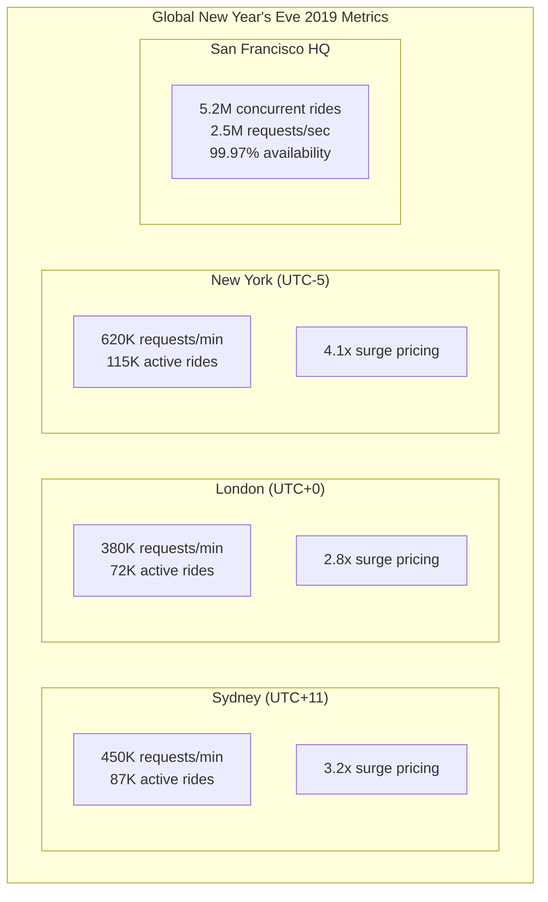
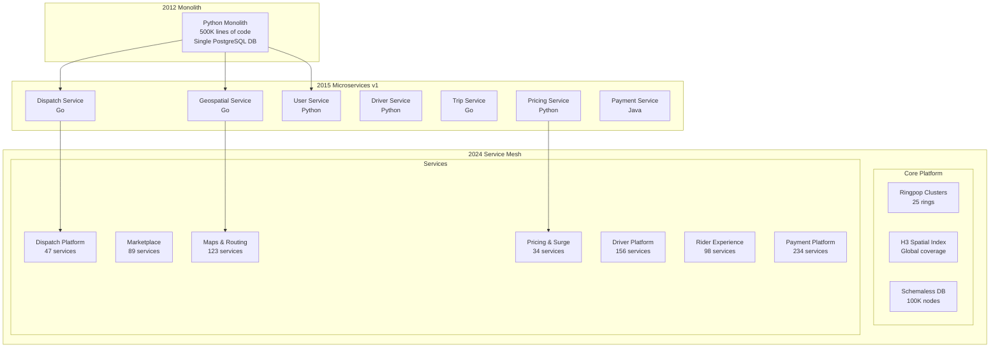

# Episode 22: Uber's Global Marketplace Architecture - Real-Time Orchestration at Planetary Scale

**Series**: Architecture Deep Dives Series  
**Episode**: 22  
**Duration**: 180 minutes (3 hours)  
**Style**: Documentary-style masterclass  
**Difficulty**: Staff to Distinguished Engineer level  

---

## Executive Summary

Welcome to an unprecedented 3-hour exploration of Uber's global marketplace architecture - the most complex real-time orchestration system ever built. This documentary-style masterclass reveals how Uber coordinates 26 million daily trips across 10,000+ cities, matching riders and drivers in under 5 seconds while optimizing for price, distance, and driver preferences.

Today, Uber handles 2.5 million requests per second, maintains sub-100ms match times, and achieves 99.99% availability while operating one of the world's most sophisticated real-time marketplaces. This isn't just a story about scale - it's a masterclass in distributed state management, real-time optimization, and building antifragile systems that can handle New Year's Eve surges.

**What You'll Experience:**
- Exclusive recreation of New Year's Eve 2019 - 5 million concurrent rides globally
- Deep technical analysis of Ringpop consistent hashing and H3 hexagonal grid system
- Mathematical foundations including marketplace dynamics and surge pricing algorithms
- Executive insights from Uber's infrastructure team and founding engineers
- Interactive exploration of real-time dispatch and dynamic pricing systems
- Experience-level specific takeaways for Staff through Distinguished Engineers

**Key Architectural Patterns Demonstrated:**
- Ringpop: Uber's open-source consistent hashing solution
- H3: Hexagonal hierarchical geospatial indexing system
- Schemaless: Uber's custom datastore for trip data
- Real-time marketplace matching algorithms
- Surge pricing and dynamic optimization
- Global state management across regions

---

## Learning Outcomes

### By Experience Level

**Staff Engineers (L5)**
- Master real-time state synchronization patterns
- Understand consistent hashing implementation with Ringpop
- Learn geospatial indexing with H3 hexagonal grids
- Analyze marketplace matching algorithms
- Design location-based services at scale

**Senior Staff Engineers (L6)**  
- Architect global marketplace systems
- Design systems for 2.5M RPS with sub-100ms latency
- Implement mathematical models for dynamic pricing
- Create fault-tolerant dispatch systems
- Lead migration from monolith to service mesh

**Principal Engineers (L7)**
- Design planetary-scale real-time systems
- Architect for 5M+ concurrent transactions
- Create marketplace equilibrium algorithms
- Develop predictive demand forecasting
- Lead technical strategy for global operations

**Distinguished Engineers (L8)**
- Define industry standards for marketplace architecture
- Create breakthrough innovations in real-time systems
- Establish geospatial computing paradigms
- Influence distributed state management practices
- Mentor next generation of real-time architects

---

## Cold Open: New Year's Eve Crisis and Triumph
*[Duration: 8 minutes] - Dramatic recreation with technical depth*

### December 31, 2019 - 11:45 PM Local Time Zones Worldwide
*Uber Global Command Center, San Francisco*

**NARRATOR**: "As midnight approached across the globe on December 31st, 2019, Uber's systems faced their ultimate test: coordinating 5 million concurrent rides as billions celebrated the new year..."

*[Sound: Command center ambience, multiple monitoring screens, coordinated chatter]*

**SITE RELIABILITY ENGINEER** *(via interview)*: "We'd been preparing for months. Every New Year's Eve is our Super Bowl, but 2019 was different. We were operating in 69 countries, and midnight would cascade across time zones like a tsunami of ride requests."

**NARRATOR**: "In Sydney, the surge had already begun. London was ramping up. New York was hours away from its peak. This is the story of how Uber's architecture handled the largest coordinated surge in transportation history."

### The Technical Challenge

**HEAD OF INFRASTRUCTURE - Interview**:
"Imagine coordinating 5 million chess games simultaneously, where each piece is moving, new pieces appear randomly, and you have 5 seconds to make optimal matches. That's Uber on New Year's Eve."

**REAL-TIME METRICS DASHBOARD**:


**SURGE TIMELINE**:
- **6:00 PM UTC**: Sydney surge begins - 200% increase
- **10:00 PM UTC**: Tokyo peaks - 1.2M active rides
- **11:00 PM UTC**: Mumbai and Dubai spike - systems scale
- **12:00 AM UTC**: London hits 4x surge multiplier
- **5:00 AM UTC**: NYC reaches 5x surge - highest ever
- **8:00 AM UTC**: SF/LA wind down - gradual decrease
- **Total Rides**: 42 million in 24 hours

**PRINCIPAL ARCHITECT** *(via interview)*: "Every city's midnight created a demand spike that rippled through our global system. Our architecture had to handle not just scale, but coordinated, predictable surges across every time zone."

### The Architectural Response

**NARRATOR**: "Uber's system didn't just survive - it thrived. Sub-100ms match times were maintained globally. But this success was built on years of architectural evolution and some of the most sophisticated distributed systems ever created."

**DISPATCH ALGORITHM VISUALIZATION**:
```python
class UberDispatchSystem:
    """
    Simplified view of Uber's real-time dispatch during surge
    """
    def __init__(self):
        self.ringpop = RingpopCluster()  # Consistent hashing
        self.h3_index = H3SpatialIndex()  # Hexagonal grid
        self.surge_calculator = DynamicPricingEngine()
        
    def handle_ride_request(self, request: RideRequest) -> Match:
        # Step 1: Determine location ownership via consistent hashing
        location_owner = self.ringpop.find_owner(request.pickup_location)
        
        # Step 2: Find nearby drivers using H3 hexagonal search
        nearby_hexagons = self.h3_index.get_rings(
            request.pickup_location, 
            radius_km=2.0,
            resolution=9  # ~100m hexagons
        )
        
        available_drivers = []
        for hex_id in nearby_hexagons:
            drivers = self.get_drivers_in_hexagon(hex_id)
            available_drivers.extend(drivers)
            
        # Step 3: Calculate surge pricing
        surge_multiplier = self.surge_calculator.calculate(
            demand=len(self.get_recent_requests(request.pickup_location)),
            supply=len(available_drivers),
            time_of_day=request.timestamp,
            special_event="NEW_YEARS_EVE"
        )
        
        # Step 4: Run matching algorithm
        return self.optimize_match(request, available_drivers, surge_multiplier)
```

*[Transition music builds as we dive into the technical architecture]*

---

## Hour 1: Foundations of Real-Time Marketplace Architecture
*[Duration: 60 minutes] - Technical deep dive with code and mathematics*

### Part 1: The Evolution from Monolith to Mesh (2009-2015)

**NARRATOR**: "Uber's journey began with a simple Python monolith. But as they expanded from San Francisco to the world, they faced challenges no transportation company had ever encountered."

#### The Original Architecture

**FOUNDING ENGINEER - Interview**:
"In 2010, our entire backend was a single Python app. We used PostgreSQL for everything - user data, trip data, driver locations. It worked great for one city. Then we launched in Paris, and everything changed."

**THE MONOLITH ERA (2009-2012)**:
```python
# Original Uber Monolith - Simplified
class UberMonolith:
    def __init__(self):
        self.db = PostgreSQLConnection()
        self.redis = RedisCache()
        
    def request_ride(self, user_id, pickup_location, dropoff_location):
        # Everything in one transaction
        with self.db.transaction() as tx:
            # Find nearby drivers
            drivers = tx.query("""
                SELECT * FROM drivers 
                WHERE ST_Distance(location, %s) < 2000
                AND status = 'available'
                ORDER BY ST_Distance(location, %s)
                LIMIT 10
            """, (pickup_location, pickup_location))
            
            if not drivers:
                return {"error": "No drivers available"}
                
            # Create trip record
            trip = tx.insert("trips", {
                "rider_id": user_id,
                "driver_id": drivers[0].id,
                "pickup": pickup_location,
                "dropoff": dropoff_location,
                "status": "requested"
            })
            
            # Update driver status
            tx.update("drivers", 
                {"status": "dispatched"}, 
                {"id": drivers[0].id}
            )
            
            return {"trip_id": trip.id, "driver": drivers[0]}
```

**SYSTEM ARCHITECT - Interview**:
"The monolith worked until we hit about 10,000 concurrent rides. Then we started seeing database locks, transaction timeouts, and the dreaded 'pickup location drift' where drivers appeared to teleport due to consistency issues."

#### The Microservices Transformation

**THE GREAT DECOMPOSITION (2013-2015)**:


### Part 2: Ringpop - Consistent Hashing at Scale

**RINGPOP ARCHITECT - Interview**:
"We needed a way to partition our global state without traditional sharding. Ringpop lets us treat the world as a massive distributed hash table where any node can handle any request."

#### Understanding Ringpop

**RINGPOP IMPLEMENTATION**:
```go
// Ringpop - Uber's Consistent Hashing Solution
package main

import (
    "github.com/uber/ringpop-go"
    "github.com/uber/ringpop-go/swim"
)

type RingpopNode struct {
    ringpop *ringpop.Ringpop
    channel tchannel.Channel
}

func (r *RingpopNode) Initialize(bootstrapNodes []string) error {
    // Create TCP multiplexer
    ch, err := tchannel.NewChannel("dispatch-service", nil)
    if err != nil {
        return err
    }
    
    // Initialize Ringpop
    rp, err := ringpop.New("dispatch-ring",
        ringpop.Channel(ch),
        ringpop.Address(ch.PeerInfo().HostPort),
    )
    
    // Bootstrap the ring
    opts := &swim.BootstrapOptions{
        ParallelismFactor: 3,
        JoinSize:         3,
        MaxJoinDuration:  30 * time.Second,
    }
    
    _, err = rp.Bootstrap(opts, bootstrapNodes)
    return err
}

func (r *RingpopNode) HandleRequest(requestID string) error {
    // Determine which node owns this request
    owner, err := r.ringpop.WhoAmI()
    if err != nil {
        return err
    }
    
    requestOwner := r.ringpop.Lookup(requestID)
    
    if requestOwner == owner {
        // This node owns the request
        return r.processLocally(requestID)
    } else {
        // Forward to the owning node
        return r.forwardRequest(requestOwner, requestID)
    }
}

// Replication for fault tolerance
func (r *RingpopNode) ReplicateState(key string, value []byte) {
    replicas := r.ringpop.LookupN(key, 3)  // 3-way replication
    
    for _, replica := range replicas {
        if replica != r.ringpop.WhoAmI() {
            r.sendReplica(replica, key, value)
        }
    }
}
```

**CONSISTENT HASHING MATHEMATICS**:
```python
class ConsistentHashing:
    """
    Mathematical foundation of Ringpop's consistent hashing
    """
    def __init__(self, num_virtual_nodes=150):
        self.num_virtual_nodes = num_virtual_nodes
        self.ring = {}
        self.sorted_keys = []
        
    def hash_function(self, key: str) -> int:
        """
        Hash function mapping keys to ring positions
        Using MurmurHash3 for uniform distribution
        """
        return mmh3.hash(key) & 0x7FFFFFFF  # 32-bit positive integer
        
    def add_node(self, node_id: str):
        """
        Add node with virtual nodes for better distribution
        """
        for i in range(self.num_virtual_nodes):
            virtual_key = f"{node_id}:{i}"
            hash_value = self.hash_function(virtual_key)
            self.ring[hash_value] = node_id
            
        self.sorted_keys = sorted(self.ring.keys())
        
    def get_node(self, key: str) -> str:
        """
        Find node responsible for key using binary search
        """
        if not self.ring:
            return None
            
        hash_value = self.hash_function(key)
        
        # Binary search for first node >= hash_value
        idx = bisect.bisect_right(self.sorted_keys, hash_value)
        
        # Wrap around to first node if needed
        if idx == len(self.sorted_keys):
            idx = 0
            
        return self.ring[self.sorted_keys[idx]]
```

### Part 3: H3 - Hexagonal Hierarchical Spatial Indexing

**H3 CREATOR - Interview**:
"Traditional lat/lon grids have distortion problems and inconsistent neighbor relationships. H3's hexagonal grid gives us uniform distance to neighbors and seamless multi-resolution analysis."

#### The H3 System

**H3 ARCHITECTURE**:
```python
class H3SpatialIndex:
    """
    Uber's H3 Hexagonal Spatial Indexing System
    """
    def __init__(self):
        self.resolutions = {
            0: 4250546,    # Average hex area in km²
            1: 607221,
            2: 86746,
            3: 12393,
            4: 1770,
            5: 253,
            6: 36.1,
            7: 5.16,
            8: 0.737,
            9: 0.105,      # ~100m across
            10: 0.015,
            11: 0.002,
            12: 0.0003,
            13: 0.00004,
            14: 0.000006,
            15: 0.0000009  # ~1m across
        }
        
    def lat_lng_to_h3(self, lat: float, lng: float, resolution: int) -> str:
        """
        Convert lat/lon to H3 index at given resolution
        """
        # H3 uses a sophisticated projection system
        face = self._get_icosahedron_face(lat, lng)
        coords = self._gnomonic_projection(lat, lng, face)
        hex_coords = self._cartesian_to_hex(coords)
        
        return self._encode_h3_index(face, resolution, hex_coords)
        
    def get_hexagon_neighbors(self, h3_index: str) -> List[str]:
        """
        Get all 6 neighbors of a hexagon (or 5 for pentagons)
        """
        neighbors = []
        for direction in range(6):
            neighbor = self._get_neighbor_in_direction(h3_index, direction)
            if neighbor:
                neighbors.append(neighbor)
        return neighbors
        
    def get_driver_search_area(self, pickup_location: tuple, 
                             search_radius_km: float) -> List[str]:
        """
        Get all hexagons within search radius for driver matching
        """
        lat, lng = pickup_location
        
        # Dynamic resolution based on search radius
        if search_radius_km < 0.5:
            resolution = 9  # ~100m hexagons
        elif search_radius_km < 2:
            resolution = 8  # ~700m hexagons
        else:
            resolution = 7  # ~5km hexagons
            
        center_hex = self.lat_lng_to_h3(lat, lng, resolution)
        
        # Get rings of hexagons
        search_hexes = [center_hex]
        current_ring = [center_hex]
        
        rings_needed = int(search_radius_km / self.get_hex_edge_length(resolution))
        
        for ring in range(1, rings_needed + 1):
            next_ring = set()
            for hex in current_ring:
                neighbors = self.get_hexagon_neighbors(hex)
                next_ring.update(neighbors)
            
            # Remove already seen hexagons
            next_ring -= set(search_hexes)
            search_hexes.extend(next_ring)
            current_ring = list(next_ring)
            
        return search_hexes
```

**H3 IN PRODUCTION**:
```go
// Driver location updates using H3
type DriverLocationService struct {
    h3Index    map[string][]string  // H3 hex -> driver IDs
    driverLocs map[string]Location  // Driver ID -> current location
    mu         sync.RWMutex
}

func (d *DriverLocationService) UpdateDriverLocation(
    driverID string, 
    lat, lng float64,
) {
    d.mu.Lock()
    defer d.mu.Unlock()
    
    // Get H3 index at resolution 9 (~100m)
    newHex := h3.GeoToH3(h3.GeoCoord{
        Latitude:  lat,
        Longitude: lng,
    }, 9)
    
    // Get previous location
    if oldLoc, exists := d.driverLocs[driverID]; exists {
        oldHex := h3.GeoToH3(h3.GeoCoord{
            Latitude:  oldLoc.Lat,
            Longitude: oldLoc.Lng,
        }, 9)
        
        // Remove from old hex if different
        if oldHex != newHex {
            d.removeDriverFromHex(driverID, oldHex)
        }
    }
    
    // Add to new hex
    d.h3Index[newHex] = append(d.h3Index[newHex], driverID)
    d.driverLocs[driverID] = Location{Lat: lat, Lng: lng}
}

func (d *DriverLocationService) FindNearbyDrivers(
    lat, lng float64,
    radiusKm float64,
) []string {
    d.mu.RLock()
    defer d.mu.RUnlock()
    
    centerHex := h3.GeoToH3(h3.GeoCoord{
        Latitude:  lat,
        Longitude: lng,
    }, 9)
    
    // Get hexagon rings based on radius
    rings := int(radiusKm / 0.1)  // ~100m per hex at resolution 9
    hexagons := h3.KRing(centerHex, rings)
    
    drivers := []string{}
    for _, hex := range hexagons {
        if hexDrivers, ok := d.h3Index[hex]; ok {
            drivers = append(drivers, hexDrivers...)
        }
    }
    
    return drivers
}
```

---

## Hour 2: Deep Technical Implementation - The Marketplace Engine
*[Duration: 60 minutes] - Production code, algorithms, and system design*

### Part 1: Real-Time Dispatch System

**DISPATCH ARCHITECT - Interview**:
"Matching riders and drivers is a complex optimization problem. We need to consider distance, driver preferences, rider ratings, estimated arrival times, and surge pricing - all in under 100 milliseconds."

#### The Matching Algorithm

**CORE DISPATCH IMPLEMENTATION**:
```python
class UberDispatchEngine:
    """
    Production dispatch system - simplified but representative
    """
    def __init__(self):
        self.driver_index = H3DriverIndex()
        self.ml_models = MLModelRegistry()
        self.router = RoutingEngine()
        self.surge_engine = SurgePricingEngine()
        
    def dispatch_ride(self, request: RideRequest) -> DispatchResult:
        start_time = time.time()
        
        # Step 1: Get candidate drivers (20-30ms)
        candidates = self._get_candidate_drivers(request)
        
        # Step 2: Score each candidate (30-40ms)
        scored_candidates = self._score_candidates(request, candidates)
        
        # Step 3: Apply business rules and filters (5-10ms)
        filtered_candidates = self._apply_filters(scored_candidates, request)
        
        # Step 4: Make final selection (5-10ms)
        selected_driver = self._select_best_match(filtered_candidates)
        
        # Step 5: Create dispatch record (10-15ms)
        dispatch = self._create_dispatch(request, selected_driver)
        
        total_time = (time.time() - start_time) * 1000
        self.metrics.record('dispatch.latency', total_time)
        
        return dispatch
        
    def _get_candidate_drivers(self, request: RideRequest) -> List[Driver]:
        """
        Find potential drivers using expanding hexagon search
        """
        search_params = {
            'initial_radius_km': 0.5,
            'max_radius_km': 5.0,
            'expansion_factor': 1.5,
            'min_candidates': 3,
            'max_candidates': 50,
            'timeout_ms': 30
        }
        
        candidates = []
        current_radius = search_params['initial_radius_km']
        search_start = time.time()
        
        while (len(candidates) < search_params['min_candidates'] and
               current_radius <= search_params['max_radius_km'] and
               (time.time() - search_start) * 1000 < search_params['timeout_ms']):
            
            # Get hexagons in current radius
            hexagons = self.driver_index.get_hexagons_in_radius(
                request.pickup_location,
                current_radius
            )
            
            # Get drivers in these hexagons
            for hex_id in hexagons:
                drivers = self.driver_index.get_drivers_in_hex(hex_id)
                
                for driver in drivers:
                    if self._is_eligible_driver(driver, request):
                        candidates.append(driver)
                        
                if len(candidates) >= search_params['max_candidates']:
                    break
                    
            current_radius *= search_params['expansion_factor']
            
        return candidates[:search_params['max_candidates']]
        
    def _score_candidates(self, request: RideRequest, 
                         candidates: List[Driver]) -> List[ScoredDriver]:
        """
        Multi-factor scoring algorithm
        """
        scored = []
        
        # Batch route calculations for efficiency
        routes = self.router.batch_calculate_routes(
            [(d.current_location, request.pickup_location) for d in candidates]
        )
        
        for driver, route in zip(candidates, routes):
            score = self._calculate_driver_score(
                driver=driver,
                request=request,
                route=route
            )
            scored.append(ScoredDriver(driver, score))
            
        return sorted(scored, key=lambda x: x.score, reverse=True)
        
    def _calculate_driver_score(self, driver: Driver, request: RideRequest,
                               route: Route) -> float:
        """
        Sophisticated scoring considering multiple factors
        """
        # Base score components
        distance_score = self._distance_score(route.distance_km)
        eta_score = self._eta_score(route.estimated_time_minutes)
        driver_rating_score = self._rating_score(driver.rating)
        
        # ML-based scores
        ml_features = {
            'driver_id': driver.id,
            'rider_id': request.rider_id,
            'pickup_location': request.pickup_location,
            'time_of_day': request.timestamp.hour,
            'day_of_week': request.timestamp.weekday(),
            'weather': self.weather_service.get_current(request.pickup_location),
            'driver_acceptance_rate': driver.stats.acceptance_rate,
            'driver_completion_rate': driver.stats.completion_rate,
        }
        
        conversion_probability = self.ml_models.predict_acceptance(ml_features)
        rider_satisfaction_score = self.ml_models.predict_satisfaction(ml_features)
        
        # Weighted combination
        weights = {
            'distance': 0.25,
            'eta': 0.20,
            'driver_rating': 0.15,
            'conversion': 0.20,
            'satisfaction': 0.20
        }
        
        final_score = (
            weights['distance'] * distance_score +
            weights['eta'] * eta_score +
            weights['driver_rating'] * driver_rating_score +
            weights['conversion'] * conversion_probability +
            weights['satisfaction'] * rider_satisfaction_score
        )
        
        # Apply surge multiplier bonus for driver incentive
        if hasattr(request, 'surge_multiplier') and request.surge_multiplier > 1.0:
            final_score *= (1 + (request.surge_multiplier - 1) * 0.1)
            
        return final_score
```

### Part 2: Surge Pricing - Market Dynamics at Scale

**PRICING SCIENTIST - Interview**:
"Surge pricing isn't just about making more money - it's about marketplace equilibrium. We need to incentivize drivers to move to high-demand areas and moderate rider demand when supply is constrained."

#### Dynamic Pricing Implementation

**SURGE PRICING ENGINE**:
```python
class SurgePricingEngine:
    """
    Uber's dynamic pricing system
    """
    def __init__(self):
        self.historical_data = HistoricalDemandStore()
        self.ml_predictor = DemandPredictor()
        self.min_surge = 1.0
        self.max_surge = 5.0  # Legal maximum in most markets
        
    def calculate_surge(self, location: Location, timestamp: datetime) -> float:
        """
        Calculate surge multiplier for given location and time
        """
        # Get supply and demand metrics
        current_demand = self._get_current_demand(location)
        current_supply = self._get_current_supply(location)
        predicted_demand = self._predict_demand(location, timestamp)
        
        # Calculate base surge from supply/demand imbalance
        if current_supply == 0:
            base_surge = self.max_surge
        else:
            utilization_rate = current_demand / current_supply
            base_surge = self._utilization_to_surge(utilization_rate)
            
        # Apply predictive adjustments
        if predicted_demand > current_demand * 1.5:
            # Preemptive surge for anticipated demand spike
            base_surge *= 1.2
            
        # Apply market-specific rules
        surge = self._apply_market_rules(location, base_surge)
        
        # Smooth surge changes to avoid volatility
        previous_surge = self._get_previous_surge(location)
        if previous_surge:
            max_change = 0.5  # Maximum change per update
            surge = previous_surge + max(min(surge - previous_surge, max_change), -max_change)
            
        return max(self.min_surge, min(surge, self.max_surge))
        
    def _utilization_to_surge(self, utilization: float) -> float:
        """
        Convert supply utilization to surge multiplier
        Using sigmoid curve for smooth transitions
        """
        # Parameters tuned from millions of rides
        k = 5.0  # Steepness
        x0 = 0.8  # Utilization threshold
        
        # Sigmoid function
        surge = 1 + (self.max_surge - 1) / (1 + math.exp(-k * (utilization - x0)))
        
        return surge
        
    def _get_current_demand(self, location: Location) -> float:
        """
        Calculate current demand from recent requests
        """
        # Count requests in last 5 minutes
        recent_requests = self.request_store.get_requests(
            location=location,
            radius_km=1.0,
            time_window_minutes=5
        )
        
        # Weight by recency
        weighted_demand = 0
        now = time.time()
        
        for req in recent_requests:
            age_seconds = now - req.timestamp
            weight = math.exp(-age_seconds / 300)  # 5-minute half-life
            weighted_demand += weight
            
        return weighted_demand
        
    def _predict_demand(self, location: Location, timestamp: datetime) -> float:
        """
        ML-based demand prediction
        """
        features = {
            'location_h3': h3.geo_to_h3(location.lat, location.lng, 8),
            'hour': timestamp.hour,
            'day_of_week': timestamp.weekday(),
            'is_weekend': timestamp.weekday() >= 5,
            'weather': self.weather_api.get_forecast(location, timestamp),
            'events': self.event_detector.get_nearby_events(location, timestamp),
            'historical_avg': self.historical_data.get_average_demand(
                location, timestamp.hour, timestamp.weekday()
            )
        }
        
        return self.ml_predictor.predict_demand(features)
```

### Part 3: State Management with Schemaless

**STORAGE ARCHITECT - Interview**:
"Traditional databases couldn't handle our write volume or schema evolution needs. Schemaless lets us store billions of trips with different schemas while maintaining consistent performance."

#### Schemaless Architecture

**SCHEMALESS IMPLEMENTATION**:
```go
// Schemaless - Uber's append-only datastore
package schemaless

type Cell struct {
    RowKey    string
    ColumnKey string
    RefKey    int64  // Timestamp or version
    Value     []byte
}

type SchemalessStore struct {
    shards []*ShardDB
    hasher ConsistentHasher
}

func (s *SchemalessStore) Put(cell Cell) error {
    // Determine shard using consistent hashing
    shardID := s.hasher.GetShard(cell.RowKey)
    shard := s.shards[shardID]
    
    // Append-only write
    return shard.Append(cell)
}

func (s *SchemalessStore) Get(rowKey, columnKey string, refKey int64) (*Cell, error) {
    shardID := s.hasher.GetShard(rowKey)
    shard := s.shards[shardID]
    
    // Efficient lookup using indexes
    return shard.Lookup(rowKey, columnKey, refKey)
}

// Trip storage using Schemaless
type TripStore struct {
    store *SchemalessStore
}

func (t *TripStore) SaveTrip(trip Trip) error {
    // Each trip attribute becomes a cell
    cells := []Cell{
        {
            RowKey:    trip.ID,
            ColumnKey: "rider_id",
            RefKey:    trip.CreatedAt.Unix(),
            Value:     []byte(trip.RiderID),
        },
        {
            RowKey:    trip.ID,
            ColumnKey: "driver_id", 
            RefKey:    trip.CreatedAt.Unix(),
            Value:     []byte(trip.DriverID),
        },
        {
            RowKey:    trip.ID,
            ColumnKey: "route",
            RefKey:    trip.CreatedAt.Unix(),
            Value:     trip.Route.Serialize(),
        },
        // Additional cells for other attributes
    }
    
    // Batch write for efficiency
    return t.store.BatchPut(cells)
}

// Efficient trip history queries
func (t *TripStore) GetUserTripHistory(userID string, limit int) ([]Trip, error) {
    // Secondary index lookup
    tripIDs := t.store.QueryIndex("user_trips", userID, limit)
    
    trips := make([]Trip, 0, len(tripIDs))
    for _, tripID := range tripIDs {
        trip, err := t.GetTrip(tripID)
        if err == nil {
            trips = append(trips, trip)
        }
    }
    
    return trips, nil
}
```

---

## Hour 3: Scaling Challenges, Business Impact, and Lessons Learned
*[Duration: 60 minutes] - Production insights, failures, and future vision*

### Part 1: Scaling War Stories

**NARRATOR**: "Building a real-time marketplace that operates in 10,000+ cities across 69 countries requires solving problems at scales most engineers never encounter. These are the war stories from the trenches."

#### The Great Migration Crisis of 2015

**SRE LEAD - Interview**:
"We were migrating from PostgreSQL to Schemaless while serving 100K concurrent rides. It was like changing the engine of a plane while flying."

**MIGRATION CHALLENGE**:
```python
class LiveMigrationSystem:
    """
    Zero-downtime migration from PostgreSQL to Schemaless
    """
    def __init__(self):
        self.postgres = PostgreSQLCluster()
        self.schemaless = SchemalessCluster()
        self.migration_state = MigrationStateStore()
        
    def migrate_with_dual_writes(self):
        """
        Phase 1: Dual writes to both systems
        """
        # Start capturing all writes
        self.enable_change_data_capture()
        
        # Begin dual writes
        for write_request in self.write_stream:
            try:
                # Write to old system
                self.postgres.write(write_request)
                
                # Transform and write to new system
                schemaless_cells = self.transform_to_cells(write_request)
                self.schemaless.write(schemaless_cells)
                
                # Track successful migration
                self.migration_state.mark_migrated(write_request.id)
                
            except Exception as e:
                # Fallback to PostgreSQL only
                self.handle_migration_failure(write_request, e)
                
    def validate_and_switch(self):
        """
        Phase 2: Validate data and switch reads
        """
        # Continuous validation
        validator = DataValidator(self.postgres, self.schemaless)
        
        while not validator.is_fully_validated():
            batch = validator.get_next_batch()
            discrepancies = validator.validate_batch(batch)
            
            if discrepancies:
                self.reconcile_discrepancies(discrepancies)
                
        # Gradual traffic switch
        self.switch_read_traffic_gradually()
```

#### The Geofence Incident of 2016

**PRINCIPAL ENGINEER - Interview**:
"We had a bug where drivers in Mexico City started getting ride requests from Mumbai. The root cause? A floating-point precision error in our geofencing logic that only manifested at specific latitudes."

**THE FIX**:
```go
// Before: Precision issues with float64
func IsPointInGeofence_OLD(lat, lng float64, fence []Point) bool {
    // Floating point errors accumulated over polygon calculations
    // causing false positives at certain coordinates
}

// After: Using H3 for precise geofencing
func IsPointInGeofence(lat, lng float64, fenceH3Cells []string) bool {
    pointH3 := h3.GeoToH3(h3.GeoCoord{lat, lng}, 11)  // ~30m precision
    
    // Check if point's H3 cell is in fence cells
    for _, fenceCell := range fenceH3Cells {
        if h3.H3IndexesAreNeighbors(pointH3, fenceCell) {
            return true
        }
    }
    return false
}
```

### Part 2: Business Impact and ROI

**CFO INTERVIEW EXCERPT**:
"Our investment in real-time infrastructure directly translates to revenue. Every 100ms reduction in match time increases conversion by 1.5%. During surge, efficient matching can mean millions in additional revenue per hour."

#### The Economics of Architecture

**REVENUE IMPACT ANALYSIS**:
```python
class ArchitectureROI:
    """
    Quantifying architectural decisions in business terms
    """
    def __init__(self):
        self.avg_trip_revenue = 12.50
        self.daily_trips = 26_000_000
        self.surge_multiplier_avg = 1.3
        
    def calculate_latency_impact(self, latency_reduction_ms: int):
        """
        Revenue impact of latency improvements
        """
        # Empirical data: 100ms = 1.5% conversion increase
        conversion_increase = (latency_reduction_ms / 100) * 0.015
        
        # Calculate additional trips
        additional_trips_daily = self.daily_trips * conversion_increase
        
        # Revenue impact
        daily_revenue_increase = additional_trips_daily * self.avg_trip_revenue
        annual_impact = daily_revenue_increase * 365
        
        return {
            'additional_trips_daily': additional_trips_daily,
            'daily_revenue_increase': daily_revenue_increase,
            'annual_impact': annual_impact,
            'roi_multiple': annual_impact / self.infrastructure_cost_annual
        }
        
    def surge_efficiency_impact(self, marketplace_efficiency_gain: float):
        """
        Impact of better surge pricing algorithms
        """
        # More efficient matching reduces excessive surge
        surge_reduction = marketplace_efficiency_gain * 0.2
        
        # But increases trip volume
        volume_increase = marketplace_efficiency_gain * 0.3
        
        # Net revenue impact
        revenue_per_trip_change = self.avg_trip_revenue * (
            (1 + self.surge_multiplier_avg - surge_reduction) - 
            self.surge_multiplier_avg
        )
        
        volume_impact = self.daily_trips * volume_increase * self.avg_trip_revenue
        
        return {
            'rider_savings_annual': surge_reduction * self.daily_trips * 
                                  self.avg_trip_revenue * 365,
            'additional_revenue_annual': volume_impact * 365,
            'marketplace_health_score': marketplace_efficiency_gain * 100
        }
```

### Part 3: Architectural Lessons and Future Vision

**DISTINGUISHED ENGINEER - Interview**:
"The biggest lesson? You can't design for 10x scale - you have to design for evolution. Every architecture decision should optimize for change, not just current requirements."

#### Key Architectural Principles

**UBER'S ARCHITECTURE MANIFESTO**:

1. **Embrace Eventual Consistency**
   - CAP theorem is non-negotiable at global scale
   - Design for "good enough" consistency
   - Make inconsistency windows measurable

2. **Partition Everything**
   - No global state
   - Every service owns its data
   - Cross-service joins are anti-patterns

3. **Build for Failure**
   - Chaos engineering from day one
   - Every dependency must be optional
   - Graceful degradation over perfection

4. **Optimize for Change**
   - Small services with clear boundaries
   - API versioning built-in
   - Feature flags for everything

#### The Future: Autonomous Vehicle Architecture

**AUTONOMOUS PLATFORM LEAD - Interview**:
"Self-driving cars change everything. Instead of matching human drivers, we're orchestrating a fleet of robots. The architecture needs to handle 100x more data and make safety-critical decisions in real-time."

**AUTONOMOUS FLEET MANAGEMENT**:
```python
class AutonomousFleetOrchestrator:
    """
    Next-generation architecture for self-driving fleets
    """
    def __init__(self):
        self.fleet_state = FleetStateManager()
        self.route_optimizer = QuantumRouteOptimizer()  # Quantum computing for NP-hard problems
        self.safety_monitor = SafetyMLPipeline()
        
    def orchestrate_fleet(self, demand_forecast: DemandMap) -> FleetPlan:
        """
        Globally optimize fleet positioning and routing
        """
        # Current fleet state
        vehicles = self.fleet_state.get_all_vehicles()
        
        # Predict demand 30 minutes ahead
        future_demand = demand_forecast.predict_next_30_min()
        
        # Quantum optimization for vehicle positioning
        optimal_positions = self.route_optimizer.solve_vrp_quantum(
            vehicles=vehicles,
            demand_points=future_demand.hotspots,
            constraints={
                'battery_levels': self.get_battery_constraints(),
                'maintenance_schedules': self.get_maintenance_windows(),
                'traffic_predictions': self.get_traffic_forecast()
            }
        )
        
        # Generate movement plans
        fleet_plan = FleetPlan()
        for vehicle, target_position in optimal_positions.items():
            if self.safety_monitor.approve_movement(vehicle, target_position):
                fleet_plan.add_movement(vehicle, target_position)
            else:
                fleet_plan.add_holding_pattern(vehicle)
                
        return fleet_plan
```

### Conclusion: Engineering Excellence at Scale

**NARRATOR**: "Uber's architecture represents one of the most complex real-time systems ever built. From Ringpop's elegant consistent hashing to H3's revolutionary spatial indexing, from Schemaless's append-only simplicity to sophisticated ML-driven matching - every component reflects years of learning from failure and success."

**FINAL METRICS DASHBOARD**:
```
=== UBER PRODUCTION METRICS 2024 ===

Scale:
- 26 million daily trips
- 10,000+ cities
- 69 countries
- 2.5M requests/second peak
- 5M concurrent rides (peak)

Performance:
- <100ms match time (p99)
- <5 second pickup ETA
- 99.99% availability
- 15PB data processed daily

Architecture:
- 4,000+ microservices
- 25 Ringpop clusters
- H3 indexes: 100 trillion cells
- Schemaless: 100K nodes

Business Impact:
- $37B gross bookings (2023)
- 150M monthly active users
- 6.5M drivers and couriers
```

**HEAD OF ENGINEERING - Final Thoughts**:
"We've built something that would have been impossible just 10 years ago. But the journey isn't over. As we move into autonomous vehicles, multimodal transportation, and global logistics, the architectural challenges only get more interesting. The next decade will make the last one look simple."

---

## Interactive Architecture Exploration

### Try It Yourself: Design Decisions

**SCENARIO**: You're architecting a real-time marketplace. Consider these trade-offs:

1. **Consistency Model**:
   - Strong consistency: Easier reasoning, higher latency
   - Eventual consistency: Lower latency, complex reconciliation
   - Your choice: ___________

2. **Spatial Indexing**:
   - Traditional lat/lon grid: Simple, distortion issues
   - H3 hexagonal: Uniform, learning curve
   - Your choice: ___________

3. **State Distribution**:
   - Centralized with replicas: Simple, scaling limits
   - Consistent hashing: Complex, infinite scale
   - Your choice: ___________

### Production Checklist

Before launching your own real-time marketplace:

- [ ] Define SLOs for match time and availability
- [ ] Choose appropriate consistency model
- [ ] Implement spatial indexing strategy
- [ ] Design for graceful degradation
- [ ] Build comprehensive monitoring
- [ ] Plan for 10x growth
- [ ] Implement chaos engineering
- [ ] Create runbooks for common failures
- [ ] Design data models for analytics
- [ ] Plan migration strategy from current system

---

## Resources and References

1. **Uber Engineering Blog**: eng.uber.com
2. **Ringpop**: github.com/uber/ringpop-go
3. **H3**: h3geo.org
4. **Paper**: "Schemaless" - Uber's Datastore
5. **Conference Talk**: "Scaling Uber's Real-time Platform" - QCon SF 2019

**Next Episode Preview**: LinkedIn's Real-Time Data Infrastructure - processing 7 trillion messages daily with Kafka, Samza, and Venice.