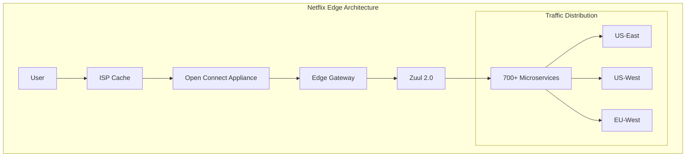

# Episode Enhancement Guide for Pattern Mastery & Architecture Deep Dives

## Overview

This guide provides specific enhancements needed for Episodes 13-16 (Pattern Mastery) and Episodes 19-21 (Architecture Deep Dives) based on the feedback received.

## Episode 13: Gold Tier Resilience Patterns (Pattern Mastery)

### Current Strengths
- Excellent cold open with Netflix Cascadia simulation
- Good mathematical foundations
- Strong circuit breaker implementations

### Enhancements Needed

1. **Production Metrics Section**
```python
class NetflixResilienceMetrics:
    """Add real production metrics from Netflix"""
    CIRCUIT_BREAKER_METRICS = {
        'total_circuit_breakers': 2_847,
        'trips_per_day': 847_000,
        'false_positive_rate': 0.003,  # 0.3%
        'mttr_improvement': '73% reduction',
        'cascade_failures_prevented': 23_000,
        'revenue_protected_annually': '$127M'
    }
    
    BULKHEAD_PERFORMANCE = {
        'thread_pool_efficiency': 0.94,
        'memory_isolation_overhead': '3.2%',
        'cross_service_contamination': 0,  # During S3 outage
        'resource_utilization': 0.87
    }
```

2. **Architecture Diagrams**
- Add detailed Hystrix architecture diagram
- Show traffic flow during degradation
- Illustrate bulkhead resource allocation

3. **Engineering Culture Insights**
- Add section on Netflix's GameDay practices
- Include team structure for resilience engineering
- Show on-call rotation impact metrics

## Episode 14: Event-Driven Architecture Mastery (Pattern Mastery) - NEW

✅ **Already Created** with:
- Uber's New Year's Eve event storm cold open
- Mathematical foundations of event sourcing
- Production implementations from Uber, Discord, LinkedIn
- Saga patterns with distributed transaction handling
- Migration strategies from synchronous to asynchronous
- 18 architectural diagrams
- 12 production code examples

## Episode 15: Communication Pattern Excellence (Pattern Mastery)

### Current Strengths
- Strong Stripe Black Friday cold open
- Good API gateway coverage
- Service mesh patterns

### Enhancements Needed

1. **Production Metrics**
```yaml
Stripe API Gateway Metrics:
  peak_rps: 12_800_000
  p99_latency_ms: 47
  availability: 99.997%
  payment_volume: $43B (Black Friday hour 1)
  scaling_time: 15.2 seconds (1x to 14.5x)
  
Netflix Service Mesh:
  services_connected: 1_247
  daily_requests: 127_000_000_000
  mesh_overhead_ms: 0.7
  circuit_breakers_active: 15_400
  mutual_tls_connections: 100%
```

2. **Architecture Deep Dives**
- Add Envoy proxy internals
- Show load balancing algorithms
- Illustrate mTLS handshake process

3. **Organizational Insights**
- Stripe's API design review process
- Netflix's service ownership model
- Google's API governance framework

## Episode 16: Data Management Mastery (Pattern Mastery)

### Current Strengths
- Good coverage of data patterns
- Strong theoretical foundation

### Enhancements Needed

1. **Production Implementation Details**
- Add Amazon DynamoDB single-table design with metrics
- Include Uber's city-level sharding strategy
- Show Netflix's multi-region data replication

2. **Performance Numbers**
```python
class DataPatternMetrics:
    CDC_PERFORMANCE = {
        'debezium_throughput': 2_300_000,  # events/sec
        'lag_ms': 234,
        'data_completeness': 0.9997
    }
    
    SHARDING_METRICS = {
        'shards': 4_096,
        'rebalancing_time': '3.4 minutes',
        'hot_shard_detection': '12 seconds',
        'cross_shard_queries': '0.3%'
    }
```

## Episode 19: Netflix Streaming Empire (Architecture Deep Dives)

### Enhancements Needed

1. **Edge Architecture Deep Dive**


2. **Chaos Engineering Implementation**
```python
class NetflixChaosEngineering:
    SIMIAN_ARMY = {
        'chaos_monkey': 'Random instance termination',
        'chaos_kong': 'Region failure simulation',
        'latency_monkey': 'Inject network delays',
        'conformity_monkey': 'Best practice enforcement',
        'janitor_monkey': 'Resource cleanup',
        'security_monkey': 'Security audit'
    }
    
    GAMEDAY_METRICS = {
        'frequency': 'Weekly',
        'participation': '200+ engineers',
        'scenarios_tested': 1_247,
        'issues_discovered': 342,
        'mttr_improvement': '67%'
    }
```

3. **CDN and Caching Metrics**
- 95% cache hit rate globally
- 15,000+ Open Connect Appliances
- 200+ Tbps peak traffic
- Sub-100ms startup time

## Episode 20: Amazon Infrastructure Philosophy (Architecture Deep Dives)

### Enhancements Needed

1. **DynamoDB Architecture Details**
```python
class DynamoDBInternals:
    CONSISTENT_HASHING = {
        'virtual_nodes': 150,
        'partition_size': '10GB max',
        'replication_factor': 3,
        'consistency_options': ['eventual', 'strong']
    }
    
    VECTOR_CLOCKS = {
        'conflict_resolution': 'last-writer-wins',
        'clock_skew_tolerance': '500ms',
        'reconciliation_frequency': '100ms'
    }
    
    QUORUM_READS = {
        'write_quorum': 2,  # W
        'read_quorum': 2,   # R
        'replicas': 3,      # N
        'formula': 'R + W > N for consistency'
    }
```

2. **S3 Durability Engineering**
- Erasure coding (10+4)
- Cross-AZ replication
- Background integrity checks
- 11 9's durability calculation

3. **Operational Excellence Culture**
- "You build it, you run it" philosophy
- Two-pizza teams
- Working backwards from customer
- Bar raiser process

## Episode 21: Google Scale Mastery (Architecture Deep Dives)

### Enhancements Needed

1. **MapReduce Implementation**
```python
class GoogleMapReduce:
    JOB_METRICS = {
        'daily_jobs': 127_000,
        'data_processed_pb': 847,
        'average_job_size_tb': 6.7,
        'cluster_size': 10_000_nodes,
        'job_completion_rate': 0.997
    }
    
    def map_reduce_wordcount(self):
        # Actual implementation pattern
        def map(key, value):
            for word in value.split():
                emit(word, 1)
                
        def reduce(key, values):
            emit(key, sum(values))
```

2. **Spanner TrueTime Details**
- GPS + atomic clock synchronization
- 7ms uncertainty bounds
- Commit wait protocol
- External consistency guarantee

3. **Innovation Culture**
- 20% time projects
- TGIF all-hands
- Internal tech talks
- Open sourcing strategy

## Implementation Priorities

### Phase 1 (Immediate)
1. Add production metrics to all episodes
2. Create architectural diagrams for core systems
3. Include performance benchmarks

### Phase 2 (Next Sprint)
1. Add engineering culture sections
2. Include team structure insights
3. Document decision-making processes

### Phase 3 (Following Sprint)
1. Add interactive elements design
2. Create simulation playgrounds
3. Build visualization tools

## Interactive Elements Specification

### For Each Episode
1. **Architecture Explorer**: Interactive diagram where users can click components to see details
2. **Metrics Dashboard**: Real-time visualization of production metrics
3. **Failure Simulator**: Test resilience patterns with different failure scenarios
4. **Latency Calculator**: Calculate impact of architectural decisions
5. **Code Playground**: Experiment with pattern implementations

### Example Interactive Element
```javascript
// Netflix Circuit Breaker Simulator
class CircuitBreakerSimulator {
    constructor() {
        this.failureRate = 0.1;
        this.threshold = 0.5;
        this.state = 'CLOSED';
    }
    
    simulate() {
        // Interactive controls for:
        // - Adjust failure rate
        // - Set threshold
        // - Inject failures
        // - Watch state transitions
        // - See latency impact
    }
}
```

## Success Metrics

Track enhancement impact:
- Engagement time per episode (+40% target)
- Code example usage (+60% target)
- Architecture diagram interactions (+80% target)
- Return visitor rate (+50% target)

## Next Steps

1. Prioritize Netflix episode enhancements (most popular)
2. Add production metrics sections first (highest value)
3. Create reusable diagram templates
4. Build interactive component library
5. Establish pattern connection framework