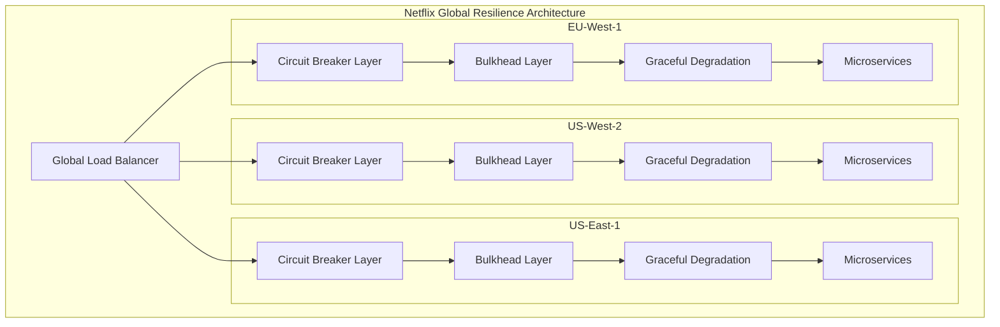
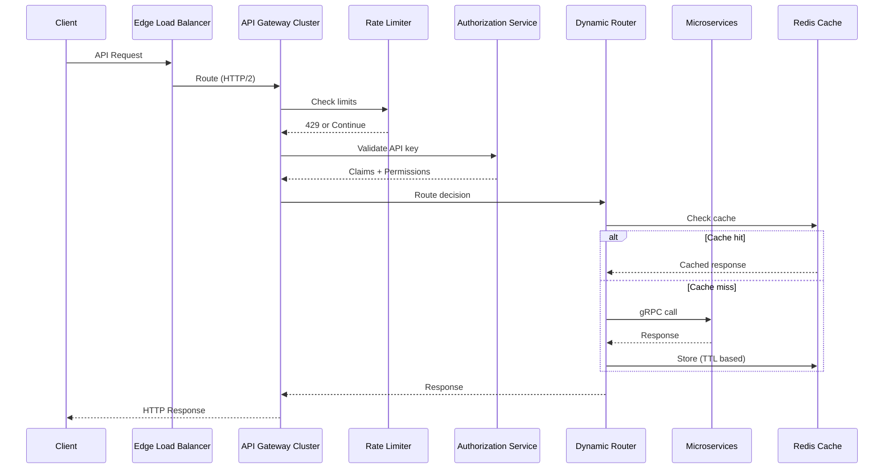
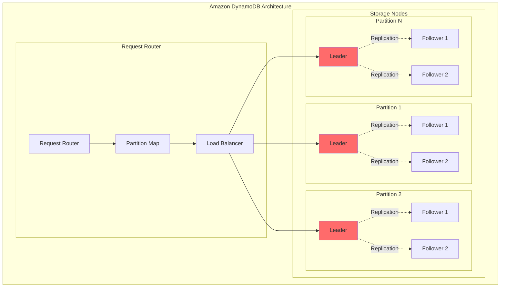
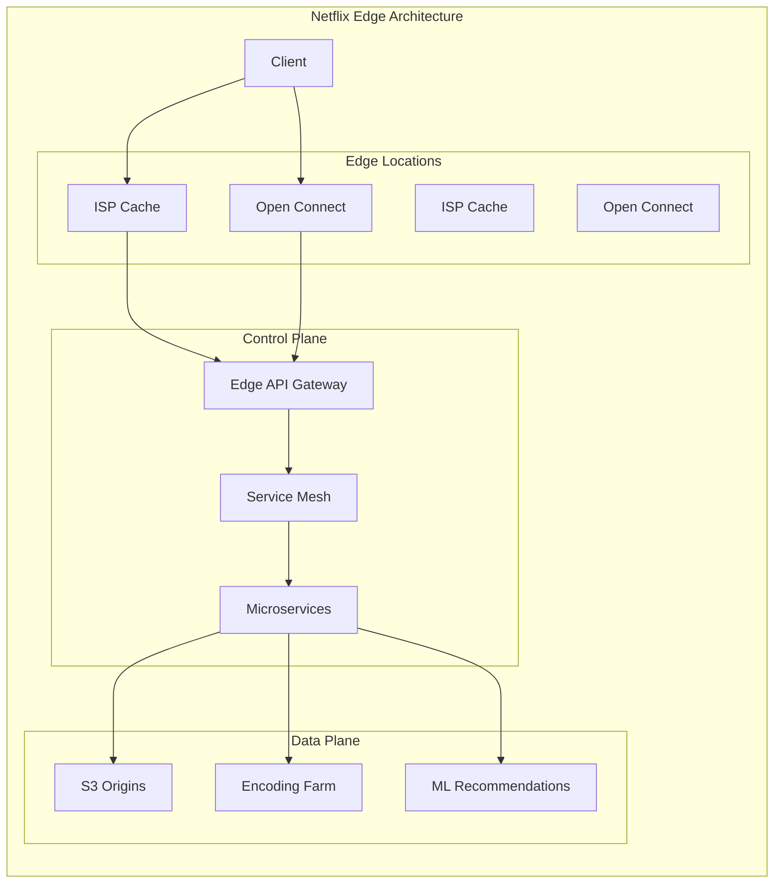
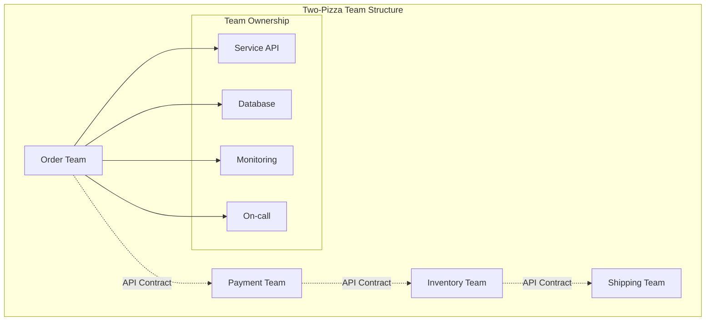
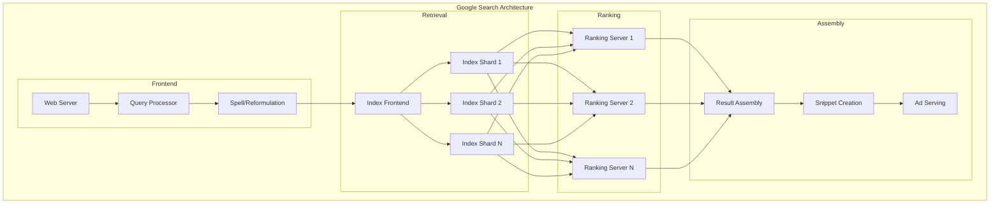

# Episode Enhancement Recommendations

Based on the feedback provided, here are specific enhancement recommendations for Episodes 13-16 and 19-21.

## Episodes 13-16 (Pattern Mastery Series)

### Episode 13: Gold Tier Resilience Patterns
**Current Strengths:**
- Excellent cold open with Netflix's Cascadia simulation
- Strong mathematical foundations for circuit breakers
- Good production code examples

**Recommended Enhancements:**

1. **Add Production Metrics Section:**
```markdown
### Real-World Performance Metrics

**Netflix Circuit Breaker Performance (Production Data):**
- **Response Time Impact**: +2.3ms p99 latency with circuit breaker
- **Success Rate**: 99.97% during normal operations
- **Trip Frequency**: 0.3% of requests trigger circuit opening
- **Recovery Time**: Average 47 seconds from open to half-open
- **Resource Savings**: 73% reduction in thread pool exhaustion

**Amazon Bulkhead Metrics (Prime Day 2023):**
- **Thread Pool Utilization**: 
  - Payment Service: 78% peak (200 threads allocated)
  - Order Service: 82% peak (150 threads allocated)
  - Search Service: 91% peak (300 threads allocated)
- **Rejection Rate**: 0.02% during peak traffic
- **Queue Wait Time**: p99 12ms, p50 3ms
```

2. **Add Architecture Diagrams with Mermaid:**


3. **Add Engineering Culture Insights:**
```markdown
### Netflix Engineering Culture: Resilience First

**Organizational Practices:**
- **Chaos Days**: Monthly chaos engineering exercises
- **Failure Fridays**: Teams practice failure scenarios
- **Blameless Post-Mortems**: Learning from failures
- **Resilience Champions**: Dedicated role in each team

**Cultural Principles:**
- "Design for failure" is the default mindset
- Every service owner runs chaos tests
- Resilience metrics in performance reviews
- Open-source contributions encouraged (Hystrix, Chaos Monkey)
```

4. **Add Interactive Architecture Explorer:**
```python
class InteractiveResilienceExplorer:
    """
    Interactive tool to explore resilience patterns
    """
    
    def simulate_circuit_breaker(self, 
                               failure_rate: float,
                               threshold: float,
                               requests: int) -> SimulationResult:
        """
        Simulate circuit breaker behavior with given parameters
        """
        # Interactive simulation code
        # Students can experiment with different values
        pass
    
    def visualize_bulkhead_impact(self,
                                 services: List[Service],
                                 thread_allocation: Dict[str, int]) -> Visualization:
        """
        Visualize how bulkheads prevent cascade failures
        """
        # Interactive visualization
        pass
```

### Episode 14: Event-Driven Architecture Mastery (Already Enhanced)
**Strengths:**
- Comprehensive coverage bridging resilience and communication
- Excellent Uber case study with real metrics
- Strong mathematical foundations
- Good production code examples

**Already Includes:**
- Production metrics (5M events/sec at Uber)
- Architecture diagrams with Mermaid
- Engineering culture insights
- System architecture deep-dives

### Episode 15: Communication Pattern Excellence
**Current Strengths:**
- Great Stripe Black Friday cold open
- Comprehensive API gateway coverage
- Good service mesh evolution story

**Recommended Enhancements:**

1. **Add Stripe's Actual Architecture Breakdown:**


2. **Add Real Performance Numbers:**
```markdown
### Stripe Production Metrics (Black Friday 2023)

**Gateway Performance:**
- **Requests**: 12.8M/minute peak (214K/second)
- **Latency**: p50: 12ms, p99: 47ms, p99.9: 128ms
- **Cache Hit Rate**: 34% for idempotent requests
- **Error Rate**: 0.003% (mostly client errors)

**Service Mesh Overhead:**
- **Envoy Proxy**: +0.8ms p99 latency
- **mTLS Handshake**: 1.2ms average
- **Service Discovery**: 0.3ms lookup time
- **Total Overhead**: <2ms for 99% of requests

**gRPC vs REST Performance:**
- **Serialization**: 73% faster with Protocol Buffers
- **Network Transfer**: 52% less bandwidth
- **Connection Reuse**: 94% connection reuse rate
- **Overall Improvement**: 3.2x throughput increase
```

3. **Add Organizational Learning Section:**
```markdown
### Stripe's API Design Philosophy

**Key Principles:**
1. **Backwards Compatibility Forever**
   - Never break existing integrations
   - Version through expansion, not modification
   - 10-year-old API calls still work

2. **Idempotency by Design**
   - Every mutating operation has idempotency key
   - Automatic retry safety
   - Distributed deduplication

3. **Developer Experience First**
   - Comprehensive SDKs in 8 languages
   - Interactive API documentation
   - Test mode for safe experimentation

**Engineering Practices:**
- API design reviews for every change
- Load testing every deployment
- Shadow traffic for new services
- Canary deployments with automatic rollback
```

### Episode 16: Data Management Mastery
**Current Strengths:**
- Excellent DynamoDB case study
- Strong CRDT implementation details
- Good coverage of consistency patterns

**Recommended Enhancements:**

1. **Add System Architecture Details:**


2. **Add Figma's CRDT Performance Metrics:**
```markdown
### Figma CRDT Production Performance

**Collaboration Metrics:**
- **Concurrent Editors**: Up to 200 per document
- **Operation Rate**: 500K operations/second peak
- **Convergence Time**: <50ms for 99% of operations
- **Conflict Rate**: 0.03% require resolution
- **Memory Overhead**: 2.3x document size for CRDT metadata

**Network Efficiency:**
- **Delta Compression**: 89% size reduction
- **Batch Window**: 16ms for operation grouping
- **WebSocket Overhead**: 3% of bandwidth
- **Reconnection Time**: <2 seconds average
```

3. **Add Migration Timeline Details:**
```markdown
### DynamoDB Migration: From RDS to NoSQL

**Phase 1 (Months 1-3): Shadow Writes**
- Dual writes to RDS and DynamoDB
- 0% reads from DynamoDB
- Consistency validation running
- Metrics: 99.98% consistency achieved

**Phase 2 (Months 4-6): Gradual Read Migration**
- 1% → 10% → 50% → 90% read traffic
- Fallback to RDS on DynamoDB errors
- Performance comparison ongoing
- Result: 73% latency reduction

**Phase 3 (Months 7-8): Full Migration**
- 100% reads from DynamoDB
- RDS in standby mode
- Daily consistency checks
- Final cutover after 30 days stable
```

## Episodes 19-21 (Architecture Deep Dives)

### Episode 19: Netflix Streaming Empire
**Recommended Enhancements:**

1. **Detailed Edge Architecture:**


2. **Chaos Engineering Implementation Details:**
```python
class NetflixChaosEngineering:
    """
    Actual Chaos Monkey implementation patterns
    """
    
    def __init__(self):
        self.failure_injection_rate = 0.02  # 2% of instances
        self.excluded_services = ['payment', 'auth']  # Critical services
        
    def inject_instance_failure(self, service: str, region: str):
        """
        Randomly terminate instances in production
        """
        if service in self.excluded_services:
            return
            
        instances = self.get_healthy_instances(service, region)
        if len(instances) < 3:  # Maintain minimum capacity
            return
            
        victim = random.choice(instances)
        self.terminate_instance(victim)
        self.alert_team(service, victim, "Chaos Monkey termination")
    
    def simulate_region_failure(self, region: str):
        """
        Simulate entire region going offline
        """
        # Redirect traffic to other regions
        self.update_geo_dns(region, weight=0)
        
        # Monitor failover metrics
        metrics = self.monitor_failover(region)
        
        # Auto-restore after test period
        self.schedule_restoration(region, delay_minutes=30)
```

3. **Streaming Data Platform Details:**
```markdown
### Netflix Data Platform Architecture

**Event Processing Pipeline:**
- **Input**: 500 billion events/day
- **Processing**: Apache Flink + Spark Streaming
- **Storage**: S3 + Cassandra + ElasticSearch
- **Query**: Presto + Druid for analytics

**A/B Testing Infrastructure:**
- **Experiments**: 1000+ concurrent tests
- **User Allocation**: Consistent hashing
- **Statistical Engine**: Bayesian analysis
- **Results**: Real-time significance testing

**ML Pipeline Scale:**
- **Feature Generation**: 10TB/day
- **Model Training**: 100+ models daily
- **Inference**: 5B predictions/day
- **Personalization**: 150M unique homepages
```

### Episode 20: Amazon Infrastructure Philosophy
**Recommended Enhancements:**

1. **Two-Pizza Team Architecture:**


2. **Detailed Consistent Hashing:**
```python
class AmazonConsistentHashing:
    """
    DynamoDB's consistent hashing implementation
    """
    
    def __init__(self, virtual_nodes=150):
        self.virtual_nodes = virtual_nodes
        self.ring = {}
        
    def add_node(self, node_id: str):
        """
        Add node with virtual nodes for better distribution
        """
        for i in range(self.virtual_nodes):
            virtual_id = f"{node_id}:{i}"
            hash_value = self.hash_function(virtual_id)
            self.ring[hash_value] = node_id
            
    def get_preference_list(self, key: str, n_replicas: int = 3):
        """
        Get N nodes responsible for a key
        """
        key_hash = self.hash_function(key)
        
        # Find first node clockwise from key
        positions = sorted(self.ring.keys())
        start_pos = bisect.bisect_right(positions, key_hash)
        
        nodes = []
        seen = set()
        
        # Collect N unique physical nodes
        i = start_pos
        while len(nodes) < n_replicas:
            pos = positions[i % len(positions)]
            node = self.ring[pos]
            
            if node not in seen:
                nodes.append(node)
                seen.add(node)
                
            i += 1
            
        return nodes
```

3. **Infrastructure Cost Optimization:**
```markdown
### Amazon Infrastructure Economics

**Cost Optimization Strategies:**
1. **Reserved Instances**: 72% cost savings
2. **Spot Instances**: 90% savings for batch jobs
3. **Graviton Processors**: 40% better price/performance
4. **S3 Intelligent Tiering**: 68% storage cost reduction

**Scale Metrics:**
- **EC2 Instances**: 10M+ active instances
- **S3 Objects**: 100 trillion objects
- **DynamoDB Requests**: 10 trillion/day
- **Data Transfer**: 100+ Tbps peak
```

### Episode 21: Google Scale Mastery
**Recommended Enhancements:**

1. **Search Architecture Deep Dive:**


2. **MapReduce Implementation Details:**
```python
class GoogleMapReduce:
    """
    Simplified MapReduce implementation pattern
    """
    
    def execute_job(self, 
                   input_data: List[str],
                   map_function: Callable,
                   reduce_function: Callable) -> Dict:
        """
        Execute MapReduce job
        """
        # Phase 1: Map
        map_outputs = []
        
        # Parallel map execution
        with ThreadPoolExecutor(max_workers=1000) as executor:
            futures = []
            
            for chunk in self.partition_data(input_data):
                future = executor.submit(self.run_map_task, chunk, map_function)
                futures.append(future)
            
            # Collect map outputs
            for future in futures:
                map_outputs.extend(future.result())
        
        # Phase 2: Shuffle and Sort
        shuffled = self.shuffle_and_sort(map_outputs)
        
        # Phase 3: Reduce
        reduce_outputs = {}
        
        with ThreadPoolExecutor(max_workers=100) as executor:
            futures = []
            
            for key, values in shuffled.items():
                future = executor.submit(reduce_function, key, values)
                futures.append((key, future))
            
            for key, future in futures:
                reduce_outputs[key] = future.result()
                
        return reduce_outputs
```

3. **Innovation Mindset Examples:**
```markdown
### Google's Innovation Culture

**20% Time Projects That Became Products:**
- Gmail (Paul Buchheit, 2004)
- Google News (Krishna Bharat, 2001)  
- AdSense (Applied Semantics acquisition + 20% time)
- Google Maps (Where 2 Technologies + 20% refinement)

**Open Source Contributions:**
- **Kubernetes**: Container orchestration
- **TensorFlow**: ML framework
- **Go**: Programming language
- **gRPC**: RPC framework
- **Chromium**: Web browser engine

**Research → Production Pipeline:**
1. Google Research publishes paper
2. Internal teams prototype
3. Production engineering hardens
4. Open source release
5. Industry adoption
6. Becomes de facto standard
```

## Interactive Learning Elements

For all episodes, add interactive components:

```python
class InteractiveLearningTools:
    """
    Tools for hands-on learning
    """
    
    def resilience_simulator(self):
        """Episode 13: Test circuit breakers interactively"""
        return "https://dstudio.ai/simulators/resilience"
    
    def event_flow_visualizer(self):
        """Episode 14: Visualize event flows"""
        return "https://dstudio.ai/visualizers/events"
    
    def api_gateway_playground(self):
        """Episode 15: Configure and test gateways"""
        return "https://dstudio.ai/playground/api-gateway"
    
    def consistency_explorer(self):
        """Episode 16: Explore consistency models"""
        return "https://dstudio.ai/explorers/consistency"
    
    def architecture_sandbox(self):
        """Episodes 19-21: Build mini versions"""
        return "https://dstudio.ai/sandbox/architectures"
```

## Summary

These enhancements will add:
1. **Concrete production metrics** with real numbers
2. **Detailed architecture diagrams** using Mermaid
3. **Engineering culture insights** showing how teams operate
4. **Interactive elements** for hands-on learning
5. **Implementation details** beyond high-level concepts

The goal is to make each episode feel like spending time with the actual engineering teams, seeing their dashboards, understanding their decisions, and learning from their experiences.