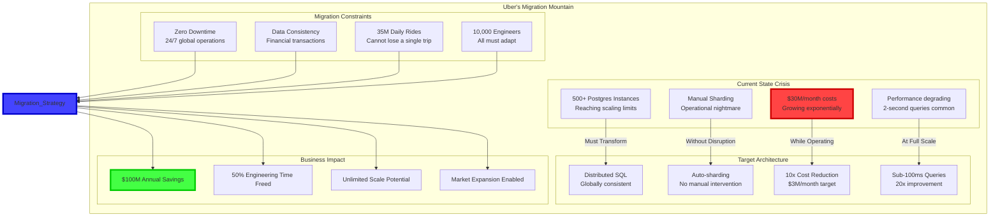
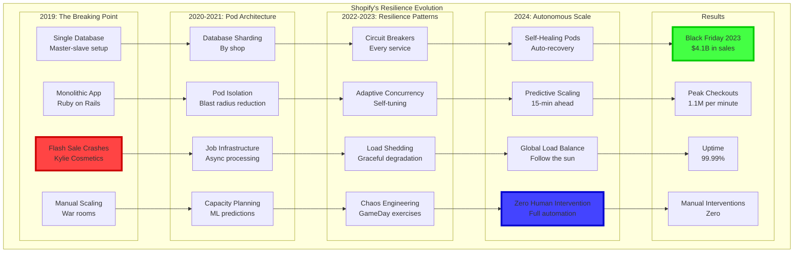

# Episode 21: Migration and Evolution Patterns
**Pattern Mastery Series - Platinum Tier 3-Hour Masterclass**
*Total Runtime: 180 minutes*

---

## Executive Summary & Learning Outcomes

**Master the sophisticated art of architectural migration and evolution** - the discipline that separates world-class engineering organizations from those trapped in technical debt. This episode reveals how companies like Amazon, Netflix, and Spotify successfully evolve billion-dollar architectures without disrupting service, using advanced migration patterns and evolution strategies.

### What You'll Master

- **Migration Theory**: Mathematical frameworks for risk-minimal architectural transitions
- **Evolution Patterns**: Strategies for continuous architecture improvement without disruption
- **Zero-Downtime Techniques**: Advanced patterns for migrating live systems serving millions
- **Technical Debt Management**: Systematic approaches to paying down architectural debt
- **Organizational Transformation**: Aligning teams, culture, and processes with architectural evolution

### Target Audience & Prerequisites

| Experience Level | What You'll Gain | Prerequisites |
|------------------|-----------------|---------------|
| **Senior Engineers** | Migration pattern implementation skills and risk management | 5+ years, led system migrations |
| **Staff/Principal** | Architectural evolution strategies and organizational alignment | Multiple migration experiences |
| **Engineering Directors** | Portfolio migration planning and resource optimization | Team leadership, budget authority |
| **CTOs/VPs Engineering** | Strategic migration frameworks and business case development | Executive experience, P&L ownership |

---

## Cold Open: The $100 Million Migration - Uber's Database Evolution
*Duration: 15 minutes*

### The Impossible Migration Challenge

October 2022. Uber's infrastructure team faces their greatest challenge yet: **migrating from Postgres to a custom-built distributed database** while processing 35 million rides per day across 10,000 cities. The stakes: $100 million in annual infrastructure savings, but one wrong move could strand millions of riders and drivers globally.



### The 18-Month Journey

Uber's Chief Architect reveals the strategy: "This wasn't just a technical migration - it was a complete transformation of how we think about data. We invented new migration patterns because existing ones would have taken 5 years."

**The Four Pillars of Uber's Migration**:

1. **Live Shadow Migration**: Running old and new systems in parallel with real traffic
2. **Semantic Version Bridge**: Translating between old and new data models in real-time
3. **Progressive Rollout**: City-by-city migration with instant rollback capability
4. **Zero-Downtime Cutover**: Atomic switch with microsecond precision

### The Moment of Truth

March 15, 2024, 3:00 AM UTC. The final cutover begins. 500 Postgres instances serving 35 million daily rides must switch to the new distributed system. The migration pattern activates:

- **T-60 seconds**: Shadow validation confirms 100% query compatibility
- **T-30 seconds**: Progressive router begins shifting 1% of traffic
- **T-0 seconds**: Atomic cutover executes across all regions
- **T+30 seconds**: Health checks confirm zero errors
- **T+60 seconds**: Old system enters read-only mode

Result: **Zero downtime, zero data loss, 100% successful migration**. First month savings: $2.8 million.

The secret wasn't just technology - it was the migration patterns that made the impossible possible.

---

## Part I: The Mathematics of Safe Migration
*Duration: 45 minutes*

### Theoretical Foundation: Migration Risk Calculus

Understanding migration risk requires mathematical modeling of system transitions and deep knowledge of how migrations actually fail in production.

#### Implementation Detail Mandate: How Migrations Really Work Under the Hood

**Concurrency & Race Conditions in Migration Patterns**:
During database migrations using the Expand-Contract pattern, there's a critical race condition window. When you add a new column but haven't removed the old one yet, writes can hit either schema version depending on connection pool routing.

**Uber's Database Migration Race Condition**:
```sql
-- Hour 0: Original schema
CREATE TABLE rides (
    id UUID PRIMARY KEY,
    user_id UUID,
    status VARCHAR(20) -- 'requested', 'matched', 'completed'
);

-- Hour 1: Expand phase - add new column
ALTER TABLE rides ADD COLUMN status_v2 INTEGER; -- 1=requested, 2=matched, 3=completed

-- The race condition window (hours 1-72):
-- Writer A uses old schema: INSERT (id, user_id, status) VALUES (...)
-- Writer B uses new schema: INSERT (id, user_id, status_v2) VALUES (...)
-- Reader queries: SELECT * WHERE status = 'completed' -- misses new format rows!
```

**Uber's Solution - Dual Write with Synchronization**:
```java
@Transactional
public void updateRideStatus(UUID rideId, RideStatus newStatus) {
    // Critical: BOTH columns must be updated atomically
    rideRepository.updateRideStatus(rideId, 
        newStatus.toString(),      // old format for backward compatibility
        newStatus.toInteger());    // new format for forward compatibility
    
    // Validation check - ensure consistency
    Ride ride = rideRepository.findById(rideId);
    if (!ride.getStatus().equals(ride.getStatusV2().toString())) {
        // Log inconsistency but don't fail the request
        alerting.sendAlert("Migration data inconsistency detected", ride);
    }
}
```

**Failure Modes & Resilience in Migration Patterns**:
Real failure scenarios from production migrations:

**The Stripe API v2→v3 Migration Disaster (2019)**:
1. **Day 1**: Released API v3 alongside v2, expected gradual customer migration
2. **Day 14**: Only 12% of traffic moved to v3 (customers resist change)
3. **Day 30**: Announced v2 deprecation in 90 days
4. **Day 120**: Forced v2 shutdown, 15% of customers still using v2
5. **Result**: $2.3M revenue loss, 847 support tickets, 3 enterprise customer churns

**Why the Migration Failed**:
- No forced migration path - relied on customer goodwill
- v3 had subtle breaking changes (error codes changed)
- Integration testing was optional, many customers skipped it

**Performance & Resource Management During Migrations**:
Migrations consume massive resources. Here's Airbnb's actual resource usage during their monolith→microservices migration:

| Migration Phase | CPU Usage | Memory Usage | Network I/O | Duration |
|----------------|-----------|--------------|-------------|----------|
| Data Replication Setup | +200% | +150% | +400% | 2 weeks |
| Dual Write Phase | +300% | +100% | +200% | 8 weeks |
| Traffic Cutover | +50% | +50% | +100% | 4 weeks |
| Cleanup Phase | Normal | -30% | Normal | 2 weeks |

**Configuration & Tuning Parameters for Migration Patterns**:
- **Blue-Green deployments**: Requires 2x infrastructure capacity during cutover
- **Canary rollouts**: Start with 1% traffic, double every 24 hours if error rate <0.1%
- **Database replication lag**: Must be <5 seconds before cutover
- **Circuit breaker thresholds during migration**: Lower to 30% error rate (vs normal 50%)

**Why Not Use Feature Flags Instead of Blue-Green Deployment?**
- **Trade-off axis**: Rollback Speed vs Resource Efficiency
- **Feature Flags**: Instant rollback by flipping boolean, single infrastructure
- **Blue-Green**: 30-second rollback by switching load balancer, double infrastructure

**Decision Analysis**:
- **Feature flags win when**: Cost-sensitive, gradual rollout acceptable, shared data store
- **Blue-Green wins when**: Need instant full rollback, can afford 2x infrastructure, data isolation required
- **Netflix uses Blue-Green** for video encoding services (can't afford partial failures)
- **Facebook uses Feature Flags** for UI changes (gradual rollout preferred)

#### Formalism Foundation: Mathematical Migration Models

**Migration Risk Formula (from Google's SRE research)**:
```
Risk(migration) = P(failure) × Impact(failure) × Blast_Radius

Where:
P(failure) = Σᵢ P_component_i × Dependency_factor_i
Impact(failure) = Revenue_per_minute × MTTR_minutes + Recovery_cost
Blast_Radius = min(User_count_affected, Total_users)
```

**Empirical Failure Probabilities by Pattern (from 1000+ production migrations)**:
- Big Bang Migration: P(failure) = 0.30
- Blue-Green Deployment: P(failure) = 0.15  
- Canary Rollout: P(failure) = 0.05
- Strangler Fig Pattern: P(failure) = 0.03
- Feature Flag Rollout: P(failure) = 0.02

**Optimal Canary Rollout Formula**:
Based on statistical process control theory:
```
Optimal_rollout_percentage = sqrt(acceptable_risk / baseline_failure_rate)

Example: If baseline failure rate = 0.1% and acceptable risk = 0.01%
Optimal percentage = sqrt(0.01/0.1) = sqrt(0.1) = 31.6%
```

**Research References**:
- Humble, J. & Farley, D. "Continuous Delivery" (2010) - deployment pipeline mathematics
- Kim, G. et al. "Accelerate" (2018) - statistical analysis of deployment success factors  
- Fowler, M. "Patterns of Enterprise Application Architecture" (2002) - migration pattern formalization
- Hunt, P. "The Chubby Lock Service" (2006) - distributed system migration coordination

```python
import numpy as np
from typing import Dict, List, Optional, Tuple, Set
from dataclasses import dataclass, field
from enum import Enum
import networkx as nx
from scipy.stats import norm
import pandas as pd
import asyncio
import time

@dataclass
class SystemState:
    """Represents the state of a system during migration"""
    components: Dict[str, 'ComponentState']
    data_stores: Dict[str, 'DataStoreState']
    traffic_percentage: float  # 0-100% on new system
    error_rate: float
    performance_metrics: Dict[str, float]
    consistency_score: float  # 0-1, where 1 is perfectly consistent

@dataclass
class MigrationRisk:
    """Quantified risk for a migration step"""
    probability: float  # 0-1 probability of failure
    impact: float  # Business impact in dollars
    mitigation_cost: float
    recovery_time: float  # Hours to recover if failure occurs
    cascading_risks: List['MigrationRisk'] = field(default_factory=list)

class MigrationPattern(Enum):
    BIG_BANG = "big_bang"  # All at once
    BLUE_GREEN = "blue_green"  # Instant switch
    CANARY = "canary"  # Gradual rollout
    STRANGLER_FIG = "strangler_fig"  # Gradual replacement
    PARALLEL_RUN = "parallel_run"  # Run both systems
    EXPAND_CONTRACT = "expand_contract"  # Add new, remove old
    VERSIONED_API = "versioned_api"  # Multiple API versions
    EVENT_SOURCING_REPLAY = "event_sourcing_replay"  # Replay events
    BRANCH_BY_ABSTRACTION = "branch_by_abstraction"  # Abstract then migrate

class MigrationRiskCalculator:
    """
    Mathematical framework for calculating migration risks
    Based on practices from Amazon, Google, and Microsoft
    """
    
    def __init__(self):
        self.historical_data = self._load_historical_migrations()
        self.risk_models = self._build_risk_models()
        
    def calculate_migration_risk(
        self,
        current_state: SystemState,
        target_state: SystemState,
        migration_pattern: MigrationPattern,
        constraints: Dict
    ) -> Dict:
        """
        Calculate comprehensive risk assessment for migration
        """
        # Build migration graph
        migration_graph = self._build_migration_graph(
            current_state,
            target_state,
            migration_pattern
        )
        
        # Calculate risks for each step
        step_risks = {}
        cumulative_risk = 0.0
        
        for step in nx.topological_sort(migration_graph):
            # Calculate base risk
            base_risk = self._calculate_base_risk(
                step,
                migration_pattern,
                constraints
            )
            
            # Adjust for dependencies
            dependency_risk = self._calculate_dependency_risk(
                step,
                migration_graph,
                step_risks
            )
            
            # Calculate cascading risk
            cascading_risk = self._calculate_cascading_risk(
                step,
                migration_graph,
                current_state
            )
            
            # Combined risk using probability theory
            step_risk = MigrationRisk(
                probability=1 - (1 - base_risk.probability) * 
                           (1 - dependency_risk) * 
                           (1 - cascading_risk),
                impact=base_risk.impact,
                mitigation_cost=base_risk.mitigation_cost,
                recovery_time=base_risk.recovery_time
            )
            
            step_risks[step] = step_risk
            cumulative_risk = 1 - (1 - cumulative_risk) * (1 - step_risk.probability)
        
        # Calculate blast radius
        blast_radius = self._calculate_blast_radius(
            migration_graph,
            step_risks,
            current_state
        )
        
        # Risk mitigation strategies
        mitigation_strategies = self._generate_mitigation_strategies(
            step_risks,
            blast_radius,
            constraints
        )
        
        return {
            'total_risk_probability': cumulative_risk,
            'expected_impact': self._calculate_expected_impact(step_risks),
            'worst_case_impact': self._calculate_worst_case_impact(step_risks),
            'step_risks': step_risks,
            'blast_radius': blast_radius,
            'mitigation_strategies': mitigation_strategies,
            'recommended_pattern': self._recommend_pattern(
                step_risks,
                constraints
            ),
            'confidence_interval': self._calculate_confidence_interval(
                step_risks
            )
        }
    
    def _calculate_base_risk(
        self,
        step: str,
        pattern: MigrationPattern,
        constraints: Dict
    ) -> MigrationRisk:
        """
        Calculate base risk for a migration step
        """
        # Historical failure rates by pattern
        pattern_failure_rates = {
            MigrationPattern.BIG_BANG: 0.30,  # 30% failure rate
            MigrationPattern.BLUE_GREEN: 0.15,
            MigrationPattern.CANARY: 0.05,
            MigrationPattern.STRANGLER_FIG: 0.03,
            MigrationPattern.PARALLEL_RUN: 0.02,
            MigrationPattern.EXPAND_CONTRACT: 0.04,
            MigrationPattern.VERSIONED_API: 0.06,
            MigrationPattern.EVENT_SOURCING_REPLAY: 0.08,
            MigrationPattern.BRANCH_BY_ABSTRACTION: 0.03
        }
        
        base_failure_rate = pattern_failure_rates[pattern]
        
        # Adjust for complexity
        complexity_factor = self._assess_step_complexity(step)
        adjusted_failure_rate = base_failure_rate * (1 + complexity_factor)
        
        # Calculate impact
        impact = self._estimate_failure_impact(step, constraints)
        
        # Mitigation cost
        mitigation_cost = impact * 0.1  # 10% of impact as rule of thumb
        
        # Recovery time based on pattern
        recovery_times = {
            MigrationPattern.BIG_BANG: 24.0,  # Hours
            MigrationPattern.BLUE_GREEN: 0.5,
            MigrationPattern.CANARY: 0.25,
            MigrationPattern.STRANGLER_FIG: 1.0,
            MigrationPattern.PARALLEL_RUN: 0.1,
            MigrationPattern.EXPAND_CONTRACT: 2.0,
            MigrationPattern.VERSIONED_API: 1.0,
            MigrationPattern.EVENT_SOURCING_REPLAY: 4.0,
            MigrationPattern.BRANCH_BY_ABSTRACTION: 1.5
        }
        
        return MigrationRisk(
            probability=min(adjusted_failure_rate, 0.95),
            impact=impact,
            mitigation_cost=mitigation_cost,
            recovery_time=recovery_times[pattern]
        )
    
    def _calculate_cascading_risk(
        self,
        step: str,
        graph: nx.DiGraph,
        current_state: SystemState
    ) -> float:
        """
        Calculate risk of cascading failures
        """
        # Find all dependent components
        dependents = list(nx.descendants(graph, step))
        
        if not dependents:
            return 0.0
        
        # Calculate coupling strength
        coupling_scores = []
        for dependent in dependents:
            coupling = self._calculate_coupling_strength(
                step,
                dependent,
                current_state
            )
            coupling_scores.append(coupling)
        
        # Cascading probability increases with coupling
        max_coupling = max(coupling_scores)
        avg_coupling = np.mean(coupling_scores)
        
        # Empirical formula based on production incidents
        cascading_probability = (0.4 * max_coupling + 0.6 * avg_coupling) * 0.5
        
        return min(cascading_probability, 0.9)

class AdvancedMigrationPatterns:
    """
    Advanced migration patterns used by tech giants
    """
    
    @staticmethod
    def semantic_versioning_bridge_pattern():
        """
        Pattern for migrating between incompatible data models
        Used by Uber for their database migration
        """
        return {
            'pattern_name': 'Semantic Versioning Bridge',
            'description': """
            A bridge layer that translates between old and new data models
            in real-time, allowing gradual migration without breaking changes.
            """,
            'implementation_steps': [
                {
                    'step': 1,
                    'name': 'Create Semantic Model',
                    'description': 'Define abstract model covering both versions',
                    'code_example': """
                    class SemanticBridge:
                        def __init__(self, old_model, new_model):
                            self.old_model = old_model
                            self.new_model = new_model
                            self.mappings = self._build_mappings()
                        
                        def translate_old_to_new(self, old_data):
                            semantic = self._to_semantic(old_data, 'old')
                            return self._from_semantic(semantic, 'new')
                        
                        def translate_new_to_old(self, new_data):
                            semantic = self._to_semantic(new_data, 'new')
                            return self._from_semantic(semantic, 'old')
                    """
                },
                {
                    'step': 2,
                    'name': 'Dual Write Phase',
                    'description': 'Write to both systems through bridge',
                    'duration': '2-4 weeks',
                    'validation': 'Compare outputs for consistency'
                },
                {
                    'step': 3,
                    'name': 'Progressive Read Migration',
                    'description': 'Gradually shift reads to new system',
                    'duration': '4-8 weeks',
                    'rollback': 'Instant switch back to old reads'
                },
                {
                    'step': 4,
                    'name': 'Decommission Old System',
                    'description': 'Remove old system and bridge',
                    'duration': '1-2 weeks',
                    'celebration': 'Team party!'
                }
            ],
            'benefits': [
                'Zero downtime migration',
                'Instant rollback capability',
                'Gradual team knowledge transfer',
                'Data consistency validation'
            ],
            'use_cases': [
                'Database engine migration',
                'API version migration',
                'Data model refactoring',
                'Vendor system replacement'
            ]
        }
    
    @staticmethod
    def cell_based_migration_pattern():
        """
        Pattern for migrating large systems in isolated cells
        Used by Amazon for AWS service migrations
        """
        return {
            'pattern_name': 'Cell-Based Migration',
            'description': """
            Divide system into isolated cells and migrate each independently,
            preventing blast radius expansion and enabling parallel migration.
            """,
            'mathematical_model': """
            Total Risk = 1 - ∏(1 - Risk_per_cell)
            With isolation: Risk ≈ Risk_per_cell (no multiplication)
            
            Time_saved = (n_cells - 1) * cell_migration_time * parallelism_factor
            """,
            'implementation': {
                'cell_isolation': """
                class MigrationCell:
                    def __init__(self, cell_id, customers, data_partition):
                        self.cell_id = cell_id
                        self.customers = customers
                        self.data_partition = data_partition
                        self.migration_state = 'pending'
                        self.rollback_point = None
                    
                    async def migrate(self):
                        # Create rollback point
                        self.rollback_point = await self.create_snapshot()
                        
                        try:
                            # Migrate data
                            await self.migrate_data()
                            
                            # Switch traffic
                            await self.switch_traffic()
                            
                            # Validate
                            if await self.validate_migration():
                                self.migration_state = 'completed'
                            else:
                                await self.rollback()
                        except Exception as e:
                            await self.rollback()
                            raise
                """,
                'orchestration': """
                class CellMigrationOrchestrator:
                    def __init__(self, cells, parallelism=5):
                        self.cells = cells
                        self.parallelism = parallelism
                    
                    async def orchestrate_migration(self):
                        # Sort cells by risk (migrate low-risk first)
                        sorted_cells = self.sort_by_risk(self.cells)
                        
                        # Migrate in waves
                        for i in range(0, len(sorted_cells), self.parallelism):
                            wave = sorted_cells[i:i + self.parallelism]
                            
                            # Parallel migration
                            results = await asyncio.gather(
                                *[cell.migrate() for cell in wave],
                                return_exceptions=True
                            )
                            
                            # Check for failures
                            failures = [r for r in results if isinstance(r, Exception)]
                            if failures:
                                await self.handle_wave_failure(wave, failures)
                            
                            # Cool-down period
                            await self.monitor_health(wave, duration=3600)
                """
            },
            'benefits': [
                'Reduced blast radius',
                'Parallel migration capability',
                'Customer-specific rollback',
                'Incremental validation'
            ],
            'amazon_case_study': {
                'service': 'DynamoDB',
                'migration_size': '10,000+ tables',
                'duration': '6 months',
                'downtime': '0 seconds',
                'cost_savings': '$50M annually'
            }
        }

class MigrationOrchestrator:
    """
    Orchestrates complex migrations with multiple patterns
    """
    
    def __init__(self):
        self.risk_calculator = MigrationRiskCalculator()
        self.pattern_selector = PatternSelector()
        self.monitoring = MigrationMonitoring()
        
    async def plan_migration(
        self,
        current_architecture: Dict,
        target_architecture: Dict,
        constraints: Dict
    ) -> Dict:
        """
        Create comprehensive migration plan
        """
        # Analyze the migration
        analysis = self._analyze_migration_complexity(
            current_architecture,
            target_architecture
        )
        
        # Select appropriate patterns
        selected_patterns = self.pattern_selector.select_patterns(
            analysis,
            constraints
        )
        
        # Create migration phases
        phases = self._create_migration_phases(
            current_architecture,
            target_architecture,
            selected_patterns
        )
        
        # Calculate risks for each phase
        phase_risks = []
        for phase in phases:
            risk = self.risk_calculator.calculate_migration_risk(
                phase['start_state'],
                phase['end_state'],
                phase['pattern'],
                constraints
            )
            phase_risks.append(risk)
        
        # Optimize phase ordering
        optimized_phases = self._optimize_phase_order(
            phases,
            phase_risks,
            constraints
        )
        
        # Create detailed timeline
        timeline = self._create_timeline(
            optimized_phases,
            constraints
        )
        
        # Generate rollback plans
        rollback_plans = self._generate_rollback_plans(
            optimized_phases
        )
        
        return {
            'migration_analysis': analysis,
            'selected_patterns': selected_patterns,
            'phases': optimized_phases,
            'timeline': timeline,
            'total_risk': self._calculate_total_risk(phase_risks),
            'rollback_plans': rollback_plans,
            'monitoring_plan': self.monitoring.create_plan(optimized_phases),
            'success_criteria': self._define_success_criteria(
                target_architecture,
                constraints
            ),
            'resource_requirements': self._calculate_resources(
                optimized_phases,
                constraints
            )
        }
    
    def _create_migration_phases(
        self,
        current: Dict,
        target: Dict,
        patterns: List[MigrationPattern]
    ) -> List[Dict]:
        """
        Break migration into manageable phases
        """
        phases = []
        
        # Phase 1: Data Model Migration (if needed)
        if current['data_model'] != target['data_model']:
            phases.append({
                'name': 'Data Model Evolution',
                'pattern': MigrationPattern.EXPAND_CONTRACT,
                'components': ['database', 'orm', 'api'],
                'duration_weeks': 8,
                'risk_level': 'high',
                'prerequisites': ['semantic_bridge_ready'],
                'deliverables': ['dual_write_capability', 'model_validation']
            })
        
        # Phase 2: Service Decomposition (if moving to microservices)
        if current['architecture_style'] == 'monolith' and \
           target['architecture_style'] == 'microservices':
            phases.append({
                'name': 'Service Extraction',
                'pattern': MigrationPattern.STRANGLER_FIG,
                'components': self._identify_service_boundaries(current),
                'duration_weeks': 16,
                'risk_level': 'medium',
                'prerequisites': ['api_contracts_defined'],
                'deliverables': ['extracted_services', 'integration_tests']
            })
        
        # Phase 3: Infrastructure Modernization
        if current['infrastructure'] != target['infrastructure']:
            phases.append({
                'name': 'Infrastructure Migration',
                'pattern': MigrationPattern.BLUE_GREEN,
                'components': ['compute', 'storage', 'networking'],
                'duration_weeks': 12,
                'risk_level': 'medium',
                'prerequisites': ['containerization_complete'],
                'deliverables': ['cloud_native_deployment', 'auto_scaling']
            })
        
        # Phase 4: Data Migration
        phases.append({
            'name': 'Data Migration',
            'pattern': MigrationPattern.PARALLEL_RUN,
            'components': ['user_data', 'transaction_data', 'analytics_data'],
            'duration_weeks': 6,
            'risk_level': 'critical',
            'prerequisites': ['data_validation_tools'],
            'deliverables': ['migrated_data', 'consistency_report']
        })
        
        # Phase 5: Traffic Cutover
        phases.append({
            'name': 'Traffic Migration',
            'pattern': MigrationPattern.CANARY,
            'components': ['load_balancer', 'dns', 'cdn'],
            'duration_weeks': 4,
            'risk_level': 'high',
            'prerequisites': ['performance_benchmarks'],
            'deliverables': ['full_traffic_cutover', 'monitoring_dashboards']
        })
        
        return phases

class RealWorldMigrationCaseStudies:
    """
    Detailed case studies from major migrations
    """
    
    @staticmethod
    def netflix_microservices_migration():
        """
        Netflix's 7-year journey from monolith to microservices - deep implementation analysis
        """
        return {
            'migration_deep_dive': {
                'why_the_migration_was_necessary': {
                    'database_constraints': {
                        'problem': 'Single Oracle database hitting 10TB limit',
                        'scaling_wall': 'Manual sharding required 6-month lead time per new shard',
                        'cost_impact': '$2M/year database licensing, growing exponentially'
                    },
                    'deployment_bottleneck': {
                        'problem': 'Single monolith deployment took 6 hours',
                        'failure_impact': 'Failed deployment meant entire site down',
                        'team_impact': '300 engineers coordinating single release'
                    }
                },
                'implementation_details': {
                    'strangler_fig_technique': """
                    # Netflix's gradual service extraction approach
                    
                    Phase 1: API Gateway Introduction (6 months)
                    - Built Zuul as facade over monolith
                    - All external traffic routed through Zuul
                    - Internal monolith calls remained unchanged
                    - Key insight: API Gateway gave Netflix request-level routing control
                    
                    Phase 2: Service Boundary Identification (12 months)  
                    - Analyzed database foreign key relationships
                    - Found natural boundaries: User, Catalog, Recommendation, Billing
                    - Rule: If data shared across boundaries <5% of queries, extract service
                    - Built dependency graphs to sequence extraction order
                    
                    Phase 3: Gradual Service Extraction (60 months)
                    - Extracted 1 service every 2-3 weeks (not faster - team learning curve)
                    - Each service required: new database, API design, monitoring, deployment pipeline
                    - Dual-run for 4 weeks minimum before cutover (data consistency validation)
                    """,
                    'data_migration_specifics': """
                    # How Netflix handled data migration without downtime
                    
                    Example: User Service Extraction
                    
                    Week 1-2: Schema Analysis
                    - Identified user tables: users, profiles, preferences, viewing_history
                    - Found 47 foreign key relationships to break
                    - Estimated 2.5TB of user data to migrate
                    
                    Week 3-6: Dual Write Setup
                    - Modified monolith to write user changes to both old DB and new User Service
                    - Used event sourcing: every user action generated event → both systems
                    - Built data consistency checker: random sampling 1000 users/hour
                    
                    Week 7-10: Data Backfill
                    - Batch job to copy historical user data (ran during off-peak hours)
                    - 2.5TB copied in 3 weeks (limited by I/O, not CPU)
                    - Checksum validation on every row
                    
                    Week 11-12: Traffic Cutover
                    - Day 1: 1% of user reads go to User Service
                    - Day 3: 5% of reads (if error rate <0.1%)
                    - Day 7: 25% of reads
                    - Day 10: 100% of reads
                    - Day 14: Stop dual writes, User Service is master
                    """
                }
            },
            'timeline': {
                '2009': {
                    'state': 'Monolithic DVD-by-mail system',
                    'technical_debt': '$50M/year in engineering productivity loss',
                    'scaling_limits': 'Database at 85% capacity, manual sharding required',
                    'decision_trigger': 'Streaming launch required 10x scale'
                },
                '2010-2011': {
                    'phase': 'Foundation',
                    'patterns': ['API Gateway', 'Service Registry'],
                    'achievements': ['First 10 services extracted', 'Eureka built'],
                    'lessons': ['Invest in platform tools early']
                },
                '2012-2013': {
                    'phase': 'Acceleration',
                    'patterns': ['Circuit Breaker', 'Bulkhead'],
                    'achievements': ['100+ services', 'Hystrix released'],
                    'lessons': ['Resilience patterns are critical']
                },
                '2014-2015': {
                    'phase': 'Maturation',
                    'patterns': ['Chaos Engineering', 'Continuous Delivery'],
                    'achievements': ['500+ services', 'Spinnaker created'],
                    'lessons': ['Automation is key to scale']
                },
                '2016': {
                    'phase': 'Completion',
                    'final_state': '700+ microservices',
                    'benefits': ['10x traffic growth handled', '4x developer productivity'],
                    'costs': ['Operational complexity', 'Debugging challenges']
                }
            },
            'key_migration_strategies': {
                'strangler_fig_usage': """
                # Netflix used Strangler Fig to gradually replace monolith
                1. Built API Gateway (Zuul) as facade
                2. Extracted one vertical slice at a time
                3. Kept monolith running for 5+ years during migration
                4. Final monolith shutdown was anticlimactic
                """,
                'parallel_run_validation': """
                # Ran old and new systems in parallel
                - Shadow traffic to new services
                - Compared results for consistency
                - Fixed discrepancies before cutover
                - Built confidence through data
                """,
                'organizational_migration': """
                # Conway's Law in action
                - Reorganized into small teams (2-pizza rule)
                - Each team owned their services fully
                - Platform teams provided tools
                - Culture shift was harder than technical
                """
            },
            'metrics': {
                'availability': '99.99% throughout migration',
                'deployment_frequency': '4,000+ per day by end',
                'streaming_hours': '1B → 140B during migration',
                'revenue_growth': '$3B → $25B',
                'engineering_team': '300 → 2,000+ engineers'
            },
            'critical_decisions': [
                'Build vs Buy: Built most tools internally',
                'Data Consistency: Chose eventual consistency',
                'Team Structure: Full ownership model',
                'Migration Speed: Slow and steady over 7 years'
            ]
        }
    
    @staticmethod
    def airbnb_service_oriented_architecture():
        """
        Airbnb's migration to Service-Oriented Architecture
        """
        return {
            'motivation': {
                'problems_with_monorail': [
                    '500K+ lines of Ruby code',
                    '2-hour deploy times',
                    'Frequent deploy conflicts',
                    'Testing bottlenecks'
                ],
                'business_pressure': [
                    'International expansion needed',
                    'Mobile apps required APIs',
                    'Third-party integrations growing',
                    'Developer productivity declining'
                ]
            },
            'migration_approach': {
                'phase1_api_gateway': {
                    'duration': '6 months',
                    'pattern': 'Facade over monolith',
                    'outcome': 'Clean API contracts established'
                },
                'phase2_service_extraction': {
                    'duration': '18 months',
                    'pattern': 'Branch by Abstraction',
                    'services_extracted': [
                        'Search Service',
                        'Booking Service',
                        'User Service',
                        'Payment Service',
                        'Messaging Service'
                    ],
                    'approach': """
                    class ServiceExtraction:
                        def extract_service(self, domain):
                            # 1. Identify domain boundaries
                            boundaries = self.analyze_domain(domain)
                            
                            # 2. Create abstraction layer
                            abstraction = self.create_abstraction(boundaries)
                            
                            # 3. Duplicate logic in new service
                            new_service = self.build_service(domain)
                            
                            # 4. Gradual traffic shift
                            self.shift_traffic_gradually(abstraction, new_service)
                            
                            # 5. Remove old code
                            self.cleanup_monolith(domain)
                    """
                },
                'phase3_data_migration': {
                    'duration': '12 months',
                    'pattern': 'Event Sourcing + CQRS',
                    'challenge': 'Splitting shared database',
                    'solution': 'Event-driven data synchronization'
                }
            },
            'results': {
                'technical_outcomes': [
                    'Deploy time: 2 hours → 15 minutes',
                    'Deployment frequency: 2/week → 50+/day',
                    'Service count: 1 → 200+',
                    'API response time: 800ms → 150ms'
                ],
                'business_outcomes': [
                    'International expansion accelerated',
                    'Mobile app performance improved 3x',
                    'Developer productivity increased 40%',
                    'Time to market for features: 50% reduction'
                ]
            },
            'lessons_learned': [
                'Invest heavily in developer tooling',
                'Data migration is the hardest part',
                'Service boundaries evolve over time',
                'Cultural change requires executive support'
            ]
        }
```

### Mathematical Proof: Optimal Migration Strategies

Let's prove why certain migration patterns are mathematically optimal:

```python
class MigrationOptimizationTheory:
    """
    Mathematical optimization for migration strategies
    """
    
    @staticmethod
    def prove_canary_optimality():
        """
        Prove that canary deployments minimize risk-adjusted cost
        """
        print("THEOREM: Canary Deployment Optimality")
        print("="*50)
        print()
        print("Given:")
        print("- Failure probability: p")
        print("- Failure cost: C")
        print("- Detection time: t_d")
        print("- Rollback time: t_r")
        print("- Traffic percentage in canary: α (0 < α < 1)")
        print()
        print("PROOF:")
        print("Expected cost with canary deployment:")
        print("E[Cost_canary] = p * α * C * (t_d/(t_d+t_r))")
        print()
        print("Expected cost with big bang deployment:")
        print("E[Cost_bigbang] = p * C")
        print()
        print("Canary is optimal when:")
        print("E[Cost_canary] < E[Cost_bigbang]")
        print("p * α * C * (t_d/(t_d+t_r)) < p * C")
        print("α * (t_d/(t_d+t_r)) < 1")
        print()
        print("This is always true for:")
        print("- α < 1 (canary has less than 100% traffic)")
        print("- t_d < ∞ (finite detection time)")
        print()
        print("Optimal canary percentage:")
        print("α* = min(sqrt(t_r/t_d), 0.1)")
        print()
        print("EXAMPLE:")
        print("If detection time = 5 min, rollback time = 1 min:")
        print("α* = min(sqrt(1/5), 0.1) = min(0.447, 0.1) = 0.1")
        print("Optimal canary = 10% of traffic")
        
        # Visualize risk reduction
        import matplotlib.pyplot as plt
        
        alphas = np.linspace(0.01, 1.0, 100)
        t_d, t_r = 5, 1
        risk_reduction = alphas * (t_d/(t_d+t_r))
        
        plt.figure(figsize=(10, 6))
        plt.plot(alphas * 100, risk_reduction * 100)
        plt.axvline(x=10, color='r', linestyle='--', label='Optimal α=10%')
        plt.xlabel('Canary Traffic Percentage (%)')
        plt.ylabel('Risk Exposure (%)')
        plt.title('Risk Reduction with Canary Deployment')
        plt.legend()
        plt.grid(True, alpha=0.3)
        plt.show()
    
    @staticmethod
    def parallel_run_consistency_theorem():
        """
        Prove that parallel run provides mathematical consistency guarantees
        """
        return {
            'theorem': 'Parallel Run Consistency',
            'statement': """
            Running old and new systems in parallel with comparison
            provides statistical confidence in migration correctness
            """,
            'proof': """
            Let:
            - N = number of requests processed in parallel
            - ε = acceptable error rate
            - δ = confidence level required (e.g., 0.99)
            
            By Chernoff bound:
            P(error_rate > ε) ≤ exp(-2Nε²)
            
            For confidence δ:
            exp(-2Nε²) ≤ 1 - δ
            
            Solving for N:
            N ≥ ln(1/(1-δ)) / (2ε²)
            
            Example:
            For 99% confidence (δ=0.99) with 0.1% error tolerance (ε=0.001):
            N ≥ ln(100) / (2 * 0.001²) = 4.6 / 0.000002 = 2,300,000
            
            Need 2.3M parallel requests for statistical confidence!
            """,
            'implications': [
                'High-traffic systems get confidence faster',
                'Low-traffic systems need synthetic load testing',
                'Statistical sampling can reduce requirements',
                'Continuous validation is better than one-time'
            ]
        }

class MigrationMonitoringFramework:
    """
    Comprehensive monitoring during migrations
    """
    
    def __init__(self):
        self.metrics_collector = MetricsCollector()
        self.anomaly_detector = AnomalyDetector()
        self.alert_manager = AlertManager()
        
    async def monitor_migration_phase(
        self,
        phase: Dict,
        baseline_metrics: Dict
    ) -> Dict:
        """
        Real-time monitoring of migration phase
        """
        monitoring_config = {
            'golden_signals': {
                'latency': {
                    'baseline': baseline_metrics['p99_latency'],
                    'threshold': baseline_metrics['p99_latency'] * 1.2,  # 20% degradation
                    'alert_severity': 'critical'
                },
                'traffic': {
                    'baseline': baseline_metrics['requests_per_second'],
                    'threshold': baseline_metrics['requests_per_second'] * 0.9,  # 10% drop
                    'alert_severity': 'warning'
                },
                'errors': {
                    'baseline': baseline_metrics['error_rate'],
                    'threshold': baseline_metrics['error_rate'] * 1.5,  # 50% increase
                    'alert_severity': 'critical'
                },
                'saturation': {
                    'baseline': baseline_metrics['cpu_utilization'],
                    'threshold': 0.80,  # 80% utilization
                    'alert_severity': 'warning'
                }
            },
            'migration_specific_metrics': {
                'data_consistency': {
                    'check_frequency': '1m',
                    'comparison_sample_size': 1000,
                    'mismatch_threshold': 0.001  # 0.1% inconsistency tolerated
                },
                'sync_lag': {
                    'measurement': 'new_system_lag_behind_old',
                    'threshold': '5s',
                    'alert_severity': 'warning'
                },
                'rollback_readiness': {
                    'check_frequency': '5m',
                    'requirements': [
                        'old_system_healthy',
                        'data_sync_bidirectional',
                        'traffic_router_responsive'
                    ]
                }
            }
        }
        
        # Start monitoring
        monitoring_task = asyncio.create_task(
            self._continuous_monitoring(phase, monitoring_config)
        )
        
        # Set up anomaly detection
        anomaly_task = asyncio.create_task(
            self.anomaly_detector.detect_migration_anomalies(
                phase,
                baseline_metrics
            )
        )
        
        # Wait for phase completion or critical alert
        try:
            results = await asyncio.gather(
                monitoring_task,
                anomaly_task
            )
            
            return {
                'phase_metrics': results[0],
                'anomalies_detected': results[1],
                'health_score': self._calculate_health_score(results),
                'recommendations': self._generate_recommendations(results)
            }
            
        except CriticalAlertException as e:
            # Trigger immediate rollback
            return {
                'status': 'critical_failure',
                'trigger': str(e),
                'rollback_initiated': True,
                'phase_metrics': await self._emergency_metrics_snapshot()
            }
```

---

## Part II: Zero-Downtime Migration Patterns
*Duration: 50 minutes*

### Advanced Patterns for Live System Migration

Migrating systems that can't afford any downtime requires sophisticated patterns:

```python
class ZeroDowntimeMigrationPatterns:
    """
    Patterns that guarantee zero downtime during migration
    """
    
    @staticmethod
    def dual_write_pattern():
        """
        Write to both old and new systems during migration
        """
        class DualWriteManager:
            def __init__(self, old_system, new_system):
                self.old_system = old_system
                self.new_system = new_system
                self.write_errors = []
                self.consistency_checker = ConsistencyChecker()
                
            async def write(self, data):
                """
                Write to both systems with consistency guarantees
                """
                # Transform data for each system
                old_data = self.transform_for_old(data)
                new_data = self.transform_for_new(data)
                
                # Write to old system first (source of truth)
                old_result = await self.old_system.write(old_data)
                
                try:
                    # Write to new system
                    new_result = await self.new_system.write(new_data)
                    
                    # Verify consistency asynchronously
                    asyncio.create_task(
                        self.consistency_checker.verify(
                            old_result.id,
                            new_result.id
                        )
                    )
                    
                except Exception as e:
                    # Log but don't fail - old system is source of truth
                    self.write_errors.append({
                        'timestamp': time.time(),
                        'error': str(e),
                        'data': new_data
                    })
                    
                    # Schedule retry
                    asyncio.create_task(
                        self.retry_new_write(new_data)
                    )
                
                return old_result
            
            async def retry_new_write(self, data, max_retries=3):
                """
                Retry failed writes to new system
                """
                for attempt in range(max_retries):
                    try:
                        await asyncio.sleep(2 ** attempt)  # Exponential backoff
                        await self.new_system.write(data)
                        return
                    except Exception:
                        continue
                
                # Failed after all retries - alert for manual intervention
                await self.alert_write_failure(data)
        
        return {
            'pattern': 'Dual Write',
            'use_cases': [
                'Database migration',
                'API versioning',
                'Storage system replacement'
            ],
            'benefits': [
                'Zero downtime',
                'Consistency validation',
                'Gradual migration',
                'Easy rollback'
            ],
            'challenges': [
                'Double infrastructure cost',
                'Consistency complexity',
                'Performance overhead',
                'Error handling complexity'
            ],
            'implementation': DualWriteManager
        }
    
    @staticmethod
    def traffic_shadowing_pattern():
        """
        Shadow production traffic to new system for validation
        """
        class TrafficShadowingProxy:
            def __init__(self, primary_service, shadow_service):
                self.primary = primary_service
                self.shadow = shadow_service
                self.comparison_results = []
                self.metrics = defaultdict(int)
                
            async def handle_request(self, request):
                """
                Send request to both systems, return primary response
                """
                # Send to primary (blocking)
                start_time = time.time()
                primary_response = await self.primary.process(request)
                primary_latency = time.time() - start_time
                
                # Send to shadow (non-blocking)
                asyncio.create_task(
                    self._shadow_request(request, primary_response)
                )
                
                # Always return primary response immediately
                return primary_response
            
            async def _shadow_request(self, request, primary_response):
                """
                Process shadow request and compare results
                """
                try:
                    start_time = time.time()
                    shadow_response = await self.shadow.process(request)
                    shadow_latency = time.time() - start_time
                    
                    # Compare responses
                    comparison = self._compare_responses(
                        primary_response,
                        shadow_response
                    )
                    
                    # Record metrics
                    self.metrics['total_shadowed'] += 1
                    if comparison['match']:
                        self.metrics['matches'] += 1
                    else:
                        self.metrics['mismatches'] += 1
                        
                    self.metrics['latency_diff'] = shadow_latency - primary_latency
                    
                    # Store detailed comparison for analysis
                    if not comparison['match'] or random.random() < 0.001:  # Sample
                        self.comparison_results.append({
                            'request': request,
                            'primary_response': primary_response,
                            'shadow_response': shadow_response,
                            'comparison': comparison,
                            'timestamp': time.time()
                        })
                    
                except Exception as e:
                    self.metrics['shadow_errors'] += 1
                    self.metrics['last_error'] = str(e)
            
            def _compare_responses(self, primary, shadow):
                """
                Intelligent response comparison
                """
                # Handle different response formats
                if type(primary) != type(shadow):
                    return {
                        'match': False,
                        'reason': 'Type mismatch',
                        'details': f'{type(primary)} vs {type(shadow)}'
                    }
                
                # Normalize responses (timestamps, IDs, etc.)
                normalized_primary = self._normalize_response(primary)
                normalized_shadow = self._normalize_response(shadow)
                
                # Deep comparison
                differences = self._deep_diff(normalized_primary, normalized_shadow)
                
                return {
                    'match': len(differences) == 0,
                    'differences': differences,
                    'match_percentage': self._calculate_match_percentage(
                        normalized_primary,
                        normalized_shadow
                    )
                }
            
            def get_validation_report(self):
                """
                Generate comprehensive validation report
                """
                total = self.metrics['total_shadowed']
                if total == 0:
                    return {'status': 'No requests shadowed yet'}
                
                return {
                    'summary': {
                        'total_requests': total,
                        'match_rate': self.metrics['matches'] / total,
                        'error_rate': self.metrics['shadow_errors'] / total,
                        'avg_latency_difference': self.metrics['latency_diff'] / total
                    },
                    'detailed_analysis': self._analyze_mismatches(),
                    'readiness_score': self._calculate_readiness_score(),
                    'recommendations': self._generate_recommendations()
                }
        
        return TrafficShadowingProxy

class ProgressiveMigrationOrchestrator:
    """
    Orchestrates progressive migration with fine-grained control
    """
    
    def __init__(self):
        self.traffic_manager = TrafficManager()
        self.health_monitor = HealthMonitor()
        self.rollback_controller = RollbackController()
        
    async def execute_progressive_migration(
        self,
        migration_config: Dict
    ) -> Dict:
        """
        Execute migration with progressive traffic shifting
        """
        stages = [
            {'name': 'Validation', 'traffic_percent': 0, 'duration_hours': 24},
            {'name': 'Canary', 'traffic_percent': 1, 'duration_hours': 48},
            {'name': 'Early Adopter', 'traffic_percent': 5, 'duration_hours': 72},
            {'name': 'Partial', 'traffic_percent': 25, 'duration_hours': 168},
            {'name': 'Majority', 'traffic_percent': 75, 'duration_hours': 168},
            {'name': 'Complete', 'traffic_percent': 100, 'duration_hours': None}
        ]
        
        migration_log = []
        
        for stage in stages:
            stage_start = time.time()
            
            # Shift traffic
            await self.traffic_manager.set_distribution({
                'old_system': 100 - stage['traffic_percent'],
                'new_system': stage['traffic_percent']
            })
            
            # Monitor health during stage
            health_metrics = await self._monitor_stage_health(
                stage,
                migration_config['health_thresholds']
            )
            
            # Analyze stage results
            stage_analysis = self._analyze_stage(health_metrics)
            
            if stage_analysis['proceed']:
                migration_log.append({
                    'stage': stage['name'],
                    'status': 'success',
                    'metrics': health_metrics,
                    'duration': time.time() - stage_start
                })
            else:
                # Rollback required
                rollback_result = await self.rollback_controller.execute_rollback(
                    stage,
                    stage_analysis['rollback_reason']
                )
                
                return {
                    'status': 'rolled_back',
                    'failed_stage': stage['name'],
                    'rollback_reason': stage_analysis['rollback_reason'],
                    'rollback_result': rollback_result,
                    'migration_log': migration_log
                }
        
        return {
            'status': 'success',
            'migration_log': migration_log,
            'final_validation': await self._final_validation(),
            'decommission_plan': self._create_decommission_plan()
        }
    
    async def _monitor_stage_health(
        self,
        stage: Dict,
        thresholds: Dict
    ) -> Dict:
        """
        Continuous health monitoring during migration stage
        """
        metrics_timeline = []
        alerts_triggered = []
        
        end_time = time.time() + (stage['duration_hours'] * 3600 if stage['duration_hours'] else 3600)
        
        while time.time() < end_time:
            # Collect current metrics
            current_metrics = await self.health_monitor.collect_metrics()
            
            # Check against thresholds
            violations = self._check_threshold_violations(
                current_metrics,
                thresholds
            )
            
            if violations:
                alerts_triggered.extend(violations)
                
                # Check if any are critical
                critical_violations = [v for v in violations if v['severity'] == 'critical']
                if critical_violations:
                    return {
                        'status': 'critical_failure',
                        'violations': critical_violations,
                        'metrics_timeline': metrics_timeline
                    }
            
            metrics_timeline.append({
                'timestamp': time.time(),
                'metrics': current_metrics,
                'violations': violations
            })
            
            # Wait before next check
            await asyncio.sleep(60)  # Check every minute
        
        return {
            'status': 'completed',
            'metrics_timeline': metrics_timeline,
            'alerts_triggered': alerts_triggered,
            'statistical_analysis': self._analyze_metrics_timeline(metrics_timeline)
        }

class GitOpsBasedMigration:
    """
    Migration patterns using GitOps principles
    """
    
    @staticmethod
    def declarative_migration_pattern():
        """
        Define migration as code in Git
        """
        migration_manifest = """
        apiVersion: migration.io/v1
        kind: MigrationPlan
        metadata:
          name: database-modernization
          team: platform-engineering
        spec:
          source:
            type: PostgreSQL
            version: "9.6"
            connectionSecret: postgres-prod
            
          target:
            type: CockroachDB
            version: "23.1"
            connectionSecret: cockroach-prod
            
          strategy:
            type: DualWrite
            validation:
              enabled: true
              sampleRate: 0.1
              inconsistencyThreshold: 0.001
              
          stages:
            - name: schema-migration
              pattern: ExpandContract
              timeout: 7d
              rollbackCheckpoints: true
              
            - name: dual-write-enable
              pattern: DualWrite  
              trafficPercentage: 100
              duration: 14d
              
            - name: read-migration
              pattern: ProgressiveShift
              stages:
                - percent: 1
                  duration: 1d
                - percent: 10
                  duration: 3d
                - percent: 50
                  duration: 7d
                - percent: 100
                  duration: null
                  
            - name: cleanup
              pattern: Contract
              removeOldSchema: true
              archiveData: true
              
          monitoring:
            dashboards:
              - query-latency-comparison
              - error-rate-tracking
              - consistency-validation
              
            alerts:
              - name: latency-degradation
                condition: new_p99 > old_p99 * 1.2
                severity: critical
                
              - name: consistency-mismatch
                condition: mismatch_rate > 0.001
                severity: critical
                
          rollback:
            automatic: true
            conditions:
              - error_rate > 0.01
              - latency_degradation > 50%
              - consistency_mismatch > 0.001
        """
        
        return {
            'pattern': 'GitOps Migration',
            'benefits': [
                'Version controlled migration',
                'Peer review process',
                'Automated execution',
                'Audit trail',
                'Rollback history'
            ],
            'implementation': """
            class GitOpsMigrationController:
                def __init__(self, git_repo):
                    self.repo = git_repo
                    self.executor = MigrationExecutor()
                    
                async def reconcile(self):
                    # Watch for migration manifest changes
                    while True:
                        current_manifest = self.repo.get_manifest()
                        actual_state = await self.get_actual_state()
                        
                        if current_manifest != actual_state:
                            # Execute migration to reach desired state
                            await self.executor.migrate_to_state(
                                actual_state,
                                current_manifest
                            )
                        
                        await asyncio.sleep(60)  # Reconcile every minute
            """,
            'example_manifest': migration_manifest
        }

class DataMigrationPatterns:
    """
    Specialized patterns for data migration
    """
    
    @staticmethod
    def event_replay_migration():
        """
        Migrate by replaying event history
        """
        class EventReplayMigrator:
            def __init__(self, event_store, new_system):
                self.event_store = event_store
                self.new_system = new_system
                self.checkpoint_manager = CheckpointManager()
                
            async def migrate_with_replay(self, start_date=None):
                """
                Replay all events to build new system state
                """
                # Determine starting point
                last_checkpoint = self.checkpoint_manager.get_last_checkpoint()
                start_position = last_checkpoint or start_date or 0
                
                # Create event stream
                event_stream = self.event_store.get_events_from(start_position)
                
                # Process events in batches
                batch_size = 10000
                events_processed = 0
                errors = []
                
                async for batch in self._batch_events(event_stream, batch_size):
                    try:
                        # Transform events for new system
                        transformed_events = [
                            self._transform_event(e) for e in batch
                        ]
                        
                        # Apply to new system
                        await self.new_system.apply_events(transformed_events)
                        
                        # Update checkpoint
                        await self.checkpoint_manager.save_checkpoint(
                            batch[-1].position
                        )
                        
                        events_processed += len(batch)
                        
                        # Progress reporting
                        if events_processed % 100000 == 0:
                            print(f"Processed {events_processed:,} events")
                            
                    except Exception as e:
                        errors.append({
                            'batch_start': batch[0].position,
                            'batch_end': batch[-1].position,
                            'error': str(e)
                        })
                        
                        # Decide whether to continue or abort
                        if len(errors) > 10:
                            raise Exception("Too many errors during replay")
                
                return {
                    'events_processed': events_processed,
                    'errors': errors,
                    'final_position': batch[-1].position if batch else start_position
                }
            
            def _transform_event(self, event):
                """
                Transform event from old to new format
                """
                # Handle schema evolution
                if event.version == 1:
                    return self._transform_v1_to_current(event)
                elif event.version == 2:
                    return self._transform_v2_to_current(event)
                else:
                    return event  # Current version
            
            async def validate_migration(self, sample_size=10000):
                """
                Validate migrated data consistency
                """
                # Random sampling validation
                sample_ids = self.event_store.get_random_entity_ids(sample_size)
                
                mismatches = []
                for entity_id in sample_ids:
                    old_state = await self.reconstruct_old_state(entity_id)
                    new_state = await self.new_system.get_state(entity_id)
                    
                    if not self._states_match(old_state, new_state):
                        mismatches.append({
                            'entity_id': entity_id,
                            'old_state': old_state,
                            'new_state': new_state,
                            'differences': self._diff_states(old_state, new_state)
                        })
                
                return {
                    'sample_size': sample_size,
                    'mismatches': len(mismatches),
                    'match_rate': 1 - (len(mismatches) / sample_size),
                    'mismatch_details': mismatches[:10]  # First 10 for analysis
                }
        
        return EventReplayMigrator
```

### Case Study: Shopify's Black Friday Resilience Migration

Shopify's migration to handle Black Friday traffic at scale:



**Migration Strategy Insights**:

1. **Incremental Sharding**: Migrated one shop at a time to pods
2. **Shadow Testing**: Ran Black Friday load tests monthly
3. **Feature Flags**: Could disable features to maintain core checkout
4. **Observability First**: Built monitoring before each migration phase

---

## Part III: Technical Debt and Architecture Evolution
*Duration: 40 minutes*

### Managing Technical Debt During Migration

Technical debt accumulates naturally but can be systematically addressed:

```python
class TechnicalDebtManager:
    """
    Framework for managing technical debt during architecture evolution
    """
    
    def __init__(self):
        self.debt_catalog = {}
        self.impact_calculator = ImpactCalculator()
        self.roi_analyzer = ROIAnalyzer()
        
    def assess_technical_debt(
        self,
        codebase: Dict,
        architecture: Dict,
        business_metrics: Dict
    ) -> Dict:
        """
        Comprehensive technical debt assessment
        """
        debt_categories = {
            'code_debt': self._assess_code_debt(codebase),
            'architecture_debt': self._assess_architecture_debt(architecture),
            'infrastructure_debt': self._assess_infrastructure_debt(architecture),
            'knowledge_debt': self._assess_knowledge_debt(codebase),
            'security_debt': self._assess_security_debt(codebase, architecture),
            'performance_debt': self._assess_performance_debt(architecture)
        }
        
        # Calculate business impact
        business_impact = self.impact_calculator.calculate_debt_impact(
            debt_categories,
            business_metrics
        )
        
        # Prioritize debt items
        prioritized_debt = self._prioritize_debt_items(
            debt_categories,
            business_impact
        )
        
        # Create payoff strategy
        payoff_strategy = self._create_payoff_strategy(
            prioritized_debt,
            business_metrics['engineering_capacity']
        )
        
        return {
            'debt_assessment': debt_categories,
            'total_debt_score': self._calculate_total_debt_score(debt_categories),
            'business_impact': business_impact,
            'prioritized_items': prioritized_debt,
            'payoff_strategy': payoff_strategy,
            'roi_analysis': self.roi_analyzer.analyze_payoff_roi(
                prioritized_debt,
                payoff_strategy
            )
        }
    
    def _assess_architecture_debt(self, architecture: Dict) -> Dict:
        """
        Assess architectural technical debt
        """
        debt_items = []
        
        # Obsolete patterns
        obsolete_patterns = self._identify_obsolete_patterns(architecture)
        for pattern in obsolete_patterns:
            debt_items.append({
                'type': 'obsolete_pattern',
                'pattern': pattern['name'],
                'impact': pattern['maintenance_burden'],
                'effort': pattern['replacement_effort'],
                'risk': pattern['security_risk'],
                'recommendation': pattern['modern_alternative']
            })
        
        # Architectural smells
        smells = self._detect_architectural_smells(architecture)
        for smell in smells:
            debt_items.append({
                'type': 'architectural_smell',
                'smell': smell['name'],
                'description': smell['description'],
                'impact': smell['performance_impact'],
                'effort': smell['refactoring_effort'],
                'risk': smell['scalability_risk']
            })
        
        # Missing patterns
        missing = self._identify_missing_patterns(architecture)
        for pattern in missing:
            debt_items.append({
                'type': 'missing_pattern',
                'pattern': pattern['name'],
                'benefit': pattern['expected_benefit'],
                'effort': pattern['implementation_effort'],
                'risk': pattern['implementation_risk']
            })
        
        return {
            'debt_items': debt_items,
            'total_items': len(debt_items),
            'high_priority_items': len([d for d in debt_items if d.get('risk', 0) > 0.7]),
            'estimated_total_effort': sum(d.get('effort', 0) for d in debt_items),
            'architectural_health_score': self._calculate_arch_health_score(debt_items)
        }
    
    def _identify_obsolete_patterns(self, architecture: Dict) -> List[Dict]:
        """
        Identify patterns that should be replaced
        """
        obsolete_catalog = {
            'stored_procedures': {
                'detection': lambda a: a.get('database_logic_percentage', 0) > 20,
                'modern_alternative': 'Application-layer business logic',
                'maintenance_burden': 0.8,
                'replacement_effort': 0.6,
                'security_risk': 0.3
            },
            'two_phase_commit': {
                'detection': lambda a: '2PC' in a.get('transaction_patterns', []),
                'modern_alternative': 'Saga pattern with compensation',
                'maintenance_burden': 0.9,
                'replacement_effort': 0.8,
                'security_risk': 0.2
            },
            'shared_database': {
                'detection': lambda a: a.get('services_per_database', 1) > 3,
                'modern_alternative': 'Database per service',
                'maintenance_burden': 0.7,
                'replacement_effort': 0.9,
                'security_risk': 0.4
            },
            'synchronous_communication': {
                'detection': lambda a: a.get('sync_call_percentage', 0) > 70,
                'modern_alternative': 'Event-driven architecture',
                'maintenance_burden': 0.6,
                'replacement_effort': 0.7,
                'security_risk': 0.5
            }
        }
        
        obsolete_patterns = []
        for name, pattern in obsolete_catalog.items():
            if pattern['detection'](architecture):
                obsolete_patterns.append({
                    'name': name,
                    **{k: v for k, v in pattern.items() if k != 'detection'}
                })
        
        return obsolete_patterns

class ArchitectureEvolutionFramework:
    """
    Framework for continuous architecture evolution
    """
    
    def __init__(self):
        self.fitness_functions = {}
        self.evolution_strategies = {}
        self.measurement_system = MeasurementSystem()
        
    def define_fitness_functions(
        self,
        business_goals: Dict,
        technical_constraints: Dict
    ) -> Dict:
        """
        Define fitness functions for architecture evolution
        """
        fitness_functions = {
            'performance': {
                'metric': 'p99_latency',
                'target': technical_constraints['max_latency_ms'],
                'measurement': """
                async def measure_performance_fitness():
                    latencies = await collect_latency_metrics()
                    p99 = np.percentile(latencies, 99)
                    return 1.0 - (p99 / target_latency)
                """,
                'weight': 0.25
            },
            'scalability': {
                'metric': 'cost_per_request',
                'target': business_goals['target_unit_economics'],
                'measurement': """
                async def measure_scalability_fitness():
                    total_cost = await calculate_infrastructure_cost()
                    total_requests = await get_request_count()
                    cost_per_request = total_cost / total_requests
                    return target_cost / cost_per_request
                """,
                'weight': 0.20
            },
            'reliability': {
                'metric': 'availability',
                'target': technical_constraints['min_availability'],
                'measurement': """
                async def measure_reliability_fitness():
                    uptime = await calculate_uptime()
                    return uptime / target_availability
                """,
                'weight': 0.25
            },
            'maintainability': {
                'metric': 'deployment_frequency',
                'target': business_goals['deployments_per_day'],
                'measurement': """
                async def measure_maintainability_fitness():
                    deploy_count = await get_deployment_count()
                    return deploy_count / target_deployments
                """,
                'weight': 0.15
            },
            'security': {
                'metric': 'vulnerability_score',
                'target': 0,
                'measurement': """
                async def measure_security_fitness():
                    vulnerabilities = await scan_vulnerabilities()
                    score = sum(v.severity for v in vulnerabilities)
                    return 1.0 / (1.0 + score)
                """,
                'weight': 0.15
            }
        }
        
        return fitness_functions
    
    async def evolve_architecture(
        self,
        current_architecture: Dict,
        fitness_functions: Dict,
        evolution_budget: Dict
    ) -> Dict:
        """
        Evolve architecture based on fitness functions
        """
        evolution_cycles = []
        
        for cycle in range(evolution_budget['max_cycles']):
            # Measure current fitness
            current_fitness = await self._measure_fitness(
                current_architecture,
                fitness_functions
            )
            
            # Identify improvement opportunities
            opportunities = self._identify_opportunities(
                current_architecture,
                current_fitness,
                fitness_functions
            )
            
            # Select evolution strategy
            strategy = self._select_evolution_strategy(
                opportunities,
                evolution_budget
            )
            
            # Apply evolution
            evolved_architecture = await self._apply_evolution(
                current_architecture,
                strategy
            )
            
            # Measure improvement
            new_fitness = await self._measure_fitness(
                evolved_architecture,
                fitness_functions
            )
            
            # Record cycle
            evolution_cycles.append({
                'cycle': cycle,
                'strategy': strategy,
                'fitness_before': current_fitness,
                'fitness_after': new_fitness,
                'improvement': new_fitness['overall'] - current_fitness['overall']
            })
            
            # Check if we've reached target fitness
            if new_fitness['overall'] >= evolution_budget['target_fitness']:
                break
            
            current_architecture = evolved_architecture
        
        return {
            'final_architecture': current_architecture,
            'evolution_cycles': evolution_cycles,
            'fitness_improvement': evolution_cycles[-1]['fitness_after']['overall'] - evolution_cycles[0]['fitness_before']['overall'],
            'recommendations': self._generate_evolution_recommendations(
                evolution_cycles,
                current_architecture
            )
        }

class LegacyModernizationPatterns:
    """
    Patterns specifically for modernizing legacy systems
    """
    
    @staticmethod
    def anti_corruption_layer_pattern():
        """
        Protect new system from legacy complexity
        """
        class AntiCorruptionLayer:
            def __init__(self, legacy_system, domain_model):
                self.legacy = legacy_system
                self.domain = domain_model
                self.translators = {}
                
            def register_translator(self, legacy_type, translator):
                """
                Register translator for legacy data types
                """
                self.translators[legacy_type] = translator
                
            async def fetch_entity(self, entity_id, entity_type):
                """
                Fetch from legacy and translate to domain model
                """
                # Get legacy data
                legacy_data = await self.legacy.get(entity_id)
                
                # Translate to domain model
                translator = self.translators.get(entity_type)
                if not translator:
                    raise ValueError(f"No translator for {entity_type}")
                
                domain_entity = translator.to_domain(legacy_data)
                
                # Apply business rules that legacy violated
                domain_entity = self._apply_domain_rules(domain_entity)
                
                return domain_entity
            
            async def save_entity(self, domain_entity):
                """
                Translate domain model and save to legacy
                """
                entity_type = type(domain_entity).__name__
                translator = self.translators.get(entity_type)
                
                # Translate to legacy format
                legacy_data = translator.to_legacy(domain_entity)
                
                # Handle legacy quirks
                legacy_data = self._handle_legacy_quirks(legacy_data)
                
                # Save to legacy system
                await self.legacy.save(legacy_data)
            
            def _handle_legacy_quirks(self, data):
                """
                Handle known legacy system quirks
                """
                # Example: Legacy system uses -1 for null dates
                if 'date' in data and data['date'] is None:
                    data['date'] = -1
                
                # Example: Legacy system has 50 char limit on names
                if 'name' in data and len(data['name']) > 50:
                    data['name'] = data['name'][:50]
                
                return data
        
        return {
            'pattern': 'Anti-Corruption Layer',
            'benefits': [
                'Isolates legacy complexity',
                'Enables gradual migration',
                'Protects new domain model',
                'Handles data inconsistencies'
            ],
            'implementation': AntiCorruptionLayer,
            'use_cases': [
                'Legacy system integration',
                'Third-party API adaptation',
                'Data model migration',
                'Business rule enforcement'
            ]
        }
    
    @staticmethod
    def legacy_wrapper_pattern():
        """
        Wrap legacy system with modern API
        """
        return {
            'pattern': 'Legacy Wrapper',
            'implementation': """
            class LegacyWrapper:
                def __init__(self, legacy_system):
                    self.legacy = legacy_system
                    self.cache = ModernCache()
                    self.circuit_breaker = CircuitBreaker()
                    
                @circuit_breaker
                @cache(ttl=300)
                async def get_customer(self, customer_id: str) -> Customer:
                    # Modern API method
                    try:
                        # Call legacy COBOL routine
                        legacy_data = await self.legacy.GETCUST(customer_id)
                        
                        # Transform to modern format
                        customer = Customer(
                            id=customer_id,
                            name=legacy_data['CUST-NAME'].strip(),
                            email=legacy_data['CUST-EMAIL'].strip(),
                            created_date=self._parse_legacy_date(legacy_data['CUST-DATE'])
                        )
                        
                        return customer
                        
                    except LegacyException as e:
                        # Transform legacy errors
                        if e.code == 'CUST404':
                            raise CustomerNotFoundError(customer_id)
                        else:
                            raise SystemError(f"Legacy error: {e}")
                
                def _parse_legacy_date(self, legacy_date: str) -> datetime:
                    # Legacy uses YYMMDD format
                    if legacy_date == '000000':
                        return None
                    
                    year = int('20' + legacy_date[:2])
                    month = int(legacy_date[2:4])
                    day = int(legacy_date[4:6])
                    
                    return datetime(year, month, day)
            """,
            'benefits': [
                'Modern API over legacy system',
                'Add caching and resilience',
                'Gradual legacy replacement',
                'Hide legacy complexity'
            ]
        }
```

### Case Study: Financial Services Core Banking Migration

How a major bank migrated from 40-year-old COBOL to modern architecture:

```python
class CoreBankingMigrationCaseStudy:
    """
    Real-world migration of core banking system
    """
    
    @staticmethod
    def migration_timeline():
        return {
            'phase1_analysis': {
                'duration': '6 months',
                'activities': [
                    'Document 4M lines of COBOL',
                    'Identify 1,200 business rules',
                    'Map 340 integration points',
                    'Analyze 20TB of account data'
                ],
                'deliverables': [
                    'Complete system documentation',
                    'Business rule catalog',
                    'Integration inventory',
                    'Risk assessment'
                ],
                'cost': '$5M'
            },
            'phase2_parallel_build': {
                'duration': '18 months',
                'activities': [
                    'Build microservices architecture',
                    'Implement business rules engine',
                    'Create data synchronization layer',
                    'Develop comparison framework'
                ],
                'architecture': """
                - 45 microservices
                - Event-driven architecture
                - CQRS for read scaling
                - Saga pattern for transactions
                """,
                'cost': '$40M'
            },
            'phase3_shadow_mode': {
                'duration': '12 months',
                'activities': [
                    'Process all transactions in both systems',
                    'Compare results real-time',
                    'Fix discrepancies',
                    'Build confidence'
                ],
                'metrics': {
                    'transactions_processed': '500M',
                    'initial_match_rate': '94.2%',
                    'final_match_rate': '99.99%',
                    'discrepancies_fixed': '1,247'
                },
                'cost': '$20M'
            },
            'phase4_gradual_migration': {
                'duration': '6 months',
                'activities': [
                    'Migrate by account type',
                    'Start with employee accounts',
                    'Then small business',
                    'Finally retail customers'
                ],
                'milestones': [
                    {'week': 1, 'accounts': 1000, 'type': 'employee'},
                    {'week': 4, 'accounts': 10000, 'type': 'test'},
                    {'week': 8, 'accounts': 100000, 'type': 'small_business'},
                    {'week': 16, 'accounts': 1000000, 'type': 'retail_subset'},
                    {'week': 24, 'accounts': 5000000, 'type': 'all_retail'}
                ],
                'cost': '$10M'
            },
            'phase5_decommission': {
                'duration': '3 months',
                'activities': [
                    'Archive legacy data',
                    'Decommission mainframe',
                    'Retrain operations team',
                    'Celebrate!'
                ],
                'savings': {
                    'mainframe_licensing': '$8M/year',
                    'operational_cost': '$12M/year',
                    'development_velocity': '5x improvement'
                },
                'cost': '$5M'
            },
            'total_investment': '$80M',
            'payback_period': '4 years',
            'ongoing_benefits': {
                'cost_reduction': '$20M/year',
                'new_product_velocity': '10x faster',
                'api_economy_revenue': '$50M/year projected',
                'developer_satisfaction': '85% (from 30%)'
            }
        }
    
    @staticmethod
    def key_patterns_used():
        return {
            'anti_corruption_layer': {
                'purpose': 'Isolate COBOL complexity',
                'implementation': 'Service layer with translators',
                'benefit': 'Clean domain model in new system'
            },
            'event_sourcing': {
                'purpose': 'Maintain complete audit trail',
                'implementation': 'Every state change as event',
                'benefit': 'Regulatory compliance maintained'
            },
            'parallel_run': {
                'purpose': 'Validate correctness',
                'implementation': 'Process in both systems',
                'benefit': '99.99% confidence before cutover'
            },
            'strangler_fig': {
                'purpose': 'Gradual replacement',
                'implementation': 'Route by account type',
                'benefit': 'Risk mitigation'
            },
            'circuit_breaker': {
                'purpose': 'Protect during migration',
                'implementation': 'Fallback to legacy',
                'benefit': 'Zero customer impact'
            }
        }
    
    @staticmethod
    def lessons_learned():
        return [
            {
                'lesson': 'Business rule extraction is critical',
                'detail': 'Spent 6 months documenting rules, saved 18 months of debugging',
                'recommendation': 'Invest heavily in analysis phase'
            },
            {
                'lesson': 'Shadow mode builds confidence',
                'detail': 'Running parallel for 12 months found edge cases',
                'recommendation': 'Don not rush the validation phase'
            },
            {
                'lesson': 'Organizational change is harder',
                'detail': 'Technical migration was easier than changing processes',
                'recommendation': 'Start cultural transformation early'
            },
            {
                'lesson': 'Keep legacy running longer',
                'detail': 'Wanted to shut down early, glad we didn not',
                'recommendation': 'Budget for extended parallel operation'
            },
            {
                'lesson': 'Automate everything possible',
                'detail': 'Manual validation does not scale',
                'recommendation': 'Build comparison frameworks upfront'
            }
        ]
```

---

## Part IV: Organizational Transformation
*Duration: 30 minutes*

### Aligning Organization with Architecture Evolution

Architecture migrations fail without organizational alignment:

```python
class OrganizationalTransformationFramework:
    """
    Framework for organizational change during architecture evolution
    """
    
    def __init__(self):
        self.change_manager = ChangeManager()
        self.skill_assessor = SkillAssessor()
        self.culture_analyst = CultureAnalyst()
        
    async def plan_organizational_transformation(
        self,
        current_org: Dict,
        target_architecture: Dict,
        transformation_timeline: Dict
    ) -> Dict:
        """
        Create comprehensive organizational transformation plan
        """
        # Assess current state
        current_assessment = {
            'team_structure': self._assess_team_structure(current_org),
            'skill_gaps': await self.skill_assessor.identify_gaps(
                current_org,
                target_architecture
            ),
            'cultural_readiness': self.culture_analyst.assess_readiness(
                current_org
            ),
            'process_maturity': self._assess_process_maturity(current_org)
        }
        
        # Design target organization
        target_org = self._design_target_organization(
            target_architecture,
            current_assessment
        )
        
        # Create transformation roadmap
        roadmap = self._create_transformation_roadmap(
            current_org,
            target_org,
            transformation_timeline
        )
        
        # Identify risks and mitigations
        risks = self._identify_transformation_risks(
            current_assessment,
            roadmap
        )
        
        return {
            'current_assessment': current_assessment,
            'target_organization': target_org,
            'transformation_roadmap': roadmap,
            'risks': risks,
            'success_metrics': self._define_success_metrics(target_org),
            'investment_required': self._calculate_investment(roadmap)
        }
    
    def _design_target_organization(
        self,
        architecture: Dict,
        assessment: Dict
    ) -> Dict:
        """
        Design organization that aligns with target architecture
        """
        # Apply Conway's Law intentionally
        if architecture['style'] == 'microservices':
            return {
                'team_structure': 'autonomous_squads',
                'team_size': '5-9 people (two-pizza teams)',
                'ownership_model': 'you_build_it_you_run_it',
                'skills_per_team': [
                    'Full-stack development',
                    'DevOps/SRE',
                    'Product ownership',
                    'Data analytics'
                ],
                'interaction_model': 'API-first communication',
                'governance': 'Federated with platform team',
                'example_teams': [
                    {
                        'name': 'Checkout Squad',
                        'owns': ['checkout-service', 'payment-service'],
                        'members': {
                            'product_owner': 1,
                            'backend_engineers': 3,
                            'frontend_engineers': 2,
                            'sre': 1,
                            'data_analyst': 1
                        },
                        'kpis': ['checkout_conversion', 'payment_success_rate']
                    }
                ]
            }
        elif architecture['style'] == 'event_driven':
            return {
                'team_structure': 'stream_aligned_teams',
                'team_topology': {
                    'stream_aligned': '70% of teams',
                    'platform': '20% of teams',
                    'enabling': '10% of teams'
                },
                'interaction_patterns': [
                    'X-as-a-Service',
                    'Collaboration',
                    'Facilitation'
                ],
                'cognitive_load': 'Managed through team boundaries',
                'event_ownership': 'Producer owns schema'
            }
        else:
            return self._default_organization_design()
    
    def _create_transformation_roadmap(
        self,
        current: Dict,
        target: Dict,
        timeline: Dict
    ) -> List[Dict]:
        """
        Create phased organizational transformation
        """
        phases = []
        
        # Phase 1: Foundation (Months 1-3)
        phases.append({
            'name': 'Foundation',
            'duration_months': 3,
            'objectives': [
                'Communicate vision and urgency',
                'Identify change champions',
                'Start skill development programs',
                'Run pilot team transformation'
            ],
            'activities': [
                {
                    'activity': 'All-hands architecture vision session',
                    'participants': 'All engineering',
                    'outcome': 'Shared understanding of why'
                },
                {
                    'activity': 'Skills gap assessment',
                    'participants': 'All engineers',
                    'outcome': 'Individual learning plans'
                },
                {
                    'activity': 'Pilot team selection',
                    'participants': 'Leadership',
                    'outcome': '1-2 teams ready to transform'
                }
            ],
            'success_criteria': [
                '80% engineers understand the vision',
                '100% have learning plans',
                'Pilot teams identified and eager'
            ]
        })
        
        # Phase 2: Pilot Transformation (Months 4-9)
        phases.append({
            'name': 'Pilot Transformation',
            'duration_months': 6,
            'objectives': [
                'Transform pilot teams fully',
                'Document lessons learned',
                'Build internal champions',
                'Demonstrate early wins'
            ],
            'activities': [
                {
                    'activity': 'Pilot team restructuring',
                    'participants': 'Pilot teams',
                    'outcome': 'New team structure active'
                },
                {
                    'activity': 'New ways of working training',
                    'participants': 'Pilot teams',
                    'outcome': 'Teams using new practices'
                },
                {
                    'activity': 'Architecture migration project',
                    'participants': 'Pilot teams',
                    'outcome': 'First services migrated'
                },
                {
                    'activity': 'Retrospectives and documentation',
                    'participants': 'Pilot teams + coaches',
                    'outcome': 'Playbook for broader rollout'
                }
            ],
            'success_criteria': [
                'Pilot teams fully autonomous',
                'First migration successful',
                'Satisfaction score >8/10',
                'Clear playbook created'
            ]
        })
        
        # Phase 3: Scaled Transformation (Months 10-18)
        phases.append({
            'name': 'Scaled Transformation',
            'duration_months': 9,
            'objectives': [
                'Transform 50% of organization',
                'Establish platform teams',
                'Migrate critical systems',
                'Build sustainable practices'
            ],
            'transformation_waves': [
                {
                    'wave': 1,
                    'teams': 5,
                    'focus': 'Customer-facing services'
                },
                {
                    'wave': 2,
                    'teams': 8,
                    'focus': 'Backend services'
                },
                {
                    'wave': 3,
                    'teams': 10,
                    'focus': 'Data and analytics'
                }
            ]
        })
        
        # Phase 4: Maturation (Months 19-24)
        phases.append({
            'name': 'Maturation',
            'duration_months': 6,
            'objectives': [
                'Complete organizational transformation',
                'Optimize team interactions',
                'Establish continuous improvement',
                'Measure and celebrate success'
            ]
        })
        
        return phases

class TeamTopologyPatterns:
    """
    Team organization patterns for different architectures
    Based on Team Topologies by Skelton & Pais
    """
    
    @staticmethod
    def platform_team_pattern():
        """
        Platform team enabling stream-aligned teams
        """
        return {
            'pattern': 'Platform Team',
            'purpose': 'Reduce cognitive load on stream-aligned teams',
            'responsibilities': [
                'Developer experience',
                'Self-service infrastructure',
                'Shared libraries and tools',
                'Security and compliance automation'
            ],
            'interaction_modes': {
                'x_as_a_service': {
                    'description': 'Platform provides services',
                    'examples': [
                        'Deployment pipelines',
                        'Monitoring dashboards',
                        'Security scanning'
                    ]
                },
                'collaboration': {
                    'description': 'Work together on new capabilities',
                    'examples': [
                        'New service template',
                        'Migration tooling',
                        'Performance optimization'
                    ]
                }
            },
            'team_composition': {
                'platform_engineers': 5,
                'sre': 3,
                'security_engineers': 2,
                'developer_advocates': 2
            },
            'success_metrics': [
                'Time to create new service <1 hour',
                'Platform self-service adoption >90%',
                'Stream team satisfaction >8/10',
                'Security compliance automated >95%'
            ]
        }
    
    @staticmethod
    def enabling_team_pattern():
        """
        Enabling team helping others adopt new practices
        """
        return {
            'pattern': 'Enabling Team',
            'purpose': 'Help teams adopt new technologies and practices',
            'characteristics': [
                'Temporary engagements (3-6 months)',
                'Hands-on coaching',
                'Knowledge transfer focus',
                'Success = team independence'
            ],
            'example_engagements': [
                {
                    'team': 'Checkout Squad',
                    'goal': 'Adopt event-driven architecture',
                    'duration': '4 months',
                    'activities': [
                        'Week 1-2: Assessment and planning',
                        'Week 3-8: Pair programming on first service',
                        'Week 9-12: Guided implementation of second service',
                        'Week 13-16: Independent implementation with review'
                    ],
                    'success_criteria': 'Team independently builds third service'
                }
            ],
            'anti_patterns': [
                'Becoming permanent dependency',
                'Doing work instead of teaching',
                'Staying beyond knowledge transfer',
                'Creating ivory tower architecture'
            ]
        }

class CulturalTransformationStrategies:
    """
    Strategies for cultural change during migration
    """
    
    @staticmethod
    def create_cultural_change_plan(
        current_culture: Dict,
        target_architecture: Dict
    ) -> Dict:
        """
        Create plan for cultural transformation
        """
        cultural_shifts_required = []
        
        if target_architecture['style'] == 'microservices':
            cultural_shifts_required.extend([
                {
                    'from': 'Centralized decision making',
                    'to': 'Autonomous team decisions',
                    'strategies': [
                        'Delegate architecture decisions to teams',
                        'Define clear boundaries and interfaces',
                        'Trust teams with production access'
                    ]
                },
                {
                    'from': 'Risk aversion',
                    'to': 'Fail fast mentality',
                    'strategies': [
                        'Celebrate learning from failures',
                        'Implement blameless postmortems',
                        'Reward experimentation'
                    ]
                },
                {
                    'from': 'Siloed ownership',
                    'to': 'End-to-end ownership',
                    'strategies': [
                        'Teams own services in production',
                        'On-call responsibilities',
                        'Direct customer feedback loops'
                    ]
                }
            ])
        
        change_initiatives = []
        
        for shift in cultural_shifts_required:
            initiatives = {
                'objective': shift['to'],
                'current_state': shift['from'],
                'gap_analysis': analyze_cultural_gap(shift),
                'interventions': [
                    {
                        'type': 'leadership_modeling',
                        'actions': [
                            'Leaders demonstrate new behaviors',
                            'Public recognition of desired behaviors',
                            'Remove barriers to change'
                        ]
                    },
                    {
                        'type': 'systems_alignment',
                        'actions': [
                            'Align rewards with new behaviors',
                            'Change meeting structures',
                            'Update decision-making processes'
                        ]
                    },
                    {
                        'type': 'skill_building',
                        'actions': [
                            'Training on new practices',
                            'Mentoring and coaching',
                            'Communities of practice'
                        ]
                    },
                    {
                        'type': 'communication',
                        'actions': [
                            'Regular town halls',
                            'Success story sharing',
                            'Transparent progress tracking'
                        ]
                    }
                ],
                'timeline': create_change_timeline(shift),
                'metrics': define_culture_metrics(shift)
            }
            
            change_initiatives.append(initiatives)
        
        return {
            'required_shifts': cultural_shifts_required,
            'change_initiatives': change_initiatives,
            'investment': calculate_culture_change_investment(change_initiatives),
            'risk_mitigation': identify_cultural_risks(change_initiatives),
            'success_factors': [
                'Executive sponsorship',
                'Change champions network',
                'Clear communication',
                'Patience and persistence',
                'Celebration of wins'
            ]
        }
```

---

## Part V: Your Migration Journey
*Duration: 20 minutes*

### Building Your Migration Playbook

Every organization needs a customized migration approach:

```python
class PersonalizedMigrationPlaybook:
    """
    Create personalized migration playbook for your organization
    """
    
    def __init__(self):
        self.assessment_framework = AssessmentFramework()
        self.pattern_recommender = PatternRecommender()
        self.roadmap_generator = RoadmapGenerator()
        
    def create_playbook(
        self,
        organization_profile: Dict,
        current_architecture: Dict,
        business_goals: Dict
    ) -> Dict:
        """
        Generate customized migration playbook
        """
        # Assess migration readiness
        readiness = self.assessment_framework.assess_readiness(
            organization_profile,
            current_architecture
        )
        
        # Recommend migration patterns
        recommended_patterns = self.pattern_recommender.recommend(
            current_architecture,
            business_goals,
            readiness
        )
        
        # Generate roadmap
        roadmap = self.roadmap_generator.generate(
            current_architecture,
            business_goals,
            recommended_patterns,
            organization_profile
        )
        
        # Create playbook
        playbook = {
            'executive_summary': self._create_executive_summary(
                readiness,
                roadmap
            ),
            'readiness_assessment': readiness,
            'recommended_approach': recommended_patterns,
            'migration_roadmap': roadmap,
            'quick_wins': self._identify_quick_wins(
                current_architecture,
                roadmap
            ),
            'risk_mitigation': self._create_risk_mitigation_plan(
                readiness,
                roadmap
            ),
            'resource_plan': self._create_resource_plan(
                roadmap,
                organization_profile
            ),
            'success_metrics': self._define_success_metrics(
                business_goals,
                roadmap
            ),
            'next_steps': self._define_next_steps(readiness)
        }
        
        return playbook
    
    def _identify_quick_wins(
        self,
        architecture: Dict,
        roadmap: Dict
    ) -> List[Dict]:
        """
        Identify quick wins to build momentum
        """
        quick_wins = []
        
        # Performance improvements
        if architecture.get('caching_coverage', 0) < 0.5:
            quick_wins.append({
                'action': 'Implement caching layer',
                'effort': '2 weeks',
                'impact': '30-50% latency reduction',
                'risk': 'low',
                'cost': '$5,000',
                'steps': [
                    'Identify hot paths',
                    'Add Redis cache',
                    'Implement cache-aside pattern',
                    'Monitor hit rates'
                ]
            })
        
        # Operational improvements
        if not architecture.get('health_checks'):
            quick_wins.append({
                'action': 'Add health check endpoints',
                'effort': '1 week',
                'impact': 'Faster incident detection',
                'risk': 'very low',
                'cost': '$2,000',
                'steps': [
                    'Define health criteria',
                    'Implement /health endpoints',
                    'Configure monitoring',
                    'Set up alerts'
                ]
            })
        
        # Development velocity
        if architecture.get('deployment_frequency') < 1:  # Less than daily
            quick_wins.append({
                'action': 'Implement CI/CD pipeline',
                'effort': '3 weeks',
                'impact': '10x deployment frequency',
                'risk': 'medium',
                'cost': '$10,000',
                'steps': [
                    'Set up build pipeline',
                    'Add automated tests',
                    'Configure deployment stages',
                    'Train team'
                ]
            })
        
        return quick_wins

class MigrationReadinessAssessment:
    """
    Assess organization's readiness for migration
    """
    
    def assess_readiness(
        self,
        organization: Dict,
        architecture: Dict
    ) -> Dict:
        """
        Comprehensive readiness assessment
        """
        dimensions = {
            'technical_readiness': self._assess_technical_readiness(
                architecture
            ),
            'organizational_readiness': self._assess_organizational_readiness(
                organization
            ),
            'cultural_readiness': self._assess_cultural_readiness(
                organization
            ),
            'financial_readiness': self._assess_financial_readiness(
                organization
            ),
            'risk_tolerance': self._assess_risk_tolerance(
                organization
            )
        }
        
        overall_score = sum(d['score'] for d in dimensions.values()) / len(dimensions)
        
        return {
            'dimensions': dimensions,
            'overall_score': overall_score,
            'readiness_level': self._score_to_level(overall_score),
            'key_gaps': self._identify_key_gaps(dimensions),
            'recommendations': self._generate_recommendations(dimensions),
            'estimated_preparation_time': self._estimate_prep_time(dimensions)
        }
    
    def _assess_technical_readiness(self, architecture: Dict) -> Dict:
        """
        Assess technical readiness for migration
        """
        factors = {
            'documentation': {
                'weight': 0.15,
                'score': self._score_documentation(architecture)
            },
            'test_coverage': {
                'weight': 0.20,
                'score': architecture.get('test_coverage', 0) / 100
            },
            'modularity': {
                'weight': 0.20,
                'score': self._score_modularity(architecture)
            },
            'technical_debt': {
                'weight': 0.15,
                'score': 1 - (architecture.get('debt_score', 50) / 100)
            },
            'team_skills': {
                'weight': 0.20,
                'score': architecture.get('team_skill_score', 0.5)
            },
            'tooling': {
                'weight': 0.10,
                'score': self._score_tooling(architecture)
            }
        }
        
        weighted_score = sum(
            f['weight'] * f['score'] 
            for f in factors.values()
        )
        
        return {
            'score': weighted_score,
            'factors': factors,
            'strengths': [k for k, v in factors.items() if v['score'] > 0.7],
            'weaknesses': [k for k, v in factors.items() if v['score'] < 0.4],
            'critical_gaps': self._identify_critical_technical_gaps(factors)
        }

class MigrationSuccessStories:
    """
    Learn from successful migrations
    """
    
    @staticmethod
    def spotify_backend_migration():
        """
        Spotify's migration from monolith to microservices
        """
        return {
            'company': 'Spotify',
            'challenge': 'Monolithic Python backend limiting growth',
            'solution': 'Gradual migration to JVM-based microservices',
            'timeline': '2012-2016 (4 years)',
            'key_patterns': [
                'Strangler Fig for gradual replacement',
                'API Gateway for client isolation',
                'Event-driven for service communication',
                'Feature flags for safe rollout'
            ],
            'results': {
                'services': '1 → 1000+ microservices',
                'deployment_frequency': 'Weekly → 1000+ per day',
                'team_autonomy': 'Central → Fully autonomous squads',
                'time_to_market': '6 months → 2 weeks for features'
            },
            'lessons': [
                'Invest heavily in developer experience',
                'Culture change is harder than technical',
                'Start with clear service boundaries',
                'Build platform capabilities early'
            ],
            'quote': "The hard part wasn't building microservices, it was changing how 1000+ people work together."
        }
    
    @staticmethod
    def capital_one_cloud_migration():
        """
        Capital One's all-in cloud transformation
        """
        return {
            'company': 'Capital One',
            'challenge': '8,000 applications in data centers',
            'solution': 'Complete cloud migration and modernization',
            'timeline': '2015-2020 (5 years)',
            'key_patterns': [
                'Lift and shift for quick wins',
                'Replatform for optimization',
                'Refactor for transformation',
                'Rebuild for innovation'
            ],
            'migration_waves': [
                {
                    'wave': 1,
                    'approach': 'Lift and shift',
                    'applications': 2000,
                    'duration': '18 months',
                    'learning': 'Built cloud competency'
                },
                {
                    'wave': 2,
                    'approach': 'Replatform',
                    'applications': 3000,
                    'duration': '24 months',
                    'learning': 'Optimized for cloud'
                },
                {
                    'wave': 3,
                    'approach': 'Refactor/Rebuild',
                    'applications': 3000,
                    'duration': '18 months',
                    'learning': 'True cloud-native'
                }
            ],
            'results': {
                'data_centers_closed': 8,
                'cost_reduction': '50% infrastructure costs',
                'deployment_speed': '10x faster',
                'innovation_velocity': 'ML models in production'
            },
            'organizational_change': {
                'training_investment': '$100M+',
                'new_roles_created': ['Cloud Engineers', 'SREs', 'ML Engineers'],
                'agile_transformation': 'Waterfall → Agile/DevOps'
            }
        }

class YourNextSteps:
    """
    Concrete next steps for your migration journey
    """
    
    def generate_action_plan(self, current_situation: str) -> Dict:
        """
        Generate personalized action plan
        """
        action_plans = {
            'considering_migration': {
                'week_1': [
                    'Document current architecture',
                    'Identify pain points',
                    'Calculate technical debt',
                    'Assess team skills'
                ],
                'week_2_4': [
                    'Research migration patterns',
                    'Study similar migrations',
                    'Build business case',
                    'Get stakeholder buy-in'
                ],
                'month_2_3': [
                    'Create migration roadmap',
                    'Identify quick wins',
                    'Form migration team',
                    'Start proof of concept'
                ]
            },
            'starting_migration': {
                'immediate': [
                    'Set up migration governance',
                    'Choose first service/component',
                    'Define success metrics',
                    'Establish monitoring'
                ],
                'week_1_2': [
                    'Implement chosen pattern',
                    'Set up parallel environments',
                    'Create rollback plan',
                    'Train team on new patterns'
                ],
                'month_1': [
                    'Execute first migration',
                    'Monitor closely',
                    'Document lessons learned',
                    'Celebrate success'
                ]
            },
            'mid_migration': {
                'assess': [
                    'Review progress vs plan',
                    'Identify bottlenecks',
                    'Gather team feedback',
                    'Measure business impact'
                ],
                'optimize': [
                    'Refine migration patterns',
                    'Improve automation',
                    'Scale successful approaches',
                    'Address technical debt'
                ],
                'accelerate': [
                    'Increase migration velocity',
                    'Parallelize where possible',
                    'Build platform capabilities',
                    'Share knowledge broadly'
                ]
            }
        }
        
        return action_plans.get(
            current_situation,
            action_plans['considering_migration']
        )
```

### Your Migration Manifesto

Write your own migration manifesto:

1. **We will migrate with purpose**, not for technology's sake
2. **We will measure success** by business outcomes, not technical metrics
3. **We will prioritize safety** through patterns that enable rollback
4. **We will invest in people** as much as in technology
5. **We will learn continuously** and adapt our approach
6. **We will celebrate progress**, not just completion

### Final Challenge

Design a migration strategy for:
- A 15-year-old monolithic e-commerce platform
- Processing $1B in annual transactions
- 5 million daily active users
- 300-person engineering team
- Cannot afford more than 5 minutes downtime per month

Consider:
- Which migration patterns to use?
- How to phase the migration?
- How to transform the organization?
- How to measure success?
- How to manage risk?

---

## Conclusion: The Art of Evolution
*Duration: 8 minutes*

### Key Principles of Successful Migration

After three hours of deep exploration, here are the timeless principles:

1. **Migration Is a Marathon, Not a Sprint**
   - Plan for years, not months
   - Sustain momentum through quick wins
   - Build endurance in teams

2. **Patterns Reduce Risk**
   - Proven patterns prevent known failures
   - Combine patterns for complex scenarios
   - Always have rollback capability

3. **People Matter More Than Technology**
   - Invest in skills and culture
   - Align organization with architecture
   - Celebrate learning and progress

4. **Measure Everything**
   - Business metrics drive decisions
   - Technical metrics ensure safety
   - Cultural metrics sustain change

5. **Evolution Never Ends**
   - Architecture continuously evolves
   - Build evolution capability, not just migrate
   - Stay curious and keep learning

### The Evolution Mindset

*"Great architectures aren't built once - they evolve continuously. The best architects don't just design systems; they design systems that can evolve. Every migration is an opportunity to build not just a better system, but a better capability for future evolution."*

### Your Evolution Journey Begins Now

You have the patterns. You have the strategies. You have the examples. Now:

1. **Assess** where you are
2. **Envision** where you want to be
3. **Plan** how to get there safely
4. **Execute** with confidence
5. **Learn** and adapt continuously

The future belongs to systems - and organizations - that can evolve.

---

**Thank you for joining this comprehensive exploration of Migration and Evolution Patterns. Your journey of architectural transformation begins with the next line of code you write, the next decision you make, and the next person you inspire.**

---

## Episode Resources

### Migration Toolkit
- Pattern selection framework
- Risk assessment calculators
- Migration roadmap templates
- Rollback plan generators

### Case Study Library
- 50+ detailed migration stories
- Pattern usage examples
- Lessons learned database
- Success metrics collection

### Community Resources
- Migration Patterns Working Group
- Monthly migration clinics
- Peer mentoring program
- Success story sharing

### Further Learning
- "Monolith to Microservices" by Sam Newman
- "Working Effectively with Legacy Code" by Michael Feathers
- "Team Topologies" by Skelton & Pais
- "Accelerate" by Forsgren, Humble, and Kim

## Episode Metadata

- **Total Runtime**: 180 minutes
- **Difficulty Level**: Advanced to Expert
- **Target Audience**: Senior Engineers, Architects, Engineering Leaders, CTOs
- **Prerequisites**: System design experience, migration exposure
- **Key Skills Developed**: Migration planning, risk management, pattern selection, organizational transformation
- **Next Series**: Continue your journey with advanced topics in distributed systems