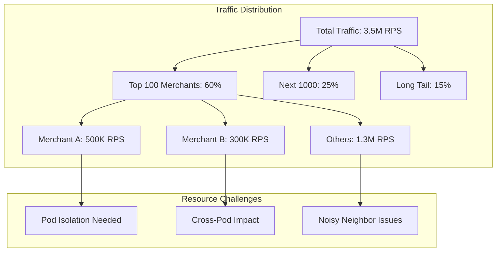

# Episode 27: Shopify's Black Friday Infrastructure - Engineering for the World's Biggest Shopping Day

## Introduction (10 minutes)

**Alex (Host):** Welcome to Architecture Deep Dives! Today, we're diving into one of the most impressive feats of infrastructure engineering - Shopify's Black Friday architecture. I'm here with Jordan Rivera, former Staff Engineer at Shopify who helped architect their burst scaling systems.

**Jordan (Expert):** Excited to be here, Alex. Black Friday is our Super Bowl - it's when everything we've built gets tested at unimaginable scale.

**Alex:** Let's start with those mind-blowing numbers from Black Friday 2023.

**Jordan:** Here's what we handled:
- $4.1 billion in sales
- Peak of 12,000 checkouts per second
- 55 million unique shoppers
- 3.5 million requests per second at peak
- Zero downtime across the entire event

And here's the kicker - we handled 3x our normal yearly peak traffic in just 4 days.

**Alex:** How do you even begin to architect for that kind of burst?

## Part 1: The Architecture Story (1 hour)

### Chapter 1: Understanding the Challenge (15 minutes)

**Jordan:** Black Friday isn't just about scale - it's about unpredictable, bursty scale. Let me paint the picture:

```yaml
# Black Friday Traffic Patterns
normal_day:
  baseline_rps: 50,000
  peak_rps: 150,000
  pattern: gradual

black_friday:
  baseline_rps: 500,000
  peak_rps: 3,500,000
  pattern: instant_spikes
  
challenges:
  - Flash sales creating 100x spikes in seconds
  - Geographic concentration (EST morning rush)
  - Merchant-specific hotspots
  - Cart abandonment/retry storms
```

**Alex:** So you're dealing with 23x your normal peak, but concentrated in specific patterns?

**Jordan:** Exactly. And it's not uniform. One merchant might see 1000x traffic while others see 10x. Here's our multi-tenant challenge:



### Chapter 2: Pod Architecture Evolution (20 minutes)

**Jordan:** Our secret weapon is Pod Architecture - isolated, self-contained units that can scale independently.

```ruby
# Pod Architecture Implementation
module Shopify
  class Pod
    attr_reader :id, :region, :capacity
    
    def initialize(pod_config)
      @id = pod_config[:id]
      @region = pod_config[:region]
      @shards = pod_config[:shards] # 1-128 shards per pod
      @capacity = calculate_capacity
      @components = initialize_components
    end
    
    private
    
    def initialize_components
      {
        web_tier: WebCluster.new(
          nodes: dynamic_node_count,
          auto_scaling: true,
          burst_multiplier: 10
        ),
        
        cache_tier: RedisCluster.new(
          mode: :cluster,
          shards: @shards * 4,
          memory_gb: @shards * 16,
          eviction_policy: :lfu
        ),
        
        database: MySQLCluster.new(
          primary: 1,
          replicas: calculate_replicas,
          vitess_sharding: true,
          shard_count: @shards
        ),
        
        job_queue: KafkaCluster.new(
          brokers: @shards / 4,
          partitions: @shards * 32,
          replication_factor: 3
        )
      }
    end
    
    def calculate_replicas
      base_replicas = 3
      black_friday_multiplier = 5
      base_replicas * (is_black_friday? ? black_friday_multiplier : 1)
    end
  end
end
```

**Alex:** So each pod is completely self-sufficient?

**Jordan:** Yes, and here's the critical part - pod assignment strategy:

```ruby
# Intelligent Pod Assignment
class PodAssigner
  def assign_shop(shop)
    if shop.is_flash_sale_merchant?
      assign_to_burst_pod(shop)
    elsif shop.expected_black_friday_traffic > ISOLATION_THRESHOLD
      assign_to_dedicated_pod(shop)
    else
      assign_to_shared_pod(shop)
    end
  end
  
  private
  
  def assign_to_burst_pod(shop)
    # Burst pods have 10x normal capacity
    # Pre-warmed before flash sales
    burst_pods = Pod.where(type: :burst, status: :ready)
    
    pod = burst_pods.with_lowest_load
    pod.assign_shop(shop, 
      isolation_level: :full,
      resource_guarantee: :dedicated,
      burst_capacity: calculate_burst_needs(shop)
    )
  end
  
  def calculate_burst_needs(shop)
    historical_peak = shop.max_traffic_last_year
    growth_factor = 1.5
    safety_margin = 2.0
    
    historical_peak * growth_factor * safety_margin
  end
end
```

### Chapter 3: Flash Sale Architecture (15 minutes)

**Jordan:** Flash sales are the ultimate test. Imagine 500,000 people trying to buy 1,000 items in 10 seconds.

```ruby
# Flash Sale Handling System
class FlashSaleOrchestrator
  def prepare_flash_sale(sale_config)
    # Step 1: Pre-warm infrastructure
    burst_pod = provision_burst_pod(sale_config)
    
    # Step 2: Pre-load inventory into memory
    preload_inventory(sale_config, burst_pod)
    
    # Step 3: Configure queue fairness
    setup_fair_queuing(sale_config)
    
    # Step 4: Enable protection mechanisms
    enable_circuit_breakers(burst_pod)
    enable_rate_limiting(sale_config)
    
    # Step 5: Pre-generate static content
    pre_render_pages(sale_config)
  end
  
  private
  
  def preload_inventory(sale_config, pod)
    # Load entire inventory into Redis
    inventory_data = sale_config.inventory_items.map do |item|
      {
        id: item.id,
        available: item.quantity,
        price: item.flash_price,
        limit_per_customer: item.purchase_limit
      }
    end
    
    # Distributed locking for inventory
    pod.redis_cluster.multi do |redis|
      inventory_data.each do |item|
        redis.hset("flash_sale:#{sale_config.id}:inventory", 
                  item[:id], item[:available])
        redis.setex("flash_sale:#{sale_config.id}:item:#{item[:id]}", 
                   sale_config.duration, item.to_json)
      end
    end
  end
  
  def setup_fair_queuing(sale_config)
    QueueManager.configure(
      sale_id: sale_config.id,
      algorithm: :weighted_fair_queuing,
      max_queue_size: sale_config.expected_demand * 3,
      timeout_seconds: 300,
      position_updates: true
    )
  end
end
```

**Alex:** How do you handle the thundering herd when a sale starts?

**Jordan:** Multiple layers of protection:

```ruby
# Thundering Herd Protection
class TrafficShaper
  def handle_flash_sale_start(request)
    # Layer 1: Edge rate limiting
    return rate_limit_response if edge_rate_exceeded?(request)
    
    # Layer 2: Probabilistic admission
    return queue_response unless should_admit?(request)
    
    # Layer 3: Inventory reservation
    reservation = try_reserve_inventory(request)
    return sold_out_response unless reservation
    
    # Layer 4: Checkout funnel
    enter_checkout_funnel(request, reservation)
  end
  
  private
  
  def should_admit?(request)
    # Probabilistic admission control
    current_load = Pod.current.load_percentage
    admission_probability = calculate_admission_rate(current_load)
    
    rand < admission_probability
  end
  
  def try_reserve_inventory(request)
    # Lua script for atomic inventory check and reserve
    redis_script = <<-LUA
      local available = redis.call('hget', KEYS[1], ARGV[1])
      if tonumber(available) > 0 then
        redis.call('hincrby', KEYS[1], ARGV[1], -1)
        redis.call('setex', KEYS[2], 300, ARGV[2])
        return 1
      else
        return 0
      end
    LUA
    
    result = redis.eval(
      redis_script,
      keys: ["inventory:#{request.sale_id}", "reservation:#{request.session_id}"],
      argv: [request.item_id, request.to_json]
    )
    
    result == 1 ? Reservation.new(request) : nil
  end
end
```

### Chapter 4: Global Load Balancing (10 minutes)

**Jordan:** With merchants worldwide, we need intelligent geographic distribution:

```yaml
# Global Infrastructure Layout
regions:
  north_america:
    pods: 45
    data_centers: 3
    edge_locations: 15
    capacity_multiplier: 3.0  # For Black Friday
    
  europe:
    pods: 30
    data_centers: 2
    edge_locations: 12
    capacity_multiplier: 2.5
    
  asia_pacific:
    pods: 25
    data_centers: 2
    edge_locations: 10
    capacity_multiplier: 2.0

load_balancing:
  algorithm: geo_aware_least_loaded
  health_check_interval: 1s
  failover_time: <3s
  cross_region_allowed: true
  latency_threshold: 50ms
```

## Part 2: Implementation Deep Dive (1 hour)

### Chapter 5: Pre-Black Friday Preparation (20 minutes)

**Jordan:** Preparation starts 3 months before Black Friday. Here's our runbook:

```ruby
# Black Friday Preparation Pipeline
class BlackFridayPrep
  def three_months_before
    # Capacity planning
    capacity_model = CapacityPlanner.new(
      last_year_peak: 2_500_000,
      growth_rate: 1.4,
      safety_factor: 1.5
    )
    
    required_capacity = capacity_model.calculate
    provision_resources(required_capacity)
  end
  
  def two_months_before
    # Load testing at scale
    LoadTestOrchestrator.run(
      scenario: :black_friday_2024,
      target_rps: 4_000_000,
      duration: 4.days,
      traffic_pattern: :realistic_burst
    )
  end
  
  def one_month_before
    # Game day simulations
    scenarios = [
      :normal_black_friday,
      :database_failure,
      :region_outage,
      :ddos_during_peak,
      :payment_provider_issues
    ]
    
    scenarios.each do |scenario|
      GameDaySimulator.run(scenario)
    end
  end
  
  def one_week_before
    # Final preparations
    freeze_deployments
    pre_warm_caches
    verify_runbooks
    staff_war_room
  end
end
```

**Alex:** Tell me about those game day simulations.

**Jordan:** We simulate everything that could go wrong:

```ruby
# Chaos Engineering for Black Friday
class GameDaySimulator
  def simulate_region_outage
    # Suddenly lose 33% of capacity during peak
    target_region = :us_east_1
    
    ChaosMonkey.fail_region(target_region) do
      # Monitor failover
      assert_metric(:failover_time) < 3.seconds
      assert_metric(:failed_requests_percentage) < 0.1
      assert_metric(:revenue_impact) < 0.01
      
      # Verify pod redistribution
      remaining_regions.each do |region|
        assert region.load < 0.8
        assert region.response_time_p99 < 500.ms
      end
    end
  end
  
  def simulate_payment_provider_issues
    # Payment provider degradation during checkout
    PaymentProviderMock.inject_latency(5.seconds, probability: 0.3)
    PaymentProviderMock.inject_failures(probability: 0.1)
    
    # Verify circuit breakers and fallbacks
    assert_behavior :circuit_breaker_opens
    assert_behavior :fallback_to_secondary_provider
    assert_metric(:checkout_success_rate) > 0.95
  end
end
```

### Chapter 6: Real-Time Monitoring and Response (20 minutes)

**Jordan:** During Black Friday, our war room looks like NASA mission control:

```ruby
# Real-Time Monitoring Dashboard
class BlackFridayDashboard
  def critical_metrics
    {
      # Business metrics
      revenue_per_second: gauge(:revenue_rate),
      checkouts_per_second: gauge(:checkout_rate),
      conversion_rate: gauge(:conversion_percentage),
      
      # System metrics
      total_rps: gauge(:request_rate),
      error_rate: gauge(:error_percentage),
      p99_latency: histogram(:response_time, :p99),
      
      # Infrastructure metrics
      pod_utilization: heat_map(:pod_load),
      database_lag: gauge(:replication_lag),
      cache_hit_rate: gauge(:cache_hits),
      
      # Predictive metrics
      capacity_runway: time_until_saturation,
      projected_peak: ml_traffic_prediction,
      anomaly_score: anomaly_detection_score
    }
  end
  
  def automated_responses
    {
      high_error_rate: -> { 
        trigger_circuit_breakers
        increase_cache_ttl
        enable_read_only_mode
      },
      
      approaching_capacity: -> {
        provision_burst_pods
        enable_aggressive_caching
        defer_non_critical_jobs
      },
      
      database_lag_detected: -> {
        route_reads_to_replicas
        pause_analytics_writes
        enable_write_coalescing
      }
    }
  end
end
```

**Alex:** What's the most critical metric you watch?

**Jordan:** Checkout success rate. Everything else can degrade, but checkouts must work:

```ruby
# Checkout Protection System
class CheckoutProtector
  SACRED_PATH = '/checkout'
  
  def protect_checkout_path
    # Dedicated resources for checkout
    allocate_reserved_capacity(SACRED_PATH, percentage: 30)
    
    # Prioritized queuing
    configure_priority_queue(SACRED_PATH, priority: :highest)
    
    # Isolated database connections
    reserve_db_connections(SACRED_PATH, count: 1000)
    
    # Fallback payment processing
    enable_payment_fallbacks([
      :stripe,
      :paypal,
      :shop_pay,
      :offline_processing
    ])
  end
  
  def monitor_checkout_health
    every(1.second) do
      success_rate = calculate_checkout_success_rate
      
      if success_rate < 0.99
        escalate_immediately
        activate_checkout_protection_mode
      elsif success_rate < 0.995
        alert_on_call_team
        prepare_mitigation_measures
      end
    end
  end
end
```

### Chapter 7: Database Scaling Strategies (20 minutes)

**Jordan:** The database is always the hardest part to scale. Here's how we handle it:

```ruby
# Vitess Sharding Configuration
class DatabaseShardingStrategy
  def configure_for_black_friday
    # Merchant-based sharding
    sharding_config = {
      shard_key: :shop_id,
      shard_count: 128,
      replication_factor: 5,  # Extra replicas for Black Friday
      
      distribution_strategy: :consistent_hashing,
      rebalancing: :automatic,
      
      hot_shard_detection: {
        enabled: true,
        threshold_qps: 10_000,
        auto_split: true
      }
    }
    
    VitessCluster.reconfigure(sharding_config)
  end
  
  def handle_hot_shards
    # Real-time shard splitting
    hot_shard_monitor = HotShardDetector.new(
      sample_interval: 10.seconds,
      detection_window: 1.minute
    )
    
    hot_shard_monitor.on_hot_shard do |shard|
      if shard.can_split?
        perform_live_shard_split(shard)
      else
        add_read_replicas(shard, count: 3)
        enable_query_caching(shard)
      end
    end
  end
  
  private
  
  def perform_live_shard_split(shard)
    # Split without downtime
    new_shards = shard.split(
      strategy: :range_based,
      split_points: calculate_optimal_splits(shard)
    )
    
    # Gradually migrate traffic
    traffic_migrator = TrafficMigrator.new(
      source: shard,
      destinations: new_shards,
      migration_rate: 0.1  # 10% per minute
    )
    
    traffic_migrator.migrate
  end
end
```

**Alex:** How do you handle the read/write split during peak load?

**Jordan:** Aggressive read optimization and write coalescing:

```ruby
# Read/Write Optimization
class DatabaseOptimizer
  def optimize_for_burst_traffic
    # Read optimization
    configure_read_routing(
      replica_lag_threshold: 1.second,
      sticky_sessions: true,
      cache_aside_pattern: true
    )
    
    # Write optimization
    enable_write_batching(
      batch_size: 100,
      batch_timeout: 50.ms,
      coalesce_updates: true
    )
    
    # Query optimization
    enable_query_rewriting(
      denormalize_hot_paths: true,
      materialized_view_routing: true,
      query_result_caching: true
    )
  end
  
  def implement_write_behind_cache
    # Defer non-critical writes
    WriteBehindCache.configure(
      cache_size: 10_000_000,
      flush_interval: 5.seconds,
      failure_recovery: :write_to_queue
    )
    
    # Priority-based write scheduling
    WriteScheduler.configure(
      priorities: {
        checkout: :immediate,
        inventory: :immediate,
        analytics: :deferred,
        logs: :best_effort
      }
    )
  end
end
```

## Part 3: Production War Stories (40 minutes)

### Chapter 8: Black Friday 2019 - The Payment Provider Meltdown (15 minutes)

**Jordan:** Let me tell you about Black Friday 2019. 6 AM EST, traffic spiking beautifully, then our primary payment provider starts failing.

**Alex:** How bad was it?

**Jordan:** 40% of checkouts failing. Here's what happened:

```ruby
# The Incident Timeline
incident_2019 = {
  "06:00" => "Black Friday sales begin, normal spike",
  "06:15" => "Payment provider latency increases to 3s",
  "06:18" => "Circuit breakers start opening",
  "06:20" => "40% checkout failure rate",
  "06:21" => "War room activated",
  "06:25" => "Fallback providers activated",
  "06:30" => "Custom payment queue implemented",
  "06:45" => "Failure rate down to 5%",
  "07:00" => "Full recovery"
}

# The Emergency Fix
class EmergencyPaymentQueue
  def initialize
    @queue = Redis.new
    @processors = []
    spin_up_processors
  end
  
  def handle_payment(payment_request)
    # Add to persistent queue
    @queue.lpush("payment_queue", payment_request.to_json)
    
    # Return immediate response
    {
      status: 'processing',
      queue_id: generate_queue_id,
      estimated_time: calculate_wait_time
    }
  end
  
  private
  
  def spin_up_processors
    100.times do
      @processors << Thread.new do
        process_payments_with_retry
      end
    end
  end
  
  def process_payments_with_retry
    loop do
      payment = @queue.brpop("payment_queue")
      
      retry_with_backoff(max_attempts: 5) do
        result = try_payment_providers(payment)
        notify_customer(result)
      end
    end
  end
end
```

**Jordan:** We saved Black Friday by turning synchronous payments into async with aggressive retries.

### Chapter 9: Black Friday 2021 - The Shard Explosion (15 minutes)

**Jordan:** 2021 taught us about hot shard management. One merchant announced a surprise celebrity collaboration.

```ruby
# The Hot Shard Incident
class HotShardIncident2021
  def timeline
    {
      "09:00" => "Normal Black Friday traffic",
      "09:30" => "Celebrity tweets about surprise drop",
      "09:31" => "Merchant shard hits 50K QPS",
      "09:32" => "Shard CPU at 95%",
      "09:33" => "Queries start timing out",
      "09:34" => "Cascading failures begin"
    }
  end
  
  def emergency_response
    # Step 1: Immediate isolation
    isolate_hot_shard(shard_id: 'shard-042')
    
    # Step 2: Emergency read scaling
    add_emergency_replicas(count: 10)
    
    # Step 3: Query result caching
    enable_aggressive_caching(ttl: 60.seconds)
    
    # Step 4: Live shard splitting
    perform_emergency_split
  end
  
  def perform_emergency_split
    # Split the hot shard while serving traffic
    splitter = LiveShardSplitter.new(
      source_shard: 'shard-042',
      split_factor: 4  # Split into 4 shards
    )
    
    splitter.execute_split do |progress|
      # Gradually move traffic during split
      if progress.percentage < 50
        route_writes_to_source
        distribute_reads([source, *destinations])
      else
        distribute_writes(destinations)
        distribute_reads(destinations)
      end
    end
  end
end
```

### Chapter 10: Black Friday 2023 - Breaking All Records (10 minutes)

**Jordan:** 2023 was our masterpiece. Everything we'd learned came together:

```yaml
# Black Friday 2023 Architecture
scale_achieved:
  peak_checkouts_per_second: 12,000
  peak_requests_per_second: 3,500,000
  total_pods: 150
  active_regions: 8
  database_shards: 512
  cache_nodes: 2,000
  
optimizations_deployed:
  - Predictive pod pre-warming
  - AI-based traffic prediction
  - Automated shard rebalancing
  - Multi-tier caching strategy
  - Edge compute for static content
  - Queue fairness algorithms
  
results:
  availability: 99.99%
  checkout_success_rate: 99.7%
  p99_latency: 145ms
  revenue_processed: $4.1B
```

## Part 4: Modern Patterns and Future (30 minutes)

### Chapter 11: Edge Computing Integration (10 minutes)

**Jordan:** We're moving more logic to the edge:

```javascript
// Cloudflare Worker for Edge Processing
export default {
  async fetch(request, env) {
    const url = new URL(request.url);
    
    // Handle flash sale queuing at edge
    if (url.pathname.includes('/flash-sale')) {
      return handleFlashSaleAtEdge(request, env);
    }
    
    // Cache personalized content
    if (url.pathname.includes('/product')) {
      return servePersonalizedCache(request, env);
    }
    
    // Default origin pass-through
    return fetch(request);
  }
};

async function handleFlashSaleAtEdge(request, env) {
  const saleId = extractSaleId(request.url);
  const position = await env.QUEUE.addToQueue(saleId, request);
  
  if (position > MAX_QUEUE_SIZE) {
    return new Response('Sale at capacity', { status: 503 });
  }
  
  return new Response(JSON.stringify({
    queued: true,
    position: position,
    estimatedWait: position * AVG_PROCESS_TIME
  }), {
    headers: { 'Content-Type': 'application/json' }
  });
}
```

### Chapter 12: Machine Learning for Capacity Planning (10 minutes)

**Jordan:** ML has revolutionized our capacity planning:

```python
# Traffic Prediction Model
class BlackFridayPredictor:
    def __init__(self):
        self.model = self.load_ensemble_model()
        self.feature_pipeline = self.build_feature_pipeline()
    
    def predict_traffic_pattern(self, merchant_id, lookahead_hours=24):
        features = self.extract_features(merchant_id)
        
        # Features include:
        # - Historical Black Friday patterns
        # - Current year growth trends  
        # - Marketing campaign data
        # - Social media sentiment
        # - Competitor activity
        # - Weather patterns
        
        predictions = self.model.predict(
            features,
            horizon=lookahead_hours * 60  # Minute-level predictions
        )
        
        return self.add_confidence_intervals(predictions)
    
    def recommend_pod_allocation(self, predictions):
        recommendations = []
        
        for merchant_id, traffic_prediction in predictions.items():
            peak_traffic = traffic_prediction.max()
            burst_factor = peak_traffic / traffic_prediction.mean()
            
            if burst_factor > 10:
                recommendations.append({
                    'merchant_id': merchant_id,
                    'pod_type': 'dedicated_burst',
                    'pre_warm_time': self.calculate_prewarm_time(traffic_prediction),
                    'capacity_multiplier': math.ceil(burst_factor / 5)
                })
        
        return recommendations
```

### Chapter 13: Workshop - Design Your Black Friday System (10 minutes)

**Alex:** Let's do a practical exercise. You're building a Black Friday system that needs to handle:
- 5 million users
- 100,000 checkouts per minute peak
- Flash sales with 10x instant spikes
- Global distribution across 3 regions

**Jordan:** Here's the framework:

```yaml
# Black Friday Architecture Workshop
exercise:
  requirements:
    - 5M users (1M concurrent)
    - 100K checkouts/minute peak
    - 10x flash sale spikes
    - 3 regions (US, EU, APAC)
    
  design_decisions:
    1. Calculate infrastructure needs:
       - Requests per second?
       - Database IOPS?
       - Cache memory needed?
       - Network bandwidth?
    
    2. Design pod architecture:
       - How many pods?
       - Shard strategy?
       - Isolation levels?
    
    3. Plan burst capacity:
       - Pre-warming strategy?
       - Queue management?
       - Circuit breakers?
    
    4. Implement monitoring:
       - Key metrics?
       - Alert thresholds?
       - Runbook triggers?
```

## Part 5: Interactive Exercises (20 minutes)

### Exercise 1: Capacity Planning Calculator

**Jordan:** Try calculating capacity for your system:

```python
def calculate_black_friday_capacity(
    normal_peak_rps=10000,
    black_friday_multiplier=25,
    flash_sale_multiplier=10,
    regions=3
):
    # Base capacity
    base_capacity = normal_peak_rps * black_friday_multiplier
    
    # Burst capacity for flash sales
    burst_capacity = base_capacity * flash_sale_multiplier
    
    # Infrastructure requirements
    requirements = {
        'web_servers': math.ceil(base_capacity / 1000),  # 1K RPS per server
        'cache_memory_gb': math.ceil(base_capacity / 100),  # 100 RPS per GB
        'database_iops': base_capacity * 10,  # 10 IOPS per request
        'network_gbps': math.ceil(base_capacity * 1_000 / 1_000_000_000),  # 1KB per request
        
        'burst_pods': math.ceil(burst_capacity / 50_000),  # 50K RPS per pod
        'total_cost_usd': calculate_cost(base_capacity, burst_capacity, regions)
    }
    
    return requirements
```

### Exercise 2: Build a Flash Sale Simulator

**Jordan:** Implement a basic flash sale handler:

```ruby
class FlashSaleSimulator
  def initialize(inventory_count, expected_users)
    @inventory = inventory_count
    @users = expected_users
    @sold = 0
    @queue = []
  end
  
  def simulate_sale
    # Your implementation here:
    # 1. Handle user arrivals
    # 2. Implement fair queuing
    # 3. Process checkouts
    # 4. Handle inventory depletion
    # 5. Return metrics
  end
end

# Test your implementation
simulator = FlashSaleSimulator.new(
  inventory_count: 1000,
  expected_users: 50000
)

results = simulator.simulate_sale
puts "Conversion rate: #{results[:conversion_rate]}"
puts "Average wait time: #{results[:avg_wait_time]}"
puts "Fairness score: #{results[:fairness_score]}"
```

## Conclusion (10 minutes)

**Alex:** Jordan, what's the most important lesson from building Black Friday infrastructure?

**Jordan:** Expect the unexpected, but prepare for everything. Our three pillars:

1. **Over-provision intelligently** - Not everywhere, but where it matters
2. **Fail fast and recover faster** - Circuit breakers and fallbacks everywhere
3. **Make checkouts sacred** - Everything else can degrade, but checkouts must work

**Alex:** Final thoughts for engineers building high-scale systems?

**Jordan:** Test at scale, not just for scale. There's a huge difference between handling 1M requests spread over an hour versus 1M requests in 60 seconds. Black Friday teaches you that burst patterns break different things than sustained load.

And remember - every optimization you make during Black Friday pays dividends year-round. The infrastructure we built to handle 12,000 checkouts per second makes our normal 400 checkouts per second feel effortless.

**Alex:** Thanks Jordan! Listeners, check out our show notes for the complete code samples and architecture diagrams. Next week, we're diving into Cloudflare's edge computing architecture. How do you handle 71 million requests per second during a DDoS attack? Find out next time!

## Show Notes & Resources

### Key Metrics from Black Friday 2023
- Peak checkouts: 12,000/second
- Peak requests: 3.5M/second  
- Total revenue: $4.1B
- Availability: 99.99%

### Architecture Patterns Covered
1. Pod Architecture for multi-tenant isolation
2. Burst capacity management
3. Flash sale queue fairness
4. Database sharding with Vitess
5. Edge computing integration
6. ML-based capacity planning

### Code Repository
github.com/shopify/black-friday-architecture

### References
- "Shopify's Architecture to Handle World's Biggest Flash Sales" - Shopify Engineering Blog
- "Pod Architecture: Lessons from Black Friday" - SREcon 2023
- "Scaling Databases for Burst Traffic" - Vitess Case Study

### Engineering Blog Posts
- "How We Survived Black Friday 2023"
- "Flash Sale Engineering: The Queue Fairness Problem"  
- "Predicting Black Friday with Machine Learning"
- "Edge Computing for E-commerce Scale"

---

*Next Episode: Cloudflare's Edge Computing Revolution - From 71M requests/second DDoS attacks to Workers at the edge*