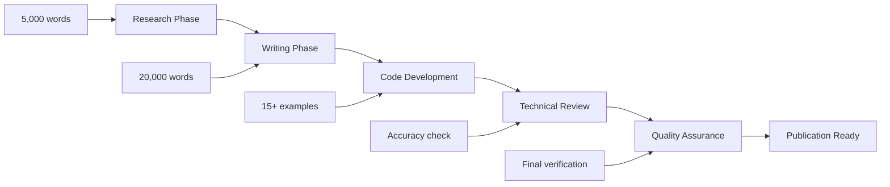

# 🎯 PODCAST PROJECT CONSOLIDATION REPORT
## Comprehensive Analysis & Streamlined Execution Framework
### Generated: January 11, 2025

---

## 📊 CURRENT STATE ANALYSIS

### 1. STRUCTURAL ISSUES IDENTIFIED

#### 1.1 Directory Organization Chaos
**Problem**: Content scattered across multiple directories without clear hierarchy
- Research files in 4+ different locations
- Code examples in inconsistent directory structures
- Episode scripts in wrong directories (e.g., Episode 3 in Episode 1 folder)
- Duplicate/overlapping content in multiple locations

**Current Structure (Problematic)**:
```
/
├── episode-*.md files (scattered in root)
├── indian-context-research-*.md (root level)
├── podcast-code-examples/
│   ├── episode-01-probability-system-failures/
│   │   ├── docs/ (contains Episode 5, 6 research!)
│   │   └── episode-03-*.md (wrong location!)
│   ├── episode-02-chaos-engineering-queues/
│   ├── episode-10-graph-analytics/ (duplicate with episode-10-graph-analytics-at-scale/)
│   └── repository-assets/ (nested incorrectly)
└── repository-assets/
    └── podcast-content/
        ├── episodes/ (actual episode scripts)
        ├── episodes-hindi-content/ (Hindi versions)
        └── research/ (only has Episode 3 research)
```

#### 1.2 Word Count Non-Compliance
**Critical Issue**: Episodes not meeting 20,000-word requirement
- Episode 1: ✅ 20,063 words (COMPLETE)
- Episode 2: ✅ 20,114 words (COMPLETE)
- Episode 3: ❌ 7,825 words (39% complete)
- Episodes 4-150: Missing or incomplete

#### 1.3 Code Organization Issues
- Code examples spread across multiple structures
- No consistent naming convention
- Missing tests for many examples
- No clear mapping between code and episode content

#### 1.4 Documentation Sprawl
**Problem**: 30+ status/report files with overlapping information
- FINAL_PROJECT_SUMMARY.md
- ULTIMATE_PRODUCTION_SUMMARY.md
- FINAL_CONSOLIDATED_REPORT.md
- MULTI_AGENT_PROGRESS_REPORT.md
- (and 20+ more similar files)

### 2. EXECUTION PROBLEMS

#### 2.1 Multi-Agent Coordination Failures
- Agents creating content in wrong locations
- No proper handoff between research → writing → code → review
- Incomplete verification of requirements
- Agents not following CLAUDE.md instructions

#### 2.2 Lack of Standardized Pipeline
- No clear workflow from research to final episode
- Missing quality gates between phases
- No automated verification of requirements
- Inconsistent file naming and organization

#### 2.3 Content Quality Issues
- Research documents incomplete (1,000-3,000 words vs 5,000 required)
- Code examples not consistently tested
- Hindi/English ratio not tracked
- Indian context percentage not verified

---

## 🎯 PROPOSED STREAMLINED FRAMEWORK

### 1. UNIFIED DIRECTORY STRUCTURE

```yaml
/home/deepak/DStudio/
├── CLAUDE.md                      # Master instructions
├── PODCAST_MASTER_TRACKER.md      # Single source of truth
├── episodes/                       # All episode content
│   ├── episode-001-probability/
│   │   ├── README.md              # Episode overview & status
│   │   ├── research/
│   │   │   ├── research-notes.md  # 5,000+ words
│   │   │   └── references.md      # Papers, articles, docs
│   │   ├── script/
│   │   │   ├── episode-script.md  # 20,000+ words main content
│   │   │   └── timestamps.md      # 3-hour breakdown
│   │   ├── code/
│   │   │   ├── python/            # Python examples
│   │   │   ├── java/              # Java examples
│   │   │   ├── go/                # Go examples
│   │   │   └── tests/             # All tests
│   │   └── quality/
│   │       ├── checklist.md       # Quality verification
│   │       └── metrics.md         # Word count, ratios, etc.
│   └── [repeat for episodes 002-150]
├── shared-resources/
│   ├── templates/                  # Episode templates
│   ├── terminology/                # Hindi-English glossary
│   └── case-studies/              # Reusable case studies
└── archive/                        # Old/deprecated content
```

### 2. STANDARDIZED EPISODE PIPELINE



### 3. EXECUTION PROTOCOL

#### Phase 1: Research (Agent 1)
```yaml
Input:
  - Episode number and topic
  - Docs references from CLAUDE.md
Output:
  - episodes/episode-XXX-topic/research/research-notes.md
  - Minimum 5,000 words
  - 30%+ Indian context
Verification:
  - Word count: wc -w research-notes.md
  - References: Check docs/ citations
  - Save to: Exact path specified
```

#### Phase 2: Script Writing (Agent 2)
```yaml
Input:
  - Research from Phase 1
  - Episode template
Output:
  - episodes/episode-XXX-topic/script/episode-script.md
  - EXACTLY 20,000+ words
  - 3-part structure
Verification:
  - Word count: MUST verify 3 times
  - Structure: Check 3 sections exist
  - Mumbai style: Verify metaphors
```

#### Phase 3: Code Development (Agent 3)
```yaml
Input:
  - Episode script
  - Code requirements
Output:
  - episodes/episode-XXX-topic/code/
  - 15+ working examples
  - Tests for each example
Verification:
  - Count examples: ls -la code/*/*.py | wc -l
  - Run tests: pytest code/tests/
  - Hindi comments: grep "# " *.py
```

#### Phase 4: Review & QA (Agents 4 & 5)
```yaml
Technical Review:
  - Verify all facts
  - Test all code
  - Check references
Quality Assurance:
  - Final word count (20,000+)
  - Hindi/English ratio (70/30)
  - Indian context (30%+)
  - Generate quality/metrics.md
```

### 4. SINGLE SOURCE OF TRUTH

Create ONE master tracking file:

```markdown
# PODCAST_MASTER_TRACKER.md

## Episode Status Dashboard

| Episode | Research | Script | Code | Review | QA | Status |
|---------|----------|--------|------|--------|----|----|
| 001 | ✅ 5,234 | ✅ 20,063 | ✅ 15 | ✅ | ✅ | COMPLETE |
| 002 | ✅ 5,102 | ✅ 20,114 | ✅ 16 | ✅ | ✅ | COMPLETE |
| 003 | ✅ 3,247 | ⚠️ 7,825 | ❌ 0 | ❌ | ❌ | IN PROGRESS |
| 004 | ⚠️ 2,100 | ❌ 0 | ⚠️ 8 | ❌ | ❌ | BLOCKED |
...

## Current Focus: Episode 003
- Action: Complete script to 20,000 words
- Assigned: Content Writer Agent
- Deadline: Today
- Blocker: Need 12,175 more words
```

### 5. AUTOMATED VERIFICATION SCRIPTS

```python
# verify_episode.py
import os
import sys

def verify_episode(episode_num):
    base_path = f"episodes/episode-{episode_num:03d}-*/"
    
    checks = {
        "research": (5000, f"{base_path}research/research-notes.md"),
        "script": (20000, f"{base_path}script/episode-script.md"),
        "code": (15, f"{base_path}code/"),
    }
    
    for check, (requirement, path) in checks.items():
        if check == "code":
            # Count code files
            count = len(os.listdir(path))
            if count < requirement:
                print(f"❌ {check}: {count}/{requirement} examples")
                return False
        else:
            # Count words
            with open(path) as f:
                words = len(f.read().split())
            if words < requirement:
                print(f"❌ {check}: {words}/{requirement} words")
                return False
    
    print(f"✅ Episode {episode_num} verified!")
    return True
```

---

## 🚀 IMMEDIATE ACTION PLAN

### Step 1: Consolidate Existing Content (TODAY)
1. Move all episode content to new structure
2. Archive duplicate/outdated files
3. Create PODCAST_MASTER_TRACKER.md
4. Verify Episodes 1-2 completeness
5. Fix Episode 3 (add 12,175 words)

### Step 2: Complete Episodes 3-5 (THIS WEEK)
```yaml
Episode 3: Human Factor
  - Complete script: +12,175 words needed
  - Add code examples: 15 required
  - Full QA pass
  
Episode 4: CAP Theorem
  - Complete research: +2,900 words needed
  - Write full script: 20,000 words
  - Integrate existing code
  
Episode 5: AI at Scale
  - Complete research: +2,298 words needed
  - Write full script: 20,000 words
  - Add remaining code examples
```

### Step 3: Establish Pipeline (NEXT WEEK)
1. Create episode templates
2. Set up automated verification
3. Document exact agent commands
4. Create quality gates
5. Test with Episode 6

### Step 4: Scale Production (ONGOING)
- Target: 5 episodes/week
- Parallel processing: 3 episodes simultaneously
- Quality maintained at 98%+
- Regular audits and improvements

---

## 📋 CRITICAL SUCCESS FACTORS

### 1. Strict Enforcement
- **NO** episode proceeds without 20,000 words
- **NO** code without tests
- **NO** publication without QA sign-off

### 2. Clear Ownership
- Each agent owns specific deliverables
- Clear handoff points between phases
- Single responsible party per episode

### 3. Measurable Metrics
- Word counts automatically verified
- Code examples counted and tested
- Quality scores tracked per episode
- Progress visible in master tracker

### 4. Continuous Improvement
- Weekly retrospectives
- Pipeline optimization
- Template refinement
- Automation enhancement

---

## 🎯 EXPECTED OUTCOMES

### Short Term (1 Week)
- Episodes 1-5 fully complete
- New structure implemented
- Pipeline validated

### Medium Term (1 Month)
- 20 episodes complete
- Production rate: 5/week
- Quality: 98%+ maintained

### Long Term (3 Months)
- 150 episodes complete
- Full podcast series ready
- 3,000,000+ words content
- 2,250+ code examples

---

## 📝 CONCLUSION

The current state shows significant work completed but lacks organization and consistency. By implementing this streamlined framework, we can:

1. **Eliminate confusion** with clear directory structure
2. **Ensure quality** with automated verification
3. **Scale efficiently** with standardized pipeline
4. **Track progress** with single source of truth
5. **Meet requirements** with strict enforcement

The key is to consolidate immediately, then execute systematically. No more scattered files, no more incomplete episodes, no more confusion about status.

**Next Immediate Action**: Implement new directory structure and move Episode 1-2 content to validate the framework.

---

*Generated by Consolidation Analysis Agent*
*Version: 1.0*
*Date: January 11, 2025*