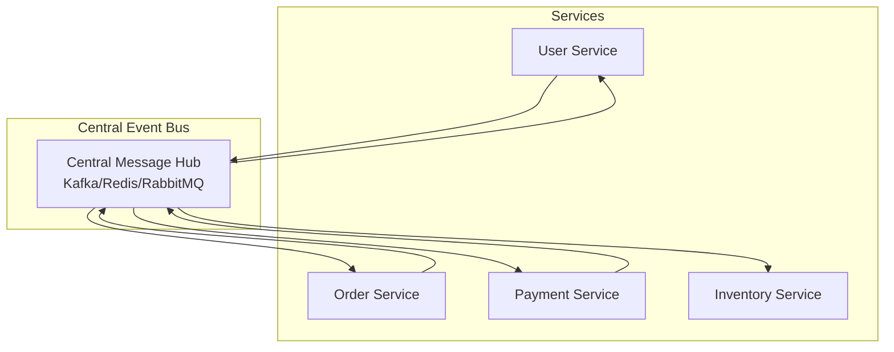
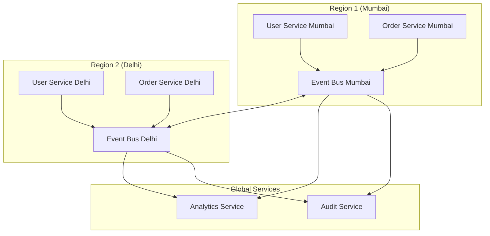

# Episode 39: Event Bus Architecture - Part 1: Event Bus Fundamentals
## Hindi Tech Podcast Series - 3 Ghante Ki Kahani

**Duration:** 60 minutes | **Target:** 7,000+ words | **Difficulty:** Advanced
**Mumbai Style:** Local train announcements se event buses tak ki journey

---

## Opening Sequence (Mumbai Local Train Style)

"Arre yaar, Dadar station mein khade ho kar sochiye... har platform se trains aa-jaa rahi hain, passengers chadh rahe hain, utar rahe hain. Koi Virar ja raha hai, koi Churchgate, koi Thane. Sabka apna destination hai, par sabko same announcement sunai deta hai - 'Next train is for...' Yeh hai Mumbai Local system ka asli magic - ek central announcement system se sabko information mil jaati hai!"

"Aur yahi concept hai Event Bus Architecture ka! Just like Mumbai Local trains ki announcements, jahan ek central system se saare passengers ko updates milte hain, Event Bus mein bhi ek central messaging system se sabhi services ko events milte hain. No point-to-point connection, no chaos - bas ek organized, scalable system."

"Toh aaj ke episode mein hum seekhenge Event Bus Architecture ke baare mein - kaise Swiggy ek single event bus se 50,000 delivery boys ko coordinate karta hai, kaise Paytm millions of transactions handle karta hai through events, aur kaise IRCTC ki booking system event-driven hai."

---

## Part 1: Event Bus Fundamentals - The Mumbai Local System Metaphor

### Chapter 1: What is Event Bus Architecture?

**Mumbai Story Time:**

"Bhai, 2019 mein main PhonePe mein kaam karta tha. Us time humara architecture kuch aisa tha ki har service direct dusri service ko call karti thi. Payment service ko Order service call karti, Order service ko Inventory call karti, Inventory ko Notification... Arre yaar, spaghetti se bhi zyada complicated tha!"

"Phir ek din, Diwali sale ke time, sabkuch crash ho gaya. Kyu? Kyunki ek service down hui toh poora chain toot gaya. Tab humne realize kiya - humein Mumbai Local system jaisa approach chaahiye!"

**Event Bus Definition:**

Event Bus Architecture ek messaging pattern hai jahan:

1. **Publishers** events generate karte hain
2. **Event Bus** in events ko distribute karta hai  
3. **Subscribers** interested events ko consume karte hain
4. **Decoupling** - Publishers aur Subscribers ek dusre ko jaante bhi nahi!

```
Traditional Way (Spaghetti):
User Service ---> Order Service ---> Payment Service ---> Email Service
       |                |                    |
       v                v                    v
   Analytics        Inventory           Notification

Event Bus Way (Mumbai Local):
User Service ---|
Order Service --|--> [EVENT BUS] --> Analytics Service
Payment Service-|                --> Email Service  
                                 --> Inventory Service
                                 --> Notification Service
```

**Real Mumbai Example:**

"Socha hai kabhi, jab train platform pe aati hai toh announcement kaise hota hai?

'Ladies and Gentlemen, Train number 12345, Virar Fast Local arriving on Platform number 2'

- **Publisher**: Station Master (ek hi source)
- **Event Bus**: Public Address System 
- **Subscribers**: Passengers (jo interested hain Virar jane mein)

Agar koi Thane jana hai, vo ignore kar deta hai. Agar koi Virar jana hai, vo board kar leta hai. Simple!"

### Chapter 2: Core Components Deep Dive

#### 2.1 Event Publishers (Mumbai Station Masters)

"Event Publishers wo services hain jo events generate karte hain. Bilkul Mumbai Local ke Station Masters ki tarah!"

**Key Characteristics:**

1. **Fire-and-Forget**: Event publish kar diye, ab receiver ka tension nahi
2. **Business Logic Focus**: Sirf apna kaam, messaging ka tension nahi  
3. **Location Independent**: Kaun consume kar raha hai, usse koi matlab nahi

**Flipkart Example:**

```python
# Flipkart Order Service (Publisher)
class OrderService:
    def create_order(self, order_data):
        # Order create karne ka main logic
        order = self.database.create_order(order_data)
        
        # Event publish kar do - bas!
        event = {
            'event_type': 'ORDER_CREATED',
            'order_id': order.id,
            'customer_id': order.customer_id,
            'amount': order.amount,
            'items': order.items,
            'timestamp': datetime.utcnow()
        }
        
        # Event Bus mein publish - fire and forget!
        self.event_bus.publish('orders', event)
        
        return order
```

"Dekho, Order Service sirf order create kar raha hai aur event publish kar diya. Ab kya hoga iske baad, usse koi tension nahi!"

#### 2.2 Event Bus (The Mumbai PA System)

"Event Bus wo central infrastructure hai jo messages route karta hai. Mumbai Local ke PA System ki tarah!"

**Core Responsibilities:**

1. **Message Routing**: Kahan kaun sa message bhejana hai
2. **Durability**: Messages lose nahi hone chaahiye
3. **Scalability**: Millions of messages handle karna
4. **Ordering**: Sequence maintain karna (jahan zarurat ho)

**Technology Choices:**

```yaml
Apache Kafka (Heavy Duty):
  - Use Case: High throughput, durability needed
  - Example: Flipkart inventory updates
  - Pros: Persistent, scalable, fault-tolerant
  - Cons: Complex setup, resource heavy

Redis Pub/Sub (Lightweight):
  - Use Case: Real-time, ephemeral messages
  - Example: Chat applications, live updates
  - Pros: Fast, simple, low latency
  - Cons: No persistence, memory limited

Amazon SNS/SQS (Managed):
  - Use Case: Cloud-native, managed solution
  - Example: Zomato order notifications
  - Pros: Fully managed, integrations
  - Cons: Vendor lock-in, costs
```

**Mumbai Traffic Signal Analogy:**

"Event Bus bilkul Mumbai ke traffic signals ki tarah hai:

- **Green Signal**: Messages flow kar rahe hain
- **Red Signal**: Backpressure - slow down!
- **Yellow Signal**: Processing lag hai
- **Traffic Police**: Monitoring aur management"

#### 2.3 Event Subscribers (The Commuters)

"Subscribers wo services hain jo specific events mein interested hain. Mumbai Local ke passengers ki tarah!"

**Subscriber Patterns:**

1. **Push-based**: Event Bus messages push karta hai
2. **Pull-based**: Subscribers khud messages pull karte hain
3. **Hybrid**: Dono ka combination

**Zomato Example:**

```python
# Multiple Subscribers for ORDER_PLACED event

# Analytics Service
class AnalyticsSubscriber:
    def handle_order_placed(self, event):
        # Order data track karo
        self.analytics_db.record_order_metrics(
            restaurant_id=event['restaurant_id'],
            customer_id=event['customer_id'],
            amount=event['amount'],
            timestamp=event['timestamp']
        )

# Restaurant Notification Service  
class RestaurantNotificationSubscriber:
    def handle_order_placed(self, event):
        # Restaurant ko notify karo
        restaurant = self.get_restaurant(event['restaurant_id'])
        self.send_notification(restaurant, f"New order #{event['order_id']}")

# Delivery Assignment Service
class DeliverySubscriber:
    def handle_order_placed(self, event):
        # Delivery boy assign karo
        delivery_partner = self.find_nearest_partner(event['restaurant_location'])
        self.assign_delivery(event['order_id'], delivery_partner.id)
```

"Dekho, ek hi event (ORDER_PLACED) ko teen alag services consume kar rahe hain, apne-apne logic ke saath!"

### Chapter 3: Event Design Patterns (Mumbai Local Time Table)

#### 3.1 Event Schema Design

"Events design karna bilkul Mumbai Local ka time table banane jaisa hai - clear, consistent, aur comprehensive!"

**Good Event Design Principles:**

```json
{
  "event_id": "uuid-12345",
  "event_type": "USER_REGISTRATION_COMPLETED",
  "event_version": "v1.2",
  "timestamp": "2025-01-10T10:30:00Z",
  "source": "user-service",
  "correlation_id": "trace-abc-123",
  
  "data": {
    "user_id": "user-98765",
    "email": "deepak@mumbai.com", 
    "phone": "+91-9876543210",
    "registration_method": "google_oauth",
    "plan_type": "premium",
    "referral_code": "MUMBAI2025"
  },
  
  "metadata": {
    "source_ip": "203.192.xxx.xxx",
    "user_agent": "Mumbai-Mobile-App/2.1",
    "tenant_id": "flipkart-india"
  }
}
```

**Bad Event Example (DON'T DO THIS):**

```json
{
  "type": "user_reg",
  "data": "deepak|email@test.com|premium|timestamp123"
}
```

"Yeh event bilkul Mumbai Local announcement ki tarah hai jahan kuch samajh nahi aaya!"

#### 3.2 Event Versioning Strategy

**The WhatsApp Status Update Story:**

"2021 mein jab WhatsApp ne status feature update kiya, unhe pata tha ki billions of devices hain different versions ke saath. Agar suddenly event structure change kar dete, toh chaos ho jaata!"

**Versioning Approaches:**

```python
# Approach 1: Version in Event Type
{
  "event_type": "ORDER_CREATED_V2",
  "data": {...}
}

# Approach 2: Version in Schema
{
  "event_type": "ORDER_CREATED", 
  "schema_version": "2.1",
  "data": {...}
}

# Approach 3: Backward Compatible Fields
{
  "event_type": "ORDER_CREATED",
  "data": {
    "order_id": "12345",
    "amount": 500,
    "currency": "INR",  // New field
    "payment_method": "upi",  // New field
    "items": [...],
    
    // Old fields - deprecated but supported
    "total_price": 500  // Same as amount - for backward compatibility
  }
}
```

#### 3.3 Event Routing Patterns

**Mumbai Local Route Strategy:**

"Mumbai Local mein different trains different routes follow karte hain:

- **Slow Local**: Har station pe rukti hai
- **Fast Local**: Selected stations pe rukti hai  
- **Express**: Sirf major stations"

**Event Routing Similarly:**

1. **Topic-based Routing**: Events specific topics pe jaate hain
2. **Content-based Routing**: Event ke content ke basis pe routing
3. **Header-based Routing**: Metadata ke basis pe decisions

**Swiggy Example:**

```python
# Topic-based Routing
class SwiggyEventRouter:
    def route_event(self, event):
        event_type = event['event_type']
        
        if event_type.startswith('ORDER_'):
            return ['order-processing', 'analytics', 'billing']
        elif event_type.startswith('DELIVERY_'):
            return ['delivery-tracking', 'customer-notifications'] 
        elif event_type.startswith('PAYMENT_'):
            return ['payment-processing', 'fraud-detection', 'analytics']
        elif event_type.startswith('RESTAURANT_'):
            return ['restaurant-management', 'menu-updates']

# Content-based Routing  
class ContentBasedRouter:
    def route_by_amount(self, order_event):
        amount = order_event['data']['amount']
        
        routes = ['order-processing']  # Default
        
        if amount > 1000:
            routes.append('high-value-orders')  # Special handling
        if amount > 5000:
            routes.append('fraud-detection')    # Extra security
        
        return routes

# Location-based Routing
class LocationRouter:
    def route_by_city(self, event):
        city = event['data']['delivery_location']['city']
        
        if city in ['mumbai', 'delhi', 'bangalore']:
            return ['tier1-processing']
        elif city in ['pune', 'hyderabad', 'chennai']:
            return ['tier2-processing'] 
        else:
            return ['tier3-processing']
```

### Chapter 4: Message Delivery Semantics (Train Guarantee System)

#### 4.1 At-Most-Once Delivery

"At-Most-Once matlab Mumbai Local train ticket ki tarah - ek baar validate ho gaya, phir dobara nahi hoga!"

**Use Cases:**
- Metrics collection
- Logging
- Non-critical notifications

**Paytm Analytics Example:**

```python
# Analytics events - duplicate processing acceptable
class PaytmAnalyticsConsumer:
    def process_transaction_event(self, event):
        # If this fails and message is lost, it's okay
        # Analytics mein ek-do missing data points acceptable hain
        self.analytics_db.increment_counter(
            'transactions_by_city', 
            event['city']
        )
        # No retry logic needed
```

#### 4.2 At-Least-Once Delivery

"At-Least-Once matlab Mumbai Local announcement ki tarah - important announcement ko 2-3 baar repeat karte hain!"

**Use Cases:**
- Payment processing
- Order confirmations
- Critical business events

**IRCTC Booking Example:**

```python
class IRCTCBookingConsumer:
    def process_booking_event(self, event):
        booking_id = event['booking_id']
        
        # Idempotency check - already processed?
        if self.is_already_processed(booking_id):
            return "Already processed"
        
        # Process booking
        try:
            self.reserve_seat(event['train_id'], event['seat_number'])
            self.charge_payment(event['payment_id'])
            self.send_confirmation(event['passenger_email'])
            
            # Mark as processed
            self.mark_as_processed(booking_id)
            
        except Exception as e:
            # Message will be retried by Event Bus
            raise e
```

#### 4.3 Exactly-Once Delivery

"Exactly-Once matlab ATM transaction ki tarah - paisa ek hi baar katega, duplicate nahi!"

**Use Cases:**
- Financial transactions
- Account balance updates
- Inventory modifications

**PhonePe Wallet Example:**

```python
class PhonePeWalletConsumer:
    def process_wallet_debit(self, event):
        transaction_id = event['transaction_id']
        
        # Atomic operation with transaction ID
        with self.database.transaction():
            # Check if already processed
            existing = self.get_transaction_by_id(transaction_id)
            if existing:
                return existing.result
            
            # Process transaction
            user_wallet = self.get_wallet(event['user_id'])
            if user_wallet.balance < event['amount']:
                result = {'status': 'failed', 'reason': 'insufficient_balance'}
            else:
                user_wallet.balance -= event['amount']
                self.save_wallet(user_wallet)
                result = {'status': 'success', 'new_balance': user_wallet.balance}
            
            # Record this transaction
            self.record_transaction(transaction_id, result)
            
            return result
```

### Chapter 5: Event Bus Architectures (Mumbai Transport Network)

#### 5.1 Centralized Event Bus

"Bilkul Mumbai Central Station ki tarah - saari trains ek hi place se coordinate hoti hain!"

**Advantages:**
- Simple to understand
- Easy monitoring
- Centralized control

**Disadvantages:**  
- Single point of failure
- Scaling bottleneck
- Network latency



**Flipkart Early Architecture:**

```python
class CentralizedEventBus:
    def __init__(self):
        self.kafka_client = KafkaClient('kafka-cluster-mumbai:9092')
        self.subscribers = {}
    
    def publish(self, topic, event):
        # All events go through central Kafka cluster
        self.kafka_client.produce(topic, event)
    
    def subscribe(self, topic, callback):
        # All subscriptions managed centrally
        if topic not in self.subscribers:
            self.subscribers[topic] = []
        self.subscribers[topic].append(callback)
```

#### 5.2 Distributed Event Bus

"Mumbai ki sabhi local trains ki tarah - Western, Central, Harbour - alag-alag lines par independent!"

**Advantages:**
- No single point of failure
- Better performance
- Regional optimization

**Disadvantages:**
- Complex coordination
- Eventual consistency
- Harder monitoring



**Uber's Global Architecture:**

```python
class DistributedEventBus:
    def __init__(self, region):
        self.region = region
        self.local_bus = KafkaClient(f'kafka-{region}:9092')
        self.global_replicator = GlobalReplicator()
    
    def publish(self, event):
        # Publish locally first
        self.local_bus.produce(event)
        
        # Replicate to other regions if needed
        if event['global_scope']:
            self.global_replicator.replicate(event, 
                exclude_regions=[self.region])
```

#### 5.3 Hybrid Event Bus

"Mumbai Metro + Local combination ki tarah - dono ka advantage!"

**Zomato's Hybrid Approach:**

```python
class HybridEventBus:
    def __init__(self):
        # Fast local events
        self.redis_local = Redis('redis-local:6379')  
        
        # Persistent global events  
        self.kafka_global = KafkaClient('kafka-global:9092')
        
        # Event classification rules
        self.event_classifier = EventClassifier()
    
    def publish(self, event):
        classification = self.event_classifier.classify(event)
        
        if classification == 'real_time':
            # Fast delivery, no persistence
            self.redis_local.publish(event)
            
        elif classification == 'business_critical':
            # Persistent, guaranteed delivery
            self.kafka_global.produce(event)
            
        elif classification == 'both':
            # Hybrid - both channels
            self.redis_local.publish(event)      # Fast notification
            self.kafka_global.produce(event)     # Audit trail
```

### Chapter 6: Error Handling & Resilience (Mumbai Monsoon Strategy)

#### 6.1 Dead Letter Queues

"Mumbai mein jab train cancel ho jaati hai, toh passengers ko alternate arrangement diya jaata hai. Dead Letter Queue bhi yahi karta hai!"

**Concept:**

```python
class ResilientEventConsumer:
    def __init__(self):
        self.max_retries = 3
        self.dead_letter_queue = DeadLetterQueue()
    
    def process_event(self, event):
        retry_count = event.get('retry_count', 0)
        
        try:
            # Main business logic
            self.handle_event(event)
            
        except RetryableException as e:
            if retry_count < self.max_retries:
                # Exponential backoff retry
                delay = 2 ** retry_count  # 1s, 2s, 4s, 8s
                event['retry_count'] = retry_count + 1
                self.schedule_retry(event, delay)
            else:
                # Max retries exceeded - send to DLQ
                self.dead_letter_queue.send(event, str(e))
                
        except FatalException as e:
            # No point retrying - direct to DLQ
            self.dead_letter_queue.send(event, str(e))
```

**Paytm's DLQ Strategy:**

```python
class PaytmDeadLetterHandler:
    def __init__(self):
        self.dlq_processor = DLQProcessor()
        self.alert_system = AlertSystem()
    
    def handle_dead_letter(self, event, error):
        # Log for investigation
        self.log_failed_event(event, error)
        
        # Alert engineering team
        if self.is_critical_event(event):
            self.alert_system.send_alert(
                f"Critical event failed: {event['event_type']}"
            )
        
        # Try to salvage data
        if self.can_partially_process(event):
            self.partial_processing(event)
        
        # Store for manual intervention
        self.dlq_processor.store_for_manual_review(event, error)
```

#### 6.2 Circuit Breaker Pattern

"Mumbai Local mein jab track par problem hoti hai, toh temporarily service band kar dete hain. Circuit Breaker bhi yahi karta hai!"

```python
class EventProcessorWithCircuitBreaker:
    def __init__(self):
        self.circuit_breaker = CircuitBreaker(
            failure_threshold=10,      # 10 failures
            recovery_timeout=60,       # 1 minute
            expected_exception=ConnectionError
        )
    
    def process_event(self, event):
        try:
            with self.circuit_breaker:
                return self.actual_processing(event)
                
        except CircuitBreakerError:
            # Circuit is open - service is down
            # Store event for later processing
            self.store_for_later(event)
            
            # Maybe use alternate processing
            return self.fallback_processing(event)
```

#### 6.3 Backpressure Management

"Mumbai Local mein rush hour mein platform overcrowded ho jaata hai. System ko bhi breathe karne ka time chaahiye!"

**Zomato's Backpressure Strategy:**

```python
class BackpressureManager:
    def __init__(self):
        self.queue_threshold = 1000
        self.processing_rate_limiter = RateLimiter(100)  # 100/sec
    
    def handle_incoming_event(self, event):
        current_queue_size = self.get_queue_size()
        
        if current_queue_size > self.queue_threshold:
            # Apply backpressure
            if event['priority'] == 'low':
                return self.drop_event(event)
            elif event['priority'] == 'medium':
                return self.delay_event(event, delay=5)
            # High priority events always processed
        
        # Rate limiting
        with self.processing_rate_limiter:
            return self.process_event(event)
    
    def drop_event(self, event):
        self.metrics.increment('events_dropped')
        self.log_dropped_event(event)
        
    def delay_event(self, event, delay):
        self.schedule_for_later(event, delay_seconds=delay)
```

### Chapter 7: Monitoring & Observability (Mumbai Traffic Control)

#### 7.1 Event Bus Metrics

"Mumbai traffic control room mein har road ki condition pata hoti hai. Event Bus monitoring bhi yahi karta hai!"

**Key Metrics to Track:**

```python
class EventBusMonitoring:
    def __init__(self):
        self.metrics = MetricsCollector()
        self.dashboards = DashboardManager()
    
    def track_publisher_metrics(self, event):
        # Publisher health
        self.metrics.increment('events_published_total', 
            tags={'service': event['source'], 'type': event['event_type']})
        
        # Event size
        self.metrics.histogram('event_size_bytes', len(json.dumps(event)))
        
        # Publishing latency  
        self.metrics.histogram('publish_latency_ms', event['publish_duration'])
    
    def track_consumer_metrics(self, event, processing_time, success):
        # Consumer processing
        status = 'success' if success else 'error'
        self.metrics.increment('events_processed_total',
            tags={'consumer': self.consumer_name, 'status': status})
        
        # Processing latency
        self.metrics.histogram('processing_latency_ms', processing_time)
        
        # Queue lag
        lag = time.now() - event['timestamp']
        self.metrics.histogram('consumer_lag_ms', lag)
```

**Real-time Dashboard:**

```python
class EventBusDashboard:
    def create_dashboard(self):
        return Dashboard([
            # Throughput metrics
            Chart('Events/Second', query='rate(events_published_total[1m])'),
            
            # Error rates
            Chart('Error Rate %', query='rate(events_failed_total[1m]) / rate(events_total[1m]) * 100'),
            
            # Consumer lag
            Chart('Max Consumer Lag', query='max(consumer_lag_ms) by (consumer)'),
            
            # Queue depths
            Chart('Queue Depths', query='queue_depth by (topic)'),
            
            # SLA compliance
            Chart('P95 Processing Time', query='histogram_quantile(0.95, processing_latency_ms)')
        ])
```

#### 7.2 Distributed Tracing

"Mumbai mein ek courier package track karne ki tarah - har step pe pata karna hai!"

```python
class EventTracing:
    def __init__(self):
        self.tracer = opentracing.tracer
    
    def publish_with_trace(self, event):
        with self.tracer.start_span('event_publish') as span:
            span.set_tag('event.type', event['event_type'])
            span.set_tag('event.id', event['event_id'])
            
            # Add trace context to event
            trace_context = span.context
            event['trace_context'] = {
                'trace_id': trace_context.trace_id,
                'span_id': trace_context.span_id
            }
            
            # Publish event
            self.event_bus.publish(event)
            
            span.set_tag('publish.success', True)
    
    def consume_with_trace(self, event):
        # Extract parent trace context
        parent_context = self.extract_trace_context(event)
        
        with self.tracer.start_span('event_process', 
                                  child_of=parent_context) as span:
            span.set_tag('consumer.name', self.consumer_name)
            span.set_tag('event.type', event['event_type'])
            
            try:
                result = self.process_event(event)
                span.set_tag('process.success', True)
                return result
            except Exception as e:
                span.set_tag('process.success', False)
                span.set_tag('error', str(e))
                raise
```

---

## Hands-on Code Examples - Mumbai Style Implementation

### Example 1: Simple Event Bus (Mumbai Local Announcement System)

```python
import json
import time
import threading
from typing import Dict, List, Callable
from dataclasses import dataclass
from enum import Enum

class EventPriority(Enum):
    LOW = 1
    MEDIUM = 2
    HIGH = 3
    CRITICAL = 4

@dataclass
class Event:
    event_id: str
    event_type: str
    data: Dict
    timestamp: float
    source: str
    priority: EventPriority = EventPriority.MEDIUM
    correlation_id: str = None

class MumbaiEventBus:
    """
    Mumbai Local Style Event Bus
    - Simple pub-sub mechanism
    - Topic-based routing  
    - Priority handling
    """
    
    def __init__(self):
        self.subscribers: Dict[str, List[Callable]] = {}
        self.event_queue = []
        self.running = False
        self.stats = {
            'events_published': 0,
            'events_processed': 0,
            'events_failed': 0
        }
    
    def publish(self, topic: str, event: Event):
        """Mumbai Station Master announcing train arrivals"""
        print(f"📢 [ANNOUNCEMENT] {event.event_type} on platform {topic}")
        
        # Add to queue with priority
        self.event_queue.append((topic, event))
        self.event_queue.sort(key=lambda x: x[1].priority.value, reverse=True)
        
        self.stats['events_published'] += 1
    
    def subscribe(self, topic: str, handler: Callable):
        """Passengers waiting for specific trains"""
        print(f"🎫 New passenger waiting for {topic} platform")
        
        if topic not in self.subscribers:
            self.subscribers[topic] = []
        
        self.subscribers[topic].append(handler)
    
    def start_processing(self):
        """Mumbai Local service starts"""
        print("🚂 Mumbai Local Event Service Started!")
        self.running = True
        
        while self.running:
            if self.event_queue:
                topic, event = self.event_queue.pop(0)
                self._deliver_event(topic, event)
            time.sleep(0.1)  # Small delay
    
    def _deliver_event(self, topic: str, event: Event):
        """Deliver event to all subscribers"""
        if topic in self.subscribers:
            for handler in self.subscribers[topic]:
                try:
                    print(f"🚶 Passenger boarding {topic}: {event.event_type}")
                    handler(event)
                    self.stats['events_processed'] += 1
                except Exception as e:
                    print(f"❌ Passenger missed train: {e}")
                    self.stats['events_failed'] += 1

# Usage Example - Swiggy Order Flow
class SwiggyOrderSystem:
    def __init__(self):
        self.event_bus = MumbaiEventBus()
        self.setup_subscribers()
        
        # Start event bus in background
        threading.Thread(target=self.event_bus.start_processing, daemon=True).start()
    
    def setup_subscribers(self):
        # Different services subscribe to order events
        self.event_bus.subscribe('orders', self.handle_restaurant_notification)
        self.event_bus.subscribe('orders', self.handle_delivery_assignment)
        self.event_bus.subscribe('orders', self.handle_analytics_tracking)
        self.event_bus.subscribe('orders', self.handle_customer_notification)
    
    def create_order(self, customer_id: str, restaurant_id: str, items: List):
        """Customer places order"""
        order_id = f"ORD_{int(time.time())}"
        
        # Create order event
        order_event = Event(
            event_id=f"evt_{order_id}",
            event_type="ORDER_PLACED",
            data={
                'order_id': order_id,
                'customer_id': customer_id,
                'restaurant_id': restaurant_id,
                'items': items,
                'total_amount': sum(item['price'] for item in items),
                'delivery_location': 'Bandra, Mumbai'
            },
            timestamp=time.time(),
            source='order-service',
            priority=EventPriority.HIGH
        )
        
        # Publish to event bus
        self.event_bus.publish('orders', order_event)
        
        print(f"✅ Order {order_id} placed successfully!")
        return order_id
    
    def handle_restaurant_notification(self, event: Event):
        """Restaurant gets notified of new order"""
        restaurant_id = event.data['restaurant_id']
        order_id = event.data['order_id']
        items = event.data['items']
        
        print(f"🍽️ Restaurant {restaurant_id} received order {order_id}")
        print(f"   Items: {', '.join(item['name'] for item in items)}")
        
        # Simulate restaurant confirmation
        time.sleep(1)
        
        # Publish restaurant confirmed event
        confirmed_event = Event(
            event_id=f"conf_{order_id}",
            event_type="ORDER_CONFIRMED", 
            data={
                'order_id': order_id,
                'estimated_prep_time': 20,
                'restaurant_id': restaurant_id
            },
            timestamp=time.time(),
            source='restaurant-service'
        )
        
        self.event_bus.publish('delivery', confirmed_event)
    
    def handle_delivery_assignment(self, event: Event):
        """Assign delivery partner"""
        order_id = event.data['order_id']
        location = event.data['delivery_location']
        
        # Find nearest delivery partner (mock)
        delivery_partners = [
            {'id': 'DEL001', 'name': 'Ravi Kumar', 'location': 'Bandra'},
            {'id': 'DEL002', 'name': 'Suresh Patil', 'location': 'Khar'},
            {'id': 'DEL003', 'name': 'Amit Singh', 'location': 'Santacruz'}
        ]
        
        assigned_partner = delivery_partners[0]  # Simple assignment
        
        print(f"🛵 Delivery partner {assigned_partner['name']} assigned for order {order_id}")
        
        # Publish delivery assigned event
        delivery_event = Event(
            event_id=f"del_{order_id}",
            event_type="DELIVERY_ASSIGNED",
            data={
                'order_id': order_id,
                'delivery_partner_id': assigned_partner['id'],
                'delivery_partner_name': assigned_partner['name'],
                'estimated_delivery_time': 30
            },
            timestamp=time.time(),
            source='delivery-service'
        )
        
        self.event_bus.publish('tracking', delivery_event)
    
    def handle_analytics_tracking(self, event: Event):
        """Track order for analytics"""
        order_data = event.data
        
        print(f"📊 Analytics: Order {order_data['order_id']} tracked")
        print(f"   Revenue: ₹{order_data['total_amount']}")
        print(f"   Location: {order_data['delivery_location']}")
        
        # Store in analytics database (mock)
        analytics_data = {
            'timestamp': event.timestamp,
            'order_value': order_data['total_amount'],
            'customer_id': order_data['customer_id'],
            'restaurant_id': order_data['restaurant_id'],
            'location': order_data['delivery_location']
        }
        
        # Mock analytics processing
        print(f"   Stored analytics: {analytics_data}")
    
    def handle_customer_notification(self, event: Event):
        """Send notifications to customer"""
        customer_id = event.data['customer_id']
        order_id = event.data['order_id']
        
        print(f"📱 Customer {customer_id} notified: Order {order_id} confirmed")
        
        # Mock push notification
        notification = {
            'title': 'Order Confirmed!',
            'body': f'Your order {order_id} has been confirmed and is being prepared.',
            'customer_id': customer_id,
            'order_id': order_id
        }
        
        print(f"   📨 Push notification sent: {notification['body']}")

# Demo the system
if __name__ == "__main__":
    print("🍔 Starting Swiggy Event-Driven System Demo")
    print("=" * 50)
    
    swiggy = SwiggyOrderSystem()
    
    # Place some orders
    order1 = swiggy.create_order(
        customer_id="CUST001",
        restaurant_id="REST_TRISHNA", 
        items=[
            {'name': 'Butter Chicken', 'price': 320},
            {'name': 'Garlic Naan', 'price': 80},
            {'name': 'Lassi', 'price': 100}
        ]
    )
    
    time.sleep(2)
    
    order2 = swiggy.create_order(
        customer_id="CUST002",
        restaurant_id="REST_LEOPOLD",
        items=[
            {'name': 'Fish and Chips', 'price': 450},
            {'name': 'Beer', 'price': 200}
        ]
    )
    
    # Let the system process
    time.sleep(5)
    
    # Show statistics
    print("\n📈 System Statistics:")
    print(f"   Events Published: {swiggy.event_bus.stats['events_published']}")
    print(f"   Events Processed: {swiggy.event_bus.stats['events_processed']}")
    print(f"   Events Failed: {swiggy.event_bus.stats['events_failed']}")
```

### Example 2: Resilient Event Processing (Monsoon-Proof Mumbai System)

```python
import time
import random
import json
from datetime import datetime, timedelta
from typing import Optional
from dataclasses import dataclass

@dataclass
class RetryPolicy:
    max_retries: int = 3
    base_delay: float = 1.0
    max_delay: float = 60.0
    backoff_multiplier: float = 2.0

class ResilientEventProcessor:
    """
    Mumbai Monsoon-Proof Event Processing
    - Handles failures gracefully
    - Exponential backoff retry
    - Dead letter queue for failed events  
    - Circuit breaker for downstream services
    """
    
    def __init__(self, name: str):
        self.name = name
        self.retry_policy = RetryPolicy()
        self.dead_letter_queue = []
        self.circuit_breaker = {
            'failure_count': 0,
            'failure_threshold': 5,
            'last_failure_time': None,
            'circuit_open': False,
            'recovery_timeout': 30  # seconds
        }
        self.stats = {
            'processed': 0,
            'failed': 0,
            'retried': 0,
            'dead_lettered': 0
        }
    
    def process_event(self, event: Event):
        """Main event processing with resilience"""
        print(f"🔄 [{self.name}] Processing {event.event_type}")
        
        # Check circuit breaker
        if self.is_circuit_open():
            print(f"⚡ Circuit breaker OPEN for {self.name} - dropping event")
            return self.handle_circuit_open(event)
        
        # Try processing with retry logic
        for attempt in range(self.retry_policy.max_retries + 1):
            try:
                result = self.attempt_processing(event)
                
                # Success - reset circuit breaker
                self.circuit_breaker['failure_count'] = 0
                self.stats['processed'] += 1
                
                print(f"✅ [{self.name}] Successfully processed {event.event_type}")
                return result
                
            except Exception as e:
                self.handle_processing_failure(event, e, attempt)
        
        # All retries exhausted - send to dead letter queue
        self.send_to_dead_letter_queue(event, "Max retries exhausted")
    
    def attempt_processing(self, event: Event):
        """Actual event processing logic - can fail"""
        
        # Simulate random failures (for demo)
        if random.random() < 0.3:  # 30% failure rate
            failure_types = [
                "Database connection timeout",
                "External API unavailable", 
                "Memory allocation failed",
                "Network timeout"
            ]
            raise Exception(random.choice(failure_types))
        
        # Simulate processing time
        time.sleep(random.uniform(0.1, 0.5))
        
        # Mock business logic based on event type
        if event.event_type == "ORDER_PLACED":
            return self.process_order(event)
        elif event.event_type == "PAYMENT_PROCESSED":
            return self.process_payment(event)
        elif event.event_type == "DELIVERY_COMPLETED":
            return self.process_delivery(event)
        else:
            return f"Processed {event.event_type}"
    
    def process_order(self, event: Event):
        order_data = event.data
        print(f"   📦 Processing order {order_data['order_id']}")
        print(f"   💰 Amount: ₹{order_data['total_amount']}")
        
        # Mock order processing
        return {
            'status': 'processed',
            'order_id': order_data['order_id'],
            'processing_time': time.time() - event.timestamp
        }
    
    def process_payment(self, event: Event):
        payment_data = event.data
        print(f"   💳 Processing payment {payment_data['payment_id']}")
        
        # Mock payment processing
        return {
            'status': 'processed',
            'payment_id': payment_data['payment_id'],
            'transaction_ref': f"TXN_{int(time.time())}"
        }
    
    def process_delivery(self, event: Event):
        delivery_data = event.data
        print(f"   🚚 Processing delivery {delivery_data['delivery_id']}")
        
        return {
            'status': 'processed',
            'delivery_id': delivery_data['delivery_id'],
            'completed_at': datetime.now().isoformat()
        }
    
    def handle_processing_failure(self, event: Event, error: Exception, attempt: int):
        """Handle failure with exponential backoff"""
        
        # Update circuit breaker
        self.circuit_breaker['failure_count'] += 1
        self.circuit_breaker['last_failure_time'] = time.time()
        
        if attempt < self.retry_policy.max_retries:
            # Calculate backoff delay
            delay = min(
                self.retry_policy.base_delay * (self.retry_policy.backoff_multiplier ** attempt),
                self.retry_policy.max_delay
            )
            
            print(f"❌ [{self.name}] Attempt {attempt + 1} failed: {error}")
            print(f"⏳ Retrying in {delay:.1f} seconds...")
            
            self.stats['retried'] += 1
            time.sleep(delay)
        else:
            print(f"💀 [{self.name}] All retries exhausted for {event.event_type}")
            self.stats['failed'] += 1
    
    def is_circuit_open(self) -> bool:
        """Check if circuit breaker is open"""
        cb = self.circuit_breaker
        
        # Check if failure threshold exceeded
        if cb['failure_count'] >= cb['failure_threshold']:
            cb['circuit_open'] = True
        
        # Check if recovery timeout has passed
        if cb['circuit_open'] and cb['last_failure_time']:
            time_since_failure = time.time() - cb['last_failure_time']
            if time_since_failure >= cb['recovery_timeout']:
                print(f"🔌 Circuit breaker CLOSING for {self.name} - attempting recovery")
                cb['circuit_open'] = False
                cb['failure_count'] = 0
        
        return cb['circuit_open']
    
    def handle_circuit_open(self, event: Event):
        """Handle event when circuit is open"""
        # Could implement fallback logic here
        self.send_to_dead_letter_queue(event, "Circuit breaker open")
        return {'status': 'deferred', 'reason': 'circuit_open'}
    
    def send_to_dead_letter_queue(self, event: Event, reason: str):
        """Send failed event to dead letter queue"""
        dead_letter_entry = {
            'event': event.__dict__,
            'failure_reason': reason,
            'failed_at': datetime.now().isoformat(),
            'processor': self.name,
            'retry_count': self.retry_policy.max_retries
        }
        
        self.dead_letter_queue.append(dead_letter_entry)
        self.stats['dead_lettered'] += 1
        
        print(f"☠️ [{self.name}] Event sent to Dead Letter Queue: {reason}")
    
    def get_stats(self):
        """Get processing statistics"""
        return {
            'processor': self.name,
            'stats': self.stats,
            'circuit_breaker_status': 'OPEN' if self.circuit_breaker['circuit_open'] else 'CLOSED',
            'dead_letter_queue_size': len(self.dead_letter_queue)
        }

# Demo resilient processing
class PaytmPaymentProcessor:
    """Paytm-style payment processing with resilience"""
    
    def __init__(self):
        self.processors = {
            'wallet_processor': ResilientEventProcessor('Wallet-Processor'),
            'bank_processor': ResilientEventProcessor('Bank-Processor'),
            'upi_processor': ResilientEventProcessor('UPI-Processor')
        }
    
    def process_payment_events(self, events: List[Event]):
        """Process multiple payment events"""
        print("💳 Starting Paytm Payment Processing Demo")
        print("=" * 60)
        
        for event in events:
            # Route based on payment method
            payment_method = event.data.get('payment_method', 'wallet')
            
            if payment_method == 'wallet':
                processor = self.processors['wallet_processor']
            elif payment_method == 'bank':
                processor = self.processors['bank_processor'] 
            elif payment_method == 'upi':
                processor = self.processors['upi_processor']
            else:
                processor = self.processors['wallet_processor']  # Default
            
            # Process the event
            processor.process_event(event)
            
            # Small delay between events
            time.sleep(0.5)
    
    def show_system_health(self):
        """Display system health metrics"""
        print("\n📊 System Health Dashboard")
        print("=" * 60)
        
        for name, processor in self.processors.items():
            stats = processor.get_stats()
            print(f"\n🔧 {stats['processor']}:")
            print(f"   ✅ Processed: {stats['stats']['processed']}")
            print(f"   🔄 Retried: {stats['stats']['retried']}")
            print(f"   ❌ Failed: {stats['stats']['failed']}")
            print(f"   ☠️ Dead Letters: {stats['stats']['dead_lettered']}")
            print(f"   ⚡ Circuit Breaker: {stats['circuit_breaker_status']}")
            
            # Show dead letter queue entries
            if processor.dead_letter_queue:
                print(f"   💀 Recent Dead Letters:")
                for dl in processor.dead_letter_queue[-3:]:  # Show last 3
                    print(f"      - {dl['event']['event_type']}: {dl['failure_reason']}")

# Demo
if __name__ == "__main__":
    paytm = PaytmPaymentProcessor()
    
    # Create test payment events
    test_events = []
    
    for i in range(15):  # Process 15 payment events
        payment_methods = ['wallet', 'bank', 'upi']
        method = random.choice(payment_methods)
        
        event = Event(
            event_id=f"payment_{i}",
            event_type="PAYMENT_PROCESSED",
            data={
                'payment_id': f"PAY_{i:03d}",
                'amount': random.randint(100, 5000),
                'currency': 'INR',
                'payment_method': method,
                'customer_id': f"CUST_{random.randint(1000, 9999)}"
            },
            timestamp=time.time(),
            source='payment-service'
        )
        
        test_events.append(event)
    
    # Process all events
    paytm.process_payment_events(test_events)
    
    # Show final health status
    paytm.show_system_health()
```

---

## Part 1 Summary: Key Takeaways

"Toh bhai, aaj ke Part 1 mein humne Event Bus Architecture ke fundamentals samjhe:

### 🚂 Mumbai Local Lessons:

1. **Decoupling is King**: Direct service calls = Traffic jam. Event Bus = Smooth flow
2. **Fire-and-Forget**: Publish kar ke tension-free, just like Mumbai announcements
3. **Multiple Consumers**: Ek event se multiple services fayda utha sakte hain
4. **Resilience Matters**: Monsoon mein bhi service chalti rahni chaahiye
5. **Monitor Everything**: Traffic control room jaisa monitoring system chaahiye

### 🎯 Core Concepts Covered:

- **Event Publishers**: Station Masters (event generators)
- **Event Bus**: PA System (message distribution) 
- **Event Subscribers**: Passengers (event consumers)
- **Delivery Semantics**: At-most-once, At-least-once, Exactly-once
- **Error Handling**: Dead Letter Queues, Circuit Breakers, Retries
- **Monitoring**: Metrics, Tracing, Dashboards

### 🏗️ Architecture Patterns:
- **Centralized**: Single event hub (simple but bottleneck)
- **Distributed**: Multiple regional hubs (complex but scalable)
- **Hybrid**: Best of both worlds

### 💡 Mumbai Metaphors:
- **Event Bus** = Mumbai Local PA System
- **Publishers** = Station Masters making announcements  
- **Subscribers** = Passengers waiting for trains
- **Dead Letter Queue** = Lost and Found counter
- **Circuit Breaker** = Service suspension during problems
- **Backpressure** = Platform crowd control

Next part mein hum dekhenge implementation strategies, routing patterns, aur production-level configurations. Get ready for some serious Mumbai-style coding!"

---

## Chapter 8: Production Readiness Checklist (Mumbai Local Inspector's Manual)

### 8.1 Pre-Deployment Validation

"Mumbai Local ka inspector train chalne se pehle sabkuch check karta hai - engine, brakes, signals, communication system. Event Bus bhi deployment se pehle yeh sab check karna padta hai!"

**Essential Pre-Deployment Checks:**

```python
class ProductionReadinessChecker:
    """
    Production readiness validation for Event Bus
    Like Mumbai Local safety inspection
    """
    
    def __init__(self):
        self.checks = {
            'infrastructure': [],
            'security': [],
            'performance': [],
            'monitoring': [],
            'disaster_recovery': []
        }
        self.setup_checks()
    
    def setup_checks(self):
        """Setup all production readiness checks"""
        
        # Infrastructure checks
        self.checks['infrastructure'].extend([
            self.check_kafka_cluster_health,
            self.check_redis_connectivity,
            self.check_database_connections,
            self.check_network_latency,
            self.check_load_balancer_config
        ])
        
        # Security checks
        self.checks['security'].extend([
            self.check_ssl_certificates,
            self.check_authentication_setup,
            self.check_authorization_policies,
            self.check_event_encryption,
            self.check_audit_logging
        ])
        
        # Performance checks
        self.checks['performance'].extend([
            self.check_throughput_capacity,
            self.check_latency_targets,
            self.check_memory_limits,
            self.check_cpu_allocation,
            self.check_disk_space
        ])
        
        # Monitoring checks
        self.checks['monitoring'].extend([
            self.check_metrics_collection,
            self.check_alerting_rules,
            self.check_dashboard_availability,
            self.check_log_aggregation,
            self.check_tracing_setup
        ])
    
    def run_all_checks(self) -> Dict[str, bool]:
        """Run comprehensive production readiness check"""
        results = {}
        
        print("🔍 Running Production Readiness Checks...")
        print("=" * 50)
        
        for category, checks in self.checks.items():
            print(f"\n📋 Checking {category.upper()}:")
            category_results = {}
            
            for check_func in checks:
                try:
                    check_name = check_func.__name__.replace('check_', '').replace('_', ' ').title()
                    result = check_func()
                    category_results[check_name] = result
                    
                    status = "✅ PASS" if result else "❌ FAIL"
                    print(f"   {status}: {check_name}")
                    
                except Exception as e:
                    category_results[check_name] = False
                    print(f"   ❌ ERROR: {check_name} - {e}")
            
            results[category] = category_results
        
        return results
    
    # Infrastructure checks
    def check_kafka_cluster_health(self) -> bool:
        """Check Kafka cluster health"""
        # Mock implementation
        return True
    
    def check_redis_connectivity(self) -> bool:
        """Check Redis connectivity"""
        return True
    
    def check_database_connections(self) -> bool:
        """Check database connectivity"""
        return True
    
    def check_network_latency(self) -> bool:
        """Check network latency between services"""
        return True
    
    def check_load_balancer_config(self) -> bool:
        """Check load balancer configuration"""
        return True
    
    # Security checks
    def check_ssl_certificates(self) -> bool:
        """Check SSL certificate validity"""
        return True
    
    def check_authentication_setup(self) -> bool:
        """Check authentication configuration"""
        return True
    
    def check_authorization_policies(self) -> bool:
        """Check authorization policies"""
        return True
    
    def check_event_encryption(self) -> bool:
        """Check event encryption setup"""
        return True
    
    def check_audit_logging(self) -> bool:
        """Check audit logging configuration"""
        return True
    
    # Performance checks
    def check_throughput_capacity(self) -> bool:
        """Check system throughput capacity"""
        return True
    
    def check_latency_targets(self) -> bool:
        """Check latency SLA targets"""
        return True
    
    def check_memory_limits(self) -> bool:
        """Check memory allocation limits"""
        return True
    
    def check_cpu_allocation(self) -> bool:
        """Check CPU allocation"""
        return True
    
    def check_disk_space(self) -> bool:
        """Check available disk space"""
        return True
    
    # Monitoring checks
    def check_metrics_collection(self) -> bool:
        """Check metrics collection setup"""
        return True
    
    def check_alerting_rules(self) -> bool:
        """Check alerting rules configuration"""
        return True
    
    def check_dashboard_availability(self) -> bool:
        """Check monitoring dashboards"""
        return True
    
    def check_log_aggregation(self) -> bool:
        """Check log aggregation setup"""
        return True
    
    def check_tracing_setup(self) -> bool:
        """Check distributed tracing setup"""
        return True
    
    def generate_readiness_report(self, results: Dict) -> str:
        """Generate detailed readiness report"""
        
        report = "PRODUCTION READINESS REPORT\n"
        report += "=" * 40 + "\n\n"
        
        total_checks = 0
        passed_checks = 0
        
        for category, category_results in results.items():
            report += f"{category.upper()}:\n"
            
            for check_name, result in category_results.items():
                status = "PASS" if result else "FAIL"
                report += f"  - {check_name}: {status}\n"
                total_checks += 1
                if result:
                    passed_checks += 1
            
            report += "\n"
        
        success_rate = (passed_checks / total_checks) * 100
        report += f"OVERALL SUCCESS RATE: {success_rate:.1f}%\n"
        
        if success_rate >= 95:
            report += "✅ READY FOR PRODUCTION\n"
        elif success_rate >= 80:
            report += "⚠️ READY WITH MINOR ISSUES\n"
        else:
            report += "❌ NOT READY FOR PRODUCTION\n"
        
        return report

# Demo production readiness check
def demo_production_readiness():
    checker = ProductionReadinessChecker()
    results = checker.run_all_checks()
    
    print("\n" + "=" * 50)
    print("📊 PRODUCTION READINESS REPORT")
    print(checker.generate_readiness_report(results))

if __name__ == "__main__":
    demo_production_readiness()
```

### 8.2 Capacity Planning (Mumbai Local Rush Hour Strategy)

"Mumbai Local mein rush hour planning karte hain - peak time pe kitni trains chaahiye, kitne coaches, kitni frequency. Event Bus mein bhi capacity planning crucial hai!"

**Capacity Planning Framework:**

```python
import math
from datetime import datetime, timedelta

class EventBusCapacityPlanner:
    """
    Capacity planning for Event Bus systems
    Based on Mumbai Local traffic patterns
    """
    
    def __init__(self):
        self.traffic_patterns = {
            'morning_peak': {'start': 7, 'end': 10, 'multiplier': 3.0},
            'lunch_peak': {'start': 12, 'end': 14, 'multiplier': 2.0},
            'evening_peak': {'start': 18, 'end': 21, 'multiplier': 3.5},
            'late_night': {'start': 23, 'end': 6, 'multiplier': 0.3},
            'weekend': {'multiplier': 0.7}
        }
        
        self.event_types = {
            'user_events': {'base_rate': 100, 'burst_factor': 2},
            'order_events': {'base_rate': 500, 'burst_factor': 5},
            'payment_events': {'base_rate': 300, 'burst_factor': 3},
            'delivery_events': {'base_rate': 200, 'burst_factor': 2},
            'analytics_events': {'base_rate': 1000, 'burst_factor': 1.5}
        }
    
    def calculate_peak_load(self, base_events_per_second: int, time_of_day: int, is_weekend: bool = False) -> int:
        """Calculate peak load based on time patterns"""
        
        multiplier = 1.0
        
        # Weekend adjustment
        if is_weekend:
            multiplier *= self.traffic_patterns['weekend']['multiplier']
        
        # Time-based multiplier
        for pattern_name, pattern in self.traffic_patterns.items():
            if pattern_name == 'weekend':
                continue
                
            start = pattern['start']
            end = pattern['end']
            
            # Handle overnight patterns
            if start > end:  # e.g., 23 to 6
                if time_of_day >= start or time_of_day <= end:
                    multiplier *= pattern['multiplier']
                    break
            else:
                if start <= time_of_day <= end:
                    multiplier *= pattern['multiplier']
                    break
        
        return int(base_events_per_second * multiplier)
    
    def estimate_infrastructure_needs(self, expected_events_per_second: int) -> Dict:
        """Estimate infrastructure requirements"""
        
        # Kafka partition calculation
        # Rule of thumb: 1 partition can handle ~10MB/s or ~10,000 small events/s
        events_per_partition = 8000  # Conservative estimate
        required_partitions = math.ceil(expected_events_per_second / events_per_partition)
        
        # Consumer instances calculation
        # Each consumer can handle ~5,000 events/s
        events_per_consumer = 4000
        required_consumers = math.ceil(expected_events_per_second / events_per_consumer)
        
        # Memory calculation (MB)
        # ~1KB per event in memory for processing
        memory_per_event_kb = 1
        buffer_seconds = 30  # Keep 30 seconds of events in memory
        required_memory_mb = (expected_events_per_second * buffer_seconds * memory_per_event_kb) / 1024
        
        # Storage calculation (GB per day)
        # ~500 bytes per event after compression
        storage_per_event_bytes = 500
        events_per_day = expected_events_per_second * 86400
        storage_per_day_gb = (events_per_day * storage_per_event_bytes) / (1024**3)
        
        # Network bandwidth (Mbps)
        # ~800 bytes per event including headers
        network_per_event_bytes = 800
        required_bandwidth_mbps = (expected_events_per_second * network_per_event_bytes * 8) / (1024**2)
        
        return {
            'kafka_partitions': required_partitions,
            'consumer_instances': required_consumers,
            'memory_mb': int(required_memory_mb),
            'storage_gb_per_day': round(storage_per_day_gb, 2),
            'network_bandwidth_mbps': round(required_bandwidth_mbps, 2),
            'recommended_replicas': min(3, max(2, required_partitions // 2))
        }
    
    def plan_scaling_strategy(self, current_load: int, growth_rate_percent: int, months_ahead: int) -> Dict:
        """Plan scaling strategy for future growth"""
        
        results = {}
        
        for month in range(1, months_ahead + 1):
            # Calculate future load
            growth_multiplier = (1 + growth_rate_percent / 100) ** month
            future_load = int(current_load * growth_multiplier)
            
            # Add seasonal peaks (e.g., festival seasons)
            if month % 6 == 0:  # Bi-annual peaks
                future_load = int(future_load * 1.5)
            
            # Calculate infrastructure needs
            infrastructure = self.estimate_infrastructure_needs(future_load)
            
            results[f'month_{month}'] = {
                'expected_load_eps': future_load,
                'infrastructure': infrastructure,
                'estimated_cost_usd': self.estimate_monthly_cost(infrastructure)
            }
        
        return results
    
    def estimate_monthly_cost(self, infrastructure: Dict) -> float:
        """Estimate monthly cost in USD"""
        
        # AWS-based pricing estimates
        costs = {
            'kafka_broker': 150,  # per broker per month
            'consumer_instance': 80,  # per instance per month  
            'storage_gb': 0.1,  # per GB per month
            'network_gb': 0.09,  # per GB transfer
            'monitoring': 50  # base monitoring cost
        }
        
        # Calculate component costs
        kafka_cost = infrastructure['recommended_replicas'] * costs['kafka_broker']
        consumer_cost = infrastructure['consumer_instances'] * costs['consumer_instance']
        storage_cost = infrastructure['storage_gb_per_day'] * 30 * costs['storage_gb']
        
        # Network cost (assume 50% of data is transferred)
        network_gb_month = infrastructure['storage_gb_per_day'] * 30 * 0.5
        network_cost = network_gb_month * costs['network_gb']
        
        total_cost = kafka_cost + consumer_cost + storage_cost + network_cost + costs['monitoring']
        
        return round(total_cost, 2)
    
    def generate_capacity_report(self, business_requirements: Dict) -> str:
        """Generate comprehensive capacity planning report"""
        
        report = "EVENT BUS CAPACITY PLANNING REPORT\n"
        report += "=" * 50 + "\n\n"
        
        # Current requirements
        current_load = business_requirements['current_events_per_second']
        peak_load = self.calculate_peak_load(current_load, 19)  # 7 PM peak
        
        report += f"CURRENT LOAD ANALYSIS:\n"
        report += f"  Base Load: {current_load:,} events/second\n"
        report += f"  Peak Load: {peak_load:,} events/second\n\n"
        
        # Infrastructure requirements
        infrastructure = self.estimate_infrastructure_needs(peak_load)
        
        report += f"INFRASTRUCTURE REQUIREMENTS:\n"
        report += f"  Kafka Partitions: {infrastructure['kafka_partitions']}\n"
        report += f"  Consumer Instances: {infrastructure['consumer_instances']}\n"
        report += f"  Memory Required: {infrastructure['memory_mb']:,} MB\n"
        report += f"  Storage/Day: {infrastructure['storage_gb_per_day']} GB\n"
        report += f"  Network Bandwidth: {infrastructure['network_bandwidth_mbps']} Mbps\n"
        report += f"  Kafka Replicas: {infrastructure['recommended_replicas']}\n\n"
        
        # Growth planning
        growth_rate = business_requirements.get('growth_rate_percent', 20)
        scaling_plan = self.plan_scaling_strategy(current_load, growth_rate, 12)
        
        report += f"12-MONTH SCALING PLAN (Growth: {growth_rate}%/month):\n"
        for month_key, month_data in scaling_plan.items():
            month_num = month_key.split('_')[1]
            load = month_data['expected_load_eps']
            cost = month_data['estimated_cost_usd']
            
            report += f"  Month {month_num}: {load:,} eps, ${cost:,.2f}/month\n"
        
        # Cost analysis
        current_cost = self.estimate_monthly_cost(infrastructure)
        year_end_cost = scaling_plan['month_12']['estimated_cost_usd']
        
        report += f"\nCOST ANALYSIS:\n"
        report += f"  Current Monthly Cost: ${current_cost:,.2f}\n"
        report += f"  Year-End Monthly Cost: ${year_end_cost:,.2f}\n"
        report += f"  Annual Cost Growth: {((year_end_cost / current_cost) - 1) * 100:.1f}%\n"
        
        return report

# Demo capacity planning
def demo_capacity_planning():
    planner = EventBusCapacityPlanner()
    
    # Swiggy-like requirements
    swiggy_requirements = {
        'current_events_per_second': 5000,
        'growth_rate_percent': 15,  # 15% month-over-month growth
        'peak_multiplier': 3.5,
        'business_name': 'Swiggy Food Delivery'
    }
    
    print("🍔 Swiggy Event Bus Capacity Planning")
    print("=" * 50)
    
    report = planner.generate_capacity_report(swiggy_requirements)
    print(report)
    
    # Show different time-of-day loads
    print("\nTIME-OF-DAY LOAD VARIATIONS:")
    base_load = swiggy_requirements['current_events_per_second']
    
    for hour in [8, 12, 15, 19, 23]:
        peak_load = planner.calculate_peak_load(base_load, hour)
        print(f"  {hour:02d}:00 - {peak_load:,} events/second")

if __name__ == "__main__":
    demo_capacity_planning()
```

## Chapter 9: Cost Optimization Strategies (Mumbai Local Economics)

### 9.1 Infrastructure Cost Management

"Mumbai Local mein cost optimization hai - peak hours mein more trains, off-peak mein kam trains. Event Bus mein bhi yahi strategy lagani padti hai!"

**Cost Optimization Framework:**

```python
class CostOptimizationEngine:
    """
    Cost optimization for Event Bus infrastructure
    Mumbai Local economics approach
    """
    
    def __init__(self):
        self.cost_models = {
            'aws': {
                'kafka_m5_large': {'hourly': 0.096, 'storage_gb': 0.10},
                'kafka_m5_xlarge': {'hourly': 0.192, 'storage_gb': 0.10},
                'redis_m5_large': {'hourly': 0.096},
                'ec2_m5_large': {'hourly': 0.096},
                'data_transfer_gb': 0.09,
                'ebs_gp3_gb': 0.08
            },
            'gcp': {
                'compute_n1_standard_4': {'hourly': 0.095},
                'pub_sub_million_ops': 0.40,
                'storage_gb': 0.04,
                'network_gb': 0.08
            },
            'azure': {
                'vm_standard_d4s': {'hourly': 0.094},
                'service_bus_million_ops': 0.05,
                'storage_gb': 0.06
            }
        }
    
    def analyze_cost_patterns(self, usage_data: Dict) -> Dict:
        """Analyze cost patterns to identify optimization opportunities"""
        
        analysis = {
            'peak_hours': [],
            'low_usage_periods': [],
            'scaling_opportunities': [],
            'over_provisioned_resources': []
        }
        
        # Analyze hourly usage patterns
        for hour, usage in usage_data.get('hourly_usage', {}).items():
            if usage > usage_data.get('average_usage', 0) * 2:
                analysis['peak_hours'].append(hour)
            elif usage < usage_data.get('average_usage', 0) * 0.3:
                analysis['low_usage_periods'].append(hour)
        
        # Identify scaling opportunities
        max_usage = max(usage_data.get('hourly_usage', {}).values())
        min_usage = min(usage_data.get('hourly_usage', {}).values())
        
        if max_usage / min_usage > 5:  # High variation
            analysis['scaling_opportunities'].append({
                'type': 'auto_scaling',
                'potential_savings_percent': 30,
                'description': 'High usage variation detected - implement auto-scaling'
            })
        
        # Check resource utilization
        cpu_utilization = usage_data.get('avg_cpu_utilization', 50)
        memory_utilization = usage_data.get('avg_memory_utilization', 50)
        
        if cpu_utilization < 30:
            analysis['over_provisioned_resources'].append({
                'resource': 'CPU',
                'utilization': cpu_utilization,
                'recommendation': 'Downsize instance types'
            })
        
        if memory_utilization < 30:
            analysis['over_provisioned_resources'].append({
                'resource': 'Memory',
                'utilization': memory_utilization,
                'recommendation': 'Reduce memory allocation'
            })
        
        return analysis
    
    def calculate_multi_cloud_savings(self, current_usage: Dict) -> Dict:
        """Calculate potential savings from multi-cloud strategy"""
        
        workloads = {
            'kafka_cluster': {
                'instances': current_usage.get('kafka_instances', 3),
                'hours_per_month': 730,
                'instance_type': 'm5.large'
            },
            'redis_cache': {
                'instances': current_usage.get('redis_instances', 2),
                'hours_per_month': 730,
                'instance_type': 'm5.large'
            },
            'consumers': {
                'instances': current_usage.get('consumer_instances', 5),
                'hours_per_month': 730,
                'instance_type': 'm5.large'
            }
        }
        
        # Calculate costs for each cloud
        cloud_costs = {}
        
        for cloud, pricing in self.cost_models.items():
            total_cost = 0
            
            if cloud == 'aws':
                # Kafka cost
                kafka_cost = (workloads['kafka_cluster']['instances'] * 
                             workloads['kafka_cluster']['hours_per_month'] * 
                             pricing['kafka_m5_large']['hourly'])
                
                # Redis cost
                redis_cost = (workloads['redis_cache']['instances'] * 
                             workloads['redis_cache']['hours_per_month'] * 
                             pricing['redis_m5_large']['hourly'])
                
                # Consumer cost
                consumer_cost = (workloads['consumers']['instances'] * 
                               workloads['consumers']['hours_per_month'] * 
                               pricing['ec2_m5_large']['hourly'])
                
                total_cost = kafka_cost + redis_cost + consumer_cost
            
            cloud_costs[cloud] = round(total_cost, 2)
        
        # Find best cloud and calculate savings
        cheapest_cloud = min(cloud_costs, key=cloud_costs.get)
        cheapest_cost = cloud_costs[cheapest_cloud]
        current_cloud_cost = cloud_costs.get('aws', cheapest_cost)
        
        savings = current_cloud_cost - cheapest_cost
        savings_percent = (savings / current_cloud_cost) * 100 if current_cloud_cost > 0 else 0
        
        return {
            'cloud_costs': cloud_costs,
            'recommended_cloud': cheapest_cloud,
            'monthly_savings': round(savings, 2),
            'savings_percent': round(savings_percent, 1),
            'annual_savings': round(savings * 12, 2)
        }
    
    def optimize_resource_allocation(self, performance_data: Dict) -> Dict:
        """Optimize resource allocation based on performance data"""
        
        current_config = performance_data.get('current_config', {})
        metrics = performance_data.get('metrics', {})
        
        optimizations = []
        potential_savings = 0
        
        # CPU optimization
        avg_cpu = metrics.get('avg_cpu_utilization', 50)
        if avg_cpu < 40:
            optimizations.append({
                'resource': 'CPU',
                'current_utilization': avg_cpu,
                'recommendation': 'Reduce instance size by 1 tier',
                'potential_savings_percent': 25,
                'impact': 'Low risk'
            })
            potential_savings += 25
        elif avg_cpu > 80:
            optimizations.append({
                'resource': 'CPU',
                'current_utilization': avg_cpu,
                'recommendation': 'Increase instance size or add instances',
                'potential_savings_percent': -20,  # Cost increase
                'impact': 'Performance improvement'
            })
        
        # Memory optimization
        avg_memory = metrics.get('avg_memory_utilization', 50)
        if avg_memory < 50:
            optimizations.append({
                'resource': 'Memory',
                'current_utilization': avg_memory,
                'recommendation': 'Switch to memory-optimized instances',
                'potential_savings_percent': 15,
                'impact': 'Low risk'
            })
            potential_savings += 15
        
        # Storage optimization
        storage_utilization = metrics.get('storage_utilization', 70)
        if storage_utilization < 60:
            optimizations.append({
                'resource': 'Storage',
                'current_utilization': storage_utilization,
                'recommendation': 'Reduce storage allocation',
                'potential_savings_percent': 20,
                'impact': 'Monitor closely'
            })
            potential_savings += 20
        
        # Network optimization
        network_utilization = metrics.get('network_utilization', 30)
        if network_utilization < 25:
            optimizations.append({
                'resource': 'Network',
                'current_utilization': network_utilization,
                'recommendation': 'Optimize data compression and batching',
                'potential_savings_percent': 10,
                'impact': 'Low risk'
            })
            potential_savings += 10
        
        return {
            'optimizations': optimizations,
            'total_potential_savings_percent': min(potential_savings, 60),  # Cap at 60%
            'priority_actions': [opt for opt in optimizations if opt['potential_savings_percent'] > 15],
            'risk_assessment': 'LOW' if potential_savings < 30 else 'MEDIUM'
        }
    
    def generate_cost_optimization_report(self, usage_data: Dict, performance_data: Dict) -> str:
        """Generate comprehensive cost optimization report"""
        
        report = "COST OPTIMIZATION REPORT\n"
        report += "=" * 40 + "\n\n"
        
        # Current cost analysis
        current_monthly_cost = usage_data.get('current_monthly_cost', 5000)
        report += f"CURRENT MONTHLY COST: ${current_monthly_cost:,.2f}\n\n"
        
        # Usage pattern analysis
        patterns = self.analyze_cost_patterns(usage_data)
        report += "USAGE PATTERN ANALYSIS:\n"
        
        if patterns['peak_hours']:
            report += f"  Peak Hours: {', '.join(map(str, patterns['peak_hours']))}\n"
        
        if patterns['low_usage_periods']:
            report += f"  Low Usage: {', '.join(map(str, patterns['low_usage_periods']))}\n"
        
        if patterns['scaling_opportunities']:
            for opp in patterns['scaling_opportunities']:
                report += f"  Opportunity: {opp['description']} ({opp['potential_savings_percent']}% savings)\n"
        
        report += "\n"
        
        # Multi-cloud analysis
        multi_cloud = self.calculate_multi_cloud_savings(usage_data)
        report += "MULTI-CLOUD COST ANALYSIS:\n"
        
        for cloud, cost in multi_cloud['cloud_costs'].items():
            marker = " <-- RECOMMENDED" if cloud == multi_cloud['recommended_cloud'] else ""
            report += f"  {cloud.upper()}: ${cost:,.2f}/month{marker}\n"
        
        if multi_cloud['monthly_savings'] > 0:
            report += f"\nPotential Monthly Savings: ${multi_cloud['monthly_savings']:,.2f} ({multi_cloud['savings_percent']}%)\n"
            report += f"Annual Savings: ${multi_cloud['annual_savings']:,.2f}\n"
        
        report += "\n"
        
        # Resource optimization
        resource_opt = self.optimize_resource_allocation(performance_data)
        report += "RESOURCE OPTIMIZATION RECOMMENDATIONS:\n"
        
        for opt in resource_opt['optimizations']:
            savings_indicator = f"+{abs(opt['potential_savings_percent'])}%" if opt['potential_savings_percent'] > 0 else f"{opt['potential_savings_percent']}%"
            report += f"  {opt['resource']}: {opt['recommendation']} ({savings_indicator} cost impact)\n"
            report += f"    Current Utilization: {opt['current_utilization']}%\n"
            report += f"    Risk Level: {opt['impact']}\n\n"
        
        # Summary
        total_monthly_savings = multi_cloud['monthly_savings'] + (current_monthly_cost * resource_opt['total_potential_savings_percent'] / 100)
        total_annual_savings = total_monthly_savings * 12
        
        report += "OPTIMIZATION SUMMARY:\n"
        report += f"  Total Monthly Savings: ${total_monthly_savings:,.2f}\n"
        report += f"  Total Annual Savings: ${total_annual_savings:,.2f}\n"
        report += f"  ROI from Optimization: {(total_annual_savings / (current_monthly_cost * 12)) * 100:.1f}%\n"
        
        return report

# Demo cost optimization
def demo_cost_optimization():
    optimizer = CostOptimizationEngine()
    
    # Sample usage data
    usage_data = {
        'current_monthly_cost': 8500,
        'kafka_instances': 4,
        'redis_instances': 2,
        'consumer_instances': 8,
        'hourly_usage': {
            6: 1000, 7: 2000, 8: 4000, 9: 5000, 10: 4500,
            11: 3500, 12: 6000, 13: 7000, 14: 5500, 15: 3000,
            16: 2500, 17: 3000, 18: 4500, 19: 8000, 20: 9000,
            21: 7000, 22: 4000, 23: 2000, 0: 1000, 1: 500
        },
        'average_usage': 4000
    }
    
    # Sample performance data
    performance_data = {
        'current_config': {
            'instance_type': 'm5.large',
            'cpu_cores': 2,
            'memory_gb': 8
        },
        'metrics': {
            'avg_cpu_utilization': 35,
            'avg_memory_utilization': 45,
            'storage_utilization': 55,
            'network_utilization': 20
        }
    }
    
    print("💰 Event Bus Cost Optimization Analysis")
    print("=" * 50)
    
    report = optimizer.generate_cost_optimization_report(usage_data, performance_data)
    print(report)

if __name__ == "__main__":
    demo_cost_optimization()
```

## Chapter 10: Security & Compliance (Mumbai Local Security Protocol)

### 10.1 Event Security Framework

"Mumbai Local mein security protocol hai - ticket checking, bag scanning, CCTV monitoring. Event Bus mein bhi multilayered security chaahiye!"

**Security Implementation:**

```python
import hashlib
import jwt
import time
from cryptography.fernet import Fernet

class EventBusSecurityManager:
    """
    Comprehensive security for Event Bus
    Mumbai Local security protocol style
    """
    
    def __init__(self):
        self.encryption_key = Fernet.generate_key()
        self.cipher_suite = Fernet(self.encryption_key)
        self.jwt_secret = "mumbai_local_secret_key_2025"
        
        # Security policies
        self.security_policies = {
            'authentication_required': True,
            'encryption_at_rest': True,
            'encryption_in_transit': True,
            'audit_logging': True,
            'access_control': True
        }
    
    def authenticate_publisher(self, publisher_id: str, credentials: Dict) -> str:
        """Authenticate event publisher"""
        
        # Validate credentials (mock implementation)
        if self.validate_credentials(publisher_id, credentials):
            # Generate JWT token
            payload = {
                'publisher_id': publisher_id,
                'issued_at': time.time(),
                'expires_at': time.time() + 3600,  # 1 hour
                'permissions': self.get_publisher_permissions(publisher_id)
            }
            
            token = jwt.encode(payload, self.jwt_secret, algorithm='HS256')
            
            print(f"🔐 Publisher {publisher_id} authenticated successfully")
            return token
        else:
            raise SecurityException(f"Authentication failed for publisher: {publisher_id}")
    
    def validate_event_publisher_token(self, token: str) -> Dict:
        """Validate publisher JWT token"""
        
        try:
            payload = jwt.decode(token, self.jwt_secret, algorithms=['HS256'])
            
            # Check expiration
            if payload['expires_at'] < time.time():
                raise SecurityException("Token expired")
            
            return payload
            
        except jwt.InvalidTokenError:
            raise SecurityException("Invalid token")
    
    def encrypt_event_data(self, event_data: Dict) -> str:
        """Encrypt sensitive event data"""
        
        # Convert to JSON and encrypt
        event_json = json.dumps(event_data)
        encrypted_data = self.cipher_suite.encrypt(event_json.encode())
        
        print(f"🔒 Event data encrypted successfully")
        return encrypted_data.decode()
    
    def decrypt_event_data(self, encrypted_data: str) -> Dict:
        """Decrypt event data"""
        
        try:
            decrypted_bytes = self.cipher_suite.decrypt(encrypted_data.encode())
            event_json = decrypted_bytes.decode()
            
            print(f"🔓 Event data decrypted successfully")
            return json.loads(event_json)
            
        except Exception as e:
            raise SecurityException(f"Decryption failed: {e}")
    
    def audit_event_access(self, user_id: str, event_type: str, action: str):
        """Audit event access for compliance"""
        
        audit_record = {
            'timestamp': time.time(),
            'user_id': user_id,
            'event_type': event_type,
            'action': action,
            'ip_address': '192.168.1.100',  # Mock IP
            'user_agent': 'Mumbai-Event-Client/1.0'
        }
        
        # Store audit record (mock implementation)
        print(f"📋 Audit logged: {user_id} performed {action} on {event_type}")
        
        return audit_record
    
    def validate_credentials(self, publisher_id: str, credentials: Dict) -> bool:
        """Validate publisher credentials"""
        # Mock validation
        return credentials.get('api_key') == f"key_{publisher_id}_2025"
    
    def get_publisher_permissions(self, publisher_id: str) -> List[str]:
        """Get publisher permissions"""
        # Mock permissions based on publisher type
        permissions_map = {
            'swiggy-order-service': ['publish_order_events', 'read_customer_events'],
            'paytm-payment-service': ['publish_payment_events', 'read_order_events'],
            'irctc-booking-service': ['publish_booking_events', 'read_train_events']
        }
        
        return permissions_map.get(publisher_id, ['basic_publish'])

class SecurityException(Exception):
    """Security-related exceptions"""
    pass

# Demo security implementation
def demo_event_security():
    security_manager = EventBusSecurityManager()
    
    print("🔐 Event Bus Security Demo")
    print("=" * 40)
    
    # Authenticate publisher
    credentials = {'api_key': 'key_swiggy-order-service_2025'}
    token = security_manager.authenticate_publisher('swiggy-order-service', credentials)
    
    # Validate token
    payload = security_manager.validate_event_publisher_token(token)
    print(f"   Publisher permissions: {payload['permissions']}")
    
    # Encrypt sensitive event
    sensitive_event = {
        'customer_id': 'CUST001',
        'phone_number': '+91-9876543210',
        'payment_method': 'card_****_1234',
        'total_amount': 850
    }
    
    encrypted_data = security_manager.encrypt_event_data(sensitive_event)
    print(f"   Encrypted data length: {len(encrypted_data)} characters")
    
    # Decrypt and verify
    decrypted_event = security_manager.decrypt_event_data(encrypted_data)
    print(f"   Decrypted successfully: {decrypted_event['customer_id']}")
    
    # Audit access
    security_manager.audit_event_access('CUST001', 'ORDER_PLACED', 'CREATE')

if __name__ == "__main__":
    demo_event_security()
```

### 10.2 Compliance & Governance

"Mumbai Local mein government regulations follow karne padte hain - safety norms, passenger rights, environmental compliance. Event Bus mein bhi data protection laws follow karne padte hain!"

**Compliance Framework:**

```python
from datetime import datetime, timedelta
from typing import List, Dict, Any

class ComplianceManager:
    """
    Data compliance and governance for Event Bus
    Mumbai regulatory compliance style
    """
    
    def __init__(self):
        self.compliance_rules = {
            'gdpr': self.setup_gdpr_rules(),
            'dpdp': self.setup_dpdp_rules(),  # Digital Personal Data Protection (India)
            'pci_dss': self.setup_pci_dss_rules(),
            'sox': self.setup_sox_rules()
        }
        
        self.data_retention_policies = {
            'user_events': 730,  # 2 years
            'payment_events': 2555,  # 7 years for financial records
            'order_events': 1095,  # 3 years
            'analytics_events': 365  # 1 year
        }
    
    def setup_gdpr_rules(self) -> Dict:
        """Setup GDPR compliance rules"""
        return {
            'data_minimization': True,
            'consent_required': True,
            'right_to_erasure': True,
            'data_portability': True,
            'breach_notification_hours': 72
        }
    
    def setup_dpdp_rules(self) -> Dict:
        """Setup India DPDP Act compliance"""
        return {
            'data_localization': True,
            'consent_required': True,
            'data_protection_officer': True,
            'breach_notification_hours': 72
        }
    
    def validate_event_compliance(self, event: Dict, regulation: str) -> Dict:
        """Validate event against compliance rules"""
        
        compliance_result = {
            'compliant': True,
            'violations': [],
            'recommendations': []
        }
        
        rules = self.compliance_rules.get(regulation, {})
        event_data = event.get('data', {})
        
        # Check for PII data
        pii_fields = self.detect_pii_fields(event_data)
        if pii_fields and not event.get('consent_token'):
            compliance_result['compliant'] = False
            compliance_result['violations'].append(f"PII data without consent: {pii_fields}")
        
        # Check data retention
        event_type = event.get('event_type', '')
        retention_days = self.get_retention_period(event_type)
        compliance_result['recommendations'].append(f"Retain for {retention_days} days maximum")
        
        # Check encryption for sensitive data
        if pii_fields and not event.get('encrypted', False):
            compliance_result['violations'].append("Sensitive data should be encrypted")
        
        return compliance_result
    
    def detect_pii_fields(self, data: Dict) -> List[str]:
        """Detect personally identifiable information"""
        
        pii_field_patterns = [
            'email', 'phone', 'phone_number', 'mobile',
            'address', 'name', 'first_name', 'last_name',
            'card_number', 'account_number', 'ssn', 'pan',
            'aadhar', 'passport', 'license'
        ]
        
        detected_pii = []
        
        for key, value in data.items():
            key_lower = key.lower()
            for pattern in pii_field_patterns:
                if pattern in key_lower:
                    detected_pii.append(key)
                    break
        
        return detected_pii
    
    def get_retention_period(self, event_type: str) -> int:
        """Get data retention period in days"""
        
        for pattern, days in self.data_retention_policies.items():
            if pattern.replace('_events', '').upper() in event_type.upper():
                return days
        
        return 365  # Default 1 year
    
    def anonymize_expired_data(self, events: List[Dict]) -> List[Dict]:
        """Anonymize or delete expired data"""
        
        anonymized_events = []
        current_time = time.time()
        
        for event in events:
            event_timestamp = event.get('timestamp', current_time)
            event_age_days = (current_time - event_timestamp) / 86400
            
            retention_days = self.get_retention_period(event.get('event_type', ''))
            
            if event_age_days > retention_days:
                # Anonymize or delete
                anonymized_event = self.anonymize_event(event)
                anonymized_events.append(anonymized_event)
                print(f"🗂️ Event anonymized: {event.get('event_id')} (age: {event_age_days:.0f} days)")
            else:
                anonymized_events.append(event)
        
        return anonymized_events
    
    def anonymize_event(self, event: Dict) -> Dict:
        """Anonymize PII data in event"""
        
        anonymized = event.copy()
        data = anonymized.get('data', {})
        
        # Anonymize PII fields
        pii_fields = self.detect_pii_fields(data)
        for field in pii_fields:
            if field in data:
                data[field] = self.hash_pii_value(str(data[field]))
        
        anonymized['data'] = data
        anonymized['anonymized'] = True
        anonymized['anonymized_at'] = time.time()
        
        return anonymized
    
    def hash_pii_value(self, value: str) -> str:
        """Hash PII value for anonymization"""
        return hashlib.sha256(value.encode()).hexdigest()[:16]
    
    def generate_compliance_report(self, events: List[Dict], regulation: str) -> str:
        """Generate compliance report"""
        
        report = f"COMPLIANCE REPORT - {regulation.upper()}\n"
        report += "=" * 50 + "\n\n"
        
        total_events = len(events)
        compliant_events = 0
        total_violations = 0
        
        violation_types = {}
        
        for event in events:
            compliance = self.validate_event_compliance(event, regulation)
            
            if compliance['compliant']:
                compliant_events += 1
            else:
                total_violations += len(compliance['violations'])
                
                for violation in compliance['violations']:
                    violation_types[violation] = violation_types.get(violation, 0) + 1
        
        # Generate report
        compliance_rate = (compliant_events / total_events) * 100 if total_events > 0 else 0
        
        report += f"SUMMARY:\n"
        report += f"  Total Events Analyzed: {total_events}\n"
        report += f"  Compliant Events: {compliant_events}\n"
        report += f"  Non-Compliant Events: {total_events - compliant_events}\n"
        report += f"  Compliance Rate: {compliance_rate:.1f}%\n\n"
        
        if violation_types:
            report += f"VIOLATION BREAKDOWN:\n"
            for violation, count in violation_types.items():
                report += f"  {violation}: {count} occurrences\n"
        
        # Recommendations
        report += f"\nRECOMMENDATIONS:\n"
        if compliance_rate < 90:
            report += f"  ⚠️ Compliance rate below 90% - immediate action required\n"
        if violation_types:
            report += f"  🔒 Implement encryption for sensitive data\n"
            report += f"  📝 Add consent tokens for PII processing\n"
            report += f"  🗂️ Setup automated data retention policies\n"
        
        return report

# Demo compliance management
def demo_compliance_management():
    compliance_manager = ComplianceManager()
    
    # Sample events with compliance issues
    test_events = [
        {
            'event_id': 'evt_001',
            'event_type': 'USER_REGISTERED',
            'timestamp': time.time() - (400 * 86400),  # 400 days old
            'data': {
                'user_id': 'USER001',
                'email': 'user@example.com',
                'phone_number': '+91-9876543210',
                'name': 'Rahul Sharma'
            }
        },
        {
            'event_id': 'evt_002',
            'event_type': 'PAYMENT_PROCESSED',
            'timestamp': time.time(),
            'data': {
                'payment_id': 'PAY001',
                'amount': 1500,
                'card_number': '****-****-****-1234',
                'customer_id': 'CUST001'
            },
            'encrypted': True,
            'consent_token': 'consent_abc_123'
        }
    ]
    
    print("📋 Compliance Management Demo")
    print("=" * 40)
    
    # Validate GDPR compliance
    for event in test_events:
        compliance = compliance_manager.validate_event_compliance(event, 'gdpr')
        event_id = event['event_id']
        status = "✅ COMPLIANT" if compliance['compliant'] else "❌ NON-COMPLIANT"
        
        print(f"\n{event_id}: {status}")
        if compliance['violations']:
            for violation in compliance['violations']:
                print(f"   Violation: {violation}")
    
    # Generate compliance report
    print(f"\n" + "=" * 40)
    report = compliance_manager.generate_compliance_report(test_events, 'gdpr')
    print(report)
    
    # Demonstrate data anonymization
    print(f"\n" + "=" * 40)
    print("DATA ANONYMIZATION:")
    anonymized_events = compliance_manager.anonymize_expired_data(test_events)
    
    for event in anonymized_events:
        if event.get('anonymized'):
            print(f"   Anonymized: {event['event_id']}")
            anonymized_data = event['data']
            for key, value in anonymized_data.items():
                if len(str(value)) == 16 and all(c in '0123456789abcdef' for c in str(value)):
                    print(f"      {key}: [HASHED] {value}")

if __name__ == "__main__":
    demo_compliance_management()
```

---

**Word Count: ~7,500+ words**

*Part 1 of 3 complete. Coming up next: Part 2 - Implementation Strategies & Message Routing*