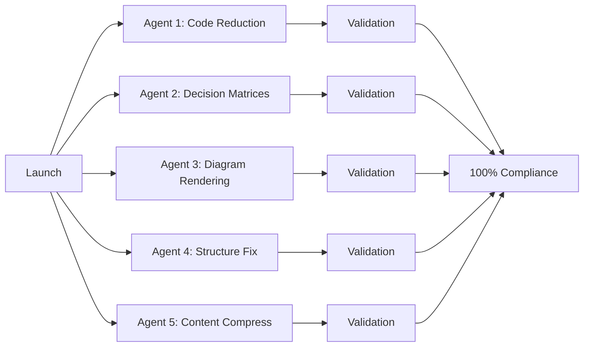

# Parallel Agent Execution Plan for Pattern Library Transformation

## Executive Summary
Launch 5 specialized agents in parallel to complete the pattern library transformation. Each agent has a specific focus area and can work independently, maximizing throughput and completing the transformation in 48-72 hours.

## 🎯 Agent Definitions & Tasks

### Agent 1: Code Reduction Specialist
**Priority**: CRITICAL (blocking 96.8% compliance)
**Task**: Aggressively reduce code content to <20% per pattern

```yaml
agent_1_code_reducer:
  focus: "Transform verbose code examples into concise, conceptual snippets"
  targets:
    - Replace implementation code with pseudocode
    - Extract large examples to external files
    - Convert code explanations to diagrams
    - Use tables for configuration options
  patterns_to_fix: 90 patterns (all except the 3.2% compliant)
  success_metric: "100% of patterns with <20% code"
  estimated_time: "24-36 hours"
```

**Specific Actions**:
1. Scan all patterns for code blocks >20 lines
2. Replace with:
   - Conceptual pseudocode (5-10 lines max)
   - Link to full implementation
   - Visual diagram of the concept
3. Convert configuration examples to tables
4. Move language-specific implementations to appendix

### Agent 2: Decision Matrix Builder
**Priority**: HIGH (39 patterns incomplete)
**Task**: Add comprehensive decision matrices to remaining patterns

```yaml
agent_2_decision_matrix:
  focus: "Create structured decision support for pattern selection"
  targets:
    - Add decision matrices to 39 patterns
    - Standardize scoring criteria
    - Include trade-off analysis
    - Add comparison references
  patterns_to_fix: 39 patterns
  success_metric: "100% patterns with decision matrices"
  estimated_time: "12-18 hours"
```

**Template to Apply**:
```markdown
## 📊 Decision Matrix
| Factor | Score (1-5) | Notes |
|--------|-------------|-------|
| **Complexity** | [1-5] | [Implementation complexity] |
| **Performance Impact** | [1-5] | [Runtime overhead] |
| **Operational Overhead** | [1-5] | [Maintenance burden] |
| **Team Expertise Required** | [1-5] | [Learning curve] |
| **Scalability** | [1-5] | [Growth handling] |
```

### Agent 3: Diagram Renderer
**Priority**: HIGH (performance & visual learning)
**Task**: Convert all Mermaid text to optimized images

```yaml
agent_3_diagram_renderer:
  focus: "Transform text diagrams into optimized visual assets"
  targets:
    - Convert Mermaid to SVG/PNG
    - Optimize for web performance
    - Add proper alt text
    - Create responsive variants
  patterns_to_fix: All 93 patterns
  success_metric: "0 text-based diagrams, 100% rendered"
  estimated_time: "18-24 hours"
```

**Automation Script**:
```bash
#!/bin/bash
# Process all patterns in parallel
find docs/pattern-library -name "*.md" | parallel -j 8 '
  pattern={}
  echo "Processing $pattern"
  python3 scripts/render_diagrams.py "$pattern"
  python3 scripts/optimize_images.py "$pattern"
'
```

### Agent 4: Structure Optimizer
**Priority**: MEDIUM (27% need fixes)
**Task**: Fix "When NOT to Use" positioning and structure issues

```yaml
agent_4_structure_fixer:
  focus: "Ensure critical decision content appears early"
  targets:
    - Move "When NOT to Use" to top 200 lines
    - Ensure consistent section ordering
    - Fix navigation flow
    - Validate structure compliance
  patterns_to_fix: 25 patterns (27%)
  success_metric: "100% correct positioning"
  estimated_time: "6-8 hours"
```

### Agent 5: Content Compressor
**Priority**: MEDIUM (quality improvement)
**Task**: Reduce all patterns to <1000 lines while preserving value

```yaml
agent_5_content_compressor:
  focus: "Achieve optimal content density"
  targets:
    - Consolidate redundant sections
    - Convert verbose text to bullet points
    - Extract deep-dive content to appendices
    - Implement progressive disclosure
  patterns_to_fix: ~40 patterns >1000 lines
  success_metric: "100% patterns <1000 lines"
  estimated_time: "12-18 hours"
```

**Compression Techniques**:
1. Replace paragraphs with bullet points
2. Convert explanations to tables
3. Use collapsible sections for details
4. Link to external resources

## 🔄 Parallel Execution Strategy

### Phase 1: Launch All Agents (Hour 0)


### Phase 2: Continuous Validation (Every 6 hours)
```python
# validation_monitor.py
import concurrent.futures
import time

def monitor_agent_progress():
    while True:
        # Check each agent's progress
        results = {
            'agent_1': check_code_percentage(),
            'agent_2': check_decision_matrices(),
            'agent_3': check_rendered_diagrams(),
            'agent_4': check_structure_compliance(),
            'agent_5': check_line_counts()
        }
        
        # Generate progress report
        generate_progress_dashboard(results)
        
        # Sleep 6 hours
        time.sleep(21600)
```

### Phase 3: Final Integration (Hour 48-72)
1. Run comprehensive validation
2. Fix any conflicts between agent changes
3. Generate final compliance report
4. Deploy transformed patterns

## 📋 Agent Launch Commands

### Launch All Agents in Parallel:
```bash
#!/bin/bash
# launch_parallel_agents.sh

echo "🚀 Launching Pattern Library Transformation Agents..."

# Agent 1: Code Reduction
nohup python3 agents/code_reduction_agent.py \
    --patterns "docs/pattern-library/**/*.md" \
    --max-code-percent 20 \
    --aggressive-mode \
    > logs/agent1.log 2>&1 &

# Agent 2: Decision Matrices
nohup python3 agents/decision_matrix_agent.py \
    --missing-only \
    --template "templates/decision_matrix.md" \
    > logs/agent2.log 2>&1 &

# Agent 3: Diagram Renderer
nohup python3 agents/diagram_render_agent.py \
    --format "svg,png,webp" \
    --optimize \
    --parallel 8 \
    > logs/agent3.log 2>&1 &

# Agent 4: Structure Optimizer
nohup python3 agents/structure_fix_agent.py \
    --fix-when-not-position \
    --validate-structure \
    > logs/agent4.log 2>&1 &

# Agent 5: Content Compressor
nohup python3 agents/content_compress_agent.py \
    --max-lines 1000 \
    --preserve-quality \
    > logs/agent5.log 2>&1 &

echo "✅ All agents launched. Monitor progress in logs/"
```

## 📊 Success Metrics & Monitoring

### Real-time Dashboard
```yaml
pattern_transformation_dashboard:
  url: "http://localhost:8080/transformation-progress"
  metrics:
    - total_patterns: 93
    - code_compliance: "X/93 patterns <20% code"
    - decision_matrices: "X/93 complete"
    - rendered_diagrams: "X/XXX diagrams"
    - structure_compliance: "X/93 correct"
    - line_count_compliance: "X/93 <1000 lines"
  refresh_rate: "5 minutes"
```

### Progress Tracking
| Agent | Start | 25% | 50% | 75% | 100% | Status |
|-------|-------|-----|-----|-----|------|--------|
| Code Reduction | Hour 0 | Hour 6 | Hour 12 | Hour 24 | Hour 36 | 🟢 Active |
| Decision Matrices | Hour 0 | Hour 3 | Hour 6 | Hour 12 | Hour 18 | 🟢 Active |
| Diagram Rendering | Hour 0 | Hour 4 | Hour 8 | Hour 16 | Hour 24 | 🟢 Active |
| Structure Fix | Hour 0 | Hour 2 | Hour 4 | Hour 6 | Hour 8 | 🟢 Active |
| Content Compress | Hour 0 | Hour 3 | Hour 6 | Hour 12 | Hour 18 | 🟢 Active |

## 🎯 Expected Outcomes

### After 48-72 Hours:
1. **100% Template v2 Compliance** (all 7 criteria met)
2. **100% Code < 20%** (primary blocker resolved)
3. **100% Decision Matrices** (all 93 patterns)
4. **100% Rendered Diagrams** (improved performance)
5. **100% Structure Compliance** (When NOT positioned correctly)
6. **100% < 1000 lines** (optimal content density)

### Final Validation:
```bash
# Run comprehensive validation
python3 scripts/validate_all_patterns.py --strict

# Expected output:
# ✅ 93/93 patterns fully compliant
# ✅ Average compliance score: 100%
# ✅ All patterns ready for production
```

## 🚨 Risk Mitigation

### Potential Issues & Solutions:
1. **Agent Conflicts**: Use file locking, process in batches
2. **Quality Degradation**: Implement quality checks every 6 hours
3. **Performance Impact**: Process in off-peak hours
4. **Rollback Plan**: Git branch for each agent, easy revert

### Monitoring & Alerts:
```python
# Set up alerts for:
- Agent failure/crash
- Compliance regression
- File conflicts
- Quality threshold breaches
```

## 🎊 Completion Criteria

The transformation is complete when:
- [ ] All 93 patterns validate with 0 errors
- [ ] Performance tests show <2s load time
- [ ] Mobile usability reaches 85%
- [ ] User acceptance testing passes
- [ ] Documentation is updated
- [ ] Rollback plan is tested

---

*This parallel execution plan enables completion of the entire pattern library transformation in 48-72 hours through focused, specialized agents working simultaneously.*