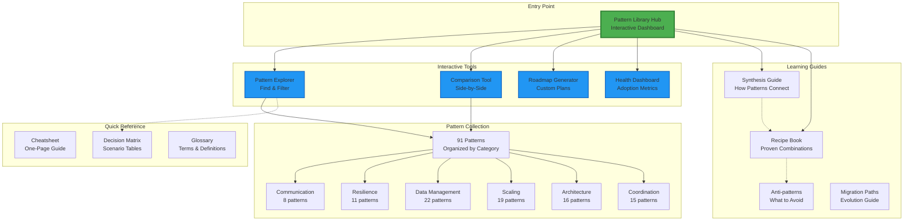
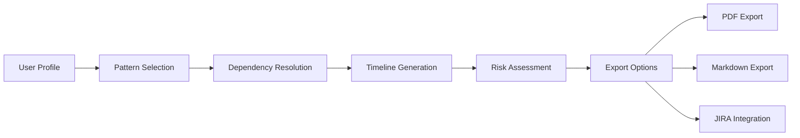

# Pattern Library Information Architecture v2.0
**Date**: 2025-08-03  
**Purpose**: Define the new structure, navigation, and user experience for the consolidated pattern library

## Overview

The new information architecture transforms the pattern library from a static collection of long documents into an interactive, efficient learning platform. This design prioritizes discoverability, reduces cognitive load, and delivers on promised interactivity.

## Core Design Principles

1. **Hub-and-Spoke Model**: Central interactive hub with specialized tools and guides
2. **Progressive Disclosure**: Start simple, reveal complexity on demand  
3. **Task-Oriented Navigation**: Organize by what users want to do
4. **Single Source of Truth**: Each concept lives in one place
5. **Mobile-First Responsive**: Optimized for all devices

## Visual Architecture



## Navigation Hierarchy

### Primary Navigation (Top Level)
```
📚 Pattern Library
├── 🏠 Home (Interactive Hub)
├── 🔍 Explore Patterns
├── ⚖️ Compare Patterns  
├── 🗺️ Build Roadmap
├── 📊 Health Dashboard
├── 📖 Guides
│   ├── Synthesis Guide
│   ├── Recipe Book
│   ├── Anti-patterns
│   └── Migration Paths
└── ⚡ Quick Reference
```

### Secondary Navigation (Contextual)
- **Breadcrumbs**: Home > Tools > Pattern Explorer > Resilience > Circuit Breaker
- **Related Links**: Sidebar with contextual suggestions
- **Quick Actions**: Floating action buttons for common tasks

## Page Structure Templates

### 1. Interactive Hub (Homepage)

```markdown
┌─────────────────────────────────────────────────────────────┐
│ 🏗️ Pattern Library: 91 Battle-Tested Solutions              │
│ ─────────────────────────────────────────────────────────── │
│                                                              │
│ ┌─────────────┐ ┌─────────────┐ ┌─────────────┐           │
│ │   Explore   │ │   Compare   │ │   Roadmap   │           │
│ │  Patterns   │ │  Patterns   │ │  Generator  │           │
│ │ 🔍 Find Now │ │ ⚖️ Compare  │ │ 🗺️ Build   │           │
│ └─────────────┘ └─────────────┘ └─────────────┘           │
│                                                              │
│ 📊 Pattern Stats        🎯 Quick Start Paths               │
│ ┌─────────────────┐    ┌─────────────────────────────┐   │
│ │ 31 Gold         │    │ 👶 Beginner (2-4 weeks)    │   │
│ │ 49 Silver       │    │ 🚀 Intermediate (1-2 mo)   │   │
│ │ 11 Bronze       │    │ 🏆 Advanced (3-6 months)   │   │
│ │ 91 Total        │    └─────────────────────────────┘   │
│ └─────────────────┘                                        │
│                                                              │
│ 🔥 Trending Patterns    📚 Essential Guides               │
│ ┌─────────────────┐    ┌─────────────────────────────┐   │
│ │ • Circuit Break │    │ • How Patterns Connect     │   │
│ │ • Service Mesh  │    │ • Proven Recipes           │   │
│ │ • Event Source  │    │ • Common Anti-patterns     │   │
│ └─────────────────┘    └─────────────────────────────┘   │
└─────────────────────────────────────────────────────────────┘
```

### 2. Pattern Explorer

```markdown
┌─────────────────────────────────────────────────────────────┐
│ 🔍 Pattern Explorer                                         │
│ ─────────────────────────────────────────────────────────── │
│ ┌─────────────────────────────────────────────────────┐   │
│ │ Search: [____________________] 🔍                    │   │
│ └─────────────────────────────────────────────────────┘   │
│                                                              │
│ Quick Filters:                                              │
│ [⭐ Elite Only] [👶 Beginner] [🔥 Trending] [🏢 Netflix]  │
│                                                              │
│ Excellence Tier:    Category:         Status:              │
│ ☑ Gold (31)        ☑ Communication   ☑ Recommended        │
│ ☑ Silver (49)      ☑ Resilience      ☐ Legacy            │
│ ☐ Bronze (11)      ☑ Data            ☑ Growing           │
│                     ☑ Scaling                              │
│                                                              │
│ Showing 42 of 91 patterns                                  │
│ ┌─────────────┐ ┌─────────────┐ ┌─────────────┐         │
│ │Circuit Break│ │Load Balance │ │Service Mesh │         │
│ │🥇 Gold      │ │🥇 Gold      │ │🥈 Silver    │         │
│ │Prevent      │ │Distribute   │ │Manage       │         │
│ │cascading    │ │traffic      │ │service      │         │
│ │failures     │ │across nodes │ │communication│         │
│ └─────────────┘ └─────────────┘ └─────────────┘         │
└─────────────────────────────────────────────────────────────┘
```

### 3. Individual Pattern Page

```markdown
┌─────────────────────────────────────────────────────────────┐
│ Circuit Breaker                                    🥇 GOLD  │
│ ─────────────────────────────────────────────────────────── │
│                                                              │
│ 🎯 Essential Question                                       │
│ > How do you prevent a failing service from taking down    │
│ > your entire system?                                       │
│                                                              │
│ ⚡ Quick Decision                          [Collapse All ▼] │
│ ┌─────────────────────────────────────────────────────┐   │
│ │ ✅ Use When           ❌ Don't Use When              │   │
│ │ • Calling external   • Simple scripts                │   │
│ │ • Network calls      • Batch processing              │   │
│ │ • Microservices      • Local function calls         │   │
│ └─────────────────────────────────────────────────────┘   │
│                                                              │
│ 📚 Learning Path                                           │
│ [Level 1: Intuition ▶] [2: Foundation] [3: Deep] [4: Pro] │
│                                                              │
│ ┌─────────────────────────────────────────────────────┐   │
│ │ Level 1: Intuition (5 min read)                     │   │
│ │                                                       │   │
│ │ 💡 Think of it like a home circuit breaker...       │   │
│ │                                                       │   │
│ │ [Simple diagram]                                     │   │
│ │                                                       │   │
│ │ When too much current flows, the breaker trips to   │   │
│ │ protect your house. Similarly, when a service...    │   │
│ └─────────────────────────────────────────────────────┘   │
│                                                              │
│ 🔗 Related Patterns                                        │
│ Works with: Retry • Timeout • Bulkhead                    │
│ Part of: Resilience Foundation                            │
└─────────────────────────────────────────────────────────────┘
```

## User Journeys

### Journey 1: "I need to handle failures better"
```
Home → Explore → Filter: Resilience → Circuit Breaker → See Relations → Retry Pattern → Build Roadmap
```

### Journey 2: "What patterns does Netflix use?"
```
Home → Explore → Quick Filter: Netflix → See 12 patterns → Compare top 2 → Read recipes
```

### Journey 3: "I'm migrating from monolith"  
```
Home → Guides → Migration Paths → Monolith to Microservices → Generate Roadmap → Export plan
```

### Journey 4: "Quick lookup for API Gateway config"
```
Home → Quick Reference → Cheatsheet → API Gateway section → Link to full pattern
```

## Mobile Navigation Strategy

### Responsive Breakpoints
- **Mobile**: < 768px - Single column, collapsible sections
- **Tablet**: 768px - 1024px - Two column, condensed navigation  
- **Desktop**: > 1024px - Full layout with sidebar

### Mobile-Specific Features
1. **Swipe Navigation**: Between pattern levels
2. **Floating TOC**: Sticky, collapsible table of contents
3. **Progressive Loading**: Load sections on demand
4. **Offline Mode**: Essential content cached locally

### Mobile Navigation Pattern
```
┌─────────────────┐
│ ☰ Pattern Lib   │  <- Hamburger menu
├─────────────────┤
│ 🎯 Quick Actions│  <- Most used features
│ ┌─────────────┐ │
│ │🔍 Search    │ │
│ └─────────────┘ │
├─────────────────┤
│ Current: Circuit│  <- Breadcrumb trail
│ Breaker         │
├─────────────────┤
│ [Content Area]  │  <- Swipeable sections
│                 │
│ ◀ Prev    Next ▶│  <- Section navigation
└─────────────────┘
```

## Interactive Features Architecture

### 1. Pattern Explorer State Management
```javascript
// URL-based state for shareable searches
// Example: /explore?tier=gold&category=resilience&q=circuit

const ExplorerState = {
    filters: {
        tier: ['gold', 'silver'],
        category: ['resilience'],
        status: ['recommended'],
        search: 'circuit'
    },
    sort: 'relevance',
    view: 'grid',
    
    // Persist to localStorage
    save() {
        localStorage.setItem('explorer-state', JSON.stringify(this));
    },
    
    // Generate shareable URL
    toURL() {
        return `/explore?${new URLSearchParams(this.filters)}`;
    }
};
```

### 2. Comparison Tool Data Structure
```javascript
// Comparison matrix for any two patterns
const ComparisonMatrix = {
    aspects: [
        'complexity',
        'performance', 
        'scalability',
        'maintainability',
        'team_expertise'
    ],
    
    scenarios: [
        'high_traffic',
        'high_consistency',
        'real_time',
        'cost_sensitive'
    ],
    
    generateComparison(pattern1, pattern2) {
        return {
            overview: this.compareBasics(pattern1, pattern2),
            scores: this.compareScores(pattern1, pattern2),
            scenarios: this.compareScenariosn(pattern1, pattern2),
            recommendation: this.synthesize(pattern1, pattern2)
        };
    }
};
```

### 3. Roadmap Generator Flow


## Content Governance Structure

### Content Types & Ownership

| Content Type | Owner | Update Frequency | Review Process |
|--------------|-------|------------------|----------------|
| Pattern Core | Architecture Team | Quarterly | PR + 2 reviewers |
| Examples | Community | As needed | PR + 1 reviewer |
| Relationships | Architecture Team | With new patterns | Automated validation |
| Metrics | Automated | Real-time | Dashboard alerts |
| Guides | Documentation Team | Bi-annual | Editorial review |

### Navigation Update Process
1. Propose change via GitHub issue
2. Impact assessment on user journeys
3. A/B test if major change
4. Rollout with announcement

## Performance Architecture

### Page Load Optimization
```yaml
Critical Path:
  1. HTML Shell: < 14KB
  2. Critical CSS: < 20KB inline
  3. Navigation JS: < 30KB
  4. Pattern Data: Lazy loaded
  
Progressive Enhancement:
  - Base: Static HTML works without JS
  - Enhanced: Interactive features layer on
  - Optimal: Full SPA-like experience
  
Caching Strategy:
  - HTML: 1 hour CDN cache
  - Assets: 1 year with hash
  - API: 5 minute cache
  - Pattern data: LocalStorage + 24hr
```

### Search Architecture
```javascript
// Client-side search with pre-built index
const SearchIndex = {
    // Pre-computed at build time
    patterns: [
        {
            id: 'circuit-breaker',
            title: 'Circuit Breaker',
            tokens: ['circuit', 'breaker', 'failure', 'resilience'],
            category: 'resilience',
            tier: 'gold',
            boost: 1.5 // Popular pattern
        }
    ],
    
    // Fuzzy search with ranking
    search(query) {
        return this.patterns
            .map(p => ({...p, score: this.score(p, query)}))
            .filter(p => p.score > 0)
            .sort((a, b) => b.score - a.score);
    }
};
```

## Accessibility Architecture

### WCAG 2.1 AAA Compliance

1. **Semantic Structure**
   ```html
   <nav role="navigation" aria-label="Pattern categories">
   <main role="main" aria-labelledby="page-title">
   <aside role="complementary" aria-label="Related patterns">
   ```

2. **Keyboard Navigation**
   - Tab order follows visual hierarchy
   - Skip links to main content
   - Keyboard shortcuts with `?` help

3. **Screen Reader Optimization**
   - Descriptive headings hierarchy
   - Alt text for all diagrams
   - ARIA live regions for updates

4. **Visual Accessibility**
   - 7:1 contrast ratio minimum
   - Focus indicators on all interactive elements
   - Patterns distinguishable without color

## Success Metrics & KPIs

| Metric | Current | Target | Measurement |
|--------|---------|---------|-------------|
| Time to find pattern | 5-10 min | < 2 min | Analytics |
| Bounce rate | Unknown | < 20% | Analytics |
| Mobile usage | 15% | 40% | Analytics |
| Search success rate | Unknown | > 80% | Search analytics |
| Page load time | 5-10s | < 2s | RUM |
| Accessibility score | Unknown | 100 | Lighthouse |

## Implementation Priorities

### Phase 1 (Weeks 1-2): Foundation
1. New navigation structure
2. Pattern explorer (basic)
3. Mobile-responsive layout
4. Search functionality

### Phase 2 (Weeks 3-4): Interactivity  
1. Advanced filtering
2. Comparison tool
3. State persistence
4. Keyboard navigation

### Phase 3 (Weeks 5-6): Enhancement
1. Roadmap generator
2. Health dashboard
3. Export functionality
4. Offline support

### Phase 4 (Weeks 7-8): Polish
1. Performance optimization
2. Accessibility audit
3. Analytics integration
4. User testing

## Conclusion

This information architecture transforms the pattern library from a document collection into an interactive platform. By organizing around user tasks, implementing progressive disclosure, and delivering on promised features, we create an experience that truly achieves "maximum conceptual depth with minimum cognitive load."

The architecture is designed to scale, with clear paths for adding new patterns, tools, and guides while maintaining consistency and performance.

---

*Next Steps: Review IA with stakeholders, create prototypes for key interactions*