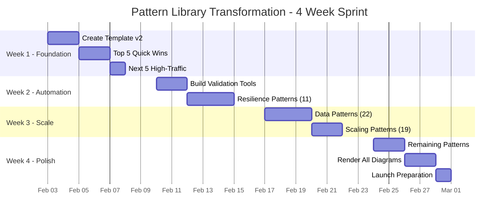

# Pattern Priority Matrix & Visual Roadmap

## Impact vs Effort Matrix

### 🎯 Quick Wins (High Impact, Low Effort)
**Do First - Week 1**

| Pattern | Current Issues | 2-Hour Fix | Impact |
|---------|---------------|------------|---------|
| circuit-breaker | No essential Q | Add EQ + state diagram | High traffic pattern |
| api-gateway | Verbose, buried info | Add EQ + decision matrix | Entry point for many |
| timeout | Good content, poor structure | Restructure + add EQ | Prevents cascades |
| health-check | Missing decision criteria | Add when to/not use | Foundation pattern |
| service-discovery | Code in TOC bug | Fix bug + add EQ | Core microservices |

### 💎 Strategic Wins (High Impact, High Effort)
**Do Next - Week 2-3**

| Pattern | Current Issues | 4-8 Hour Fix | Impact |
|---------|---------------|--------------|---------|
| retry-backoff | 2200 lines, no template | Major refactor to 1000 lines | Most visited pattern |
| saga | 1600 lines but good | Reduce 40% + visuals | Complex transactions |
| event-sourcing | Hidden value prop | Complete restructure | Growing adoption |
| sharding | Code-heavy (1500 lines) | Visual transformation | Scale foundation |
| service-mesh | Everything buried | Information architecture | Modern standard |

### 📈 Fill-ins (Low Impact, Low Effort)
**Do in Batches - Week 3**

| Pattern | Fix Needed | Batch Strategy |
|---------|-----------|----------------|
| Bronze patterns (11) | Add migration guides | Template sprint |
| Coordination patterns | Add essential Qs | Category batch |
| Simple patterns | Length reduction | Bulk edit |

### ⏳ Defer (Low Impact, High Effort)
**Do Last or Reconsider - Week 4**

| Pattern | Issue | Alternative Approach |
|---------|-------|---------------------|
| Legacy patterns | Complete rewrite | Link to modern alternatives |
| Niche patterns | Low usage | Minimal viable improvement |
| Complex rewrites | 10+ hour effort | Phase 2 consideration |

## Visual Transformation Roadmap



## Pattern Categories by Priority

### 🔴 Priority 1: User-Facing Foundations (Week 1)
Must be perfect - these shape first impressions

| Category | Patterns | Why Critical |
|----------|----------|--------------|
| API Entry | api-gateway, graphql-federation | First touch point |
| Resilience Basics | circuit-breaker, retry-backoff, timeout | Prevent outages |
| Service Basics | service-discovery, health-check | Microservices 101 |

### 🟠 Priority 2: Scale & Performance (Week 2)
High-traffic systems depend on these

| Category | Patterns | Why Critical |
|----------|----------|--------------|
| Data Scale | sharding, partitioning, consistent-hashing | Scale foundations |
| Traffic Management | load-balancing, rate-limiting, backpressure | Handle load |
| Caching | caching-strategies, cdn, edge-computing | Performance critical |

### 🟡 Priority 3: Advanced Patterns (Week 3)
Complex but essential for mature systems

| Category | Patterns | Why Important |
|----------|----------|---------------|
| Distributed Transactions | saga, event-sourcing, cqrs | Complex workflows |
| Coordination | consensus, leader-election, distributed-lock | Distributed state |
| Advanced Architecture | service-mesh, cell-based, event-driven | Modern architectures |

### 🟢 Priority 4: Specialized Patterns (Week 4)
Important but narrower use cases

| Category | Patterns | When Needed |
|----------|----------|-------------|
| Streaming | kafka patterns, stream processing | Real-time systems |
| Security | zero-trust, encryption patterns | Security-first |
| Migration | strangler-fig, anti-corruption | Legacy modernization |

## Success Metrics by Week

### Week 1 Target: Immediate Impact
- ✅ 10 most-visited patterns transformed
- ✅ 50% traffic seeing improved content  
- ✅ Page load time < 2s for top patterns
- ✅ Essential questions visible above fold

### Week 2 Target: Momentum Building  
- ✅ 30 patterns compliant (33%)
- ✅ Validation pipeline operational
- ✅ All resilience patterns complete
- ✅ Pattern quality scores published

### Week 3 Target: Scale Achievement
- ✅ 60 patterns compliant (66%)
- ✅ All data/scaling patterns complete
- ✅ Average length < 1200 lines
- ✅ Mobile bounce rate < 50%

### Week 4 Target: Excellence Delivery
- ✅ 91 patterns compliant (100%)
- ✅ All diagrams rendered
- ✅ Average length ≤ 1000 lines
- ✅ Launch announcement ready

## Daily Execution Checklist

### Morning Stand-up Questions
1. Which patterns are we transforming today?
2. Any blockers from yesterday?
3. Are we on track for weekly target?

### Pattern Transformation Checklist
- [ ] Essential question added (2 places)
- [ ] When to/not use in first 200 lines
- [ ] All lists converted to tables
- [ ] Code reduced to <20%
- [ ] 3+ diagrams present
- [ ] Decision matrix included
- [ ] Cross-references verified
- [ ] Mobile preview checked
- [ ] Validation script passed

### End-of-Day Review
- [ ] Patterns completed: ___/___
- [ ] Average time per pattern: ___
- [ ] Blockers for tomorrow: ___
- [ ] Quality score: ___/100

## Resource Allocation

### Week 1: Front-loaded Effort
- **Senior Architect**: 80% (template, reviews, top patterns)
- **Tech Writers**: 100% (pattern transformation)
- **Developer**: 40% (tooling setup)

### Week 2-3: Parallel Execution  
- **Senior Architect**: 40% (reviews, guidance)
- **Tech Writers**: 100% (bulk transformation)
- **Developer**: 60% (automation, rendering)

### Week 4: Quality & Polish
- **Senior Architect**: 60% (final reviews)
- **Tech Writers**: 80% (polish, consistency)
- **Developer**: 80% (rendering, performance)
- **UX Designer**: 40% (mobile optimization)

## Common Transformation Formulas

### Essential Question Formula
```
"How do we [solve problem] without [causing side effect]?"
"When should we [choose approach A] instead of [approach B]?"
"What's the best way to [achieve goal] at [scale]?"
```

### Visual Metaphor Sources
- Everyday objects (circuit breaker → electrical panel)
- Nature (strangler fig → vine wrapping tree)
- Transportation (load balancer → traffic controller)
- Business (saga → multi-step transaction)

### Decision Matrix Template
```markdown
| Factor | Option A | Option B | Option C |
|--------|----------|----------|----------|
| Complexity | Low | Medium | High |
| Performance | Good | Better | Best |
| Cost | $ | $$ | $$$ |
| When to use | [scenario] | [scenario] | [scenario] |
```

## Risk Heatmap

### 🔴 High Risk Areas
- Breaking existing links/bookmarks
- Removing valuable content while cutting
- Inconsistent application of template

### 🟡 Medium Risk Areas  
- User adaptation to new format
- Mobile performance issues
- Cross-reference accuracy

### 🟢 Low Risk Areas
- Adding essential questions
- Converting lists to tables
- Rendering diagrams

## The Path Forward

1. **Today**: Prioritize patterns using this matrix
2. **Tomorrow**: Start with 5 quick wins
3. **This Week**: Transform top 10 patterns
4. **This Month**: Achieve 100% compliance
5. **Next Quarter**: Build on solid foundation

Success comes from disciplined execution of high-impact improvements first, building momentum through visible wins, and maintaining quality through systematic validation.