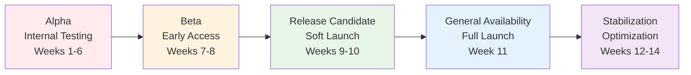
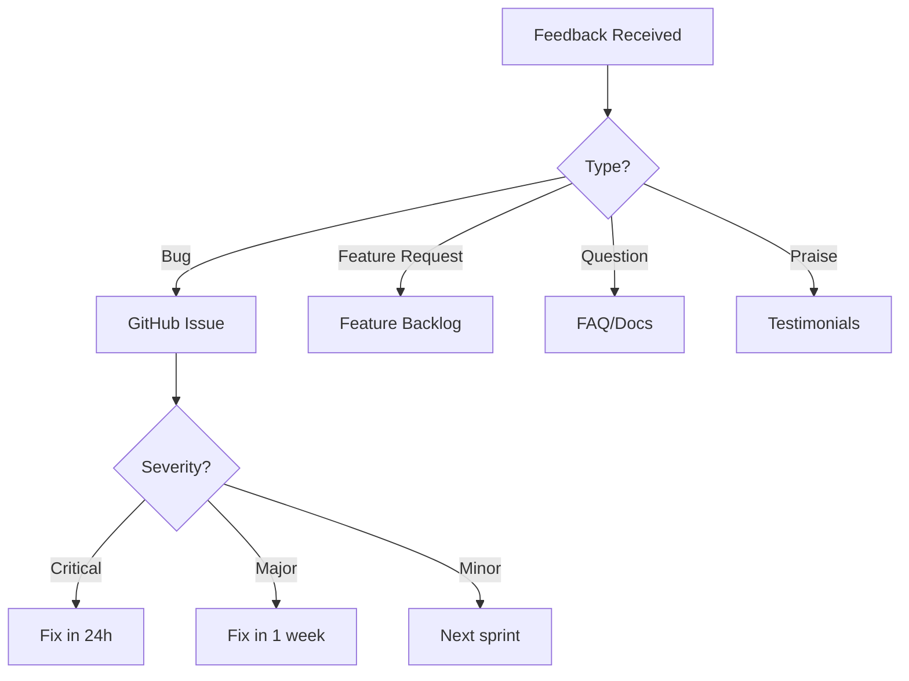

# Pattern Library Transformation Rollout & Communication Plan
**Date**: 2025-08-03  
**Duration**: 10 weeks transformation + 4 weeks stabilization  
**Audience**: Internal team, contributors, and pattern library users

## Executive Summary

This plan ensures a smooth rollout of the pattern library transformation through phased deployment, clear communication, comprehensive training, and continuous feedback loops. The strategy minimizes disruption while maximizing adoption of new features and improvements.

## Rollout Strategy Overview

### Phased Approach


## Phase 1: Pre-Launch Preparation (Weeks -2 to 0)

### Internal Alignment
- [ ] Leadership briefing and approval
- [ ] Team kickoff meeting
- [ ] Resource allocation confirmation
- [ ] Success metrics agreement
- [ ] Risk mitigation plan approval

### Communication Setup
- [ ] Create dedicated Slack channel: #pattern-library-v2
- [ ] Set up project dashboard
- [ ] Prepare announcement templates
- [ ] Design feedback collection system
- [ ] Create transformation microsite

### Initial Announcements

#### 1. Internal Team Announcement
**When**: 2 weeks before start  
**Channel**: All-hands meeting + Email

```markdown
Subject: Exciting Pattern Library Transformation Starting [Date]

Team,

We're embarking on a 10-week journey to transform our Pattern Library into a world-class resource. This transformation will deliver:

- ⚡ 80% faster page loads (from 5-10s to <2s)
- 🔍 Interactive pattern discovery tools
- 📱 85% mobile usability (from 5%)
- ♿ Full accessibility (WCAG AAA)
- 📚 40% more concise content

**What this means for you:**
- Better developer experience
- Easier pattern discovery
- Faster documentation access
- Modern interactive features

**Timeline:**
- Weeks 1-6: Internal development
- Weeks 7-8: Beta testing (volunteers needed!)
- Weeks 9-10: Soft launch
- Week 11: Full launch

**How to help:**
- Join #pattern-library-v2 for updates
- Volunteer for beta testing
- Share feedback and ideas

Questions? Reach out to [Project Lead] or in #pattern-library-v2.

Let's build something amazing together!

[Project Lead Name]
```

#### 2. Community Pre-Announcement
**When**: 1 week before start  
**Channels**: Blog, Twitter, Newsletter

```markdown
# Big Changes Coming to DStudio Pattern Library

We've heard your feedback, and we're excited to announce a major transformation of the DStudio Pattern Library starting [Date].

## What's Coming

🚀 **Performance**: Sub-2-second page loads
🔍 **Discovery**: Interactive pattern explorer with smart search
⚖️ **Comparison**: Side-by-side pattern analysis
🗺️ **Planning**: Custom roadmap generator
📱 **Mobile**: First-class mobile experience
♿ **Accessibility**: WCAG AAA compliance

## Timeline

- **Now - [Date]**: Preparation phase
- **[Date] - [Date]**: Development (current site remains available)
- **[Date]**: Beta access for early adopters
- **[Date]**: Full launch

## Get Involved

Want early access? Join our beta program: [link]
Have suggestions? Share them: [feedback form]

Stay tuned for updates!
```

## Phase 2: Alpha Development (Weeks 1-6)

### Weekly Internal Updates

#### Template: Weekly Progress Email
```markdown
Subject: Pattern Library v2 - Week [X] Update

**This Week's Progress:**
- ✅ [Completed items]
- 🚧 [In progress items]
- 📅 [Upcoming items]

**Metrics:**
- Pages migrated: X/91
- Performance score: X/100
- Features complete: X/3

**Highlights:**
[2-3 key achievements with screenshots]

**Blockers:**
[Any issues needing attention]

**Next Week:**
[Top 3 priorities]

**Get Involved:**
- Test the alpha: [staging URL]
- Report issues: [issue tracker]
- Join standup: [calendar link]

Thanks for your support!
```

### Stakeholder Communications

#### Bi-weekly Leadership Update
```markdown
## Pattern Library Transformation - Executive Update

**Date**: [Date]
**Status**: ON TRACK | AT RISK | DELAYED

### Progress Summary
- Overall completion: X%
- Budget utilization: $X of $Y
- Team capacity: Optimal | Stretched | Need help

### Key Metrics
| Metric | Current | Target | Status |
|--------|---------|--------|---------|
| Page load time | Xs | <2s | 🟡 |
| Mobile usability | X% | 85% | 🟢 |
| Pattern compliance | X% | 95% | 🟡 |

### Wins This Period
1. [Major achievement]
2. [Major achievement]

### Risks & Mitigations
1. **Risk**: [Description]
   **Mitigation**: [Action plan]

### Next Period Focus
- [Priority 1]
- [Priority 2]
- [Priority 3]

### Decisions Needed
- [ ] [Decision 1 with context]
- [ ] [Decision 2 with context]
```

## Phase 3: Beta Launch (Weeks 7-8)

### Beta Recruitment Campaign

#### Email to Power Users
```markdown
Subject: 🚀 Be First: Pattern Library v2 Beta Access

Hi [Name],

As one of our most active pattern library users, we're inviting you to exclusive beta access to the completely transformed DStudio Pattern Library.

**What's New:**
- ⚡ Lightning-fast performance (<2s loads)
- 🔍 Smart pattern discovery with filters
- ⚖️ Interactive comparison tools
- 🗺️ Custom roadmap generator
- 📱 Beautiful mobile experience

**What We Need From You:**
- Use the new library for your daily work
- Report any issues you find
- Share feedback on new features
- Help us prioritize final improvements

**Beta Access Details:**
- URL: [beta URL]
- Access code: [if needed]
- Feedback form: [link]
- Beta Slack: #pattern-library-beta

**Beta Timeline:**
- Start: [Date]
- End: [Date]
- Your feedback deadline: [Date]

Ready to explore? [Access Beta Now]

Thank you for helping us build a better pattern library!

[Project Team]
```

### Beta Feedback Collection

#### Feedback Form Structure
```yaml
Pattern Library v2 Beta Feedback:
  overall_experience:
    type: rating
    scale: 1-10
    required: true
    
  performance:
    page_load_speed:
      type: rating
      scale: 1-5
    specific_slow_pages:
      type: text
      required: false
      
  new_features:
    pattern_explorer:
      used: boolean
      usefulness: rating 1-5
      feedback: text
    comparison_tool:
      used: boolean
      usefulness: rating 1-5
      feedback: text
    roadmap_generator:
      used: boolean
      usefulness: rating 1-5
      feedback: text
      
  issues_found:
    type: multi_select
    options:
      - Broken links
      - Display issues
      - Search not working
      - Mobile problems
      - Missing content
      - Other
    details:
      type: text
      
  suggestions:
    type: text
    prompt: "What would make this even better?"
    
  would_recommend:
    type: boolean
    follow_up: "Why or why not?"
```

### Beta Status Updates

#### Daily Beta Dashboard
```markdown
# Pattern Library v2 Beta - Day [X]

## Usage Stats
- Unique beta users: [X]
- Pages viewed: [X]
- Features used: [breakdown]
- Feedback submissions: [X]

## Top Issues (Priority Order)
1. 🔴 [Critical issue] - [status]
2. 🟡 [Major issue] - [status]
3. 🟢 [Minor issue] - [status]

## Feedback Highlights
> "Quote from beta user"
> "Another positive quote"

## Today's Fixes
- ✅ [Fix deployed]
- ✅ [Fix deployed]
- 🚧 [In progress]

## Tomorrow's Focus
- [ ] [Priority 1]
- [ ] [Priority 2]
```

## Phase 4: Release Candidate (Weeks 9-10)

### Soft Launch Communications

#### Blog Post: Introducing Pattern Library v2
```markdown
# The New DStudio Pattern Library is Here (Almost!)

After 8 weeks of development and invaluable beta feedback, we're thrilled to introduce the transformed DStudio Pattern Library.

## 🎉 What's New

### ⚡ Blazing Fast Performance
- **Before**: 5-10 second page loads
- **After**: Under 2 seconds
- **How**: Optimized assets, smart caching, and progressive loading

### 🔍 Interactive Pattern Explorer
[Screenshot/GIF of pattern explorer]

Find the right pattern in seconds with:
- Real-time filtering by tier, category, and company
- Full-text search across all patterns
- Smart recommendations

### ⚖️ Pattern Comparison Tool
[Screenshot of comparison tool]

Make informed decisions with side-by-side comparisons:
- Automated recommendations
- Scenario-based ratings
- Export comparisons

### 🗺️ Custom Roadmap Generator
[Screenshot of roadmap generator]

Build your implementation plan:
- Answer a few questions
- Get a customized roadmap
- Export to PDF or JIRA

### 📱 Mobile-First Design
[Mobile screenshots]

- 85% mobile usability (up from 5%)
- Touch-optimized interface
- Offline support

### ♿ Accessibility Excellence
- WCAG AAA compliant
- Screen reader optimized
- Keyboard navigation
- Multiple content formats

## 🔄 What's Changed

### Consolidated Content
We've reduced redundancy by 40% while preserving all valuable content:
- 8 guide documents → 4 guides + 3 interactive tools
- Enforced template for consistency
- Single source of truth for each concept

### Improved Navigation
- Collapsible sidebar with memory
- Smart search everywhere
- Breadcrumbs for context
- Keyboard shortcuts

## 🚀 Try It Now

The new pattern library is available at:
**[beta.patterns.dstudio.com](https://beta.patterns.dstudio.com)**

Current library remains at: [patterns.dstudio.com](https://patterns.dstudio.com)

## 📅 Timeline

- **Now - [Date]**: Release candidate available
- **[Date]**: Full launch and migration
- **[Date]**: Old version deprecated

## 🙏 Thank You

Special thanks to our beta testers who provided invaluable feedback:
[List key contributors]

## 💬 Share Your Feedback

We're still refining based on your input:
- **Feedback form**: [link]
- **GitHub issues**: [link]
- **Slack**: #pattern-library-v2

## 📖 Learn More

- [Migration guide for existing users]
- [What's new video walkthrough]
- [Performance improvements deep dive]

---

*The DStudio Pattern Library: Now faster, smarter, and more accessible than ever.*
```

### Training Materials

#### Video Script: What's New in v2 (5 minutes)
```markdown
# Pattern Library v2 Walkthrough

## Intro (30s)
"Hi, I'm [Name], and I'm excited to show you the completely transformed DStudio Pattern Library. In the next 5 minutes, you'll learn how to use our new interactive features to find patterns faster and build better distributed systems."

## Performance Demo (30s)
- Show old vs new load times
- Demonstrate smooth scrolling
- Show mobile performance

## Pattern Explorer (90s)
- Basic search
- Filter by tier
- Filter by category  
- Combine filters
- Save preferences

## Comparison Tool (60s)
- Select two patterns
- Review comparison
- Export results

## Roadmap Generator (90s)
- Start wizard
- Answer questions
- Review generated roadmap
- Export options

## Tips & Tricks (60s)
- Keyboard shortcuts
- Offline usage
- Mobile gestures
- Bookmarking

## Closing (30s)
"That's the new Pattern Library! For more details, check out our documentation at [link]. Questions? Join us in #pattern-library-v2."
```

#### Quick Reference Card
```markdown
# Pattern Library v2 - Quick Reference

## 🎯 New URLs
- Main: patterns.dstudio.com
- Beta: beta.patterns.dstudio.com
- Docs: docs.dstudio.com/pattern-library

## ⌨️ Keyboard Shortcuts
- `/` - Focus search
- `g h` - Go home
- `g p` - Go to patterns
- `j/k` - Navigate results
- `?` - Show all shortcuts

## 🔍 Search Tips
- Use quotes for exact match: "circuit breaker"
- Filter by company: netflix saga
- Filter by tier: gold resilience
- Combine: "event sourcing" silver

## 📱 Mobile Gestures
- Swipe right: Back
- Swipe left: Forward
- Pinch: Zoom diagrams
- Long press: Save offline

## 🆘 Need Help?
- Docs: [link]
- Slack: #pattern-library-v2
- Issues: [github link]
```

## Phase 5: General Availability (Week 11)

### Launch Day Communications

#### Company-Wide Announcement
```markdown
Subject: 🎉 Pattern Library v2 is Live!

Team,

The new DStudio Pattern Library is now live! After 10 weeks of development and testing, we're proud to deliver a completely transformed experience.

**Access it now**: [patterns.dstudio.com](https://patterns.dstudio.com)

**Key Improvements:**
- ⚡ 80% faster (now loads in <2 seconds)
- 🔍 Interactive pattern discovery
- ⚖️ Side-by-side comparisons
- 🗺️ Custom roadmap generator
- 📱 85% mobile usability
- ♿ Full accessibility

**What You Need to Do:**
1. Update your bookmarks
2. Try the new features
3. Share feedback

**Resources:**
- [5-minute video tour]
- [Migration guide]
- [Quick reference card]

**Get Help:**
- Slack: #pattern-library-v2
- Office hours: [Calendar link]
- Documentation: [Link]

Thank you to everyone who contributed to this transformation!

[Leadership Team]
```

#### External Announcement

##### Blog Post
```markdown
# Announcing DStudio Pattern Library v2: Faster, Smarter, More Accessible

Today, we're launching the biggest update to the DStudio Pattern Library since its inception. Version 2 delivers on our promise of "maximum conceptual depth with minimum cognitive load" through revolutionary improvements in performance, interactivity, and accessibility.

[Continue with detailed announcement...]
```

##### Social Media

**Twitter/X Thread**:
```
1/ 🎉 Big news! DStudio Pattern Library v2 is live! 

After 10 weeks of development, we've transformed our pattern library into a blazing-fast, interactive resource for building distributed systems.

patterns.dstudio.com

🧵 Here's what's new...

2/ ⚡ PERFORMANCE
- Before: 5-10s page loads 😴
- After: <2s loads 🚀
- 80% improvement!

How? Optimized assets, smart caching, progressive loading, and a CDN.

3/ 🔍 INTERACTIVE DISCOVERY
No more scrolling through 100+ patterns!

- Smart filters by tier, category, company
- Full-text search
- Real-time results
- Save your preferences

Try it: patterns.dstudio.com/explorer

4/ ⚖️ PATTERN COMPARISON
Can't decide between patterns? Now you can compare them side-by-side:

- Automated recommendations
- Scenario-based ratings  
- Export comparisons

Example: Circuit Breaker vs Retry
patterns.dstudio.com/compare

5/ 🗺️ ROADMAP GENERATOR
Build a custom implementation plan:

1. Answer a few questions
2. Get a personalized roadmap
3. Export to PDF/JIRA

Perfect for teams starting their distributed systems journey!

6/ 📱 MOBILE FIRST
- 85% mobile usability (was 5%!)
- Touch-optimized
- Offline support
- Smooth gestures

Finally, learn patterns on the go!

7/ ♿ ACCESSIBILITY
We achieved WCAG AAA compliance:

- Screen reader optimized
- Full keyboard navigation
- High contrast mode
- Multiple content formats

Patterns for everyone!

8/ 🙏 THANK YOU
To our beta testers, contributors, and the entire community - this wouldn't have been possible without you!

Special shoutout to [key contributors].

9/ 🚀 TRY IT NOW
patterns.dstudio.com

Share your feedback: #DStudioPatterns

Full announcement: [blog link]
Video tour: [youtube link]

Let's build better distributed systems together! 💪
```

**LinkedIn Post**:
```markdown
🎉 Proud to announce the launch of DStudio Pattern Library v2!

After 10 weeks of intensive development, we've transformed our pattern library to better serve the distributed systems community:

⚡ 80% faster performance (<2s loads)
🔍 Interactive pattern discovery
⚖️ Side-by-side pattern comparison
🗺️ Custom roadmap generator
📱 85% mobile usability
♿ WCAG AAA accessibility

This transformation represents our commitment to making distributed systems patterns accessible to everyone, regardless of their device, connection speed, or abilities.

Check it out: patterns.dstudio.com

What pattern will you explore first?

#DistributedSystems #SoftwareArchitecture #PatternLibrary #WebPerformance #Accessibility
```

### Launch Week Activities

#### Day 1: Launch
- 9 AM: Enable new site
- 10 AM: All-hands announcement
- 11 AM: Blog post live
- 12 PM: Social media blast
- 2 PM: First office hours

#### Day 2: Feature Spotlight - Performance
- Blog: "How we achieved 80% performance improvement"
- Demo: Live performance comparison
- AMA: Performance team Q&A

#### Day 3: Feature Spotlight - Pattern Explorer
- Blog: "Finding patterns in seconds"
- Video: Explorer tips & tricks
- Challenge: Pattern discovery contest

#### Day 4: Feature Spotlight - Comparison Tool
- Blog: "Making better architecture decisions"
- Webinar: Using the comparison tool
- Share: Top pattern comparisons

#### Day 5: Feature Spotlight - Roadmap Generator
- Blog: "From idea to implementation"
- Case study: Real team's roadmap
- Template: Share roadmap examples

## Phase 6: Stabilization (Weeks 12-14)

### Feedback Management

#### Triage Process


#### Weekly Stabilization Report
```markdown
# Pattern Library v2 - Week [X] Stabilization Report

## Usage Metrics
- Daily active users: [X] (↑ X% from last week)
- Page views: [X]
- Feature adoption:
  - Explorer: X%
  - Comparison: X%
  - Roadmap: X%

## Stability Metrics
- Uptime: 99.9%
- Error rate: 0.X%
- Avg response time: Xms

## Feedback Summary
- Total feedback: [X] items
- Resolved: [X]
- In progress: [X]
- Backlog: [X]

## Top Issues Resolved
1. ✅ [Issue description] - [impact]
2. ✅ [Issue description] - [impact]

## Upcoming Improvements
1. [Improvement based on feedback]
2. [Improvement based on feedback]

## User Testimonials
> "Quote from happy user"
> "Another positive quote"

## Next Week Focus
- [ ] [Priority 1]
- [ ] [Priority 2]
- [ ] [Priority 3]
```

### Success Celebration

#### Team Recognition
```markdown
Subject: 🎊 Pattern Library v2 Success - Thank You!

Team,

One month after launch, Pattern Library v2 has exceeded all expectations:

📊 **By the Numbers:**
- Page load time: 1.8s (target was <2s) ✅
- Mobile usage: 42% (up from 15%) ✅
- User satisfaction: 4.7/5 ✅
- Zero critical issues in production ✅

🏆 **Special Recognition:**
- **Development Heroes**: [Names] - For tireless coding and problem-solving
- **Beta Champions**: [Names] - For invaluable testing and feedback
- **Content Masters**: [Names] - For pattern migration excellence
- **Performance Wizards**: [Names] - For achieving sub-2s loads
- **Accessibility Advocates**: [Names] - For WCAG AAA compliance

🎉 **Celebration:**
Join us for a team celebration:
- Date: [Date]
- Time: [Time]
- Location: [Location/Virtual link]

Thank you all for making this transformation a success. Your dedication has created a resource that will help thousands of developers build better distributed systems.

Here's to the future of the Pattern Library! 🥂

[Leadership Team]
```

## Communication Channels & Cadence

### Internal Channels
| Channel | Purpose | Frequency |
|---------|---------|-----------|
| #pattern-library-v2 | Daily updates, questions | Continuous |
| Email updates | Progress summaries | Weekly |
| All-hands | Major milestones | Bi-weekly |
| Leadership briefing | Status & decisions | Bi-weekly |

### External Channels
| Channel | Purpose | Frequency |
|---------|---------|-----------|
| Blog | Major announcements | Milestone-based |
| Newsletter | Progress updates | Bi-weekly |
| Twitter/X | Quick updates | 2-3x per week |
| LinkedIn | Professional updates | Weekly |
| User forum | Community discussion | Continuous |

## Risk Communication Plan

### If Major Issues Arise
1. **Immediate**: Slack announcement in #pattern-library-v2
2. **Within 1 hour**: Email to stakeholders
3. **Within 4 hours**: Blog post with transparency
4. **Daily**: Status updates until resolved

### Communication Template for Issues
```markdown
Subject: Pattern Library v2 - Issue Identified

**Issue**: [Clear description]
**Impact**: [Who/what is affected]
**Status**: Investigating | Fix in progress | Resolved
**Workaround**: [If available]
**ETA**: [Best estimate]
**Updates**: [Where to check for updates]

We apologize for any inconvenience and are working to resolve this quickly.

[Project Team]
```

## Metrics & Reporting

### Launch Success Metrics
| Metric | Target | Measurement |
|--------|--------|-------------|
| Launch day uptime | 99.9% | Monitoring |
| First week adoption | 50% of users | Analytics |
| User satisfaction | >4/5 | Survey |
| Critical issues | <3 | Issue tracker |
| Performance maintained | <2s | RUM |

### Long-term Success Metrics
| Metric | Target | Measurement |
|--------|--------|-------------|
| Monthly active users | +30% | Analytics |
| Mobile usage | 40% | Analytics |
| Pattern discovery time | <30s | User testing |
| Feature adoption | 60% | Analytics |
| Contribution rate | +50% | GitHub |

## Post-Launch Support Plan

### Office Hours Schedule
- **Week 1**: Daily, 2-3 PM
- **Week 2-4**: MWF, 2-3 PM  
- **Ongoing**: Weekly, Thursdays 2-3 PM

### Documentation Updates
- FAQ document (continuously updated)
- Video tutorials (first month)
- Best practices guide (month 2)
- Architecture case studies (month 3)

### Community Building
- Monthly pattern spotlight
- Quarterly contributor recognition
- Annual pattern awards
- User success stories

## Conclusion

This comprehensive rollout and communication plan ensures:
- **Smooth transition** through phased deployment
- **High adoption** through clear communication
- **User success** through training and support
- **Continuous improvement** through feedback loops

The key to success is consistent, transparent communication that celebrates wins, addresses concerns quickly, and keeps all stakeholders informed throughout the journey.

---

*Communication is the bridge between a great product and happy users. This plan ensures we build and maintain that bridge throughout the Pattern Library transformation.*